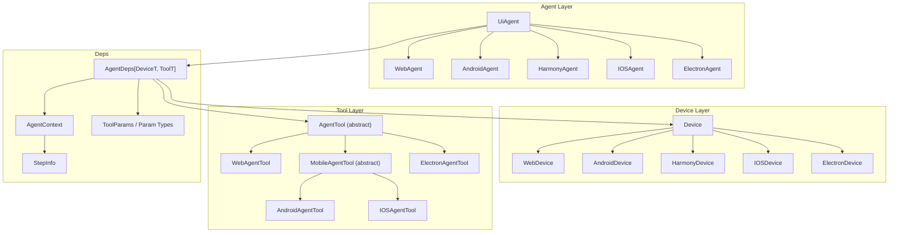
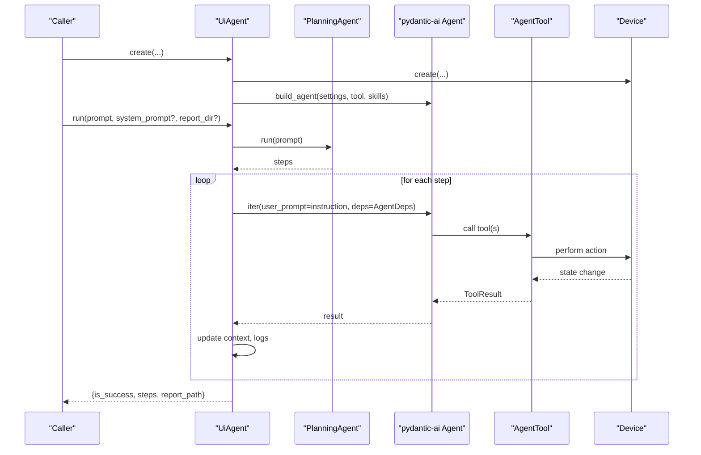
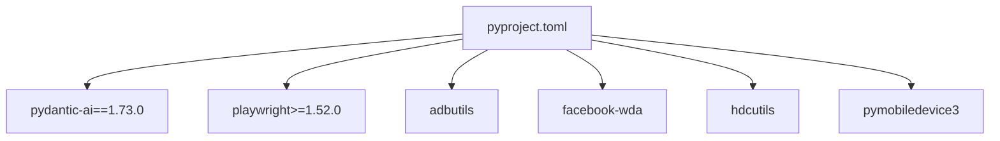

# API Reference

<cite>
**Referenced Files in This Document**
- [agent.py](file://src/page_eyes/agent.py)
- [device.py](file://src/page_eyes/device.py)
- [deps.py](file://src/page_eyes/deps.py)
- [_base.py](file://src/page_eyes/tools/_base.py)
- [web.py](file://src/page_eyes/tools/web.py)
- [android.py](file://src/page_eyes/tools/android.py)
- [_mobile.py](file://src/page_eyes/tools/_mobile.py)
- [electron.py](file://src/page_eyes/tools/electron.py)
- [config.py](file://src/page_eyes/config.py)
- [prompt.py](file://src/page_eyes/prompt.py)
- [pyproject.toml](file://pyproject.toml)
- [test_web_agent.py](file://tests/test_web_agent.py)
- [test_android_agent.py](file://tests/test_android_agent.py)
</cite>

## Table of Contents
1. [Introduction](#introduction)
2. [Project Structure](#project-structure)
3. [Core Components](#core-components)
4. [Architecture Overview](#architecture-overview)
5. [Detailed Component Analysis](#detailed-component-analysis)
6. [Dependency Analysis](#dependency-analysis)
7. [Performance Considerations](#performance-considerations)
8. [Troubleshooting Guide](#troubleshooting-guide)
9. [Conclusion](#conclusion)
10. [Appendices](#appendices)

## Introduction
This document provides a comprehensive API reference for PageEyes Agent. It covers the UiAgent base class and platform-specific agents, the Device interface and implementations, the Tool framework, AgentDeps dependency management, parameter validation rules, return types, exceptions, event handling, asynchronous operations, and usage examples. It also documents prompts, configuration, and testing patterns.

## Project Structure
The API surface centers around:
- UiAgent base class and platform-specific subclasses
- Device abstractions per platform
- Tool framework with platform-specific implementations
- AgentDeps dependency container
- Configuration and prompts

**Diagram sources**
- [agent.py:97-515](file://src/page_eyes/agent.py#L97-L515)
- [device.py:42-390](file://src/page_eyes/device.py#L42-L390)
- [_base.py:130-391](file://src/page_eyes/tools/_base.py#L130-L391)
- [deps.py:75-280](file://src/page_eyes/deps.py#L75-L280)

**Section sources**
- [agent.py:97-515](file://src/page_eyes/agent.py#L97-L515)
- [device.py:42-390](file://src/page_eyes/device.py#L42-L390)
- [_base.py:130-391](file://src/page_eyes/tools/_base.py#L130-L391)
- [deps.py:75-280](file://src/page_eyes/deps.py#L75-L280)

## Core Components
- UiAgent: Base class for all agents. Provides lifecycle, planning, execution, reporting, and logging hooks.
- Platform-specific agents: WebAgent, AndroidAgent, HarmonyAgent, IOSAgent, ElectronAgent.
- Device: Generic device abstraction with platform-specific implementations.
- Tool framework: AgentTool base with platform-specific implementations and decorators for tool invocation.
- AgentDeps: Dependency container holding settings, device, tool, context, and app name mapping.

Key public APIs:
- UiAgent.create(...) factory methods (async) for each platform.
- UiAgent.run(prompt, system_prompt?, report_dir?) -> dict
- Device.create(...) factory methods (async) for each platform.
- Tool framework methods: get_screen, get_screen_info, wait, assert_screen_contains, swipe, open_url, click, input, tear_down, mark_failed, set_task_failed, plus VLM variants.
- AgentDeps types and parameter models for tool calls.

**Section sources**
- [agent.py:97-515](file://src/page_eyes/agent.py#L97-L515)
- [device.py:42-390](file://src/page_eyes/device.py#L42-L390)
- [_base.py:130-391](file://src/page_eyes/tools/_base.py#L130-L391)
- [deps.py:75-280](file://src/page_eyes/deps.py#L75-L280)

## Architecture Overview
High-level flow:
- UiAgent builds a pydantic-ai Agent with skills and tools.
- PlanningAgent decomposes user prompt into steps.
- UiAgent executes steps sequentially, invoking tools and updating context.
- Tools capture screenshots, parse elements, and perform actions.
- Results are aggregated into a report and returned.

**Diagram sources**
- [agent.py:74-314](file://src/page_eyes/agent.py#L74-L314)
- [agent.py:147-169](file://src/page_eyes/agent.py#L147-L169)
- [_base.py:130-391](file://src/page_eyes/tools/_base.py#L130-L391)
- [device.py:42-390](file://src/page_eyes/device.py#L42-L390)

## Detailed Component Analysis

### UiAgent Base Class and Lifecycle
- Factory: UiAgent.create(...) is declared abstract and implemented by platform subclasses.
- Builder: UiAgent.build_agent(settings, tool, skills_dirs, ...) constructs a pydantic-ai Agent with skills capability and tools.
- Lifecycle:
  - run(prompt, system_prompt?, report_dir?): orchestrates planning, step execution, context updates, and report creation.
  - handle_graph_node(node): logs tool calls and results during agent iteration.
  - create_report(report_data, report_dir): writes HTML report.
  - history_processor(ctx, messages): optional message history cleanup for VLM mode.
  - merge_settings(override_settings): merges defaults with overrides.

Public methods and signatures:
- create(...): async factory method (platform-specific).
- build_agent(settings, tool, skills_dirs, **kwargs) -> Agent[AgentDeps].
- run(prompt: str, system_prompt: Optional[str], report_dir: str) -> Awaitable[dict].
- create_report(report_data: str, report_dir: Union[Path, str]) -> Awaitable[Path].
- handle_graph_node(node) -> None.
- history_processor(ctx, messages) -> Awaitable[list].
- merge_settings(override_settings: Settings) -> Settings.

Return values and exceptions:
- run returns a dict with keys: is_success, steps, report_path.
- Exceptions raised by tools propagate as ModelRetry; UnexpectedModelBehavior triggers mark_failed and logs error.

Validation and constraints:
- run enforces single-tool execution per step via ToolHandler.
- Steps are appended to AgentContext with StepInfo; success flags tracked per step.

Asynchronous operations:
- All factories and run methods are async.
- Tool methods use asyncio sleeps and waits.

Event handling and callbacks:
- Logs are emitted for user prompts, tool calls, tool results, and thinking steps.
- Iterates over agent run nodes to update context and logs.

**Section sources**
- [agent.py:97-314](file://src/page_eyes/agent.py#L97-L314)
- [agent.py:147-169](file://src/page_eyes/agent.py#L147-L169)
- [_base.py:39-128](file://src/page_eyes/tools/_base.py#L39-L128)

### Platform-Specific Agents
- WebAgent.create(model?, device?, simulate_device?, headless?, tool?, skills_dirs?, debug?) -> WebAgent
- AndroidAgent.create(model?, serial?, platform?, tool?, skills_dirs?, debug?) -> AndroidAgent
- HarmonyAgent.create(model?, connect_key?, platform?, tool?, skills_dirs?, debug?) -> HarmonyAgent
- IOSAgent.create(model?, wda_url, platform?, tool?, app_name_map?, skills_dirs?, debug?) -> IOSAgent
- ElectronAgent.create(model?, cdp_url?, tool?, skills_dirs?, debug?) -> ElectronAgent

Common parameters:
- model: optional model identifier.
- skills_dirs: optional list of skill directories.
- debug: optional debug flag.
- platform: optional platform enum or string.
- tool: optional platform-specific AgentTool instance.

Platform-specific parameters:
- Web: headless, simulate_device.
- Android/Harmony: serial/connect_key.
- IOS: wda_url, app_name_map.
- Electron: cdp_url.

Exceptions:
- Android/Harmony: connection failures raise exceptions if devices not found or connect fails.
- IOS: WDA connection attempts with auto-start fallback; raises on failure.
- Electron: CDP connection validated; warns on page close events.

**Section sources**
- [agent.py:316-515](file://src/page_eyes/agent.py#L316-L515)
- [device.py:59-390](file://src/page_eyes/device.py#L59-L390)

### Device Interface and Implementations
Generic Device:
- Generic[ClientT, DeviceT]: holds client, target, device_size.
- create(...): abstract factory method.

Concrete Devices:
- WebDevice: Playwright context/page, viewport size, simulate_device, is_mobile.
- AndroidDevice: ADB client/device, platform, device_size.
- HarmonyDevice: HDC client/device, platform, device_size.
- IOSDevice: WDA client/session, platform, device_size; supports auto-start WDA.
- ElectronDevice: Chromium CDP browser/context/page, device_size, page stack, switch_to_latest_page.

Key methods:
- WebDevice.create(headless, simulate_device) -> WebDevice
- AndroidDevice.create(serial?, platform?) -> AndroidDevice
- HarmonyDevice.create(connect_key?, platform?) -> HarmonyDevice
- IOSDevice.create(wda_url, platform?, auto_start_wda?) -> IOSDevice
- ElectronDevice.create(cdp_url) -> ElectronDevice
- ElectronDevice.switch_to_latest_page() -> bool

Validation and constraints:
- WebDevice: sets viewport; mobile simulation via Playwright devices.
- IOSDevice: validates status and session; retries with auto-start.
- ElectronDevice: listens to page close events and auto-switches.

**Section sources**
- [device.py:42-390](file://src/page_eyes/device.py#L42-L390)

### Tool Framework Interfaces
AgentTool (abstract):
- tools property: introspects callable methods decorated with tool(...) and filters by model type.
- get_screen(ctx, parse_element=True) -> ScreenInfo
- get_screen_info(ctx) -> ToolResultWithOutput[dict]
- get_screen_info_vl(ctx) -> ToolReturn
- wait(ctx, params: WaitForKeywordsToolParams) -> ToolResult
- wait_vl(ctx, params: WaitToolParams) -> ToolResult
- expect_screen_contains(ctx, keywords) -> ToolResult
- expect_screen_not_contains(ctx, keywords) -> ToolResult
- assert_screen_contains(ctx, params: AssertContainsParams) -> ToolResult
- assert_screen_not_contains(ctx, params: AssertNotContainsParams) -> ToolResult
- mark_failed(ctx, params: MarkFailedParams) -> ToolResult
- set_task_failed(ctx, params: MarkFailedParams) -> ToolResult
- swipe(ctx, params: SwipeForKeywordsToolParams) -> ToolResult
- swipe_vl(ctx, params: SwipeToolParams) -> ToolResult
- open_url(ctx, params: OpenUrlToolParams) -> ToolResult
- click(ctx, params: ClickToolParams) -> ToolResult
- input(ctx, params: InputToolParams) -> ToolResult
- tear_down(ctx, params: ToolParams) -> ToolResult
- screenshot(ctx) -> abstract BytesIO
- _swipe_for_keywords(ctx, params) -> abstract ToolResult

Decorators and helpers:
- tool(f=None, *, after_delay=0, before_delay=0, llm=True, vlm=True): wraps tool functions, records step info, handles retries and logging.

Platform-specific tools:
- WebAgentTool: Playwright-based actions, highlight overlays, file chooser handling, scroll vs mouse swipe.
- MobileAgentTool: ADB/HDC/WDA-based actions, URL schema handling, app opening via package detection.
- AndroidAgentTool: URL start via shell command.
- ElectronAgentTool: overrides screenshot and click for CDP, window switching, close_window.

Parameter models:
- ToolParams, OpenUrlToolParams, ClickToolParams, InputToolParams, SwipeToolParams, SwipeForKeywordsToolParams, SwipeFromCoordinateToolParams, WaitToolParams, WaitForKeywordsToolParams, AssertContainsParams, AssertNotContainsParams, MarkFailedParams, PlanningStep, PlanningOutputType, StepOutputType, ScreenInfo, StepInfo, AgentContext.

**Section sources**
- [_base.py:130-391](file://src/page_eyes/tools/_base.py#L130-L391)
- [web.py:24-179](file://src/page_eyes/tools/web.py#L24-L179)
- [_mobile.py:27-165](file://src/page_eyes/tools/_mobile.py#L27-L165)
- [android.py:18-23](file://src/page_eyes/tools/android.py#L18-L23)
- [electron.py:21-134](file://src/page_eyes/tools/electron.py#L21-L134)
- [deps.py:25-280](file://src/page_eyes/deps.py#L25-L280)

### AgentDeps and Context
AgentDeps[DeviceT, ToolT]:
- settings: Settings
- device: DeviceT
- tool: ToolT
- context: AgentContext
- app_name_map: dict[str, str]

AgentContext:
- steps: OrderedDict[int, StepInfo]
- current_step: StepInfo
- add_step_info(step_info) -> StepInfo
- update_step_info(**kwargs) -> StepInfo
- set_step_failed(reason) -> None

StepInfo:
- step, description, action, params, image_url, screen_elements, parallel_tool_calls, is_success

ToolParams and derived types:
- ToolParams, OpenUrlToolParams, ClickToolParams, InputToolParams, SwipeToolParams, SwipeForKeywordsToolParams, SwipeFromCoordinateToolParams, WaitToolParams, WaitForKeywordsToolParams, AssertContainsParams, AssertNotContainsParams, MarkFailedParams, PlanningStep, PlanningOutputType, StepOutputType, ScreenInfo.

Validation rules:
- ToolParam fields are Pydantic Fields with descriptions; invalid values raise validation errors.
- Coordinates and offsets constrained by device_size; ClickToolParams supports position and offset.

**Section sources**
- [deps.py:75-280](file://src/page_eyes/deps.py#L75-L280)

### Prompts and Configuration
Prompts:
- PLANNING_SYSTEM_PROMPT: decompose user intent into atomic steps.
- SYSTEM_PROMPT / SYSTEM_PROMPT_VLM: execution guide, element matching, constraints, and rules.

Configuration:
- Settings: model, model_type, model_settings, browser, omni_parser, storage_client, debug.
- BrowserConfig: headless, simulate_device.
- OmniParserConfig: base_url, key.
- CosConfig / MinioConfig: storage credentials and endpoints.

Environment variables:
- Loaded via dotenv; Settings reads from .env with prefixes agent_, browser_, omni_, cos_, minio_.

**Section sources**
- [prompt.py:8-166](file://src/page_eyes/prompt.py#L8-L166)
- [config.py:54-73](file://src/page_eyes/config.py#L54-L73)
- [config.py:40-67](file://src/page_eyes/config.py#L40-L67)

### Usage Examples
Examples are provided in tests demonstrating:
- WebAgent: open URL, swipe until element appears, click, input, go back, upload file, assertions, and relative clicks.
- AndroidAgent: open apps, open URLs, swipe, wait, and element interactions.

See:
- [test_web_agent.py:11-209](file://tests/test_web_agent.py#L11-L209)
- [test_android_agent.py:11-70](file://tests/test_android_agent.py#L11-L70)

**Section sources**
- [test_web_agent.py:11-209](file://tests/test_web_agent.py#L11-L209)
- [test_android_agent.py:11-70](file://tests/test_android_agent.py#L11-L70)

## Dependency Analysis
External dependencies and versions:
- pydantic-ai: 1.73.0
- playwright: >=1.52.0
- adbutils, facebook-wda, hdcutils, pymobiledevice3
- loguru, cos-python-sdk-v5, minio
- pydantic-ai-skills

Versioning and compatibility:
- Project version: 1.3.0
- Development Status: Beta
- Python requirement: >=3.12

**Diagram sources**
- [pyproject.toml:20-32](file://pyproject.toml#L20-L32)

**Section sources**
- [pyproject.toml:1-88](file://pyproject.toml#L1-L88)

## Performance Considerations
- Asynchronous operations: All factories and run methods are async; tools use asyncio sleeps to stabilize UI rendering.
- Element parsing: get_screen optionally parses elements via OmniParser; disable parsing for speed when not needed.
- Parallel tool calls: Enforced single-tool execution per step to prevent race conditions.
- Device-specific delays: Tools include before/after delays to accommodate slow page transitions.
- Reporting: HTML report generation occurs after completion; consider disabling if not needed.

[No sources needed since this section provides general guidance]

## Troubleshooting Guide
Common issues and resolutions:
- Device connection failures:
  - Android/Harmony: ensure device serial/connect_key reachable; verify adb/hdc connectivity.
  - IOS: confirm WebDriverAgent URL and status; enable auto-start WDA if configured.
  - Electron: verify CDP URL and that the app was launched with remote debugging enabled.
- Tool execution errors:
  - Tools catch exceptions and raise ModelRetry; inspect logs for stack traces.
  - mark_failed/set_task_failed can be used to terminate on assertion failures.
- Element not found:
  - Use wait or swipe_until features; ensure parse_element is enabled for element-based actions.
- Concurrency:
  - Single-tool-per-step enforcement prevents conflicts; avoid manual concurrent tool calls.

**Section sources**
- [device.py:106-228](file://src/page_eyes/device.py#L106-L228)
- [device.py:243-292](file://src/page_eyes/device.py#L243-L292)
- [_base.py:88-128](file://src/page_eyes/tools/_base.py#L88-L128)
- [deps.py:236-238](file://src/page_eyes/deps.py#L236-L238)

## Conclusion
PageEyes Agent exposes a clean, extensible API for cross-platform UI automation driven by natural language. The UiAgent base class and platform-specific agents provide consistent lifecycle and execution semantics. The Device and Tool frameworks encapsulate platform specifics and tool invocation, while AgentDeps centralizes dependencies and context. Configuration and prompts guide planning and execution behavior. Tests demonstrate practical usage patterns across platforms.

[No sources needed since this section summarizes without analyzing specific files]

## Appendices

### API Index and Method Specifications

- UiAgent
  - create(...): async factory (platform-specific)
  - build_agent(settings, tool, skills_dirs, **kwargs) -> Agent[AgentDeps]
  - run(prompt, system_prompt?, report_dir?) -> Awaitable[dict]
  - create_report(report_data, report_dir) -> Awaitable[Path]
  - handle_graph_node(node) -> None
  - history_processor(ctx, messages) -> Awaitable[list]
  - merge_settings(override_settings) -> Settings

- WebAgent
  - create(model?, device?, simulate_device?, headless?, tool?, skills_dirs?, debug?) -> WebAgent

- AndroidAgent
  - create(model?, serial?, platform?, tool?, skills_dirs?, debug?) -> AndroidAgent

- HarmonyAgent
  - create(model?, connect_key?, platform?, tool?, skills_dirs?, debug?) -> HarmonyAgent

- IOSAgent
  - create(model?, wda_url, platform?, tool?, app_name_map?, skills_dirs?, debug?) -> IOSAgent

- ElectronAgent
  - create(model?, cdp_url?, tool?, skills_dirs?, debug?) -> ElectronAgent

- Device
  - WebDevice.create(headless, simulate_device) -> WebDevice
  - AndroidDevice.create(serial?, platform?) -> AndroidDevice
  - HarmonyDevice.create(connect_key?, platform?) -> HarmonyDevice
  - IOSDevice.create(wda_url, platform?, auto_start_wda?) -> IOSDevice
  - ElectronDevice.create(cdp_url) -> ElectronDevice
  - ElectronDevice.switch_to_latest_page() -> bool

- Tool Framework
  - AgentTool methods: get_screen, get_screen_info, wait, assert_screen_contains, swipe, open_url, click, input, tear_down, mark_failed, set_task_failed, plus VLM variants.
  - Decorator: tool(after_delay?, before_delay?, llm?, vlm?)

- AgentDeps and Models
  - AgentDeps[DeviceT, ToolT], AgentContext, StepInfo, ToolParams, OpenUrlToolParams, ClickToolParams, InputToolParams, SwipeToolParams, SwipeForKeywordsToolParams, SwipeFromCoordinateToolParams, WaitToolParams, WaitForKeywordsToolParams, AssertContainsParams, AssertNotContainsParams, MarkFailedParams, PlanningStep, PlanningOutputType, StepOutputType, ScreenInfo.

**Section sources**
- [agent.py:97-515](file://src/page_eyes/agent.py#L97-L515)
- [device.py:42-390](file://src/page_eyes/device.py#L42-L390)
- [_base.py:130-391](file://src/page_eyes/tools/_base.py#L130-L391)
- [deps.py:75-280](file://src/page_eyes/deps.py#L75-L280)