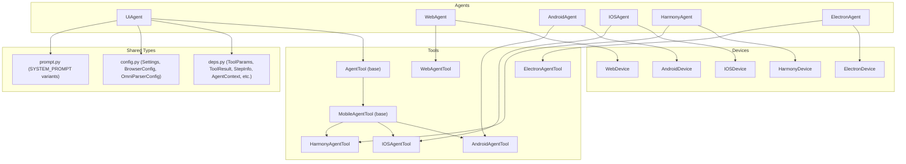
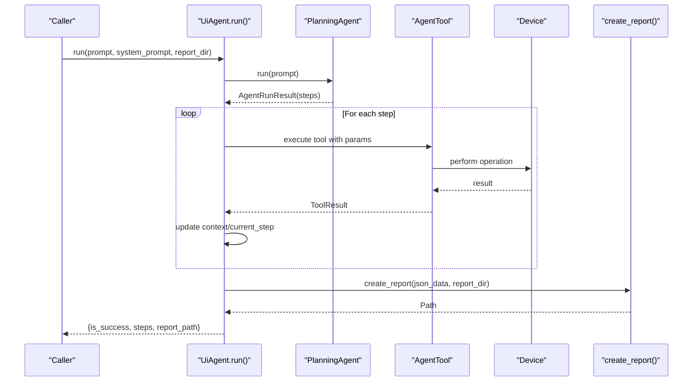
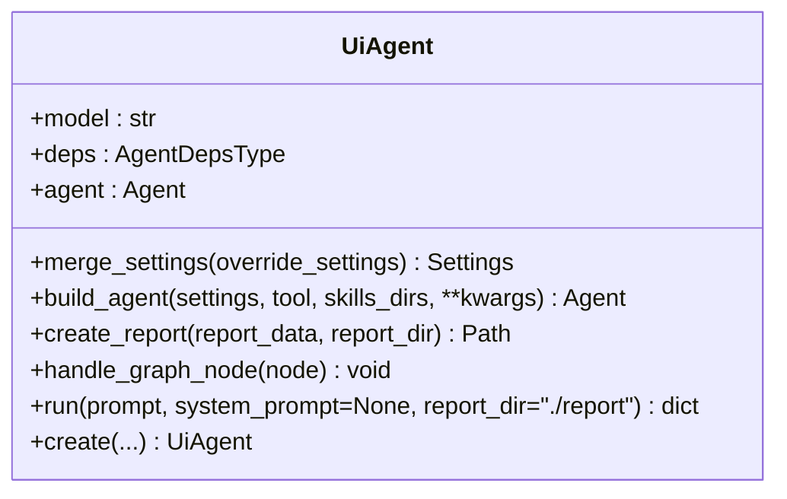
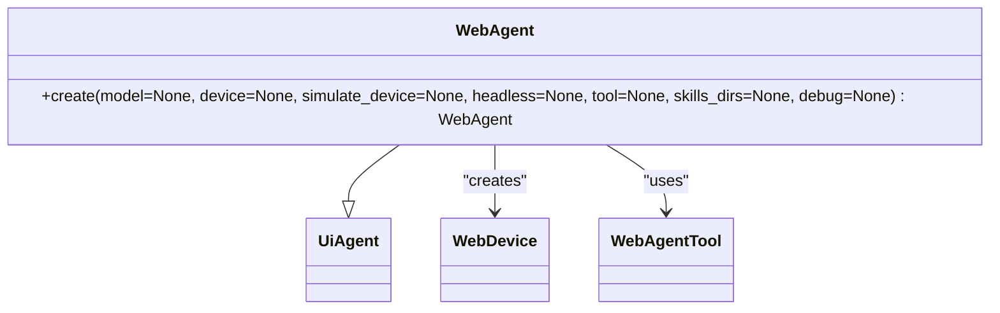
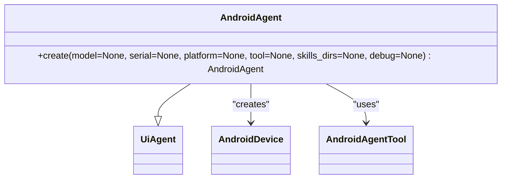
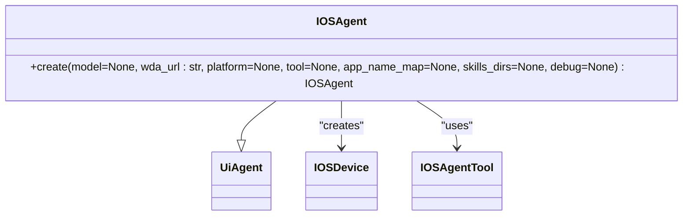
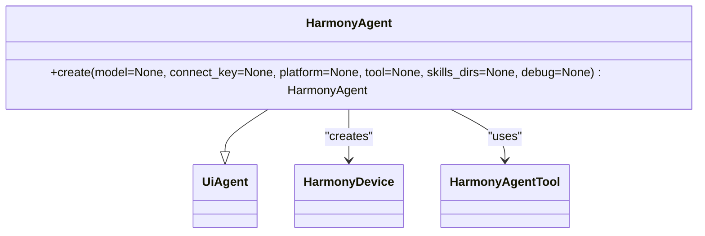
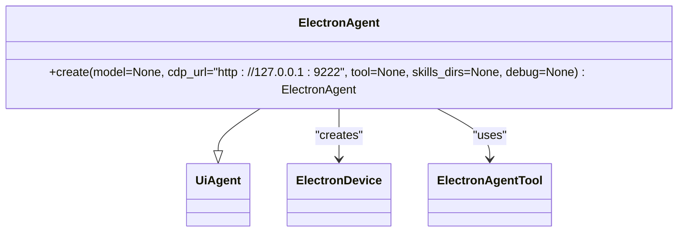
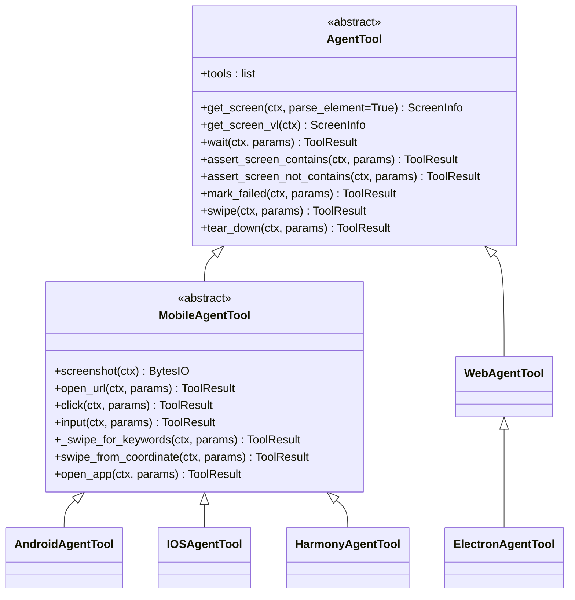
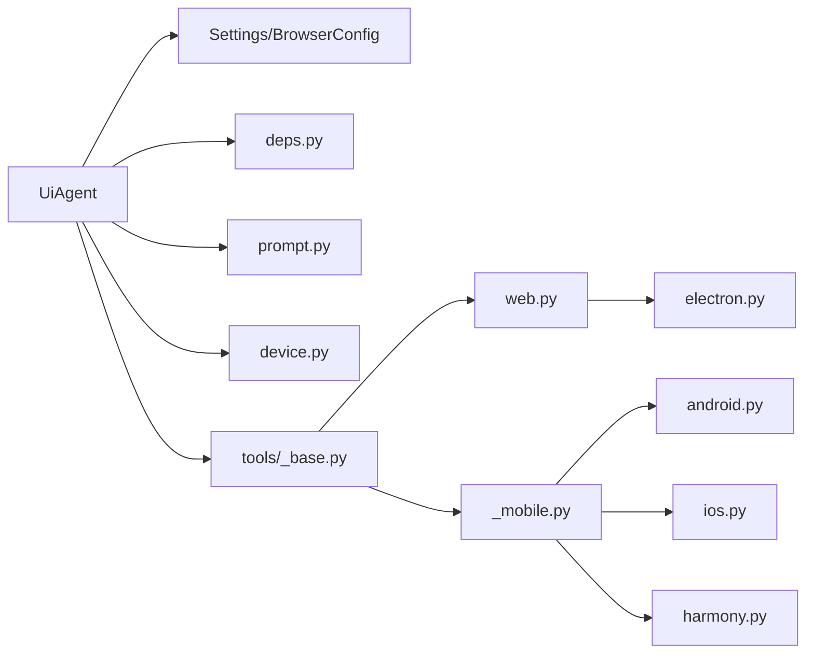

# Agent Classes

<cite>
**Referenced Files in This Document**
- [agent.py](file://src/page_eyes/agent.py)
- [web.py](file://src/page_eyes/tools/web.py)
- [android.py](file://src/page_eyes/tools/android.py)
- [ios.py](file://src/page_eyes/tools/ios.py)
- [harmony.py](file://src/page_eyes/tools/harmony.py)
- [_base.py](file://src/page_eyes/tools/_base.py)
- [_mobile.py](file://src/page_eyes/tools/_mobile.py)
- [electron.py](file://src/page_eyes/tools/electron.py)
- [deps.py](file://src/page_eyes/deps.py)
- [config.py](file://src/page_eyes/config.py)
- [device.py](file://src/page_eyes/device.py)
- [prompt.py](file://src/page_eyes/prompt.py)
</cite>

## Table of Contents
1. [Introduction](#introduction)
2. [Project Structure](#project-structure)
3. [Core Components](#core-components)
4. [Architecture Overview](#architecture-overview)
5. [Detailed Component Analysis](#detailed-component-analysis)
6. [Dependency Analysis](#dependency-analysis)
7. [Performance Considerations](#performance-considerations)
8. [Troubleshooting Guide](#troubleshooting-guide)
9. [Conclusion](#conclusion)

## Introduction
This document provides comprehensive API documentation for PageEyes Agent classes, focusing on the UiAgent base class and all platform-specific agent implementations. It covers method signatures, parameter descriptions, return values, exception handling, lifecycle, initialization patterns, resource management, validation rules, and debugging information. It also documents platform-specific agents (WebAgent, AndroidAgent, IOSAgent, HarmonyAgent, ElectronAgent) and their unique create() factory methods, configuration options, and usage examples.

## Project Structure
The agent system is organized around a shared UiAgent base class and platform-specific subclasses. Each subclass pairs with a device abstraction and a specialized toolset. Shared abstractions include:
- Agent base and platform-specific agents: UiAgent, WebAgent, AndroidAgent, IOSAgent, HarmonyAgent, ElectronAgent
- Tools: AgentTool (base), MobileAgentTool (shared mobile logic), and platform-specific tools
- Device abstractions: WebDevice, AndroidDevice, IOSDevice, HarmonyDevice, ElectronDevice
- Dependent types and parameters: ToolParams, ToolResult, StepInfo, AgentContext, and others
- Configuration and prompts: Settings, BrowserConfig, OmniParserConfig, SYSTEM_PROMPT variants

**Diagram sources**
- [agent.py:96-515](file://src/page_eyes/agent.py#L96-L515)
- [web.py:24-179](file://src/page_eyes/tools/web.py#L24-L179)
- [android.py:18-23](file://src/page_eyes/tools/android.py#L18-L23)
- [ios.py:24-293](file://src/page_eyes/tools/ios.py#L24-L293)
- [harmony.py:20-68](file://src/page_eyes/tools/harmony.py#L20-L68)
- [electron.py:21-134](file://src/page_eyes/tools/electron.py#L21-L134)
- [_base.py:130-391](file://src/page_eyes/tools/_base.py#L130-L391)
- [_mobile.py:27-165](file://src/page_eyes/tools/_mobile.py#L27-L165)
- [device.py:42-390](file://src/page_eyes/device.py#L42-L390)
- [deps.py:25-280](file://src/page_eyes/deps.py#L25-L280)
- [config.py:40-73](file://src/page_eyes/config.py#L40-L73)
- [prompt.py:8-166](file://src/page_eyes/prompt.py#L8-L166)

**Section sources**
- [agent.py:96-515](file://src/page_eyes/agent.py#L96-L515)
- [device.py:42-390](file://src/page_eyes/device.py#L42-L390)
- [deps.py:25-280](file://src/page_eyes/deps.py#L25-L280)
- [config.py:40-73](file://src/page_eyes/config.py#L40-L73)
- [prompt.py:8-166](file://src/page_eyes/prompt.py#L8-L166)

## Core Components
This section documents the UiAgent base class and platform-specific agents, including their factory methods, parameters, and behavior.

- UiAgent
  - Methods:
    - merge_settings(override_settings): Merges provided settings with defaults and logs the result. Returns Settings.
    - build_agent(settings, tool, skills_dirs, **kwargs): Builds a Pydantic AI Agent with tools and skills capability. Returns Agent.
    - create_report(report_data, report_dir): Creates an HTML report file from JSON data. Returns Path.
    - handle_graph_node(node): Logs and tracks tool calls and results during agent runs.
    - run(prompt, system_prompt=None, report_dir="./report"): Orchestrates planning, step execution, usage tracking, and report generation. Returns dict with keys: is_success, steps, report_path.
    - create(...): Abstract factory method (platform-specific subclasses implement).

- Platform-specific Agents
  - WebAgent.create(model=None, device=None, simulate_device=None, headless=None, tool=None, skills_dirs=None, debug=None) -> WebAgent
  - AndroidAgent.create(model=None, serial=None, platform=None, tool=None, skills_dirs=None, debug=None) -> AndroidAgent
  - IOSAgent.create(model=None, wda_url: str, platform=None, tool=None, app_name_map=None, skills_dirs=None, debug=None) -> IOSAgent
  - HarmonyAgent.create(model=None, connect_key=None, platform=None, tool=None, skills_dirs=None, debug=None) -> HarmonyAgent
  - ElectronAgent.create(model=None, cdp_url="http://127.0.0.1:9222", tool=None, skills_dirs=None, debug=None) -> ElectronAgent

Parameter validation and behavior:
- Optional parameters accept None to defer to defaults.
- Platform-specific agents validate connectivity and device availability (e.g., adb/hdc connections, WDA status).
- Settings are merged via merge_settings; defaults come from Settings and BrowserConfig.
- Tool selection respects model_type (LLM vs VLM) and tool capability flags.

Return values:
- create() factory methods return the respective agent instances.
- run() returns a structured dict containing success flag, step details, and report path.
- create_report() returns the generated report Path.

Exception handling:
- UnexpectedModelBehavior during run() triggers marking the step as failed and logging the error.
- Tool decorators wrap operations and raise ModelRetry on exceptions, enabling automatic retries.
- Device creation methods raise exceptions for connection failures or missing devices.

**Section sources**
- [agent.py:102-314](file://src/page_eyes/agent.py#L102-L314)
- [agent.py:316-515](file://src/page_eyes/agent.py#L316-L515)

## Architecture Overview
The agent architecture follows a layered design:
- UiAgent orchestrates planning and execution, delegates to platform-specific tools, and manages reporting.
- Each platform agent builds an Agent with a skills capability and a toolset specific to the platform.
- Devices encapsulate platform-specific clients and expose a unified interface for operations.
- Tools implement atomic actions (click, input, swipe, open_url, etc.) and leverage device APIs.

**Diagram sources**
- [agent.py:217-314](file://src/page_eyes/agent.py#L217-L314)
- [prompt.py:8-103](file://src/page_eyes/prompt.py#L8-L103)

**Section sources**
- [agent.py:217-314](file://src/page_eyes/agent.py#L217-L314)
- [prompt.py:8-103](file://src/page_eyes/prompt.py#L8-L103)

## Detailed Component Analysis

### UiAgent Base Class
UiAgent defines the core orchestration logic:
- merge_settings: Deep merges override settings into default Settings and logs the result.
- build_agent: Constructs a Pydantic AI Agent with system prompt, model settings, tools, and skills capability.
- create_report: Renders a report from JSON data and writes an HTML file.
- handle_graph_node: Logs tool calls and results, updates parallel_tool_calls flag.
- run: Executes planning, iterates steps, handles exceptions, collects usage, and generates a report.

Key behaviors:
- Uses PlanningAgent to decompose user prompts into executable steps.
- Iterates agent steps, logs progress, and updates context state.
- On UnexpectedModelBehavior, marks the current step as failed and continues.
- Ensures a screenshot is captured after each step if none exists.

**Diagram sources**
- [agent.py:96-314](file://src/page_eyes/agent.py#L96-L314)

**Section sources**
- [agent.py:96-314](file://src/page_eyes/agent.py#L96-L314)

### WebAgent
WebAgent specializes UiAgent for web automation:
- Factory parameters:
  - model: Optional[str]
  - device: Optional[WebDevice]
  - simulate_device: Optional[SimulateDeviceType]
  - headless: Optional[bool]
  - tool: Optional[WebAgentTool]
  - skills_dirs: Optional[list[str | Path]]
  - debug: Optional[bool]
- Behavior:
  - Merges settings with BrowserConfig (headless, simulate_device).
  - Creates WebDevice if not provided.
  - Builds Agent with WebAgentTool and skills capability.
  - Returns WebAgent instance.

Validation and defaults:
- simulate_device must be a known device name from Playwright devices.
- headless toggles browser visibility.

**Diagram sources**
- [agent.py:316-363](file://src/page_eyes/agent.py#L316-L363)
- [device.py:54-100](file://src/page_eyes/device.py#L54-L100)
- [web.py:24-179](file://src/page_eyes/tools/web.py#L24-L179)

**Section sources**
- [agent.py:316-363](file://src/page_eyes/agent.py#L316-L363)
- [device.py:54-100](file://src/page_eyes/device.py#L54-L100)
- [web.py:24-179](file://src/page_eyes/tools/web.py#L24-L179)

### AndroidAgent
AndroidAgent specializes UiAgent for Android:
- Factory parameters:
  - model: Optional[str]
  - serial: Optional[str]
  - platform: Optional[str | Platform]
  - tool: Optional[AndroidAgentTool]
  - skills_dirs: Optional[list[str | Path]]
  - debug: Optional[bool]
- Behavior:
  - Merges settings.
  - Creates AndroidDevice via ADB/HDC connections.
  - Builds Agent with AndroidAgentTool and skills capability.
  - Returns AndroidAgent instance.

Validation and defaults:
- If serial is provided, connects to the device; otherwise uses the first available device.
- Raises exceptions if no device is found or connection fails.

**Diagram sources**
- [agent.py:365-401](file://src/page_eyes/agent.py#L365-L401)
- [device.py:103-127](file://src/page_eyes/device.py#L103-L127)
- [android.py:18-23](file://src/page_eyes/tools/android.py#L18-L23)

**Section sources**
- [agent.py:365-401](file://src/page_eyes/agent.py#L365-L401)
- [device.py:103-127](file://src/page_eyes/device.py#L103-L127)
- [android.py:18-23](file://src/page_eyes/tools/android.py#L18-L23)

### IOSAgent
IOSAgent specializes UiAgent for iOS:
- Factory parameters:
  - model: Optional[str]
  - wda_url: str
  - platform: Optional[str | Platform]
  - tool: Optional[IOSAgentTool]
  - app_name_map: Optional[dict[str, str]]
  - skills_dirs: Optional[list[str | Path]]
  - debug: Optional[bool]
- Behavior:
  - Merges settings.
  - Creates IOSDevice via WDA; attempts to start WDA automatically if configured.
  - Builds Agent with IOSAgentTool and skills capability.
  - Returns IOSAgent instance.

Validation and defaults:
- Requires wda_url; raises exceptions if connection fails.
- Supports app_name_map for resolving app identifiers.

**Diagram sources**
- [agent.py:441-478](file://src/page_eyes/agent.py#L441-L478)
- [device.py:159-228](file://src/page_eyes/device.py#L159-L228)
- [ios.py:24-293](file://src/page_eyes/tools/ios.py#L24-L293)

**Section sources**
- [agent.py:441-478](file://src/page_eyes/agent.py#L441-L478)
- [device.py:159-228](file://src/page_eyes/device.py#L159-L228)
- [ios.py:24-293](file://src/page_eyes/tools/ios.py#L24-L293)

### HarmonyAgent
HarmonyAgent specializes UiAgent for HarmonyOS:
- Factory parameters:
  - model: Optional[str]
  - connect_key: Optional[str]
  - platform: Optional[str | Platform]
  - tool: Optional[HarmonyAgentTool]
  - skills_dirs: Optional[list[str | Path]]
  - debug: Optional[bool]
- Behavior:
  - Merges settings.
  - Creates HarmonyDevice via HDC connections.
  - Builds Agent with HarmonyAgentTool and skills capability.
  - Returns HarmonyAgent instance.

Validation and defaults:
- If connect_key is provided, connects to the device; otherwise uses the first available device.
- Raises exceptions if no device is found or connection fails.

**Diagram sources**
- [agent.py:403-439](file://src/page_eyes/agent.py#L403-L439)
- [device.py:130-156](file://src/page_eyes/device.py#L130-L156)
- [harmony.py:20-68](file://src/page_eyes/tools/harmony.py#L20-L68)

**Section sources**
- [agent.py:403-439](file://src/page_eyes/agent.py#L403-L439)
- [device.py:130-156](file://src/page_eyes/device.py#L130-L156)
- [harmony.py:20-68](file://src/page_eyes/tools/harmony.py#L20-L68)

### ElectronAgent
ElectronAgent specializes UiAgent for Electron desktop apps:
- Factory parameters:
  - model: Optional[str]
  - cdp_url: str = "http://127.0.0.1:9222"
  - tool: Optional[ElectronAgentTool]
  - skills_dirs: Optional[list[str | Path]]
  - debug: Optional[bool]
- Behavior:
  - Merges settings.
  - Creates ElectronDevice via CDP connection.
  - Builds Agent with ElectronAgentTool and skills capability.
  - Returns ElectronAgent instance.

Validation and defaults:
- Requires a running Electron app with remote debugging enabled.
- Automatically switches to latest page and manages page stack.

**Diagram sources**
- [agent.py:480-515](file://src/page_eyes/agent.py#L480-L515)
- [device.py:231-293](file://src/page_eyes/device.py#L231-L293)
- [electron.py:21-134](file://src/page_eyes/tools/electron.py#L21-L134)

**Section sources**
- [agent.py:480-515](file://src/page_eyes/agent.py#L480-L515)
- [device.py:231-293](file://src/page_eyes/device.py#L231-L293)
- [electron.py:21-134](file://src/page_eyes/tools/electron.py#L21-L134)

### Tool Abstractions and Platform Tools
AgentTool and MobileAgentTool define the shared tool interface and common behaviors:
- Tool registration: tools property enumerates callable methods decorated with tool().
- Screenshot and screen parsing: get_screen/get_screen_vl capture images and upload or parse elements.
- Assertions and waits: expect_screen_contains/not_contains, assert_screen_contains/not_contains, wait/wait_vl.
- Failure marking: mark_failed/set_task_failed.
- Swipe helpers: swipe/swipe_vl and _swipe_for_keywords.
- Tear down: platform-specific cleanup.

Platform-specific tools:
- WebAgentTool: Implements web-specific click/input/open_url/goback with Playwright.
- AndroidAgentTool: Extends MobileAgentTool; starts URLs via shell command.
- IOSAgentTool: Implements iOS-specific click/input/swipe_from_coordinate/open_url/home/open_app with WebDriverAgent.
- HarmonyAgentTool: Implements Harmony-specific input/open_app with shell commands.
- ElectronAgentTool: Extends WebAgentTool; adds close_window and special handling for multiple windows.

**Diagram sources**
- [_base.py:130-391](file://src/page_eyes/tools/_base.py#L130-L391)
- [_mobile.py:27-165](file://src/page_eyes/tools/_mobile.py#L27-L165)
- [web.py:24-179](file://src/page_eyes/tools/web.py#L24-L179)
- [android.py:18-23](file://src/page_eyes/tools/android.py#L18-L23)
- [ios.py:24-293](file://src/page_eyes/tools/ios.py#L24-L293)
- [harmony.py:20-68](file://src/page_eyes/tools/harmony.py#L20-L68)
- [electron.py:21-134](file://src/page_eyes/tools/electron.py#L21-L134)

**Section sources**
- [_base.py:130-391](file://src/page_eyes/tools/_base.py#L130-L391)
- [_mobile.py:27-165](file://src/page_eyes/tools/_mobile.py#L27-L165)
- [web.py:24-179](file://src/page_eyes/tools/web.py#L24-L179)
- [android.py:18-23](file://src/page_eyes/tools/android.py#L18-L23)
- [ios.py:24-293](file://src/page_eyes/tools/ios.py#L24-L293)
- [harmony.py:20-68](file://src/page_eyes/tools/harmony.py#L20-L68)
- [electron.py:21-134](file://src/page_eyes/tools/electron.py#L21-L134)

### Parameter Validation Rules and Data Types
- Settings and BrowserConfig:
  - model: Optional[str]
  - model_type: Optional[Literal["vlm","llm"]]
  - model_settings: ModelSettings
  - browser.headless: Optional[bool]
  - browser.simulate_device: Optional[Literal["iPhone 15","iPhone 15 Pro","iPhone 15 Pro Max","iPhone 6"] | str]
  - debug: Optional[bool]
- ToolParams and derived types:
  - ToolParams.action: str
  - OpenUrlToolParams.url: str
  - ClickToolParams.position: Optional[Literal["left","right","top","bottom"]]
  - ClickToolParams.offset: Optional[float]
  - ClickToolParams.file_path: Optional[Path]
  - InputToolParams.text: str
  - InputToolParams.send_enter: bool
  - SwipeToolParams.to: Literal["left","right","top","bottom"]
  - SwipeToolParams.repeat_times: Optional[int]
  - SwipeForKeywordsToolParams.expect_keywords: Optional[list[str]]
  - SwipeFromCoordinateToolParams.coordinates: conlist[tuple[int,int], min_length=2]
  - WaitToolParams.timeout: int
  - WaitForKeywordsToolParams.timeout: int
  - WaitForKeywordsToolParams.expect_keywords: Optional[list[str]]
  - AssertContainsParams.expect_keywords: list[str]
  - AssertNotContainsParams.unexpect_keywords: list[str]
  - MarkFailedParams.reason: str

Validation behavior:
- PositionType accepts only predefined literal values.
- Repeat times defaults to 1; if expect_keywords is present and repeat_times is None, defaults to 10.
- Coordinates must form at least two points for swipe_from_coordinate.
- Tool decorators enforce single-tool execution and raise ModelRetry on exceptions.

**Section sources**
- [config.py:40-73](file://src/page_eyes/config.py#L40-L73)
- [deps.py:85-280](file://src/page_eyes/deps.py#L85-L280)

### Usage Examples
- WebAgent:
  - Create with headless mode and simulated device:
    - WebAgent.create(model="openai:gpt-4o", headless=True, simulate_device="iPhone 15 Pro")
  - Open a URL:
    - ToolParams(instruction="Open example site", action="open_url", url="https://example.com")
- AndroidAgent:
  - Create with serial and platform:
    - AndroidAgent.create(model="openai:gpt-4o", serial="emulator-5554", platform="QY")
  - Input text:
    - InputToolParams(instruction="Enter password", action="input", text="secret", send_enter=True)
- IOSAgent:
  - Create with WDA URL and app_name_map:
    - IOSAgent.create(model="openai:gpt-4o", wda_url="http://localhost:8100", app_name_map={"Messages":"com.apple.MobileSMS"})
  - Open app:
    - ToolParams(instruction="Open Messages", action="open_app")
- HarmonyAgent:
  - Create with connect_key:
    - HarmonyAgent.create(model="openai:gpt-4o", connect_key="device-key", platform="QY")
  - Input text:
    - InputToolParams(instruction="Enter text", action="input", text="Hello", send_enter=True)
- ElectronAgent:
  - Create with CDP URL:
    - ElectronAgent.create(model="openai:gpt-4o", cdp_url="http://127.0.0.1:9222")
  - Close window:
    - ToolParams(instruction="Close window", action="close_window")

Notes:
- Replace "openai:gpt-4o" with your configured model string.
- Ensure platform-specific prerequisites are met (ADB/HDC/WDA/Electron debugging port).

**Section sources**
- [agent.py:316-515](file://src/page_eyes/agent.py#L316-L515)
- [web.py:46-52](file://src/page_eyes/tools/web.py#L46-L52)
- [android.py:20-22](file://src/page_eyes/tools/android.py#L20-L22)
- [ios.py:241-292](file://src/page_eyes/tools/ios.py#L241-L292)
- [harmony.py:27-37](file://src/page_eyes/tools/harmony.py#L27-L37)
- [electron.py:90-114](file://src/page_eyes/tools/electron.py#L90-L114)

## Dependency Analysis
UiAgent depends on:
- Settings and BrowserConfig for runtime configuration
- AgentDeps for device/tool/context binding
- Skills capability for tool discovery and execution
- Device abstractions for platform-specific operations
- Tool abstractions for atomic actions

**Diagram sources**
- [agent.py:36-57](file://src/page_eyes/agent.py#L36-L57)
- [config.py:40-73](file://src/page_eyes/config.py#L40-L73)
- [deps.py:25-280](file://src/page_eyes/deps.py#L25-L280)
- [prompt.py:8-166](file://src/page_eyes/prompt.py#L8-L166)
- [device.py:42-390](file://src/page_eyes/device.py#L42-L390)
- [_base.py:130-391](file://src/page_eyes/tools/_base.py#L130-L391)
- [web.py:24-179](file://src/page_eyes/tools/web.py#L24-L179)
- [_mobile.py:27-165](file://src/page_eyes/tools/_mobile.py#L27-L165)
- [android.py:18-23](file://src/page_eyes/tools/android.py#L18-L23)
- [ios.py:24-293](file://src/page_eyes/tools/ios.py#L24-L293)
- [harmony.py:20-68](file://src/page_eyes/tools/harmony.py#L20-L68)
- [electron.py:21-134](file://src/page_eyes/tools/electron.py#L21-L134)

**Section sources**
- [agent.py:36-57](file://src/page_eyes/agent.py#L36-L57)
- [config.py:40-73](file://src/page_eyes/config.py#L40-L73)
- [deps.py:25-280](file://src/page_eyes/deps.py#L25-L280)
- [prompt.py:8-166](file://src/page_eyes/prompt.py#L8-L166)
- [device.py:42-390](file://src/page_eyes/device.py#L42-L390)
- [_base.py:130-391](file://src/page_eyes/tools/_base.py#L130-L391)
- [web.py:24-179](file://src/page_eyes/tools/web.py#L24-L179)
- [_mobile.py:27-165](file://src/page_eyes/tools/_mobile.py#L27-L165)
- [android.py:18-23](file://src/page_eyes/tools/android.py#L18-L23)
- [ios.py:24-293](file://src/page_eyes/tools/ios.py#L24-L293)
- [harmony.py:20-68](file://src/page_eyes/tools/harmony.py#L20-L68)
- [electron.py:21-134](file://src/page_eyes/tools/electron.py#L21-L134)

## Performance Considerations
- Tool delays: Decorators introduce before_delay and after_delay to accommodate rendering and stability.
- Parallel tool calls: The system enforces single-tool execution per step to prevent race conditions.
- Retry mechanism: ModelRetry is raised on tool exceptions to enable automatic retries.
- VLM vs LLM: Tool filtering respects model_type to avoid incompatible tools.
- Device sizing: Screenshots and swipes adapt to device viewport sizes to reduce misalignment.

[No sources needed since this section provides general guidance]

## Troubleshooting Guide
Common issues and resolutions:
- UnexpectedModelBehavior during run():
  - The current step is marked failed and logged; review tool parameters and device state.
- Tool exceptions:
  - Exceptions are caught and re-raised as ModelRetry; verify device connectivity and parameters.
- Device connection failures:
  - Android: Ensure ADB is running and devices are connected; serial must be valid.
  - iOS: Verify WDA URL and status; configure auto-start if needed.
  - Harmony: Confirm HDC connectivity and device availability.
  - Electron: Ensure remote debugging port is open and accessible.
- Parameter validation errors:
  - PositionType must be one of the allowed literals.
  - Swipe coordinates must form at least two points.
  - Expect keywords must be provided when using swipe_with_keywords expectations.

Debugging tips:
- Enable debug mode in Settings to increase verbosity.
- Inspect report_path returned by run() for step-by-step outcomes.
- Use get_screen_info to verify element detection and coordinates.

**Section sources**
- [agent.py:264-271](file://src/page_eyes/agent.py#L264-L271)
- [_base.py:112-118](file://src/page_eyes/tools/_base.py#L112-L118)
- [device.py:107-126](file://src/page_eyes/device.py#L107-L126)
- [device.py:164-228](file://src/page_eyes/device.py#L164-L228)
- [device.py:134-156](file://src/page_eyes/device.py#L134-L156)
- [device.py:244-293](file://src/page_eyes/device.py#L244-L293)

## Conclusion
The PageEyes Agent system provides a robust, extensible framework for cross-platform UI automation. The UiAgent base class centralizes planning, execution, and reporting, while platform-specific agents encapsulate device and tool specifics. The tool abstractions ensure consistent behavior across platforms, and the configuration system enables flexible runtime customization. By following the documented parameters, validation rules, and lifecycle patterns, developers can reliably deploy agents across web, Android, iOS, Harmony, and Electron environments.