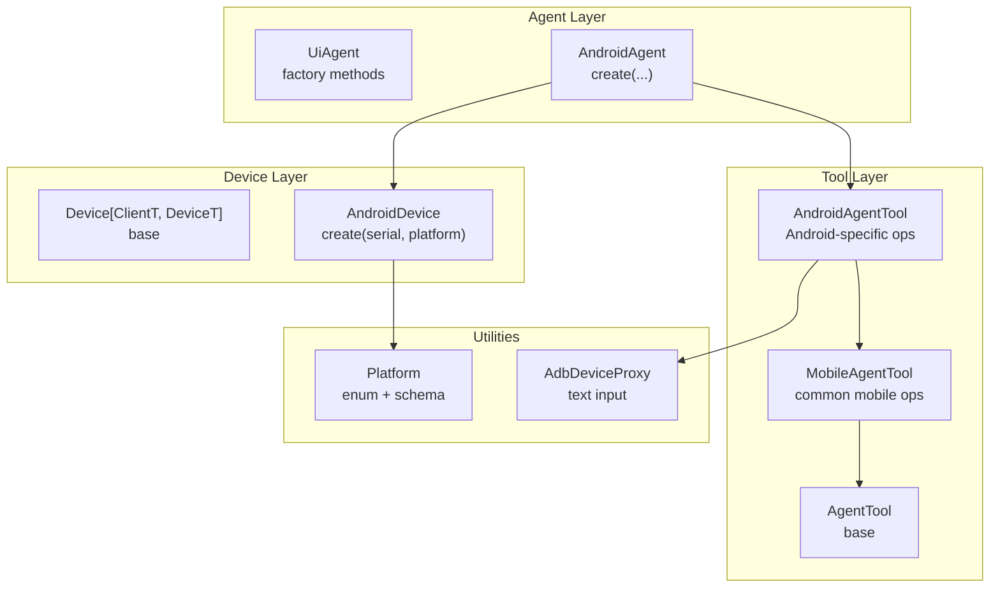
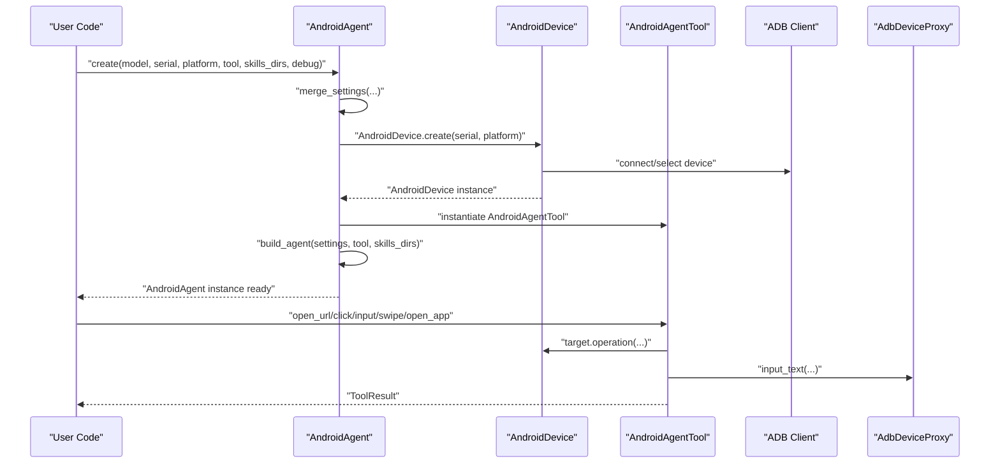
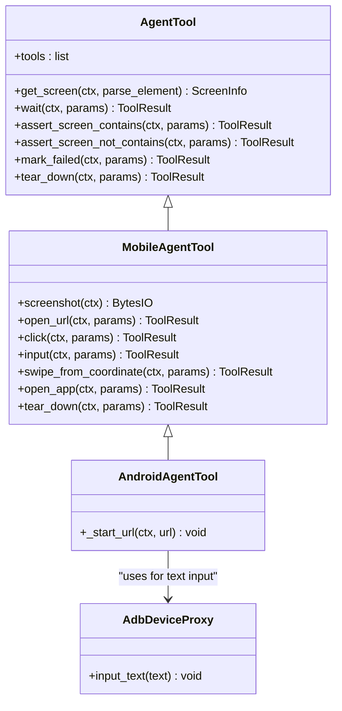
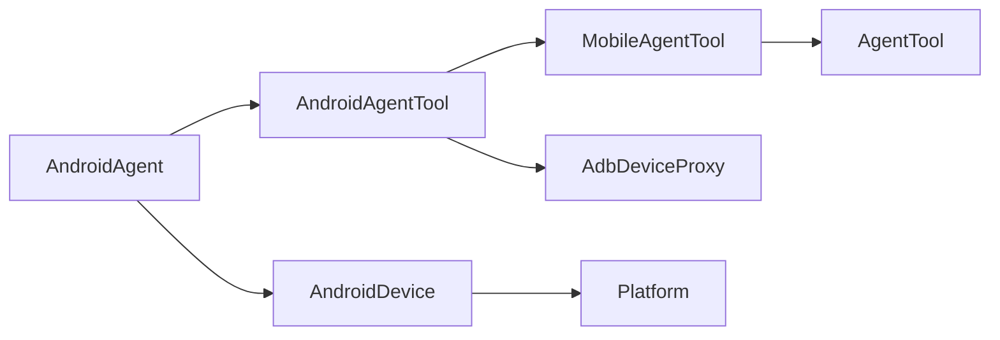

# AndroidAgent

<cite>
**Referenced Files in This Document**
- [agent.py](file://src/page_eyes/agent.py)
- [device.py](file://src/page_eyes/device.py)
- [android.py](file://src/page_eyes/tools/android.py)
- [_mobile.py](file://src/page_eyes/tools/_mobile.py)
- [_base.py](file://src/page_eyes/tools/_base.py)
- [platform.py](file://src/page_eyes/util/platform.py)
- [adb_tool.py](file://src/page_eyes/util/adb_tool.py)
- [deps.py](file://src/page_eyes/deps.py)
- [test_android_agent.py](file://tests/test_android_agent.py)
- [README.md](file://README.md)
</cite>

## Table of Contents
1. [Introduction](#introduction)
2. [Project Structure](#project-structure)
3. [Core Components](#core-components)
4. [Architecture Overview](#architecture-overview)
5. [Detailed Component Analysis](#detailed-component-analysis)
6. [Dependency Analysis](#dependency-analysis)
7. [Performance Considerations](#performance-considerations)
8. [Troubleshooting Guide](#troubleshooting-guide)
9. [Conclusion](#conclusion)
10. [Appendices](#appendices)

## Introduction
This document provides comprehensive API documentation for the AndroidAgent class, focusing on Android mobile device automation. It explains the AndroidAgent.create() factory method, Android device connection via AndroidDevice.create(), the AndroidAgentTool usage for mobile-specific operations (touch gestures, text input, app interactions), platform-specific considerations, practical examples, and error handling strategies.

## Project Structure
The Android automation stack is organized around a generic agent framework with platform-specific devices and tools:
- Agent factory methods orchestrate settings, device creation, tool instantiation, and skill capability registration.
- AndroidDevice encapsulates ADB-based device connections and exposes device metrics.
- AndroidAgentTool extends the shared MobileAgentTool to implement Android-specific operations.
- Utility modules provide platform URL schema generation, ADB proxy helpers, and shared tooling.

**Diagram sources**
- [agent.py:365-401](file://src/page_eyes/agent.py#L365-L401)
- [device.py:102-127](file://src/page_eyes/device.py#L102-L127)
- [android.py:18-23](file://src/page_eyes/tools/android.py#L18-L23)
- [_mobile.py:27-165](file://src/page_eyes/tools/_mobile.py#L27-L165)
- [platform.py:14-66](file://src/page_eyes/util/platform.py#L14-L66)
- [adb_tool.py:12-37](file://src/page_eyes/util/adb_tool.py#L12-L37)

**Section sources**
- [agent.py:365-401](file://src/page_eyes/agent.py#L365-L401)
- [device.py:102-127](file://src/page_eyes/device.py#L102-L127)
- [android.py:18-23](file://src/page_eyes/tools/android.py#L18-L23)
- [_mobile.py:27-165](file://src/page_eyes/tools/_mobile.py#L27-L165)
- [platform.py:14-66](file://src/page_eyes/util/platform.py#L14-L66)
- [adb_tool.py:12-37](file://src/page_eyes/util/adb_tool.py#L12-L37)

## Core Components
- AndroidAgent.create(model, serial, platform, tool, skills_dirs, debug): Factory method to create an AndroidAgent instance. It merges settings, creates an AndroidDevice, instantiates AndroidAgentTool if not provided, builds the agent with skills, and returns the configured AndroidAgent.
- AndroidDevice.create(serial, platform): Creates an Android device connection using ADB. It supports connecting by serial or selecting the first available device, retrieves device window size, and stores platform metadata.
- AndroidAgentTool: Extends MobileAgentTool with Android-specific URL opening and inherits common mobile operations (click, input, swipe, open_app, screenshot, get_screen, assertions, waits).
- Platform: Enumerates supported platforms and provides URL schema generation for platform-aware client intents.
- AdbDeviceProxy: Wraps ADB device operations to inject text via a helper binary.

**Section sources**
- [agent.py:368-400](file://src/page_eyes/agent.py#L368-L400)
- [device.py:106-126](file://src/page_eyes/device.py#L106-L126)
- [android.py:18-23](file://src/page_eyes/tools/android.py#L18-L23)
- [_mobile.py:27-165](file://src/page_eyes/tools/_mobile.py#L27-L165)
- [platform.py:14-66](file://src/page_eyes/util/platform.py#L14-L66)
- [adb_tool.py:12-37](file://src/page_eyes/util/adb_tool.py#L12-L37)

## Architecture Overview
The Android automation pipeline integrates the agent, device, and tool layers with platform-aware URL handling and ADB-based operations.

**Diagram sources**
- [agent.py:368-400](file://src/page_eyes/agent.py#L368-L400)
- [device.py:106-126](file://src/page_eyes/device.py#L106-L126)
- [android.py:18-23](file://src/page_eyes/tools/android.py#L18-L23)
- [_mobile.py:27-165](file://src/page_eyes/tools/_mobile.py#L27-L165)
- [adb_tool.py:12-37](file://src/page_eyes/util/adb_tool.py#L12-L37)

## Detailed Component Analysis

### AndroidAgent.create() API
- Purpose: Asynchronously construct an AndroidAgent with optional model, device serial, platform, tool, skills directories, and debug flag.
- Parameters:
  - model: Optional[str] — LLM model identifier.
  - serial: Optional[str] — Android device serial number. If omitted, the first connected device is used.
  - platform: Optional[str | Platform] — Target platform for URL schema generation.
  - tool: Optional[AndroidAgentTool] — Custom tool instance; defaults to AndroidAgentTool.
  - skills_dirs: Optional[list[str | Path]] — Additional skill directories beyond the default.
  - debug: Optional[bool] — Enable verbose logging and debugging behaviors.
- Behavior:
  - Merges settings with defaults.
  - Creates AndroidDevice via AndroidDevice.create(serial, platform).
  - Instantiates AndroidAgentTool if not provided.
  - Builds the agent with skills capability and returns AndroidAgent.

**Section sources**
- [agent.py:368-400](file://src/page_eyes/agent.py#L368-L400)

### AndroidDevice.create() API
- Purpose: Establish an ADB-based connection to an Android device.
- Parameters:
  - serial: Optional[str] — Device serial. If provided and not currently connected, attempts ADB connect.
  - platform: Optional[Platform] — Platform type used for URL schema generation.
- Behavior:
  - Lists current ADB devices.
  - If serial provided and not present, performs ADB connect with a timeout; raises on failure.
  - Selects the specified device or the first available device.
  - Retrieves window size and constructs DeviceSize.
  - Returns AndroidDevice with client, target, device_size, and platform.

**Section sources**
- [device.py:106-126](file://src/page_eyes/device.py#L106-L126)

### AndroidAgentTool Operations
AndroidAgentTool extends MobileAgentTool and adds Android-specific URL launching. The inherited operations include:
- open_url: Generates platform-aware URL schema and opens it on the device.
- click: Clicks at computed coordinates.
- input: Clicks to focus and injects text via AdbDeviceProxy; optionally sends ENTER.
- swipe_from_coordinate: Performs multi-segment swipe gestures.
- open_app: Lists installed packages, consults a small LLM to pick the app, starts it, and captures a screenshot.
- screenshot/get_screen: Captures PNG screenshots and parses UI elements for LLM/VLM consumption.
- Assertions and waits: Expect keywords to appear or disappear, wait for timeouts, and mark failures.

**Diagram sources**
- [_base.py:130-391](file://src/page_eyes/tools/_base.py#L130-L391)
- [_mobile.py:27-165](file://src/page_eyes/tools/_mobile.py#L27-L165)
- [android.py:18-23](file://src/page_eyes/tools/android.py#L18-L23)
- [adb_tool.py:12-37](file://src/page_eyes/util/adb_tool.py#L12-L37)

**Section sources**
- [android.py:18-23](file://src/page_eyes/tools/android.py#L18-L23)
- [_mobile.py:27-165](file://src/page_eyes/tools/_mobile.py#L27-L165)
- [_base.py:130-391](file://src/page_eyes/tools/_base.py#L130-L391)
- [adb_tool.py:12-37](file://src/page_eyes/util/adb_tool.py#L12-L37)

### Platform-Specific Considerations
- Platform enum defines supported targets and URL schema generation for platform-aware intents.
- URL schema selection depends on the chosen platform; AndroidAgentTool uses the platform-aware schema to open URLs on the device.

**Section sources**
- [platform.py:14-66](file://src/page_eyes/util/platform.py#L14-L66)
- [_mobile.py:48-60](file://src/page_eyes/tools/_mobile.py#L48-L60)

### Practical Examples
- Basic device connection and automation:
  - Create AndroidAgent with default device selection.
  - Run natural language instructions to open apps and navigate.
- Advanced automation:
  - Open a URL, detect UI elements, input text, swipe, and assert presence/absence of keywords.
- Multi-step flows:
  - Combine app opening, scrolling, clicking, and waiting with keyword expectations.

These examples are demonstrated in the test suite and quickstart guide.

**Section sources**
- [test_android_agent.py:11-70](file://tests/test_android_agent.py#L11-L70)
- [README.md:68-83](file://README.md#L68-L83)
- [README.md:150-174](file://README.md#L150-L174)

## Dependency Analysis
The Android automation stack composes several modules with clear boundaries:
- AndroidAgent depends on AndroidDevice and AndroidAgentTool.
- AndroidAgentTool depends on MobileAgentTool and AdbDeviceProxy.
- MobileAgentTool depends on shared AgentTool infrastructure and platform utilities.
- AndroidDevice depends on ADB client and platform utilities.

**Diagram sources**
- [agent.py:365-401](file://src/page_eyes/agent.py#L365-L401)
- [device.py:102-127](file://src/page_eyes/device.py#L102-L127)
- [android.py:18-23](file://src/page_eyes/tools/android.py#L18-L23)
- [_mobile.py:27-165](file://src/page_eyes/tools/_mobile.py#L27-L165)
- [adb_tool.py:12-37](file://src/page_eyes/util/adb_tool.py#L12-L37)
- [platform.py:14-66](file://src/page_eyes/util/platform.py#L14-L66)

**Section sources**
- [agent.py:365-401](file://src/page_eyes/agent.py#L365-L401)
- [device.py:102-127](file://src/page_eyes/device.py#L102-L127)
- [android.py:18-23](file://src/page_eyes/tools/android.py#L18-L23)
- [_mobile.py:27-165](file://src/page_eyes/tools/_mobile.py#L27-L165)
- [adb_tool.py:12-37](file://src/page_eyes/util/adb_tool.py#L12-L37)
- [platform.py:14-66](file://src/page_eyes/util/platform.py#L14-L66)

## Performance Considerations
- Tool delays: Decorators introduce small pre/post delays to accommodate rendering stability during click, input, swipe, and assertion operations.
- Retry on tool errors: Exceptions raised inside tools trigger a retry mechanism to improve robustness against transient UI inconsistencies.
- Image parsing: get_screen invokes OmniParser to label UI elements; ensure network latency and model throughput are considered in long-running flows.
- ADB operations: Text injection uses a helper binary pushed to device storage; ensure device storage availability and permissions.

[No sources needed since this section provides general guidance]

## Troubleshooting Guide
Common Android automation issues and resolutions:
- No ADB device found:
  - Ensure ADB is installed and devices are visible via adb devices.
  - If connecting via serial, confirm the device responds to adb connect.
- ADB connect failure:
  - Verify device USB debugging is enabled and the host trusts the device.
  - Re-run adb kill-server and adb start-server before reconnecting.
- URL opening not working:
  - Confirm platform-aware schema generation matches the target app’s intent handling.
  - Test manually opening the generated schema on the device.
- Text input issues:
  - Ensure the target field is focused before input.
  - Use AdbDeviceProxy input_text; verify device IME and keyboard availability.
- Assertion failures:
  - Increase wait timeouts and include expect_keywords in swipe operations.
  - Validate keyword lists and UI element visibility across device orientations.

**Section sources**
- [device.py:106-126](file://src/page_eyes/device.py#L106-L126)
- [_mobile.py:48-60](file://src/page_eyes/tools/_mobile.py#L48-L60)
- [_mobile.py:74-84](file://src/page_eyes/tools/_mobile.py#L74-L84)
- [_base.py:112-119](file://src/page_eyes/tools/_base.py#L112-L119)

## Conclusion
AndroidAgent provides a concise, extensible interface for Android mobile automation. By leveraging AndroidDevice for ADB connectivity and AndroidAgentTool for platform-aware operations, developers can compose natural language-driven automation flows with robust error handling and reporting.

[No sources needed since this section summarizes without analyzing specific files]

## Appendices

### API Reference: AndroidAgent.create()
- Parameters:
  - model: Optional[str]
  - serial: Optional[str]
  - platform: Optional[str | Platform]
  - tool: Optional[AndroidAgentTool]
  - skills_dirs: Optional[list[str | Path]]
  - debug: Optional[bool]
- Returns: AndroidAgent instance ready to execute tasks.

**Section sources**
- [agent.py:368-400](file://src/page_eyes/agent.py#L368-L400)

### API Reference: AndroidDevice.create()
- Parameters:
  - serial: Optional[str]
  - platform: Optional[Platform]
- Returns: AndroidDevice with client, target, device_size, and platform.

**Section sources**
- [device.py:106-126](file://src/page_eyes/device.py#L106-L126)

### AndroidAgentTool Methods Overview
- open_url(ctx, params: OpenUrlToolParams) -> ToolResult
- click(ctx, params: ClickToolParams) -> ToolResult
- input(ctx, params: InputToolParams) -> ToolResult
- swipe_from_coordinate(ctx, params: SwipeFromCoordinateToolParams) -> ToolResult
- open_app(ctx, params: ToolParams) -> ToolResult
- screenshot(ctx) -> BytesIO
- get_screen(ctx, parse_element: bool = True) -> ScreenInfo
- wait(ctx, params: WaitForKeywordsToolParams) -> ToolResult
- assert_screen_contains(ctx, params: AssertContainsParams) -> ToolResult
- assert_screen_not_contains(ctx, params: AssertNotContainsParams) -> ToolResult
- mark_failed(ctx, params: MarkFailedParams) -> ToolResult
- tear_down(ctx, params: ToolParams) -> ToolResult

**Section sources**
- [android.py:18-23](file://src/page_eyes/tools/android.py#L18-L23)
- [_mobile.py:27-165](file://src/page_eyes/tools/_mobile.py#L27-L165)
- [_base.py:130-391](file://src/page_eyes/tools/_base.py#L130-L391)

### Platform Schema Generation
- Platform enum supports WEB, WEB_H5, QY, KG, KW, BD, MP.
- get_client_url_schema(url, platform) returns a platform-specific URL schema used by AndroidAgentTool to open links on the device.

**Section sources**
- [platform.py:14-66](file://src/page_eyes/util/platform.py#L14-L66)

### Example Workflows
- Quickstart: Create AndroidAgent and run a simple instruction to open an app or URL.
- Advanced: Compose multiple steps including input, swipe, and keyword assertions.
- Multi-step: Navigate through screens, detect overlays, and interact with dynamic content.

**Section sources**
- [README.md:68-83](file://README.md#L68-L83)
- [test_android_agent.py:11-70](file://tests/test_android_agent.py#L11-L70)