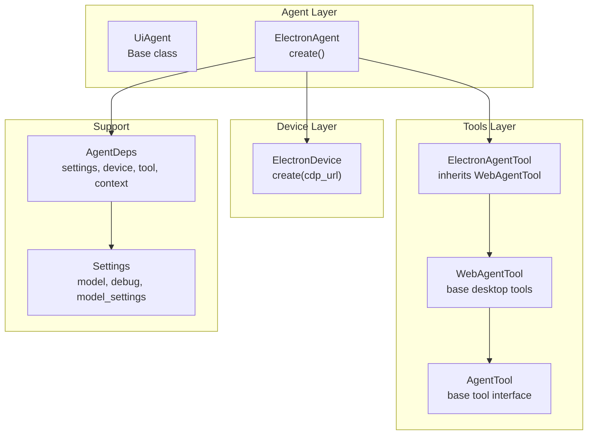
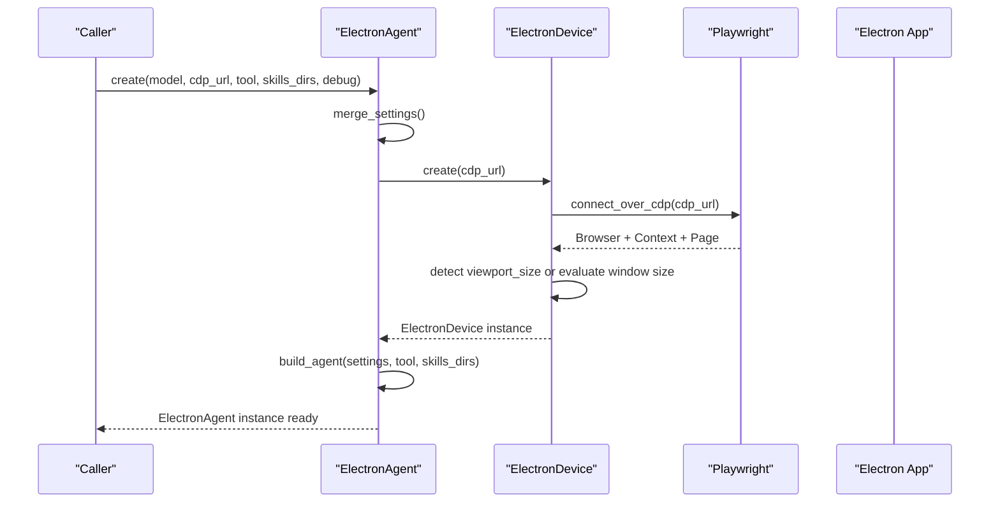
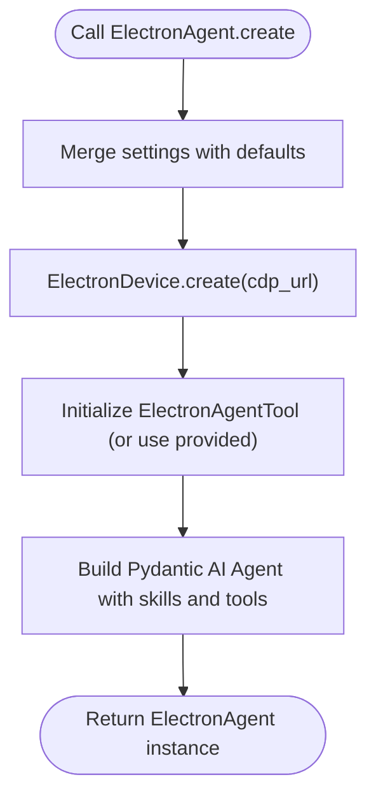
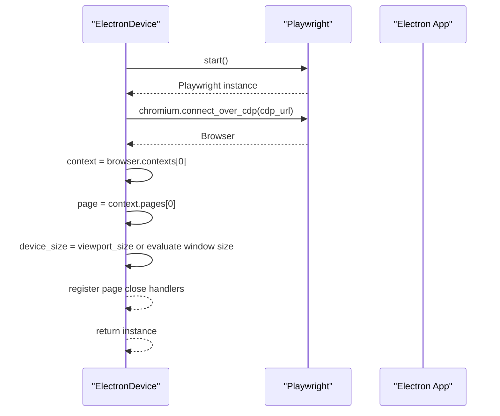
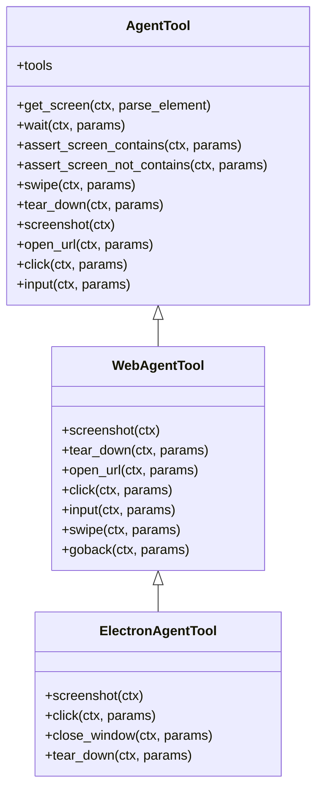
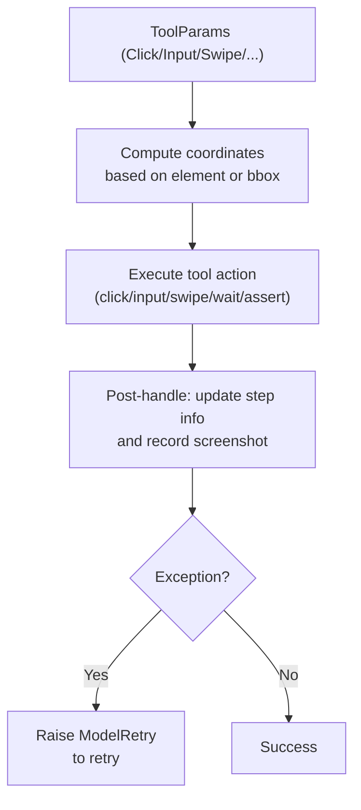
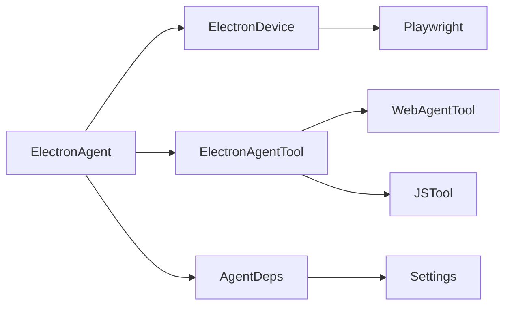

# ElectronAgent

<cite>
**Referenced Files in This Document**
- [agent.py](file://src/page_eyes/agent.py)
- [device.py](file://src/page_eyes/device.py)
- [electron.py](file://src/page_eyes/tools/electron.py)
- [_base.py](file://src/page_eyes/tools/_base.py)
- [web.py](file://src/page_eyes/tools/web.py)
- [deps.py](file://src/page_eyes/deps.py)
- [config.py](file://src/page_eyes/config.py)
- [feat-electron.md](file://docs/feat-electron.md)
- [test_electron_agent.py](file://tests/test_electron_agent.py)
- [conftest.py](file://tests/conftest.py)
</cite>

## Table of Contents
1. [Introduction](#introduction)
2. [Project Structure](#project-structure)
3. [Core Components](#core-components)
4. [Architecture Overview](#architecture-overview)
5. [Detailed Component Analysis](#detailed-component-analysis)
6. [Dependency Analysis](#dependency-analysis)
7. [Performance Considerations](#performance-considerations)
8. [Troubleshooting Guide](#troubleshooting-guide)
9. [Conclusion](#conclusion)

## Introduction
This document provides comprehensive API documentation for the ElectronAgent class, focusing on Electron desktop application automation. It explains the ElectronAgent.create() factory method, the underlying ElectronDevice.create() connection mechanism through the Chrome DevTools Protocol (CDP), and the ElectronAgentTool capabilities for desktop-specific operations such as window management, menu interactions, and native UI element automation. It also covers platform-specific considerations, practical examples, and error handling strategies tailored to Electron automation.

## Project Structure
The Electron automation stack is implemented across several modules:
- Agent layer: Orchestrates the agent lifecycle and builds the Pydantic AI agent with skills and tools.
- Device layer: Manages device connections and exposes a unified interface for different platforms.
- Tools layer: Provides reusable tool implementations for desktop automation.
- Configuration and dependencies: Centralizes settings, tool parameter models, and shared utilities.

**Diagram sources**
- [agent.py:480-515](file://src/page_eyes/agent.py#L480-L515)
- [device.py:230-292](file://src/page_eyes/device.py#L230-L292)
- [electron.py:21-134](file://src/page_eyes/tools/electron.py#L21-L134)
- [web.py:24-179](file://src/page_eyes/tools/web.py#L24-L179)
- [deps.py:75-83](file://src/page_eyes/deps.py#L75-L83)
- [config.py:54-73](file://src/page_eyes/config.py#L54-L73)

**Section sources**
- [agent.py:480-515](file://src/page_eyes/agent.py#L480-L515)
- [device.py:230-292](file://src/page_eyes/device.py#L230-L292)
- [electron.py:21-134](file://src/page_eyes/tools/electron.py#L21-L134)
- [web.py:24-179](file://src/page_eyes/tools/web.py#L24-L179)
- [deps.py:75-83](file://src/page_eyes/deps.py#L75-L83)
- [config.py:54-73](file://src/page_eyes/config.py#L54-L73)

## Core Components
- ElectronAgent.create(model, cdp_url, tool, skills_dirs, debug): Factory method to create an ElectronAgent instance. It merges settings, connects to an Electron app via CDP, initializes the toolset, and constructs the Pydantic AI agent.
- ElectronDevice.create(cdp_url): Connects to an already-running Electron app using Playwright’s Chromium CDP connector and prepares the active page and context for automation.
- ElectronAgentTool: Desktop automation tools built on WebAgentTool. It inherits screenshot, click, input, swipe, open_url, goback, wait, and assertion utilities, and overrides tear_down to avoid closing the external Electron process.

Key parameter specifications for ElectronAgent.create():
- model: Optional string specifying the LLM provider/model identifier.
- cdp_url: String CDP remote debugging URL; defaults to http://127.0.0.1:9222.
- tool: Optional ElectronAgentTool instance; defaults to a fresh instance.
- skills_dirs: Optional list of skill directories; defaults to ['./skills'].
- debug: Optional bool enabling verbose logging and debug behaviors.

**Section sources**
- [agent.py:483-514](file://src/page_eyes/agent.py#L483-L514)
- [device.py:243-292](file://src/page_eyes/device.py#L243-L292)
- [electron.py:21-134](file://src/page_eyes/tools/electron.py#L21-L134)
- [feat-electron.md:48-57](file://docs/feat-electron.md#L48-L57)

## Architecture Overview
The Electron automation architecture integrates the Pydantic AI agent framework with Playwright’s CDP connectivity to control Electron applications. The flow is:
- ElectronAgent.create() merges settings and builds the agent.
- ElectronDevice.create() connects to the Electron app via CDP and sets up the active page and context.
- ElectronAgentTool provides desktop actions (click, input, swipe, wait, assertions) and manages cleanup without terminating the external Electron process.

**Diagram sources**
- [agent.py:483-514](file://src/page_eyes/agent.py#L483-L514)
- [device.py:243-292](file://src/page_eyes/device.py#L243-L292)

## Detailed Component Analysis

### ElectronAgent.create() Factory Method
- Purpose: Asynchronously construct an ElectronAgent with configured settings, device, and tools.
- Behavior:
  - Merges user-provided settings with defaults.
  - Creates an ElectronDevice using the provided CDP URL.
  - Initializes an ElectronAgentTool (or accepts a custom one).
  - Builds a Pydantic AI Agent with skills capability and toolset.
- Parameters:
  - model: Optional string; defaults to global setting if not provided.
  - cdp_url: String; defaults to http://127.0.0.1:9222.
  - tool: Optional ElectronAgentTool; defaults to a new instance.
  - skills_dirs: Optional list of directories; defaults to ['./skills'].
  - debug: Optional bool; enables verbose logging and debug features.

**Diagram sources**
- [agent.py:483-514](file://src/page_eyes/agent.py#L483-L514)

**Section sources**
- [agent.py:483-514](file://src/page_eyes/agent.py#L483-L514)
- [feat-electron.md:54-57](file://docs/feat-electron.md#L54-L57)

### ElectronDevice.create() and CDP Integration
- Purpose: Connect to an already-running Electron application via CDP and prepare the active page/context for automation.
- Behavior:
  - Starts Playwright and connects to the Electron app using the provided CDP URL.
  - Retrieves the first browser context and page.
  - Determines device size either from viewport_size or by evaluating window dimensions.
  - Registers page close handlers to manage window switching and rollback.
- Parameters:
  - cdp_url: String; defaults to http://127.0.0.1:9222.

**Diagram sources**
- [device.py:243-292](file://src/page_eyes/device.py#L243-L292)

**Section sources**
- [device.py:230-292](file://src/page_eyes/device.py#L230-L292)
- [feat-electron.md:11-24](file://docs/feat-electron.md#L11-L24)

### ElectronAgentTool Capabilities
- Inherits from WebAgentTool and reuses its core desktop automation utilities:
  - Screenshot capture.
  - Window management helpers (switch to latest page).
  - Click, input, swipe, open_url, goback, wait, and assertion utilities.
- Overrides tear_down to avoid closing the external Electron process, ensuring the app remains under external management.

**Diagram sources**
- [_base.py:130-391](file://src/page_eyes/tools/_base.py#L130-L391)
- [web.py:24-179](file://src/page_eyes/tools/web.py#L24-L179)
- [electron.py:21-134](file://src/page_eyes/tools/electron.py#L21-L134)

**Section sources**
- [electron.py:21-134](file://src/page_eyes/tools/electron.py#L21-L134)
- [web.py:24-179](file://src/page_eyes/tools/web.py#L24-L179)
- [feat-electron.md:28-44](file://docs/feat-electron.md#L28-L44)

### Tool Parameters and Execution Flow
- Tool parameters are validated and transformed into coordinate systems for clicks and swipes.
- Tools are decorated with delays and retry logic to stabilize automation.
- The AgentTool base class handles screenshot parsing, upload, and step tracking.

**Diagram sources**
- [_base.py:88-127](file://src/page_eyes/tools/_base.py#L88-L127)
- [deps.py:165-204](file://src/page_eyes/deps.py#L165-L204)

**Section sources**
- [_base.py:88-127](file://src/page_eyes/tools/_base.py#L88-L127)
- [deps.py:165-204](file://src/page_eyes/deps.py#L165-L204)

## Dependency Analysis
- ElectronAgent depends on:
  - ElectronDevice for CDP connection and page management.
  - ElectronAgentTool for desktop automation actions.
  - AgentDeps for settings, device, tool, and execution context.
  - Settings for model selection, debug flags, and model settings.
- ElectronDevice depends on:
  - Playwright’s Chromium CDP connector.
  - Page evaluation to determine device size when viewport_size is unavailable.
- ElectronAgentTool depends on:
  - WebAgentTool for shared desktop utilities.
  - JSTool for highlighting and element manipulation.

**Diagram sources**
- [agent.py:480-515](file://src/page_eyes/agent.py#L480-L515)
- [device.py:230-292](file://src/page_eyes/device.py#L230-L292)
- [electron.py:21-134](file://src/page_eyes/tools/electron.py#L21-L134)
- [web.py:24-179](file://src/page_eyes/tools/web.py#L24-L179)
- [deps.py:75-83](file://src/page_eyes/deps.py#L75-L83)
- [config.py:54-73](file://src/page_eyes/config.py#L54-L73)

**Section sources**
- [agent.py:480-515](file://src/page_eyes/agent.py#L480-L515)
- [device.py:230-292](file://src/page_eyes/device.py#L230-L292)
- [electron.py:21-134](file://src/page_eyes/tools/electron.py#L21-L134)
- [web.py:24-179](file://src/page_eyes/tools/web.py#L24-L179)
- [deps.py:75-83](file://src/page_eyes/deps.py#L75-L83)
- [config.py:54-73](file://src/page_eyes/config.py#L54-L73)

## Performance Considerations
- CDP connection stability: Ensure the Electron app is launched with the remote debugging port enabled and reachable before connecting.
- Screenshot scaling: Using CSS-scale screenshots avoids DPI-related coordinate mismatches in Retina displays.
- Delays and retries: Tool decorators introduce small delays and ModelRetry on exceptions to improve reliability.
- Window management: Automatic page-close event handling ensures the active page remains consistent during multi-window workflows.

[No sources needed since this section provides general guidance]

## Troubleshooting Guide
Common issues and resolutions:
- CDP connection failures:
  - Verify the Electron app is started with the remote debugging port argument and that the port is open.
  - Confirm the CDP URL matches the running app’s configuration.
- No active page or viewport size:
  - ElectronDevice evaluates window dimensions when viewport_size is unavailable; ensure the page is ready before automation.
- Tool failures:
  - Exceptions trigger ModelRetry; review logs for detailed error traces and adjust timing or conditions accordingly.
- Window switching:
  - Use the latest page detection and automatic rollback on close to keep the active page consistent.

Practical examples:
- CDP connection setup:
  - Launch the Electron app with the remote debugging port and confirm http://127.0.0.1:9222/json lists the app pages.
- Basic desktop automation:
  - Use click, input, swipe, and wait tools to interact with UI elements and verify outcomes.
- Test-driven automation:
  - See the Electron test fixture that starts the app, waits for the CDP port, and creates an ElectronAgent for end-to-end testing.

**Section sources**
- [feat-electron.md:68-86](file://docs/feat-electron.md#L68-L86)
- [test_electron_agent.py:8-19](file://tests/test_electron_agent.py#L8-L19)
- [conftest.py:81-115](file://tests/conftest.py#L81-L115)

## Conclusion
ElectronAgent provides a robust abstraction for automating Electron desktop applications by leveraging Playwright’s CDP connectivity and a shared toolset derived from WebAgentTool. The factory method simplifies initialization, while ElectronDevice and ElectronAgentTool encapsulate connection, window management, and desktop-specific actions. With careful CDP setup, platform considerations, and structured error handling, teams can reliably automate Electron apps using this framework.