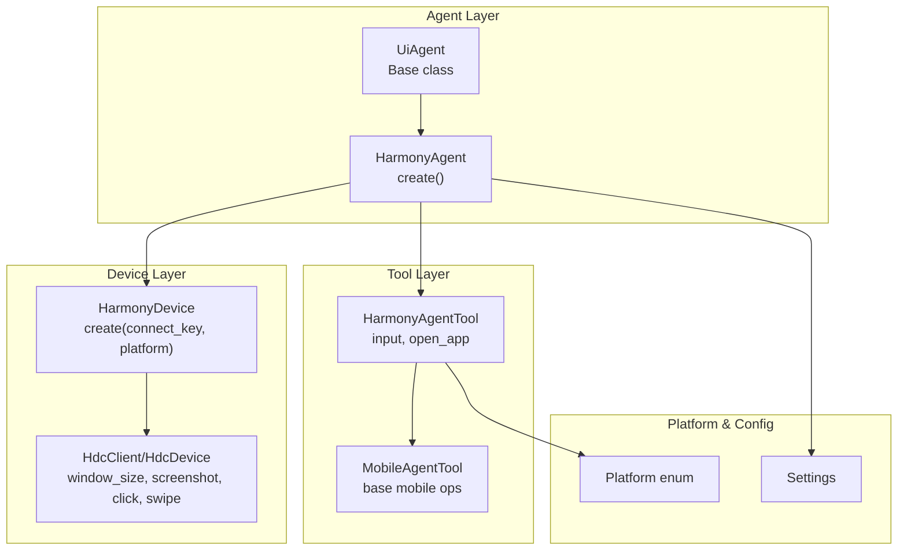
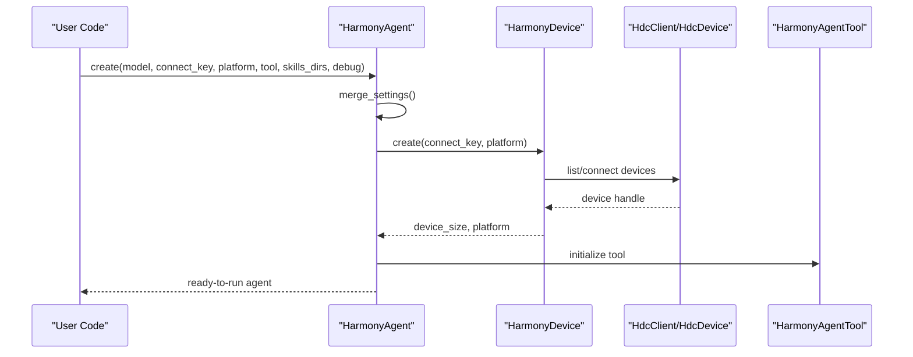
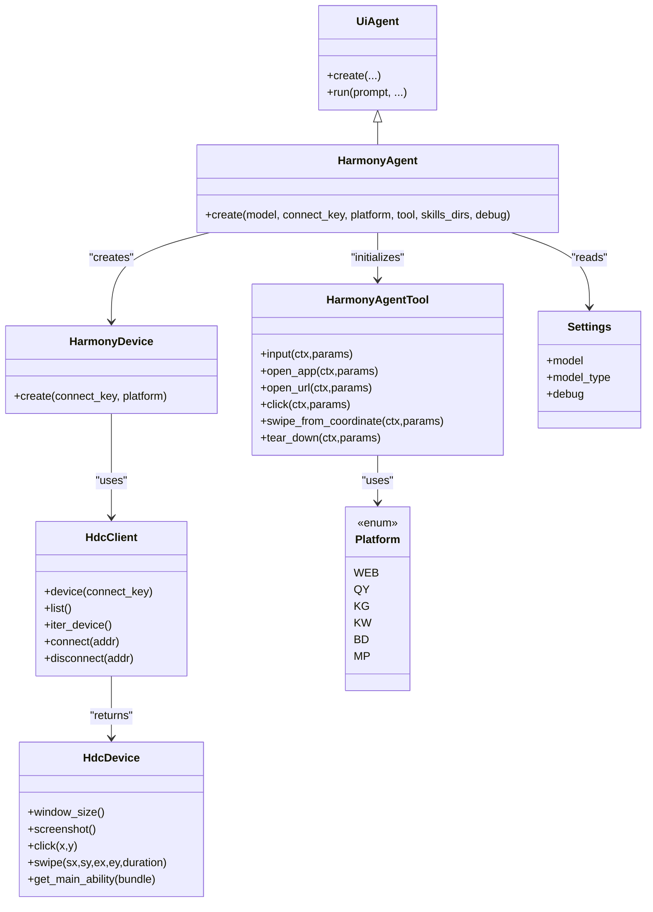

# HarmonyAgent

<cite>
**Referenced Files in This Document**
- [agent.py](file://src/page_eyes/agent.py)
- [harmony.py](file://src/page_eyes/tools/harmony.py)
- [device.py](file://src/page_eyes/device.py)
- [hdc_tool.py](file://src/page_eyes/util/hdc_tool.py)
- [_mobile.py](file://src/page_eyes/tools/_mobile.py)
- [platform.py](file://src/page_eyes/util/platform.py)
- [deps.py](file://src/page_eyes/deps.py)
- [config.py](file://src/page_eyes/config.py)
- [test_harmony_agent.py](file://tests/test_harmony_agent.py)
- [troubleshooting.md](file://docs/faq/troubleshooting.md)
- [README.md](file://README.md)
</cite>

## Table of Contents
1. [Introduction](#introduction)
2. [Project Structure](#project-structure)
3. [Core Components](#core-components)
4. [Architecture Overview](#architecture-overview)
5. [Detailed Component Analysis](#detailed-component-analysis)
6. [Dependency Analysis](#dependency-analysis)
7. [Performance Considerations](#performance-considerations)
8. [Troubleshooting Guide](#troubleshooting-guide)
9. [Conclusion](#conclusion)
10. [Appendices](#appendices)

## Introduction
This document provides comprehensive API documentation for the HarmonyAgent class, focusing on HarmonyOS mobile device automation. It explains the HarmonyAgent.create() factory method, Harmony device connection via HarmonyDevice.create(), the HarmonyAgentTool usage for HarmonyOS-specific operations (touch gestures, text input, app interactions), platform-specific considerations, practical examples, and error handling strategies tailored for Harmony mobile automation.

## Project Structure
The HarmonyAgent integrates with a unified agent framework that supports multiple platforms. The HarmonyOS-specific implementation relies on:
- Agent orchestration and lifecycle management
- Device abstraction for HarmonyOS using HDC
- Tooling for mobile operations (click, input, swipe, open app, open URL)
- Platform configuration for URL schema generation
- Configuration and settings management

**Diagram sources**
- [agent.py:403-438](file://src/page_eyes/agent.py#L403-L438)
- [device.py:129-155](file://src/page_eyes/device.py#L129-L155)
- [hdc_tool.py:31-107](file://src/page_eyes/util/hdc_tool.py#L31-L107)
- [harmony.py:20-68](file://src/page_eyes/tools/harmony.py#L20-L68)
- [_mobile.py:27-165](file://src/page_eyes/tools/_mobile.py#L27-L165)
- [platform.py:14-22](file://src/page_eyes/util/platform.py#L14-L22)
- [config.py:54-73](file://src/page_eyes/config.py#L54-L73)

**Section sources**
- [agent.py:403-438](file://src/page_eyes/agent.py#L403-L438)
- [device.py:129-155](file://src/page_eyes/device.py#L129-L155)
- [harmony.py:20-68](file://src/page_eyes/tools/harmony.py#L20-L68)
- [hdc_tool.py:31-107](file://src/page_eyes/util/hdc_tool.py#L31-L107)
- [_mobile.py:27-165](file://src/page_eyes/tools/_mobile.py#L27-L165)
- [platform.py:14-22](file://src/page_eyes/util/platform.py#L14-L22)
- [config.py:54-73](file://src/page_eyes/config.py#L54-L73)

## Core Components
- HarmonyAgent.create(): Factory method to instantiate a HarmonyOS automation agent with optional model, connect_key, platform, tool, skills_dirs, and debug.
- HarmonyDevice.create(): Factory method to establish a HarmonyOS device connection using HDC, with optional connect_key and platform.
- HarmonyAgentTool: HarmonyOS-specific toolset built on MobileAgentTool, providing input, open_app, and URL opening helpers.
- Platform: Enumeration of supported platforms used for URL schema generation.
- Settings: Centralized configuration for model, model type, and debug flags.

Key responsibilities:
- Orchestrate agent creation, device connection, and tool initialization.
- Provide platform-aware URL schema generation for launching apps or URLs.
- Manage device window size and screen capture for automation.

**Section sources**
- [agent.py:403-438](file://src/page_eyes/agent.py#L403-L438)
- [device.py:129-155](file://src/page_eyes/device.py#L129-L155)
- [harmony.py:20-68](file://src/page_eyes/tools/harmony.py#L20-L68)
- [platform.py:14-22](file://src/page_eyes/util/platform.py#L14-L22)
- [config.py:54-73](file://src/page_eyes/config.py#L54-L73)

## Architecture Overview
The HarmonyAgent follows a layered architecture:
- Agent layer: Orchestrates planning, tool execution, and reporting.
- Device layer: Encapsulates HarmonyOS device connectivity via HDC.
- Tool layer: Implements platform-specific operations.
- Platform layer: Provides platform-aware URL schema generation.
- Configuration layer: Supplies runtime settings and environment variables.

**Diagram sources**
- [agent.py:403-438](file://src/page_eyes/agent.py#L403-L438)
- [device.py:129-155](file://src/page_eyes/device.py#L129-L155)
- [hdc_tool.py:77-107](file://src/page_eyes/util/hdc_tool.py#L77-L107)
- [harmony.py:20-68](file://src/page_eyes/tools/harmony.py#L20-L68)

## Detailed Component Analysis

### HarmonyAgent.create() API
Purpose: Asynchronously create a HarmonyAgent instance configured for HarmonyOS automation.

Parameters:
- model (optional string): LLM model identifier. Defaults to configured value.
- connect_key (optional string): Device connection key for HDC. If omitted, the first connected device is used.
- platform (optional str or Platform): Target platform for URL schema generation. Defaults to a predefined platform constant.
- tool (optional HarmonyAgentTool): Custom tool instance. If omitted, a default HarmonyAgentTool is used.
- skills_dirs (optional list): Additional skill directories for the agent’s capability set.
- debug (optional bool): Enable verbose logging and diagnostics.

Behavior:
- Merges settings with defaults and environment variables.
- Creates a HarmonyDevice using the provided connect_key and platform.
- Initializes AgentDeps with the device and tool.
- Builds an Agent with skills loaded from configured directories.

Returns:
- An initialized HarmonyAgent instance ready to run automation tasks.

Notes:
- The platform parameter influences URL schema generation for launching apps or URLs.
- Debug mode increases logging verbosity for easier troubleshooting.

**Section sources**
- [agent.py:403-438](file://src/page_eyes/agent.py#L403-L438)
- [config.py:54-73](file://src/page_eyes/config.py#L54-L73)
- [platform.py:14-22](file://src/page_eyes/util/platform.py#L14-L22)

### HarmonyDevice.create() API
Purpose: Establish a HarmonyOS device connection using HDC.

Parameters:
- connect_key (optional string): Device connection key. If provided and not present in the device list, attempts to connect.
- platform (optional Platform): Platform type used for device sizing and schema generation.

Behavior:
- Lists currently available HDC devices.
- If connect_key is provided and missing, attempts to connect using HDC tconn.
- Retrieves the device handle and window size.
- Returns a HarmonyDevice instance with platform metadata.

Error handling:
- Raises exceptions if HDC connect fails or no devices are found.

**Section sources**
- [device.py:129-155](file://src/page_eyes/device.py#L129-L155)
- [hdc_tool.py:77-107](file://src/page_eyes/util/hdc_tool.py#L77-L107)

### HarmonyAgentTool Operations
HarmonyAgentTool extends MobileAgentTool and adds HarmonyOS-specific capabilities:

- input(ctx, params):
  - Performs coordinate-based click, then injects text into the focused input field.
  - Optionally sends an Enter key event.
  - Uses UITest input_text and keyevent injection.

- open_app(ctx, params):
  - Dumps installed bundles and selects the target app via a sub-agent.
  - Starts the main ability of the selected bundle.
  - Waits briefly and refreshes the screen.

- open_url(ctx, params):
  - Generates a platform-aware URL schema using platform configuration.
  - Launches the URL via the underlying device shell command.
  - Captures a post-launch screenshot.

- click(ctx, params):
  - Computes coordinates and performs a tap gesture.

- swipe_from_coordinate(ctx, params):
  - Executes multi-segment swipe gestures across provided coordinates.

- tear_down(ctx, params):
  - Finalizes automation by capturing a screenshot and signaling completion.

Coordinate computation:
- Uses either LLM-based or VLM-based location parameters to compute screen-relative coordinates.

**Section sources**
- [harmony.py:20-68](file://src/page_eyes/tools/harmony.py#L20-L68)
- [_mobile.py:27-165](file://src/page_eyes/tools/_mobile.py#L27-L165)
- [deps.py:103-162](file://src/page_eyes/deps.py#L103-L162)

### Platform-Specific Considerations
- Platform enum defines supported environments used for URL schema generation.
- URL schema generation adapts to platform-specific clients (e.g., QQ Music, Kugou, Kuwo, WeChat).
- The HarmonyDevice stores the platform setting for downstream tooling.

Compatibility:
- Requires HDC (Harmony Device Connector) to be installed and accessible.
- Device must be paired and connected via HDC before agent creation.

**Section sources**
- [platform.py:14-22](file://src/page_eyes/util/platform.py#L14-L22)
- [device.py:129-155](file://src/page_eyes/device.py#L129-L155)

### Practical Examples
Below are representative usage patterns derived from tests and examples:

- Basic device connection and app launch:
  - Connect via HDC using a known connect_key.
  - Open multiple apps in sequence and wait between actions.

- URL navigation and interactive flows:
  - Open a URL, handle optional close buttons, locate and input search terms, scroll until expected content appears, and interact with elements.

- App exploration and playback:
  - Open a music app, navigate to a category, scroll to a specific artist, and trigger playback.

These examples demonstrate typical automation tasks performed by HarmonyAgent with HarmonyAgentTool.

**Section sources**
- [test_harmony_agent.py:11-48](file://tests/test_harmony_agent.py#L11-L48)

## Dependency Analysis
HarmonyAgent depends on:
- Agent orchestration and skills capability loading.
- Device abstraction encapsulating HDC connectivity.
- Tool layer providing cross-platform mobile operations with HarmonyOS overrides.
- Platform configuration for URL schema generation.
- Settings for model selection and debug toggles.

**Diagram sources**
- [agent.py:403-438](file://src/page_eyes/agent.py#L403-L438)
- [device.py:129-155](file://src/page_eyes/device.py#L129-L155)
- [hdc_tool.py:31-107](file://src/page_eyes/util/hdc_tool.py#L31-L107)
- [harmony.py:20-68](file://src/page_eyes/tools/harmony.py#L20-L68)
- [platform.py:14-22](file://src/page_eyes/util/platform.py#L14-L22)
- [config.py:54-73](file://src/page_eyes/config.py#L54-L73)

**Section sources**
- [agent.py:403-438](file://src/page_eyes/agent.py#L403-L438)
- [device.py:129-155](file://src/page_eyes/device.py#L129-L155)
- [hdc_tool.py:31-107](file://src/page_eyes/util/hdc_tool.py#L31-L107)
- [harmony.py:20-68](file://src/page_eyes/tools/harmony.py#L20-L68)
- [platform.py:14-22](file://src/page_eyes/util/platform.py#L14-L22)
- [config.py:54-73](file://src/page_eyes/config.py#L54-L73)

## Performance Considerations
- Device window size detection ensures accurate coordinate mapping for gestures and clicks.
- Screenshot capture is used strategically to confirm state transitions after actions.
- Sliding operations include configurable repeat counts and optional keyword expectations to reduce unnecessary polling.
- URL schema generation is lightweight and delegated to platform utilities.

[No sources needed since this section provides general guidance]

## Troubleshooting Guide
Common HarmonyOS automation issues and resolutions:

- Device connectivity failures:
  - Verify HDC is installed and accessible.
  - Ensure the device is paired and connected via HDC before agent creation.
  - If connect_key is provided, confirm it matches the device’s connection key.

- HDC connection errors:
  - The device creation method raises explicit exceptions when HDC connect fails.
  - Confirm network reachability and HDC service availability.

- No devices found:
  - Ensure at least one HDC-connected device is present.
  - Re-list devices and retry.

- Logging and diagnostics:
  - Enable debug mode via settings to increase verbosity.
  - Review logs for HDC commands, window size detection, and tool execution outcomes.

- Platform-specific URL issues:
  - Confirm platform configuration is set appropriately for URL schema generation.
  - Validate that the generated schema opens the intended client.

- General troubleshooting resources:
  - Refer to the project’s troubleshooting guide for environment configuration, dependency management, and logging tips.

**Section sources**
- [device.py:129-155](file://src/page_eyes/device.py#L129-L155)
- [hdc_tool.py:77-107](file://src/page_eyes/util/hdc_tool.py#L77-L107)
- [troubleshooting.md:94-120](file://docs/faq/troubleshooting.md#L94-L120)
- [config.py:54-73](file://src/page_eyes/config.py#L54-L73)

## Conclusion
HarmonyAgent provides a robust, extensible framework for HarmonyOS mobile automation. Its factory method enables flexible configuration, while HarmonyDevice.create() streamlines device connectivity via HDC. HarmonyAgentTool delivers HarmonyOS-specific operations aligned with platform-aware URL handling. With clear error handling, diagnostic logging, and practical examples, developers can reliably automate HarmonyOS applications and workflows.

[No sources needed since this section summarizes without analyzing specific files]

## Appendices

### API Reference: HarmonyAgent.create()
- Purpose: Create a HarmonyOS automation agent.
- Parameters:
  - model (optional string)
  - connect_key (optional string)
  - platform (optional str or Platform)
  - tool (optional HarmonyAgentTool)
  - skills_dirs (optional list)
  - debug (optional bool)
- Returns: HarmonyAgent instance

**Section sources**
- [agent.py:403-438](file://src/page_eyes/agent.py#L403-L438)

### API Reference: HarmonyDevice.create()
- Purpose: Create a HarmonyOS device connection.
- Parameters:
  - connect_key (optional string)
  - platform (optional Platform)
- Returns: HarmonyDevice instance

**Section sources**
- [device.py:129-155](file://src/page_eyes/device.py#L129-L155)

### API Reference: HarmonyAgentTool
- Methods:
  - input(ctx, params): Text input with optional Enter key.
  - open_app(ctx, params): Launch app by resolving bundle/main ability.
  - open_url(ctx, params): Launch URL via platform-aware schema.
  - click(ctx, params): Tap at computed coordinates.
  - swipe_from_coordinate(ctx, params): Multi-segment swipe.
  - tear_down(ctx, params): Finalization and screenshot capture.

**Section sources**
- [harmony.py:20-68](file://src/page_eyes/tools/harmony.py#L20-L68)
- [_mobile.py:27-165](file://src/page_eyes/tools/_mobile.py#L27-L165)

### Example Workflows
- App launch sequences and URL navigation flows are demonstrated in the test suite.

**Section sources**
- [test_harmony_agent.py:11-48](file://tests/test_harmony_agent.py#L11-L48)

### Platform Configuration
- Platform enum supports multiple client environments for URL schema generation.

**Section sources**
- [platform.py:14-22](file://src/page_eyes/util/platform.py#L14-L22)

### Environment and Settings
- Settings govern model selection, model type, and debug flags.

**Section sources**
- [config.py:54-73](file://src/page_eyes/config.py#L54-L73)