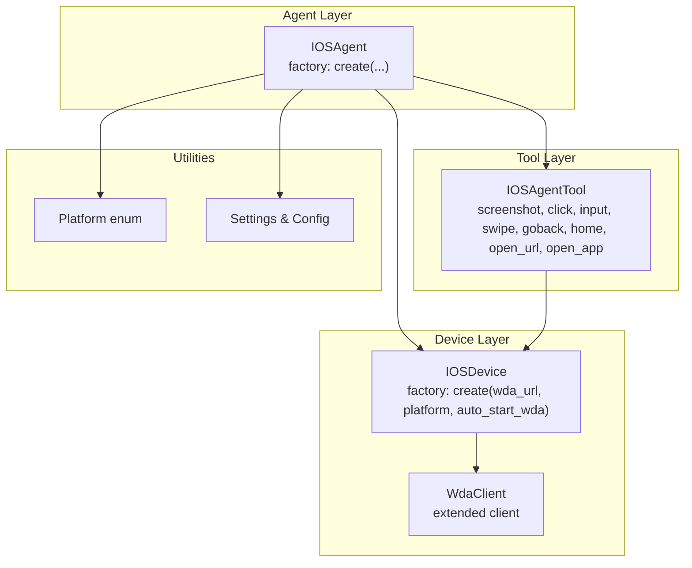
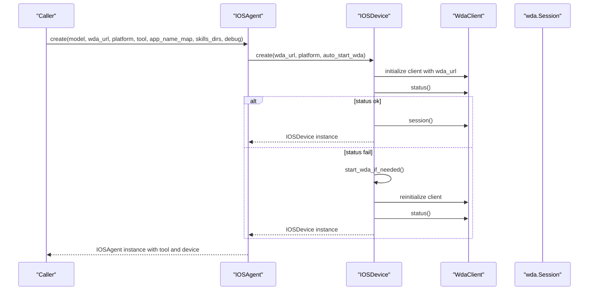
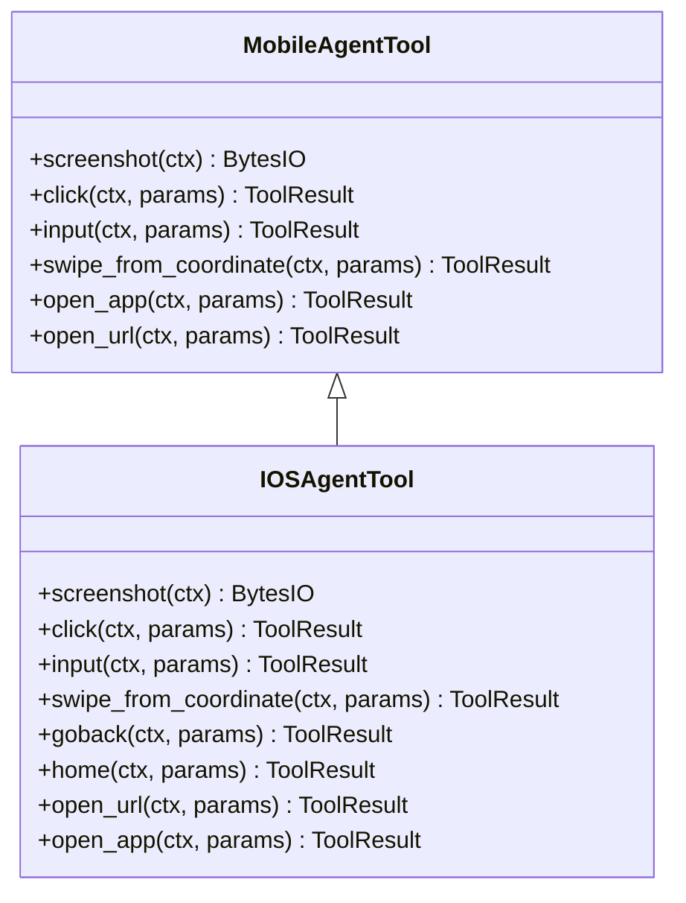
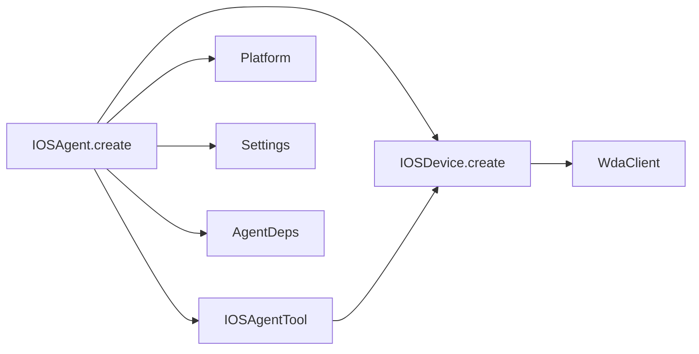

# IOSAgent

<cite>
**Referenced Files in This Document**
- [agent.py](file://src/page_eyes/agent.py)
- [device.py](file://src/page_eyes/device.py)
- [ios.py](file://src/page_eyes/tools/ios.py)
- [_mobile.py](file://src/page_eyes/tools/_mobile.py)
- [wda_tool.py](file://src/page_eyes/util/wda_tool.py)
- [platform.py](file://src/page_eyes/util/platform.py)
- [deps.py](file://src/page_eyes/deps.py)
- [config.py](file://src/page_eyes/config.py)
- [conftest.py](file://tests/conftest.py)
- [test_ios_agent.py](file://tests/test_ios_agent.py)
</cite>

## Table of Contents
1. [Introduction](#introduction)
2. [Project Structure](#project-structure)
3. [Core Components](#core-components)
4. [Architecture Overview](#architecture-overview)
5. [Detailed Component Analysis](#detailed-component-analysis)
6. [Dependency Analysis](#dependency-analysis)
7. [Performance Considerations](#performance-considerations)
8. [Troubleshooting Guide](#troubleshooting-guide)
9. [Conclusion](#conclusion)
10. [Appendices](#appendices)

## Introduction
This document provides comprehensive API documentation for the IOSAgent class, focusing on iOS mobile device automation. It explains the IOSAgent.create() factory method, iOS device connection via IOSDevice.create(), the IOSAgentTool usage for iOS-specific operations, platform considerations, practical configuration examples, and error handling strategies tailored to iOS automation with WebDriverAgent.

## Project Structure
The iOS automation stack centers around the IOSAgent class, which composes an Agent with an IOSDevice and IOSAgentTool. The device layer connects to WebDriverAgent, while the tool layer exposes iOS-specific actions such as tapping, text input, swiping, navigation, opening URLs, and launching applications.

**Diagram sources**
- [agent.py:441-477](file://src/page_eyes/agent.py#L441-L477)
- [device.py:159-228](file://src/page_eyes/device.py#L159-L228)
- [ios.py:24-293](file://src/page_eyes/tools/ios.py#L24-L293)
- [wda_tool.py:35-129](file://src/page_eyes/util/wda_tool.py#L35-L129)
- [platform.py:14-22](file://src/page_eyes/util/platform.py#L14-L22)
- [config.py:54-73](file://src/page_eyes/config.py#L54-L73)

**Section sources**
- [agent.py:441-477](file://src/page_eyes/agent.py#L441-L477)
- [device.py:159-228](file://src/page_eyes/device.py#L159-L228)
- [ios.py:24-293](file://src/page_eyes/tools/ios.py#L24-L293)
- [wda_tool.py:35-129](file://src/page_eyes/util/wda_tool.py#L35-L129)
- [platform.py:14-22](file://src/page_eyes/util/platform.py#L14-L22)
- [config.py:54-73](file://src/page_eyes/config.py#L54-L73)

## Core Components
- IOSAgent.create(): Factory method to construct an iOS automation agent with configurable model, WebDriverAgent URL, platform, tool, app name mapping, skills directories, and debug flag.
- IOSDevice.create(): Factory method to establish an iOS device connection via WebDriverAgent, with optional automatic WDA startup on macOS.
- IOSAgentTool: iOS-specific toolset providing screenshot, click, input, swipe, go back, home, open URL, and open app operations.
- WdaClient: Extended WebDriverAgent client with convenience methods for long press, input with clear, app list retrieval, and tap-and-input.
- Platform: Enumeration of platform types used for URL schema generation and routing.
- AgentDeps: Dependency container holding settings, device, tool, and optional app_name_map.

**Section sources**
- [agent.py:441-477](file://src/page_eyes/agent.py#L441-L477)
- [device.py:159-228](file://src/page_eyes/device.py#L159-L228)
- [ios.py:24-293](file://src/page_eyes/tools/ios.py#L24-L293)
- [wda_tool.py:35-129](file://src/page_eyes/util/wda_tool.py#L35-L129)
- [platform.py:14-22](file://src/page_eyes/util/platform.py#L14-L22)
- [deps.py:75-83](file://src/page_eyes/deps.py#L75-L83)

## Architecture Overview
The IOSAgent orchestrates an Agent with an IOSDevice and IOSAgentTool. The device layer encapsulates a WdaClient and a wda.Session, enabling direct interaction with the iOS device through WebDriverAgent. The tool layer translates high-level actions into low-level WDA calls.

**Diagram sources**
- [agent.py:441-477](file://src/page_eyes/agent.py#L441-L477)
- [device.py:159-228](file://src/page_eyes/device.py#L159-L228)
- [device.py:324-390](file://src/page_eyes/device.py#L324-L390)
- [wda_tool.py:35-129](file://src/page_eyes/util/wda_tool.py#L35-L129)

## Detailed Component Analysis

### IOSAgent.create() Factory Method
- Purpose: Asynchronously constructs an IOSAgent instance with the specified configuration.
- Parameters:
  - model: Optional string specifying the LLM model identifier.
  - wda_url: Required string representing the WebDriverAgent URL (e.g., http://localhost:8100).
  - platform: Optional string or Platform enum indicating the target platform for URL schema generation.
  - tool: Optional IOSAgentTool instance; if omitted, a default instance is used.
  - app_name_map: Optional dict mapping friendly app names to bundle IDs for precise app launching.
  - skills_dirs: Optional list of skill directories for extending agent capabilities.
  - debug: Optional bool enabling verbose logging.
- Behavior:
  - Merges settings with defaults.
  - Creates an IOSDevice using the provided wda_url and platform.
  - Initializes AgentDeps with device, tool, and app_name_map.
  - Builds an Agent with skills capability and returns IOSAgent.

**Section sources**
- [agent.py:441-477](file://src/page_eyes/agent.py#L441-L477)
- [config.py:54-73](file://src/page_eyes/config.py#L54-L73)
- [deps.py:75-83](file://src/page_eyes/deps.py#L75-L83)

### iOS Device Connection via IOSDevice.create()
- Purpose: Establishes a connection to an iOS device through WebDriverAgent.
- Parameters:
  - wda_url: Required string for WebDriverAgent endpoint.
  - platform: Optional Platform enum or string for platform-specific URL schema generation.
  - auto_start_wda: Optional bool controlling whether to attempt automatic WDA startup on macOS.
- Behavior:
  - Initializes WdaClient with wda_url and retrieves window size.
  - Validates device status; raises an exception if unavailable.
  - Optionally attempts to start WebDriverAgent via xcodebuild if auto_start_wda is enabled and environment variables IOS_UDID and IOS_WDA_PROJECT_PATH are present.
  - Retries connection with exponential backoff until successful or max retries reached.
  - Returns an IOSDevice instance containing the WdaClient, wda.Session, and device size.

**Section sources**
- [device.py:159-228](file://src/page_eyes/device.py#L159-L228)
- [device.py:324-390](file://src/page_eyes/device.py#L324-L390)
- [wda_tool.py:35-129](file://src/page_eyes/util/wda_tool.py#L35-L129)

### IOSAgentTool Usage for iOS-Specific Operations
- Screenshot: Captures the current screen and returns a PNG buffer.
- Click: Computes coordinates and performs a tap at the specified position.
- Input: Performs a tap-and-input sequence using WdaClient’s tap_and_input method, optionally sending Enter.
- Swipe from coordinate: Executes a series of swipe gestures between consecutive coordinates, validating screen bounds.
- Go back: Attempts to locate and click a back button; falls back to left-edge swipe if detection fails.
- Home: Navigates to the iOS home screen.
- Open URL: Launches Safari and opens the formatted URL; ensures protocol presence.
- Open app: Resolves an app by friendly name via app_name_map or by intelligent matching against installed apps; launches the app and waits for readiness.

**Diagram sources**
- [_mobile.py:27-165](file://src/page_eyes/tools/_mobile.py#L27-L165)
- [ios.py:24-293](file://src/page_eyes/tools/ios.py#L24-L293)

**Section sources**
- [_mobile.py:27-165](file://src/page_eyes/tools/_mobile.py#L27-L165)
- [ios.py:24-293](file://src/page_eyes/tools/ios.py#L24-L293)

### Platform-Specific Considerations for iOS Automation
- WebDriverAgent Setup:
  - Requires a running WebDriverAgent server on the iOS device or simulator.
  - IOSDevice.create() can attempt to start WDA automatically on macOS using xcodebuild if environment variables IOS_UDID and IOS_WDA_PROJECT_PATH are set.
- Device Provisioning Profiles:
  - Ensure the device trusts the WebDriverAgent runner profile and developer certificate.
- Platform Compatibility:
  - Platform enum supports multiple targets; URL schema generation is handled via get_client_url_schema for platform-specific routing.
- Environment Variables:
  - IOS_UDID: Device UDID for WDA startup.
  - IOS_WDA_PROJECT_PATH: Path to WebDriverAgent Xcode project for building and launching.

**Section sources**
- [device.py:324-390](file://src/page_eyes/device.py#L324-L390)
- [platform.py:48-66](file://src/page_eyes/util/platform.py#L48-L66)

### Practical Examples

- WebDriverAgent Configuration:
  - Use wda_url pointing to the local or remote WebDriverAgent server (e.g., http://localhost:8100).
  - Ensure the device is reachable and WebDriverAgent is running.

- Device Connection Setup:
  - Call IOSAgent.create(wda_url="http://localhost:8100", platform=Platform.QY, debug=True).

- Basic Automation Tasks:
  - Open URL: Use open_url to launch Safari and navigate to a URL.
  - Tap and Input: Use click and input to interact with UI elements.
  - Swipe: Use swipe_from_coordinate for precise gesture sequences.
  - Navigate: Use goback and home for device-level navigation.

- Common iOS-Specific Troubleshooting:
  - Connection failures: Verify wda_url accessibility and device trust/profiles.
  - WDA startup: Confirm IOS_UDID and IOS_WDA_PROJECT_PATH are set for auto-start.
  - App launch issues: Provide app_name_map entries for ambiguous app names.

**Section sources**
- [conftest.py:33](file://tests/conftest.py#L33)
- [test_ios_agent.py:11-212](file://tests/test_ios_agent.py#L11-L212)
- [agent.py:441-477](file://src/page_eyes/agent.py#L441-L477)

## Dependency Analysis
The IOSAgent depends on IOSDevice for device connectivity and IOSAgentTool for actions. IOSDevice depends on WdaClient and wda.Session. Platform influences URL schema generation. Settings and AgentDeps provide configuration and runtime context.

**Diagram sources**
- [agent.py:441-477](file://src/page_eyes/agent.py#L441-L477)
- [device.py:159-228](file://src/page_eyes/device.py#L159-L228)
- [ios.py:24-293](file://src/page_eyes/tools/ios.py#L24-L293)
- [platform.py:14-22](file://src/page_eyes/util/platform.py#L14-L22)
- [deps.py:75-83](file://src/page_eyes/deps.py#L75-L83)

**Section sources**
- [agent.py:441-477](file://src/page_eyes/agent.py#L441-L477)
- [device.py:159-228](file://src/page_eyes/device.py#L159-L228)
- [ios.py:24-293](file://src/page_eyes/tools/ios.py#L24-L293)
- [platform.py:14-22](file://src/page_eyes/util/platform.py#L14-L22)
- [deps.py:75-83](file://src/page_eyes/deps.py#L75-L83)

## Performance Considerations
- WDA Session Stability: Repeatedly checking status and retrying connections can add latency; ensure WebDriverAgent is stable and reachable.
- Gesture Precision: Coordinate-based swipes and clicks require accurate device size measurements; cache device_size when possible.
- Text Input Delays: Adding small delays after focus and input improves reliability on slower devices.
- App Launch Resolution: Using app_name_map reduces ambiguity and speeds up app selection compared to LLM-based matching.

## Troubleshooting Guide
- Connection Failures:
  - Verify wda_url accessibility from the host machine.
  - Check device trust and provisioning profiles.
  - Enable auto_start_wda and ensure IOS_UDID and IOS_WDA_PROJECT_PATH are set for macOS builds.
- WDA Startup Issues:
  - Confirm xcodebuild availability and permissions.
  - Validate the WebDriverAgent project path and scheme.
- App Launch Problems:
  - Provide app_name_map entries for apps with similar display names.
  - Use open_app with explicit bundle IDs when ambiguous.
- Navigation Failures:
  - Use goback with fallback to edge swipe if back button detection fails.
  - Ensure Safari is launched before attempting URL operations.

**Section sources**
- [device.py:159-228](file://src/page_eyes/device.py#L159-L228)
- [device.py:324-390](file://src/page_eyes/device.py#L324-L390)
- [ios.py:155-195](file://src/page_eyes/tools/ios.py#L155-L195)
- [ios.py:242-293](file://src/page_eyes/tools/ios.py#L242-L293)

## Conclusion
IOSAgent provides a robust, extensible framework for iOS automation using WebDriverAgent. Its factory method enables flexible configuration, while IOSDevice.create() handles device connectivity and WDA lifecycle. IOSAgentTool offers a comprehensive set of iOS-specific actions, and platform-aware URL schema generation simplifies cross-platform routing. Proper configuration of WebDriverAgent, device trust, and environment variables ensures reliable automation across diverse iOS environments.

## Appendices

### API Reference: IOSAgent.create()
- Parameters:
  - model: Optional[str]
  - wda_url: Required[str]
  - platform: Optional[str | Platform]
  - tool: Optional[IOSAgentTool]
  - app_name_map: Optional[dict[str, str]]
  - skills_dirs: Optional[list[str | Path]]
  - debug: Optional[bool]
- Returns: IOSAgent instance

**Section sources**
- [agent.py:441-477](file://src/page_eyes/agent.py#L441-L477)

### Example Usage Patterns
- Basic iOS Agent Creation:
  - Configure wda_url and platform, enable debug logging.
- URL Opening and Interaction:
  - Use open_url to launch Safari, then input and click to interact.
- App Launching:
  - Provide app_name_map for precise app selection; otherwise rely on intelligent matching.

**Section sources**
- [conftest.py:33](file://tests/conftest.py#L33)
- [test_ios_agent.py:11-212](file://tests/test_ios_agent.py#L11-L212)