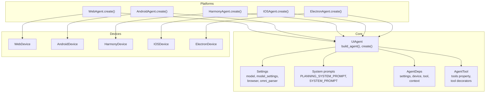
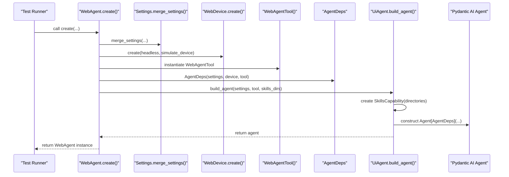
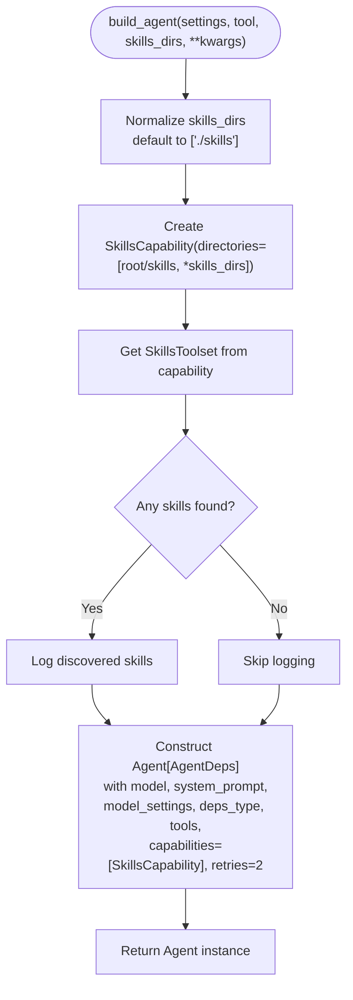
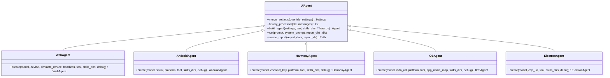
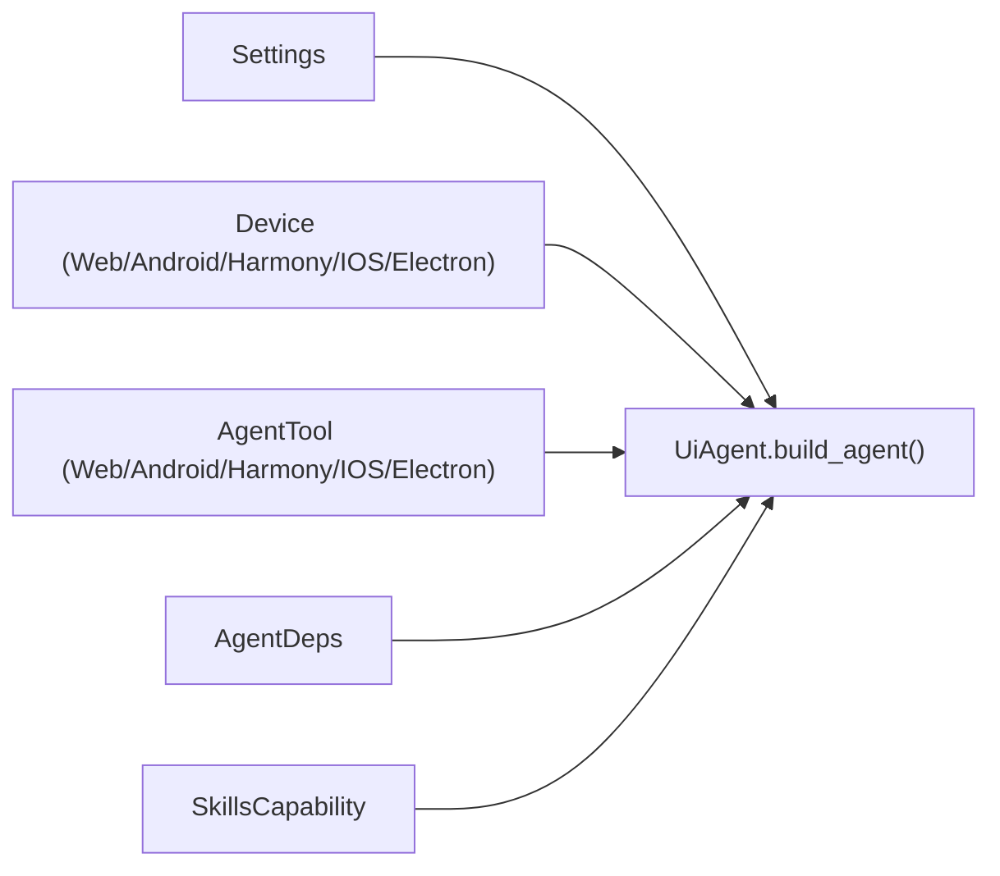

# Agent Building and Initialization

<cite>
**Referenced Files in This Document**
- [agent.py](file://src/page_eyes/agent.py)
- [config.py](file://src/page_eyes/config.py)
- [deps.py](file://src/page_eyes/deps.py)
- [_base.py](file://src/page_eyes/tools/_base.py)
- [device.py](file://src/page_eyes/device.py)
- [prompt.py](file://src/page_eyes/prompt.py)
- [__init__.py](file://src/page_eyes/__init__.py)
- [test_web_agent.py](file://tests/test_web_agent.py)
- [test_android_agent.py](file://tests/test_android_agent.py)
</cite>

## Table of Contents
1. [Introduction](#introduction)
2. [Project Structure](#project-structure)
3. [Core Components](#core-components)
4. [Architecture Overview](#architecture-overview)
5. [Detailed Component Analysis](#detailed-component-analysis)
6. [Dependency Analysis](#dependency-analysis)
7. [Performance Considerations](#performance-considerations)
8. [Troubleshooting Guide](#troubleshooting-guide)
9. [Conclusion](#conclusion)
10. [Appendices](#appendices)

## Introduction
This document explains the agent building and initialization mechanism centered on the UiAgent base class. It focuses on the build_agent() class method that constructs Pydantic AI agents with skills capability, details the SkillsCapability integration, tool registration process, and agent configuration options. It also clarifies the relationship between build_agent() and platform-specific create() factory methods, and provides examples of custom agent construction, skills directory configuration, and advanced customization patterns. Finally, it covers agent lifecycle management and resource cleanup.

## Project Structure
The agent system is organized around a shared UiAgent base class and platform-specific subclasses. Each subclass exposes a create() factory method that assembles device, tool, and agent dependencies, then delegates to UiAgent.build_agent() to construct the Pydantic AI agent with skills capability.

**Diagram sources**
- [agent.py:96-169](file://src/page_eyes/agent.py#L96-L169)
- [config.py:54-72](file://src/page_eyes/config.py#L54-L72)
- [prompt.py:8-166](file://src/page_eyes/prompt.py#L8-L166)
- [deps.py:75-82](file://src/page_eyes/deps.py#L75-L82)
- [_base.py:130-150](file://src/page_eyes/tools/_base.py#L130-L150)
- [device.py:53-390](file://src/page_eyes/device.py#L53-L390)

**Section sources**
- [agent.py:96-169](file://src/page_eyes/agent.py#L96-L169)
- [config.py:54-72](file://src/page_eyes/config.py#L54-L72)
- [prompt.py:8-166](file://src/page_eyes/prompt.py#L8-L166)
- [deps.py:75-82](file://src/page_eyes/deps.py#L75-L82)
- [_base.py:130-150](file://src/page_eyes/tools/_base.py#L130-L150)
- [device.py:53-390](file://src/page_eyes/device.py#L53-L390)

## Core Components
- UiAgent: Base class that encapsulates agent construction via build_agent(), manages planning and execution, and provides reporting.
- Settings: Centralized configuration for model selection, model settings, browser behavior, OmniParser integration, and storage client.
- AgentDeps: Typed dependency container holding Settings, Device, Tool, and runtime context.
- AgentTool: Base class that discovers and exposes tools dynamically, decorated with tool metadata for LLM/VLM compatibility.
- Platform-specific subclasses: WebAgent, AndroidAgent, HarmonyAgent, IOSAgent, ElectronAgent, each implementing create() to assemble platform-specific devices and tools.

Key responsibilities:
- build_agent(): Creates a Pydantic AI Agent with skills capability, registers tools, and applies system prompts and model settings.
- create(): Factory method per platform that merges settings, creates device/tool, and builds the agent.

**Section sources**
- [agent.py:96-169](file://src/page_eyes/agent.py#L96-L169)
- [config.py:54-72](file://src/page_eyes/config.py#L54-L72)
- [deps.py:75-82](file://src/page_eyes/deps.py#L75-L82)
- [_base.py:130-150](file://src/page_eyes/tools/_base.py#L130-L150)
- [agent.py:316-515](file://src/page_eyes/agent.py#L316-L515)

## Architecture Overview
The agent architecture composes a planner and executor. The UiAgent orchestrates planning and step execution, while each platform subclass encapsulates device and tool specifics. Skills are integrated through SkillsCapability, enabling dynamic tool discovery from configured directories.

**Diagram sources**
- [agent.py:316-363](file://src/page_eyes/agent.py#L316-L363)
- [agent.py:102-111](file://src/page_eyes/agent.py#L102-L111)
- [device.py:59-88](file://src/page_eyes/device.py#L59-L88)
- [_base.py:130-150](file://src/page_eyes/tools/_base.py#L130-L150)
- [deps.py:75-82](file://src/page_eyes/deps.py#L75-L82)
- [agent.py:146-169](file://src/page_eyes/agent.py#L146-L169)

## Detailed Component Analysis

### UiAgent.build_agent(): Constructing the Pydantic AI Agent with Skills Capability
The build_agent() class method is responsible for:
- Resolving skills directories (defaults to ./skills if none provided)
- Creating a SkillsCapability with configured directories
- Retrieving the SkillsToolset and logging discovered skills
- Constructing the Pydantic AI Agent with:
  - model, system_prompt, model_settings from Settings
  - deps_type bound to AgentDeps
  - tools from the platform tool instance
  - capabilities including SkillsCapability
  - optional kwargs passed through to Agent constructor

**Diagram sources**
- [agent.py:146-169](file://src/page_eyes/agent.py#L146-L169)

**Section sources**
- [agent.py:146-169](file://src/page_eyes/agent.py#L146-L169)

### SkillsCapability Integration and Tool Registration
Skills are integrated via SkillsCapability, which scans configured directories and exposes a SkillsToolset. The AgentTool base class dynamically enumerates callable methods decorated as tools and converts them into Pydantic AI Tool instances. The tools property filters tools by model type (LLM/VLM) and normalizes names by removing a VLM suffix.

Key behaviors:
- SkillsToolset discovery and logging
- Tool registration through AgentTool.tools
- Conditional tool exposure based on model type

**Section sources**
- [agent.py:146-169](file://src/page_eyes/agent.py#L146-L169)
- [_base.py:130-150](file://src/page_eyes/tools/_base.py#L130-L150)
- [_base.py:88-127](file://src/page_eyes/tools/_base.py#L88-L127)

### Platform-Specific create() Methods and Relationship to build_agent()
Each platform subclass implements create() to:
- Merge settings using Settings.merge_settings()
- Instantiate a platform-specific device
- Instantiate a platform-specific tool
- Compose AgentDeps
- Delegate to UiAgent.build_agent() to construct the Agent

This ensures a consistent agent creation pattern across platforms while allowing platform-specific configuration.

**Diagram sources**
- [agent.py:96-169](file://src/page_eyes/agent.py#L96-L169)
- [agent.py:316-515](file://src/page_eyes/agent.py#L316-L515)

**Section sources**
- [agent.py:316-515](file://src/page_eyes/agent.py#L316-L515)

### Agent Configuration Options
Configuration is centralized in Settings:
- model: LLM provider/model identifier
- model_type: selects between LLM and VLM modes
- model_settings: Pydantic AI ModelSettings (e.g., max_tokens, temperature)
- browser: headless mode and simulated device for web
- omni_parser: base_url and key for element parsing
- storage_client: configured for screenshot uploads
- debug: toggles verbose logging

Settings.merge_settings() merges overrides with defaults, supporting environment variable precedence.

**Section sources**
- [config.py:54-72](file://src/page_eyes/config.py#L54-L72)
- [agent.py:102-111](file://src/page_eyes/agent.py#L102-L111)
- [__init__.py:8-16](file://src/page_eyes/__init__.py#L8-L16)

### System Prompts and Execution Flow
The agent uses two system prompts:
- PLANNING_SYSTEM_PROMPT: Guides decomposition of user intent into atomic steps
- SYSTEM_PROMPT or SYSTEM_PROMPT_VLM: Guides execution against real-time screen state

Execution flow:
- PlanningAgent decomposes the prompt into steps
- UiAgent.run() iterates steps, invoking the agent with each instruction
- Tool calls are logged and tracked in AgentContext
- At the end, a report is generated

**Section sources**
- [prompt.py:8-166](file://src/page_eyes/prompt.py#L8-L166)
- [agent.py:73-90](file://src/page_eyes/agent.py#L73-L90)
- [agent.py:225-314](file://src/page_eyes/agent.py#L225-L314)

### Examples and Advanced Customization Patterns
- Custom agent construction:
  - Override model and model_settings via Settings
  - Provide custom device/tool instances
  - Extend skills via skills_dirs parameter
- Skills directory configuration:
  - Default is ./skills under the settings root
  - Additional directories can be supplied to build_agent()
- Advanced customization:
  - Adjust retries and other Agent constructor kwargs
  - Inject custom capabilities alongside SkillsCapability
  - Modify system prompts or add custom history processors

These patterns are demonstrated in platform create() methods and test usage.

**Section sources**
- [agent.py:146-169](file://src/page_eyes/agent.py#L146-L169)
- [agent.py:316-515](file://src/page_eyes/agent.py#L316-L515)
- [test_web_agent.py:11-22](file://tests/test_web_agent.py#L11-L22)
- [test_android_agent.py:11-20](file://tests/test_android_agent.py#L11-L20)

## Dependency Analysis
The agent depends on:
- Settings for configuration
- Device implementations for platform-specific interactions
- Tool implementations for actions
- AgentDeps for typed dependency injection
- SkillsCapability for dynamic tool discovery

**Diagram sources**
- [agent.py:146-169](file://src/page_eyes/agent.py#L146-L169)
- [device.py:53-390](file://src/page_eyes/device.py#L53-L390)
- [_base.py:130-150](file://src/page_eyes/tools/_base.py#L130-L150)
- [deps.py:75-82](file://src/page_eyes/deps.py#L75-L82)

**Section sources**
- [agent.py:146-169](file://src/page_eyes/agent.py#L146-L169)
- [device.py:53-390](file://src/page_eyes/device.py#L53-L390)
- [_base.py:130-150](file://src/page_eyes/tools/_base.py#L130-L150)
- [deps.py:75-82](file://src/page_eyes/deps.py#L75-L82)

## Performance Considerations
- Tool concurrency: The ToolHandler enforces single-tool execution to avoid race conditions during screen updates.
- Retry policy: Agent is constructed with retries to improve robustness against transient failures.
- VLM vs LLM: Different prompts and tool availability are selected by model_type, impacting accuracy and speed.
- Environment configuration: Loading .env early ensures settings are applied consistently.

[No sources needed since this section provides general guidance]

## Troubleshooting Guide
Common issues and remedies:
- Skills not loaded: Verify skills_dirs includes the intended directories and that SkillsToolset discovers tools.
- Tool conflicts or concurrency: Ensure ToolHandler prevents parallel tool calls; adjust delays if needed.
- Device connection failures: Confirm platform-specific device connectivity (ADB, CDP, WebDriverAgent).
- Model errors: Check model and model_settings; ensure service tier compatibility.
- Report generation: Confirm report_dir exists or can be created; verify HTML template presence.

**Section sources**
- [agent.py:146-169](file://src/page_eyes/agent.py#L146-L169)
- [_base.py:88-127](file://src/page_eyes/tools/_base.py#L88-L127)
- [device.py:106-126](file://src/page_eyes/device.py#L106-L126)
- [device.py:243-292](file://src/page_eyes/device.py#L243-L292)
- [device.py:164-227](file://src/page_eyes/device.py#L164-L227)

## Conclusion
UiAgent.build_agent() centralizes agent construction with skills capability, ensuring consistent configuration across platforms. Platform-specific create() methods standardize device/tool assembly, while Settings and AgentDeps provide a clean dependency injection model. The system supports flexible customization via skills directories, model settings, and agent kwargs, and includes robust execution tracking and reporting.

[No sources needed since this section summarizes without analyzing specific files]

## Appendices

### API Reference: build_agent() Parameters
- settings: Settings instance containing model, model_settings, and other configurations
- tool: Platform-specific AgentTool instance exposing tools
- skills_dirs: Optional list of additional skills directories; defaults to ['./skills']
- kwargs: Additional arguments passed to the Pydantic AI Agent constructor

**Section sources**
- [agent.py:146-169](file://src/page_eyes/agent.py#L146-L169)

### Example Workflows
- Web agent usage in tests demonstrates typical run() invocation with natural language instructions.
- Android agent tests show app navigation and element interaction patterns.

**Section sources**
- [test_web_agent.py:11-22](file://tests/test_web_agent.py#L11-L22)
- [test_android_agent.py:11-20](file://tests/test_android_agent.py#L11-L20)