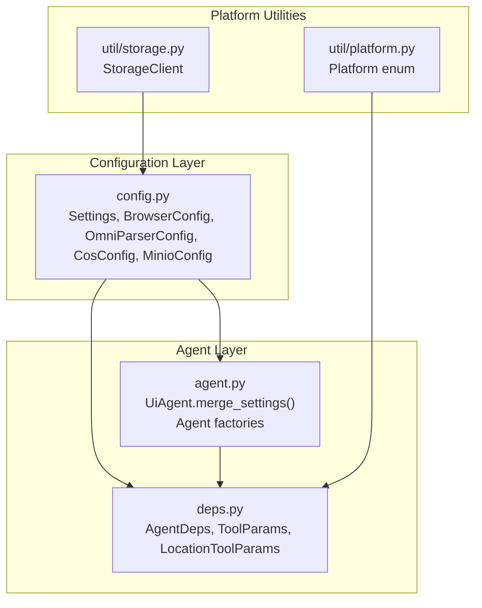
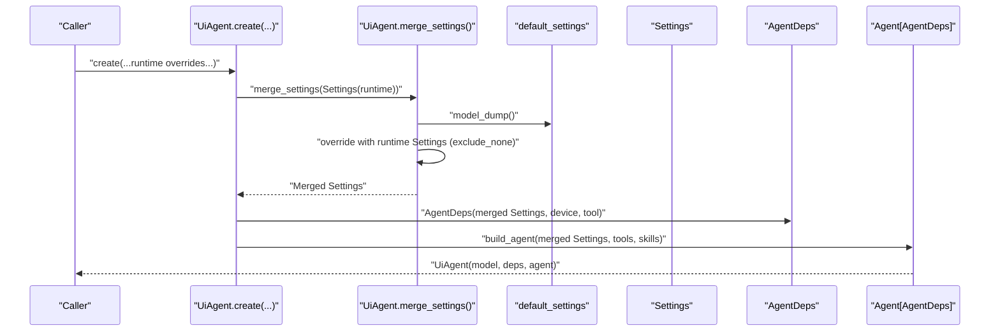
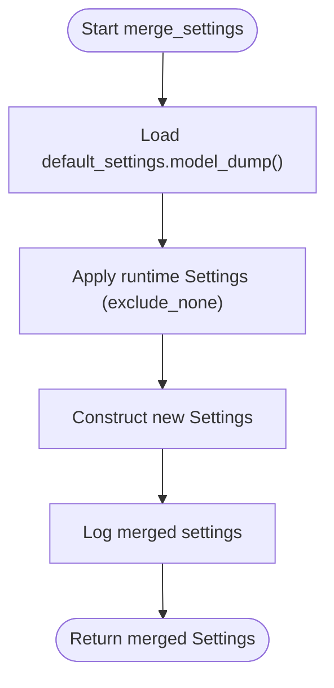
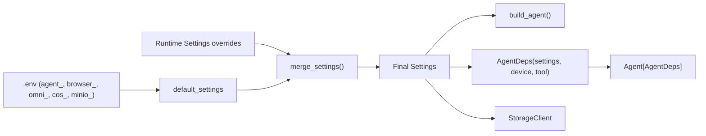

# Configuration Management

<cite>
**Referenced Files in This Document**
- [agent.py](file://src/page_eyes/agent.py)
- [config.py](file://src/page_eyes/config.py)
- [deps.py](file://src/page_eyes/deps.py)
- [platform.py](file://src/page_eyes/util/platform.py)
- [storage.py](file://src/page_eyes/util/storage.py)
- [conftest.py](file://tests/conftest.py)
</cite>

## Table of Contents
1. [Introduction](#introduction)
2. [Project Structure](#project-structure)
3. [Core Components](#core-components)
4. [Architecture Overview](#architecture-overview)
5. [Detailed Component Analysis](#detailed-component-analysis)
6. [Dependency Analysis](#dependency-analysis)
7. [Performance Considerations](#performance-considerations)
8. [Troubleshooting Guide](#troubleshooting-guide)
9. [Conclusion](#conclusion)

## Introduction
This document explains the configuration management system for the UiAgent base class, focusing on the merge_settings() static method, the Settings dataclass structure, parameter validation rules, and the configuration hierarchy. It also covers how Settings integrates with AgentDeps, how configuration affects agent behavior across platforms, and practical examples for overriding defaults and merging custom configurations.

## Project Structure
Configuration-related code is organized around three primary modules:
- Settings definition and environment loading
- Agent base class and configuration merging
- Agent dependencies and platform-aware behavior

**Diagram sources**
- [config.py:54-73](file://src/page_eyes/config.py#L54-L73)
- [agent.py:96-111](file://src/page_eyes/agent.py#L96-L111)
- [deps.py:75-101](file://src/page_eyes/deps.py#L75-L101)
- [platform.py:14-22](file://src/page_eyes/util/platform.py#L14-L22)
- [storage.py:154-193](file://src/page_eyes/util/storage.py#L154-L193)

**Section sources**
- [config.py:54-73](file://src/page_eyes/config.py#L54-L73)
- [agent.py:96-111](file://src/page_eyes/agent.py#L96-L111)
- [deps.py:75-101](file://src/page_eyes/deps.py#L75-L101)
- [platform.py:14-22](file://src/page_eyes/util/platform.py#L14-L22)
- [storage.py:154-193](file://src/page_eyes/util/storage.py#L154-L193)

## Core Components
- Settings: Central configuration container loaded from environment variables and defaults.
- BrowserConfig: Browser-specific settings (headless mode, device simulation).
- OmniParserConfig: Vision-language model service configuration.
- CosConfig/MinioConfig: Cloud storage credentials and endpoints.
- StorageClient: Unified interface for uploading artifacts using configured storage backend.
- AgentDeps: Runtime dependency container linking Settings, Device, and Tool.
- UiAgent.merge_settings(): Merges runtime overrides with defaults using a deterministic precedence.

**Section sources**
- [config.py:54-73](file://src/page_eyes/config.py#L54-L73)
- [config.py:40-45](file://src/page_eyes/config.py#L40-L45)
- [config.py:47-52](file://src/page_eyes/config.py#L47-L52)
- [config.py:19-27](file://src/page_eyes/config.py#L19-L27)
- [config.py:29-38](file://src/page_eyes/config.py#L29-L38)
- [storage.py:154-193](file://src/page_eyes/util/storage.py#L154-L193)
- [deps.py:75-101](file://src/page_eyes/deps.py#L75-L101)
- [agent.py:102-111](file://src/page_eyes/agent.py#L102-L111)

## Architecture Overview
The configuration system follows a layered hierarchy:
- Environment variables (via pydantic-settings) provide initial defaults.
- Runtime overrides passed to UiAgent.create(...) are merged into Settings.
- AgentDeps encapsulates Settings and devices/tools for agent execution.
- Platform-specific behavior is derived from Settings and device configuration.

**Diagram sources**
- [agent.py:102-111](file://src/page_eyes/agent.py#L102-L111)
- [agent.py:147-169](file://src/page_eyes/agent.py#L147-L169)
- [deps.py:75-101](file://src/page_eyes/deps.py#L75-L101)

## Detailed Component Analysis

### Settings Dataclass and Parameter Validation
Settings is a pydantic BaseSettings class with environment variable loading enabled. It defines:
- root: Path to the package root (excluded from dumps).
- model: LLM provider/model identifier.
- model_type: Either "llm" or "vlm".
- model_settings: Typed model settings (e.g., max_tokens, temperature).
- browser: Nested BrowserConfig for web agents.
- omni_parser: Vision-language service configuration.
- storage_client: Constructed from CosConfig/MinioConfig.
- debug: Boolean flag controlling verbose logging.

Validation and precedence:
- Fields are validated by pydantic settings rules.
- Environment variables are loaded from .env with prefixes:
  - agent_: for Settings fields
  - browser_: for BrowserConfig fields
  - omni_: for OmniParserConfig fields
  - cos_/minio_: for cloud storage credentials
- Extra environment keys are ignored to prevent accidental misconfiguration.

Practical implications:
- If an environment variable is missing, the field falls back to its declared default.
- None values in runtime Settings are excluded during merge to avoid overriding non-null defaults.

**Section sources**
- [config.py:54-73](file://src/page_eyes/config.py#L54-L73)
- [config.py:40-45](file://src/page_eyes/config.py#L40-L45)
- [config.py:47-52](file://src/page_eyes/config.py#L47-L52)
- [config.py:19-27](file://src/page_eyes/config.py#L19-L27)
- [config.py:29-38](file://src/page_eyes/config.py#L29-L38)

### Browser Configuration
BrowserConfig controls web agent behavior:
- headless: Boolean to run the browser without UI.
- simulate_device: Literal enum of device names or arbitrary string to emulate viewport and UA.

These fields are loaded from environment variables with the browser_ prefix and influence WebDevice creation and persistent context configuration.

**Section sources**
- [config.py:40-45](file://src/page_eyes/config.py#L40-L45)
- [agent.py:316-363](file://src/page_eyes/agent.py#L316-L363)

### Storage Backend Selection
StorageClient is constructed from CosConfig and MinioConfig:
- If CosConfig has secret_id and secret_key, CosStrategy is used.
- Else if MinioConfig has access_key and secret_key, MinioStrategy is used.
- Otherwise, Base64Strategy is used (no external storage).

This selection influences screenshot and artifact uploads across agents.

**Section sources**
- [config.py:19-27](file://src/page_eyes/config.py#L19-L27)
- [config.py:29-38](file://src/page_eyes/config.py#L29-L38)
- [config.py:67](file://src/page_eyes/config.py#L67)
- [storage.py:161-186](file://src/page_eyes/util/storage.py#L161-L186)

### Settings Model Fields and Behavior
- model: Determines the LLM provider/model used by the Agent.
- model_settings: Controls token limits and sampling temperature.
- model_type: Switches between LLM and VLM modes, affecting parameter types for tool calls.
- debug: Enables verbose logging for diagnostics.
- root: Internal path used for locating skill directories and templates.

**Section sources**
- [config.py:54-73](file://src/page_eyes/config.py#L54-L73)
- [deps.py:162](file://src/page_eyes/deps.py#L162)

### Configuration Hierarchy and Precedence
Precedence order (highest wins):
1. Runtime overrides passed to UiAgent.create(...)
2. Environment variables (.env) with agent_, browser_, omni_, cos_, minio_ prefixes
3. Hardcoded defaults in Settings and nested configs

The merge process:
- Start with default_settings.model_dump().
- Overlay runtime Settings with exclude_none=True to avoid nulling out environment-provided values.
- Produce a new Settings instance reflecting the final configuration.

**Diagram sources**
- [agent.py:102-111](file://src/page_eyes/agent.py#L102-L111)

**Section sources**
- [agent.py:102-111](file://src/page_eyes/agent.py#L102-L111)

### Relationship Between Settings and AgentDeps
AgentDeps holds:
- settings: The merged Settings used by the agent.
- device: Platform-specific device abstraction.
- tool: Toolset used for actions.
- context: Execution context for steps and screen info.
- app_name_map: Optional mapping for friendly app names to identifiers.

The agent’s model, system prompts, and model_settings are taken from Settings, while device and tool are platform-specific.

**Section sources**
- [deps.py:75-101](file://src/page_eyes/deps.py#L75-L101)
- [agent.py:147-169](file://src/page_eyes/agent.py#L147-L169)

### Platform-Aware Configuration Effects
- Platform enum defines platform types used by device abstractions.
- Device creation methods derive device_size and behavior from platform and browser/device emulation settings.
- model_type switching affects parameter types for tool calls (LLM vs VLM).

**Section sources**
- [platform.py:14-22](file://src/page_eyes/util/platform.py#L14-L22)
- [agent.py:316-363](file://src/page_eyes/agent.py#L316-L363)
- [deps.py:162](file://src/page_eyes/deps.py#L162)

### Practical Examples

- Override model and model_settings at runtime:
  - Pass model and model_settings to UiAgent.create(...) to merge with defaults.
  - Example path: [WebAgent.create:319-363](file://src/page_eyes/agent.py#L319-L363)

- Enable headless browser and device emulation:
  - Pass headless and simulate_device to WebAgent.create(...).
  - Example path: [WebAgent.create:319-363](file://src/page_eyes/agent.py#L319-L363)

- Toggle debug mode:
  - Pass debug=True to any agent create(...) to increase verbosity.
  - Example path: [conftest.py fixtures:44-72](file://tests/conftest.py#L44-L72)

- Merge custom configurations:
  - Create a Settings instance with desired overrides and call UiAgent.merge_settings(Settings(...)).
  - Example path: [UiAgent.merge_settings:102-111](file://src/page_eyes/agent.py#L102-L111)

- Handle configuration conflicts:
  - Runtime overrides take precedence over environment variables.
  - None values in runtime Settings are excluded to preserve environment-provided values.
  - Example path: [UiAgent.merge_settings:102-111](file://src/page_eyes/agent.py#L102-L111)

- Configure storage backend:
  - Set cos_* or minio_* environment variables to select storage strategy.
  - Example path: [CosConfig:19-27](file://src/page_eyes/config.py#L19-L27), [MinioConfig:29-38](file://src/page_eyes/config.py#L29-L38), [StorageClient:161-186](file://src/page_eyes/util/storage.py#L161-L186)

**Section sources**
- [agent.py:102-111](file://src/page_eyes/agent.py#L102-L111)
- [agent.py:319-363](file://src/page_eyes/agent.py#L319-L363)
- [conftest.py:44-72](file://tests/conftest.py#L44-L72)
- [config.py:19-27](file://src/page_eyes/config.py#L19-L27)
- [config.py:29-38](file://src/page_eyes/config.py#L29-L38)
- [storage.py:161-186](file://src/page_eyes/util/storage.py#L161-L186)

## Dependency Analysis
The following diagram shows how configuration flows through the system:

**Diagram sources**
- [config.py:54-73](file://src/page_eyes/config.py#L54-L73)
- [agent.py:102-111](file://src/page_eyes/agent.py#L102-L111)
- [agent.py:147-169](file://src/page_eyes/agent.py#L147-L169)
- [deps.py:75-101](file://src/page_eyes/deps.py#L75-L101)
- [storage.py:161-186](file://src/page_eyes/util/storage.py#L161-L186)

**Section sources**
- [config.py:54-73](file://src/page_eyes/config.py#L54-L73)
- [agent.py:102-111](file://src/page_eyes/agent.py#L102-L111)
- [agent.py:147-169](file://src/page_eyes/agent.py#L147-L169)
- [deps.py:75-101](file://src/page_eyes/deps.py#L75-L101)
- [storage.py:161-186](file://src/page_eyes/util/storage.py#L161-L186)

## Performance Considerations
- Environment variable loading occurs once at import time; subsequent merges are lightweight dictionary operations.
- Excluding None values prevents unnecessary reinitialization of complex fields.
- Using default_settings.model_dump() ensures minimal overhead when constructing merged Settings.

## Troubleshooting Guide
Common issues and resolutions:
- Unexpected None values overriding environment variables:
  - Ensure runtime Settings exclude None values by using exclude_none=True during merge.
  - Reference: [UiAgent.merge_settings:102-111](file://src/page_eyes/agent.py#L102-L111)

- Browser not launching in headless mode:
  - Verify browser.headless environment variable and runtime override.
  - Reference: [BrowserConfig:40-45](file://src/page_eyes/config.py#L40-L45), [WebAgent.create:319-363](file://src/page_eyes/agent.py#L319-L363)

- Storage upload failures:
  - Confirm cos_ or minio_ environment variables are set appropriately.
  - Reference: [CosConfig:19-27](file://src/page_eyes/config.py#L19-L27), [MinioConfig:29-38](file://src/page_eyes/config.py#L29-L38), [StorageClient:161-186](file://src/page_eyes/util/storage.py#L161-L186)

- Debug logs not appearing:
  - Set debug=True in runtime overrides or environment variable.
  - Reference: [Settings.debug](file://src/page_eyes/config.py#L69), [conftest.py](file://tests/conftest.py#L29)

**Section sources**
- [agent.py:102-111](file://src/page_eyes/agent.py#L102-L111)
- [config.py:40-45](file://src/page_eyes/config.py#L40-L45)
- [config.py:19-27](file://src/page_eyes/config.py#L19-L27)
- [config.py:29-38](file://src/page_eyes/config.py#L29-L38)
- [storage.py:161-186](file://src/page_eyes/util/storage.py#L161-L186)
- [config.py:69](file://src/page_eyes/config.py#L69)
- [conftest.py:29](file://tests/conftest.py#L29)

## Conclusion
The configuration management system centers on Settings with environment-driven defaults and explicit runtime overrides. UiAgent.merge_settings() provides a clean, deterministic merge strategy that preserves environment-provided values while allowing targeted customization. AgentDeps ties Settings to platform-specific devices and tools, enabling consistent behavior across platforms. By following the precedence rules and using the provided examples, you can reliably override defaults, merge custom configurations, and resolve conflicts across environments.