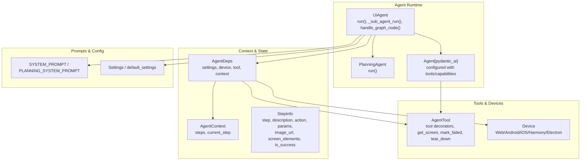
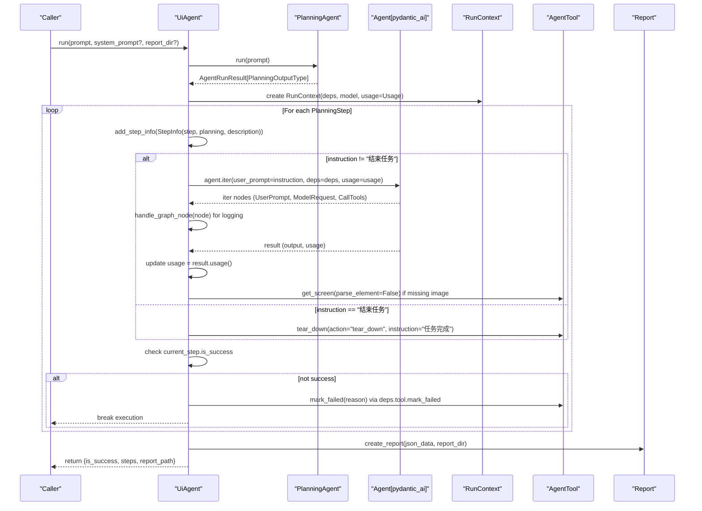
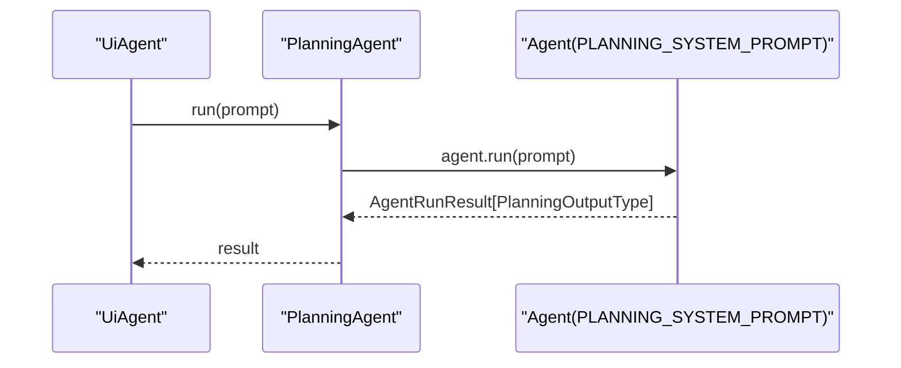
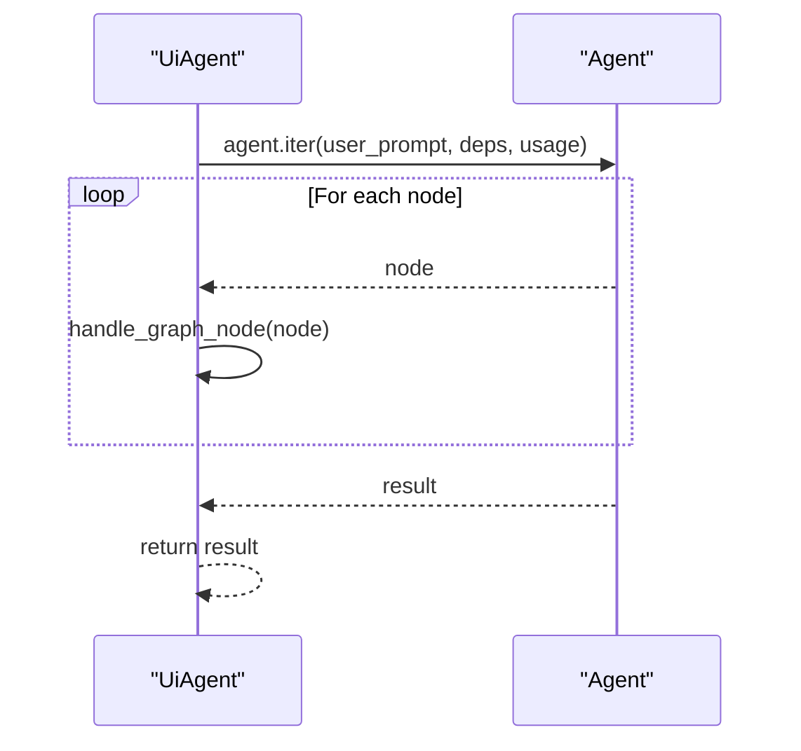
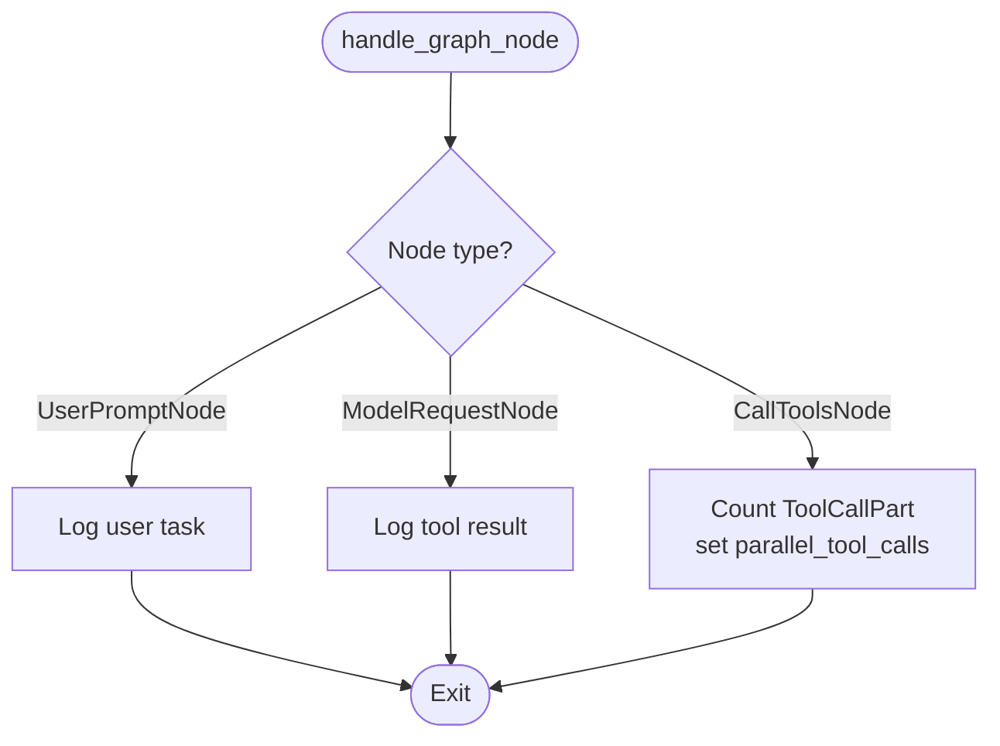
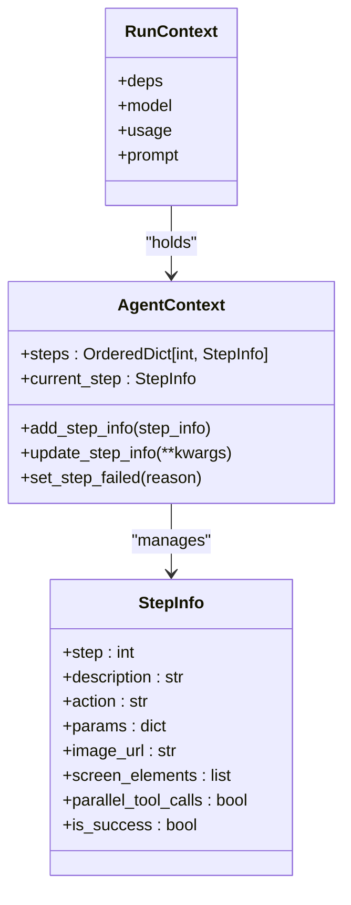
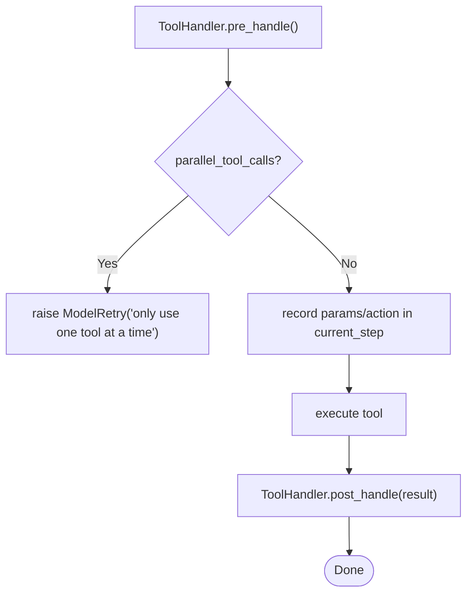
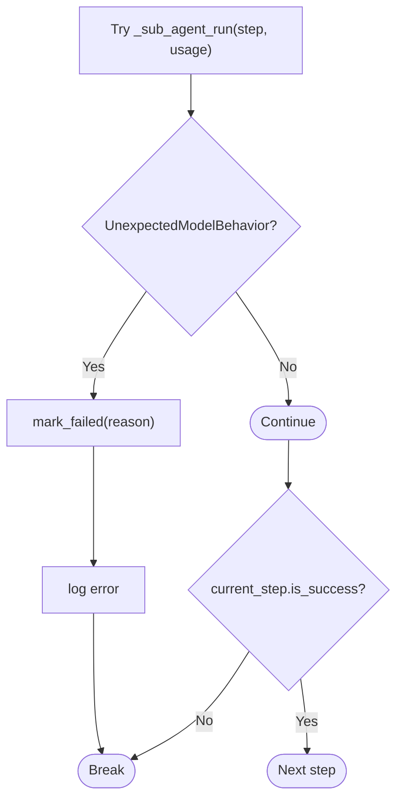
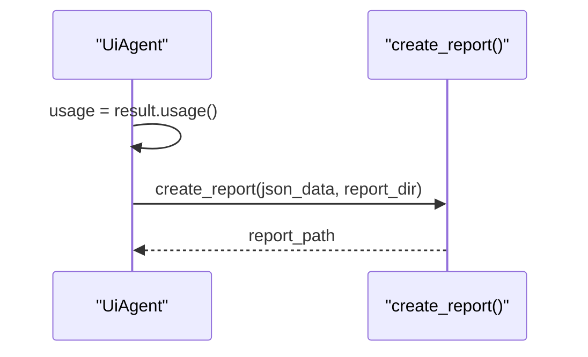
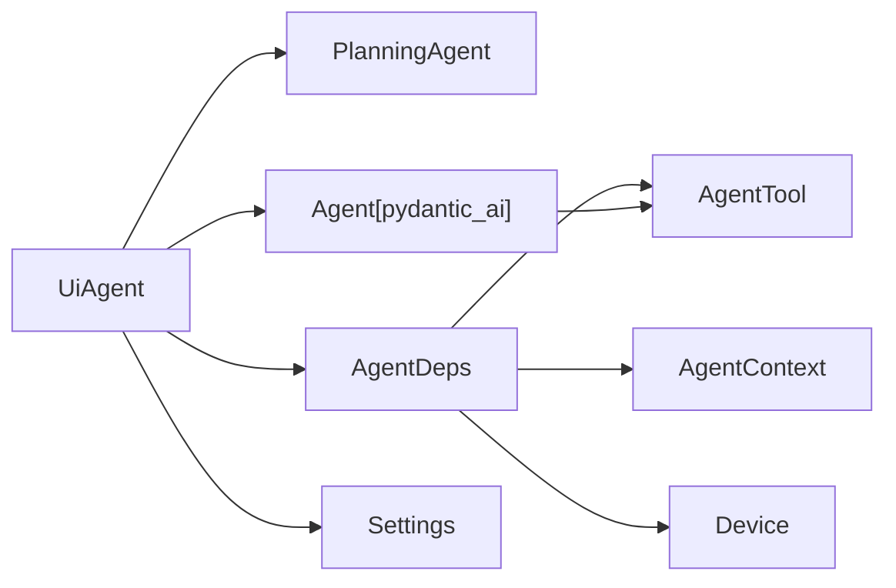

# Execution Workflow and Orchestration

<cite>
**Referenced Files in This Document**
- [agent.py](file://src/page_eyes/agent.py)
- [deps.py](file://src/page_eyes/deps.py)
- [prompt.py](file://src/page_eyes/prompt.py)
- [_base.py](file://src/page_eyes/tools/_base.py)
- [device.py](file://src/page_eyes/device.py)
- [config.py](file://src/page_eyes/config.py)
- [report_template.html](file://src/page_eyes/report_template.html)
- [test_web_agent.py](file://tests/test_web_agent.py)
- [test_planning_agent.py](file://tests/test_planning_agent.py)
</cite>

## Table of Contents
1. [Introduction](#introduction)
2. [Project Structure](#project-structure)
3. [Core Components](#core-components)
4. [Architecture Overview](#architecture-overview)
5. [Detailed Component Analysis](#detailed-component-analysis)
6. [Dependency Analysis](#dependency-analysis)
7. [Performance Considerations](#performance-considerations)
8. [Troubleshooting Guide](#troubleshooting-guide)
9. [Conclusion](#conclusion)
10. [Appendices](#appendices)

## Introduction
This document explains the execution workflow and orchestration capabilities of the UiAgent base class. It covers the run() method’s end-to-end flow, including planning agent integration, step-by-step execution, error handling via mark_failed(), usage tracking, and reporting. It also details the _sub_agent_run() helper, context management through RunContext, and step-by-step logging via handle_graph_node(). Practical examples, error recovery strategies, parallel tool execution constraints, step validation, and termination conditions are included for robust operation.

## Project Structure
The UiAgent orchestrates planning, execution, tool invocation, and reporting across platforms (web, Android, iOS, Harmony, Electron). The core runtime resides in the agent module, with orchestration logic in UiAgent, planning logic in PlanningAgent, tooling in AgentTool, and shared context/state in deps.



**Diagram sources**
- [agent.py:96-314](file://src/page_eyes/agent.py#L96-L314)
- [deps.py:48-82](file://src/page_eyes/deps.py#L48-L82)
- [_base.py:130-391](file://src/page_eyes/tools/_base.py#L130-L391)
- [device.py:42-390](file://src/page_eyes/device.py#L42-L390)
- [prompt.py:8-166](file://src/page_eyes/prompt.py#L8-L166)
- [config.py:54-73](file://src/page_eyes/config.py#L54-L73)

**Section sources**
- [agent.py:96-314](file://src/page_eyes/agent.py#L96-L314)
- [deps.py:48-82](file://src/page_eyes/deps.py#L48-L82)
- [prompt.py:8-166](file://src/page_eyes/prompt.py#L8-L166)
- [config.py:54-73](file://src/page_eyes/config.py#L54-L73)

## Core Components
- UiAgent: Orchestrates planning, step iteration, tool execution, error handling, and reporting. Provides run(), _sub_agent_run(), handle_graph_node().
- PlanningAgent: Decomposes user intent into atomic PlanningStep sequences using a dedicated system prompt.
- AgentTool: Defines tool wrappers and utilities (get_screen, mark_failed, tear_down) with pre/post handlers and decorators.
- AgentDeps: Holds Settings, Device, Tool, and AgentContext for cross-module coordination.
- AgentContext/StepInfo: Tracks per-step metadata, success/failure, and screen state.
- RunContext: Provides runtime context for tool execution and usage tracking.

**Section sources**
- [agent.py:96-314](file://src/page_eyes/agent.py#L96-L314)
- [agent.py:73-90](file://src/page_eyes/agent.py#L73-L90)
- [_base.py:130-391](file://src/page_eyes/tools/_base.py#L130-L391)
- [deps.py:48-82](file://src/page_eyes/deps.py#L48-L82)
- [deps.py:35-73](file://src/page_eyes/deps.py#L35-L73)

## Architecture Overview
The UiAgent integrates a planning phase with a strict execution loop. PlanningAgent produces a sequence of PlanningStep items. UiAgent iterates each step, invoking a sub-agent run for each step, enforcing single-tool-at-a-time constraints, capturing screenshots, and aggregating usage metrics. Failures are recorded via mark_failed() and terminate the current step; the overall run stops if any step fails unless explicitly handled.



**Diagram sources**
- [agent.py:225-314](file://src/page_eyes/agent.py#L225-L314)
- [agent.py:217-224](file://src/page_eyes/agent.py#L217-L224)
- [agent.py:192-216](file://src/page_eyes/agent.py#L192-L216)
- [agent.py:73-90](file://src/page_eyes/agent.py#L73-L90)
- [_base.py:322-346](file://src/page_eyes/tools/_base.py#L322-L346)

**Section sources**
- [agent.py:225-314](file://src/page_eyes/agent.py#L225-L314)
- [agent.py:217-224](file://src/page_eyes/agent.py#L217-L224)
- [agent.py:192-216](file://src/page_eyes/agent.py#L192-L216)

## Detailed Component Analysis

### UiAgent.run(): End-to-End Execution Flow
- Planning: Invokes PlanningAgent.run(prompt) to produce a PlanningOutputType containing steps.
- Step Iteration: Adds a sentinel “结束任务” step to finalize teardown.
- Per-Step Execution:
  - Creates RunContext with deps, model, and empty Usage.
  - Logs step header and description.
  - If instruction is not the sentinel:
    - Calls _sub_agent_run(planning, usage) to execute the step.
    - On success, updates usage and logs the output.
    - On UnexpectedModelBehavior, marks failure via deps.tool.mark_failed and logs the error.
  - After each step, ensures a screenshot exists (get_screen with parse_element=False) if none captured.
  - Checks current_step.is_success; if false, breaks the loop.
- Finalization:
  - Builds a report JSON with is_success, device_size, and steps.
  - Generates HTML report via create_report() and returns structured results.

```mermaid
flowchart TD
Start([Start run]) --> Plan["PlanningAgent.run(prompt)"]
Plan --> Steps["steps + sentinel '结束任务'"]
Steps --> Loop{"For each step"}
Loop --> |instruction != '结束任务'| Exec["_sub_agent_run(step, usage)"]
Exec --> UpdateUsage["usage = result.usage()"]
UpdateUsage --> LogOut["log output"]
LogOut --> Screenshot["get_screen(parse_element=False) if missing"]
Screenshot --> CheckSuccess{"current_step.is_success?"}
CheckSuccess --> |No| MarkFail["mark_failed(reason)"]
MarkFail --> Break([Break])
CheckSuccess --> |Yes| NextStep["Next step"]
Loop --> |instruction == '结束任务'| TearDown["tear_down(action='tear_down')"]
TearDown --> Screenshot2["get_screen(parse_element=False) if missing"]
Screenshot2 --> NextStep
NextStep --> Loop
Break --> BuildReport["create_report(json_data)"]
Loop --> |Done| BuildReport
BuildReport --> Return([Return {is_success, steps, report_path}])
```

**Diagram sources**
- [agent.py:225-314](file://src/page_eyes/agent.py#L225-L314)
- [_base.py:322-346](file://src/page_eyes/tools/_base.py#L322-L346)

**Section sources**
- [agent.py:225-314](file://src/page_eyes/agent.py#L225-L314)

### PlanningAgent Integration and Step Decomposition
- PlanningAgent constructs an Agent with PLANNING_SYSTEM_PROMPT and output type PlanningOutputType.
- It runs the user prompt and returns an AgentRunResult containing steps.
- The UiAgent appends a sentinel PlanningStep with instruction "结束任务" to trigger teardown.



**Diagram sources**
- [agent.py:73-90](file://src/page_eyes/agent.py#L73-L90)
- [prompt.py:8-28](file://src/page_eyes/prompt.py#L8-L28)

**Section sources**
- [agent.py:73-90](file://src/page_eyes/agent.py#L73-L90)
- [prompt.py:8-28](file://src/page_eyes/prompt.py#L8-L28)

### _sub_agent_run(): Sub-Agent Execution Helper
- Wraps agent.iter(...) with async iteration over nodes.
- For each node, delegates to handle_graph_node() for logging.
- Returns the final AgentRunResult for usage accumulation.



**Diagram sources**
- [agent.py:217-224](file://src/page_eyes/agent.py#L217-L224)
- [agent.py:192-216](file://src/page_eyes/agent.py#L192-L216)

**Section sources**
- [agent.py:217-224](file://src/page_eyes/agent.py#L217-L224)
- [agent.py:192-216](file://src/page_eyes/agent.py#L192-L216)

### handle_graph_node(): Step-by-Step Logging
- Logs user prompts, tool results, and tool calls.
- Detects parallel tool calls by counting ToolCallPart entries and sets current_step.parallel_tool_calls accordingly.



**Diagram sources**
- [agent.py:192-216](file://src/page_eyes/agent.py#L192-L216)

**Section sources**
- [agent.py:192-216](file://src/page_eyes/agent.py#L192-L216)

### Context Management via RunContext and AgentContext
- RunContext is created with deps, model, and an empty Usage accumulator.
- AgentContext maintains an ordered mapping of steps and the current step pointer.
- ToolHandler enforces single-tool-at-a-time by checking current_step.parallel_tool_calls and raising ModelRetry if violated.



**Diagram sources**
- [agent.py:246-249](file://src/page_eyes/agent.py#L246-L249)
- [deps.py:48-82](file://src/page_eyes/deps.py#L48-L82)
- [deps.py:35-73](file://src/page_eyes/deps.py#L35-L73)
- [_base.py:39-86](file://src/page_eyes/tools/_base.py#L39-L86)

**Section sources**
- [agent.py:246-249](file://src/page_eyes/agent.py#L246-L249)
- [deps.py:48-82](file://src/page_eyes/deps.py#L48-L82)
- [deps.py:35-73](file://src/page_eyes/deps.py#L35-L73)
- [_base.py:39-86](file://src/page_eyes/tools/_base.py#L39-L86)

### Tool Execution, Parallel Constraints, and Atomic Actions
- Tools are decorated with @tool and registered via AgentTool.tools.
- ToolHandler pre_handle() records params/action and enforces single-tool-at-a-time by raising ModelRetry when parallel_tool_calls is true.
- Tools like get_screen capture images and optionally parse elements; mark_failed records failure and halts the current step.



**Diagram sources**
- [_base.py:39-86](file://src/page_eyes/tools/_base.py#L39-L86)
- [_base.py:130-151](file://src/page_eyes/tools/_base.py#L130-L151)
- [_base.py:322-346](file://src/page_eyes/tools/_base.py#L322-L346)

**Section sources**
- [_base.py:39-86](file://src/page_eyes/tools/_base.py#L39-L86)
- [_base.py:130-151](file://src/page_eyes/tools/_base.py#L130-L151)
- [_base.py:322-346](file://src/page_eyes/tools/_base.py#L322-L346)

### Error Handling with mark_failed() and Termination Conditions
- On UnexpectedModelBehavior during step execution, UiAgent calls deps.tool.mark_failed() and logs the error.
- After each step, if current_step.is_success is False, the loop breaks, terminating further execution.
- tear_down() is invoked upon encountering the sentinel “结束任务” step.



**Diagram sources**
- [agent.py:259-271](file://src/page_eyes/agent.py#L259-L271)
- [_base.py:322-346](file://src/page_eyes/tools/_base.py#L322-L346)

**Section sources**
- [agent.py:259-271](file://src/page_eyes/agent.py#L259-L271)
- [_base.py:322-346](file://src/page_eyes/tools/_base.py#L322-L346)

### Usage Tracking and Reporting
- Usage accumulates across steps via result.usage() after each successful step.
- A report JSON is built with is_success, device_size, and steps, then rendered to an HTML report via create_report().



**Diagram sources**
- [agent.py:246-263](file://src/page_eyes/agent.py#L246-L263)
- [agent.py:171-191](file://src/page_eyes/agent.py#L171-L191)
- [report_template.html:1-45](file://src/page_eyes/report_template.html#L1-L45)

**Section sources**
- [agent.py:246-263](file://src/page_eyes/agent.py#L246-L263)
- [agent.py:171-191](file://src/page_eyes/agent.py#L171-L191)
- [report_template.html:1-45](file://src/page_eyes/report_template.html#L1-L45)

## Dependency Analysis
UiAgent depends on:
- PlanningAgent for decomposition into PlanningStep sequences.
- AgentTool for atomic actions and state capture.
- AgentContext/StepInfo for per-step state and success tracking.
- RunContext for usage and runtime context.
- Settings for model configuration and environment overrides.



**Diagram sources**
- [agent.py:96-314](file://src/page_eyes/agent.py#L96-L314)
- [deps.py:48-82](file://src/page_eyes/deps.py#L48-L82)
- [config.py:54-73](file://src/page_eyes/config.py#L54-L73)

**Section sources**
- [agent.py:96-314](file://src/page_eyes/agent.py#L96-L314)
- [deps.py:48-82](file://src/page_eyes/deps.py#L48-L82)
- [config.py:54-73](file://src/page_eyes/config.py#L54-L73)

## Performance Considerations
- Single-tool-at-a-time enforcement prevents race conditions and reduces ambiguity in state transitions.
- get_screen() is called after steps to ensure visual grounding; avoid redundant captures by checking current_step.image_url.
- Usage accumulation per step enables cost-awareness and budgeting across long executions.
- Parallel tool detection helps catch misconfigured plans early.

[No sources needed since this section provides general guidance]

## Troubleshooting Guide
Common issues and remedies:
- UnexpectedModelBehavior during step execution:
  - Symptom: Exception raised mid-step.
  - Action: UiAgent catches it, calls mark_failed(), logs the error, and terminates the current step.
- Tool concurrency violations:
  - Symptom: ModelRetry indicating only one tool at a time.
  - Action: Ensure the plan decomposes into atomic actions; do not request multiple concurrent tool calls.
- Missing screenshots after actions:
  - Symptom: Lack of visual context for subsequent steps.
  - Action: UiAgent automatically calls get_screen(parse_element=False) if image_url is empty after a step.
- Teardown failures:
  - Symptom: Sentinel step not reached or teardown not executed.
  - Action: Ensure the planning ends with instruction "结束任务".

**Section sources**
- [agent.py:259-271](file://src/page_eyes/agent.py#L259-L271)
- [_base.py:39-86](file://src/page_eyes/tools/_base.py#L39-L86)
- [agent.py:277-284](file://src/page_eyes/agent.py#L277-L284)

## Conclusion
UiAgent provides a robust, stepwise orchestration framework integrating planning, execution, tooling, and reporting. Its emphasis on atomic actions, single-tool-at-a-time execution, and explicit failure signaling yields reliable automation across diverse devices and modalities. The RunContext and AgentContext abstractions enable precise usage tracking and step-level diagnostics, while the report generation supports post-execution review and auditing.

[No sources needed since this section summarizes without analyzing specific files]

## Appendices

### Example Execution Patterns
- Web automation with multiple steps and assertions:
  - See [test_web_agent.py:11-22](file://tests/test_web_agent.py#L11-L22) for a composite interaction including navigation, scrolling, clicking, and waiting.
- Planning decomposition verification:
  - See [test_planning_agent.py:12-27](file://tests/test_planning_agent.py#L12-L27) for validating PlanningOutputType steps.

**Section sources**
- [test_web_agent.py:11-22](file://tests/test_web_agent.py#L11-L22)
- [test_planning_agent.py:12-27](file://tests/test_planning_agent.py#L12-L27)