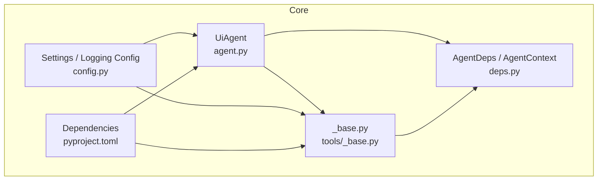
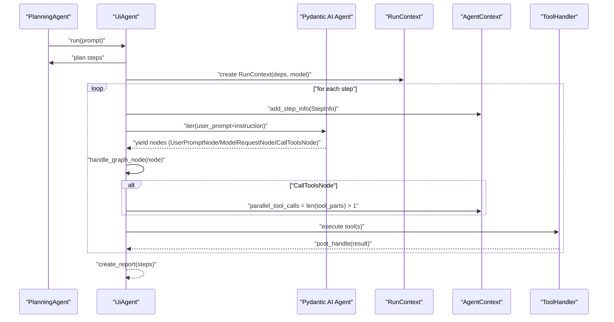
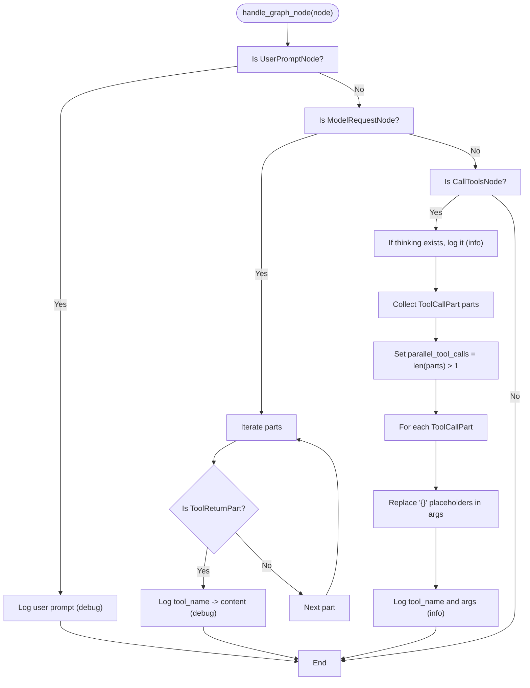
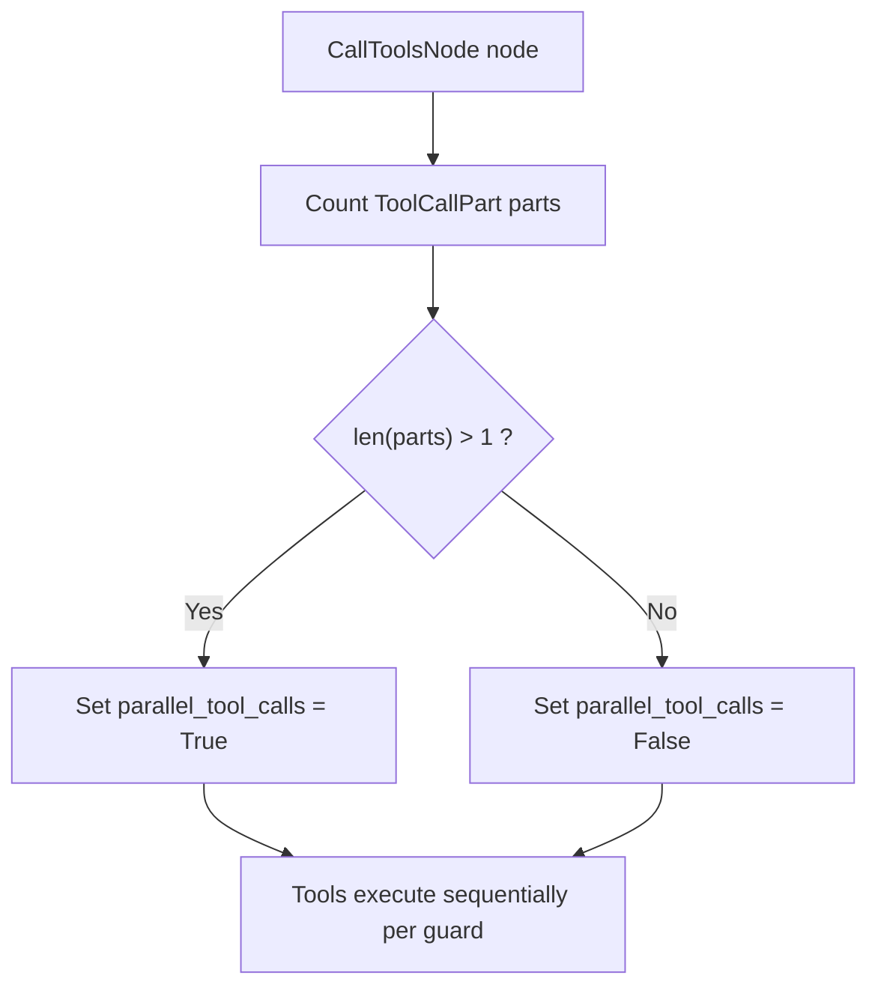
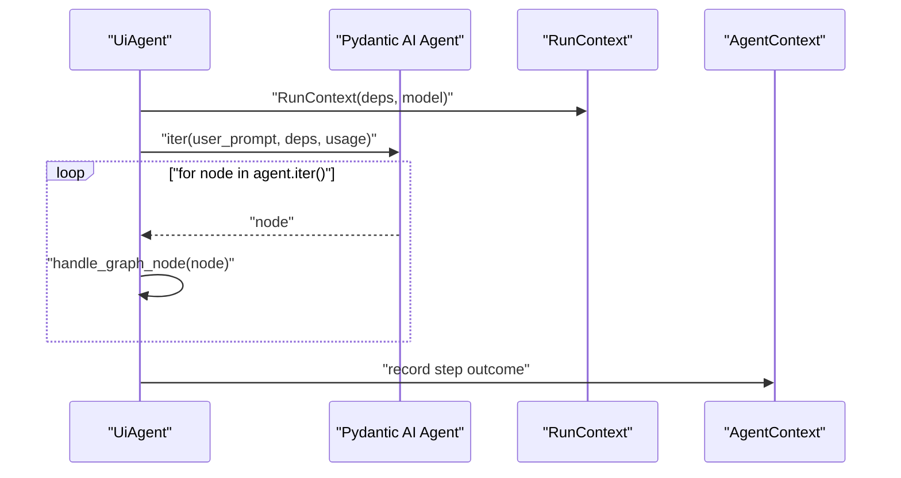
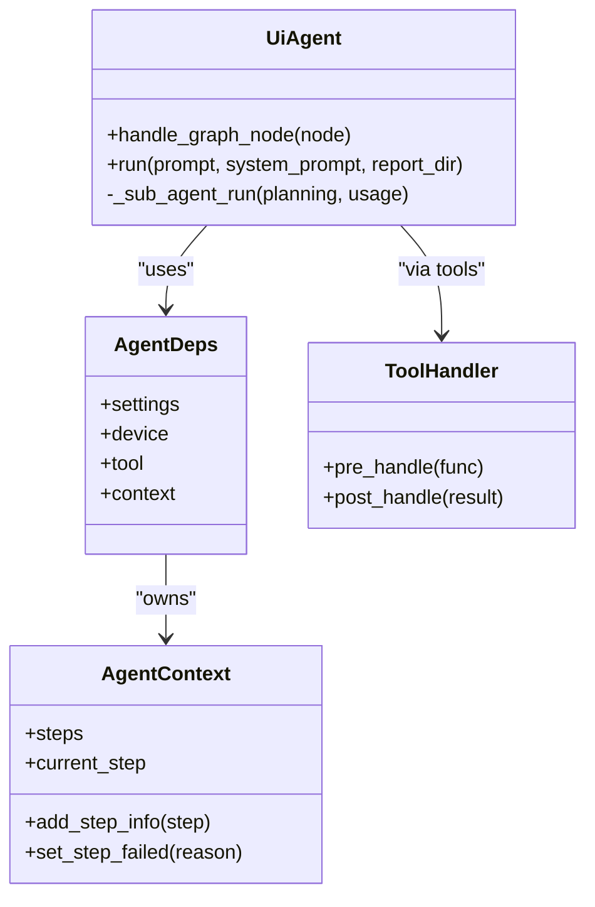

# Logging and Graph Node Handling

<cite>
**Referenced Files in This Document**
- [agent.py](file://src/page_eyes/agent.py)
- [deps.py](file://src/page_eyes/deps.py)
- [_base.py](file://src/page_eyes/tools/_base.py)
- [config.py](file://src/page_eyes/config.py)
- [pyproject.toml](file://pyproject.toml)
</cite>

## Table of Contents
1. [Introduction](#introduction)
2. [Project Structure](#project-structure)
3. [Core Components](#core-components)
4. [Architecture Overview](#architecture-overview)
5. [Detailed Component Analysis](#detailed-component-analysis)
6. [Dependency Analysis](#dependency-analysis)
7. [Performance Considerations](#performance-considerations)
8. [Troubleshooting Guide](#troubleshooting-guide)
9. [Conclusion](#conclusion)

## Introduction
This document explains the logging and graph node handling functionality centered on the UiAgent base class. It focuses on how the handle_graph_node() method processes different Pydantic AI graph nodes (UserPromptNode, ModelRequestNode, CallToolsNode), extracts meaningful information from tool calls, tracks steps via parallel_tool_calls, and integrates with Pydantic AI’s RunContext and graph traversal patterns. It also covers logging configuration, log level filtering, and practical tips for custom logging handlers, debugging node inspection, and monitoring agent execution flow.

## Project Structure
The relevant modules for logging and graph node handling are:
- UiAgent and graph traversal in agent.py
- Execution context and step tracking in deps.py
- Tool wrappers and step lifecycle hooks in tools/_base.py
- Logging framework and configuration in config.py and pyproject.toml

**Diagram sources**
- [agent.py:97-313](file://src/page_eyes/agent.py#L97-L313)
- [deps.py:48-100](file://src/page_eyes/deps.py#L48-L100)
- [_base.py:39-128](file://src/page_eyes/tools/_base.py#L39-L128)
- [config.py:54-73](file://src/page_eyes/config.py#L54-L73)
- [pyproject.toml:19-32](file://pyproject.toml#L19-L32)

**Section sources**
- [agent.py:97-313](file://src/page_eyes/agent.py#L97-L313)
- [deps.py:48-100](file://src/page_eyes/deps.py#L48-L100)
- [_base.py:39-128](file://src/page_eyes/tools/_base.py#L39-L128)
- [config.py:54-73](file://src/page_eyes/config.py#L54-L73)
- [pyproject.toml:19-32](file://pyproject.toml#L19-L32)

## Core Components
- UiAgent.handle_graph_node(): Formats and logs graph node events during agent iteration, including user prompts, tool results, and tool calls. It also detects parallel tool calls and updates the current step context accordingly.
- AgentDeps and AgentContext: Provide execution context, step metadata, and a flag for parallel_tool_calls used by both logging and tool execution guards.
- ToolHandler: Wraps tool execution with pre/post hooks, enforces single-tool execution when parallel_tool_calls is false, and records step outcomes.
- Settings and Logging: Centralized configuration for model settings and debug flags; logging is powered by Loguru.

Key responsibilities:
- Detect node types and extract relevant information (e.g., tool call arguments).
- Track whether multiple tools are being invoked concurrently.
- Integrate with RunContext for step-level tracing and usage accounting.
- Provide structured logs for monitoring and debugging.

**Section sources**
- [agent.py:192-223](file://src/page_eyes/agent.py#L192-L223)
- [deps.py:35-73](file://src/page_eyes/deps.py#L35-L73)
- [_base.py:39-128](file://src/page_eyes/tools/_base.py#L39-L128)
- [config.py:54-73](file://src/page_eyes/config.py#L54-L73)

## Architecture Overview
The UiAgent orchestrates planning, builds a Pydantic AI Agent, and iterates over the run graph. During iteration, it logs node events and updates the execution context. Tools are wrapped by ToolHandler to enforce single-tool execution when needed and record step outcomes.

**Diagram sources**
- [agent.py:217-223](file://src/page_eyes/agent.py#L217-L223)
- [agent.py:252-287](file://src/page_eyes/agent.py#L252-L287)
- [deps.py:64-72](file://src/page_eyes/deps.py#L64-L72)
- [_base.py:63-86](file://src/page_eyes/tools/_base.py#L63-L86)

## Detailed Component Analysis

### UiAgent.handle_graph_node() — Node Type Detection and Logging
Purpose:
- Normalize and log graph node events for observability.
- Extract tool call information and detect parallel tool invocation.
- Record thinking content from model responses when present.

Behavior:
- UserPromptNode: Logs the user prompt at a debug level.
- ModelRequestNode: Iterates request parts and logs tool return content for ToolReturnPart entries.
- CallToolsNode: Logs thinking content if present, counts ToolCallPart parts, sets parallel_tool_calls on the current step, and logs each tool call with sanitized arguments.

**Diagram sources**
- [agent.py:192-215](file://src/page_eyes/agent.py#L192-L215)

**Section sources**
- [agent.py:192-215](file://src/page_eyes/agent.py#L192-L215)

### Parallel Tool Calls and Step Tracking
Parallel detection:
- The handler inspects ToolCallPart entries in the model response and sets the current step’s parallel_tool_calls flag accordingly. This informs downstream tool execution logic.

Downstream enforcement:
- ToolHandler.pre_handle() checks the parallel_tool_calls flag and raises a retry condition if multiple tools are attempted concurrently, ensuring single-tool execution unless explicitly allowed.

**Diagram sources**
- [agent.py:204-215](file://src/page_eyes/agent.py#L204-L215)
- [_base.py:63-86](file://src/page_eyes/tools/_base.py#L63-L86)

**Section sources**
- [agent.py:204-215](file://src/page_eyes/agent.py#L204-L215)
- [_base.py:63-86](file://src/page_eyes/tools/_base.py#L63-L86)

### Integration with Pydantic AI RunContext and Graph Traversal
- UiAgent.run() constructs a RunContext with the agent’s model and dependencies, then iterates the agent for each planning step.
- During iteration, UiAgent.iter() yields graph nodes; handle_graph_node() is called for each node to log and track execution.
- On exceptions (e.g., UnexpectedModelBehavior), the system marks the step as failed and continues or terminates based on policy.

**Diagram sources**
- [agent.py:217-223](file://src/page_eyes/agent.py#L217-L223)
- [agent.py:247-249](file://src/page_eyes/agent.py#L247-L249)

**Section sources**
- [agent.py:217-223](file://src/page_eyes/agent.py#L217-L223)
- [agent.py:247-249](file://src/page_eyes/agent.py#L247-L249)

### Tool Call Message Extraction and Formatting
- Tool call parts are identified and filtered from the model response.
- Arguments are sanitized by replacing placeholder markers to improve readability.
- Each tool call is logged with the tool name and formatted arguments.

Practical implications:
- This enables precise auditing of tool invocations and their parameters.
- Combined with parallel_tool_calls, it helps diagnose concurrency-related failures.

**Section sources**
- [agent.py:204-215](file://src/page_eyes/agent.py#L204-L215)

### Monitoring Agent Execution Flow
- Step-level logging includes planning completion, step start/end, and final summary.
- Tool results are logged at a debug level for visibility into intermediate outcomes.
- Thinking content is surfaced at info level to capture reasoning traces.

Operational guidance:
- Use step numbering and instruction summaries to correlate logs with user intent.
- Inspect thinking logs to understand model decision-making.

**Section sources**
- [agent.py:232-241](file://src/page_eyes/agent.py#L232-L241)
- [agent.py:251-276](file://src/page_eyes/agent.py#L251-L276)
- [agent.py:197-202](file://src/page_eyes/agent.py#L197-L202)

### Logging Configuration, Levels, and External Systems
- Logging framework: Loguru is used across the codebase for structured logging.
- Log levels:
  - Debug: User prompts and tool results.
  - Info: Thinking content, step transitions, and high-level outcomes.
- Environment-driven configuration:
  - Settings includes a debug flag that can influence verbose logging and auxiliary behaviors (e.g., highlighting elements in web devices).
- External logging systems:
  - Loguru supports sinks and adapters; configure sinks via Loguru’s configuration to integrate with external systems.

Recommendations:
- Adjust verbosity by toggling the debug setting in Settings.
- Add Loguru sinks for centralized logging or export to external systems.

**Section sources**
- [config.py:54-73](file://src/page_eyes/config.py#L54-L73)
- [_base.py:160-161](file://src/page_eyes/tools/_base.py#L160-L161)
- [pyproject.toml:26](file://pyproject.toml#L26)

### Custom Logging Handlers and Debugging Tips
- Custom handlers:
  - Extend Loguru’s sink configuration to route logs to external systems (e.g., cloud logging, file-based archives).
  - Use filter functions to apply log level thresholds per module or feature.
- Debugging node inspection:
  - Enable debug mode to increase verbosity.
  - Inspect the current step’s screen elements and coordinates for LLM-based actions.
  - Review thinking logs to understand model reasoning.
- Monitoring execution:
  - Correlate step indices with tool call logs to trace end-to-end flows.
  - Observe parallel_tool_calls to detect concurrency violations.

**Section sources**
- [config.py:69](file://src/page_eyes/config.py#L69)
- [_base.py:76-80](file://src/page_eyes/tools/_base.py#L76-L80)
- [agent.py:204-215](file://src/page_eyes/agent.py#L204-L215)

## Dependency Analysis
- UiAgent depends on Pydantic AI types (UserPromptNode, ModelRequestNode, CallToolsNode) and RunContext for graph traversal and usage tracking.
- AgentDeps encapsulates device/tool/settings/context for unified access across agents.
- ToolHandler depends on RunContext and ToolParams to manage step metadata and enforce single-tool execution.

**Diagram sources**
- [agent.py:97-100](file://src/page_eyes/agent.py#L97-L100)
- [deps.py:75-82](file://src/page_eyes/deps.py#L75-L82)
- [deps.py:48-73](file://src/page_eyes/deps.py#L48-L73)
- [_base.py:39-86](file://src/page_eyes/tools/_base.py#L39-L86)

**Section sources**
- [agent.py:97-100](file://src/page_eyes/agent.py#L97-L100)
- [deps.py:75-82](file://src/page_eyes/deps.py#L75-L82)
- [_base.py:39-86](file://src/page_eyes/tools/_base.py#L39-L86)

## Performance Considerations
- Logging overhead: Excessive debug-level logging can impact performance. Use the debug setting judiciously in production.
- Tool execution delays: Tool wrappers introduce small delays around operations to stabilize rendering. Tune before_delay and after_delay as needed.
- Parallel tool enforcement: Enforcing single-tool execution avoids contention but may slow down scenarios where true concurrency is beneficial. Monitor parallel_tool_calls to assess feasibility for enabling concurrency.

[No sources needed since this section provides general guidance]

## Troubleshooting Guide
Common issues and remedies:
- UnexpectedModelBehavior during run:
  - The system catches the exception, marks the step as failed, and logs the error. Investigate the thinking logs and tool call arguments to identify the cause.
- Concurrency violations:
  - If parallel_tool_calls is false and multiple tools are invoked, ToolHandler raises a retry condition. Ensure tool selection aligns with the current step’s constraints.
- Missing screenshots:
  - After steps, the system captures a screen if none exists. If still missing, verify tool execution and device connectivity.

**Section sources**
- [agent.py:264-271](file://src/page_eyes/agent.py#L264-L271)
- [_base.py:63-86](file://src/page_eyes/tools/_base.py#L63-L86)
- [agent.py:282-284](file://src/page_eyes/agent.py#L282-L284)

## Conclusion
The UiAgent’s handle_graph_node() method provides a robust foundation for logging and monitoring Pydantic AI graph runs. By detecting node types, extracting tool call arguments, tracking parallel tool usage, and integrating with RunContext and AgentContext, it enables clear observability and reliable execution control. Combined with Loguru-backed logging and configurable settings, it supports both development debugging and operational monitoring across platforms.