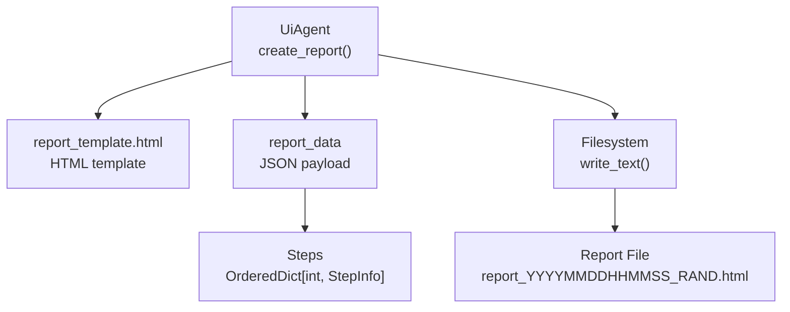
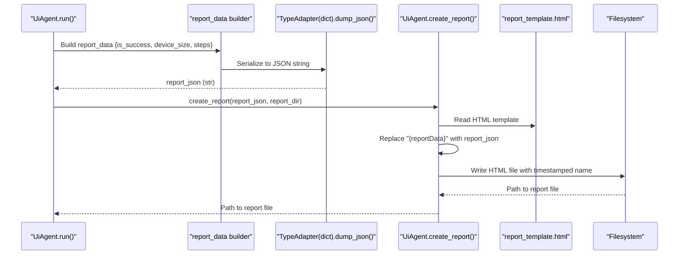
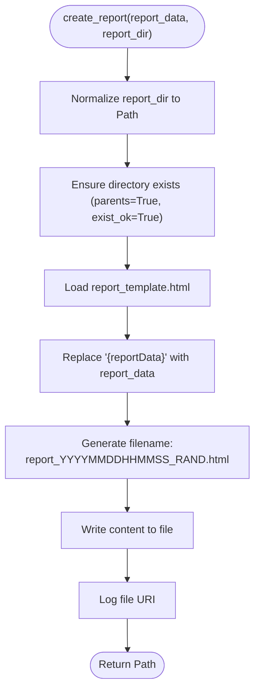
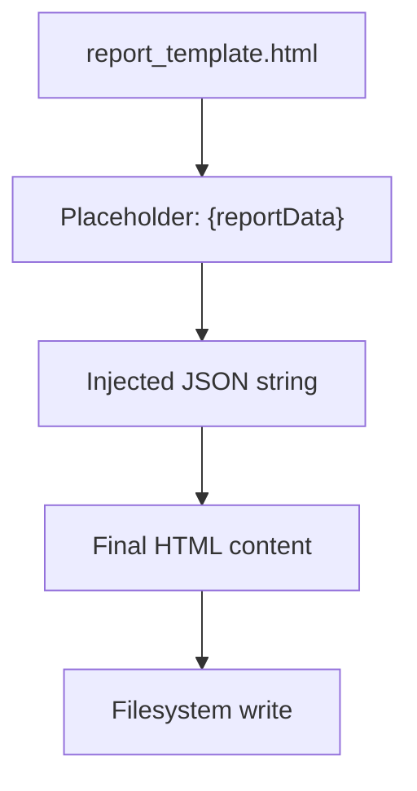
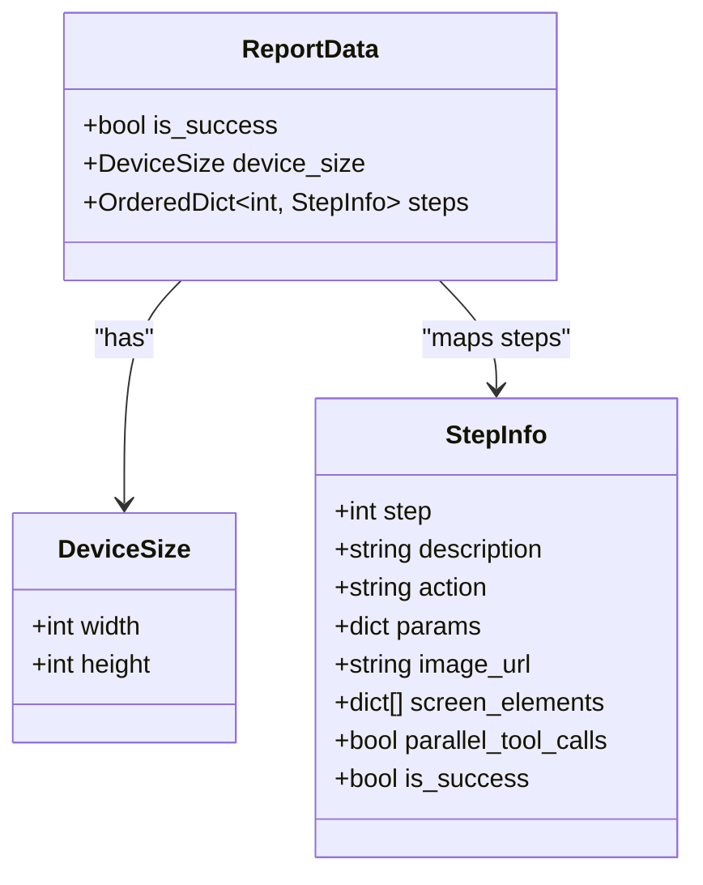
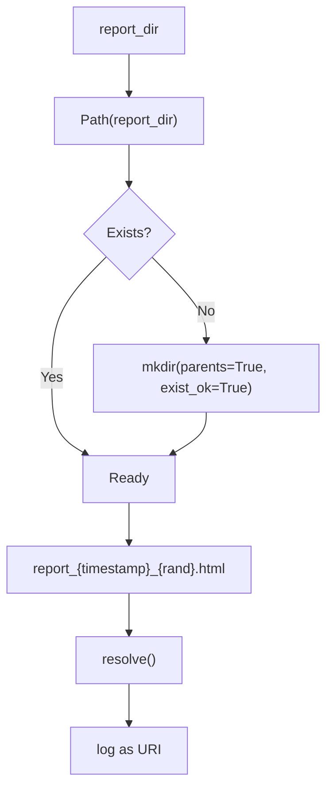
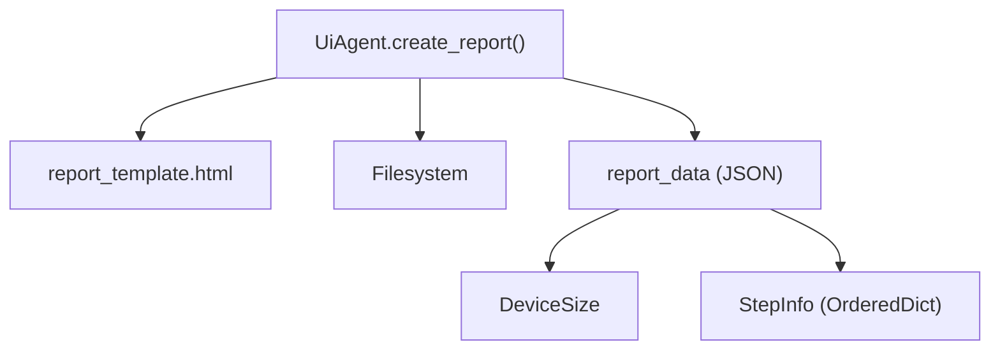

# Reporting and Output Generation

<cite>
**Referenced Files in This Document**
- [agent.py](file://src/page_eyes/agent.py)
- [report_template.html](file://src/page_eyes/report_template.html)
- [deps.py](file://src/page_eyes/deps.py)
- [device.py](file://src/page_eyes/device.py)
</cite>

## Table of Contents
1. [Introduction](#introduction)
2. [Project Structure](#project-structure)
3. [Core Components](#core-components)
4. [Architecture Overview](#architecture-overview)
5. [Detailed Component Analysis](#detailed-component-analysis)
6. [Dependency Analysis](#dependency-analysis)
7. [Performance Considerations](#performance-considerations)
8. [Troubleshooting Guide](#troubleshooting-guide)
9. [Conclusion](#conclusion)
10. [Appendices](#appendices)

## Introduction
This document explains the reporting and output generation system centered around the UiAgent base class. It focuses on the static method create_report() that generates HTML reports from execution data, including the report template structure, data formatting, and file output patterns. It also documents the report_data structure (including is_success status, device_size information, and steps array), filename generation with timestamp and random suffix, output directory handling, and file path resolution. Practical guidance is included for report customization, template modification, integration with external reporting systems, accessibility considerations, styling options, and automated report generation workflows.

## Project Structure
The reporting pipeline spans three primary modules:
- UiAgent base class and its run() method orchestrate execution and report creation.
- The HTML template defines the report’s structure and embeds runtime data.
- Data models define the shape of the report payload (report_data).

**Diagram sources**
- [agent.py:172-190](file://src/page_eyes/agent.py#L172-L190)
- [report_template.html:37-44](file://src/page_eyes/report_template.html#L37-L44)
- [deps.py:35-72](file://src/page_eyes/deps.py#L35-L72)

**Section sources**
- [agent.py:172-190](file://src/page_eyes/agent.py#L172-L190)
- [report_template.html:37-44](file://src/page_eyes/report_template.html#L37-L44)
- [deps.py:35-72](file://src/page_eyes/deps.py#L35-L72)

## Core Components
- UiAgent.create_report(report_data: str, report_dir: Union[Path, str]) -> Path
  - Reads the HTML template, injects the JSON-encoded report_data, writes an HTML file with a timestamped and randomized filename, and logs the file URI.
- report_template.html
  - Minimal HTML shell that expects a window.reportData assignment and mounts a frontend app at #app.
- report_data structure
  - A dictionary serialized to JSON and embedded into the template:
    - is_success: bool, derived from all step success flags.
    - device_size: DeviceSize(width: int, height: int) from the active device.
    - steps: OrderedDict[int, StepInfo] mapping step numbers to step metadata.

**Section sources**
- [agent.py:172-190](file://src/page_eyes/agent.py#L172-L190)
- [report_template.html:37-44](file://src/page_eyes/report_template.html#L37-L44)
- [deps.py:35-72](file://src/page_eyes/deps.py#L35-L72)
- [device.py:35-46](file://src/page_eyes/device.py#L35-L46)

## Architecture Overview
The report generation flow is a straightforward pipeline: collect execution data, serialize it to JSON, inject it into the HTML template, and write to disk.

**Diagram sources**
- [agent.py:296-302](file://src/page_eyes/agent.py#L296-L302)
- [agent.py:172-190](file://src/page_eyes/agent.py#L172-L190)
- [report_template.html:37-44](file://src/page_eyes/report_template.html#L37-L44)

## Detailed Component Analysis

### UiAgent.create_report()
- Purpose: Generate a single HTML report file from a JSON payload.
- Inputs:
  - report_data: str (JSON string)
  - report_dir: Union[Path, str] (output directory)
- Behavior:
  - Ensures the output directory exists.
  - Loads the HTML template from the package.
  - Replaces the placeholder "{reportData}" with the provided JSON string.
  - Generates a filename with a timestamp and random suffix.
  - Writes the combined content to disk and logs the file URI.
- Output:
  - Returns the absolute Path to the generated HTML report.

**Diagram sources**
- [agent.py:172-190](file://src/page_eyes/agent.py#L172-L190)

**Section sources**
- [agent.py:172-190](file://src/page_eyes/agent.py#L172-L190)

### report_template.html
- Structure:
  - Minimal HTML document with a 
 where a frontend app would mount.
  - A script tag that assigns window.reportData to the injected JSON payload.
- Integration:
  - The template is read by create_report() and the placeholder is replaced with the JSON string.
  - The resulting HTML is written to disk.

**Diagram sources**
- [report_template.html:37-44](file://src/page_eyes/report_template.html#L37-L44)

**Section sources**
- [report_template.html:37-44](file://src/page_eyes/report_template.html#L37-L44)

### report_data structure
- Fields:
  - is_success: bool
    - Derived from all step success flags in the execution context.
  - device_size: DeviceSize
    - Width and height integers representing the active device viewport or window size.
  - steps: OrderedDict[int, StepInfo]
    - Ordered mapping of step numbers to StepInfo objects, each containing:
      - step: int
      - description: str
      - action: str
      - params: dict
      - image_url: str
      - screen_elements: list[dict]
      - parallel_tool_calls: bool
      - is_success: bool
- Serialization:
  - The report_data dictionary is serialized to a JSON string using TypeAdapter(dict).dump_json() and decoded to str for injection.

**Diagram sources**
- [agent.py:296-300](file://src/page_eyes/agent.py#L296-L300)
- [deps.py:35-72](file://src/page_eyes/deps.py#L35-L72)
- [device.py:35-46](file://src/page_eyes/device.py#L35-L46)

**Section sources**
- [agent.py:296-300](file://src/page_eyes/agent.py#L296-L300)
- [deps.py:35-72](file://src/page_eyes/deps.py#L35-L72)
- [device.py:35-46](file://src/page_eyes/device.py#L35-L46)

### Filename generation and output directory handling
- Directory:
  - The provided report_dir is normalized to a Path and ensured to exist.
- Filename:
  - Pattern: report_YYYYMMDDHHMMSS_RAND.html
  - Timestamp: Uses datetime.now() formatting to produce an 14-digit date-time string.
  - Random suffix: A 5-digit integer in [10000, 99999].
- Resolution:
  - The final Path is resolved to an absolute path and logged as a URI.

**Diagram sources**
- [agent.py:177-190](file://src/page_eyes/agent.py#L177-L190)

**Section sources**
- [agent.py:177-190](file://src/page_eyes/agent.py#L177-L190)

### Data formatting and template injection
- The report_data dictionary is serialized to JSON using TypeAdapter(dict).dump_json() and decoded to a UTF-8 string.
- The HTML template’s placeholder is replaced with this JSON string.
- The resulting HTML is written to disk.

**Section sources**
- [agent.py:296-302](file://src/page_eyes/agent.py#L296-L302)
- [report_template.html:37-44](file://src/page_eyes/report_template.html#L37-L44)

### Integration with external reporting systems
- The generated HTML file can be consumed by external systems:
  - CI/CD pipelines can archive the HTML artifact.
  - Static site generators can post-process the HTML.
  - Custom viewers can be built to render the report in a browser.
- The report_path returned by UiAgent.run() enables downstream consumers to reference the file.

**Section sources**
- [agent.py:309-313](file://src/page_eyes/agent.py#L309-L313)

## Dependency Analysis
- UiAgent.create_report depends on:
  - The HTML template file located alongside the agent module.
  - The filesystem for writing the report.
- report_data depends on:
  - DeviceSize from the active device abstraction.
  - StepInfo from the execution context.

**Diagram sources**
- [agent.py:172-190](file://src/page_eyes/agent.py#L172-L190)
- [report_template.html:37-44](file://src/page_eyes/report_template.html#L37-L44)
- [deps.py:35-72](file://src/page_eyes/deps.py#L35-L72)
- [device.py:35-46](file://src/page_eyes/device.py#L35-L46)

**Section sources**
- [agent.py:172-190](file://src/page_eyes/agent.py#L172-L190)
- [deps.py:35-72](file://src/page_eyes/deps.py#L35-L72)
- [device.py:35-46](file://src/page_eyes/device.py#L35-L46)

## Performance Considerations
- JSON serialization and template replacement are lightweight operations suitable for typical execution durations.
- Writing a single HTML file is fast; ensure the output directory is local or network-mounted appropriately for your deployment.
- For high-throughput scenarios, consider batching or asynchronous writes if integrating with external systems.

## Troubleshooting Guide
- Template placeholder mismatch:
  - Ensure the HTML template contains the exact placeholder used by create_report().
- Encoding issues:
  - The template and file writes use UTF-8; confirm your environment supports UTF-8.
- Directory permissions:
  - Ensure the process has write permissions to the target report_dir.
- Missing device_size:
  - Verify the active device provides a valid DeviceSize; otherwise, the report_data will fail serialization.
- Steps not present:
  - Confirm that the execution context populated steps before report generation.

**Section sources**
- [agent.py:172-190](file://src/page_eyes/agent.py#L172-L190)
- [report_template.html:37-44](file://src/page_eyes/report_template.html#L37-L44)
- [deps.py:35-72](file://src/page_eyes/deps.py#L35-L72)
- [device.py:35-46](file://src/page_eyes/device.py#L35-L46)

## Conclusion
The reporting system centers on a simple, robust pipeline: collect execution metadata into a structured report_data dictionary, serialize it to JSON, inject it into a minimal HTML template, and write a timestamped HTML file. This design is easy to customize, integrate with external systems, and maintain. The report_data structure cleanly captures success status, device metrics, and step-by-step execution details, enabling flexible downstream consumption.

## Appendices

### Report customization examples
- Modify the HTML template:
  - Add CSS styles, meta tags, or additional DOM nodes around the #app container.
  - Adjust the window.reportData assignment to match your frontend app’s expectations.
- Change filename pattern:
  - Update create_report() to alter the timestamp format or suffix generation.
- Extend report_data:
  - Add fields to the report_data dictionary before serialization (e.g., usage stats, model metadata).
- Post-process the HTML:
  - Use a static site generator or viewer to transform the HTML into PDF or interactive dashboards.

### Accessibility and styling options
- Accessibility:
  - Ensure the HTML includes semantic headings and alt attributes for images.
  - Provide keyboard navigation and focus indicators for interactive elements.
- Styling:
  - Add CSS classes and styles to the template for readability and branding.
  - Consider responsive design for various screen sizes.

### Automated report generation workflows
- CI/CD:
  - Capture the returned report_path and upload it as an artifact.
  - Trigger downstream jobs to publish or archive the report.
- Local runs:
  - Open the generated HTML file directly in a browser.
- External systems:
  - Parse the JSON embedded in window.reportData to build custom viewers or dashboards.