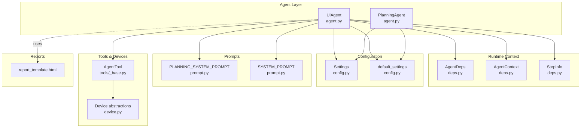
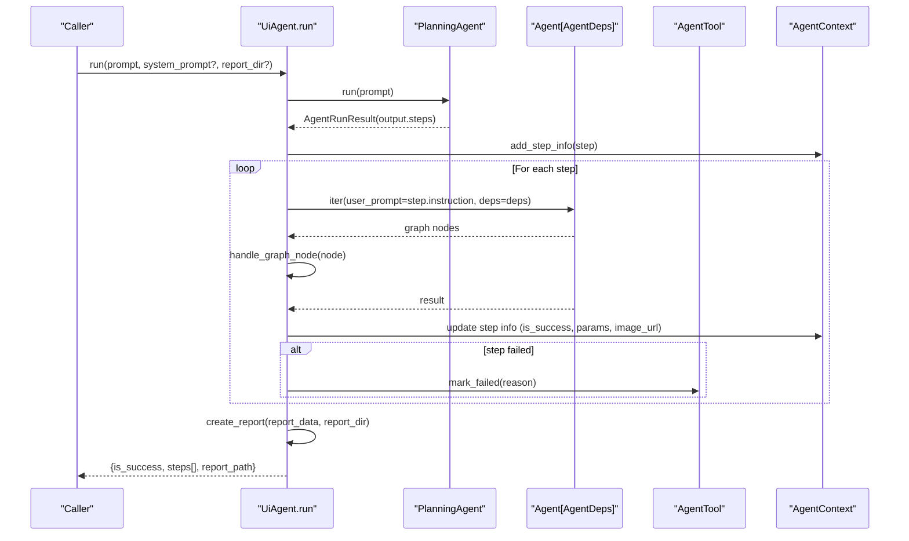
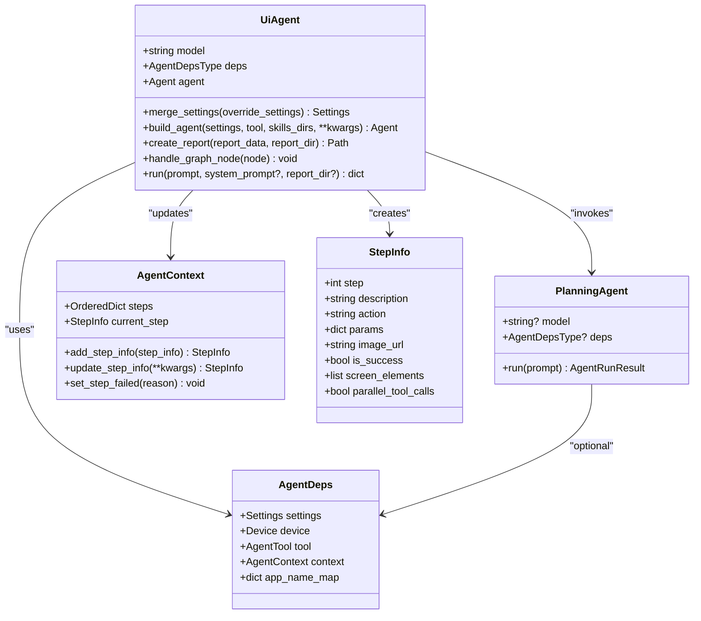

# UiAgent Base Class

<cite>
**Referenced Files in This Document**
- [agent.py](file://src/page_eyes/agent.py)
- [deps.py](file://src/page_eyes/deps.py)
- [config.py](file://src/page_eyes/config.py)
- [prompt.py](file://src/page_eyes/prompt.py)
- [tools/_base.py](file://src/page_eyes/tools/_base.py)
- [report_template.html](file://src/page_eyes/report_template.html)
- [test_web_agent.py](file://tests/test_web_agent.py)
</cite>

## Table of Contents
1. [Introduction](#introduction)
2. [Project Structure](#project-structure)
3. [Core Components](#core-components)
4. [Architecture Overview](#architecture-overview)
5. [Detailed Component Analysis](#detailed-component-analysis)
6. [Dependency Analysis](#dependency-analysis)
7. [Performance Considerations](#performance-considerations)
8. [Troubleshooting Guide](#troubleshooting-guide)
9. [Conclusion](#conclusion)

## Introduction
This document provides comprehensive API documentation for the UiAgent base class, focusing on the core agent architecture and shared functionality. It explains the UiAgent constructor parameters (model, deps, agent), static methods (merge_settings, build_agent, create_report, handle_graph_node), and the asynchronous run method with its parameters, return value structure, internal workflow, error handling, and usage tracking. It also covers configuration merging, exception handling patterns, and integration with PlanningAgent.

## Project Structure
The UiAgent class is defined in the agent module alongside supporting components:
- Configuration and defaults in config module
- Agent dependencies and runtime context in deps module
- Prompt templates for planning and execution in prompt module
- Tool base and device abstractions in tools and device modules
- HTML report template for execution summaries



**Diagram sources**
- [agent.py:96-314](file://src/page_eyes/agent.py#L96-L314)
- [deps.py:48-280](file://src/page_eyes/deps.py#L48-L280)
- [config.py:54-73](file://src/page_eyes/config.py#L54-L73)
- [prompt.py:8-166](file://src/page_eyes/prompt.py#L8-L166)
- [tools/_base.py:130-391](file://src/page_eyes/tools/_base.py#L130-L391)
- [report_template.html:1-45](file://src/page_eyes/report_template.html#L1-L45)

**Section sources**
- [agent.py:96-314](file://src/page_eyes/agent.py#L96-L314)
- [deps.py:48-280](file://src/page_eyes/deps.py#L48-L280)
- [config.py:54-73](file://src/page_eyes/config.py#L54-L73)
- [prompt.py:8-166](file://src/page_eyes/prompt.py#L8-L166)
- [tools/_base.py:130-391](file://src/page_eyes/tools/_base.py#L130-L391)
- [report_template.html:1-45](file://src/page_eyes/report_template.html#L1-L45)

## Core Components
- UiAgent: Base class encapsulating the agent’s model, dependencies, and execution pipeline. Provides static configuration merging, agent building, reporting, and step execution.
- PlanningAgent: Lightweight agent responsible for decomposing user prompts into executable steps.
- AgentDeps: Runtime dependency container holding settings, device, tool, and execution context.
- StepInfo and AgentContext: Track per-step execution state and aggregate results.
- Settings and default_settings: Centralized configuration with environment variable overrides.
- Tool base classes: Define tool interface, decorators, and common utilities for device interactions.

**Section sources**
- [agent.py:96-314](file://src/page_eyes/agent.py#L96-L314)
- [deps.py:48-280](file://src/page_eyes/deps.py#L48-L280)
- [config.py:54-73](file://src/page_eyes/config.py#L54-L73)
- [tools/_base.py:130-391](file://src/page_eyes/tools/_base.py#L130-L391)

## Architecture Overview
The UiAgent orchestrates a two-phase process:
1. Planning: A PlanningAgent decomposes the user prompt into a sequence of atomic steps.
2. Execution: UiAgent iterates through each step, invoking the underlying Agent with tools and capabilities, logs graph nodes, tracks usage, and generates a final HTML report.



**Diagram sources**
- [agent.py:225-314](file://src/page_eyes/agent.py#L225-L314)
- [agent.py:74-90](file://src/page_eyes/agent.py#L74-L90)
- [tools/_base.py:322-346](file://src/page_eyes/tools/_base.py#L322-L346)
- [deps.py:48-73](file://src/page_eyes/deps.py#L48-L73)

## Detailed Component Analysis

### UiAgent Constructor and Attributes
- model: str
  - The LLM provider identifier used by the underlying Agent.
- deps: AgentDepsType
  - Container of settings, device, tool, and execution context.
- agent: Agent[AgentDepsType]
  - The pydantic-ai Agent configured with tools and capabilities for execution.

These attributes are initialized by subclasses via their async factory methods (e.g., WebAgent.create, AndroidAgent.create).

**Section sources**
- [agent.py:96-101](file://src/page_eyes/agent.py#L96-L101)
- [agent.py:319-362](file://src/page_eyes/agent.py#L319-L362)

### Static Methods

#### merge_settings(override_settings: Settings) -> Settings
- Purpose: Merge environment-provided overrides with default settings, prioritizing explicit overrides.
- Behavior:
  - Creates a new Settings instance by combining default_settings and override_settings (excluding None values).
  - Logs the resulting merged settings.
- Validation rules:
  - Only non-None values from override_settings are applied.
  - Environment variables are loaded via dotenv before merging.
- Usage: Called by subclass factories to produce effective Settings for device/tool creation.

**Section sources**
- [agent.py:102-111](file://src/page_eyes/agent.py#L102-L111)
- [config.py:16-16](file://src/page_eyes/config.py#L16-L16)

#### build_agent(settings: Settings, tool: AgentTool, skills_dirs: list[str | Path], **kwargs) -> Agent[AgentDeps]
- Purpose: Construct an Agent with tools, skills capability, and runtime configuration.
- Behavior:
  - Builds a SkillsCapability from settings.root/skills plus optional custom skills directories.
  - Retrieves SkillsToolset and logs discovered skills.
  - Creates Agent with:
    - model from settings.model
    - system_prompt from prompt module
    - model_settings from settings.model_settings
    - deps_type=AgentDeps
    - tools=tool.tools
    - capabilities=[SkillsCapability]
    - retries=2
- Validation rules:
  - skills_dirs defaults to ['./skills'] if not provided.
  - Toolset.skills presence is logged; no failure on empty skills.
- Integration:
  - Used by subclass factories to create the Agent instance.

**Section sources**
- [agent.py:146-169](file://src/page_eyes/agent.py#L146-L169)
- [prompt.py:30-103](file://src/page_eyes/prompt.py#L30-L103)

#### create_report(report_data: str, report_dir: Union[Path, str]) -> Path
- Purpose: Generate an HTML report summarizing execution results.
- Behavior:
  - Ensures report_dir exists; creates directory if needed.
  - Loads report_template.html and replaces placeholder with JSON-encoded report_data.
  - Writes a timestamped HTML file and logs its URI.
- Validation rules:
  - report_dir is normalized to Path.
  - report_data must be a JSON-serializable dict converted to string.
- Output:
  - Returns the absolute Path of the generated HTML report.

**Section sources**
- [agent.py:171-190](file://src/page_eyes/agent.py#L171-L190)
- [report_template.html:1-45](file://src/page_eyes/report_template.html#L1-L45)

#### handle_graph_node(node)
- Purpose: Log and interpret pydantic-ai graph nodes during execution.
- Behavior:
  - Logs user prompts, tool results, and tool calls with arguments.
  - Updates current step’s parallel_tool_calls flag based on detected tool parts.
- Validation rules:
  - Handles specific node types: UserPromptNode, ModelRequestNode, CallToolsNode.
  - Skips unsupported node types gracefully.
- Integration:
  - Invoked inside UiAgent._sub_agent_run during Agent iteration.

**Section sources**
- [agent.py:192-216](file://src/page_eyes/agent.py#L192-L216)

### run(prompt: str, system_prompt: Optional[str] = None, report_dir: str = "./report") -> dict
- Purpose: Execute a user-defined task end-to-end.
- Parameters:
  - prompt: str – Natural language instruction to be executed.
  - system_prompt: Optional[str] – Overrides the default system prompt for this run.
  - report_dir: str – Directory path for saving the HTML report.
- Internal workflow:
  1. Planning:
     - Instantiate PlanningAgent with self.model and self.deps.
     - Run PlanningAgent with the user prompt to obtain AgentRunResult.
     - Append a terminal “结束任务” step.
  2. Execution:
     - For each step:
       - Add StepInfo to AgentContext.
       - If instruction != “结束任务”: run sub-agent iteration with user_prompt=instruction.
       - On UnexpectedModelBehavior: call deps.tool.mark_failed with reason and log error.
       - After each step, capture screenshot if none exists.
     - If any step fails, stop further execution.
  3. Reporting:
     - Aggregate is_success (all steps successful), device_size, and steps.
     - Serialize to JSON and call create_report to write HTML.
- Return value structure:
  - is_success: bool
  - steps: list of dicts containing step, description, action, is_success
  - report_path: Path to the generated HTML report
- Validation rules:
  - system_prompt, when provided, overrides the Agent’s system prompt.
  - report_dir defaults to “./report” if not provided.
- Error handling:
  - Catches UnexpectedModelBehavior and marks the current step as failed.
  - Uses ToolResult.success/failure semantics via ToolHandler.post_handle.
- Usage tracking:
  - Steps tracked in AgentContext with per-step metadata (image_url, screen_elements, params).

```mermaid
flowchart TD
Start([Entry: run]) --> Plan["Instantiate PlanningAgent<br/>and run with prompt"]
Plan --> Steps["Get steps from PlanningAgent output<br/>append terminal step"]
Steps --> Loop{"For each step"}
Loop --> |Instruction != '结束任务'| Exec["Run sub-agent iteration<br/>log graph nodes"]
Exec --> TryErr{"UnexpectedModelBehavior?"}
TryErr --> |Yes| Fail["deps.tool.mark_failed()<br/>log error"]
TryErr --> |No| Next["Update context<br/>take screenshot if missing"]
Loop --> |Instruction == '结束任务'| TearDown["deps.tool.tear_down()"]
Next --> Loop
TearDown --> Loop
Loop --> |End| Report["Aggregate results<br/>create_report()"]
Report --> Return([Return {is_success, steps, report_path}])
```

**Diagram sources**
- [agent.py:225-314](file://src/page_eyes/agent.py#L225-L314)
- [tools/_base.py:322-346](file://src/page_eyes/tools/_base.py#L322-L346)

**Section sources**
- [agent.py:225-314](file://src/page_eyes/agent.py#L225-L314)
- [tools/_base.py:322-346](file://src/page_eyes/tools/_base.py#L322-L346)

### PlanningAgent
- Attributes:
  - model: Optional[str]
  - deps: Optional[AgentDepsType]
- Method:
  - run(prompt: str) -> AgentRunResult[PlanningOutputType]
    - Uses PLANNING_SYSTEM_PROMPT and PlanningOutputType to decompose the prompt.
    - Falls back to default_settings.model if model is None.
- Integration:
  - UiAgent.run invokes PlanningAgent to obtain the step sequence.

**Section sources**
- [agent.py:74-90](file://src/page_eyes/agent.py#L74-L90)
- [prompt.py:8-28](file://src/page_eyes/prompt.py#L8-L28)

### AgentDeps and Execution Context
- AgentDeps:
  - settings: Settings
  - device: DeviceT
  - tool: ToolT
  - context: AgentContext
  - app_name_map: dict[str, str]
- AgentContext:
  - steps: OrderedDict[int, StepInfo]
  - current_step: StepInfo
  - Methods: add_step_info, update_step_info, set_step_failed
- StepInfo:
  - Fields: step, description, action, params, image_url, screen_elements, parallel_tool_calls, is_success
  - Excluded fields for serialization: planning

**Section sources**
- [deps.py:48-73](file://src/page_eyes/deps.py#L48-L73)
- [deps.py:35-46](file://src/page_eyes/deps.py#L35-L46)

### Tools and Device Integration
- AgentTool:
  - Provides tool decorators (tool) and common utilities (get_screen, wait, assert_screen_*).
  - Implements mark_failed and tear_down for lifecycle control.
- Device abstractions:
  - WebDevice, AndroidDevice, HarmonyDevice, IOSDevice, ElectronDevice
  - Provide platform-specific capabilities and window sizing.

**Section sources**
- [tools/_base.py:88-127](file://src/page_eyes/tools/_base.py#L88-L127)
- [tools/_base.py:130-391](file://src/page_eyes/tools/_base.py#L130-L391)
- [device.py:54-390](file://src/page_eyes/device.py#L54-L390)

### Usage Examples

- Initialization and configuration merging:
  - Use merge_settings to combine environment overrides with defaults.
  - Example pattern: WebAgent.create(model="openai:gpt-4o", headless=True, skills_dirs=["./skills"])

- Execution flow:
  - Call run with a natural language instruction; optionally override system_prompt and specify report_dir.
  - Inspect returned is_success, steps, and report_path.

- Test-driven usage:
  - See tests for typical scenarios: navigation, input, assertions, sliding, and pop-up handling.

**Section sources**
- [agent.py:319-362](file://src/page_eyes/agent.py#L319-L362)
- [agent.py:225-314](file://src/page_eyes/agent.py#L225-L314)
- [test_web_agent.py:11-22](file://tests/test_web_agent.py#L11-L22)

## Dependency Analysis
UiAgent depends on:
- pydantic_ai Agent and related types for orchestration and tool invocation
- SkillsCapability for extensible toolsets
- AgentDeps for runtime context and device/tool access
- Settings for configuration and environment overrides
- ToolHandler for step instrumentation and error propagation



**Diagram sources**
- [agent.py:96-314](file://src/page_eyes/agent.py#L96-L314)
- [deps.py:48-73](file://src/page_eyes/deps.py#L48-L73)
- [deps.py:35-46](file://src/page_eyes/deps.py#L35-L46)

**Section sources**
- [agent.py:96-314](file://src/page_eyes/agent.py#L96-L314)
- [deps.py:48-73](file://src/page_eyes/deps.py#L48-L73)
- [deps.py:35-46](file://src/page_eyes/deps.py#L35-L46)

## Performance Considerations
- Retries: The Agent is configured with retries=2 to improve robustness against transient failures.
- Parallel tool calls: The handle_graph_node logic detects concurrent tool calls and enforces single-tool execution via ToolHandler, preventing race conditions.
- Usage tracking: UiAgent accumulates Usage across planning and execution, enabling cost monitoring and optimization.
- Report generation: create_report writes a single HTML file; ensure report_dir is on fast storage for large datasets.

[No sources needed since this section provides general guidance]

## Troubleshooting Guide
Common issues and resolutions:
- UnexpectedModelBehavior during execution:
  - UiAgent catches this exception and calls deps.tool.mark_failed with the reason, marking the current step as failed and stopping further steps.
- Tool concurrency violations:
  - ToolHandler.pre_handle raises ModelRetry if parallel_tool_calls is enabled; ensure only one tool is invoked per step.
- Environment configuration:
  - merge_settings loads environment variables via dotenv; verify environment keys match Settings prefixes (agent_, browser_, cos_, minio_, omni_).
- Report generation failures:
  - create_report requires a valid report_dir and readable template; check permissions and path existence.

**Section sources**
- [agent.py:264-271](file://src/page_eyes/agent.py#L264-L271)
- [tools/_base.py:63-69](file://src/page_eyes/tools/_base.py#L63-L69)
- [agent.py:171-190](file://src/page_eyes/agent.py#L171-L190)
- [config.py:16-16](file://src/page_eyes/config.py#L16-L16)

## Conclusion
UiAgent provides a robust, extensible foundation for GUI automation agents. Its design separates planning from execution, integrates skills-based tooling, and maintains detailed execution context for observability and reporting. By leveraging merge_settings, build_agent, and create_report, developers can configure agents for diverse platforms and generate actionable execution reports.