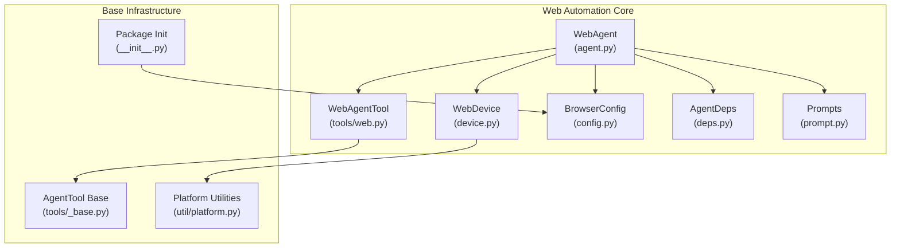
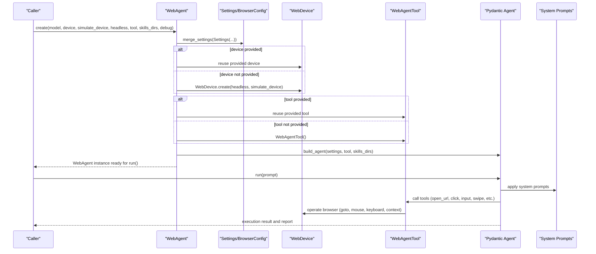
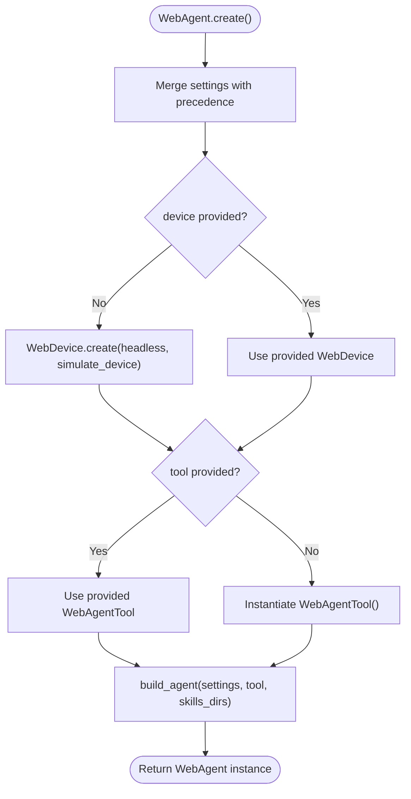
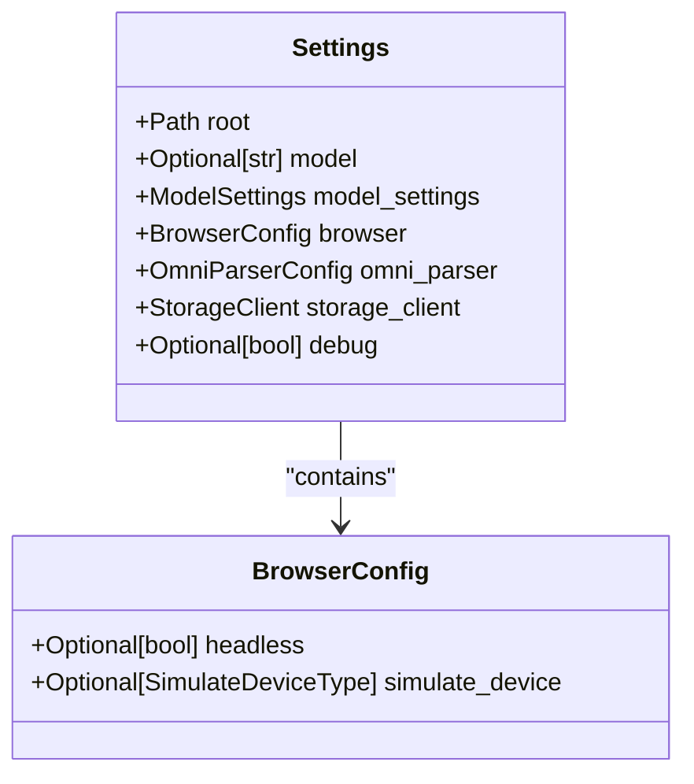
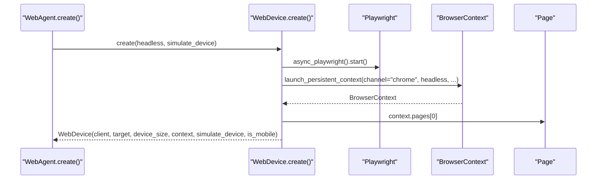
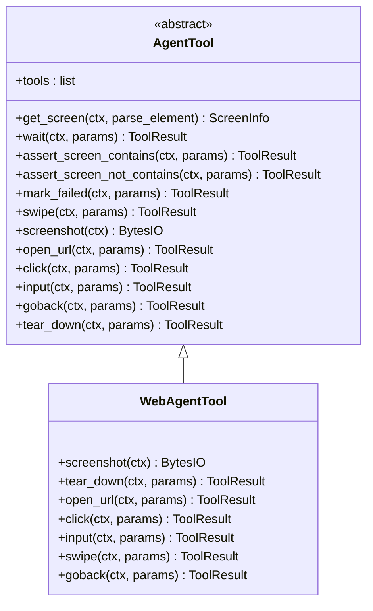
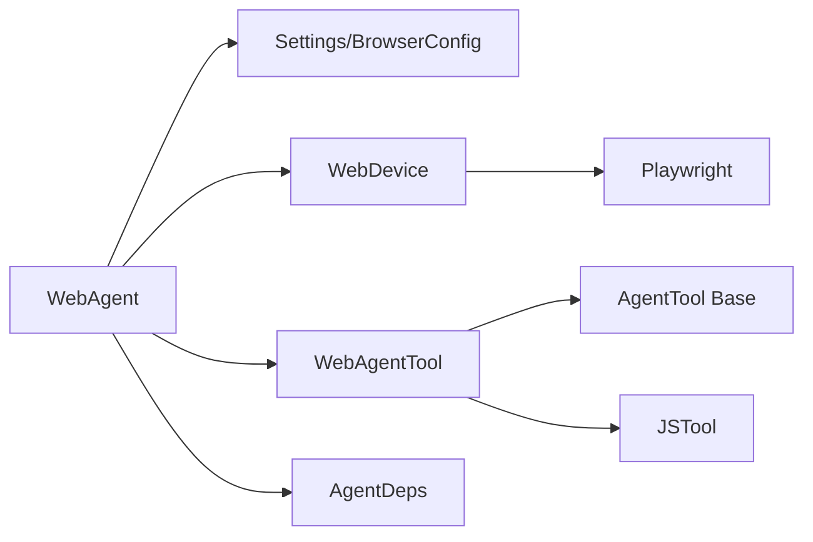

# WebAgent

<cite>
**Referenced Files in This Document**
- [agent.py](file://src/page_eyes/agent.py)
- [web.py](file://src/page_eyes/tools/web.py)
- [device.py](file://src/page_eyes/device.py)
- [config.py](file://src/page_eyes/config.py)
- [deps.py](file://src/page_eyes/deps.py)
- [_base.py](file://src/page_eyes/tools/_base.py)
- [prompt.py](file://src/page_eyes/prompt.py)
- [platform.py](file://src/page_eyes/util/platform.py)
- [test_web_agent.py](file://tests/test_web_agent.py)
- [__init__.py](file://src/page_eyes/__init__.py)
</cite>

## Table of Contents
1. [Introduction](#introduction)
2. [Project Structure](#project-structure)
3. [Core Components](#core-components)
4. [Architecture Overview](#architecture-overview)
5. [Detailed Component Analysis](#detailed-component-analysis)
6. [Dependency Analysis](#dependency-analysis)
7. [Performance Considerations](#performance-considerations)
8. [Troubleshooting Guide](#troubleshooting-guide)
9. [Conclusion](#conclusion)
10. [Appendices](#appendices)

## Introduction
This document provides comprehensive API documentation for the WebAgent class, focusing on web browser automation capabilities. It explains the WebAgent.create() factory method with all parameters, browser configuration via BrowserConfig, device initialization through WebDevice.create(), and the WebAgentTool usage for web-specific operations. It also covers platform-specific considerations, headless mode limitations, simulate_device configuration, practical examples, error handling, and debugging techniques for browser-related issues.

## Project Structure
The WebAgent resides in the page_eyes package and integrates with device abstraction, tooling, configuration, and prompts. The following diagram shows the primary modules involved in web automation.

**Diagram sources**
- [agent.py:316-362](file://src/page_eyes/agent.py#L316-L362)
- [device.py:54-87](file://src/page_eyes/device.py#L54-L87)
- [web.py:24-179](file://src/page_eyes/tools/web.py#L24-L179)
- [config.py:40-73](file://src/page_eyes/config.py#L40-L73)
- [deps.py:75-100](file://src/page_eyes/deps.py#L75-L100)
- [prompt.py:8-166](file://src/page_eyes/prompt.py#L8-L166)
- [_base.py:130-391](file://src/page_eyes/tools/_base.py#L130-L391)
- [platform.py:14-22](file://src/page_eyes/util/platform.py#L14-L22)
- [__init__.py:9-15](file://src/page_eyes/__init__.py#L9-L15)

**Section sources**
- [agent.py:316-362](file://src/page_eyes/agent.py#L316-L362)
- [device.py:54-87](file://src/page_eyes/device.py#L54-L87)
- [web.py:24-179](file://src/page_eyes/tools/web.py#L24-L179)
- [config.py:40-73](file://src/page_eyes/config.py#L40-L73)
- [deps.py:75-100](file://src/page_eyes/deps.py#L75-L100)
- [prompt.py:8-166](file://src/page_eyes/prompt.py#L8-L166)
- [_base.py:130-391](file://src/page_eyes/tools/_base.py#L130-L391)
- [platform.py:14-22](file://src/page_eyes/util/platform.py#L14-L22)
- [__init__.py:9-15](file://src/page_eyes/__init__.py#L9-L15)

## Core Components
- WebAgent.create(): Factory method to construct a WebAgent with optional model, device, simulate_device, headless, tool, skills_dirs, and debug parameters. It merges settings, initializes a WebDevice, constructs a WebAgentTool, builds the agent with skills, and returns a configured instance.
- BrowserConfig: Encapsulates browser configuration including headless mode and simulate_device options, with environment variable precedence.
- WebDevice.create(): Initializes a persistent Chromium context via Playwright, optionally simulating a mobile device profile and setting headless mode.
- WebAgentTool: Provides web-specific operations such as opening URLs, clicking, inputting text, swiping, navigating back, taking screenshots, and asserting screen content.

Key parameter specifications for WebAgent.create():
- model: Optional string specifying the LLM model name.
- device: Optional WebDevice instance; if omitted, WebDevice.create() is invoked with headless and simulate_device.
- simulate_device: Optional SimulateDeviceType to emulate a specific device profile (e.g., iPhone variants).
- headless: Optional bool enabling headless browser mode.
- tool: Optional WebAgentTool instance; defaults to a new WebAgentTool if not provided.
- skills_dirs: Optional list of skill directories to load alongside default skills.
- debug: Optional bool enabling verbose logging for debugging.

**Section sources**
- [agent.py:316-362](file://src/page_eyes/agent.py#L316-L362)
- [config.py:40-45](file://src/page_eyes/config.py#L40-L45)
- [device.py:59-87](file://src/page_eyes/device.py#L59-L87)
- [web.py:24-179](file://src/page_eyes/tools/web.py#L24-L179)

## Architecture Overview
The WebAgent orchestrates planning and execution of web automation tasks. It merges settings, creates a device and tool, builds an agent with skills, and executes a sequence of steps derived from user prompts.

**Diagram sources**
- [agent.py:316-362](file://src/page_eyes/agent.py#L316-L362)
- [config.py:54-73](file://src/page_eyes/config.py#L54-L73)
- [device.py:59-87](file://src/page_eyes/device.py#L59-L87)
- [web.py:24-179](file://src/page_eyes/tools/web.py#L24-L179)
- [prompt.py:8-166](file://src/page_eyes/prompt.py#L8-L166)

## Detailed Component Analysis

### WebAgent.create() Factory Method
- Purpose: Asynchronously construct a WebAgent with configurable browser behavior and tooling.
- Behavior:
  - Merges settings with precedence order: code-provided values override environment variables and defaults.
  - Creates a WebDevice if not provided, passing headless and simulate_device to WebDevice.create().
  - Instantiates WebAgentTool if not provided.
  - Builds the agent with skills directories and returns the instance.
- Parameters:
  - model: Optional[str] — LLM model identifier.
  - device: Optional[WebDevice] — Pre-created device instance.
  - simulate_device: Optional[SimulateDeviceType] — Emulated device profile.
  - headless: Optional[bool] — Headless browser mode.
  - tool: Optional[WebAgentTool] — Custom tool instance.
  - skills_dirs: Optional[list[str | Path]] — Additional skill directories.
  - debug: Optional[bool] — Enable verbose logging.

**Diagram sources**
- [agent.py:316-362](file://src/page_eyes/agent.py#L316-L362)

**Section sources**
- [agent.py:316-362](file://src/page_eyes/agent.py#L316-L362)

### Browser Configuration via BrowserConfig
- Fields:
  - headless: Optional[bool] — Defaults to False.
  - simulate_device: Optional[SimulateDeviceType] — Supports predefined device profiles and custom strings.
- Precedence: Code-provided values override environment variables and defaults (.env).
- Environment variables: browser_headless, browser_simulate_device.

**Diagram sources**
- [config.py:40-73](file://src/page_eyes/config.py#L40-L73)

**Section sources**
- [config.py:40-45](file://src/page_eyes/config.py#L40-L45)
- [config.py:54-73](file://src/page_eyes/config.py#L54-L73)
- [__init__.py:9-15](file://src/page_eyes/__init__.py#L9-L15)

### WebDevice.create() Integration
- Initializes a persistent Chromium context using Playwright.
- Options:
  - headless: Passed to launch_persistent_context.
  - simulate_device: If present and recognized, updates viewport and device parameters; removes incompatible keys.
  - Channel: Uses Chrome.
  - Ignore default args: Removes "--enable-automation".
- Returns a WebDevice with:
  - client: Playwright instance.
  - target: Active Page.
  - device_size: Current viewport size.
  - context: BrowserContext.
  - simulate_device: Provided device profile.
  - is_mobile: Boolean indicating mobile emulation.

**Diagram sources**
- [device.py:59-87](file://src/page_eyes/device.py#L59-L87)

**Section sources**
- [device.py:59-87](file://src/page_eyes/device.py#L59-L87)

### WebAgentTool Usage for Web Operations
- Provided operations:
  - open_url: Navigates to a URL and waits until network idle.
  - click: Clicks at a calculated coordinate; handles file chooser and new page transitions.
  - input: Activates an element and types text; optionally sends Enter.
  - swipe: Performs swipe or scroll depending on device type and scrollbar presence; can search for keywords.
  - goback: Navigates back to the previous page.
  - tear_down: Cleans up highlights, captures a final screenshot, closes context/client if present.
  - Screenshot: Captures a PNG screenshot buffer.
- Decorators:
  - @tool: Wraps operations to record step metadata, enforce sequential execution, and handle retries on exceptions.
  - Delays: before_delay and after_delay to accommodate rendering stability.

**Diagram sources**
- [_base.py:130-391](file://src/page_eyes/tools/_base.py#L130-L391)
- [web.py:24-179](file://src/page_eyes/tools/web.py#L24-L179)

**Section sources**
- [_base.py:88-127](file://src/page_eyes/tools/_base.py#L88-L127)
- [_base.py:204-346](file://src/page_eyes/tools/_base.py#L204-L346)
- [web.py:24-179](file://src/page_eyes/tools/web.py#L24-L179)

### Platform-Specific Considerations
- SimulateDeviceType: Supports predefined device profiles (e.g., iPhone variants) and custom strings. Mobile emulation toggles is_mobile and affects swipe behavior.
- Headless Mode Limitations:
  - Headless disables UI rendering; useful for CI/CD and server environments.
  - Some websites may behave differently under headless conditions (e.g., bot detection, resource loading).
- Environment Precedence:
  - Code-provided settings override environment variables and defaults.
  - BrowserConfig supports environment variables browser_headless and browser_simulate_device.

**Section sources**
- [deps.py:22](file://src/page_eyes/deps.py#L22)
- [config.py:40-45](file://src/page_eyes/config.py#L40-L45)
- [__init__.py:9-15](file://src/page_eyes/__init__.py#L9-L15)

### Practical Examples
- Basic Setup:
  - Initialize WebAgent with default settings and let it create a WebDevice and WebAgentTool automatically.
  - Example pattern: [test_web_agent.py:11-22](file://tests/test_web_agent.py#L11-L22)
- Browser Configuration:
  - Configure headless and simulate_device via BrowserConfig or WebAgent.create().
  - Example pattern: [test_web_agent.py:126-137](file://tests/test_web_agent.py#L126-L137)
- Common Interactions:
  - Open URL, swipe, click, input, and assertions are demonstrated across multiple tests.
  - Example patterns:
    - Swiping and clicking: [test_web_agent.py:79-98](file://tests/test_web_agent.py#L79-L98)
    - Input and Enter behavior: [test_web_agent.py:140-157](file://tests/test_web_agent.py#L140-L157)
    - File upload via click: [test_web_agent.py:115-123](file://tests/test_web_agent.py#L115-L123)

**Section sources**
- [test_web_agent.py:11-22](file://tests/test_web_agent.py#L11-L22)
- [test_web_agent.py:126-137](file://tests/test_web_agent.py#L126-L137)
- [test_web_agent.py:79-98](file://tests/test_web_agent.py#L79-L98)
- [test_web_agent.py:140-157](file://tests/test_web_agent.py#L140-L157)
- [test_web_agent.py:115-123](file://tests/test_web_agent.py#L115-L123)

## Dependency Analysis
- WebAgent depends on:
  - Settings/BrowserConfig for runtime configuration.
  - WebDevice for browser context and page operations.
  - WebAgentTool for atomic web actions.
  - AgentDeps for shared context and toolset integration.
- WebAgentTool depends on:
  - AgentTool base for decorators and shared utilities.
  - JSTool for DOM manipulation and highlighting.
  - Playwright for browser automation.

**Diagram sources**
- [agent.py:316-362](file://src/page_eyes/agent.py#L316-L362)
- [web.py:24-179](file://src/page_eyes/tools/web.py#L24-L179)
- [_base.py:130-391](file://src/page_eyes/tools/_base.py#L130-L391)
- [device.py:59-87](file://src/page_eyes/device.py#L59-L87)

**Section sources**
- [agent.py:316-362](file://src/page_eyes/agent.py#L316-L362)
- [web.py:24-179](file://src/page_eyes/tools/web.py#L24-L179)
- [_base.py:130-391](file://src/page_eyes/tools/_base.py#L130-L391)
- [device.py:59-87](file://src/page_eyes/device.py#L59-L87)

## Performance Considerations
- Headless mode reduces overhead and improves reliability in CI/CD pipelines.
- Mobile emulation adds viewport adjustments and may impact swipe behavior; ensure appropriate simulate_device selection.
- Delays around tool operations help stabilize page rendering; tune before_delay and after_delay as needed.
- Persistent context reuse avoids repeated browser startup costs.

[No sources needed since this section provides general guidance]

## Troubleshooting Guide
Common issues and resolutions:
- Element Not Found:
  - Use wait and assert_screen_contains to ensure elements are present before interacting.
  - Retry logic triggers ModelRetry on tool exceptions; re-plan and re-execute.
- Headless Behavior Differences:
  - Some sites require user interaction or may block headless browsers; test with and without headless mode.
- Mobile Emulation:
  - Verify simulate_device is supported; adjust viewport and scrollbar-dependent logic accordingly.
- Tool Concurrency:
  - The framework enforces single-tool-at-a-time execution; avoid concurrent tool calls.
- Debug Logging:
  - Enable debug to increase verbosity and highlight elements during LLM-mode debugging.

Error handling specifics:
- Tool exceptions trigger ModelRetry with a retry message; review logs for stack traces.
- UnexpectedModelBehavior during run() is caught and reported; inspect step-level failures.
- mark_failed can be used to explicitly fail a step with a reason.

**Section sources**
- [_base.py:112-118](file://src/page_eyes/tools/_base.py#L112-L118)
- [agent.py:264-271](file://src/page_eyes/agent.py#L264-L271)
- [_base.py:322-346](file://src/page_eyes/tools/_base.py#L322-L346)

## Conclusion
WebAgent provides a robust, extensible framework for web browser automation. Its factory method enables flexible configuration of browser behavior, device emulation, and tooling. With integrated tooling, prompts, and error handling, it supports reliable automation across diverse web scenarios. Use the provided examples and guidelines to configure headless mode, simulate devices, and implement common web interaction patterns effectively.

[No sources needed since this section summarizes without analyzing specific files]

## Appendices

### API Reference: WebAgent.create()
- Parameters:
  - model: Optional[str]
  - device: Optional[WebDevice]
  - simulate_device: Optional[SimulateDeviceType]
  - headless: Optional[bool]
  - tool: Optional[WebAgentTool]
  - skills_dirs: Optional[list[str | Path]]
  - debug: Optional[bool]
- Returns: WebAgent instance

**Section sources**
- [agent.py:316-362](file://src/page_eyes/agent.py#L316-L362)

### BrowserConfig Reference
- Fields:
  - headless: Optional[bool]
  - simulate_device: Optional[SimulateDeviceType]
- Precedence: Code > Environment Variables > .env > Defaults

**Section sources**
- [config.py:40-45](file://src/page_eyes/config.py#L40-L45)
- [config.py:54-73](file://src/page_eyes/config.py#L54-L73)
- [__init__.py:9-15](file://src/page_eyes/__init__.py#L9-L15)

### WebDevice.create() Reference
- Parameters:
  - headless: bool
  - simulate_device: Optional[str]
- Behavior:
  - Launches persistent Chromium context.
  - Applies device emulation if supported.
  - Sets viewport and device_size.

**Section sources**
- [device.py:59-87](file://src/page_eyes/device.py#L59-L87)

### WebAgentTool Operations
- open_url(ctx, params): Navigate to URL.
- click(ctx, params): Click at coordinate; handle file chooser/new page.
- input(ctx, params): Type text; optionally send Enter.
- swipe(ctx, params): Swipe/scroll with keyword search.
- goback(ctx, params): Go back to previous page.
- tear_down(ctx, params): Cleanup and close context/client.

**Section sources**
- [web.py:24-179](file://src/page_eyes/tools/web.py#L24-L179)