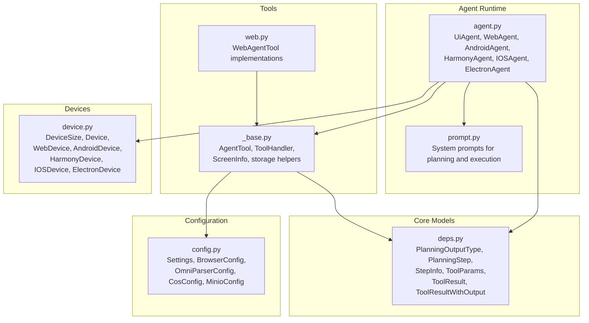
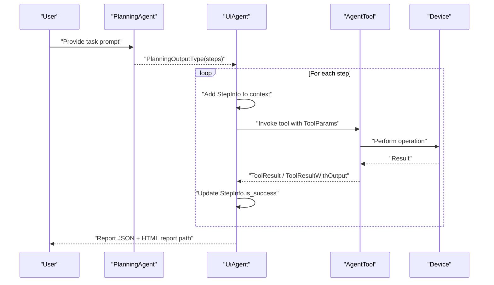
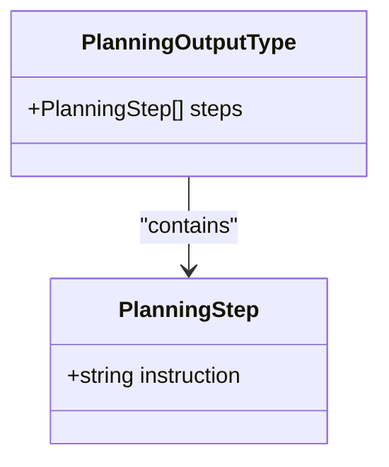
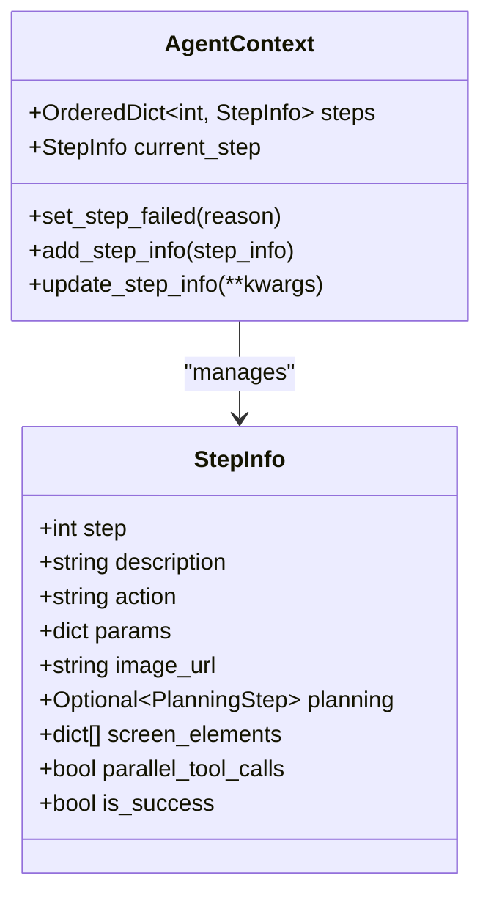
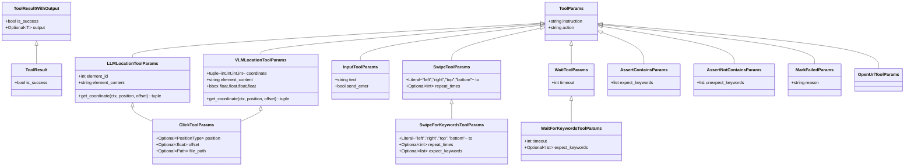
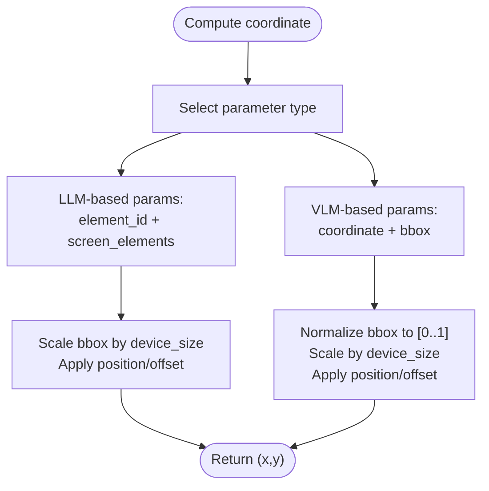
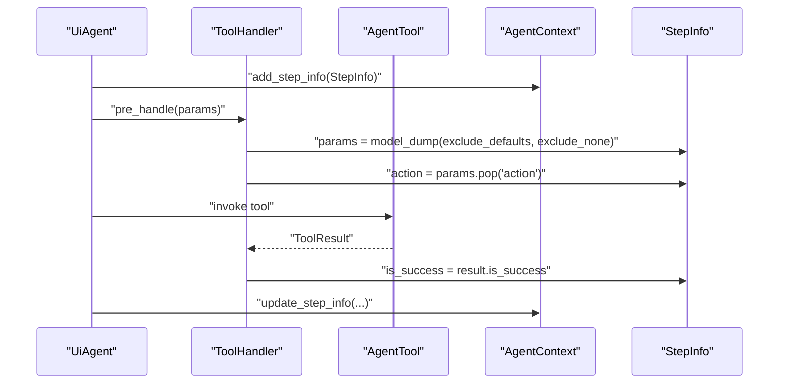
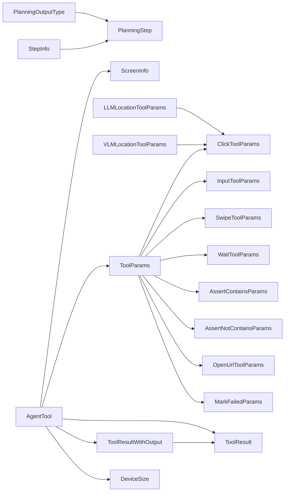

# Data Structures

<cite>
**Referenced Files in This Document**
- [deps.py](file://src/page_eyes/deps.py)
- [agent.py](file://src/page_eyes/agent.py)
- [tools/_base.py](file://src/page_eyes/tools/_base.py)
- [tools/web.py](file://src/page_eyes/tools/web.py)
- [device.py](file://src/page_eyes/device.py)
- [prompt.py](file://src/page_eyes/prompt.py)
- [config.py](file://src/page_eyes/config.py)
- [test_planning_agent.py](file://tests/test_planning_agent.py)
</cite>

## Table of Contents
1. [Introduction](#introduction)
2. [Project Structure](#project-structure)
3. [Core Components](#core-components)
4. [Architecture Overview](#architecture-overview)
5. [Detailed Component Analysis](#detailed-component-analysis)
6. [Dependency Analysis](#dependency-analysis)
7. [Performance Considerations](#performance-considerations)
8. [Troubleshooting Guide](#troubleshooting-guide)
9. [Conclusion](#conclusion)
10. [Appendices](#appendices)

## Introduction
This document provides comprehensive API documentation for the data structures and models used in the PageEyes Agent. It focuses on planning and execution data models such as PlanningOutputType, PlanningStep, StepInfo, ToolParams, and specialized tool parameter types. It also covers serialization formats, validation rules, usage contexts, error handling patterns, and practical examples drawn from agent operations, tool execution, and reporting. Persistence and caching strategies are addressed with attention to memory management for large datasets.

## Project Structure
The data models are primarily defined in the dependencies module and used across the agent runtime, tools, and device abstractions. The following diagram shows the primary modules involved in the data model ecosystem.

**Diagram sources**
- [deps.py:25-280](file://src/page_eyes/deps.py#L25-L280)
- [agent.py:73-515](file://src/page_eyes/agent.py#L73-L515)
- [tools/_base.py:39-391](file://src/page_eyes/tools/_base.py#L39-L391)
- [tools/web.py:24-179](file://src/page_eyes/tools/web.py#L24-L179)
- [device.py:35-390](file://src/page_eyes/device.py#L35-L390)
- [prompt.py:8-166](file://src/page_eyes/prompt.py#L8-L166)
- [config.py:19-73](file://src/page_eyes/config.py#L19-L73)

**Section sources**
- [deps.py:25-280](file://src/page_eyes/deps.py#L25-L280)
- [agent.py:73-515](file://src/page_eyes/agent.py#L73-L515)
- [tools/_base.py:39-391](file://src/page_eyes/tools/_base.py#L39-L391)
- [tools/web.py:24-179](file://src/page_eyes/tools/web.py#L24-L179)
- [device.py:35-390](file://src/page_eyes/device.py#L35-L390)
- [prompt.py:8-166](file://src/page_eyes/prompt.py#L8-L166)
- [config.py:19-73](file://src/page_eyes/config.py#L19-L73)

## Core Components
This section documents the principal data models used by the agent for planning, execution, and tool invocation.

- PlanningOutputType
  - Purpose: Encapsulates the structured output produced by the planning agent, containing a sequence of atomic steps.
  - Fields:
    - steps: list[PlanningStep]
  - Validation: Defined via Pydantic BaseModel; list items validated against PlanningStep.
  - Serialization: Pydantic model_dump() and TypeAdapter-based JSON serialization are used in agent reporting.
  - Usage context: Returned by PlanningAgent.run() and consumed by UiAgent during step execution.
  - Example usage: See tests for expected structure of steps.

- PlanningStep
  - Purpose: Represents a single atomic instruction derived from user intent.
  - Fields:
    - instruction: str (description of the step)
  - Validation: Pydantic Field with description metadata.
  - Serialization: model_dump() used in planning output and reports.
  - Usage context: Elements of PlanningOutputType.steps.

- StepInfo
  - Purpose: Tracks per-step execution state and metadata.
  - Fields:
    - step: int
    - description: str
    - action: str
    - params: dict
    - image_url: str
    - planning: Optional[PlanningStep] (excluded from serialization)
    - screen_elements: list[dict]
    - parallel_tool_calls: bool (excluded from serialization)
    - is_success: bool
  - Validation: Pydantic BaseModel with ConfigDict(from_attributes=True) enabling ORM-style creation.
  - Serialization: model_dump(include=...) used for reporting; excludes internal fields.
  - Usage context: Maintained in AgentContext.steps and AgentContext.current_step; updated by ToolHandler.post_handle.

- ToolParams
  - Purpose: Base parameters for all tool invocations.
  - Fields:
    - instruction: str
    - action: str
  - Validation: Pydantic Field with description metadata.
  - Serialization: model_dump(exclude_defaults=True, exclude_none=True) used by ToolHandler.pre_handle.
  - Usage context: Base class for specialized tool parameter types.

- ToolResult and ToolResultWithOutput
  - Purpose: Standardized tool execution results.
  - Fields:
    - is_success: bool
    - output: Optional[T] (in ToolResultWithOutput)
  - Validation: Pydantic BaseModel generics.
  - Serialization: success()/failed() classmethods produce typed instances; used to set StepInfo.is_success.
  - Usage context: Returned by AgentTool implementations.

- ScreenInfo
  - Purpose: Captures current screen snapshot and parsed elements.
  - Fields:
    - image_url: str
    - screen_elements: list[dict] (filtered subset for LLM consumption)
  - Validation: Pydantic BaseModel.
  - Serialization: Used in get_screen() flows; filtered via TypeAdapter for LLM-friendly content.
  - Usage context: Populated by AgentTool.get_screen() and stored in StepInfo.

- DeviceSize
  - Purpose: Stores device viewport dimensions.
  - Fields:
    - width: int
    - height: int
  - Validation: Pydantic BaseModel.
  - Usage context: Used by coordinate computation helpers in tool parameter types.

- Settings and related configs
  - Purpose: Centralized configuration for model selection, browser behavior, OmniParser, and storage.
  - Fields include model, model_type, model_settings, browser, omni_parser, storage_client, debug.
  - Validation: Pydantic BaseSettings with environment variable loading.
  - Usage context: Influences tool availability (LLM/VLM), prompt variants, and storage behavior.

**Section sources**
- [deps.py:25-280](file://src/page_eyes/deps.py#L25-L280)
- [tools/_base.py:167-234](file://src/page_eyes/tools/_base.py#L167-L234)
- [device.py:35-47](file://src/page_eyes/device.py#L35-L47)
- [config.py:54-73](file://src/page_eyes/config.py#L54-L73)

## Architecture Overview
The agent orchestrates planning and execution through a clear separation of concerns:
- Planning phase produces PlanningOutputType(steps).
- Execution phase iterates over steps, invoking tools with ToolParams-derived arguments.
- Tool execution updates StepInfo and ToolResult, which inform reporting and termination conditions.

**Diagram sources**
- [agent.py:80-314](file://src/page_eyes/agent.py#L80-L314)
- [tools/_base.py:204-347](file://src/page_eyes/tools/_base.py#L204-L347)
- [tools/web.py:46-179](file://src/page_eyes/tools/web.py#L46-L179)
- [device.py:35-390](file://src/page_eyes/device.py#L35-L390)

**Section sources**
- [agent.py:80-314](file://src/page_eyes/agent.py#L80-L314)
- [tools/_base.py:204-347](file://src/page_eyes/tools/_base.py#L204-L347)
- [tools/web.py:46-179](file://src/page_eyes/tools/web.py#L46-L179)

## Detailed Component Analysis

### PlanningOutputType and PlanningStep
- PlanningOutputType
  - Structure: steps: list[PlanningStep]
  - Validation: Pydantic list validation against PlanningStep.
  - Serialization: model_dump() used in planning tests and agent reporting pipeline.
  - Usage: Produced by PlanningAgent.run(), consumed by UiAgent to drive step execution.
  - Examples: Tests demonstrate arrays of instruction dictionaries mapped to steps.

- PlanningStep
  - Structure: instruction: str
  - Validation: Pydantic Field with description.
  - Serialization: model_dump() used across agent flows.

**Diagram sources**
- [deps.py:264-273](file://src/page_eyes/deps.py#L264-L273)

**Section sources**
- [deps.py:264-273](file://src/page_eyes/deps.py#L264-L273)
- [test_planning_agent.py:12-87](file://tests/test_planning_agent.py#L12-L87)

### StepInfo and AgentContext
- StepInfo
  - Purpose: Per-step execution record with action, params, image_url, screen_elements, and success flag.
  - Serialization: model_dump(include=...) used for reporting; excludes internal fields like planning and parallel_tool_calls.
  - Usage: Updated by ToolHandler.post_handle() based on ToolResult.

- AgentContext
  - Purpose: Aggregates all steps and current step; supports adding/updating step info and marking failure.
  - Usage: Accessed via ctx.deps.context in tools and agent loops.

**Diagram sources**
- [deps.py:48-73](file://src/page_eyes/deps.py#L48-L73)
- [deps.py:35-46](file://src/page_eyes/deps.py#L35-L46)

**Section sources**
- [deps.py:48-73](file://src/page_eyes/deps.py#L48-L73)
- [deps.py:35-46](file://src/page_eyes/deps.py#L35-L46)

### ToolParams and Specialized Tool Parameter Types
- ToolParams
  - Base fields: instruction, action.
  - Usage: Base class for all tool-specific parameter models.

- ToolResult and ToolResultWithOutput
  - Fields: is_success; optional output in ToolResultWithOutput.
  - Usage: Set StepInfo.is_success via ToolHandler.post_handle().

- LocationToolParams and derived types
  - LLMLocationToolParams: element_id, element_content; get_coordinate(ctx, position, offset) computes absolute coordinates using screen_elements and device_size.
  - VLMLocationToolParams: coordinate (x1,y1,x2,y2), element_content; computed bbox property normalized to [0..1]; get_coordinate(ctx, position, offset) converts to absolute pixels.
  - PositionType: Literal union of 'left','right','top','bottom'.

- Action-specific parameter types
  - OpenUrlToolParams: url
  - ClickToolParams: position, offset, file_path
  - InputToolParams: text, send_enter
  - SwipeToolParams: to, repeat_times
  - SwipeForKeywordsToolParams: to, repeat_times, expect_keywords
  - SwipeFromCoordinateToolParams: coordinates (conlist of tuples)
  - WaitToolParams: timeout
  - WaitForKeywordsToolParams: timeout, expect_keywords
  - AssertContainsParams: expect_keywords
  - AssertNotContainsParams: unexpect_keywords
  - MarkFailedParams: reason

**Diagram sources**
- [deps.py:85-234](file://src/page_eyes/deps.py#L85-L234)

**Section sources**
- [deps.py:85-234](file://src/page_eyes/deps.py#L85-L234)

### ScreenInfo and Coordinate Computation
- ScreenInfo
  - Fields: image_url, screen_elements (filtered subset for LLM).
  - Usage: Populated by AgentTool.get_screen() and stored in StepInfo; used by coordinate helpers.

- Coordinate Helpers
  - LLMLocationToolParams.get_coordinate(): Uses element_id and screen_elements bbox; scales by device_size.
  - VLMLocationToolParams.get_coordinate(): Uses coordinate and computed bbox; scales by device_size.

**Diagram sources**
- [deps.py:107-159](file://src/page_eyes/deps.py#L107-L159)
- [tools/_base.py:167-189](file://src/page_eyes/tools/_base.py#L167-L189)

**Section sources**
- [tools/_base.py:167-189](file://src/page_eyes/tools/_base.py#L167-L189)
- [deps.py:107-159](file://src/page_eyes/deps.py#L107-L159)

### Tool Execution and Reporting
- ToolHandler
  - Pre-handle: Records ToolParams into StepInfo.params, sets action, enforces single-tool execution in parallel_tool_calls mode, highlights elements in debug mode.
  - Post-handle: Updates StepInfo.is_success based on ToolResult.

- AgentTool
  - Provides get_screen(), get_screen_info(), wait/assert tools, mark_failed, swipe variants, and tear_down.
  - Uses storage client for uploads and OmniParser for element parsing.

- UiAgent.run()
  - Executes planning, iterates steps, invokes tools, updates context, and generates a report JSON and HTML report.

**Diagram sources**
- [tools/_base.py:63-86](file://src/page_eyes/tools/_base.py#L63-L86)
- [tools/_base.py:204-347](file://src/page_eyes/tools/_base.py#L204-L347)
- [agent.py:252-287](file://src/page_eyes/agent.py#L252-L287)

**Section sources**
- [tools/_base.py:63-86](file://src/page_eyes/tools/_base.py#L63-L86)
- [tools/_base.py:204-347](file://src/page_eyes/tools/_base.py#L204-L347)
- [agent.py:252-287](file://src/page_eyes/agent.py#L252-L287)

## Dependency Analysis
- PlanningOutputType depends on PlanningStep.
- StepInfo depends on PlanningStep (optional) and is managed by AgentContext.
- ToolParams and its subclasses define the contract for all tool invocations.
- ToolResult and ToolResultWithOutput unify tool return semantics.
- ScreenInfo is populated by AgentTool.get_screen() and consumed by coordinate helpers.
- DeviceSize is used by coordinate helpers and device abstractions.

**Diagram sources**
- [deps.py:264-234](file://src/page_eyes/deps.py#L264-L234)
- [tools/_base.py:167-347](file://src/page_eyes/tools/_base.py#L167-L347)
- [device.py:35-47](file://src/page_eyes/device.py#L35-L47)

**Section sources**
- [deps.py:264-234](file://src/page_eyes/deps.py#L264-L234)
- [tools/_base.py:167-347](file://src/page_eyes/tools/_base.py#L167-L347)
- [device.py:35-47](file://src/page_eyes/device.py#L35-L47)

## Performance Considerations
- Large dataset handling:
  - Screen element lists are filtered before sending to LLM to reduce payload size. See filtering in get_screen().
  - Coordinates are computed using device_size scaling to avoid repeated heavy computations.
- Memory management:
  - StepInfo stores minimal necessary fields; internal fields are excluded from serialization.
  - Screen buffers are handled as BytesIO streams; ensure proper closing/cleanup in tool implementations.
- I/O optimization:
  - Storage client strategies (COS, MinIO, Base64) are selected based on configuration; consider compression and deduplication via MD5 keys.
- Concurrency:
  - Tools enforce single-tool execution via parallel_tool_calls to prevent race conditions and inconsistent state.

[No sources needed since this section provides general guidance]

## Troubleshooting Guide
- Invalid ToolParams
  - Symptom: UnexpectedModelBehavior during agent run.
  - Resolution: Ensure ToolParams fields match the invoked tool signature; use model_dump(exclude_defaults=True, exclude_none=True) to align with ToolHandler expectations.
  - Reference: ToolHandler.pre_handle() and UiAgent.run() error handling.

- Element not found or coordinates out of bounds
  - Symptom: Tool failures or empty screen_elements.
  - Resolution: Verify screen parsing via get_screen(); confirm element_id exists in screen_elements; check device_size correctness.
  - Reference: LLMLocationToolParams.get_coordinate(), VLMLocationToolParams.get_coordinate().

- Parallel tool calls
  - Symptom: ModelRetry indicating only one tool at a time.
  - Resolution: Ensure parallel_tool_calls is False; tools must complete sequentially.
  - Reference: ToolHandler.pre_handle().

- Report generation
  - Symptom: Missing or malformed report data.
  - Resolution: Confirm StepInfo fields are updated and serialized via model_dump(include=...); ensure report JSON is generated with TypeAdapter.
  - Reference: UiAgent.run() report assembly and serialization.

**Section sources**
- [tools/_base.py:63-86](file://src/page_eyes/tools/_base.py#L63-L86)
- [agent.py:264-271](file://src/page_eyes/agent.py#L264-L271)
- [deps.py:107-159](file://src/page_eyes/deps.py#L107-L159)

## Conclusion
The PageEyes Agent’s data model layer centers around PlanningOutputType and PlanningStep for planning, StepInfo and AgentContext for execution tracking, and a rich set of ToolParams subclasses for precise tool invocation. Robust validation, serialization, and error handling patterns ensure reliable agent behavior across devices and modalities. Filtering of screen elements and careful memory management further support scalability for large datasets.

[No sources needed since this section summarizes without analyzing specific files]

## Appendices

### JSON Schema Representations
Note: The following schemas describe the structure of the primary data models. They are derived from Pydantic Field definitions and are intended for documentation and validation purposes.

- PlanningOutputType
  - Type: object
  - Properties:
    - steps: array of PlanningStep
  - Required: ["steps"]

- PlanningStep
  - Type: object
  - Properties:
    - instruction: string
  - Required: ["instruction"]

- StepInfo
  - Type: object
  - Properties:
    - step: integer
    - description: string
    - action: string
    - params: object
    - image_url: string
    - screen_elements: array of object
    - is_success: boolean
  - Required: ["step", "description", "action", "params", "image_url", "screen_elements", "is_success"]

- ToolParams
  - Type: object
  - Properties:
    - instruction: string
    - action: string
  - Required: ["instruction", "action"]

- ToolResult
  - Type: object
  - Properties:
    - is_success: boolean
  - Required: ["is_success"]

- ToolResultWithOutput
  - Type: object
  - Properties:
    - is_success: boolean
    - output: any
  - Required: ["is_success"]

- ScreenInfo
  - Type: object
  - Properties:
    - image_url: string
    - screen_elements: array of object
  - Required: ["image_url", "screen_elements"]

- DeviceSize
  - Type: object
  - Properties:
    - width: integer
    - height: integer
  - Required: ["width", "height"]

**Section sources**
- [deps.py:264-280](file://src/page_eyes/deps.py#L264-L280)
- [tools/_base.py:167-189](file://src/page_eyes/tools/_base.py#L167-L189)
- [device.py:35-47](file://src/page_eyes/device.py#L35-L47)

### Usage Examples in Agent Operations
- Planning agent output
  - Tests demonstrate arrays of instruction strings mapped to PlanningStep, forming PlanningOutputType.steps.
  - Reference: test_planning_agent.py tests.

- Tool execution
  - WebAgentTool implements open_url, click, input, swipe, wait, and assertions; each accepts ToolParams-derived arguments and returns ToolResult.
  - Reference: tools/web.py.

- Reporting
  - UiAgent.run() aggregates StepInfo into a report dictionary and serializes it to JSON; generates an HTML report file.
  - Reference: agent.py.

**Section sources**
- [test_planning_agent.py:12-87](file://tests/test_planning_agent.py#L12-L87)
- [tools/web.py:46-179](file://src/page_eyes/tools/web.py#L46-L179)
- [agent.py:296-314](file://src/page_eyes/agent.py#L296-L314)