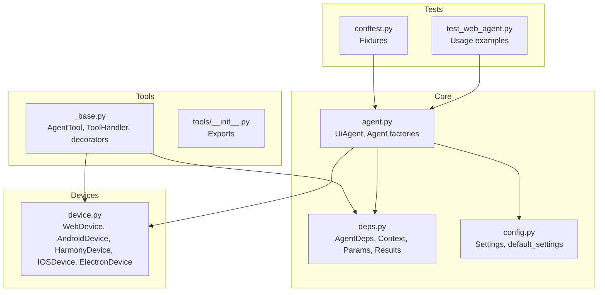
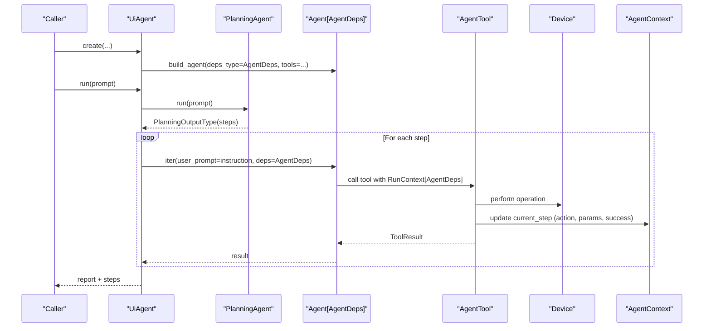
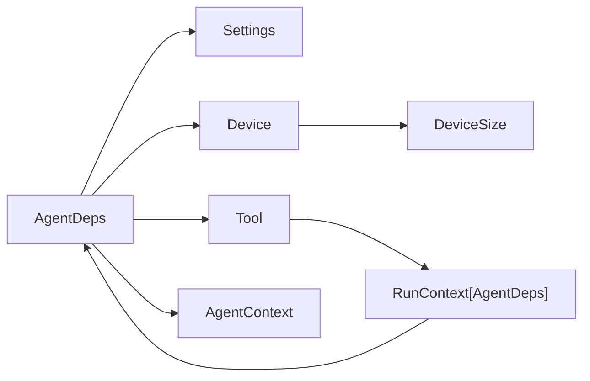

# Dependency Management

<cite>
**Referenced Files in This Document**
- [deps.py](file://src/page_eyes/deps.py)
- [agent.py](file://src/page_eyes/agent.py)
- [device.py](file://src/page_eyes/device.py)
- [config.py](file://src/page_eyes/config.py)
- [_base.py](file://src/page_eyes/tools/_base.py)
- [tools/__init__.py](file://src/page_eyes/tools/__init__.py)
- [conftest.py](file://tests/conftest.py)
- [test_web_agent.py](file://tests/test_web_agent.py)
</cite>

## Table of Contents
1. [Introduction](#introduction)
2. [Project Structure](#project-structure)
3. [Core Components](#core-components)
4. [Architecture Overview](#architecture-overview)
5. [Detailed Component Analysis](#detailed-component-analysis)
6. [Dependency Analysis](#dependency-analysis)
7. [Performance Considerations](#performance-considerations)
8. [Troubleshooting Guide](#troubleshooting-guide)
9. [Conclusion](#conclusion)

## Introduction
This document describes the AgentDeps dependency management system used by PageEyes Agent. It focuses on the AgentDeps class structure, dependency injection patterns, shared data management, context lifecycle, and how resources are shared across devices and tools. It also documents the context object structure, step tracking, execution state management, lifecycle management, circular dependency prevention, resource cleanup, configuration and override mechanisms, and testing support patterns.

## Project Structure
The dependency management system centers around a generic dependency container (AgentDeps) that holds configuration, device abstraction, tool interface, and runtime context. Agents and tools consume this container to coordinate execution, track steps, and manage shared state.

**Diagram sources**
- [deps.py:75-100](file://src/page_eyes/deps.py#L75-L100)
- [agent.py:96-169](file://src/page_eyes/agent.py#L96-L169)
- [config.py:54-73](file://src/page_eyes/config.py#L54-L73)
- [device.py:42-292](file://src/page_eyes/device.py#L42-L292)
- [_base.py:130-391](file://src/page_eyes/tools/_base.py#L130-L391)
- [tools/__init__.py:6-22](file://src/page_eyes/tools/__init__.py#L6-L22)
- [conftest.py:38-116](file://tests/conftest.py#L38-L116)
- [test_web_agent.py:11-209](file://tests/test_web_agent.py#L11-L209)

**Section sources**
- [deps.py:75-100](file://src/page_eyes/deps.py#L75-L100)
- [agent.py:96-169](file://src/page_eyes/agent.py#L96-L169)
- [device.py:42-292](file://src/page_eyes/device.py#L42-L292)
- [_base.py:130-391](file://src/page_eyes/tools/_base.py#L130-L391)
- [tools/__init__.py:6-22](file://src/page_eyes/tools/__init__.py#L6-L22)
- [config.py:54-73](file://src/page_eyes/config.py#L54-L73)
- [conftest.py:38-116](file://tests/conftest.py#L38-L116)
- [test_web_agent.py:11-209](file://tests/test_web_agent.py#L11-L209)

## Core Components
- AgentDeps: Generic container holding Settings, Device, Tool, AgentContext, and app_name_map. It is the central dependency hub passed to agents and tools.
- AgentContext: Tracks steps and current step, with helpers to record failures and update step metadata.
- StepInfo: Per-step execution metadata including step index, description, action, params, image_url, screen_elements, and success flag.
- ToolParams and derived param types: Strongly typed parameter models for tool actions (click, input, swipe, wait, assert, etc.).
- ToolResult and ToolResultWithOutput: Standardized results for tool execution with success flags and optional outputs.
- Device abstractions: WebDevice, AndroidDevice, HarmonyDevice, IOSDevice, ElectronDevice encapsulate platform-specific clients and sizes.
- AgentTool: Base tool interface with tool decorators, screenshot, screen parsing, assertions, waits, swipes, and teardown hooks.

Key API surfaces:
- AgentDeps constructor: accepts settings, device, tool, and optional app_name_map.
- AgentContext methods: add_step_info, update_step_info, set_step_failed.
- ToolHandler: pre/post hooks to record step action/params and success state.
- Tool decorators: tool(...) to wrap tool functions and enforce concurrency and retries.

**Section sources**
- [deps.py:75-100](file://src/page_eyes/deps.py#L75-L100)
- [deps.py:48-73](file://src/page_eyes/deps.py#L48-L73)
- [deps.py:85-280](file://src/page_eyes/deps.py#L85-L280)
- [device.py:42-292](file://src/page_eyes/device.py#L42-L292)
- [_base.py:130-391](file://src/page_eyes/tools/_base.py#L130-L391)

## Architecture Overview
AgentDeps is injected into the Pydantic AI Agent via the deps_type mechanism. Tools receive a RunContext containing the AgentDeps instance, enabling them to access device, settings, and shared context. The UiAgent orchestrates planning and execution, managing step transitions and reporting.

**Diagram sources**
- [agent.py:96-169](file://src/page_eyes/agent.py#L96-L169)
- [agent.py:225-314](file://src/page_eyes/agent.py#L225-L314)
- [_base.py:130-391](file://src/page_eyes/tools/_base.py#L130-L391)
- [deps.py:75-100](file://src/page_eyes/deps.py#L75-L100)

## Detailed Component Analysis

### AgentDeps Container
AgentDeps is a generic container that carries:
- settings: Global configuration (model, model_settings, browser, omni parser, storage, debug).
- device: Device abstraction for the current platform.
- tool: Tool interface for performing actions.
- context: AgentContext for step tracking and state.
- app_name_map: Optional mapping of friendly app names to bundle IDs.

Lifecycle:
- Created by each agent factory (WebAgent.create, AndroidAgent.create, etc.) with platform-specific device and tool instances.
- Passed to Pydantic AI Agent via deps_type=AgentDeps.
- Used by tools via RunContext.deps during execution.

Usage patterns:
- Factory methods construct AgentDeps and pass it to Agent.build_agent.
- Tools access ctx.deps to read settings, device, and context.
- Context is updated per step to reflect action, params, and success.

**Section sources**
- [agent.py:316-515](file://src/page_eyes/agent.py#L316-L515)
- [deps.py:75-100](file://src/page_eyes/deps.py#L75-L100)

### AgentContext and Step Tracking
AgentContext maintains:
- steps: Ordered dictionary of StepInfo keyed by step index.
- current_step: Current StepInfo being executed.

Methods:
- add_step_info: Registers a new StepInfo for the current step index.
- update_step_info: Updates current step attributes dynamically.
- set_step_failed: Marks current step as failed with a reason.

StepInfo fields:
- step, description, action, params, image_url, screen_elements, is_success, plus flags for planning and parallel tool calls.

Execution state management:
- UiAgent sets current_step before invoking sub-agent runs.
- ToolHandler records action and params before tool execution.
- ToolHandler updates is_success after tool completion.
- On failure, mark_failed tool can be invoked to short-circuit.

**Section sources**
- [deps.py:48-73](file://src/page_eyes/deps.py#L48-L73)
- [deps.py:35-46](file://src/page_eyes/deps.py#L35-L46)
- [agent.py:252-287](file://src/page_eyes/agent.py#L252-L287)
- [_base.py:322-347](file://src/page_eyes/tools/_base.py#L322-L347)

### Tool Parameter Types and Results
Strongly typed parameter models enable precise tool contracts:
- ToolParams: Base for all tool actions.
- OpenUrlToolParams: Open URL action.
- LLMLocationToolParams/VLMLocationToolParams: Element selection for LLM/VLM.
- ClickToolParams/InputToolParams/SwipeToolParams/SwipeForKeywordsToolParams: Action-specific parameters.
- WaitToolParams/WaitForKeywordsToolParams: Waiting semantics.
- AssertContainsParams/AssertNotContainsParams: Assertion parameters.
- MarkFailedParams: Failure marking parameters.

Results:
- ToolResult: Boolean success flag with convenience constructors.
- ToolResultWithOutput: Success flag plus optional output payload.

Location computation:
- LLMLocationToolParams.get_coordinate: Computes absolute coordinates from element bounding box and device size.
- VLMLocationToolParams.get_coordinate: Similar computation for VLM coordinates.

**Section sources**
- [deps.py:85-280](file://src/page_eyes/deps.py#L85-L280)

### Tool Decorators and Handler
ToolHandler:
- Captures RunContext and ToolParams to prepare step metadata.
- Enforces single-tool-at-a-time via ModelRetry when parallel_tool_calls is detected.
- Records action and params, and updates is_success after execution.

Tool decorator:
- Wraps tool functions to inject pre/post handling, delays, and automatic retries on exceptions.
- Filters tools by model type (llm/vlm) based on global settings.

Base tool interface:
- Provides screenshot, open_url, click, input, swipe, assert, wait, mark_failed, and tear_down.
- Implements get_screen and get_screen_info variants for LLM/VLM modes.
- Uses storage client to upload screenshots and integrates with OmniParser for element parsing.

**Section sources**
- [_base.py:39-128](file://src/page_eyes/tools/_base.py#L39-L128)
- [_base.py:130-391](file://src/page_eyes/tools/_base.py#L130-L391)

### Device Abstractions
Device base:
- Device[ClientT, DeviceT]: Generic base with client, target, and device_size.
- DeviceSize: width and height.

Concrete devices:
- WebDevice: Playwright-backed, supports mobile simulation and persistent context.
- AndroidDevice: ADB-backed, connects to devices and reads window size.
- HarmonyDevice: HDC-backed, connects to Harmony devices.
- IOSDevice: WebDriverAgent-backed, with optional auto-start and retry logic.
- ElectronDevice: CDP-backed, manages page stack and dynamic window switching.

**Section sources**
- [device.py:42-292](file://src/page_eyes/device.py#L42-L292)

### Configuration and Overrides
Settings:
- Centralized configuration with environment variable precedence.
- Supports model, model_type, model_settings, browser, omni parser, storage client, and debug flags.
- default_settings is loaded from .env with env_prefixes for agent_, browser_, cos_, minio_, omni_.

Override mechanism:
- UiAgent.merge_settings merges caller-provided Settings with default_settings, prioritizing explicit overrides.
- Environment variables and .env file provide fallbacks according to a documented priority order.

**Section sources**
- [config.py:54-73](file://src/page_eyes/config.py#L54-L73)
- [agent.py:102-112](file://src/page_eyes/agent.py#L102-L112)
- [__init__.py:8-16](file://src/page_eyes/__init__.py#L8-L16)

### Testing Support Patterns
Test fixtures:
- conftest.py creates agent instances for different platforms with debug enabled.
- Electron fixture ensures clean startup and port readiness.

Usage patterns:
- Tests call agent.run with natural language prompts to exercise planning, tool execution, assertions, and reporting.
- Tests validate step tracking, success/failure flags, and generated reports.

**Section sources**
- [conftest.py:38-116](file://tests/conftest.py#L38-L116)
- [test_web_agent.py:11-209](file://tests/test_web_agent.py#L11-L209)

## Dependency Analysis
- Coupling:
  - AgentDeps couples Settings, Device, Tool, and AgentContext.
  - Tools depend on RunContext[AgentDeps] to access the container.
  - UiAgent depends on AgentDeps for orchestration and on Agent[AgentDeps] for execution.

- Cohesion:
  - AgentDeps encapsulates cross-cutting concerns (configuration, device, tool, context).
  - ToolHandler centralizes step recording and failure handling.
  - Device abstractions isolate platform-specific logic.

- Circular dependencies:
  - No circular imports observed among deps.py, agent.py, device.py, tools/_base.py, and config.py.
  - Tools import AgentDeps indirectly via RunContext, avoiding compile-time cycles.

- External dependencies:
  - Pydantic AI for agent orchestration and tool invocation.
  - Playwright for web automation.
  - ADB/HDC/WDA for mobile/desktop automation.
  - Storage clients for screenshot uploads.

**Diagram sources**
- [deps.py:75-100](file://src/page_eyes/deps.py#L75-L100)
- [agent.py:96-169](file://src/page_eyes/agent.py#L96-L169)
- [device.py:35-47](file://src/page_eyes/device.py#L35-L47)
- [_base.py:130-391](file://src/page_eyes/tools/_base.py#L130-L391)

**Section sources**
- [deps.py:75-100](file://src/page_eyes/deps.py#L75-L100)
- [agent.py:96-169](file://src/page_eyes/agent.py#L96-L169)
- [device.py:35-47](file://src/page_eyes/device.py#L35-L47)
- [_base.py:130-391](file://src/page_eyes/tools/_base.py#L130-L391)

## Performance Considerations
- Concurrency control: ToolHandler enforces single tool execution via ModelRetry to prevent race conditions and inconsistent UI state.
- Delays: Tool decorator supports before_delay and after_delay to accommodate slow page rendering.
- Parallel tool detection: UiAgent detects multiple tool calls and marks current_step.parallel_tool_calls accordingly.
- Resource cleanup: Device abstractions manage persistent contexts and page stacks; teardown tools can be invoked to release resources.

[No sources needed since this section provides general guidance]

## Troubleshooting Guide
Common issues and resolutions:
- Single-tool constraint violations: If multiple tools are scheduled concurrently, ToolHandler raises ModelRetry. Adjust prompts to serialize actions.
- Tool failures: Exceptions inside tools trigger ModelRetry with a retry message; inspect logs for stack traces.
- Device connection failures:
  - Android: Verify adb connectivity and device availability.
  - Harmony: Verify hdc connectivity and device keys.
  - iOS: Ensure WebDriverAgent is reachable and auto-start is configured if needed.
  - Electron: Confirm CDP port is open and application launched with remote-debugging-port.
- Screen parsing errors: OmniParser service must be reachable; otherwise, get_screen will fail. Check OMNI_BASE_URL and network connectivity.
- Reporting: Reports are generated per run with steps and device size; verify report_dir permissions and HTML template presence.

**Section sources**
- [_base.py:63-86](file://src/page_eyes/tools/_base.py#L63-L86)
- [_base.py:112-119](file://src/page_eyes/tools/_base.py#L112-L119)
- [device.py:107-127](file://src/page_eyes/device.py#L107-L127)
- [device.py:134-156](file://src/page_eyes/device.py#L134-L156)
- [device.py:165-228](file://src/page_eyes/device.py#L165-L228)
- [device.py:244-292](file://src/page_eyes/device.py#L244-L292)
- [_base.py:156-166](file://src/page_eyes/tools/_base.py#L156-L166)

## Conclusion
AgentDeps provides a robust, generic dependency container that enables clean separation of concerns across devices, tools, and agents. Its integration with Pydantic AI’s RunContext allows tools to access shared state and configuration seamlessly. The system enforces safe concurrency, tracks execution state rigorously, and supports flexible configuration and testing patterns. By leveraging strongly typed parameters and standardized results, it improves reliability and maintainability across platforms.