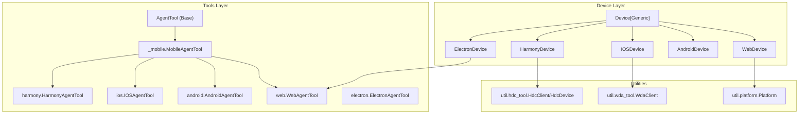
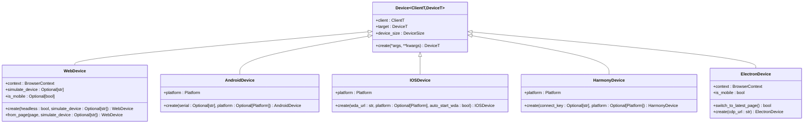
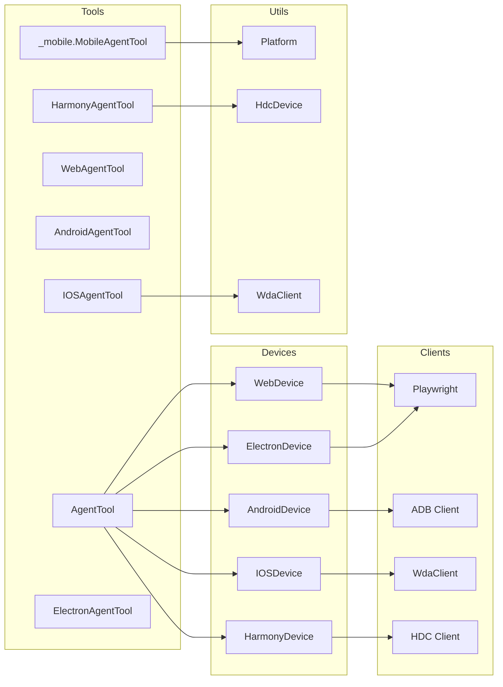

# Device Interface

<cite>
**Referenced Files in This Document**
- [device.py](file://src/page_eyes/device.py)
- [web.py](file://src/page_eyes/tools/web.py)
- [android.py](file://src/page_eyes/tools/android.py)
- [ios.py](file://src/page_eyes/tools/ios.py)
- [harmony.py](file://src/page_eyes/tools/harmony.py)
- [_mobile.py](file://src/page_eyes/tools/_mobile.py)
- [_base.py](file://src/page_eyes/tools/_base.py)
- [platform.py](file://src/page_eyes/util/platform.py)
- [hdc_tool.py](file://src/page_eyes/util/hdc_tool.py)
- [wda_tool.py](file://src/page_eyes/util/wda_tool.py)
- [deps.py](file://src/page_eyes/deps.py)
- [config.py](file://src/page_eyes/config.py)
- [test_web_agent.py](file://tests/test_web_agent.py)
- [test_ios_agent.py](file://tests/test_ios_agent.py)
</cite>

## Table of Contents
1. [Introduction](#introduction)
2. [Project Structure](#project-structure)
3. [Core Components](#core-components)
4. [Architecture Overview](#architecture-overview)
5. [Detailed Component Analysis](#detailed-component-analysis)
6. [Dependency Analysis](#dependency-analysis)
7. [Performance Considerations](#performance-considerations)
8. [Troubleshooting Guide](#troubleshooting-guide)
9. [Conclusion](#conclusion)

## Introduction
This document provides comprehensive API documentation for the Device interface and platform-specific device implementations in PageEyes Agent. It covers the abstract Device base class, common device operations, and platform-specific implementations for Web, Android, iOS, Harmony, and Electron. The documentation includes method signatures for device creation, connection management, screen capture, element interaction, and device state queries, along with parameter specifications, return value types, exception handling, lifecycle management, and platform-specific capabilities and limitations.

## Project Structure
The device ecosystem centers around a generic Device base class and platform-specific subclasses. Tools for each platform extend a shared base to implement device-specific operations. Utilities provide platform abstractions and helpers.

**Diagram sources**
- [device.py:43-390](file://src/page_eyes/device.py#L43-L390)
- [web.py:24-179](file://src/page_eyes/tools/web.py#L24-L179)
- [_mobile.py:27-165](file://src/page_eyes/tools/_mobile.py#L27-L165)
- [ios.py:24-293](file://src/page_eyes/tools/ios.py#L24-L293)
- [harmony.py:20-68](file://src/page_eyes/tools/harmony.py#L20-L68)
- [platform.py:14-66](file://src/page_eyes/util/platform.py#L14-L66)
- [hdc_tool.py:31-108](file://src/page_eyes/util/hdc_tool.py#L31-L108)
- [wda_tool.py:35-129](file://src/page_eyes/util/wda_tool.py#L35-L129)

**Section sources**
- [device.py:43-390](file://src/page_eyes/device.py#L43-L390)
- [web.py:24-179](file://src/page_eyes/tools/web.py#L24-L179)
- [_mobile.py:27-165](file://src/page_eyes/tools/_mobile.py#L27-L165)
- [ios.py:24-293](file://src/page_eyes/tools/ios.py#L24-L293)
- [harmony.py:20-68](file://src/page_eyes/tools/harmony.py#L20-L68)
- [platform.py:14-66](file://src/page_eyes/util/platform.py#L14-L66)
- [hdc_tool.py:31-108](file://src/page_eyes/util/hdc_tool.py#L31-L108)
- [wda_tool.py:35-129](file://src/page_eyes/util/wda_tool.py#L35-L129)

## Core Components
- Device base class: A generic container holding client, target device handle, and device size. Provides a factory method for device creation.
- Platform-specific devices:
  - WebDevice: Chromium via Playwright, supports persistent context and optional device emulation.
  - AndroidDevice: ADB-based, connects to physical or emulated Android devices.
  - IOSDevice: WebDriverAgent-based, supports auto-start and robust retry logic.
  - HarmonyDevice: HDC-based, connects to Harmony devices and exposes UI automation APIs.
  - ElectronDevice: CDP-based, connects to a running Electron app via remote debugging port.
- Shared tooling:
  - AgentTool base: Defines common tool interfaces (screenshot, open_url, click, input, swipe, tear_down) and utilities for screen parsing and assertions.
  - MobileAgentTool: Implements common mobile operations and URL schema handling.
  - Platform utilities: URL schema generation per platform.

Key API surface:
- Device creation:
  - WebDevice.create(headless: bool = ..., simulate_device: Optional[str] = ...) -> WebDevice
  - AndroidDevice.create(serial: Optional[str] = ..., platform: Optional[Platform] = ...) -> AndroidDevice
  - IOSDevice.create(wda_url: str, platform: Optional[Platform] = ..., auto_start_wda: bool = ...) -> IOSDevice
  - HarmonyDevice.create(connect_key: Optional[str] = ..., platform: Optional[Platform] = ...) -> HarmonyDevice
  - ElectronDevice.create(cdp_url: str = "http://127.0.0.1:9222") -> ElectronDevice
- Device state and operations:
  - Screenshot: screenshot(ctx) -> BytesIO
  - Open URL: open_url(ctx, params: OpenUrlToolParams) -> ToolResult
  - Click: click(ctx, params: ClickToolParams) -> ToolResult
  - Input: input(ctx, params: InputToolParams) -> ToolResult
  - Swipe: swipe(ctx, params: SwipeToolParams) -> ToolResult
  - Tear down: tear_down(ctx, params: ToolParams) -> ToolResult
- Additional Electron-specific:
  - switch_to_latest_page(ctx) -> bool

Return types and parameters are defined in the tools and parameter models.

**Section sources**
- [device.py:43-390](file://src/page_eyes/device.py#L43-L390)
- [_base.py:130-391](file://src/page_eyes/tools/_base.py#L130-L391)
- [_mobile.py:27-165](file://src/page_eyes/tools/_mobile.py#L27-L165)
- [deps.py:85-280](file://src/page_eyes/deps.py#L85-L280)

## Architecture Overview
The Device abstraction encapsulates platform differences behind a unified interface. Tools depend on the Device instance to perform actions. Platform utilities and clients (ADB/HDC/WDA) are injected into devices during creation.

**Diagram sources**
- [device.py:43-390](file://src/page_eyes/device.py#L43-L390)

**Section sources**
- [device.py:43-390](file://src/page_eyes/device.py#L43-L390)

## Detailed Component Analysis

### Device Base and Data Structures
- Device: Generic container with client, target, and device_size. Factory method create must be implemented by subclasses.
- DeviceSize: Typed model for width and height.

Common responsibilities:
- Store platform client and target handle.
- Compute and expose device_size derived from the underlying platform API.

**Section sources**
- [device.py:43-47](file://src/page_eyes/device.py#L43-L47)
- [device.py:35-40](file://src/page_eyes/device.py#L35-L40)

### WebDevice
Responsibilities:
- Manage Playwright Chromium browser and persistent context.
- Support device emulation via simulate_device.
- Derive device_size from viewport.

Creation and lifecycle:
- create(headless: bool, simulate_device: Optional[str]) -> WebDevice
  - Starts Playwright, launches persistent context, sets viewport, derives device_size.
  - Supports device emulation via Playwright devices dictionary.
- from_page(page, simulate_device: Optional[str]) -> WebDevice
  - Wraps an existing Playwright Page into a WebDevice.

Capabilities and limitations:
- Uses Chromium channel and ignores default automation flags.
- Emulation requires a known device name; otherwise falls back to default viewport.
- Headless mode supported.

Error handling:
- Raises exceptions on invalid device emulation or context launch failures.

**Section sources**
- [device.py:54-100](file://src/page_eyes/device.py#L54-L100)
- [config.py:40-45](file://src/page_eyes/config.py#L40-L45)

### AndroidDevice
Responsibilities:
- Connect to Android devices via ADB.
- Expose window_size and device_size.

Creation and lifecycle:
- create(serial: Optional[str], platform: Optional[Platform]) -> AndroidDevice
  - Connects to a device by serial or uses the first available device.
  - Retrieves window_size and computes device_size.

Capabilities and limitations:
- Requires ADB connectivity.
- Supports connecting to remote devices via adb connect.

Error handling:
- Raises exceptions if no device is found or connection fails.

**Section sources**
- [device.py:103-127](file://src/page_eyes/device.py#L103-L127)

### IOSDevice
Responsibilities:
- Connect to iOS devices via WebDriverAgent (WDA).
- Provide robust connection with auto-start and retry logic.

Creation and lifecycle:
- create(wda_url: str, platform: Optional[Platform], auto_start_wda: bool) -> IOSDevice
  - Initializes WdaClient, checks status, creates session.
  - On failure, attempts to start WDA (macOS/Xcode required) and retries.

Capabilities and limitations:
- Requires WebDriverAgent server running on device.
- Auto-start uses xcodebuild and environment variables for UDID and project path.
- Supports status checks and session creation.

Error handling:
- Raises exceptions on connection failures and startup issues.
- Logs detailed warnings and retries with bounded attempts.

**Section sources**
- [device.py:159-228](file://src/page_eyes/device.py#L159-L228)
- [device.py:324-390](file://src/page_eyes/device.py#L324-L390)
- [wda_tool.py:35-129](file://src/page_eyes/util/wda_tool.py#L35-L129)

### HarmonyDevice
Responsibilities:
- Connect to Harmony devices via HDC.
- Provide UI automation and screenshot capabilities.

Creation and lifecycle:
- create(connect_key: Optional[str], platform: Optional[Platform]) -> HarmonyDevice
  - Connects to a device by connect_key or uses the first connected device.
  - Computes device_size from window_size.

Capabilities and limitations:
- Uses HdcClient/HdcDevice for commands and UI automation.
- Supports snapshot_display, click, swipe, and main ability resolution.

Error handling:
- Raises exceptions on connection failures or unsupported resolution output.

**Section sources**
- [device.py:130-156](file://src/page_eyes/device.py#L130-L156)
- [hdc_tool.py:31-108](file://src/page_eyes/util/hdc_tool.py#L31-L108)

### ElectronDevice
Responsibilities:
- Connect to a running Electron app via CDP.
- Manage multiple pages and automatic switching to latest page.

Creation and lifecycle:
- create(cdp_url: str = "http://127.0.0.1:9222") -> ElectronDevice
  - Connects to Chromium CDP, derives device_size from viewport or JS evaluation.
  - Registers page close handlers to maintain page stack and fallback.

Additional operations:
- switch_to_latest_page() -> bool
  - Detects new pages, updates target and device_size.

Capabilities and limitations:
- Requires Electron app launched with --remote-debugging-port.
- Handles Retina scaling by forcing CSS scale screenshots.
- Automatically manages page stack and window close events.

Error handling:
- Raises exceptions on CDP connection failures or viewport retrieval issues.

**Section sources**
- [device.py:231-293](file://src/page_eyes/device.py#L231-L293)

### Tooling Layer and Common Operations
- AgentTool base:
  - Defines screenshot, open_url, click, input, swipe, tear_down, and assertion utilities.
  - Provides screen parsing via OmniParser and storage upload.
- MobileAgentTool:
  - Implements common mobile operations and URL schema generation per platform.
  - Uses platform-specific clients for input and app operations.
- Platform utilities:
  - Platform enum and URL schema generator for client-side deep links.

Parameter models:
- OpenUrlToolParams, ClickToolParams, InputToolParams, SwipeToolParams, SwipeForKeywordsToolParams, WaitToolParams, AssertContainsParams, AssertNotContainsParams, MarkFailedParams, ToolResult, ToolResultWithOutput.

**Section sources**
- [_base.py:130-391](file://src/page_eyes/tools/_base.py#L130-L391)
- [_mobile.py:27-165](file://src/page_eyes/tools/_mobile.py#L27-L165)
- [platform.py:14-66](file://src/page_eyes/util/platform.py#L14-L66)
- [deps.py:85-280](file://src/page_eyes/deps.py#L85-L280)

### Platform-Specific Tool Implementations
- WebAgentTool:
  - Screenshot via Playwright Page.
  - open_url navigates to URL with networkidle.
  - click handles file chooser and new page transitions.
  - input types text and optionally presses Enter.
  - swipe uses mouse drag or scroll depending on device type.
  - tear_down cleans up highlights and closes context/client.
- AndroidAgentTool:
  - _start_url uses ADB shell am start for URLs.
- IOSAgentTool:
  - Screenshot returns PIL Image or bytes.
  - click uses WDA tap; input uses tap_and_input with optional Enter.
  - swipe uses WDA swipe with configurable repeat and expectation.
  - swipe_from_coordinate validates coordinates and performs multi-segment swipe.
  - goback tries back button detection then edge swipe; home triggers WDA home.
  - open_url launches Safari and opens URL via URL scheme.
  - open_app resolves app by Bundle ID and launches.
- HarmonyAgentTool:
  - _start_url uses aa start with OHOS want action.
  - input uses uitest input_text and keyevent ENTER.
  - open_app resolves main ability and starts app.
- ElectronAgentTool:
  - Screenshot ensures latest page and uses CSS scale.
  - click handles file chooser and detects new windows.
  - close_window closes current window and auto-fallbacks.
  - tear_down removes highlights and refreshes screen.

**Section sources**
- [web.py:24-179](file://src/page_eyes/tools/web.py#L24-L179)
- [android.py:18-23](file://src/page_eyes/tools/android.py#L18-L23)
- [ios.py:24-293](file://src/page_eyes/tools/ios.py#L24-L293)
- [harmony.py:20-68](file://src/page_eyes/tools/harmony.py#L20-L68)
- [electron.py:21-134](file://src/page_eyes/tools/electron.py#L21-L134)

## Dependency Analysis
The Device classes depend on platform clients and utilities. Tools depend on Device instances and parameter models. The platform utility module centralizes URL schema generation.

**Diagram sources**
- [device.py:54-293](file://src/page_eyes/device.py#L54-L293)
- [_mobile.py:19-24](file://src/page_eyes/tools/_mobile.py#L19-L24)
- [platform.py:48-66](file://src/page_eyes/util/platform.py#L48-L66)
- [hdc_tool.py:77-108](file://src/page_eyes/util/hdc_tool.py#L77-L108)
- [wda_tool.py:35-129](file://src/page_eyes/util/wda_tool.py#L35-L129)

**Section sources**
- [device.py:54-293](file://src/page_eyes/device.py#L54-L293)
- [_mobile.py:19-24](file://src/page_eyes/tools/_mobile.py#L19-L24)
- [platform.py:48-66](file://src/page_eyes/util/platform.py#L48-L66)
- [hdc_tool.py:77-108](file://src/page_eyes/util/hdc_tool.py#L77-L108)
- [wda_tool.py:35-129](file://src/page_eyes/util/wda_tool.py#L35-L129)

## Performance Considerations
- WebDevice:
  - Persistent context reduces cold-start overhead; emulate only when needed.
  - Avoid unnecessary full-page screenshots; prefer viewport-based captures.
- AndroidDevice:
  - Prefer connecting to local devices to minimize latency.
  - Batch operations to reduce shell command overhead.
- IOSDevice:
  - Auto-start WDA adds startup latency; ensure environment variables are configured to avoid repeated attempts.
  - Reuse sessions to avoid frequent reconnects.
- HarmonyDevice:
  - UI automation commands are synchronous; batch operations to reduce round-trips.
- ElectronDevice:
  - Force CSS scale screenshots to avoid DPI mismatch; monitor page stack growth to prevent memory pressure.

## Troubleshooting Guide
Common issues and resolutions:
- WebDevice
  - Context launch failures: Verify Chrome/Chromium availability and flags; check headless mode compatibility.
  - Device emulation errors: Ensure simulate_device matches Playwright’s device list.
- AndroidDevice
  - No device found: Confirm ADB is running and devices are visible; use explicit serial if needed.
  - Connection failures: Validate adb connect output and network reachability.
- IOSDevice
  - WebDriverAgent unreachable: Check wda_url and device accessibility; enable auto_start_wda with proper environment variables.
  - Retry loop failures: Inspect logs for xcodebuild errors and ensure Xcode tools are installed.
- HarmonyDevice
  - HDC connection failures: Verify HDC daemon and device connectivity; check device state.
  - Snapshot/display errors: Validate snapshot_display permissions and output parsing.
- ElectronDevice
  - CDP connection failures: Ensure Electron app is launched with --remote-debugging-port and port is reachable.
  - Page switching issues: Confirm page close event handlers are registered and page stack is maintained.

Operational safeguards:
- Tool decorators enforce single-tool execution and provide structured error reporting with retry hints.
- Assertions and waits help stabilize flaky interactions.

**Section sources**
- [device.py:106-122](file://src/page_eyes/device.py#L106-L122)
- [device.py:164-227](file://src/page_eyes/device.py#L164-L227)
- [device.py:133-151](file://src/page_eyes/device.py#L133-L151)
- [device.py:244-292](file://src/page_eyes/device.py#L244-L292)
- [_base.py:88-127](file://src/page_eyes/tools/_base.py#L88-L127)
- [test_web_agent.py:11-209](file://tests/test_web_agent.py#L11-L209)
- [test_ios_agent.py:11-212](file://tests/test_ios_agent.py#L11-L212)

## Conclusion
The Device interface and platform-specific implementations provide a cohesive abstraction for cross-platform UI automation in PageEyes Agent. By leveraging typed parameters, robust error handling, and platform utilities, the system supports reliable device creation, connection management, screen capture, element interaction, and lifecycle cleanup. Platform-specific capabilities and limitations are clearly delineated, enabling targeted troubleshooting and optimization.