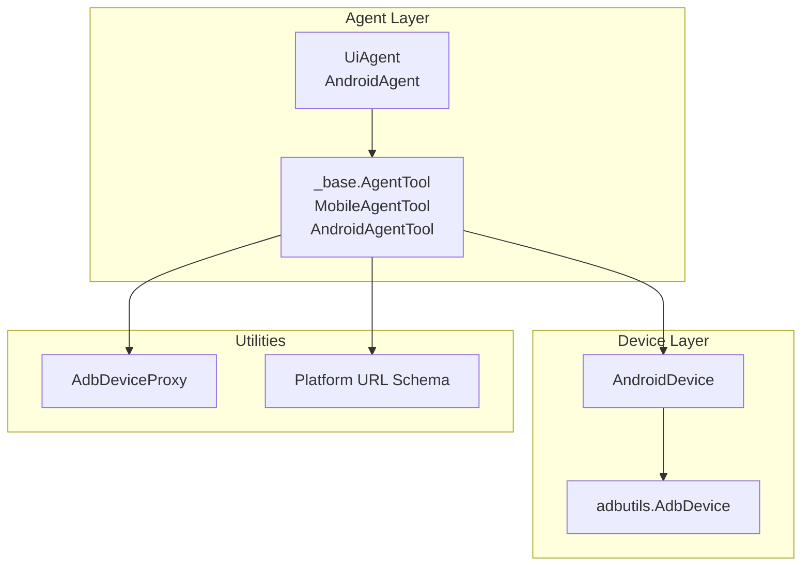
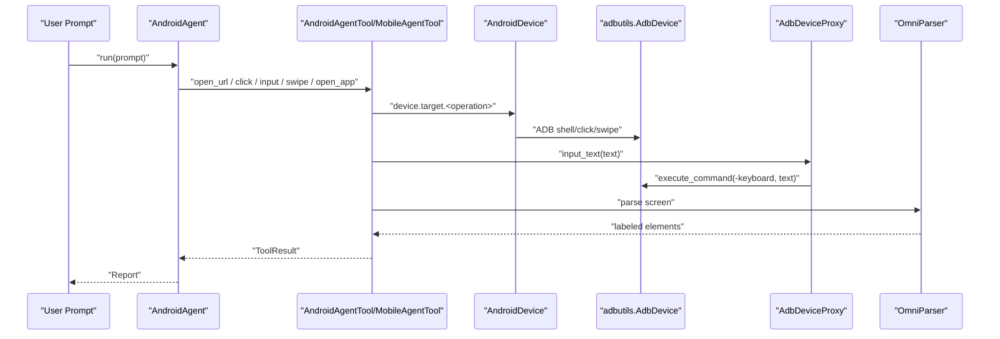
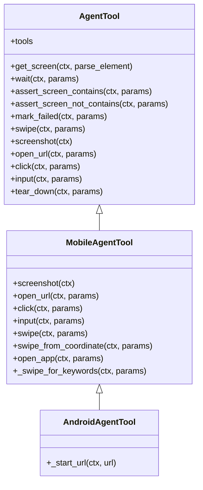
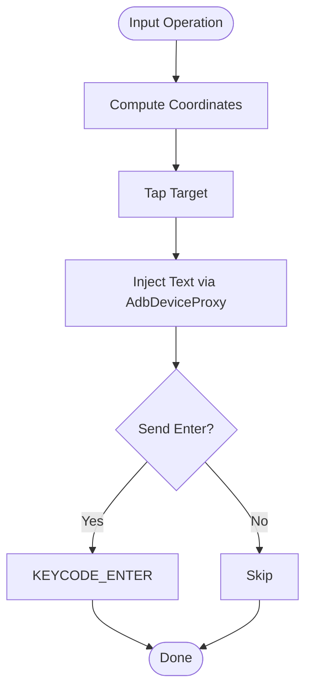
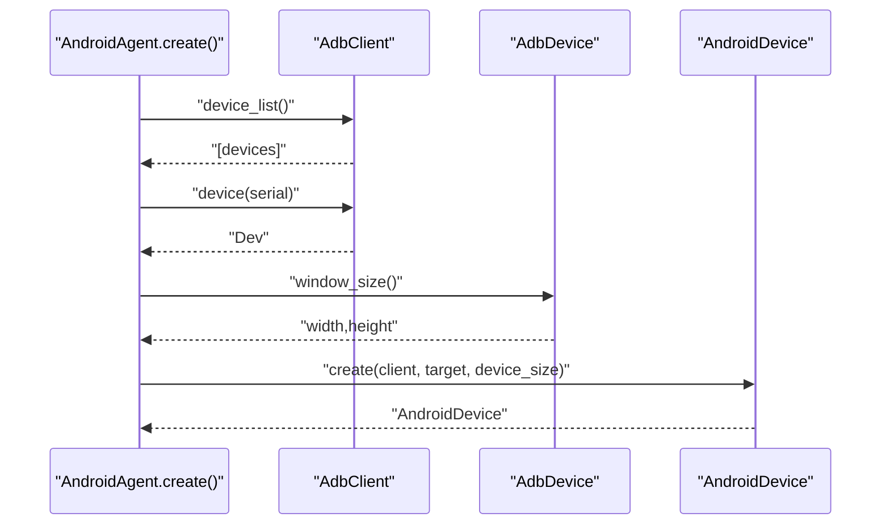
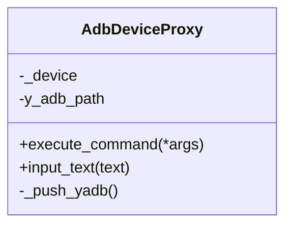
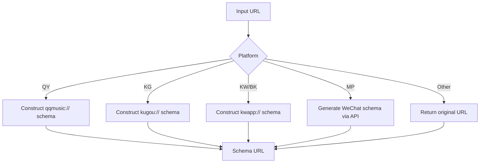
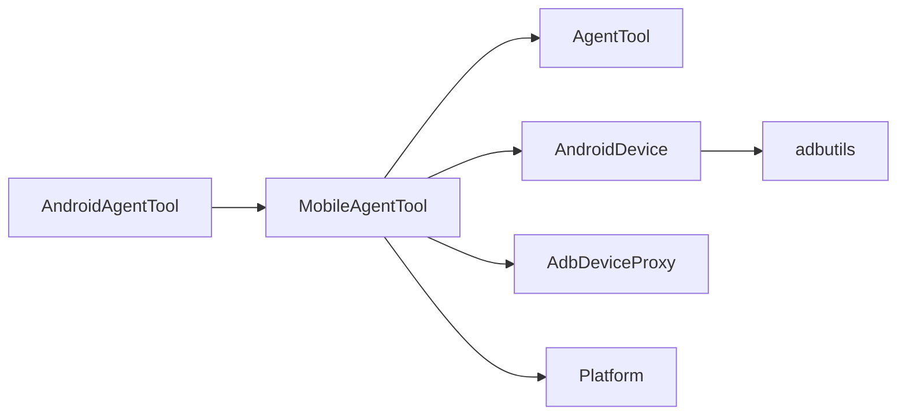

# Android Agent Tool

<cite>
**Referenced Files in This Document**
- [android.py](file://src/page_eyes/tools/android.py)
- [_mobile.py](file://src/page_eyes/tools/_mobile.py)
- [_base.py](file://src/page_eyes/tools/_base.py)
- [device.py](file://src/page_eyes/device.py)
- [adb_tool.py](file://src/page_eyes/util/adb_tool.py)
- [platform.py](file://src/page_eyes/util/platform.py)
- [deps.py](file://src/page_eyes/deps.py)
- [agent.py](file://src/page_eyes/agent.py)
- [test_android_agent.py](file://tests/test_android_agent.py)
- [README.md](file://README.md)
</cite>

## Table of Contents
1. [Introduction](#introduction)
2. [Project Structure](#project-structure)
3. [Core Components](#core-components)
4. [Architecture Overview](#architecture-overview)
5. [Detailed Component Analysis](#detailed-component-analysis)
6. [Dependency Analysis](#dependency-analysis)
7. [Performance Considerations](#performance-considerations)
8. [Troubleshooting Guide](#troubleshooting-guide)
9. [Conclusion](#conclusion)
10. [Appendices](#appendices)

## Introduction
This document provides comprehensive API documentation for the AndroidAgentTool implementation in PageEyes Agent. It focuses on ADB-based mobile device automation, covering touch gestures, text input, app launching, and screen interaction. It also documents device connection management, ADB command execution, device state monitoring, element identification, and error handling strategies. Practical examples demonstrate common Android automation scenarios such as app testing, UI verification, and mobile workflow automation.

## Project Structure
The Android automation capability is implemented as part of a multi-platform agent framework. The Android-specific tooling integrates with:
- Android device connection and lifecycle management
- ADB-backed device operations
- Cross-platform tool abstractions
- Parameterized tool definitions and result types
- Platform-aware URL schema generation

**Diagram sources**
- [agent.py:365-400](file://src/page_eyes/agent.py#L365-L400)
- [android.py:18-22](file://src/page_eyes/tools/android.py#L18-L22)
- [_mobile.py:27-165](file://src/page_eyes/tools/_mobile.py#L27-L165)
- [device.py:102-126](file://src/page_eyes/device.py#L102-L126)
- [adb_tool.py:12-37](file://src/page_eyes/util/adb_tool.py#L12-L37)
- [platform.py:48-66](file://src/page_eyes/util/platform.py#L48-L66)

**Section sources**
- [agent.py:365-400](file://src/page_eyes/agent.py#L365-L400)
- [android.py:18-22](file://src/page_eyes/tools/android.py#L18-L22)
- [_mobile.py:27-165](file://src/page_eyes/tools/_mobile.py#L27-L165)
- [device.py:102-126](file://src/page_eyes/device.py#L102-L126)
- [adb_tool.py:12-37](file://src/page_eyes/util/adb_tool.py#L12-L37)
- [platform.py:48-66](file://src/page_eyes/util/platform.py#L48-L66)

## Core Components
- AndroidAgentTool: Android-specific tool implementation extending MobileAgentTool. It defines how URLs are opened on Android devices using ADB shell commands.
- MobileAgentTool: Shared tool implementation for mobile platforms, providing:
  - Screenshot capture
  - Element click
  - Text input with keyboard injection
  - Swipe gestures (directional and coordinate-based)
  - App opening by resolving user instructions to package names
  - Screen parsing and assertion helpers
- AndroidDevice: Device abstraction for Android using adbutils, including connection, device size detection, and app operations.
- AdbDeviceProxy: Utility to push and execute a lightweight binary on the device for keyboard input injection.
- Platform URL schema: Converts logical URLs to platform-specific schemas for Android clients.

Key APIs exposed to the agent runtime:
- click(ctx, params)
- input(ctx, params)
- open_url(ctx, params)
- screenshot(ctx)
- swipe(ctx, params)
- swipe_from_coordinate(ctx, params)
- open_app(ctx, params)
- get_screen_info(ctx)
- wait(ctx, params)
- assert_screen_contains(ctx, params)
- assert_screen_not_contains(ctx, params)
- mark_failed(ctx, params)
- tear_down(ctx, params)

**Section sources**
- [android.py:18-22](file://src/page_eyes/tools/android.py#L18-L22)
- [_mobile.py:27-165](file://src/page_eyes/tools/_mobile.py#L27-L165)
- [device.py:102-126](file://src/page_eyes/device.py#L102-L126)
- [adb_tool.py:12-37](file://src/page_eyes/util/adb_tool.py#L12-L37)
- [platform.py:48-66](file://src/page_eyes/util/platform.py#L48-L66)
- [_base.py:130-391](file://src/page_eyes/tools/_base.py#L130-L391)

## Architecture Overview
The Android automation pipeline integrates the agent’s tooling with Android device operations through ADB. The AndroidAgentTool delegates URL opening to the underlying device shell. Input operations leverage AdbDeviceProxy to inject text via a device-side binary. Gesture operations use adbutils’ native click/swipe APIs. Screen parsing is performed by an external OmniParser service, returning labeled elements for precise targeting.

**Diagram sources**
- [agent.py:365-400](file://src/page_eyes/agent.py#L365-L400)
- [android.py:20-22](file://src/page_eyes/tools/android.py#L20-L22)
- [_mobile.py:34-165](file://src/page_eyes/tools/_mobile.py#L34-L165)
- [device.py:102-126](file://src/page_eyes/device.py#L102-L126)
- [adb_tool.py:26-37](file://src/page_eyes/util/adb_tool.py#L26-L37)
- [_base.py:167-203](file://src/page_eyes/tools/_base.py#L167-L203)

## Detailed Component Analysis

### AndroidAgentTool
- Purpose: Android-specific URL opener using ADB shell.
- Method: _start_url(ctx, url) executes an ADB shell command to start an activity with the given URL.
- Integration: Called by MobileAgentTool.open_url after platform-aware URL schema conversion.

**Diagram sources**
- [_base.py:130-391](file://src/page_eyes/tools/_base.py#L130-L391)
- [_mobile.py:27-165](file://src/page_eyes/tools/_mobile.py#L27-L165)
- [android.py:18-22](file://src/page_eyes/tools/android.py#L18-L22)

**Section sources**
- [android.py:18-22](file://src/page_eyes/tools/android.py#L18-L22)
- [_mobile.py:49-60](file://src/page_eyes/tools/_mobile.py#L49-L60)
- [platform.py:48-66](file://src/page_eyes/util/platform.py#L48-L66)

### MobileAgentTool
- Screenshot: Captures PNG bytes from the device and returns a BytesIO buffer.
- Click: Computes coordinates from element IDs or explicit coordinates and performs a tap.
- Input: Clicks the target element, injects text via AdbDeviceProxy, and optionally sends ENTER.
- Swipe (directional): Performs directional swipes with optional repeated attempts and keyword expectations.
- Swipe (coordinate-based): Executes a series of swipe segments between consecutive coordinates.
- Open app: Lists installed packages, asks a sub-agent to resolve user instruction to a package name, starts the app.
- Screen parsing and assertions: Uses OmniParser to label elements and checks presence/absence of keywords.

**Diagram sources**
- [_mobile.py:62-84](file://src/page_eyes/tools/_mobile.py#L62-L84)
- [adb_tool.py:35-37](file://src/page_eyes/util/adb_tool.py#L35-L37)

**Section sources**
- [_mobile.py:34-165](file://src/page_eyes/tools/_mobile.py#L34-L165)
- [adb_tool.py:12-37](file://src/page_eyes/util/adb_tool.py#L12-L37)

### AndroidDevice
- Factory: Creates an AndroidDevice by connecting to adb, selecting a device by serial or defaulting to the first available device, and retrieving window size.
- Device operations: Provides access to adbutils device APIs for screenshots, clicks, swipes, app operations, and package listing.

**Diagram sources**
- [device.py:106-126](file://src/page_eyes/device.py#L106-L126)

**Section sources**
- [device.py:102-126](file://src/page_eyes/device.py#L102-L126)

### AdbDeviceProxy
- Purpose: Pushes a lightweight binary to the device and executes it to inject text via the device shell.
- Methods:
  - execute_command(args...): Invokes the binary with arguments.
  - input_text(text): Sends keyboard input to the device.

**Diagram sources**
- [adb_tool.py:12-37](file://src/page_eyes/util/adb_tool.py#L12-L37)

**Section sources**
- [adb_tool.py:12-37](file://src/page_eyes/util/adb_tool.py#L12-L37)

### Platform URL Schema
- Purpose: Converts logical URLs to platform-specific schemas for Android clients.
- Behavior: Based on platform type, constructs appropriate client URLs (e.g., qqmusic://, kugou://, kwapp://, mp wx schema).

**Diagram sources**
- [platform.py:48-66](file://src/page_eyes/util/platform.py#L48-L66)

**Section sources**
- [platform.py:48-66](file://src/page_eyes/util/platform.py#L48-L66)

### Tool Parameters and Results
- ToolParams: Base for all tool parameters with action and instruction fields.
- OpenUrlToolParams: url field for open_url.
- ClickToolParams: element selection via element_id/content or explicit coordinates; supports relative position and offset; optional file upload path.
- InputToolParams: text to input and optional send_enter flag.
- SwipeToolParams: direction and repeat count.
- SwipeForKeywordsToolParams: adds expect_keywords for directional swipe with expectation.
- SwipeFromCoordinateToolParams: ordered list of (x,y) pairs for segmented swipe.
- WaitToolParams: timeout seconds.
- WaitForKeywordsToolParams: timeout plus expected keywords.
- AssertContainsParams / AssertNotContainsParams: keyword lists to check.
- ToolResult / ToolResultWithOutput: standardized success/failure and optional outputs.

**Section sources**
- [deps.py:85-280](file://src/page_eyes/deps.py#L85-L280)

## Dependency Analysis
- AndroidAgentTool depends on:
  - MobileAgentTool for shared operations
  - AndroidDevice for device shell access
  - AdbDeviceProxy for text injection
  - Platform for URL schema conversion
- MobileAgentTool depends on:
  - AgentTool for base tooling and screen parsing
  - AdbDeviceProxy for input
  - Platform for URL schema
- AndroidDevice depends on adbutils for device operations.

**Diagram sources**
- [android.py:18-22](file://src/page_eyes/tools/android.py#L18-L22)
- [_mobile.py:27-165](file://src/page_eyes/tools/_mobile.py#L27-L165)
- [device.py:102-126](file://src/page_eyes/device.py#L102-L126)
- [adb_tool.py:12-37](file://src/page_eyes/util/adb_tool.py#L12-L37)
- [platform.py:48-66](file://src/page_eyes/util/platform.py#L48-L66)

**Section sources**
- [android.py:18-22](file://src/page_eyes/tools/android.py#L18-L22)
- [_mobile.py:27-165](file://src/page_eyes/tools/_mobile.py#L27-L165)
- [device.py:102-126](file://src/page_eyes/device.py#L102-L126)
- [adb_tool.py:12-37](file://src/page_eyes/util/adb_tool.py#L12-L37)
- [platform.py:48-66](file://src/page_eyes/util/platform.py#L48-L66)

## Performance Considerations
- Delayed operations: Tools include configurable before/after delays to accommodate rendering and animations.
- Batched gestures: swipe_from_coordinate accepts multiple coordinate pairs to minimize round-trips.
- Efficient parsing: get_screen_info returns minimal element metadata to reduce LLM payload.
- Retry and robustness: Decorator catches exceptions and triggers a retry to improve resilience.

[No sources needed since this section provides general guidance]

## Troubleshooting Guide
Common issues and mitigations:
- Device disconnection:
  - Ensure adb is running and device is connected.
  - Verify serial connectivity and re-run connection steps.
- Permission issues:
  - Grant necessary permissions on the device for automation.
  - Confirm app permissions for input injection and screen capture.
- App crashes or instability:
  - Use wait and assert helpers to stabilize state before actions.
  - Retry failed steps with ModelRetry behavior.
- Keyboard input failures:
  - Confirm AdbDeviceProxy binary is present on the device.
  - Re-push binary if missing or device storage cleared.

**Section sources**
- [_base.py:112-119](file://src/page_eyes/tools/_base.py#L112-L119)
- [adb_tool.py:18-24](file://src/page_eyes/util/adb_tool.py#L18-L24)

## Conclusion
The AndroidAgentTool provides a robust, extensible foundation for Android automation within PageEyes Agent. By leveraging adbutils for device operations, AdbDeviceProxy for text injection, and platform-aware URL schema conversion, it enables reliable touch gestures, text input, app launching, and screen interaction. The shared MobileAgentTool and AgentTool abstractions unify cross-platform behavior, while parameterized tool definitions and result types ensure predictable integration with the agent runtime.

[No sources needed since this section summarizes without analyzing specific files]

## Appendices

### API Reference

- click(ctx, params: ClickToolParams) -> ToolResult
  - Description: Tap at computed coordinates derived from element or explicit position.
  - Parameters: element_id/content or coordinate-based selection; optional relative position and offset.
  - Notes: Uses device coordinates scaled by current device size.

- input(ctx, params: InputToolParams) -> ToolResult
  - Description: Click target element, inject text via ADB, optionally send ENTER.
  - Parameters: text, send_enter flag.
  - Notes: Requires ADB keyboard support and proper focus.

- open_url(ctx, params: OpenUrlToolParams) -> ToolResult
  - Description: Convert URL to platform schema and open via ADB shell.
  - Parameters: url string.
  - Notes: Uses platform.py mapping for Android clients.

- screenshot(ctx) -> io.BytesIO
  - Description: Capture PNG screenshot and return in-memory buffer.

- swipe(ctx, params: SwipeForKeywordsToolParams) -> ToolResult
  - Description: Directional swipe with optional repeated attempts until expected keywords appear.
  - Parameters: to direction, repeat_times, expect_keywords.

- swipe_from_coordinate(ctx, params: SwipeFromCoordinateToolParams) -> ToolResult
  - Description: Execute a sequence of swipe segments between consecutive coordinates.

- open_app(ctx, params: ToolParams) -> ToolResult
  - Description: Resolve user instruction to a package name and start the app.
  - Notes: Uses a sub-agent to select the correct package from installed apps.

- get_screen_info(ctx) -> ToolResultWithOutput[dict]
  - Description: Parse screen and return minimal element metadata for LLM consumption.

- wait(ctx, params: WaitForKeywordsToolParams) -> ToolResult
  - Description: Wait for timeout or until expected keywords appear.

- assert_screen_contains(ctx, params: AssertContainsParams) -> ToolResult
- assert_screen_not_contains(ctx, params: AssertNotContainsParams) -> ToolResult
  - Description: Validate presence/absence of keywords on screen.

- mark_failed(ctx, params: MarkFailedParams) -> ToolResult
  - Description: Fail the current step with a reason.

- tear_down(ctx, params: ToolParams) -> ToolResult
  - Description: Final cleanup step capturing a screen snapshot.

**Section sources**
- [_mobile.py:49-165](file://src/page_eyes/tools/_mobile.py#L49-L165)
- [_base.py:167-321](file://src/page_eyes/tools/_base.py#L167-L321)
- [deps.py:85-280](file://src/page_eyes/deps.py#L85-L280)

### Example Scenarios

- App testing
  - Open an app, navigate through menus, and verify UI elements.
  - Use assert_screen_contains to confirm expected text or elements.

- UI verification
  - Open a URL, wait for content, and validate presence of keywords.
  - Combine swipe and wait to stabilize dynamic content.

- Mobile workflow automation
  - Chain open_url, input, click, swipe, and open_app operations.
  - Use coordinate-based swipes for precise control in complex layouts.

**Section sources**
- [test_android_agent.py:11-70](file://tests/test_android_agent.py#L11-L70)
- [README.md:68-83](file://README.md#L68-L83)