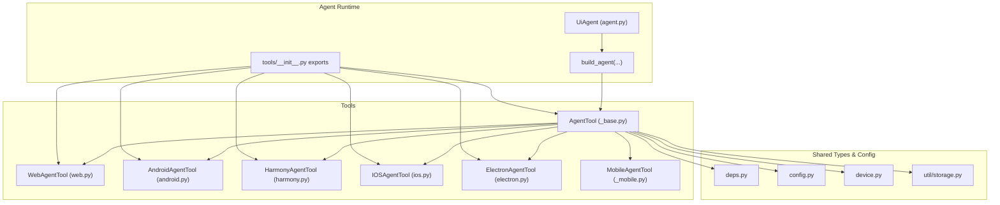
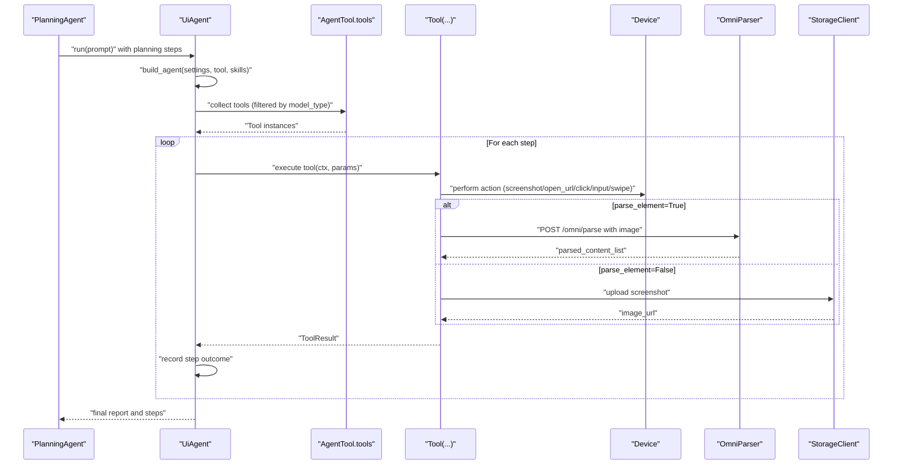
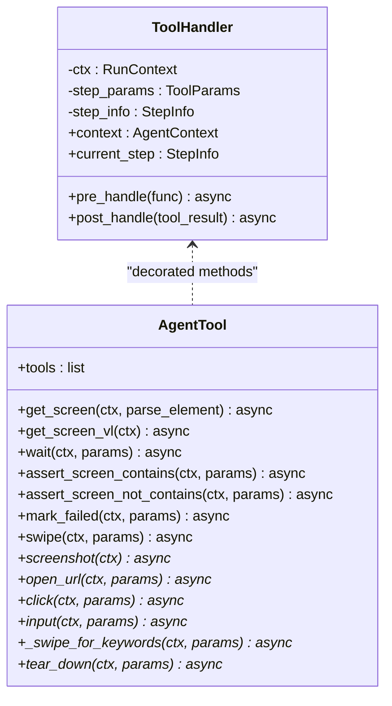
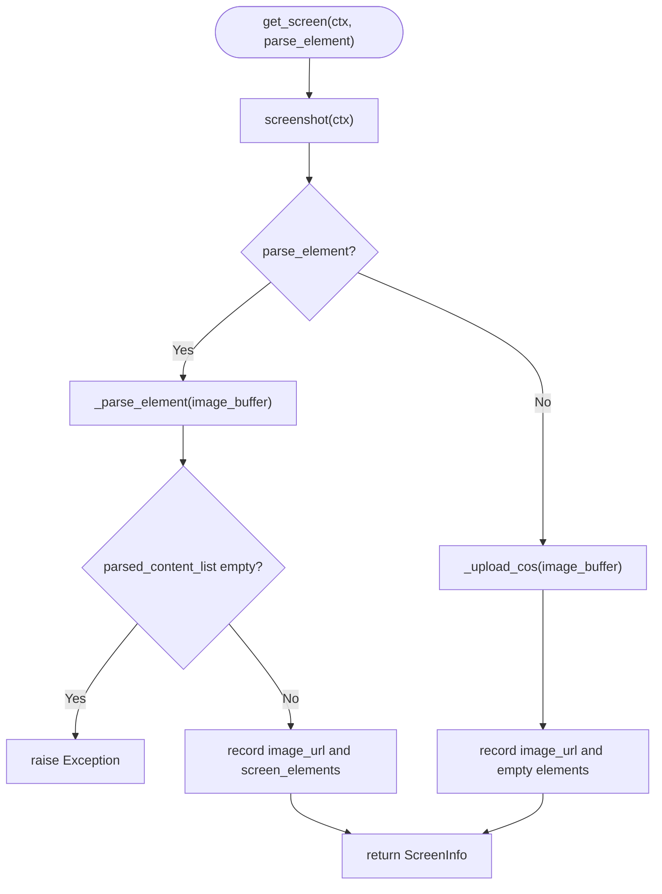
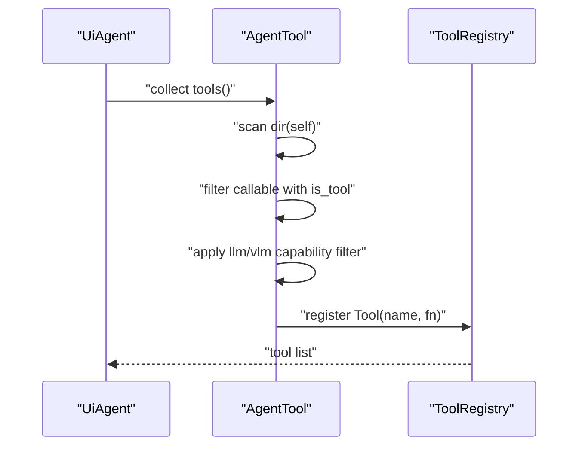
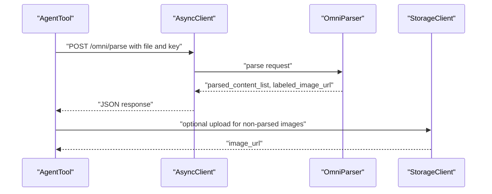
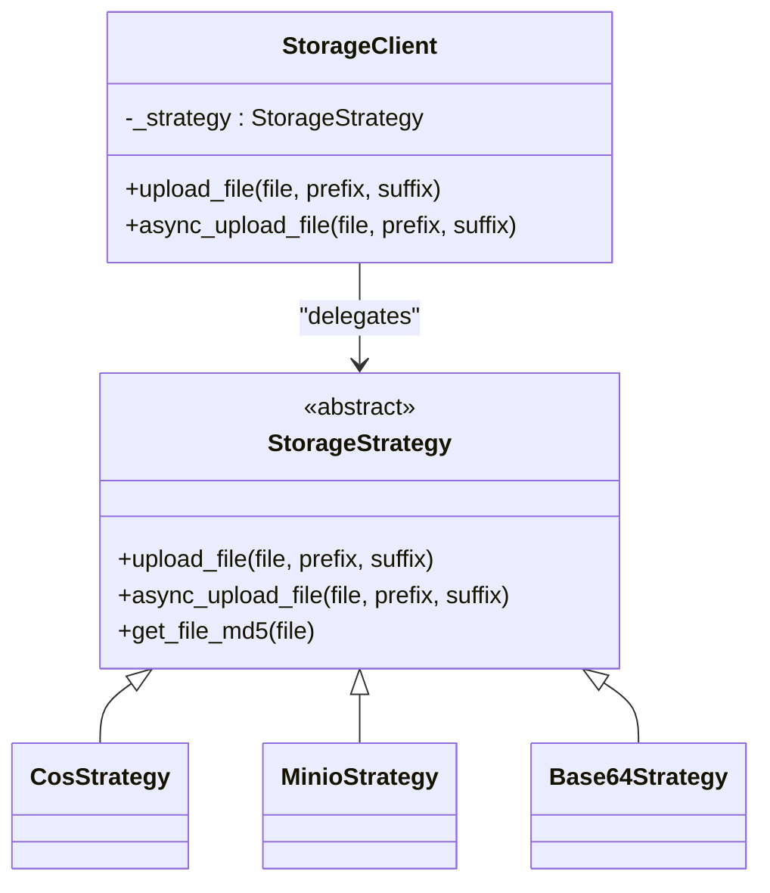
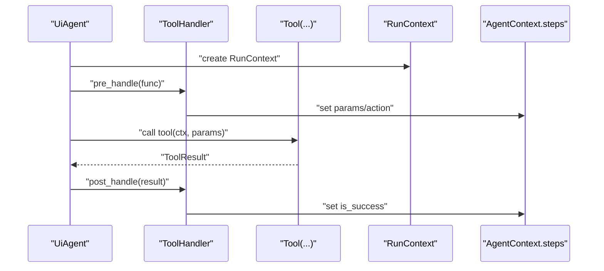
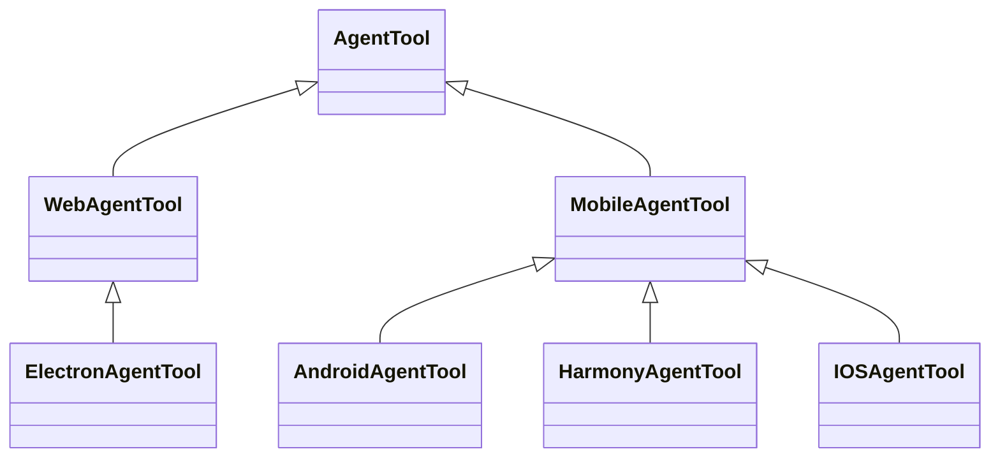
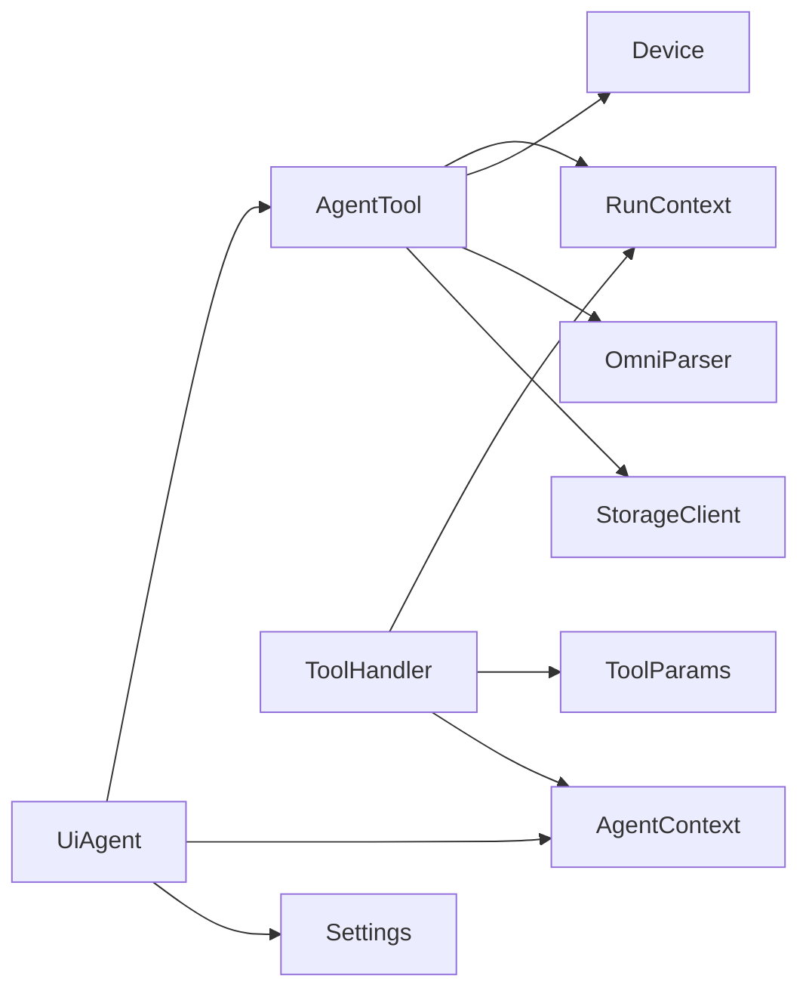

# Base Tool Class

<cite>
**Referenced Files in This Document**
- [tools/_base.py](file://src/page_eyes/tools/_base.py)
- [tools/__init__.py](file://src/page_eyes/tools/__init__.py)
- [tools/web.py](file://src/page_eyes/tools/web.py)
- [tools/android.py](file://src/page_eyes/tools/android.py)
- [tools/harmony.py](file://src/page_eyes/tools/harmony.py)
- [tools/ios.py](file://src/page_eyes/tools/ios.py)
- [tools/electron.py](file://src/page_eyes/tools/electron.py)
- [tools/_mobile.py](file://src/page_eyes/tools/_mobile.py)
- [agent.py](file://src/page_eyes/agent.py)
- [deps.py](file://src/page_eyes/deps.py)
- [config.py](file://src/page_eyes/config.py)
- [device.py](file://src/page_eyes/device.py)
- [util/storage.py](file://src/page_eyes/util/storage.py)
</cite>

## Table of Contents
1. [Introduction](#introduction)
2. [Project Structure](#project-structure)
3. [Core Components](#core-components)
4. [Architecture Overview](#architecture-overview)
5. [Detailed Component Analysis](#detailed-component-analysis)
6. [Dependency Analysis](#dependency-analysis)
7. [Performance Considerations](#performance-considerations)
8. [Troubleshooting Guide](#troubleshooting-guide)
9. [Conclusion](#conclusion)
10. [Appendices](#appendices)

## Introduction
This document explains the AgentTool base class and ToolHandler system used by PageEyes Agent. It covers:
- The abstract AgentTool class and its core methods: screenshot(), open_url(), click(), input(), swipe(), and tear_down().
- The ToolHandler decorator system for tool function wrapping, including pre_handle() and post_handle() operations.
- Tool registration and capability detection for LLM/VLM models, and automatic tool discovery.
- Method signatures, parameter validation, return value types, and exception handling patterns.
- Screen parsing using OmniParser VLM, cloud storage integration, and step tracking mechanisms.
- Examples of tool decoration patterns and best practices for extending the base tool class.

## Project Structure
The tool system is organized around a shared base class with platform-specific implementations and a unified agent runtime that registers tools automatically.

**Diagram sources**
- [tools/__init__.py:6-21](file://src/page_eyes/tools/__init__.py#L6-L21)
- [tools/_base.py:130-391](file://src/page_eyes/tools/_base.py#L130-L391)
- [tools/web.py:24-179](file://src/page_eyes/tools/web.py#L24-L179)
- [tools/android.py:18-23](file://src/page_eyes/tools/android.py#L18-L23)
- [tools/harmony.py:20-68](file://src/page_eyes/tools/harmony.py#L20-L68)
- [tools/ios.py:24-293](file://src/page_eyes/tools/ios.py#L24-L293)
- [tools/electron.py:21-134](file://src/page_eyes/tools/electron.py#L21-L134)
- [tools/_mobile.py:27-165](file://src/page_eyes/tools/_mobile.py#L27-L165)
- [agent.py:146-169](file://src/page_eyes/agent.py#L146-L169)
- [deps.py:75-100](file://src/page_eyes/deps.py#L75-L100)
- [config.py:54-73](file://src/page_eyes/config.py#L54-L73)
- [device.py:42-390](file://src/page_eyes/device.py#L42-L390)
- [util/storage.py:154-193](file://src/page_eyes/util/storage.py#L154-L193)

**Section sources**
- [tools/__init__.py:6-21](file://src/page_eyes/tools/__init__.py#L6-L21)
- [agent.py:146-169](file://src/page_eyes/agent.py#L146-L169)

## Core Components
- AgentTool: Abstract base class defining the tool contract and shared utilities for screen capture, parsing, assertions, waits, and cleanup.
- ToolHandler: Decorator and handler that wraps tool functions to record step metadata, enforce single-tool execution, and track success/failure.
- Platform-specific tools: WebAgentTool, AndroidAgentTool, HarmonyAgentTool, IOSAgentTool, ElectronAgentTool, and MobileAgentTool implement device-specific actions.
- Agent runtime: UiAgent builds agents with discovered tools and orchestrates planning, execution, and reporting.

Key responsibilities:
- Tool registration: AgentTool introspects decorated methods and exposes them as Tool instances, filtering by model capability (LLM/VLM).
- Capability detection: Decorator flags indicate llm and vlm support; AgentTool filters tools accordingly.
- Automatic discovery: AgentTool.tools scans attributes and collects callable decorated methods.
- Step tracking: ToolHandler updates current step params/action and success status; UiAgent records step outcomes and generates reports.

**Section sources**
- [tools/_base.py:39-128](file://src/page_eyes/tools/_base.py#L39-L128)
- [tools/_base.py:130-150](file://src/page_eyes/tools/_base.py#L130-L150)
- [agent.py:146-169](file://src/page_eyes/agent.py#L146-L169)

## Architecture Overview
The runtime composes an agent with tools discovered from the platform-specific AgentTool subclasses. Tools are registered dynamically and filtered by model type.

**Diagram sources**
- [agent.py:217-314](file://src/page_eyes/agent.py#L217-L314)
- [tools/_base.py:167-202](file://src/page_eyes/tools/_base.py#L167-L202)
- [tools/_base.py:152-166](file://src/page_eyes/tools/_base.py#L152-L166)
- [util/storage.py:188-193](file://src/page_eyes/util/storage.py#L188-L193)

## Detailed Component Analysis

### ToolHandler Decorator System
ToolHandler provides a decorator that wraps tool functions to:
- Pre-handle: Extract RunContext and ToolParams, record step params and action, enforce single-tool execution, and highlight elements for debugging in LLM mode.
- Post-handle: Record tool result success/failure into the current step.

**Diagram sources**
- [tools/_base.py:39-128](file://src/page_eyes/tools/_base.py#L39-L128)
- [tools/_base.py:130-391](file://src/page_eyes/tools/_base.py#L130-L391)

Key behaviors:
- Decorator flags: llm and vlm flags control whether a tool appears for LLM-only or VLM-only agents.
- Delays: before_delay and after_delay add stability for rendering.
- Exception handling: Exceptions are logged and re-raised as ModelRetry to trigger agent retries.

**Section sources**
- [tools/_base.py:39-128](file://src/page_eyes/tools/_base.py#L39-L128)

### AgentTool Base Class
AgentTool defines:
- Tool discovery: tools property enumerates decorated methods and constructs Tool instances, removing “_vl” suffix for consistent names.
- Screen utilities:
  - get_screen(ctx, parse_element): Captures screenshot, optionally parses with OmniParser, uploads to storage, and records image_url and screen_elements.
  - get_screen_vl(ctx): Captures screenshot and encodes as base64 for VLM.
  - _parse_element(file_or_url): Calls OmniParser to label and describe elements.
  - _upload_cos(file, prefix, suffix): Uploads to configured storage backend.
- Assertions and waits:
  - expect_screen_contains/not_contains: Keyword presence checks.
  - assert_screen_contains/not_contains: Assertions with delays.
  - wait/wait_vl: Timeouts and keyword-wait loops.
  - mark_failed/set_task_failed: Fail-fast helpers.
- Swipe variants:
  - swipe/swipe_vl: Directional swipes with optional keyword expectations.
  - _swipe_for_keywords: Implements swipe loops with detection.
- Abstract methods to implement per platform:
  - screenshot(ctx)
  - open_url(ctx, params)
  - click(ctx, params)
  - input(ctx, params)
  - _swipe_for_keywords(ctx, params)
  - tear_down(ctx, params)

**Diagram sources**
- [tools/_base.py:167-189](file://src/page_eyes/tools/_base.py#L167-L189)
- [tools/_base.py:152-166](file://src/page_eyes/tools/_base.py#L152-L166)

**Section sources**
- [tools/_base.py:130-391](file://src/page_eyes/tools/_base.py#L130-L391)

### Tool Registration and Capability Detection
- Automatic discovery: AgentTool.tools inspects attributes, skipping private names and the tear_down method, collecting callable items with is_tool flag.
- Capability filtering: Tools are included only if model_type equals llm or vlm respectively.
- Tool naming normalization: “_vl” suffix is removed so tool names remain consistent across LLM and VLM modes.

**Diagram sources**
- [tools/_base.py:135-150](file://src/page_eyes/tools/_base.py#L135-L150)
- [agent.py:146-169](file://src/page_eyes/agent.py#L146-L169)

**Section sources**
- [tools/_base.py:135-150](file://src/page_eyes/tools/_base.py#L135-L150)
- [agent.py:146-169](file://src/page_eyes/agent.py#L146-L169)

### Screen Parsing with OmniParser VLM
- OmniParser integration: _parse_element posts screenshot to /omni/parse with API key and trace_id header for observability.
- Output: parsed_content_list and labeled_image_url are recorded into current step and ScreenInfo.
- Fallback: When parse_element=False, screenshot is uploaded to storage and image_url is used without parsing.

**Diagram sources**
- [tools/_base.py:152-166](file://src/page_eyes/tools/_base.py#L152-L166)
- [config.py:47-52](file://src/page_eyes/config.py#L47-L52)
- [util/storage.py:188-193](file://src/page_eyes/util/storage.py#L188-L193)

**Section sources**
- [tools/_base.py:152-166](file://src/page_eyes/tools/_base.py#L152-L166)
- [config.py:47-52](file://src/page_eyes/config.py#L47-L52)

### Cloud Storage Integration
- StorageClient: Chooses strategy based on configuration (COS, MinIO, or Base64 fallback).
- Strategies:
  - CosStrategy: Tencent COS upload with MD5-based keys and WebP conversion.
  - MinioStrategy: MinIO upload with existence checks and URL composition.
  - Base64Strategy: Inline base64 data URLs for VLM.
- Async upload: Provided via async_upload_file to integrate with screenshot flows.

**Diagram sources**
- [util/storage.py:154-193](file://src/page_eyes/util/storage.py#L154-L193)
- [util/storage.py:65-80](file://src/page_eyes/util/storage.py#L65-L80)
- [util/storage.py:83-102](file://src/page_eyes/util/storage.py#L83-L102)
- [util/storage.py:105-140](file://src/page_eyes/util/storage.py#L105-L140)
- [util/storage.py:143-151](file://src/page_eyes/util/storage.py#L143-L151)

**Section sources**
- [util/storage.py:154-193](file://src/page_eyes/util/storage.py#L154-L193)

### Step Tracking Mechanisms
- ToolHandler.pre_handle: Records step params and action, highlights elements in LLM mode for debugging.
- ToolHandler.post_handle: Sets current step is_success from ToolResult.
- UiAgent.run: Iterates planning steps, executes tools, records outcomes, and generates HTML reports.

**Diagram sources**
- [tools/_base.py:63-86](file://src/page_eyes/tools/_base.py#L63-L86)
- [agent.py:217-314](file://src/page_eyes/agent.py#L217-L314)

**Section sources**
- [tools/_base.py:63-86](file://src/page_eyes/tools/_base.py#L63-L86)
- [agent.py:217-314](file://src/page_eyes/agent.py#L217-L314)

### Platform-Specific Tool Implementations
- WebAgentTool: Uses Playwright for screenshots, clicks, inputs, navigation, and swipe via mouse or scroll depending on device type.
- ElectronAgentTool: Extends WebAgentTool with window management and cleanup tailored to Electron’s CDP context.
- MobileAgentTool: Shared base for Android/Harmony/iOS with ADB/HDC/WDA integration, URL opening via platform-specific schemes, and swipe/input abstractions.
- AndroidAgentTool: Starts URLs via Android shell command.
- HarmonyAgentTool: Uses aa/bm commands to start apps and inject key events.
- IOSAgentTool: Uses WDA sessions for tap, input, swipe, and app launching; includes edge-swipe fallback for navigation.

**Diagram sources**
- [tools/web.py:24-179](file://src/page_eyes/tools/web.py#L24-L179)
- [tools/electron.py:21-134](file://src/page_eyes/tools/electron.py#L21-L134)
- [tools/_mobile.py:27-165](file://src/page_eyes/tools/_mobile.py#L27-L165)
- [tools/android.py:18-23](file://src/page_eyes/tools/android.py#L18-L23)
- [tools/harmony.py:20-68](file://src/page_eyes/tools/harmony.py#L20-L68)
- [tools/ios.py:24-293](file://src/page_eyes/tools/ios.py#L24-L293)

**Section sources**
- [tools/web.py:24-179](file://src/page_eyes/tools/web.py#L24-L179)
- [tools/electron.py:21-134](file://src/page_eyes/tools/electron.py#L21-L134)
- [tools/_mobile.py:27-165](file://src/page_eyes/tools/_mobile.py#L27-L165)
- [tools/android.py:18-23](file://src/page_eyes/tools/android.py#L18-L23)
- [tools/harmony.py:20-68](file://src/page_eyes/tools/harmony.py#L20-L68)
- [tools/ios.py:24-293](file://src/page_eyes/tools/ios.py#L24-L293)

### Method Signatures, Validation, and Return Types
- All tool methods accept RunContext and typed ToolParams (or derived params).
- Validation:
  - Coordinate calculation uses element bounding boxes and device size; invalid positions raise errors.
  - Keyword expectation loops validate presence/not-presence and return ToolResult.success/failed.
  - Swipe loops honor repeat_times and optional expect_keywords.
- Return types:
  - ToolResult: Standardized success/failure.
  - ToolResultWithOutput: Success/failure with optional output payload.
  - ToolReturn: VLM-specific return with content and image URL.
  - ScreenInfo: Structured screen metadata for downstream use.

**Section sources**
- [deps.py:85-280](file://src/page_eyes/deps.py#L85-L280)
- [tools/_base.py:204-391](file://src/page_eyes/tools/_base.py#L204-L391)

### Exception Handling Patterns
- Decorator: Catches exceptions during tool execution, logs stack traces, and raises ModelRetry to trigger agent retries.
- Tool-level: Specific tools catch device-specific timeouts and continue gracefully where applicable.
- Agent-level: UnexpectedModelBehavior triggers mark_failed to halt execution and record failure.

**Section sources**
- [tools/_base.py:105-119](file://src/page_eyes/tools/_base.py#L105-L119)
- [tools/web.py:75-77](file://src/page_eyes/tools/web.py#L75-L77)
- [tools/electron.py:86-88](file://src/page_eyes/tools/electron.py#L86-L88)
- [agent.py:264-272](file://src/page_eyes/agent.py#L264-L272)

## Dependency Analysis
- AgentTool depends on:
  - RunContext for device and settings access.
  - Device abstractions for platform-specific actions.
  - OmniParser config for VLM parsing.
  - StorageClient for screenshot uploads.
  - Pydantic models for typed parameters and results.
- ToolHandler depends on:
  - RunContext and ToolParams to populate StepInfo.
  - AgentContext to record outcomes.

**Diagram sources**
- [tools/_base.py:23-36](file://src/page_eyes/tools/_base.py#L23-L36)
- [tools/_base.py:42-61](file://src/page_eyes/tools/_base.py#L42-L61)
- [agent.py:146-169](file://src/page_eyes/agent.py#L146-L169)

**Section sources**
- [tools/_base.py:23-36](file://src/page_eyes/tools/_base.py#L23-L36)
- [tools/_base.py:42-61](file://src/page_eyes/tools/_base.py#L42-L61)
- [agent.py:146-169](file://src/page_eyes/agent.py#L146-L169)

## Performance Considerations
- Delays: before_delay and after_delay stabilize UI rendering; tune based on device responsiveness.
- Parsing overhead: OmniParser adds latency; use parse_element=False for speed when only screenshots are needed.
- Storage: Base64 for VLM avoids network round-trips; COS/MinIO reduce payload sizes with WebP conversion.
- Retry strategy: ModelRetry allows the agent to recover from transient failures.

## Troubleshooting Guide
Common issues and resolutions:
- Tool execution fails with ModelRetry: Review logs for stack traces; ensure device connectivity and tool parameters are valid.
- Screen parsing errors: Verify OmniParser service availability and API key; confirm trace_id propagation.
- Storage upload failures: Check COS/MinIO credentials and bucket permissions; fallback to Base64 if needed.
- Parallel tool calls: ToolHandler enforces single-tool execution; avoid concurrent tool invocations.
- Keyword expectations not met: Increase repeat_times or adjust timeout; verify element visibility.

**Section sources**
- [tools/_base.py:67-68](file://src/page_eyes/tools/_base.py#L67-L68)
- [tools/_base.py:112-119](file://src/page_eyes/tools/_base.py#L112-L119)
- [tools/_base.py:174-176](file://src/page_eyes/tools/_base.py#L174-L176)
- [util/storage.py:94-101](file://src/page_eyes/util/storage.py#L94-L101)

## Conclusion
The AgentTool base class and ToolHandler system provide a robust, extensible foundation for building cross-platform GUI automation agents. By leveraging typed parameters, capability-aware tool discovery, structured step tracking, and integrated VLM parsing and storage, PageEyes Agent enables reliable, observable automation across web, desktop, and mobile platforms.

## Appendices

### Best Practices for Extending AgentTool
- Decorate new tools with @tool and set llm/vlm flags appropriately.
- Use ToolParams subclasses to define validated inputs; leverage get_coordinate helpers for consistent positioning.
- Add delays around actions that change page state to ensure stable parsing.
- Implement tear_down to clean up resources and capture final screenshots.
- For VLM-only tools, append “_vl” to method names; AgentTool removes the suffix for consistent tool names.

**Section sources**
- [tools/_base.py:88-128](file://src/page_eyes/tools/_base.py#L88-L128)
- [tools/_base.py:135-150](file://src/page_eyes/tools/_base.py#L135-L150)
- [tools/web.py:33-44](file://src/page_eyes/tools/web.py#L33-L44)
- [tools/electron.py:116-134](file://src/page_eyes/tools/electron.py#L116-L134)