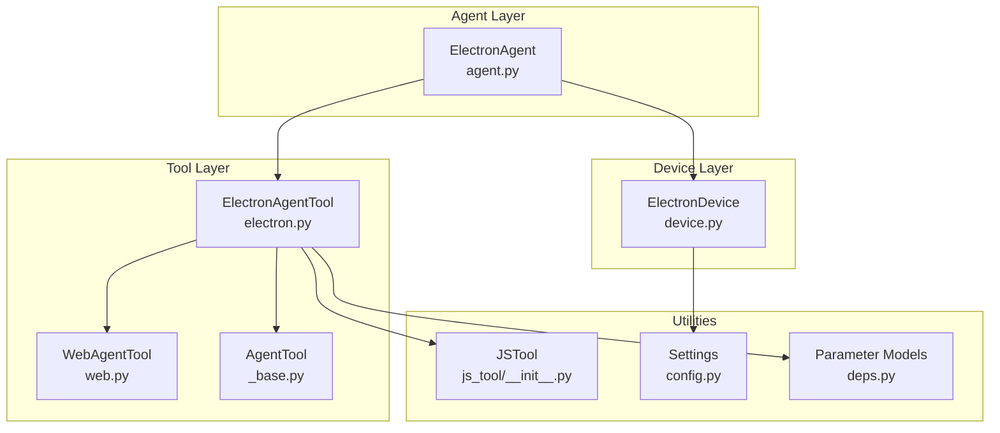
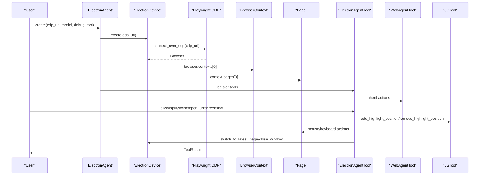
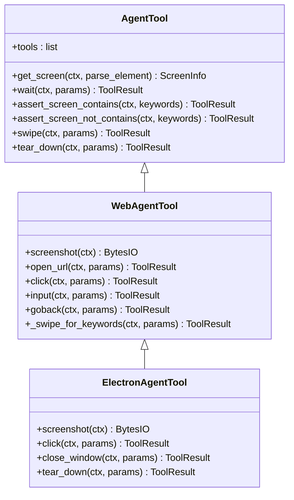
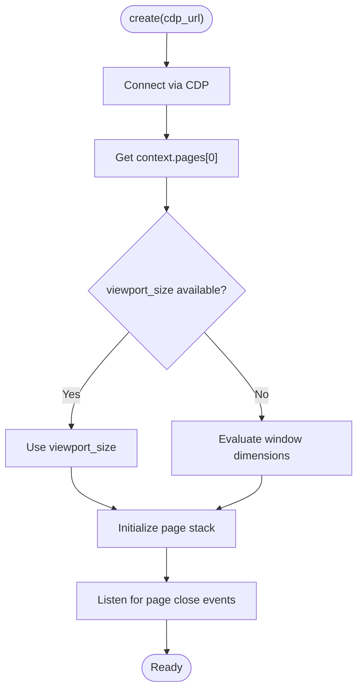
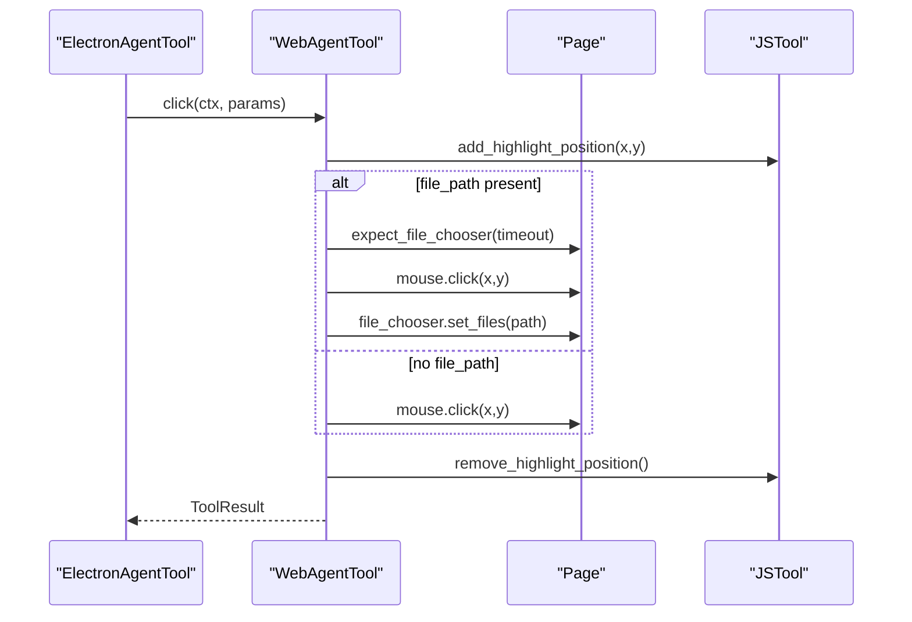
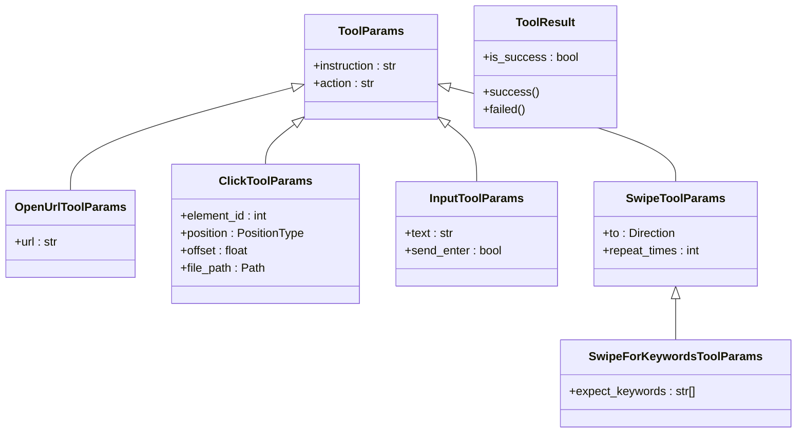
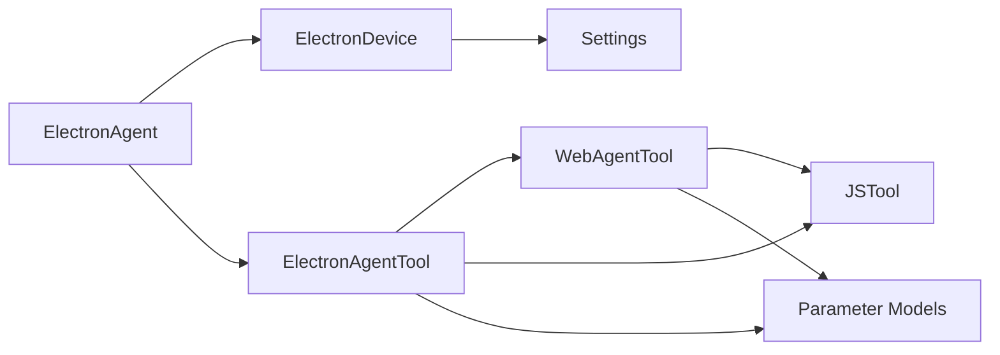

# Electron Agent Tool

<cite>
**Referenced Files in This Document**
- [electron.py](file://src/page_eyes/tools/electron.py)
- [web.py](file://src/page_eyes/tools/web.py)
- [_base.py](file://src/page_eyes/tools/_base.py)
- [device.py](file://src/page_eyes/device.py)
- [deps.py](file://src/page_eyes/deps.py)
- [agent.py](file://src/page_eyes/agent.py)
- [js_tool/__init__.py](file://src/page_eyes/util/js_tool/__init__.py)
- [js_tool/script.js](file://src/page_eyes/util/js_tool/script.js)
- [config.py](file://src/page_eyes/config.py)
- [feat-electron.md](file://docs/feat-electron.md)
- [test_electron_agent.py](file://tests/test_electron_agent.py)
- [README.md](file://README.md)
</cite>

## Table of Contents
1. [Introduction](#introduction)
2. [Project Structure](#project-structure)
3. [Core Components](#core-components)
4. [Architecture Overview](#architecture-overview)
5. [Detailed Component Analysis](#detailed-component-analysis)
6. [Dependency Analysis](#dependency-analysis)
7. [Performance Considerations](#performance-considerations)
8. [Troubleshooting Guide](#troubleshooting-guide)
9. [Conclusion](#conclusion)
10. [Appendices](#appendices)

## Introduction
This document provides detailed API documentation for the ElectronAgentTool implementation in PageEyes Agent. It focuses on Chrome DevTools Protocol (CDP) based desktop application automation, covering window management, DOM interaction, and native desktop features. The Electron implementation leverages Playwright’s CDP connectivity to attach to an already-running Electron process, enabling automation of Chromium-based desktop apps using the same tooling as web automation.

Key capabilities include:
- CDP connection establishment to an Electron process
- Target selection and page context management
- Window switching and closing
- DOM interaction via mouse clicks and keyboard input
- Screenshot capture and OmniParser-based element parsing
- Swipe gestures for scrolling and navigation
- Cleanup without terminating the external Electron process

## Project Structure
The Electron automation stack is composed of:
- Agent layer: ElectronAgent orchestrates the agent lifecycle and tool registration
- Device layer: ElectronDevice connects to an existing Electron process via CDP
- Tool layer: ElectronAgentTool inherits from WebAgentTool and reuses web automation primitives
- Shared utilities: JS highlighting helpers, parameter models, and configuration

**Diagram sources**
- [agent.py:480-515](file://src/page_eyes/agent.py#L480-L515)
- [device.py:230-292](file://src/page_eyes/device.py#L230-L292)
- [electron.py:21-134](file://src/page_eyes/tools/electron.py#L21-L134)
- [web.py:24-179](file://src/page_eyes/tools/web.py#L24-L179)
- [_base.py:130-391](file://src/page_eyes/tools/_base.py#L130-L391)
- [js_tool/__init__.py:22-52](file://src/page_eyes/util/js_tool/__init__.py#L22-L52)
- [config.py:54-73](file://src/page_eyes/config.py#L54-L73)
- [deps.py:75-280](file://src/page_eyes/deps.py#L75-L280)

**Section sources**
- [README.md:1-207](file://README.md#L1-L207)
- [feat-electron.md:1-99](file://docs/feat-electron.md#L1-L99)

## Core Components
- ElectronAgentTool: Inherits from WebAgentTool and adds Electron-specific cleanup behavior. It exposes the same tool interface as WebAgentTool for screenshots, clicks, input, swipe, open_url, and teardown.
- ElectronDevice: Connects to an Electron process via CDP, manages page contexts, and maintains a page stack for window switching and automatic fallback on close events.
- WebAgentTool: Provides shared web automation primitives (screenshot, click, input, swipe, open_url, goback) reused by ElectronAgentTool.
- AgentTool: Base class offering common tool orchestration, screen parsing, assertions, waits, and tool decorators.
- JSTool: Utility for adding/removing visual highlights during automation and detecting scrollbars.
- Parameter models: Typed Pydantic models define tool parameters for click, input, swipe, open_url, and others.

**Section sources**
- [electron.py:21-134](file://src/page_eyes/tools/electron.py#L21-L134)
- [device.py:230-292](file://src/page_eyes/device.py#L230-L292)
- [web.py:24-179](file://src/page_eyes/tools/web.py#L24-L179)
- [_base.py:130-391](file://src/page_eyes/tools/_base.py#L130-L391)
- [js_tool/__init__.py:22-52](file://src/page_eyes/util/js_tool/__init__.py#L22-L52)
- [deps.py:75-280](file://src/page_eyes/deps.py#L75-L280)

## Architecture Overview
The Electron automation architecture follows a layered design:
- ElectronAgent creates an ElectronDevice and registers ElectronAgentTool
- ElectronDevice establishes a CDP connection to an existing Electron process
- ElectronAgentTool reuses WebAgentTool’s actions and adds Electron-specific teardown
- JSTool assists with visual feedback and scroll detection
- Deps and models provide typed parameters and context for each step

**Diagram sources**
- [agent.py:480-515](file://src/page_eyes/agent.py#L480-L515)
- [device.py:243-292](file://src/page_eyes/device.py#L243-L292)
- [electron.py:21-134](file://src/page_eyes/tools/electron.py#L21-L134)
- [web.py:24-179](file://src/page_eyes/tools/web.py#L24-L179)
- [js_tool/__init__.py:22-52](file://src/page_eyes/util/js_tool/__init__.py#L22-L52)

## Detailed Component Analysis

### ElectronAgentTool API
ElectronAgentTool inherits all actions from WebAgentTool and overrides teardown to avoid closing the external Electron process.

- Method: screenshot(ctx)
  - Description: Captures a screenshot of the current active page after switching to the latest page if available.
  - Parameters: ctx (RunContext with AgentDeps[ElectronDevice, ElectronAgentTool])
  - Returns: BytesIO buffer containing PNG image
  - Notes: Uses CSS scaling to avoid DPI mismatch issues on Retina displays.

- Method: click(ctx, params)
  - Description: Performs a mouse click at a computed coordinate. Supports file upload via file chooser and auto-switches to newly opened windows.
  - Parameters:
    - ctx: RunContext
    - params: ClickToolParams with optional file_path for uploads
  - Returns: ToolResult
  - Behavior:
    - Highlights click position via JSTool
    - Handles file chooser if file_path is provided
    - Detects new windows and switches to the latest page
    - Cleans up highlight on success or logs warning on failure

- Method: close_window(ctx, params)
  - Description: Closes the current window if multiple windows exist; automatically falls back to the previous window.
  - Parameters: ctx, ToolParams
  - Returns: ToolResult
  - Behavior: Logs remaining windows count and triggers teardown refresh

- Method: tear_down(ctx, params)
  - Description: Cleans up highlights and captures a final screen without closing the browser context (preserving external Electron process).
  - Parameters: ctx, ToolParams
  - Returns: ToolResult

**Diagram sources**
- [_base.py:130-391](file://src/page_eyes/tools/_base.py#L130-L391)
- [web.py:24-179](file://src/page_eyes/tools/web.py#L24-L179)
- [electron.py:21-134](file://src/page_eyes/tools/electron.py#L21-L134)

**Section sources**
- [electron.py:24-134](file://src/page_eyes/tools/electron.py#L24-L134)
- [web.py:26-91](file://src/page_eyes/tools/web.py#L26-L91)
- [_base.py:167-203](file://src/page_eyes/tools/_base.py#L167-L203)

### ElectronDevice: CDP Connection and Page Management
- Creation: ElectronDevice.create(cdp_url) connects to an existing Electron process via Playwright’s CDP connector.
- Page context: Uses the first BrowserContext and Page as the primary target.
- Device size: Falls back to evaluating window dimensions if viewport_size is None.
- Page stack: Maintains a stack of pages and listens for page close events to automatically switch targets.
- Latest page switching: switch_to_latest_page updates device_size and logs new window details.

**Diagram sources**
- [device.py:243-292](file://src/page_eyes/device.py#L243-L292)

**Section sources**
- [device.py:230-292](file://src/page_eyes/device.py#L230-L292)

### WebAgentTool: DOM Interaction and Gestures
- Screenshot: Captures a page screenshot with optional CSS hiding of overlay elements.
- open_url: Navigates to a URL and waits until network idle.
- click: Computes coordinates, optionally handles file chooser, and manages new page transitions.
- input: Clicks to focus and types text, optionally presses Enter.
- swipe: Chooses between mouse drag or wheel scroll depending on scrollbar presence and device type.
- goback: Navigates back in history.

**Diagram sources**
- [web.py:54-78](file://src/page_eyes/tools/web.py#L54-L78)
- [js_tool/__init__.py:22-52](file://src/page_eyes/util/js_tool/__init__.py#L22-L52)

**Section sources**
- [web.py:26-179](file://src/page_eyes/tools/web.py#L26-L179)
- [js_tool/__init__.py:22-52](file://src/page_eyes/util/js_tool/__init__.py#L22-L52)

### Parameter Models and Tool Decorators
- ToolParams: Base for all tool parameters with action and instruction fields.
- OpenUrlToolParams: url field for open_url.
- ClickToolParams: element_id/coordinate-based positioning, optional position and offset, optional file_path for uploads.
- InputToolParams: text and send_enter flags.
- SwipeToolParams: direction and repeat_times.
- SwipeForKeywordsToolParams: adds expect_keywords for polling until elements appear.
- ToolResult and ToolResultWithOutput: standardized success/failure responses.

**Diagram sources**
- [deps.py:85-280](file://src/page_eyes/deps.py#L85-L280)

**Section sources**
- [deps.py:85-280](file://src/page_eyes/deps.py#L85-L280)

### Electron-Specific Features and Capabilities
- Menu interaction: Not explicitly exposed in ElectronAgentTool; leverage click on menu items identified via OmniParser.
- Dialog handling: File upload handled via expect_file_chooser; new window detection and switching managed automatically.
- Native OS integration: ElectronDevice does not expose OS-level APIs; rely on app-native controls rendered in Chromium.

**Section sources**
- [electron.py:64-88](file://src/page_eyes/tools/electron.py#L64-L88)
- [web.py:63-76](file://src/page_eyes/tools/web.py#L63-L76)

### Element Identification and DOM Interaction
- Coordinates: Computed from element bounding boxes or absolute coordinates depending on model type.
- Highlighting: JSTool adds temporary overlays for visual feedback during clicks and element selection.
- Scroll detection: JSTool checks for vertical/horizontal scrollbars to decide swipe strategy.

**Section sources**
- [deps.py:103-162](file://src/page_eyes/deps.py#L103-L162)
- [js_tool/__init__.py:22-52](file://src/page_eyes/util/js_tool/__init__.py#L22-L52)
- [js_tool/script.js:1-54](file://src/page_eyes/util/js_tool/script.js#L1-L54)

## Dependency Analysis
- ElectronAgent depends on ElectronDevice and ElectronAgentTool
- ElectronAgentTool depends on WebAgentTool and JSTool
- WebAgentTool depends on Playwright Page and JSTool
- ElectronDevice depends on Playwright CDP and manages page lifecycle
- Parameter models and AgentTool provide shared infrastructure

**Diagram sources**
- [agent.py:480-515](file://src/page_eyes/agent.py#L480-L515)
- [device.py:230-292](file://src/page_eyes/device.py#L230-L292)
- [electron.py:21-134](file://src/page_eyes/tools/electron.py#L21-L134)
- [web.py:24-179](file://src/page_eyes/tools/web.py#L24-L179)
- [js_tool/__init__.py:22-52](file://src/page_eyes/util/js_tool/__init__.py#L22-L52)
- [config.py:54-73](file://src/page_eyes/config.py#L54-L73)
- [deps.py:75-280](file://src/page_eyes/deps.py#L75-L280)

**Section sources**
- [agent.py:480-515](file://src/page_eyes/agent.py#L480-L515)
- [device.py:230-292](file://src/page_eyes/device.py#L230-L292)
- [electron.py:21-134](file://src/page_eyes/tools/electron.py#L21-L134)
- [web.py:24-179](file://src/page_eyes/tools/web.py#L24-L179)
- [js_tool/__init__.py:22-52](file://src/page_eyes/util/js_tool/__init__.py#L22-L52)
- [config.py:54-73](file://src/page_eyes/config.py#L54-L73)
- [deps.py:75-280](file://src/page_eyes/deps.py#L75-L280)

## Performance Considerations
- Screenshot resolution: Using CSS scaling avoids DPI mismatches and reduces click offset errors on Retina displays.
- Delayed actions: Tool decorators introduce small delays after actions to allow rendering stability.
- Scroll strategy: Automatic detection of scrollbars selects optimal swipe method (drag vs wheel).
- Page switching: Efficiently tracks page stack and updates device size on new windows.

[No sources needed since this section provides general guidance]

## Troubleshooting Guide
Common issues and resolutions:
- CDP connection failures
  - Verify the Electron app was launched with --remote-debugging-port and the port is reachable.
  - Confirm http://127.0.0.1:9222/json returns a page list.
  - Check firewall and localhost binding.

- Window focus issues
  - Use switch_to_latest_page before taking screenshots or clicking to ensure the active window is targeted.
  - On close_window, the page stack automatically falls back to the previous window.

- Native application crashes
  - Since ElectronDevice does not close the browser context, crashes are not automatically mitigated by the agent.
  - Restart the Electron app and reconnect via CDP.

- Timeout errors during click/input
  - Increase timeouts or retry with wait_for actions.
  - Ensure elements are visible and not obscured by overlays.

**Section sources**
- [device.py:243-292](file://src/page_eyes/device.py#L243-L292)
- [electron.py:64-88](file://src/page_eyes/tools/electron.py#L64-L88)
- [web.py:62-76](file://src/page_eyes/tools/web.py#L62-L76)

## Conclusion
The ElectronAgentTool integrates seamlessly with the PageEyes Agent ecosystem by leveraging Playwright’s CDP connectivity to automate Electron applications. It reuses proven web automation primitives while adding Electron-specific window management and safe teardown behavior. With robust parameter models, visual feedback utilities, and structured error handling, it enables reliable desktop automation across diverse Electron-based applications.

[No sources needed since this section summarizes without analyzing specific files]

## Appendices

### API Reference Summary
- ElectronAgentTool.screenshot(ctx): Capture active page screenshot
- ElectronAgentTool.click(ctx, params): Click at computed coordinates; optional file upload
- ElectronAgentTool.close_window(ctx, params): Close current window; fallback to previous
- ElectronAgentTool.tear_down(ctx, params): Cleanup without closing browser
- WebAgentTool.open_url(ctx, params): Navigate to URL
- WebAgentTool.input(ctx, params): Type text and optional Enter
- WebAgentTool.swipe(ctx, params): Scroll gestures with keyword polling
- WebAgentTool.goback(ctx, params): Navigate back in history

**Section sources**
- [electron.py:24-134](file://src/page_eyes/tools/electron.py#L24-L134)
- [web.py:46-179](file://src/page_eyes/tools/web.py#L46-L179)

### Example Automation Tasks
- Desktop app testing: Launch Electron app with remote debugging enabled, then use click/input/swipe to navigate and validate UI.
- UI verification: Use assert_screen_contains/assert_screen_not_contains to verify keywords appear/disappear after actions.
- Cross-platform desktop automation: Combine with other agents (Web, Android, iOS) for unified automation strategy.

**Section sources**
- [test_electron_agent.py:8-20](file://tests/test_electron_agent.py#L8-L20)
- [feat-electron.md:68-86](file://docs/feat-electron.md#L68-L86)