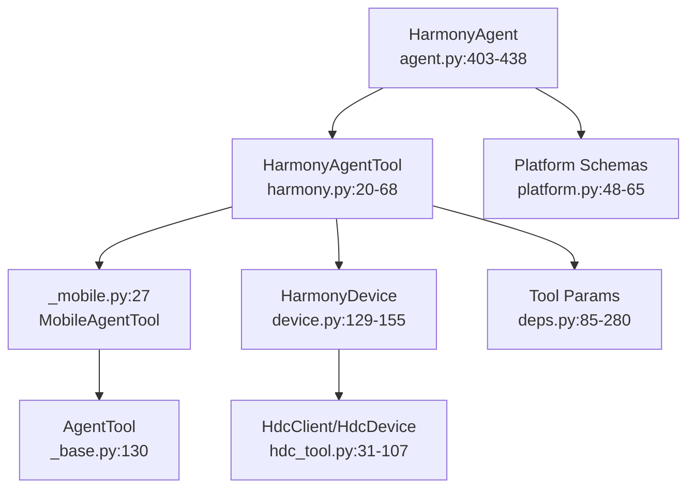
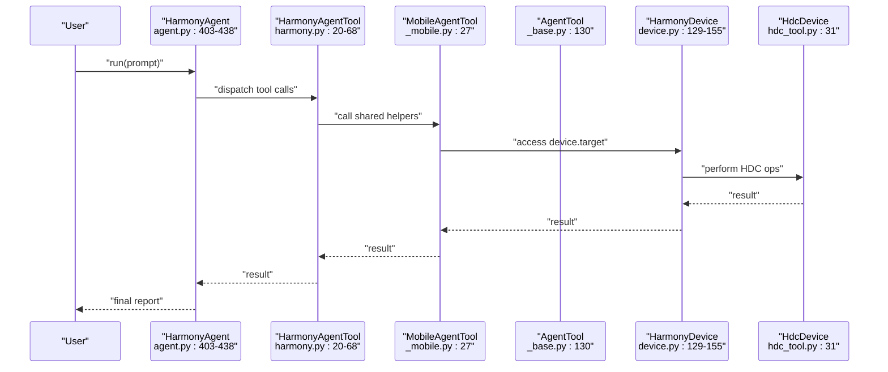
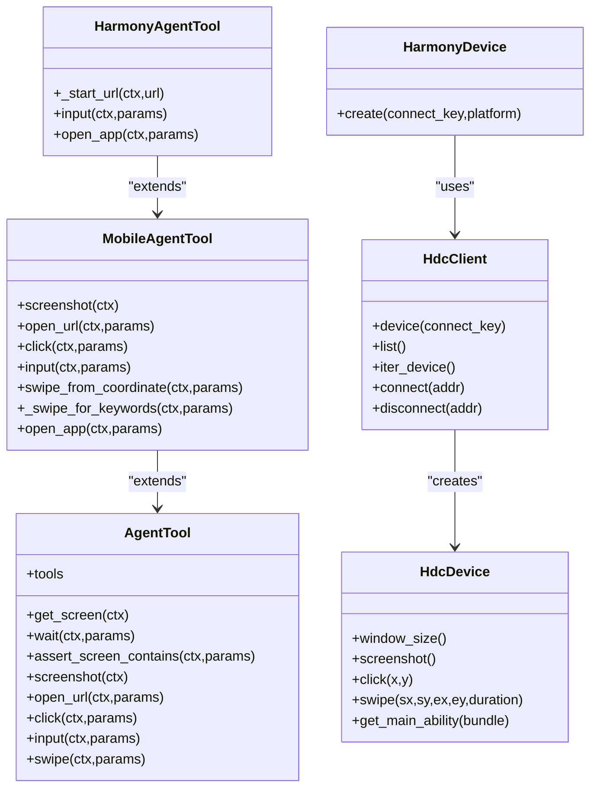

# HarmonyOS Agent Tool

<cite>
**Referenced Files in This Document**
- [harmony.py](file://src/page_eyes/tools/harmony.py)
- [hdc_tool.py](file://src/page_eyes/util/hdc_tool.py)
- [device.py](file://src/page_eyes/device.py)
- [_base.py](file://src/page_eyes/tools/_base.py)
- [_mobile.py](file://src/page_eyes/tools/_mobile.py)
- [deps.py](file://src/page_eyes/deps.py)
- [platform.py](file://src/page_eyes/util/platform.py)
- [agent.py](file://src/page_eyes/agent.py)
- [demo.md](file://docs/getting-started/demo.md)
- [test_harmony_agent.py](file://tests/test_harmony_agent.py)
</cite>

## Table of Contents
1. [Introduction](#introduction)
2. [Project Structure](#project-structure)
3. [Core Components](#core-components)
4. [Architecture Overview](#architecture-overview)
5. [Detailed Component Analysis](#detailed-component-analysis)
6. [Dependency Analysis](#dependency-analysis)
7. [Performance Considerations](#performance-considerations)
8. [Troubleshooting Guide](#troubleshooting-guide)
9. [Conclusion](#conclusion)
10. [Appendices](#appendices)

## Introduction
This document provides comprehensive API documentation for the HarmonyOS Agent Tool integrated in PageEyes Agent. It focuses on HDC-based HarmonyOS device automation, covering touch gestures, text input, app launching, and screen interaction. It also documents device connection management via HDC commands, device state monitoring, HarmonyOS emulator support, element identification using accessibility attributes and coordinates, HarmonyOS-specific gesture semantics, navigation patterns, UI interaction methods, error handling, and best practices for cross-device compatibility.

## Project Structure
The HarmonyOS automation capability is implemented as a specialized tool layered on top of shared abstractions:
- Agent orchestration and tool registration live in the agent module.
- The HarmonyOS tool extends the mobile tool base and integrates with HDC utilities.
- Device abstraction encapsulates platform-specific clients and operations.
- Shared parameter models define tool inputs and outputs consistently across platforms.

**Diagram sources**
- [agent.py:403-438](file://src/page_eyes/agent.py#L403-L438)
- [harmony.py:20-68](file://src/page_eyes/tools/harmony.py#L20-L68)
- [_mobile.py:27-165](file://src/page_eyes/tools/_mobile.py#L27-L165)
- [_base.py:130-391](file://src/page_eyes/tools/_base.py#L130-L391)
- [device.py:129-155](file://src/page_eyes/device.py#L129-L155)
- [hdc_tool.py:31-107](file://src/page_eyes/util/hdc_tool.py#L31-L107)
- [deps.py:85-280](file://src/page_eyes/deps.py#L85-L280)
- [platform.py:48-65](file://src/page_eyes/util/platform.py#L48-L65)

**Section sources**
- [agent.py:403-438](file://src/page_eyes/agent.py#L403-L438)
- [harmony.py:20-68](file://src/page_eyes/tools/harmony.py#L20-L68)
- [_mobile.py:27-165](file://src/page_eyes/tools/_mobile.py#L27-L165)
- [_base.py:130-391](file://src/page_eyes/tools/_base.py#L130-L391)
- [device.py:129-155](file://src/page_eyes/device.py#L129-L155)
- [hdc_tool.py:31-107](file://src/page_eyes/util/hdc_tool.py#L31-L107)
- [deps.py:85-280](file://src/page_eyes/deps.py#L85-L280)
- [platform.py:48-65](file://src/page_eyes/util/platform.py#L48-L65)

## Core Components
- HarmonyAgentTool: Implements HarmonyOS-specific tooling extending MobileAgentTool, including input, open_app, and URL opening via Harmony-specific commands.
- HdcDevice/HdcClient: Encapsulate HDC operations for window size detection, screenshots, clicks, swipes, and bundle/main ability discovery.
- HarmonyDevice: Device abstraction for HarmonyOS using HDC client and device.
- AgentTool/MobileAgentTool: Shared tooling base providing screen parsing, swipe helpers, click/input, and screen capture.
- Tool Params: Unified parameter models for click, input, swipe, open_url, and related operations.

Key API surface for HarmonyOS:
- click(ctx, params): Performs a tap at a resolved coordinate.
- input(ctx, params): Focuses an element and injects text; optionally sends ENTER.
- open_url(ctx, params): Opens a URL via HarmonyOS-specific schema routing.
- screenshot(ctx): Captures current screen as an image buffer.
- swipe(ctx, params): Scrolls in a direction with optional keyword expectation.

**Section sources**
- [harmony.py:20-68](file://src/page_eyes/tools/harmony.py#L20-L68)
- [hdc_tool.py:44-77](file://src/page_eyes/util/hdc_tool.py#L44-L77)
- [device.py:129-155](file://src/page_eyes/device.py#L129-L155)
- [_base.py:167-391](file://src/page_eyes/tools/_base.py#L167-L391)
- [_mobile.py:49-165](file://src/page_eyes/tools/_mobile.py#L49-L165)
- [deps.py:165-280](file://src/page_eyes/deps.py#L165-L280)

## Architecture Overview
The HarmonyOS automation pipeline connects an orchestration agent to a platform-specific tool, which delegates to shared abstractions and HDC utilities.

**Diagram sources**
- [agent.py:403-438](file://src/page_eyes/agent.py#L403-L438)
- [harmony.py:20-68](file://src/page_eyes/tools/harmony.py#L20-L68)
- [_mobile.py:27-165](file://src/page_eyes/tools/_mobile.py#L27-L165)
- [_base.py:130-391](file://src/page_eyes/tools/_base.py#L130-L391)
- [device.py:129-155](file://src/page_eyes/device.py#L129-L155)
- [hdc_tool.py:31-107](file://src/page_eyes/util/hdc_tool.py#L31-L107)

## Detailed Component Analysis

### HarmonyAgentTool API
HarmonyAgentTool extends MobileAgentTool and adds HarmonyOS-specific behaviors:
- URL opening uses a Harmony-aware schema resolver.
- Input supports ENTER key injection after text input.
- App opening resolves the main ability for a bundle and starts it.

Method signatures and HarmonyOS-specific parameters:
- click(ctx, ClickToolParams)
  - Positional parameters: element_id or coordinate-based bounding box; optional relative position and offset.
  - Resolves absolute screen coordinates and performs a tap.
- input(ctx, InputToolParams)
  - text: string to input.
  - send_enter: boolean to emit ENTER after input.
  - Coordinates resolved via shared location helpers.
- open_url(ctx, OpenUrlToolParams)
  - url: string URL to open.
  - Uses platform-aware schema generation to route via HarmonyOS handlers.
- screenshot(ctx)
  - Captures current screen and returns a BytesIO buffer.
- swipe(ctx, SwipeForKeywordsToolParams)
  - to: direction ('top' | 'bottom' | 'left' | 'right').
  - repeat_times: number of attempts.
  - expect_keywords: list of strings to await after each swipe.

HarmonyOS-specific behaviors:
- Uses aa shell command to start URLs with Harmony-specific intent flags.
- Uses uitest input_text and keyevent for text input.
- Uses snapshot_display and uitest for screenshots and gestures.

**Section sources**
- [harmony.py:20-68](file://src/page_eyes/tools/harmony.py#L20-L68)
- [_mobile.py:49-165](file://src/page_eyes/tools/_mobile.py#L49-L165)
- [deps.py:165-280](file://src/page_eyes/deps.py#L165-L280)

### HDC Device Operations
HdcDevice provides HarmonyOS-specific operations:
- window_size(): Parses render or physical resolution from hidumper output.
- screenshot(display_id): Captures a JPEG via snapshot_display and retrieves it locally.
- click(x, y): Performs a tap gesture via uitest.
- swipe(sx, sy, ex, ey, duration): Performs a swipe with a velocity derived from duration.
- get_main_ability(bundle_name): Extracts main ability from bundle dump.

HdcClient provides:
- device(connect_key): Creates an HdcDevice instance.
- list(): Lists targets with state and type.
- iter_device(): Iterates only connected devices.
- connect(addr): Establishes a connection.
- disconnect(addr): Removes a connection.

Error handling:
- Raises HdcError when operations fail (e.g., snapshot_display failure, uitest failures).

**Section sources**
- [hdc_tool.py:15-107](file://src/page_eyes/util/hdc_tool.py#L15-L107)

### Device Abstraction and Connection Management
HarmonyDevice:
- Factory method creates HdcClient and selects/connects a device by connect_key or defaults to first connected device.
- Retrieves window_size via HdcDevice and sets device_size.

Connection lifecycle:
- Connects via HdcClient.connect if needed.
- Filters devices by state "Connected" during iteration.

**Section sources**
- [device.py:129-155](file://src/page_eyes/device.py#L129-L155)

### Element Identification and Coordinate Resolution
Shared location helpers:
- LLMLocationToolParams/VLMLocationToolParams compute normalized coordinates from element bounding boxes or raw coordinates.
- get_coordinate() converts normalized positions to absolute pixel coordinates based on device size.

Swipe helpers:
- MobileAgentTool._swipe_for_keywords() computes directional swipe endpoints and optionally waits for expected keywords.

**Section sources**
- [deps.py:103-162](file://src/page_eyes/deps.py#L103-L162)
- [_mobile.py:86-117](file://src/page_eyes/tools/_mobile.py#L86-L117)

### URL Schema Routing for HarmonyOS
Open URL uses platform-aware schema generation:
- get_client_url_schema(url, platform) produces Harmony-compatible URL schemes for supported platforms.

**Section sources**
- [platform.py:48-65](file://src/page_eyes/util/platform.py#L48-L65)
- [_mobile.py:50-60](file://src/page_eyes/tools/_mobile.py#L50-L60)
- [harmony.py:22-24](file://src/page_eyes/tools/harmony.py#L22-L24)

### Example Workflows and Best Practices
Common scenarios validated by tests:
- Launch apps by name and navigate through UI.
- Open URLs and interact with overlays.
- Scroll and search for elements by text.

Best practices:
- Use wait and assert helpers to stabilize UI after gestures.
- Prefer element-based coordinates for robustness across resolutions.
- Use repeat_attempts in swipe operations to handle dynamic content loading.

**Section sources**
- [test_harmony_agent.py:11-48](file://tests/test_harmony_agent.py#L11-L48)
- [_base.py:237-321](file://src/page_eyes/tools/_base.py#L237-L321)
- [_mobile.py:86-117](file://src/page_eyes/tools/_mobile.py#L86-L117)

## Dependency Analysis

**Diagram sources**
- [_base.py:130-391](file://src/page_eyes/tools/_base.py#L130-L391)
- [_mobile.py:27-165](file://src/page_eyes/tools/_mobile.py#L27-L165)
- [harmony.py:20-68](file://src/page_eyes/tools/harmony.py#L20-L68)
- [device.py:129-155](file://src/page_eyes/device.py#L129-L155)
- [hdc_tool.py:31-107](file://src/page_eyes/util/hdc_tool.py#L31-L107)

**Section sources**
- [_base.py:130-391](file://src/page_eyes/tools/_base.py#L130-L391)
- [_mobile.py:27-165](file://src/page_eyes/tools/_mobile.py#L27-L165)
- [harmony.py:20-68](file://src/page_eyes/tools/harmony.py#L20-L68)
- [device.py:129-155](file://src/page_eyes/device.py#L129-L155)
- [hdc_tool.py:31-107](file://src/page_eyes/util/hdc_tool.py#L31-L107)

## Performance Considerations
- Gesture timing: swipe velocity is derived from duration; adjust duration to balance speed and reliability.
- Post-operation stabilization: use wait and assert helpers to allow UI to settle after gestures.
- Screen parsing: avoid frequent OCR parsing; batch operations and rely on element presence checks.
- Connection stability: ensure HDC connections remain "Connected" and reconnect if needed.

## Troubleshooting Guide
Common issues and remedies:
- Device connectivity failures
  - Verify HDC target state is "Connected".
  - Reconnect using HdcClient.connect and confirm output indicates success.
- Snapshot or gesture failures
  - HdcError is raised on snapshot_display or uitest failures; inspect returned error messages.
- App launch failures
  - Confirm bundle exists and main ability is resolvable; fallback to EntryAbility if absent.
- URL opening not working
  - Ensure platform-aware schema is generated; validate HarmonyOS intent handling.

Operational references:
- Device connection and state filtering: [device.py:129-155](file://src/page_eyes/device.py#L129-L155), [hdc_tool.py:77-107](file://src/page_eyes/util/hdc_tool.py#L77-L107)
- Screenshot and gesture error handling: [hdc_tool.py:44-77](file://src/page_eyes/util/hdc_tool.py#L44-L77)
- App main ability resolution: [hdc_tool.py:69-74](file://src/page_eyes/util/hdc_tool.py#L69-L74)
- URL schema generation: [platform.py:48-65](file://src/page_eyes/util/platform.py#L48-L65)

**Section sources**
- [device.py:129-155](file://src/page_eyes/device.py#L129-L155)
- [hdc_tool.py:44-77](file://src/page_eyes/util/hdc_tool.py#L44-L77)
- [hdc_tool.py:69-74](file://src/page_eyes/util/hdc_tool.py#L69-L74)
- [platform.py:48-65](file://src/page_eyes/util/platform.py#L48-L65)

## Conclusion
The HarmonyOS Agent Tool integrates HDC-based operations into a unified automation framework. It leverages shared abstractions for screen parsing, gestures, and element identification while providing HarmonyOS-specific behaviors for URL handling, text input, and app launching. Robust error handling and connection management enable reliable automation across real devices and emulators.

## Appendices

### API Reference Summary

- click(ctx, ClickToolParams)
  - Description: Tap at an element or coordinate.
  - Parameters: element_id or coordinate-based bounding box; optional position and offset.
  - HarmonyOS specifics: Uses uitest click via HdcDevice.

- input(ctx, InputToolParams)
  - Description: Inject text into a focused element; optionally send ENTER.
  - Parameters: text, send_enter.
  - HarmonyOS specifics: Uses uitest input_text and keyevent.

- open_url(ctx, OpenUrlToolParams)
  - Description: Open a URL using HarmonyOS-compatible schema.
  - Parameters: url.
  - HarmonyOS specifics: Resolved via platform-aware schema generator.

- screenshot(ctx)
  - Description: Capture current screen.
  - HarmonyOS specifics: Uses snapshot_display and retrieves image.

- swipe(ctx, SwipeForKeywordsToolParams)
  - Description: Swipe in a direction with optional keyword expectation.
  - Parameters: to, repeat_times, expect_keywords.
  - HarmonyOS specifics: Uses uitest swipe with velocity derived from duration.

**Section sources**
- [_mobile.py:63-84](file://src/page_eyes/tools/_mobile.py#L63-L84)
- [_mobile.py:119-137](file://src/page_eyes/tools/_mobile.py#L119-L137)
- [_base.py:362-385](file://src/page_eyes/tools/_base.py#L362-L385)
- [harmony.py:26-37](file://src/page_eyes/tools/harmony.py#L26-L37)
- [hdc_tool.py:44-77](file://src/page_eyes/util/hdc_tool.py#L44-L77)

### Usage Examples
- Creating a Harmony agent and running tasks:
  - See [demo.md:31-56](file://docs/getting-started/demo.md#L31-L56) for a runnable example.
- Test-driven scenarios:
  - App switching and URL navigation: [test_harmony_agent.py:11-20](file://tests/test_harmony_agent.py#L11-L20)
  - Overlay handling and search: [test_harmony_agent.py:23-34](file://tests/test_harmony_agent.py#L23-L34)
  - Deep navigation and playback: [test_harmony_agent.py:37-48](file://tests/test_harmony_agent.py#L37-L48)

**Section sources**
- [demo.md:31-56](file://docs/getting-started/demo.md#L31-L56)
- [test_harmony_agent.py:11-48](file://tests/test_harmony_agent.py#L11-L48)