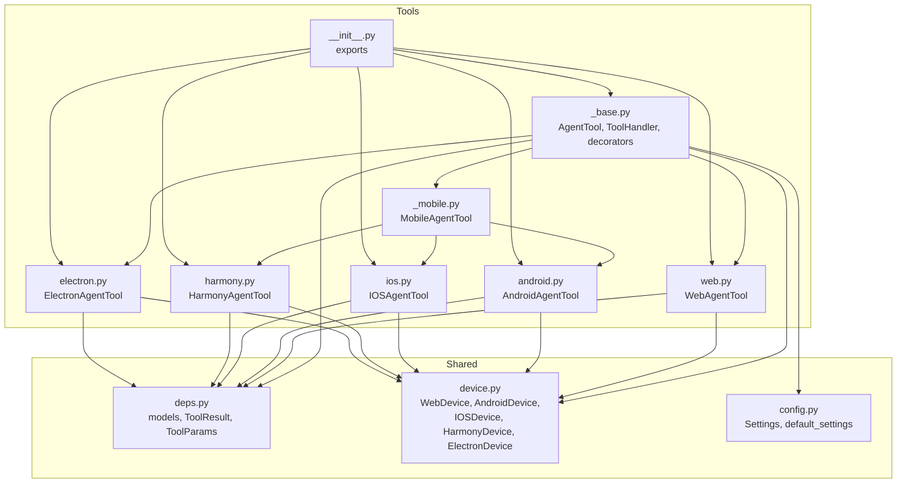
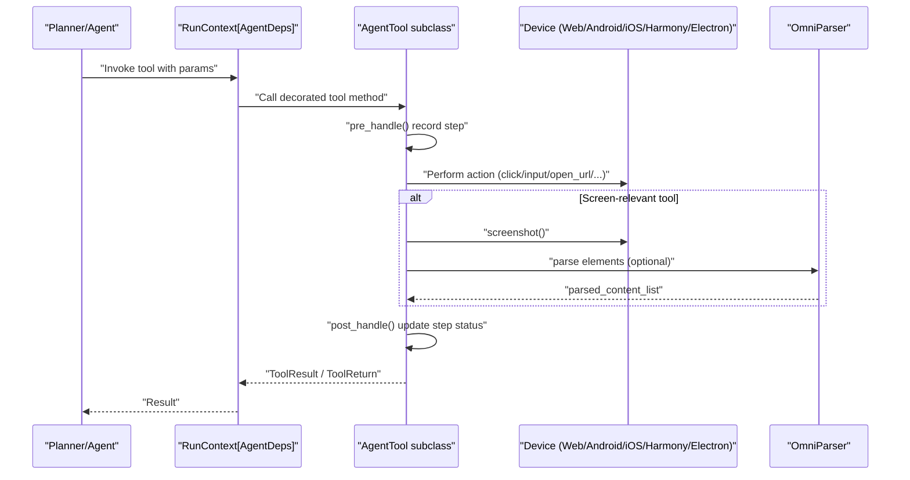
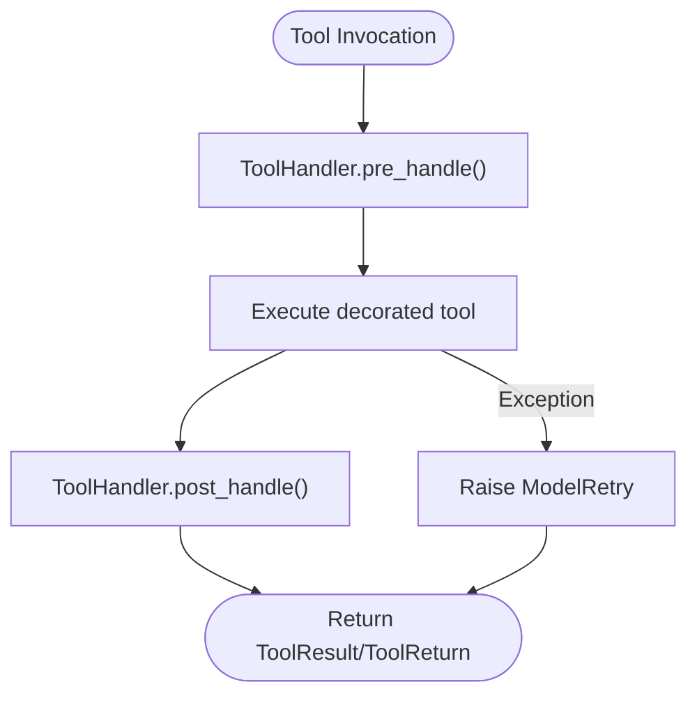
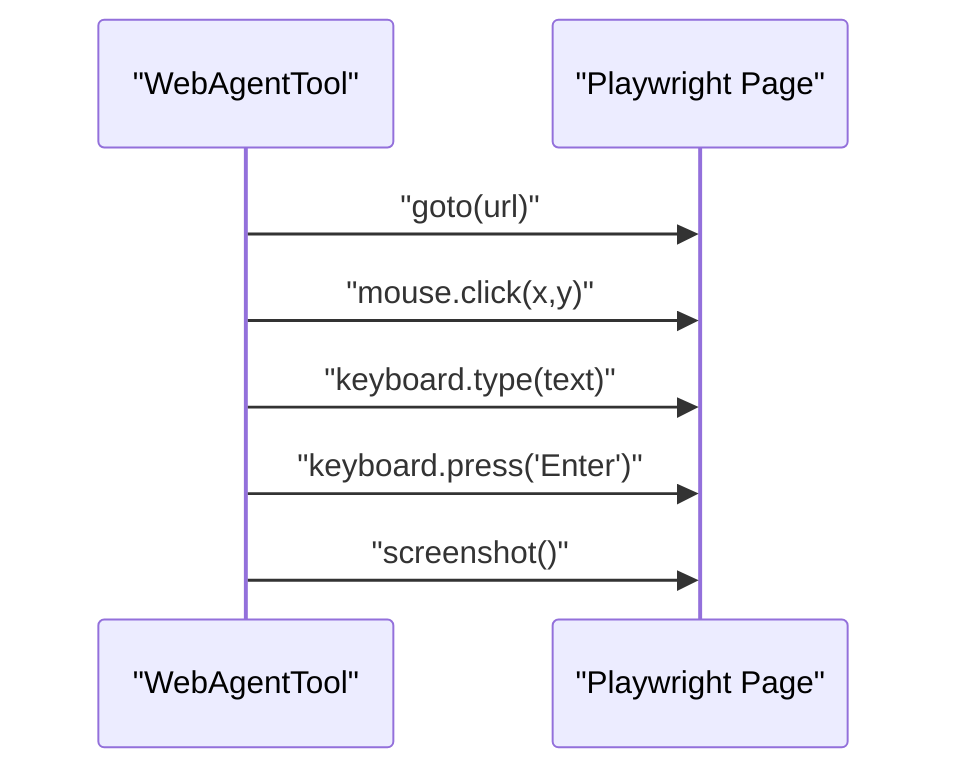
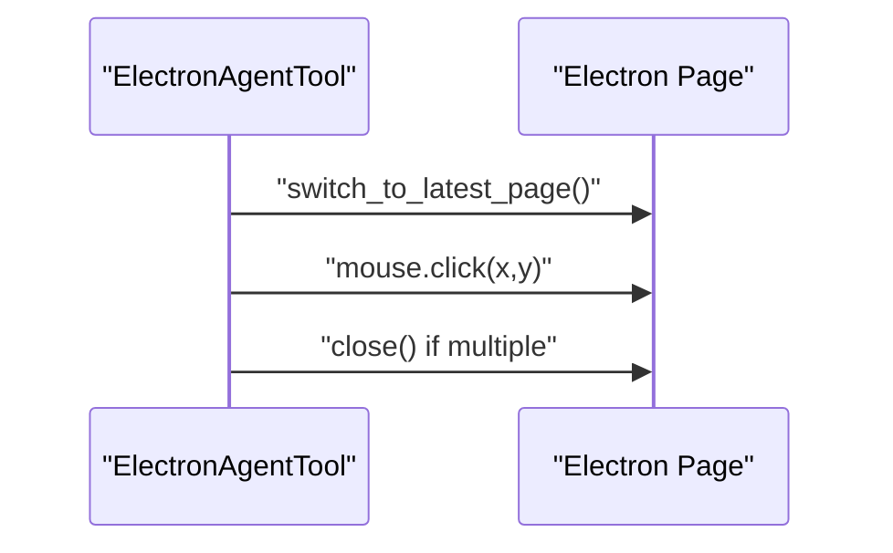
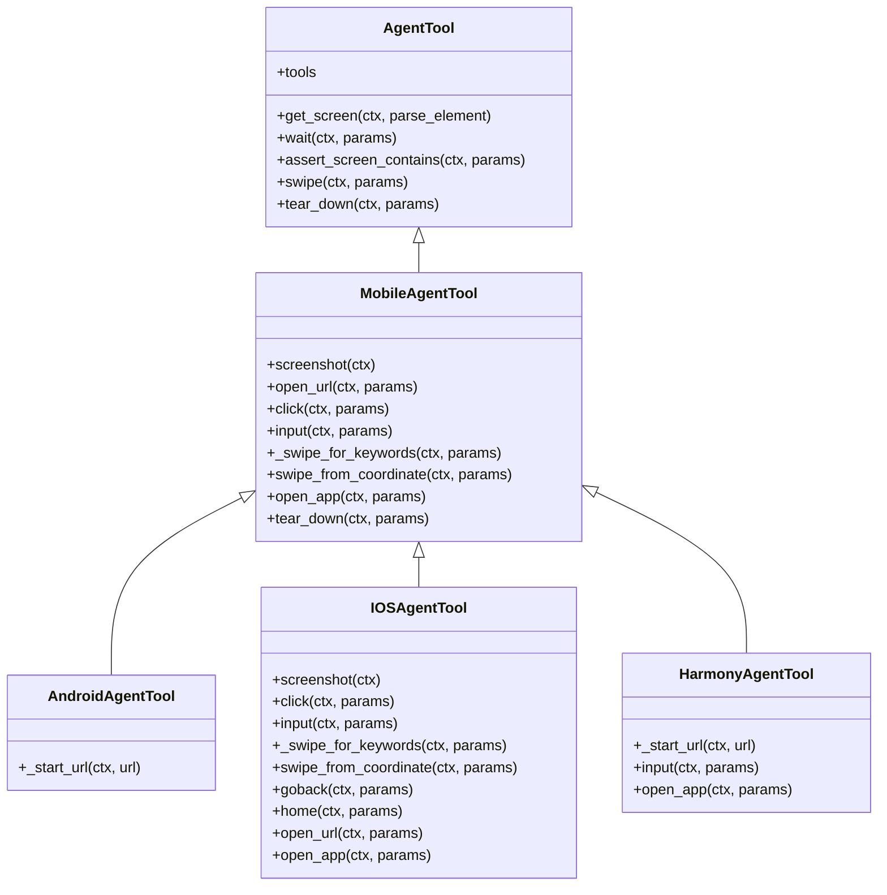
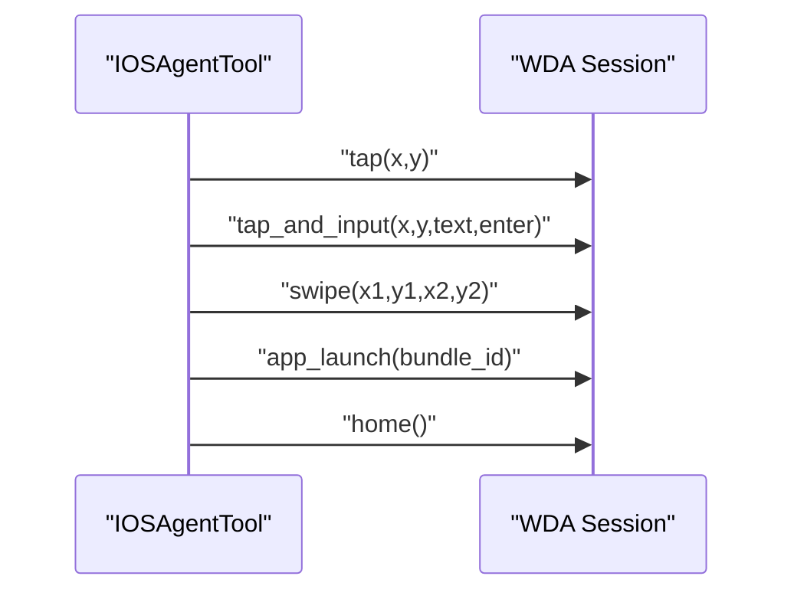
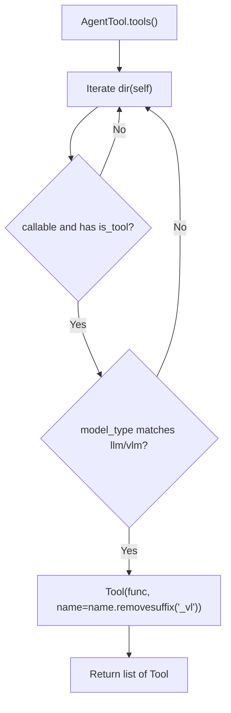
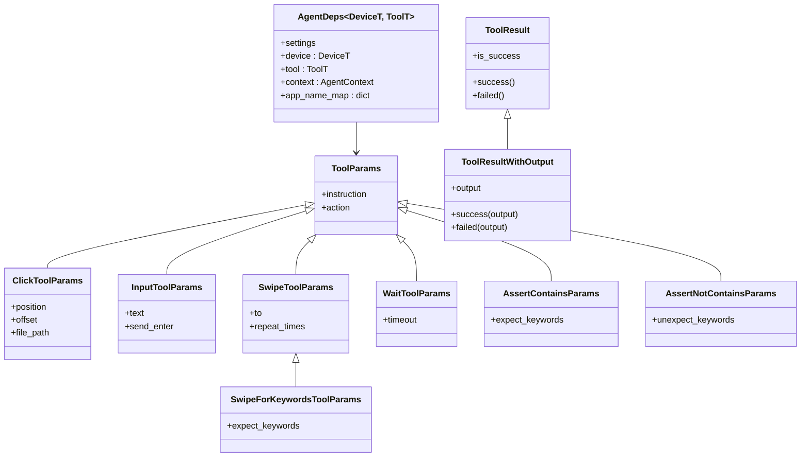

# Tool Framework

<cite>
**Referenced Files in This Document**
- [src/page_eyes/tools/_base.py](file://src/page_eyes/tools/_base.py)
- [src/page_eyes/tools/web.py](file://src/page_eyes/tools/web.py)
- [src/page_eyes/tools/android.py](file://src/page_eyes/tools/android.py)
- [src/page_eyes/tools/ios.py](file://src/page_eyes/tools/ios.py)
- [src/page_eyes/tools/harmony.py](file://src/page_eyes/tools/harmony.py)
- [src/page_eyes/tools/electron.py](file://src/page_eyes/tools/electron.py)
- [src/page_eyes/tools/_mobile.py](file://src/page_eyes/tools/_mobile.py)
- [src/page_eyes/tools/__init__.py](file://src/page_eyes/tools/__init__.py)
- [src/page_eyes/deps.py](file://src/page_eyes/deps.py)
- [src/page_eyes/device.py](file://src/page_eyes/device.py)
- [src/page_eyes/config.py](file://src/page_eyes/config.py)
- [tests/test_web_agent.py](file://tests/test_web_agent.py)
- [tests/test_android_agent.py](file://tests/test_android_agent.py)
- [tests/test_ios_agent.py](file://tests/test_ios_agent.py)
</cite>

## Table of Contents
1. [Introduction](#introduction)
2. [Project Structure](#project-structure)
3. [Core Components](#core-components)
4. [Architecture Overview](#architecture-overview)
5. [Detailed Component Analysis](#detailed-component-analysis)
6. [Dependency Analysis](#dependency-analysis)
7. [Performance Considerations](#performance-considerations)
8. [Troubleshooting Guide](#troubleshooting-guide)
9. [Conclusion](#conclusion)
10. [Appendices](#appendices)

## Introduction
This document describes the Tool framework used by PageEyes Agent to orchestrate cross-platform UI automation tasks. It covers the base AgentTool abstraction, common tool interfaces, and platform-specific implementations for Web, Android, iOS, HarmonyOS, and Electron. It documents method signatures, parameter validation, result processing, error handling, tool registration, capability detection, dynamic loading, platform-specific capabilities, input/output formats, integration patterns, lifecycle management, and performance optimization strategies.

## Project Structure
The Tool framework resides under src/page_eyes/tools and is composed of:
- A base tool abstraction and shared utilities
- Platform-specific tool implementations
- Shared parameter and result models
- Device abstractions for runtime environments
- Configuration for model type, parser service, and storage

**Diagram sources**
- [src/page_eyes/tools/_base.py:130-391](file://src/page_eyes/tools/_base.py#L130-L391)
- [src/page_eyes/tools/_mobile.py:27-165](file://src/page_eyes/tools/_mobile.py#L27-L165)
- [src/page_eyes/tools/web.py:24-179](file://src/page_eyes/tools/web.py#L24-L179)
- [src/page_eyes/tools/android.py:18-23](file://src/page_eyes/tools/android.py#L18-L23)
- [src/page_eyes/tools/ios.py:24-293](file://src/page_eyes/tools/ios.py#L24-L293)
- [src/page_eyes/tools/harmony.py:20-68](file://src/page_eyes/tools/harmony.py#L20-L68)
- [src/page_eyes/tools/electron.py:21-134](file://src/page_eyes/tools/electron.py#L21-L134)
- [src/page_eyes/tools/__init__.py:6-22](file://src/page_eyes/tools/__init__.py#L6-L22)
- [src/page_eyes/deps.py:25-280](file://src/page_eyes/deps.py#L25-L280)
- [src/page_eyes/device.py:35-390](file://src/page_eyes/device.py#L35-L390)
- [src/page_eyes/config.py:47-73](file://src/page_eyes/config.py#L47-L73)

**Section sources**
- [src/page_eyes/tools/__init__.py:6-22](file://src/page_eyes/tools/__init__.py#L6-L22)
- [src/page_eyes/tools/_base.py:130-391](file://src/page_eyes/tools/_base.py#L130-L391)
- [src/page_eyes/deps.py:25-280](file://src/page_eyes/deps.py#L25-L280)
- [src/page_eyes/device.py:35-390](file://src/page_eyes/device.py#L35-L390)
- [src/page_eyes/config.py:47-73](file://src/page_eyes/config.py#L47-L73)

## Core Components
- AgentTool: Abstract base class exposing the tool registry and common operations (screen capture, wait/assert, swipe, navigation helpers). It defines abstract methods for platform-specific actions and teardown.
- ToolHandler: Decorator and handler for pre/post tool execution, step metadata recording, and error propagation via retries.
- Tool decorators: tool decorator adds delays, records steps, and converts exceptions into retryable failures.
- Shared models: ToolParams, ToolResult, ToolResultWithOutput, ScreenInfo, StepInfo, and parameter variants for clicks, inputs, swipes, waits, and assertions.

Key responsibilities:
- Tool discovery: tools property enumerates callable decorated methods and registers them as pydantic_ai Tools.
- Screen capture and parsing: get_screen and get_screen_vl produce ScreenInfo with labeled images and parsed elements.
- Assertion and waiting: expect_screen_contains/not_contains, assert_screen_contains/not_contains, wait/wait_vl.
- Navigation: goback/home (platform-specific), swipe/swipe_vl, swipe_from_coordinate.
- Teardown: platform-specific cleanup.

**Section sources**
- [src/page_eyes/tools/_base.py:88-127](file://src/page_eyes/tools/_base.py#L88-L127)
- [src/page_eyes/tools/_base.py:130-391](file://src/page_eyes/tools/_base.py#L130-L391)
- [src/page_eyes/deps.py:25-280](file://src/page_eyes/deps.py#L25-L280)

## Architecture Overview
The Tool framework integrates with pydantic_ai’s RunContext to bind a typed AgentDeps carrying device, tool, settings, and context. Tools are registered dynamically and invoked by the planner/agent runtime.

**Diagram sources**
- [src/page_eyes/tools/_base.py:63-127](file://src/page_eyes/tools/_base.py#L63-L127)
- [src/page_eyes/tools/_base.py:167-202](file://src/page_eyes/tools/_base.py#L167-L202)
- [src/page_eyes/deps.py:75-83](file://src/page_eyes/deps.py#L75-L83)
- [src/page_eyes/device.py:54-100](file://src/page_eyes/device.py#L54-L100)

## Detailed Component Analysis

### Base Tool Abstraction: AgentTool
- Tool registry: tools property scans instance members, filters callable decorated methods, respects llm/vlm flags, and registers them as pydantic_ai Tool instances with normalized names.
- Screen capture: get_screen captures a screenshot, optionally parses elements via OmniParser, uploads image, and records parsed elements in context.
- Assertions and waits: assert_screen_contains/not_contains, expect_screen_contains/not_contains, wait/wait_vl.
- Swipe: swipe/swipe_vl delegate to _swipe_for_keywords with configurable repeat and expectation checks.
- Teardown: abstract method to be implemented per platform.

Common abstract methods to implement per platform:
- screenshot(ctx): returns BytesIO image buffer
- open_url(ctx, params): opens a URL
- click(ctx, params): clicks an element or coordinate
- input(ctx, params): inputs text into an element
- _swipe_for_keywords(ctx, params): scrolls/zooms until keywords appear or repeats exhausted
- tear_down(ctx, params): cleanup resources

Optional convenience:
- get_screen_vl for pure-VLM mode returning ToolReturn with ImageUrl content.

**Section sources**
- [src/page_eyes/tools/_base.py:130-151](file://src/page_eyes/tools/_base.py#L130-L151)
- [src/page_eyes/tools/_base.py:167-202](file://src/page_eyes/tools/_base.py#L167-L202)
- [src/page_eyes/tools/_base.py:236-391](file://src/page_eyes/tools/_base.py#L236-L391)

### Tool Handler and Decorators
- ToolHandler: extracts RunContext and ToolParams from invocation args, records step params/action, guards against concurrent tool calls, highlights elements/positions in debug mode, and updates step success.
- tool decorator: injects pre/post hooks, optional delays, and converts exceptions into ModelRetry for robustness.

**Diagram sources**
- [src/page_eyes/tools/_base.py:40-127](file://src/page_eyes/tools/_base.py#L40-L127)

**Section sources**
- [src/page_eyes/tools/_base.py:40-127](file://src/page_eyes/tools/_base.py#L40-L127)

### Web Agent Tool: WebAgentTool
- Screenshot: captures page screenshot with optional style injection.
- Tear down: removes highlights, ensures a final screen fetch, closes context/client if present.
- Open URL: navigates to URL with networkidle.
- Click: computes coordinates, optionally handles file chooser and new page transitions, supports highlighting.
- Input: clicks target element, types text, optionally presses Enter.
- Swipe: chooses mouse drag vs wheel scroll depending on mobile emulation and scrollbar presence; supports repeated swipes and keyword expectations.
- Go back: navigates to previous page.

**Diagram sources**
- [src/page_eyes/tools/web.py:24-179](file://src/page_eyes/tools/web.py#L24-L179)

**Section sources**
- [src/page_eyes/tools/web.py:24-179](file://src/page_eyes/tools/web.py#L24-L179)
- [src/page_eyes/device.py:54-100](file://src/page_eyes/device.py#L54-L100)

### Electron Agent Tool: ElectronAgentTool
- Inherits WebAgentTool and overrides screenshot to force CSS scale for reliable coordinates.
- Click: detects new windows after click and switches to latest page automatically.
- Close window: safely closes current window if multiple windows exist.
- Tear down: removes highlights and refreshes screen.

**Diagram sources**
- [src/page_eyes/tools/electron.py:21-134](file://src/page_eyes/tools/electron.py#L21-L134)
- [src/page_eyes/device.py:231-293](file://src/page_eyes/device.py#L231-L293)

**Section sources**
- [src/page_eyes/tools/electron.py:21-134](file://src/page_eyes/tools/electron.py#L21-L134)
- [src/page_eyes/device.py:231-322](file://src/page_eyes/device.py#L231-L322)

### Mobile Base: MobileAgentTool
- Provides shared mobile operations: open_url (delegates to platform-specific _start_url), click, input, swipe with keyword expectations, swipe_from_coordinate, open_app.
- Uses AdbDeviceProxy for text input on Android-like devices.

**Diagram sources**
- [src/page_eyes/tools/_base.py:130-391](file://src/page_eyes/tools/_base.py#L130-L391)
- [src/page_eyes/tools/_mobile.py:27-165](file://src/page_eyes/tools/_mobile.py#L27-L165)
- [src/page_eyes/tools/android.py:18-23](file://src/page_eyes/tools/android.py#L18-L23)
- [src/page_eyes/tools/ios.py:24-293](file://src/page_eyes/tools/ios.py#L24-L293)
- [src/page_eyes/tools/harmony.py:20-68](file://src/page_eyes/tools/harmony.py#L20-L68)

**Section sources**
- [src/page_eyes/tools/_mobile.py:27-165](file://src/page_eyes/tools/_mobile.py#L27-L165)

### Android Agent Tool: AndroidAgentTool
- Extends MobileAgentTool and implements _start_url using Android shell intent to open URLs.

**Section sources**
- [src/page_eyes/tools/android.py:18-23](file://src/page_eyes/tools/android.py#L18-L23)

### iOS Agent Tool: IOSAgentTool
- Screenshot: handles both PIL Image and raw bytes from device.
- Click/Input: uses WebDriverAgent tap and tap-and-input extension.
- Swipe: performs swipe sequences with repeated checks for keyword appearance.
- Swipe from coordinate: validates coordinates and executes ordered pairs of moves.
- Go back/Home: attempts to find and click a back button; otherwise uses edge swipe; home uses device home gesture.
- Open URL: launches Safari, normalizes URL, opens via URL scheme, waits and refreshes screen.
- Open app: resolves app by name to bundle id via mapping or LLM-assisted matching, then launches.

**Diagram sources**
- [src/page_eyes/tools/ios.py:24-293](file://src/page_eyes/tools/ios.py#L24-L293)

**Section sources**
- [src/page_eyes/tools/ios.py:24-293](file://src/page_eyes/tools/ios.py#L24-L293)

### Harmony Agent Tool: HarmonyAgentTool
- Implements _start_url using Harmony aa command to open URLs.
- Input: injects text and optional Enter key event.
- Open app: lists installed bundles, uses LLM to match user instruction to bundle name, starts main ability.

**Section sources**
- [src/page_eyes/tools/harmony.py:20-68](file://src/page_eyes/tools/harmony.py#L20-L68)

### Tool Registration and Dynamic Loading
- Tool registration: AgentTool.tools enumerates methods marked with tool decorator and registers them as pydantic_ai Tool entries. Names are normalized by removing “_vl” suffix.
- Capability detection: tool decorator accepts llm and vlm flags; AgentTool.tools filters methods according to current model type.
- Dynamic loading: tools/__init__.py exports AgentTool and platform-specific tools for import by agents.

**Diagram sources**
- [src/page_eyes/tools/_base.py:135-151](file://src/page_eyes/tools/_base.py#L135-L151)
- [src/page_eyes/tools/__init__.py:6-22](file://src/page_eyes/tools/__init__.py#L6-L22)

**Section sources**
- [src/page_eyes/tools/_base.py:135-151](file://src/page_eyes/tools/_base.py#L135-L151)
- [src/page_eyes/tools/__init__.py:6-22](file://src/page_eyes/tools/__init__.py#L6-L22)

## Dependency Analysis
- Runtime binding: pydantic_ai RunContext[AgentDeps[DeviceT, ToolT]] binds device, tool, settings, and context to each tool call.
- Device abstractions: WebDevice, AndroidDevice, HarmonyDevice, IOSDevice, ElectronDevice encapsulate platform clients and sizes.
- Parameter models: ToolParams, ClickToolParams, InputToolParams, SwipeToolParams, SwipeForKeywordsToolParams, WaitToolParams, AssertContainsParams, AssertNotContainsParams define inputs and validations.
- Results: ToolResult and ToolResultWithOutput unify success/failure semantics and optional outputs.

**Diagram sources**
- [src/page_eyes/deps.py:75-280](file://src/page_eyes/deps.py#L75-L280)

**Section sources**
- [src/page_eyes/deps.py:75-280](file://src/page_eyes/deps.py#L75-L280)

## Performance Considerations
- Delay tuning: tool decorator supports before_delay and after_delay to accommodate rendering stability.
- Reduced parsing: get_screen can skip OmniParser parsing when parse_element=False to reduce latency.
- Coordinate scaling: Electron screenshot uses CSS scale to avoid DPI mismatch and reduce mis-clicks.
- Scroll strategies: WebAgentTool selects mouse drag vs wheel scroll based on device type and scrollbar presence.
- Concurrency guard: ToolHandler prevents parallel tool calls to avoid race conditions during UI transitions.
- Resource cleanup: tear_down methods close contexts and remove highlight overlays to prevent leaks.

[No sources needed since this section provides general guidance]

## Troubleshooting Guide
Common issues and resolutions:
- Parallel tool calls: The concurrency guard raises a retryable error if multiple tools attempt to run simultaneously. Ensure sequential execution.
- Element not found: Click/input operations rely on parsed elements. Verify that expect_screen_contains passes before interacting.
- URL opening failures: Platform-specific _start_url may require proper URL schema normalization. Confirm device connectivity and app availability.
- iOS WDA connection: If initial connection fails, the device factory attempts to start WDA automatically; ensure environment variables and prerequisites are configured.
- Electron window management: After clicking, new windows are switched automatically; ensure the target remains valid.

**Section sources**
- [src/page_eyes/tools/_base.py:63-86](file://src/page_eyes/tools/_base.py#L63-L86)
- [src/page_eyes/device.py:164-227](file://src/page_eyes/device.py#L164-L227)
- [src/page_eyes/tools/web.py:54-78](file://src/page_eyes/tools/web.py#L54-L78)
- [src/page_eyes/tools/electron.py:47-88](file://src/page_eyes/tools/electron.py#L47-L88)

## Conclusion
The Tool framework provides a unified, extensible interface for cross-platform UI automation. By leveraging pydantic_ai’s tool registry, structured parameters, and platform-specific implementations, it enables robust, declarative automation across Web, Android, iOS, HarmonyOS, and Electron environments. Proper configuration of model type, parser service, and device connections is essential for reliable operation.

[No sources needed since this section summarizes without analyzing specific files]

## Appendices

### API Reference: Base Tool Methods
- tools: Property returning list of pydantic_ai Tool registrations.
- get_screen(ctx, parse_element=True): Captures screenshot, optionally parses elements, uploads image, records context.
- get_screen_vl(ctx): Captures screenshot for VLM mode and returns ToolReturn with ImageUrl.
- wait(ctx, params: WaitForKeywordsToolParams): Waits up to timeout seconds; optionally checks for expected keywords.
- wait_vl(ctx, params: WaitToolParams): Waits fixed timeout for VLM.
- expect_screen_contains(ctx, keywords): Checks if all keywords are present.
- expect_screen_not_contains(ctx, keywords): Checks if none of the keywords are present.
- assert_screen_contains(ctx, params: AssertContainsParams): Fails the step if any keyword missing.
- assert_screen_not_contains(ctx, params: AssertNotContainsParams): Fails the step if any unexpected keyword found.
- mark_failed(ctx, params: MarkFailedParams): Marks current step as failed with reason.
- set_task_failed(ctx, params: MarkFailedParams): Marks task as failed (restricted usage).
- swipe(ctx, params: SwipeForKeywordsToolParams): Scrolls until keywords appear or repeats exhausted.
- swipe_vl(ctx, params: SwipeToolParams): Scrolls for VLM mode.
- tear_down(ctx, params: ToolParams): Platform-specific cleanup.

Return types:
- ToolResult: Standard success/failure wrapper.
- ToolResultWithOutput: Success/failure with optional output payload.
- ToolReturn: VLM return with content array (e.g., ImageUrl).

Exceptions:
- Exceptions raised inside tools are caught, logged, and re-raised as retryable ModelRetry to allow replanning.

**Section sources**
- [src/page_eyes/tools/_base.py:167-391](file://src/page_eyes/tools/_base.py#L167-L391)
- [src/page_eyes/deps.py:240-280](file://src/page_eyes/deps.py#L240-L280)

### Platform-Specific Capabilities and Formats
- Web:
  - Coordinates: computed from element bounding boxes or absolute pixel positions.
  - Inputs: supports Enter key emission.
  - File upload: via Playwright file chooser.
  - Screenshots: CSS style adjustments for overlay elements.
- Electron:
  - Window switching: automatic detection of new pages after click.
  - Screenshot: CSS scale to avoid DPI mismatch.
  - Close window: safe closure with fallback to previous page.
- Android:
  - URL opening: via shell intent.
  - Text input: via AdbDeviceProxy.
  - App opening: via package name resolution.
- iOS:
  - URL opening: via Safari URL scheme.
  - Gesture navigation: back/home gestures with fallbacks.
  - App opening: via bundle id resolution with LLM assistance.
- Harmony:
  - URL opening: via aa command.
  - App opening: via bundle manager and main ability.

**Section sources**
- [src/page_eyes/tools/web.py:24-179](file://src/page_eyes/tools/web.py#L24-L179)
- [src/page_eyes/tools/electron.py:21-134](file://src/page_eyes/tools/electron.py#L21-L134)
- [src/page_eyes/tools/_mobile.py:27-165](file://src/page_eyes/tools/_mobile.py#L27-L165)
- [src/page_eyes/tools/android.py:18-23](file://src/page_eyes/tools/android.py#L18-L23)
- [src/page_eyes/tools/ios.py:24-293](file://src/page_eyes/tools/ios.py#L24-L293)
- [src/page_eyes/tools/harmony.py:20-68](file://src/page_eyes/tools/harmony.py#L20-L68)

### Integration Patterns and Lifecycle
- Initialization: Agents create devices via device factories (WebDevice.create, AndroidDevice.create, IOSDevice.create, HarmonyDevice.create, ElectronDevice.create).
- Tool execution: Tools receive typed RunContext[AgentDeps] with device, tool, settings, and context.
- Cleanup: tear_down invoked after steps to release resources and finalize artifacts.

**Section sources**
- [src/page_eyes/device.py:54-390](file://src/page_eyes/device.py#L54-L390)
- [src/page_eyes/tools/_base.py:383-391](file://src/page_eyes/tools/_base.py#L383-L391)

### Example Workflows from Tests
- Web: URL navigation, sliding until keywords appear, relative element clicks, file upload, assertion batches.
- Android: URL navigation, pop-up handling, swipe until keywords, relative clicks, app opening.
- iOS: URL navigation, search, swipe, assertion batches, coordinate-based swipes, app opening.

**Section sources**
- [tests/test_web_agent.py:11-209](file://tests/test_web_agent.py#L11-L209)
- [tests/test_android_agent.py:11-70](file://tests/test_android_agent.py#L11-L70)
- [tests/test_ios_agent.py:11-212](file://tests/test_ios_agent.py#L11-L212)