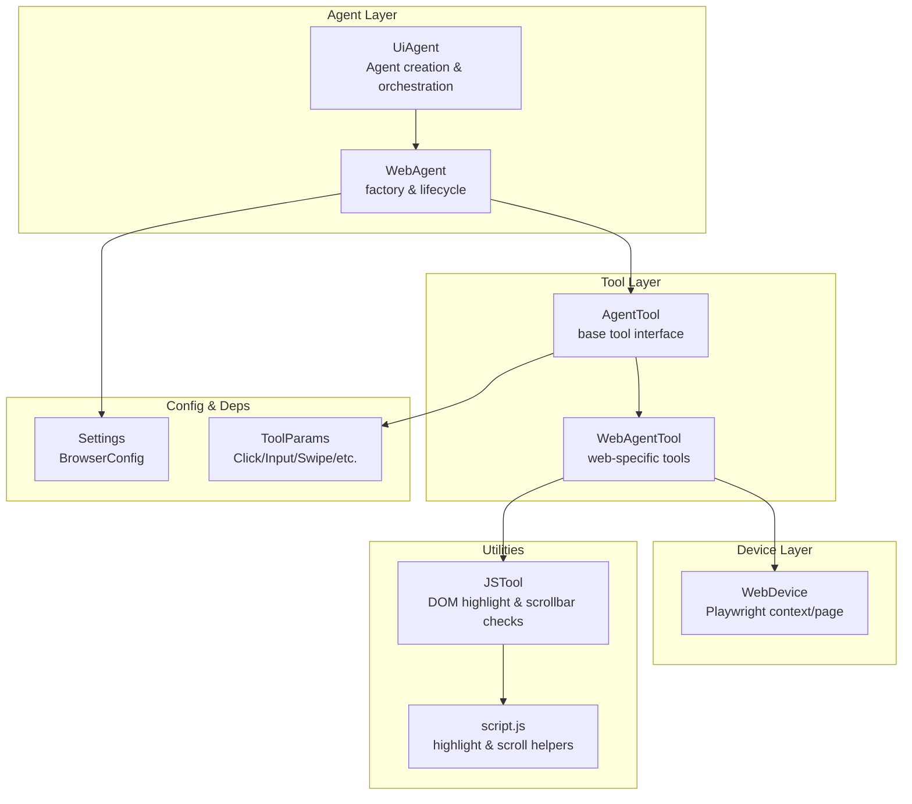
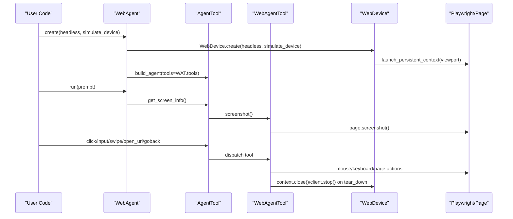
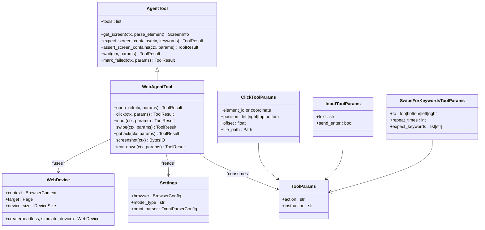

# Web Agent Tool

<cite>
**Referenced Files in This Document**
- [web.py](file://src/page_eyes/tools/web.py)
- [_base.py](file://src/page_eyes/tools/_base.py)
- [agent.py](file://src/page_eyes/agent.py)
- [device.py](file://src/page_eyes/device.py)
- [deps.py](file://src/page_eyes/deps.py)
- [config.py](file://src/page_eyes/config.py)
- [script.js](file://src/page_eyes/util/js_tool/script.js)
- [js_tool/__init__.py](file://src/page_eyes/util/js_tool/__init__.py)
- [prompt.py](file://src/page_eyes/prompt.py)
- [test_web_agent.py](file://tests/test_web_agent.py)
- [README.md](file://README.md)
- [troubleshooting.md](file://docs/faq/troubleshooting.md)
</cite>

## Table of Contents
1. [Introduction](#introduction)
2. [Project Structure](#project-structure)
3. [Core Components](#core-components)
4. [Architecture Overview](#architecture-overview)
5. [Detailed Component Analysis](#detailed-component-analysis)
6. [Dependency Analysis](#dependency-analysis)
7. [Performance Considerations](#performance-considerations)
8. [Troubleshooting Guide](#troubleshooting-guide)
9. [Conclusion](#conclusion)
10. [Appendices](#appendices)

## Introduction
This document provides comprehensive API documentation for the WebAgentTool implementation in PageEyes Agent. It focuses on the Playwright-based browser automation capabilities, including page navigation, element interaction, screenshot capture, and DOM manipulation. It also covers browser configuration, viewport management, headless mode, element selection strategies, session management, and error handling patterns. Practical examples and troubleshooting guidance are included for common web automation tasks.

## Project Structure
The WebAgentTool resides in the tools module and integrates with the broader agent framework. Key modules involved in web automation:
- Tools: WebAgentTool and shared AgentTool base
- Device: WebDevice abstraction for Playwright contexts
- Deps: Tool parameter models and result types
- Config: Browser configuration and settings
- Util: JavaScript helpers for DOM highlighting and scroll detection
- Agent: Factory and orchestration for WebAgent instances

**Diagram sources**
- [agent.py:316-362](file://src/page_eyes/agent.py#L316-L362)
- [_base.py:130-391](file://src/page_eyes/tools/_base.py#L130-L391)
- [web.py:24-179](file://src/page_eyes/tools/web.py#L24-L179)
- [device.py:54-100](file://src/page_eyes/device.py#L54-L100)
- [config.py:40-73](file://src/page_eyes/config.py#L40-L73)
- [deps.py:85-280](file://src/page_eyes/deps.py#L85-L280)
- [js_tool/__init__.py:22-52](file://src/page_eyes/util/js_tool/__init__.py#L22-L52)
- [script.js:1-54](file://src/page_eyes/util/js_tool/script.js#L1-L54)

**Section sources**
- [agent.py:316-362](file://src/page_eyes/agent.py#L316-L362)
- [web.py:24-179](file://src/page_eyes/tools/web.py#L24-L179)
- [device.py:54-100](file://src/page_eyes/device.py#L54-L100)
- [config.py:40-73](file://src/page_eyes/config.py#L40-L73)
- [deps.py:85-280](file://src/page_eyes/deps.py#L85-L280)
- [js_tool/__init__.py:22-52](file://src/page_eyes/util/js_tool/__init__.py#L22-L52)
- [script.js:1-54](file://src/page_eyes/util/js_tool/script.js#L1-L54)

## Core Components
- WebAgentTool: Implements web-specific tools such as open_url, click, input, swipe, goback, and screenshot. It inherits from AgentTool and adds web-specific behavior.
- AgentTool: Provides shared tool infrastructure, including screenshot abstraction, screen parsing, expectation/assertion utilities, and tool decorators.
- WebDevice: Manages Playwright browser context and page lifecycle, including viewport configuration and persistent context creation.
- ToolParams: Defines structured parameter models for each tool operation (e.g., OpenUrlToolParams, ClickToolParams, InputToolParams, SwipeToolParams).
- JSTool: Utility for adding/removing DOM overlays and detecting scrollbars during swiping.

Key APIs exposed by WebAgentTool:
- open_url(ctx, params: OpenUrlToolParams) -> ToolResult
- click(ctx, params: ClickToolParams) -> ToolResult
- input(ctx, params: InputToolParams) -> ToolResult
- swipe(ctx, params: SwipeForKeywordsToolParams) -> ToolResult
- goback(ctx, params: ToolParams) -> ToolResult
- screenshot(ctx) -> io.BytesIO
- tear_down(ctx, params: ToolParams) -> ToolResult

These methods are decorated with tool decorators that manage delays, logging, and error handling.

**Section sources**
- [web.py:24-179](file://src/page_eyes/tools/web.py#L24-L179)
- [_base.py:130-391](file://src/page_eyes/tools/_base.py#L130-L391)
- [device.py:54-100](file://src/page_eyes/device.py#L54-L100)
- [deps.py:91-204](file://src/page_eyes/deps.py#L91-L204)
- [js_tool/__init__.py:22-52](file://src/page_eyes/util/js_tool/__init__.py#L22-L52)

## Architecture Overview
The WebAgentTool orchestrates browser automation through Playwright. The flow:
- WebAgent.create initializes Settings, WebDevice, and WebAgentTool.
- WebDevice creates a persistent Chromium context with configured viewport and optional device emulation.
- WebAgentTool executes operations against the current page, leveraging JSTool for DOM overlays and scroll detection.
- AgentTool provides shared utilities for screen parsing, expectations, and assertions.

**Diagram sources**
- [agent.py:316-362](file://src/page_eyes/agent.py#L316-L362)
- [web.py:24-179](file://src/page_eyes/tools/web.py#L24-L179)
- [device.py:54-100](file://src/page_eyes/device.py#L54-L100)
- [_base.py:167-203](file://src/page_eyes/tools/_base.py#L167-L203)

## Detailed Component Analysis

### WebAgentTool API Reference
- open_url(ctx, params: OpenUrlToolParams) -> ToolResult
  - Navigates to the specified URL and waits until network idle.
  - Parameters: url (string)
  - Behavior: Uses page.goto with wait_until='networkidle'.

- click(ctx, params: ClickToolParams) -> ToolResult
  - Computes target coordinates from element bounding box and offsets, highlights the click position, then clicks.
  - Supports file upload via file chooser and handles new-page expectations.
  - Parameters: element_id or coordinate, position ('left'|'right'|'top'|'bottom'), offset (float), file_path (optional).
  - Behavior: Adds highlight overlay, attempts click, handles timeouts, removes highlight.

- input(ctx, params: InputToolParams) -> ToolResult
  - Activates the element by clicking, then types the provided text and optionally presses Enter.
  - Parameters: element_id or coordinate, text (string), send_enter (bool).
  - Behavior: Clicks to focus, types text, presses Enter if requested.

- swipe(ctx, params: SwipeForKeywordsToolParams) -> ToolResult
  - Performs directional swipes until a keyword appears or repeats reach the limit.
  - Parameters: to ('top'|'bottom'|'left'|'right'), repeat_times (int), expect_keywords (list[str]).
  - Behavior: Chooses mouse drag or wheel scrolling depending on device/mobile and scrollbar presence.

- goback(ctx, params: ToolParams) -> ToolResult
  - Navigates back to the previous page in browser history.

- screenshot(ctx) -> io.BytesIO
  - Captures a screenshot of the current page, excluding specific UI elements via injected CSS.

- tear_down(ctx, params: ToolParams) -> ToolResult
  - Removes highlight overlays, ensures a screen snapshot, closes context/client if present, and returns success.

Notes:
- All tool methods are decorated with tool decorators that enforce sequential execution, add pre/post hooks, and wrap exceptions in ModelRetry.

**Section sources**
- [web.py:24-179](file://src/page_eyes/tools/web.py#L24-L179)
- [deps.py:91-204](file://src/page_eyes/deps.py#L91-L204)
- [_base.py:88-127](file://src/page_eyes/tools/_base.py#L88-L127)

### AgentTool Shared Utilities
- get_screen(ctx, parse_element: bool = True) -> ScreenInfo
  - Captures screenshot and parses elements via OmniParser service or uploads raw image.
  - Stores image_url and screen_elements in current step context.

- expect_screen_contains(ctx, keywords: list[str]) -> ToolResult
- expect_screen_not_contains(ctx, keywords: list[str]) -> ToolResult
  - Parses current screen and checks for keyword presence.

- assert_screen_contains(ctx, params: AssertContainsParams) -> ToolResult
- assert_screen_not_contains(ctx, params: AssertNotContainsParams) -> ToolResult
  - Assertions that fail the step immediately.

- wait(ctx, params: WaitForKeywordsToolParams) -> ToolResult
  - Waits for a timeout or until expected keywords appear.

- mark_failed(ctx, params: MarkFailedParams) -> ToolResult
  - Marks the current step as failed with a reason.

- Tools enumeration
  - Exposes all callable tool methods with llm/vlm filtering and suffix removal for unified naming.

**Section sources**
- [_base.py:167-391](file://src/page_eyes/tools/_base.py#L167-L391)
- [deps.py:228-238](file://src/page_eyes/deps.py#L228-L238)

### WebDevice Browser Configuration
- Persistent context creation
  - Launches Chromium with a persistent user data directory and optional device emulation.
  - Sets viewport to 1600x900 by default; device emulation overrides width/height from Playwright devices.
- Headless mode
  - Controlled via Settings.browser.headless; passed to WebDevice.create().
- Mobile simulation
  - simulate_device accepts known device names; sets is_mobile flag and adjusts context parameters.

**Section sources**
- [device.py:54-100](file://src/page_eyes/device.py#L54-L100)
- [config.py:40-45](file://src/page_eyes/config.py#L40-L45)
- [agent.py:316-362](file://src/page_eyes/agent.py#L316-L362)

### Element Selection Strategies and Coordinates
- LLM mode
  - Uses element_id and position/offset to compute screen-relative coordinates from bbox.
  - Position types: 'left', 'right', 'top', 'bottom'; offset defaults to 0.25.
- VLM mode
  - Uses 0–999 coordinate system; computes normalized bbox and converts to pixel coordinates.
- Relative positioning
  - Supports clicking near an element (e.g., left/right/top/bottom) with configurable offset.

**Section sources**
- [deps.py:103-160](file://src/page_eyes/deps.py#L103-L160)
- [prompt.py:50-76](file://src/page_eyes/prompt.py#L50-L76)

### DOM Manipulation and Highlighting
- JSTool
  - add_highlight_element(page, bbox): overlays a red border around an element.
  - add_highlight_position(page, x, y): places a red dot at a coordinate.
  - remove_highlight_element/remove_highlight_position: cleans up overlays.
  - has_scrollbar(page, to): detects vertical/horizontal scrollbars.
- WebAgentTool uses these utilities to visualize interactions and detect scrollbars for swipe decisions.

**Section sources**
- [js_tool/__init__.py:22-52](file://src/page_eyes/util/js_tool/__init__.py#L22-L52)
- [script.js:1-54](file://src/page_eyes/util/js_tool/script.js#L1-L54)
- [web.py:27-44](file://src/page_eyes/tools/web.py#L27-L44)

### Session Management, Cookies, and Local Storage
- Persistent context
  - WebDevice uses a persistent Chromium context with a user data directory, enabling cookies and local storage persistence across runs.
- No explicit cookie/local storage APIs are exposed in WebAgentTool; however, the persistent context maintains state automatically.

**Section sources**
- [device.py:75-87](file://src/page_eyes/device.py#L75-L87)

### Error Handling Patterns
- Tool decorators
  - Pre/post hooks record step parameters and outcomes.
  - Exceptions are logged and wrapped in ModelRetry to trigger re-execution.
- Specific handling in WebAgentTool
  - TimeoutError during click/file chooser or new-page expectation is caught and ignored to avoid hard failures.
- Assertion and expectation utilities
  - Failures return ToolResult.failed and can mark steps as failed.

**Section sources**
- [_base.py:88-127](file://src/page_eyes/tools/_base.py#L88-L127)
- [web.py:75-77](file://src/page_eyes/tools/web.py#L75-L77)
- [_base.py:300-346](file://src/page_eyes/tools/_base.py#L300-L346)

### Practical Examples
Common tasks and how they map to tool calls:
- Open a URL and click an element by text
  - open_url(url)
  - get_screen_info()
  - click(element_id or coordinate)
- Input text and press Enter
  - get_screen_info()
  - input(text, send_enter=True)
- Slide until a keyword appears
  - swipe(to='top', repeat_times=None, expect_keywords=['确定'])
- Upload a file via click
  - click(element_id or coordinate, file_path='/path/to/file')
- Go back to previous page
  - goback()

Examples in tests demonstrate:
- Sliding and clicking buttons
- Waiting for elements
- Input with and without Enter
- Relative positioning clicks
- Uploading files

**Section sources**
- [test_web_agent.py:11-209](file://tests/test_web_agent.py#L11-L209)
- [prompt.py:30-103](file://src/page_eyes/prompt.py#L30-L103)

## Dependency Analysis

**Diagram sources**
- [_base.py:130-391](file://src/page_eyes/tools/_base.py#L130-L391)
- [web.py:24-179](file://src/page_eyes/tools/web.py#L24-L179)
- [device.py:54-100](file://src/page_eyes/device.py#L54-L100)
- [config.py:54-73](file://src/page_eyes/config.py#L54-L73)
- [deps.py:85-204](file://src/page_eyes/deps.py#L85-L204)

**Section sources**
- [_base.py:130-391](file://src/page_eyes/tools/_base.py#L130-L391)
- [web.py:24-179](file://src/page_eyes/tools/web.py#L24-L179)
- [device.py:54-100](file://src/page_eyes/device.py#L54-L100)
- [config.py:54-73](file://src/page_eyes/config.py#L54-L73)
- [deps.py:85-204](file://src/page_eyes/deps.py#L85-L204)

## Performance Considerations
- Screenshot and parsing
  - get_screen triggers OmniParser parsing; consider disabling parsing for raw screenshots when only images are needed.
- Delays
  - Tool decorators insert pre/post delays to accommodate rendering; adjust as needed for stability vs. speed.
- Viewport sizing
  - Default viewport is 1600x900; device emulation may change this. Larger viewports increase memory usage.
- Scroll detection
  - Swiping chooses between mouse drag and wheel scrolling based on scrollbar presence; this avoids unnecessary drag gestures.

[No sources needed since this section provides general guidance]

## Troubleshooting Guide
- Playwright browser startup
  - Install required browsers and system dependencies; ensure executable permissions.
- Environment variables
  - Verify AGENT_MODEL, AGENT_MODEL_TYPE, BROWSER_HEADLESS, OMNI_BASE_URL, and credentials.
- Element parsing
  - Confirm OmniParser service availability and network connectivity.
- Storage upload
  - Configure COS or MinIO; test upload connectivity.
- Logging
  - Enable debug logs and graph node logging for detailed traces.

**Section sources**
- [troubleshooting.md:1-211](file://docs/faq/troubleshooting.md#L1-L211)
- [README.md:97-131](file://README.md#L97-L131)

## Conclusion
The WebAgentTool provides a robust, Playwright-backed web automation layer integrated with PageEyes Agent. It offers structured tool parameters, consistent error handling, and utilities for screen parsing and DOM overlays. With clear configuration options for headless mode and device emulation, it supports both desktop and mobile web testing. The provided examples and troubleshooting guide help streamline common automation tasks.

[No sources needed since this section summarizes without analyzing specific files]

## Appendices

### API Method Signatures and Parameters
- open_url(ctx, params: OpenUrlToolParams) -> ToolResult
  - url: string
- click(ctx, params: ClickToolParams) -> ToolResult
  - element_id or coordinate, position: 'left'|'right'|'top'|'bottom', offset: float, file_path: Path (optional)
- input(ctx, params: InputToolParams) -> ToolResult
  - text: string, send_enter: bool
- swipe(ctx, params: SwipeForKeywordsToolParams) -> ToolResult
  - to: 'top'|'bottom'|'left'|'right', repeat_times: int, expect_keywords: list[str] (optional)
- goback(ctx, params: ToolParams) -> ToolResult
- screenshot(ctx) -> io.BytesIO
- tear_down(ctx, params: ToolParams) -> ToolResult

**Section sources**
- [web.py:24-179](file://src/page_eyes/tools/web.py#L24-L179)
- [deps.py:91-204](file://src/page_eyes/deps.py#L91-L204)

### Browser Configuration Options
- headless: bool
- simulate_device: 'iPhone 15'|'iPhone 15 Pro'|'iPhone 15 Pro Max'|'iPhone 6'|custom string
- viewport: 1600x900 by default; overridden by device emulation

**Section sources**
- [config.py:40-45](file://src/page_eyes/config.py#L40-L45)
- [device.py:65-74](file://src/page_eyes/device.py#L65-L74)

### Element Selection Strategies
- LLM mode: element_id + position/offset -> bbox-based coordinates
- VLM mode: 0–999 coordinate system -> normalized bbox -> pixel coordinates
- Adjacent element lists: left_elem_ids, right_elem_ids, top_elem_ids, bottom_elem_ids

**Section sources**
- [deps.py:103-160](file://src/page_eyes/deps.py#L103-L160)
- [prompt.py:50-76](file://src/page_eyes/prompt.py#L50-L76)

### Practical Example Workflows
- Open URL, slide until keyword, click button, input text, go back, wait
- Upload file via click with file chooser
- Relative positioning clicks (left/right/top/bottom, with offsets)

**Section sources**
- [test_web_agent.py:11-209](file://tests/test_web_agent.py#L11-L209)