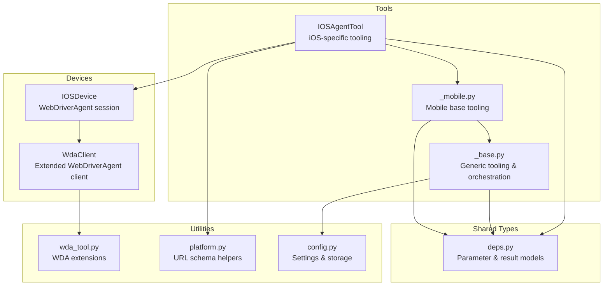
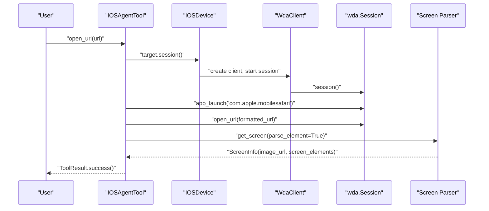
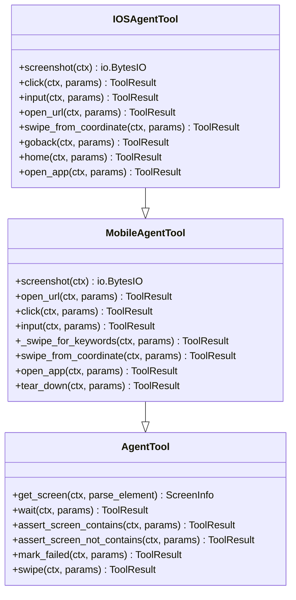
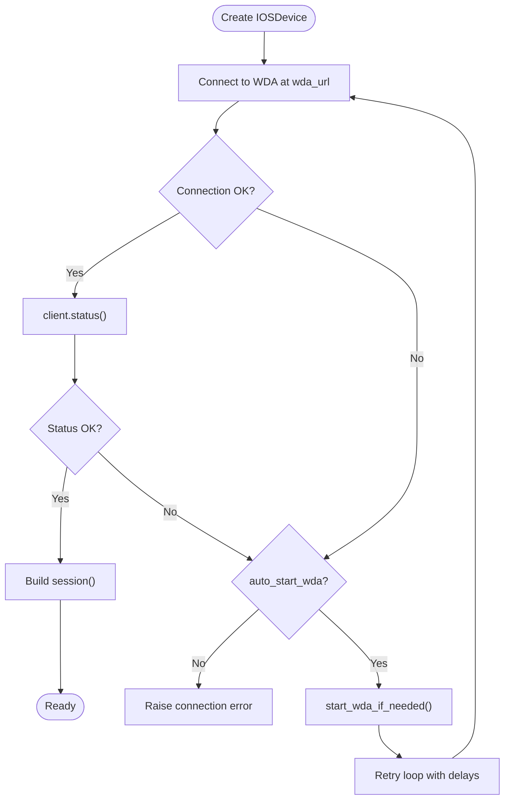
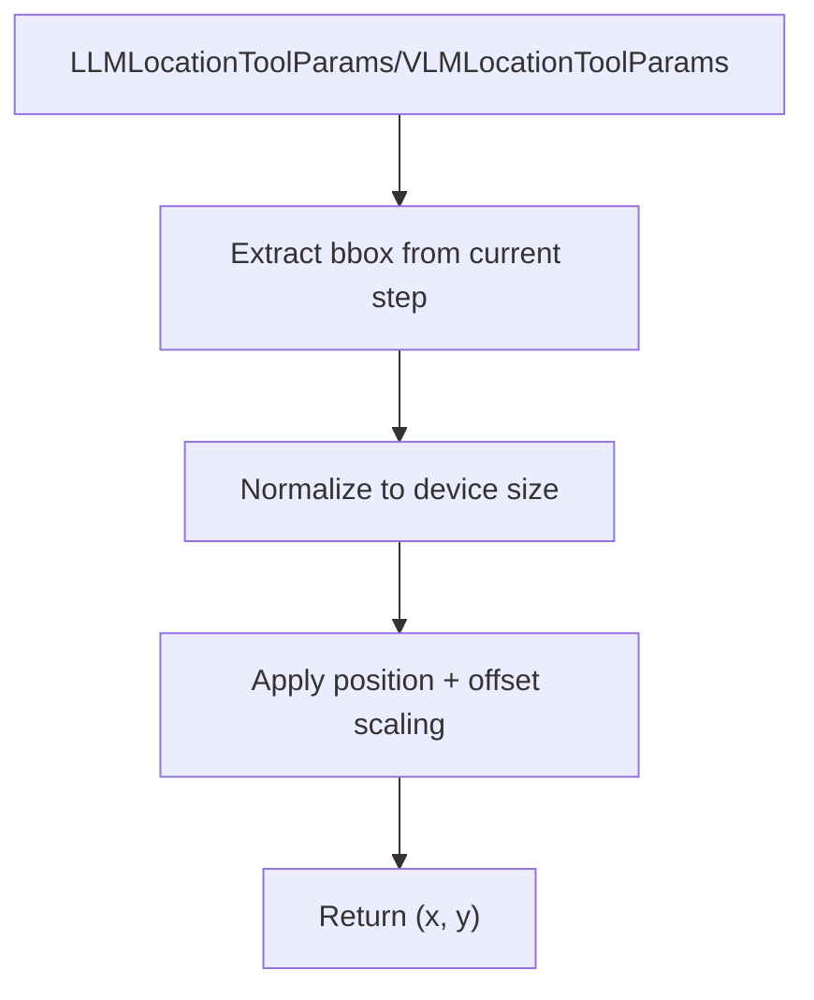
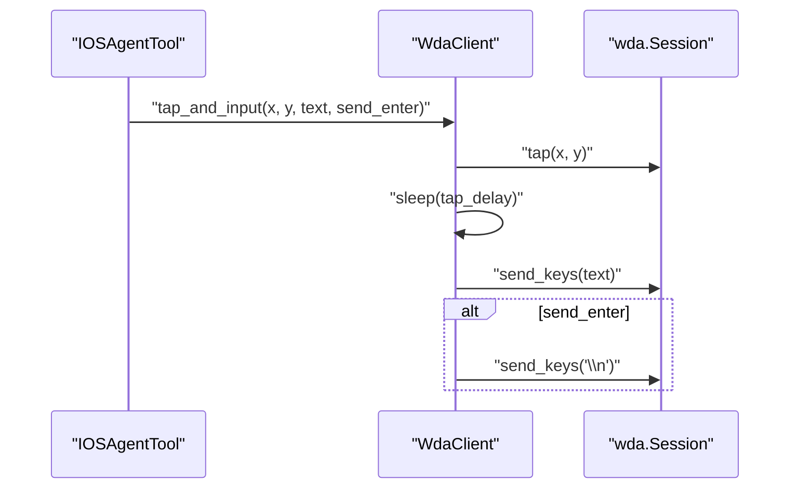
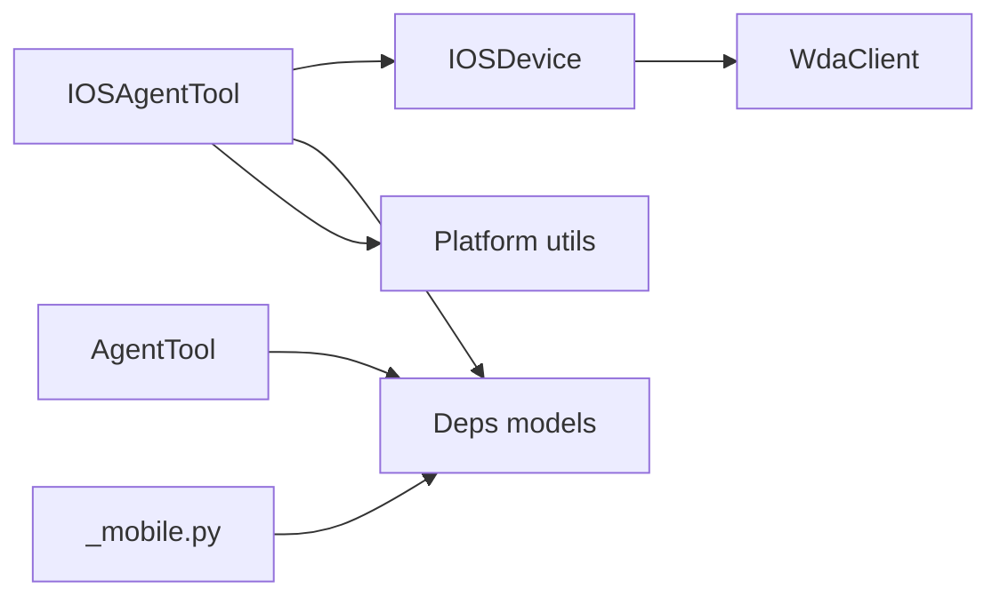

# iOS Agent Tool

<cite>
**Referenced Files in This Document**
- [ios.py](file://src/page_eyes/tools/ios.py)
- [_base.py](file://src/page_eyes/tools/_base.py)
- [_mobile.py](file://src/page_eyes/tools/_mobile.py)
- [device.py](file://src/page_eyes/device.py)
- [wda_tool.py](file://src/page_eyes/util/wda_tool.py)
- [deps.py](file://src/page_eyes/deps.py)
- [platform.py](file://src/page_eyes/util/platform.py)
- [config.py](file://src/page_eyes/config.py)
- [test_ios_agent.py](file://tests/test_ios_agent.py)
</cite>

## Table of Contents
1. [Introduction](#introduction)
2. [Project Structure](#project-structure)
3. [Core Components](#core-components)
4. [Architecture Overview](#architecture-overview)
5. [Detailed Component Analysis](#detailed-component-analysis)
6. [Dependency Analysis](#dependency-analysis)
7. [Performance Considerations](#performance-considerations)
8. [Troubleshooting Guide](#troubleshooting-guide)
9. [Conclusion](#conclusion)
10. [Appendices](#appendices)

## Introduction
This document provides detailed API documentation for the iOS Agent Tool implementation in PageEyes Agent. It focuses on WebDriverAgent-based iOS device automation, covering touch interactions, text input, app management, and screen capture. It also documents WebDriverAgent server configuration, device connection protocols, iOS simulator/emulator management, element identification, iOS-specific gestures, error handling, and practical automation examples.

## Project Structure
The iOS automation stack is organized around a modular tool architecture:
- Tools define the public API surface for automation actions.
- Device abstractions encapsulate platform-specific connections and operations.
- Utilities extend WebDriverAgent clients with convenience methods.
- Deps define shared parameter models and result types.
- Platform utilities translate URLs to platform-specific schemas.

**Diagram sources**
- [ios.py:24-293](file://src/page_eyes/tools/ios.py#L24-L293)
- [_mobile.py:27-165](file://src/page_eyes/tools/_mobile.py#L27-L165)
- [_base.py:130-391](file://src/page_eyes/tools/_base.py#L130-L391)
- [device.py:159-228](file://src/page_eyes/device.py#L159-L228)
- [wda_tool.py:35-129](file://src/page_eyes/util/wda_tool.py#L35-L129)
- [platform.py:48-66](file://src/page_eyes/util/platform.py#L48-L66)
- [config.py:54-73](file://src/page_eyes/config.py#L54-L73)
- [deps.py:75-280](file://src/page_eyes/deps.py#L75-L280)

**Section sources**
- [ios.py:24-293](file://src/page_eyes/tools/ios.py#L24-L293)
- [device.py:159-228](file://src/page_eyes/device.py#L159-L228)
- [wda_tool.py:35-129](file://src/page_eyes/util/wda_tool.py#L35-L129)
- [deps.py:75-280](file://src/page_eyes/deps.py#L75-L280)
- [platform.py:48-66](file://src/page_eyes/util/platform.py#L48-L66)
- [config.py:54-73](file://src/page_eyes/config.py#L54-L73)

## Core Components
- IOSAgentTool: iOS-specific automation tool extending MobileAgentTool. Provides click, input, open_url, screenshot, swipe_from_coordinate, goback, home, and open_app.
- IOSDevice: Encapsulates WebDriverAgent connection and session lifecycle, including automatic WDA startup on macOS.
- WdaClient: Extended WebDriverAgent client with convenience methods (long press, input with clear, app list retrieval).
- Deps: Shared parameter models for tooling (ClickToolParams, InputToolParams, OpenUrlToolParams, SwipeFromCoordinateToolParams, SwipeForKeywordsToolParams).
- Platform utilities: Translate URLs to platform-specific schemas for native app launching.

Key APIs exposed by IOSAgentTool:
- click(ctx, params: ClickToolParams) -> ToolResult
- input(ctx, params: InputToolParams) -> ToolResult
- open_url(ctx, params: OpenUrlToolParams) -> ToolResult
- screenshot(ctx) -> io.BytesIO
- swipe_from_coordinate(ctx, params: SwipeFromCoordinateToolParams) -> ToolResult
- goback(ctx, params: ToolParams) -> ToolResult
- home(ctx, params: ToolParams) -> ToolResult
- open_app(ctx, params: ToolParams) -> ToolResult

**Section sources**
- [ios.py:47-292](file://src/page_eyes/tools/ios.py#L47-L292)
- [device.py:159-228](file://src/page_eyes/device.py#L159-L228)
- [wda_tool.py:35-129](file://src/page_eyes/util/wda_tool.py#L35-L129)
- [deps.py:85-208](file://src/page_eyes/deps.py#L85-L208)
- [platform.py:48-66](file://src/page_eyes/util/platform.py#L48-L66)

## Architecture Overview
The iOS automation pipeline connects to WebDriverAgent, executes actions via WDA sessions, captures screenshots, and parses UI elements for intelligent navigation.

**Diagram sources**
- [ios.py:210-239](file://src/page_eyes/tools/ios.py#L210-L239)
- [device.py:164-228](file://src/page_eyes/device.py#L164-L228)
- [_base.py:167-189](file://src/page_eyes/tools/_base.py#L167-L189)

**Section sources**
- [ios.py:210-239](file://src/page_eyes/tools/ios.py#L210-L239)
- [device.py:164-228](file://src/page_eyes/device.py#L164-L228)
- [_base.py:167-189](file://src/page_eyes/tools/_base.py#L167-L189)

## Detailed Component Analysis

### IOSAgentTool API Reference
- click(ctx, params: ClickToolParams) -> ToolResult
  - Purpose: Tap at a computed coordinate.
  - Coordinate calculation: Uses params.get_coordinate(ctx, position, offset) to compute x,y.
  - Execution: device.target.session().tap(x, y).
  - Delays: after_delay=1 enforced by decorator.
- input(ctx, params: InputToolParams) -> ToolResult
  - Purpose: Tap to focus and input text; optionally send Enter.
  - Execution: device.client.tap_and_input(x, y, text, send_enter).
  - Delays: after_delay=1 enforced by decorator.
- open_url(ctx, params: OpenUrlToolParams) -> ToolResult
  - Purpose: Launch Safari and open a URL.
  - URL normalization: Ensures protocol header; formats www/hostname prefixes.
  - Execution: session.app_launch('com.apple.mobilesafari'), session.open_url(url).
  - Post-action: get_screen(parse_element=False) to refresh state.
- screenshot(ctx) -> io.BytesIO
  - Purpose: Capture current screen as PNG buffer.
  - Compatibility: Handles both PIL Image and raw bytes from target.screenshot().
- swipe_from_coordinate(ctx, params: SwipeFromCoordinateToolParams) -> ToolResult
  - Purpose: Swipe between consecutive coordinates.
  - Validation: Coordinates must be within device bounds; otherwise returns failure with message.
  - Execution: session.swipe(x1, y1, x2, y2) for each pair.
- goback(ctx, params: ToolParams) -> ToolResult
  - Purpose: Navigate back via explicit back button or edge swipe.
  - Back button detection: Attempts XCUIElementTypeButton with localized names.
  - Fallback: Left-edge swipe gesture.
- home(ctx, params: ToolParams) -> ToolResult
  - Purpose: Press Home button via session.home().
- open_app(ctx, params: ToolParams) -> ToolResult
  - Purpose: Launch an app by Bundle ID.
  - Resolution: Uses app_name_map if configured; otherwise queries device app list and uses LLM to match.
  - Execution: session.app_launch(bundle_id).

**Diagram sources**
- [ios.py:24-293](file://src/page_eyes/tools/ios.py#L24-L293)
- [_mobile.py:27-165](file://src/page_eyes/tools/_mobile.py#L27-L165)
- [_base.py:130-391](file://src/page_eyes/tools/_base.py#L130-L391)

**Section sources**
- [ios.py:47-292](file://src/page_eyes/tools/ios.py#L47-L292)
- [_mobile.py:27-165](file://src/page_eyes/tools/_mobile.py#L27-L165)
- [_base.py:130-391](file://src/page_eyes/tools/_base.py#L130-L391)

### WebDriverAgent Server Configuration and Device Connection
- IOSDevice.create(wda_url, platform, auto_start_wda)
  - Connects to WebDriverAgent at wda_url.
  - Validates device status via client.status().
  - If connection fails and auto_start_wda is True, attempts to start WDA using xcodebuild with environment-provided IOS_UDID and IOS_WDA_PROJECT_PATH.
  - Retries with exponential backoff-like loop until successful or exhausted.
- WdaClient
  - Extends wda.Client with convenience methods:
    - long_press(x, y, duration)
    - input_text_with_clear(text, clear)
    - get_app_list(): tries pymobiledevice3 for richer app metadata; falls back to WDA method.
    - tap_and_input(x, y, text, send_enter, tap_delay): tap to focus, delay, input text, optionally send Enter.

**Diagram sources**
- [device.py:164-228](file://src/page_eyes/device.py#L164-L228)
- [device.py:324-390](file://src/page_eyes/device.py#L324-L390)
- [wda_tool.py:35-129](file://src/page_eyes/util/wda_tool.py#L35-L129)

**Section sources**
- [device.py:164-228](file://src/page_eyes/device.py#L164-L228)
- [device.py:324-390](file://src/page_eyes/device.py#L324-L390)
- [wda_tool.py:35-129](file://src/page_eyes/util/wda_tool.py#L35-L129)

### Element Identification and Coordinate Systems
- Coordinate computation:
  - LLMLocationToolParams.get_coordinate(ctx, position, offset) computes normalized positions based on element bounding boxes and device size.
  - VLMLocationToolParams.get_coordinate(ctx, position, offset) converts absolute pixel coordinates to device pixels using 1000-scale coordinates.
- Position offsets:
  - position accepts 'left', 'right', 'top', 'bottom'; offset scales relative to element dimensions.
- Accessibility and selectors:
  - iOS uses XCUIElementType-based selectors (e.g., XCUIElementTypeButton with localized names) for back navigation fallback.
- Screen parsing:
  - get_screen(ctx, parse_element=True) invokes OmniParser service to label and describe UI elements; stores parsed_content_list in context for subsequent assertions and expectations.

**Diagram sources**
- [deps.py:103-159](file://src/page_eyes/deps.py#L103-L159)
- [_base.py:167-189](file://src/page_eyes/tools/_base.py#L167-L189)

**Section sources**
- [deps.py:103-159](file://src/page_eyes/deps.py#L103-L159)
- [_base.py:167-189](file://src/page_eyes/tools/_base.py#L167-L189)

### iOS-Specific Gestures and Interactions
- Tap and long press:
  - click uses session.tap(x, y).
  - WdaClient.long_press(x, y, duration) delegates to tap_hold.
- Text input:
  - input uses WdaClient.tap_and_input(x, y, text, send_enter, tap_delay).
  - WdaClient.input_text_with_clear(text, clear) clears input if requested, then sends keys.
- Swiping:
  - swipe_from_coordinate performs multiple swipe operations between pairs of coordinates.
  - goback uses edge swipe gesture as fallback when back button detection fails.
- App management:
  - open_app resolves Bundle ID via app_name_map or device app list; launches via session.app_launch.

**Diagram sources**
- [ios.py:78-78](file://src/page_eyes/tools/ios.py#L78-L78)
- [wda_tool.py:97-124](file://src/page_eyes/util/wda_tool.py#L97-L124)

**Section sources**
- [ios.py:78-78](file://src/page_eyes/tools/ios.py#L78-L78)
- [wda_tool.py:38-42](file://src/page_eyes/util/wda_tool.py#L38-L42)
- [wda_tool.py:97-124](file://src/page_eyes/util/wda_tool.py#L97-L124)

### Error Handling and Robustness
- Tool decorator:
  - Wraps tool functions with pre/post handlers and retries on exceptions via ModelRetry.
  - Adds delays before and after tool execution to stabilize UI rendering.
- IOSDevice connection:
  - On initial failure, attempts to start WDA automatically if environment variables are present.
  - Retries with bounded attempts and delays; raises combined error if unsuccessful.
- goback fallback:
  - If explicit back button detection fails, uses left-edge swipe gesture as robust fallback.
- swipe_from_coordinate:
  - Validates coordinates against device bounds; returns failure with descriptive message if out-of-range.

**Section sources**
- [_base.py:88-127](file://src/page_eyes/tools/_base.py#L88-L127)
- [device.py:195-227](file://src/page_eyes/device.py#L195-L227)
- [device.py:324-390](file://src/page_eyes/device.py#L324-L390)
- [ios.py:189-194](file://src/page_eyes/tools/ios.py#L189-L194)
- [ios.py:137-140](file://src/page_eyes/tools/ios.py#L137-L140)

### Practical Automation Examples
Common tasks validated by tests:
- Open URL, dismiss overlays, navigate lists, and click items.
- Navigate system settings and read device info.
- Open multiple URLs in sequence and verify navigation.
- Search via input and wait for results.
- Batch assertions on screen content.
- Sliding up/down and coordinate-based swipes.
- Long-press and context menu interactions.
- Continuous app opening sequences.

These scenarios demonstrate real-world usage of open_url, input, swipe, goback, and open_app across web and native contexts.

**Section sources**
- [test_ios_agent.py:11-212](file://tests/test_ios_agent.py#L11-L212)

## Dependency Analysis
- Tool-to-device coupling:
  - IOSAgentTool depends on IOSDevice for session access and device_size.
  - WdaClient extends wda.Client and is embedded in IOSDevice.
- Parameter and result models:
  - Deps defines shared models for tool parameters and results, enabling consistent tool signatures across platforms.
- Platform integration:
  - Platform utilities convert URLs to platform-specific schemas for native app launching.

**Diagram sources**
- [ios.py:24-293](file://src/page_eyes/tools/ios.py#L24-L293)
- [device.py:159-228](file://src/page_eyes/device.py#L159-L228)
- [deps.py:75-280](file://src/page_eyes/deps.py#L75-L280)
- [platform.py:48-66](file://src/page_eyes/util/platform.py#L48-L66)
- [_base.py:130-391](file://src/page_eyes/tools/_base.py#L130-L391)
- [_mobile.py:27-165](file://src/page_eyes/tools/_mobile.py#L27-L165)

**Section sources**
- [ios.py:24-293](file://src/page_eyes/tools/ios.py#L24-L293)
- [device.py:159-228](file://src/page_eyes/device.py#L159-L228)
- [deps.py:75-280](file://src/page_eyes/deps.py#L75-L280)
- [platform.py:48-66](file://src/page_eyes/util/platform.py#L48-L66)
- [_base.py:130-391](file://src/page_eyes/tools/_base.py#L130-L391)
- [_mobile.py:27-165](file://src/page_eyes/tools/_mobile.py#L27-L165)

## Performance Considerations
- Delays:
  - Tools enforce after_delay=1 to allow UI stability; adjust cautiously to balance reliability and speed.
- Retry loops:
  - Connection retries with fixed delays reduce flakiness during WDA startup.
- Parsing overhead:
  - get_screen with parse_element=True invokes external parser; consider parse_element=False for performance-sensitive steps.
- Coordinate validation:
  - Pre-validating coordinates prevents repeated failed operations.

[No sources needed since this section provides general guidance]

## Troubleshooting Guide
- WebDriverAgent connection failures:
  - Ensure wda_url is reachable and client.status() returns true.
  - If auto_start_wda is enabled, confirm IOS_UDID and IOS_WDA_PROJECT_PATH are set; verify Xcode and xcodebuild availability.
- Device orientation and layout:
  - Use get_screen_info to inspect parsed elements and adjust coordinates accordingly.
- App launch issues:
  - Verify Bundle ID correctness; use open_app with app_name_map for known apps.
- Input and focus:
  - Use tap_and_input to ensure focus before input; consider send_enter flag for form submission.
- Edge cases:
  - goback fallback uses edge swipe; if navigation fails, re-check element visibility and timing.

**Section sources**
- [device.py:195-227](file://src/page_eyes/device.py#L195-L227)
- [device.py:324-390](file://src/page_eyes/device.py#L324-L390)
- [ios.py:189-194](file://src/page_eyes/tools/ios.py#L189-L194)
- [ios.py:254-264](file://src/page_eyes/tools/ios.py#L254-L264)

## Conclusion
The iOS Agent Tool provides a robust, WebDriverAgent-backed automation layer for iOS devices. It integrates seamlessly with PageEyes Agent’s tooling framework, offering consistent APIs for clicks, input, URL navigation, app launching, and gestures. With built-in resilience (automatic WDA startup, retries, fallbacks) and structured parameterization, it enables reliable UI automation across web and native contexts.

[No sources needed since this section summarizes without analyzing specific files]

## Appendices

### API Method Signatures and Parameters
- click(ctx, params: ClickToolParams) -> ToolResult
  - Positioning: position, offset; computed via get_coordinate.
- input(ctx, params: InputToolParams) -> ToolResult
  - Text: text; Enter: send_enter.
- open_url(ctx, params: OpenUrlToolParams) -> ToolResult
  - URL: url; normalized to https scheme and www handling.
- screenshot(ctx) -> io.BytesIO
  - Returns PNG buffer compatible with PIL and raw bytes.
- swipe_from_coordinate(ctx, params: SwipeFromCoordinateToolParams) -> ToolResult
  - Coordinates: list of (x, y) pairs; validated against device bounds.
- goback(ctx, params: ToolParams) -> ToolResult
  - Fallback: left-edge swipe if explicit back button not found.
- home(ctx, params: ToolParams) -> ToolResult
  - Presses Home button.
- open_app(ctx, params: ToolParams) -> ToolResult
  - Resolves Bundle ID via app_name_map or device app list.

**Section sources**
- [ios.py:47-292](file://src/page_eyes/tools/ios.py#L47-L292)
- [deps.py:165-208](file://src/page_eyes/deps.py#L165-L208)