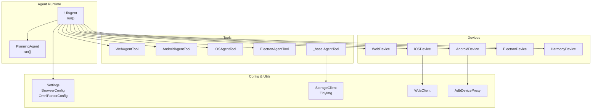
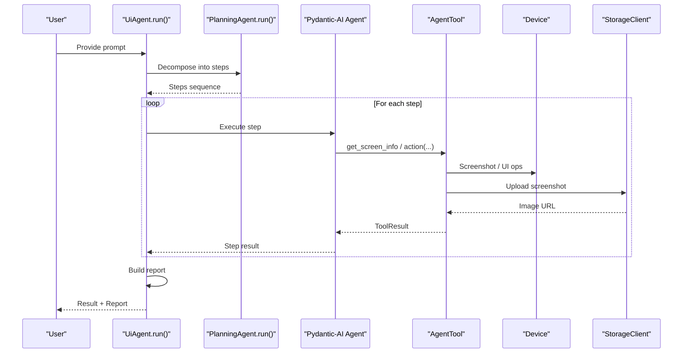
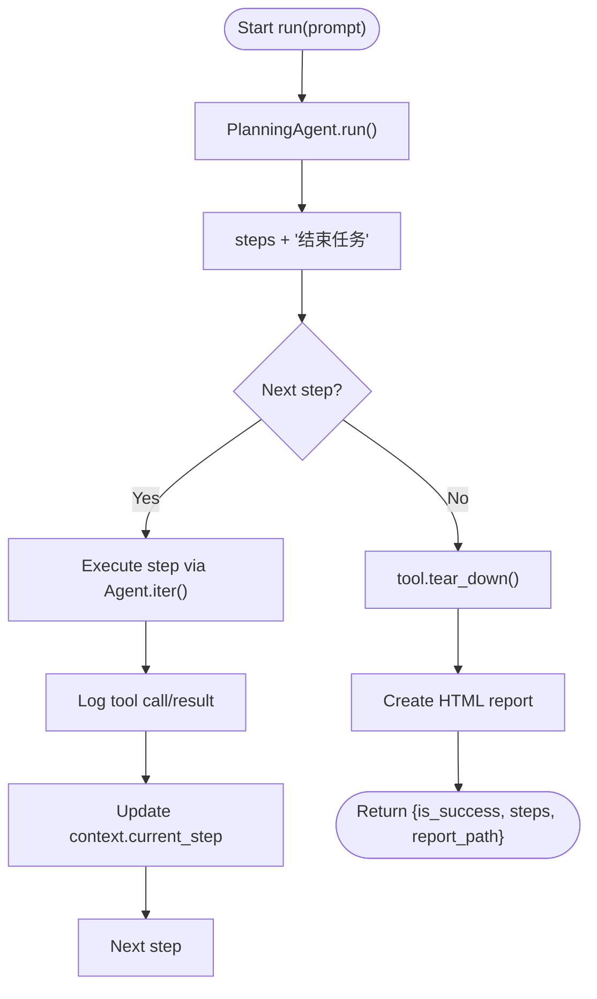
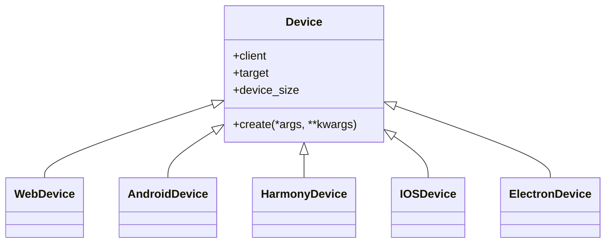
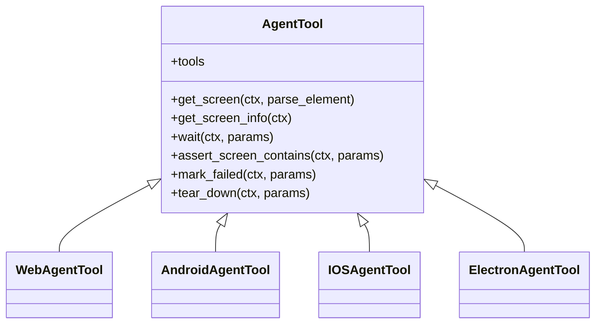
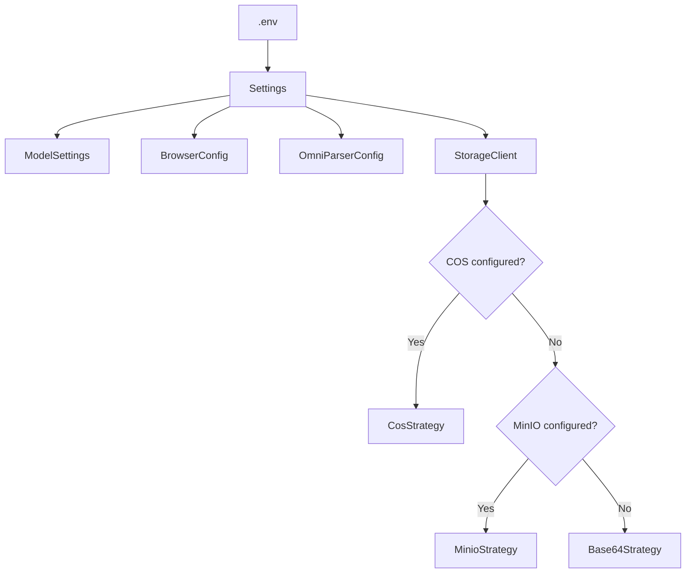
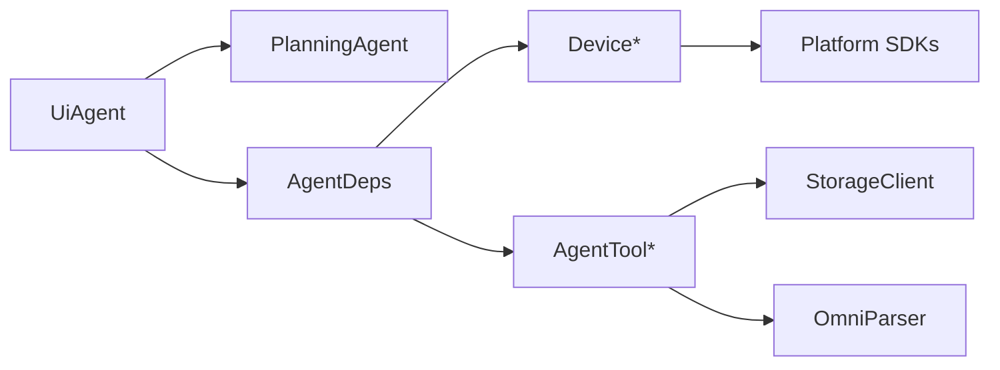

# Advanced Topics

<cite>
**Referenced Files in This Document**
- [agent.py](file://src/page_eyes/agent.py)
- [config.py](file://src/page_eyes/config.py)
- [device.py](file://src/page_eyes/device.py)
- [deps.py](file://src/page_eyes/deps.py)
- [prompt.py](file://src/page_eyes/prompt.py)
- [tools/__init__.py](file://src/page_eyes/tools/__init__.py)
- [_base.py](file://src/page_eyes/tools/_base.py)
- [web.py](file://src/page_eyes/tools/web.py)
- [android.py](file://src/page_eyes/tools/android.py)
- [ios.py](file://src/page_eyes/tools/ios.py)
- [electron.py](file://src/page_eyes/tools/electron.py)
- [platform.py](file://src/page_eyes/util/platform.py)
- [storage.py](file://src/page_eyes/util/storage.py)
- [wda_tool.py](file://src/page_eyes/util/wda_tool.py)
- [adb_tool.py](file://src/page_eyes/util/adb_tool.py)
</cite>

## Table of Contents
1. [Introduction](#introduction)
2. [Project Structure](#project-structure)
3. [Core Components](#core-components)
4. [Architecture Overview](#architecture-overview)
5. [Detailed Component Analysis](#detailed-component-analysis)
6. [Dependency Analysis](#dependency-analysis)
7. [Performance Considerations](#performance-considerations)
8. [Troubleshooting Guide](#troubleshooting-guide)
9. [Conclusion](#conclusion)
10. [Appendices](#appendices)

## Introduction
This document provides advanced guidance for PageEyes Agent, focusing on performance optimization, robust error handling, expert-level usage patterns, and operational excellence. It covers deployment tuning, memory and resource management, retry and failure recovery strategies, structured logging and tracing, observability and alerting, advanced configuration, custom device/tool implementations, security and access control, scaling and distributed automation, and troubleshooting workflows for complex issues.

## Project Structure
The repository is organized around a modular Python package with clear separation of concerns:
- Agent orchestration and planning logic
- Device abstractions for multiple platforms
- Tools implementing UI automation actions
- Configuration and environment settings
- Utilities for platform-specific integrations and storage
- Prompt templates guiding agent behavior

**Diagram sources**
- [agent.py:97-314](file://src/page_eyes/agent.py#L97-L314)
- [device.py:54-390](file://src/page_eyes/device.py#L54-L390)
- [tools/web.py:24-179](file://src/page_eyes/tools/web.py#L24-L179)
- [tools/android.py:18-23](file://src/page_eyes/tools/android.py#L18-L23)
- [tools/ios.py:24-293](file://src/page_eyes/tools/ios.py#L24-L293)
- [tools/electron.py:21-134](file://src/page_eyes/tools/electron.py#L21-L134)
- [config.py:54-73](file://src/page_eyes/config.py#L54-L73)
- [storage.py:154-193](file://src/page_eyes/util/storage.py#L154-L193)
- [wda_tool.py:35-129](file://src/page_eyes/util/wda_tool.py#L35-L129)
- [adb_tool.py:12-37](file://src/page_eyes/util/adb_tool.py#L12-L37)

**Section sources**
- [agent.py:97-314](file://src/page_eyes/agent.py#L97-L314)
- [config.py:54-73](file://src/page_eyes/config.py#L54-L73)
- [device.py:54-390](file://src/page_eyes/device.py#L54-L390)
- [tools/__init__.py:6-22](file://src/page_eyes/tools/__init__.py#L6-L22)
- [storage.py:154-193](file://src/page_eyes/util/storage.py#L154-L193)

## Core Components
- UiAgent orchestrates planning and execution loops, manages step context, and generates reports.
- PlanningAgent decomposes user intent into atomic steps.
- Device classes encapsulate platform-specific automation clients and lifecycle.
- AgentTool defines the tool interface and shared utilities (screen parsing, uploads, assertions).
- StorageClient abstracts screenshot/image storage with pluggable strategies.
- Configuration models define runtime settings and environment overrides.

Key advanced patterns:
- Structured logging with trace correlation via X-Trace-Id propagation to external services.
- Retry and failure marking via ModelRetry and mark_failed.
- Parallel tool call enforcement and delays to stabilize UI rendering.
- VLM vs LLM mode switching with distinct prompts and tool availability.

**Section sources**
- [agent.py:97-314](file://src/page_eyes/agent.py#L97-L314)
- [agent.py:147-169](file://src/page_eyes/agent.py#L147-L169)
- [prompt.py:8-166](file://src/page_eyes/prompt.py#L8-L166)
- [_base.py:88-128](file://src/page_eyes/tools/_base.py#L88-L128)
- [_base.py:322-347](file://src/page_eyes/tools/_base.py#L322-L347)
- [storage.py:154-193](file://src/page_eyes/util/storage.py#L154-L193)
- [config.py:54-73](file://src/page_eyes/config.py#L54-L73)

## Architecture Overview
The system follows a layered architecture:
- Orchestration layer: UiAgent and PlanningAgent
- Device abstraction: Web, Android, iOS, Electron, Harmony
- Tool layer: Platform-specific implementations extending a shared AgentTool base
- Utilities: Storage, platform helpers, device proxies
- Configuration: Environment-driven settings and model parameters

**Diagram sources**
- [agent.py:225-314](file://src/page_eyes/agent.py#L225-L314)
- [agent.py:80-89](file://src/page_eyes/agent.py#L80-L89)
- [_base.py:204-234](file://src/page_eyes/tools/_base.py#L204-L234)
- [device.py:54-100](file://src/page_eyes/device.py#L54-L100)
- [storage.py:188-193](file://src/page_eyes/util/storage.py#L188-L193)

## Detailed Component Analysis

### UiAgent Execution Loop and Error Handling
UiAgent drives the end-to-end flow:
- Uses PlanningAgent to produce ordered steps
- Iterates steps, logs tool calls, and updates context
- Handles UnexpectedModelBehavior by marking failure and continuing
- Generates HTML reports and aggregates usage metrics

**Diagram sources**
- [agent.py:225-314](file://src/page_eyes/agent.py#L225-L314)
- [agent.py:264-271](file://src/page_eyes/agent.py#L264-L271)

**Section sources**
- [agent.py:225-314](file://src/page_eyes/agent.py#L225-L314)

### Device Abstractions and Lifecycle
Device classes encapsulate platform clients and viewport handling:
- WebDevice: Playwright persistent context, optional mobile emulation
- AndroidDevice: ADB client, device window size
- HarmonyDevice: HDC client, device window size
- IOSDevice: WDA client/session, with auto-start and retry logic
- ElectronDevice: Chromium CDP connection, page stack management, latest-page switching

**Diagram sources**
- [device.py:42-156](file://src/page_eyes/device.py#L42-L156)
- [device.py:158-292](file://src/page_eyes/device.py#L158-L292)

**Section sources**
- [device.py:54-100](file://src/page_eyes/device.py#L54-L100)
- [device.py:103-127](file://src/page_eyes/device.py#L103-L127)
- [device.py:129-156](file://src/page_eyes/device.py#L129-L156)
- [device.py:158-228](file://src/page_eyes/device.py#L158-L228)
- [device.py:231-292](file://src/page_eyes/device.py#L231-L292)

### Tool Layer and Shared Utilities
AgentTool defines:
- Tool decorators enforcing single-tool-at-a-time and delays
- Screen capture and element parsing with OmniParser
- Assertions and waits
- Failure marking and teardown hooks

Platform-specific tools extend AgentTool:
- WebAgentTool: Playwright-based actions, highlight overlays, page transitions
- AndroidAgentTool: Android shell integration
- IOSAgentTool: WDA-based actions, app launching, back gestures
- ElectronAgentTool: Enhanced click/close_window with page stack

**Diagram sources**
- [_base.py:130-391](file://src/page_eyes/tools/_base.py#L130-L391)
- [web.py:24-179](file://src/page_eyes/tools/web.py#L24-L179)
- [android.py:18-23](file://src/page_eyes/tools/android.py#L18-L23)
- [ios.py:24-293](file://src/page_eyes/tools/ios.py#L24-L293)
- [electron.py:21-134](file://src/page_eyes/tools/electron.py#L21-L134)

**Section sources**
- [_base.py:88-128](file://src/page_eyes/tools/_base.py#L88-L128)
- [_base.py:167-234](file://src/page_eyes/tools/_base.py#L167-L234)
- [_base.py:322-347](file://src/page_eyes/tools/_base.py#L322-L347)
- [web.py:24-179](file://src/page_eyes/tools/web.py#L24-L179)
- [ios.py:24-293](file://src/page_eyes/tools/ios.py#L24-L293)
- [electron.py:21-134](file://src/page_eyes/tools/electron.py#L21-L134)

### Configuration and Environment Integration
Settings supports:
- Model selection and tuning
- Browser/headless/mobile emulation
- OmniParser service integration
- Storage client selection (COS/MinIO/Base64)
- Debug toggles

**Diagram sources**
- [config.py:54-73](file://src/page_eyes/config.py#L54-L73)
- [storage.py:161-187](file://src/page_eyes/util/storage.py#L161-L187)

**Section sources**
- [config.py:54-73](file://src/page_eyes/config.py#L54-L73)
- [storage.py:161-187](file://src/page_eyes/util/storage.py#L161-L187)

## Dependency Analysis
- UiAgent depends on:
  - PlanningAgent for decomposition
  - AgentDeps for typed device/tool/context
  - Tool implementations for actions
  - StorageClient for screenshots
- Tools depend on:
  - Device clients for UI operations
  - StorageClient for uploads
  - OmniParser for element parsing
- Devices depend on:
  - Platform SDKs (Playwright, ADB/HDC, WDA)
  - Utility clients (WdaClient, AdbDeviceProxy)

**Diagram sources**
- [agent.py:97-314](file://src/page_eyes/agent.py#L97-L314)
- [deps.py:75-101](file://src/page_eyes/deps.py#L75-L101)
- [_base.py:152-166](file://src/page_eyes/tools/_base.py#L152-L166)

**Section sources**
- [agent.py:97-314](file://src/page_eyes/agent.py#L97-L314)
- [deps.py:75-101](file://src/page_eyes/deps.py#L75-L101)
- [_base.py:152-166](file://src/page_eyes/tools/_base.py#L152-L166)

## Performance Considerations
- Model and token budgeting
  - Tune ModelSettings (temperature, max_tokens) per workload to reduce hallucinations and latency.
  - Prefer smaller models for routine tasks; reserve larger models for complex reasoning.
- Device and rendering stability
  - Add small delays before/after actions to allow UI to settle.
  - Use page context expectations (e.g., expect_page, expect_file_chooser) to avoid flaky waits.
- Image processing and uploads
  - Compress images to WebP and cap resolution to reduce bandwidth and storage costs.
  - Reuse existing objects when possible (object_exists checks).
- Parallelism controls
  - Enforce single tool invocation per step to prevent race conditions and inconsistent states.
- VLM vs LLM mode
  - LLM mode reduces payload sizes by sending URLs; VLM mode sends images directly.
  - Choose mode based on accuracy needs and cost/latency trade-offs.
- Headless and mobile emulation
  - Headless browsers improve throughput; mobile emulation adds realism but increases overhead.
- Retry and backoff
  - Use built-in retries and exponential backoff for transient failures (e.g., network, device connectivity).
- Resource limits
  - Set timeouts for screenshot, navigation, and tool operations to bound resource usage.
- Observability hooks
  - Propagate trace IDs to external services for end-to-end tracing.

[No sources needed since this section provides general guidance]

## Troubleshooting Guide
Common issues and expert-level resolutions:
- iOS WebDriverAgent connectivity
  - Automatic startup attempts with controlled retries; validate environment variables and Xcode prerequisites.
  - Inspect logs for repeated connection failures and verify device trust/profile provisioning.
- Android device connectivity
  - Ensure ADB/HDC devices are visible and connected; handle connection failures gracefully.
- Electron window management
  - Use page stack to detect and switch to latest page; handle close events to maintain context.
- Tool execution failures
  - Decorator catches exceptions and raises ModelRetry; inspect logs and re-run with adjusted parameters.
- Element parsing failures
  - Verify OmniParser service health and keys; fallback to URL-based uploads when parsing fails.
- Reporting and artifacts
  - HTML reports include step-by-step outcomes; review for partial successes and snapshot URLs.

**Section sources**
- [device.py:180-228](file://src/page_eyes/device.py#L180-L228)
- [device.py:324-390](file://src/page_eyes/device.py#L324-L390)
- [device.py:294-322](file://src/page_eyes/device.py#L294-L322)
- [_base.py:112-119](file://src/page_eyes/tools/_base.py#L112-L119)
- [_base.py:167-189](file://src/page_eyes/tools/_base.py#L167-L189)
- [agent.py:264-271](file://src/page_eyes/agent.py#L264-L271)

## Conclusion
PageEyes Agent offers a robust, extensible framework for cross-platform UI automation. By leveraging structured logging, trace propagation, resilient tooling, and configurable storage strategies, teams can achieve high reliability and performance. Advanced patterns such as single-tool execution, deliberate delays, and VLM/LLM mode selection enable precise control over accuracy and cost. For production deployments, combine observability, alerting, and careful resource tuning to scale reliably.

[No sources needed since this section summarizes without analyzing specific files]

## Appendices

### Advanced Configuration Patterns
- Environment-driven settings
  - Use .env variables to override model, browser, OmniParser, and storage configurations.
- Multi-strategy storage
  - Automatically select COS > MinIO > Base64 based on configuration presence.
- Debug overlays
  - Enable debug mode to highlight elements/positions during LLM runs.

**Section sources**
- [config.py:19-73](file://src/page_eyes/config.py#L19-L73)
- [storage.py:161-187](file://src/page_eyes/util/storage.py#L161-L187)
- [_base.py:76-80](file://src/page_eyes/tools/_base.py#L76-L80)

### Custom Device and Tool Implementations
- Extend Device base for new platforms; implement create() and expose device_size.
- Implement AgentTool subclass with platform-specific actions; register tools via Tool wrapper.
- Integrate platform SDKs and handle lifecycle (connect, disconnect, teardown).

**Section sources**
- [device.py:42-51](file://src/page_eyes/device.py#L42-L51)
- [_base.py:130-151](file://src/page_eyes/tools/_base.py#L130-L151)

### Security, Access Control, and Data Protection
- Secrets management
  - Load secrets from .env; avoid hardcoding credentials.
- Storage security
  - Prefer secure endpoints and HTTPS for MinIO/COS; restrict bucket/object permissions.
- Data minimization
  - Limit parsed element fields sent to LLM; upload only necessary artifacts.
- Audit trails
  - Attach trace IDs to external service calls for end-to-end auditability.

**Section sources**
- [config.py:16-16](file://src/page_eyes/config.py#L16-L16)
- [storage.py:105-140](file://src/page_eyes/util/storage.py#L105-L140)
- [_base.py:160-165](file://src/page_eyes/tools/_base.py#L160-L165)

### Scaling, Load Balancing, and Distributed Automation
- Horizontal scaling
  - Run multiple agents behind a queue or job scheduler; isolate device resources per worker.
- Device isolation
  - Assign dedicated ADB/HDC/WDA sessions per agent; monitor device health.
- Asynchronous orchestration
  - Use async agents with bounded concurrency; apply backpressure on device contention.
- Observability
  - Centralize logs and traces; set up alerts for high failure rates, slow steps, and resource exhaustion.

[No sources needed since this section provides general guidance]