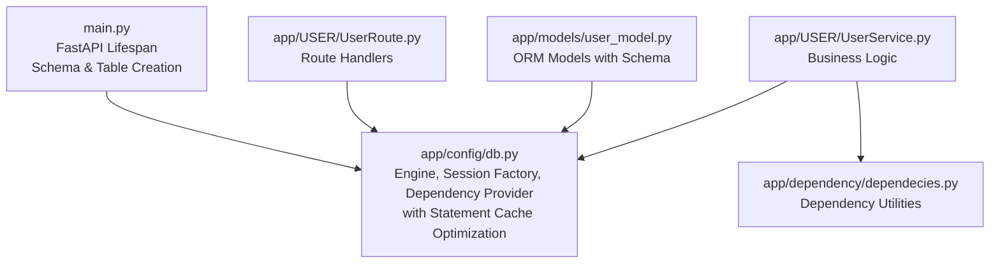
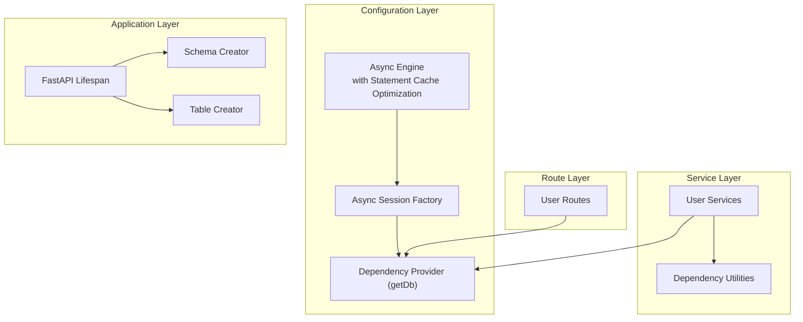
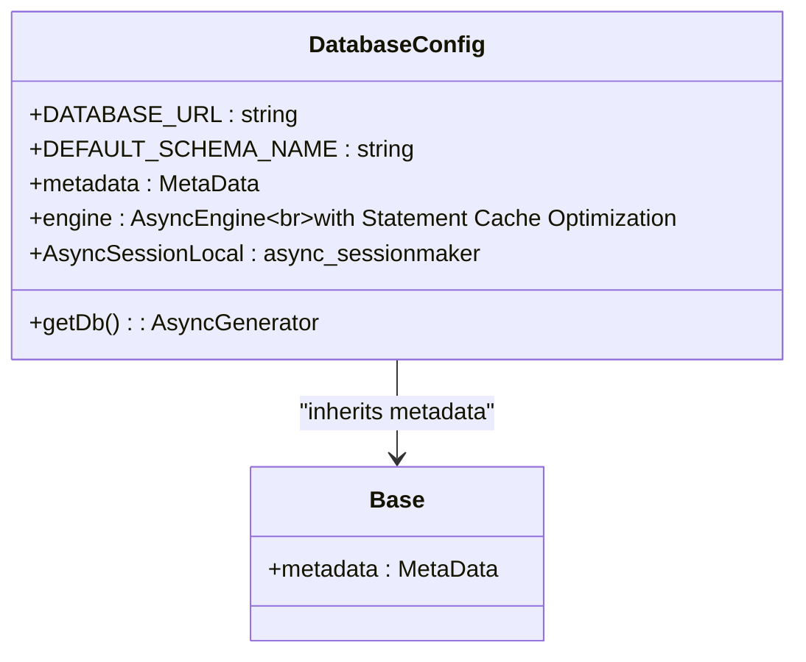
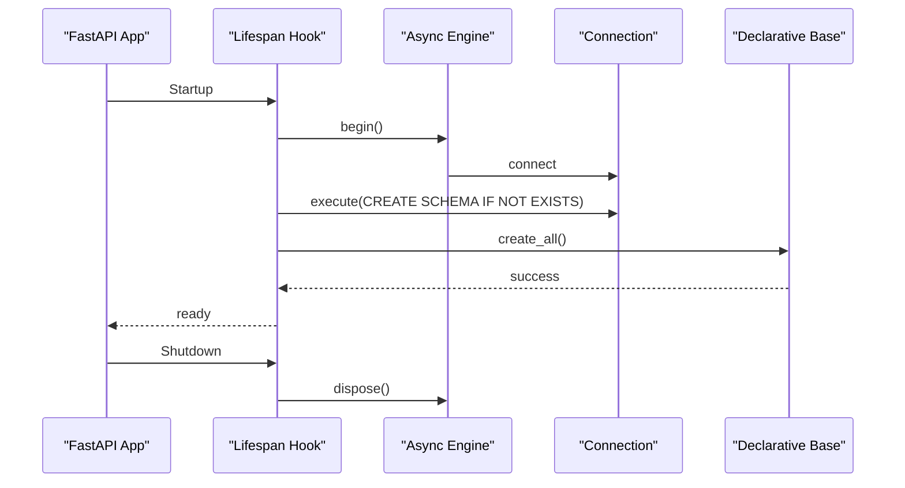
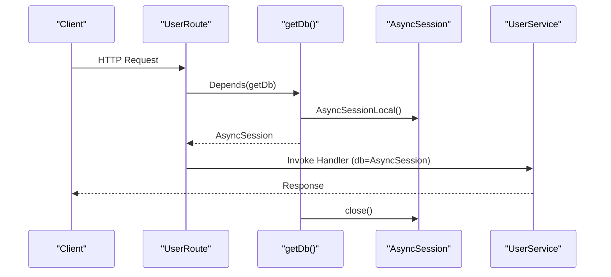
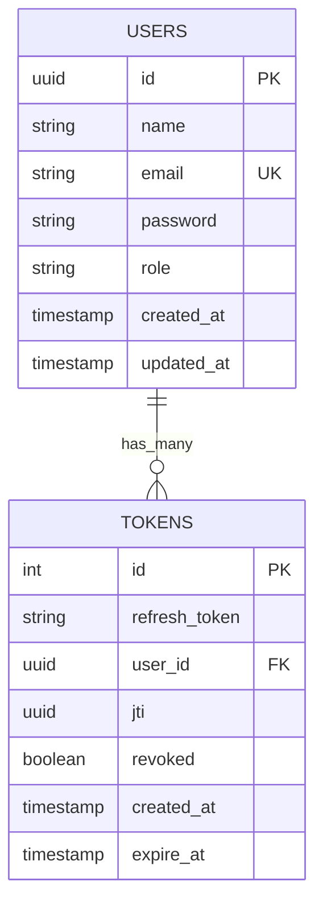
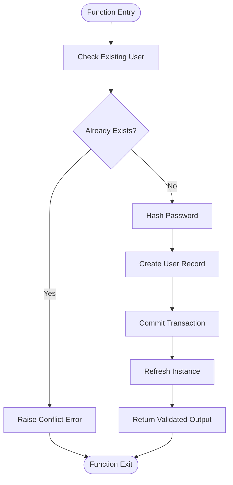
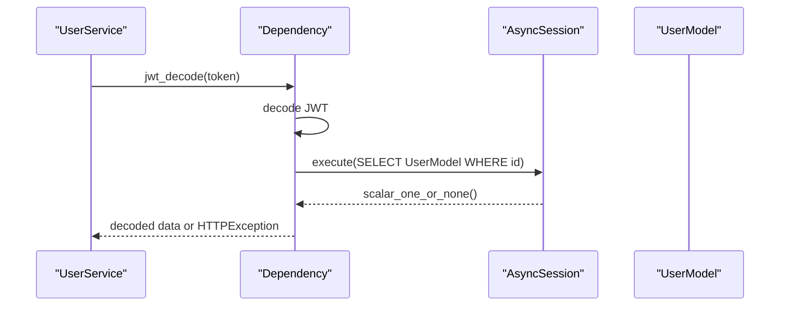
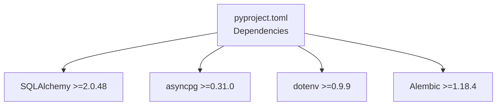

# Database Configuration and Connection Management

<cite>
**Referenced Files in This Document**
- [app/config/db.py](file://app/config/db.py)
- [main.py](file://main.py)
- [app/dependency/dependecies.py](file://app/dependency/dependecies.py)
- [app/models/user_model.py](file://app/models/user_model.py)
- [app/USER/UserRoute.py](file://app/USER/UserRoute.py)
- [app/USER/UserService.py](file://app/USER/UserService.py)
- [pyproject.toml](file://pyproject.toml)
- [docker-compose.yml](file://docker-compose.yml)
</cite>

## Update Summary
**Changes Made**
- Updated Core Components section to document the database connection optimization with statement cache configuration
- Enhanced Performance Considerations section with specific details about statement caching optimization
- Added new subsection under Performance Considerations for Statement Cache Optimization
- Updated Troubleshooting Guide to include statement cache related issues

## Table of Contents
1. [Introduction](#introduction)
2. [Project Structure](#project-structure)
3. [Core Components](#core-components)
4. [Architecture Overview](#architecture-overview)
5. [Detailed Component Analysis](#detailed-component-analysis)
6. [Dependency Analysis](#dependency-analysis)
7. [Performance Considerations](#performance-considerations)
8. [Troubleshooting Guide](#troubleshooting-guide)
9. [Conclusion](#conclusion)

## Introduction
This document provides a comprehensive analysis of the database configuration and connection management in the auth-service project. It focuses on how the application establishes asynchronous PostgreSQL connections, manages database sessions, creates schemas and tables, and integrates with FastAPI dependency injection. The analysis covers the SQLAlchemy async engine setup, session factory, dependency injection pattern, and practical usage across routes and services. Recent optimizations include statement cache configuration for improved long-running application performance.

## Project Structure
The database-related components are organized across several modules:
- Configuration module defines the async engine, base declarative class, session factory, and dependency provider with optimized connection settings.
- Application lifecycle hooks create the schema and tables during startup.
- Models define the database schema with explicit schema names.
- Routes and services consume database sessions via FastAPI dependencies.

**Diagram sources**
- [app/config/db.py:1-27](file://app/config/db.py#L1-L27)
- [main.py:1-41](file://main.py#L1-L41)
- [app/models/user_model.py:1-34](file://app/models/user_model.py#L1-L34)
- [app/USER/UserRoute.py:1-23](file://app/USER/UserRoute.py#L1-L23)
- [app/USER/UserService.py:1-105](file://app/USER/UserService.py#L1-L105)
- [app/dependency/dependecies.py:1-31](file://app/dependency/dependecies.py#L1-L31)

**Section sources**
- [app/config/db.py:1-27](file://app/config/db.py#L1-L27)
- [main.py:1-41](file://main.py#L1-L41)
- [app/models/user_model.py:1-34](file://app/models/user_model.py#L1-L34)
- [app/USER/UserRoute.py:1-23](file://app/USER/UserRoute.py#L1-L23)
- [app/USER/UserService.py:1-105](file://app/USER/UserService.py#L1-L105)
- [app/dependency/dependecies.py:1-31](file://app/dependency/dependecies.py#L1-L31)

## Core Components
This section examines the primary database configuration and connection management components.

- Asynchronous Engine and Session Factory
  - The async engine is created from a DATABASE_URL environment variable and configured with echo and future flags for compatibility.
  - **Updated**: Statement cache optimization is enabled via `connect_args={"statement_cache_size":0}` to prevent statement caching issues in long-running applications.
  - An async sessionmaker produces scoped sessions bound to the engine, with expire_on_commit disabled to maintain object state after commits.
  - A dependency provider yields a single-use async session within a context manager, ensuring proper cleanup and exception handling.

- Application Lifespan and Schema/Table Creation
  - During application startup, the lifespan hook connects to the engine, ensures the target schema exists, and creates all tables defined by the declarative base.
  - On shutdown, the engine is disposed to release resources.

- Model Definitions with Explicit Schema
  - Models specify their schema explicitly, aligning with the configured default schema name.
  - This ensures consistent schema usage across the application.

**Section sources**
- [app/config/db.py:10-27](file://app/config/db.py#L10-L27)
- [main.py:11-25](file://main.py#L11-L25)
- [app/models/user_model.py:8-34](file://app/models/user_model.py#L8-L34)

## Architecture Overview
The database architecture follows a layered pattern:
- Configuration layer sets up the async engine and session factory with optimized connection settings.
- Application layer manages schema and table creation during startup.
- Route layer injects database sessions into handlers.
- Service layer performs ORM operations using injected sessions.
- Dependency utilities encapsulate reusable logic.

**Diagram sources**
- [app/config/db.py:10-27](file://app/config/db.py#L10-L27)
- [main.py:11-25](file://main.py#L11-L25)
- [app/USER/UserRoute.py:1-23](file://app/USER/UserRoute.py#L1-L23)
- [app/USER/UserService.py:1-105](file://app/USER/UserService.py#L1-L105)
- [app/dependency/dependecies.py:1-31](file://app/dependency/dependecies.py#L1-L31)

## Detailed Component Analysis

### Database Configuration Module
The configuration module centralizes database setup with enhanced connection optimization:
- Environment-driven connection URL
- Declarative base with explicit schema metadata
- Async engine with echo and future flags plus statement cache optimization
- Async session factory with scoped sessions
- Dependency provider with exception handling

**Updated**: The engine configuration now includes `connect_args={"statement_cache_size":0}` to disable statement caching, preventing memory leaks and improving performance in long-running applications.

**Diagram sources**
- [app/config/db.py:10-27](file://app/config/db.py#L10-L27)

**Section sources**
- [app/config/db.py:10-27](file://app/config/db.py#L10-L27)

### Application Lifespan and Schema/Table Creation
The lifespan hook orchestrates schema and table creation:
- Connects to the engine at startup
- Creates the default schema if missing
- Creates all tables defined by the declarative base
- Handles exceptions and raises runtime errors on failure
- Disposes the engine on shutdown

**Diagram sources**
- [main.py:11-25](file://main.py#L11-L25)

**Section sources**
- [main.py:11-25](file://main.py#L11-L25)

### Dependency Injection Pattern
The dependency injection pattern ensures each request receives a fresh database session:
- Routes declare dependencies on AsyncSession
- The dependency provider yields a session within a context manager
- Sessions are automatically closed after use
- Exceptions are caught and re-raised appropriately

**Diagram sources**
- [app/USER/UserRoute.py:10-22](file://app/USER/UserRoute.py#L10-L22)
- [app/config/db.py:20-27](file://app/config/db.py#L20-L27)
- [app/USER/UserService.py:13-62](file://app/USER/UserService.py#L13-L62)

**Section sources**
- [app/USER/UserRoute.py:10-22](file://app/USER/UserRoute.py#L10-L22)
- [app/config/db.py:20-27](file://app/config/db.py#L20-L27)
- [app/USER/UserService.py:13-62](file://app/USER/UserService.py#L13-L62)

### Model Definitions and Schema Alignment
Models define the database structure with explicit schema usage:
- Users table with UUID primary key, unique email index, role, timestamps
- Refresh tokens table with foreign key to users, revocation flag, expiration
- Both tables specify the default schema name

**Diagram sources**
- [app/models/user_model.py:8-34](file://app/models/user_model.py#L8-L34)

**Section sources**
- [app/models/user_model.py:8-34](file://app/models/user_model.py#L8-L34)

### Service Layer Usage of Database Sessions
Services perform CRUD operations using injected sessions:
- User registration checks for existing emails, hashes passwords, persists user, and returns validated output
- User sign-in validates credentials, manages refresh tokens, stores hashed refresh tokens, and sets cookies
- Token refresh validates stored tokens, marks old tokens as revoked, issues new tokens, and updates storage

**Diagram sources**
- [app/USER/UserService.py:13-23](file://app/USER/UserService.py#L13-L23)

**Section sources**
- [app/USER/UserService.py:13-23](file://app/USER/UserService.py#L13-L23)

### Dependency Utilities for Token Validation
Dependency utilities integrate JWT decoding with database verification:
- Decodes JWT tokens and validates user existence
- Returns decoded data for successful validation or raises HTTP exceptions for invalid tokens or missing users

**Diagram sources**
- [app/dependency/dependecies.py:13-30](file://app/dependency/dependecies.py#L13-L30)

**Section sources**
- [app/dependency/dependecies.py:13-30](file://app/dependency/dependecies.py#L13-L30)

## Dependency Analysis
External dependencies supporting database connectivity and configuration:
- SQLAlchemy 2.x for ORM and async support
- asyncpg as the PostgreSQL driver
- python-dotenv for environment variable loading
- Alembic for database migrations

**Diagram sources**
- [pyproject.toml:7-16](file://pyproject.toml#L7-L16)

**Section sources**
- [pyproject.toml:7-16](file://pyproject.toml#L7-L16)

## Performance Considerations
- Async I/O: Using async sessions enables concurrent database operations without blocking the event loop.
- Session Scope: Sessions are short-lived per request, reducing contention and memory footprint.
- Schema Isolation: Explicit schema usage prevents table name collisions and simplifies maintenance.
- Connection Pooling: The async engine manages connection pooling internally; avoid creating unnecessary sessions outside the dependency provider.
- Indexing: Unique and indexed columns (e.g., user email) improve lookup performance.
- **Statement Cache Optimization**: The engine is configured with `connect_args={"statement_cache_size":0}` to disable statement caching, preventing memory leaks and improving performance in long-running applications.

**Updated**: The statement cache optimization is specifically designed to address issues that can occur in long-running applications where cached prepared statements may cause memory leaks or performance degradation. This configuration ensures that prepared statements are not cached at the connection level, allowing the database driver to manage statement preparation more efficiently.

## Troubleshooting Guide
Common issues and resolutions:
- Database Connection Failure
  - Verify DATABASE_URL environment variable is set correctly.
  - Ensure the PostgreSQL service is reachable and credentials are valid.
  - Check Docker Compose configuration for port mappings and service health.

- Schema/Table Creation Errors
  - Confirm the default schema name matches expectations.
  - Review permissions for schema creation and table creation.
  - Check for conflicting table definitions or missing migrations.

- Session Management Issues
  - Ensure sessions are acquired via the dependency provider and not manually instantiated.
  - Avoid sharing sessions across requests or threads.
  - Handle exceptions properly to prevent session leaks.

- JWT and Token Validation Failures
  - Verify SECRET environment variable is set and consistent.
  - Check token expiration and revocation logic in services.
  - Confirm refresh token hashing and storage mechanisms.

- **Statement Cache Related Issues**
  - **Memory Leaks**: If experiencing memory growth in long-running applications, verify that statement cache is properly disabled via `connect_args={"statement_cache_size":0}`.
  - **Performance Degradation**: Monitor query performance; statement cache optimization should prevent performance issues in applications with frequent prepared statement reuse.
  - **Connection Pool Issues**: Check for connection pool exhaustion; statement cache optimization helps prevent connection state corruption that could lead to pool issues.

**Updated**: Added troubleshooting guidance for statement cache related issues, particularly focusing on memory leaks and performance degradation in long-running applications.

**Section sources**
- [main.py:18-20](file://main.py#L18-L20)
- [app/config/db.py:16](file://app/config/db.py#L16)
- [app/dependency/dependecies.py:13-30](file://app/dependency/dependecies.py#L13-L30)

## Conclusion
The auth-service implements robust database configuration and connection management using SQLAlchemy's async capabilities. The design leverages FastAPI's dependency injection to provide isolated, short-lived sessions per request, ensuring thread safety and efficient resource usage. The application lifecycle hook guarantees schema and table initialization, while model definitions enforce schema alignment. 

**Updated**: Recent optimizations include statement cache configuration that prevents memory leaks and improves performance in long-running applications. The database connection is now optimized with `connect_args={"statement_cache_size":0}`, ensuring that prepared statements are not cached at the connection level, which addresses potential issues with statement caching in production environments. Together, these components form a scalable and maintainable foundation for database operations.