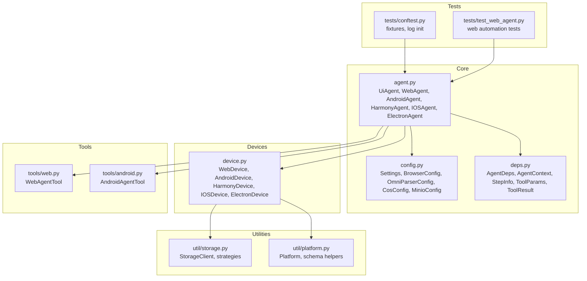
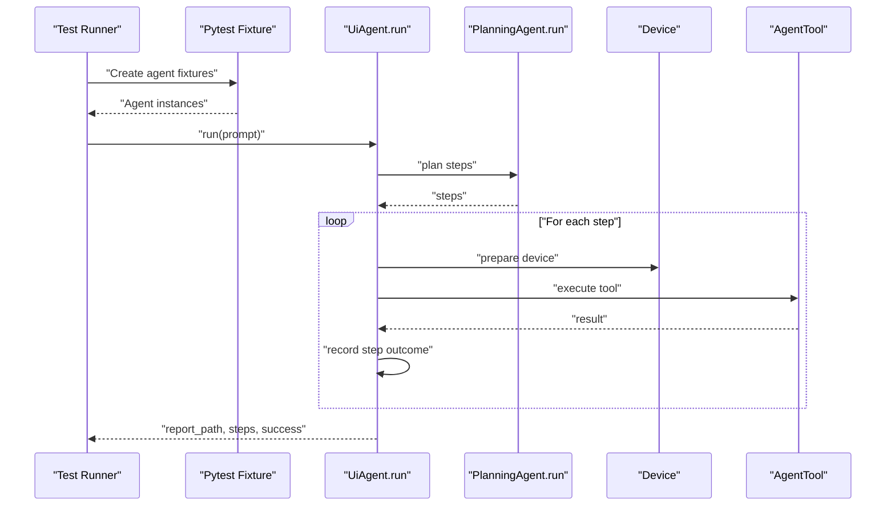
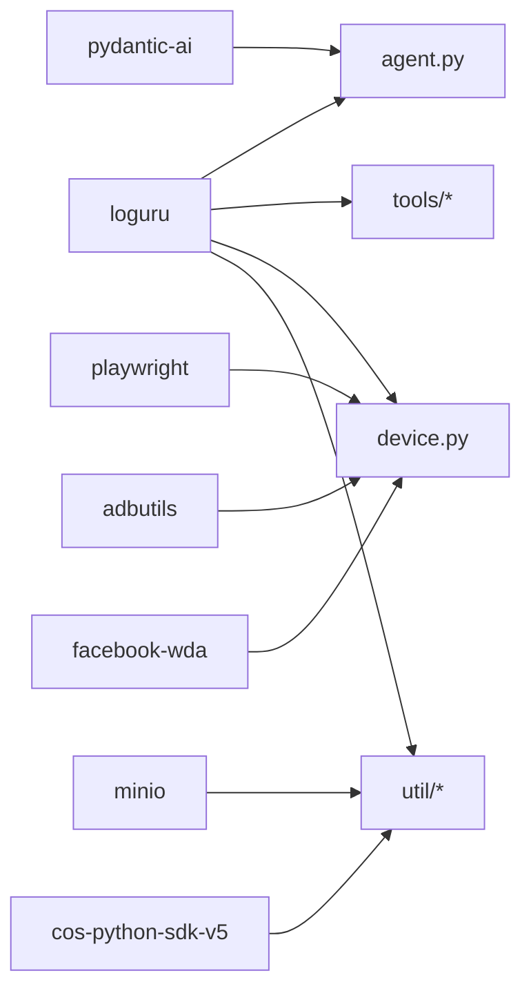

# Debugging and Profiling

<cite>
**Referenced Files in This Document**
- [__init__.py](file://src/page_eyes/__init__.py)
- [config.py](file://src/page_eyes/config.py)
- [agent.py](file://src/page_eyes/agent.py)
- [deps.py](file://src/page_eyes/deps.py)
- [device.py](file://src/page_eyes/device.py)
- [web.py](file://src/page_eyes/tools/web.py)
- [android.py](file://src/page_eyes/tools/android.py)
- [storage.py](file://src/page_eyes/util/storage.py)
- [platform.py](file://src/page_eyes/util/platform.py)
- [conftest.py](file://tests/conftest.py)
- [test_web_agent.py](file://tests/test_web_agent.py)
- [pyproject.toml](file://pyproject.toml)
</cite>

## Table of Contents
1. [Introduction](#introduction)
2. [Project Structure](#project-structure)
3. [Core Components](#core-components)
4. [Architecture Overview](#architecture-overview)
5. [Detailed Component Analysis](#detailed-component-analysis)
6. [Dependency Analysis](#dependency-analysis)
7. [Performance Considerations](#performance-considerations)
8. [Troubleshooting Guide](#troubleshooting-guide)
9. [Conclusion](#conclusion)
10. [Appendices](#appendices)

## Introduction
This document provides advanced debugging and profiling techniques for PageEyes Agent. It focuses on structured logging with Loguru, log level management, and contextual logging patterns across automation stages. It also covers trace analysis for execution flow and timing, performance bottleneck identification, multi-platform debugging (device-specific, browser inspection, mobile device debugging), profiling methodologies (memory leaks, CPU hotspots, I/O bottlenecks), remote debugging and distributed tracing for multi-device scenarios, and automated diagnostic reporting. Guidance is grounded in the repository’s code and testing configuration.

## Project Structure
The repository organizes automation around agents, devices, tools, and utilities. Logging is centralized via Loguru, configuration is managed through Pydantic settings, and multi-platform device abstractions encapsulate platform-specific behaviors. Tests demonstrate fixture-based initialization and runtime debugging hooks.

**Diagram sources**
- [agent.py](file://src/page_eyes/agent.py)
- [config.py](file://src/page_eyes/config.py)
- [deps.py](file://src/page_eyes/deps.py)
- [device.py](file://src/page_eyes/device.py)
- [web.py](file://src/page_eyes/tools/web.py)
- [android.py](file://src/page_eyes/tools/android.py)
- [storage.py](file://src/page_eyes/util/storage.py)
- [platform.py](file://src/page_eyes/util/platform.py)
- [conftest.py](file://tests/conftest.py)
- [test_web_agent.py](file://tests/test_web_agent.py)

**Section sources**
- [agent.py](file://src/page_eyes/agent.py)
- [config.py](file://src/page_eyes/config.py)
- [deps.py](file://src/page_eyes/deps.py)
- [device.py](file://src/page_eyes/device.py)
- [web.py](file://src/page_eyes/tools/web.py)
- [android.py](file://src/page_eyes/tools/android.py)
- [storage.py](file://src/page_eyes/util/storage.py)
- [platform.py](file://src/page_eyes/util/platform.py)
- [conftest.py](file://tests/conftest.py)
- [test_web_agent.py](file://tests/test_web_agent.py)

## Core Components
- Structured logging with Loguru: Used pervasively across agents, tools, and utilities for info, debug, warning, and error logs. Tests initialize Loguru to INFO level for consistent visibility.
- Settings and configuration: Centralized via Pydantic settings with environment variable overrides and .env loading. Includes browser headless mode, device simulation, and debug toggle.
- Multi-device abstraction: Web, Android, Harmony, iOS, and Electron devices encapsulate platform-specific connection and lifecycle management.
- Tooling: Web and Android tools implement actions (open_url, click, input, swipe, teardown) with contextual logging and error handling.
- Diagnostic reporting: HTML report generation with step-level outcomes and device metrics.

**Section sources**
- [__init__.py](file://src/page_eyes/__init__.py)
- [config.py](file://src/page_eyes/config.py)
- [agent.py](file://src/page_eyes/agent.py)
- [deps.py](file://src/page_eyes/deps.py)
- [web.py](file://src/page_eyes/tools/web.py)
- [android.py](file://src/page_eyes/tools/android.py)
- [storage.py](file://src/page_eyes/util/storage.py)
- [conftest.py](file://tests/conftest.py)

## Architecture Overview
The agent orchestrates planning and execution across platforms. It builds a Pydantic AI agent with tools and capabilities, iterates through steps, and records context and outcomes. Devices abstract platform specifics; tools implement atomic actions; utilities provide storage and platform helpers.

**Diagram sources**
- [agent.py](file://src/page_eyes/agent.py)
- [deps.py](file://src/page_eyes/deps.py)
- [device.py](file://src/page_eyes/device.py)
- [web.py](file://src/page_eyes/tools/web.py)
- [android.py](file://src/page_eyes/tools/android.py)
- [conftest.py](file://tests/conftest.py)

## Detailed Component Analysis

### Structured Logging with Loguru
- Initialization and level management:
  - Environment variables and .env are loaded early to influence settings and logging behavior.
  - Pytest conftest initializes Loguru to INFO globally for consistent test output.
- Contextual logging patterns:
  - Agent logs planning, step transitions, tool calls, and results with appropriate levels.
  - Tools log preconditions, actions, and outcomes; device creation logs connection attempts and statuses.
  - Utilities log warnings for image conversion and errors for upload failures.

Recommended practices:
- Keep INFO for major orchestration events, DEBUG for granular tool and device operations.
- Use contextual keys (e.g., step number, tool name, coordinates) to enrich logs for traceability.
- Avoid verbose DEBUG in production; enable per-module DEBUG only during targeted investigations.

**Section sources**
- [__init__.py](file://src/page_eyes/__init__.py)
- [conftest.py](file://tests/conftest.py)
- [agent.py](file://src/page_eyes/agent.py)
- [web.py](file://src/page_eyes/tools/web.py)
- [device.py](file://src/page_eyes/device.py)
- [storage.py](file://src/page_eyes/util/storage.py)

### Trace Analysis and Execution Flow
- Step tracking:
  - AgentContext maintains ordered steps and current step metadata, enabling post-run diagnostics.
  - StepInfo captures action, params, image_url, screen_elements, and success flags.
- Graph iteration:
  - The agent iterates over model response nodes, logging thinking, tool calls, and tool results.
- Reporting:
  - HTML reports summarize success/failure per step and device metrics.

Techniques:
- Correlate step logs with screenshots and screen elements captured during actions.
- Use step-level success flags to isolate failing stages and re-run with increased verbosity.
- Export usage metrics and steps for external analysis.

**Section sources**
- [agent.py](file://src/page_eyes/agent.py)
- [deps.py](file://src/page_eyes/deps.py)

### Timing Measurements and Bottlenecks
- Where to measure:
  - Device creation and connection (e.g., WebDriverAgent, persistent contexts).
  - Tool operations (navigation, clicks, input, swipes).
  - Storage uploads and conversions (image compression, base64 fallbacks).
- How to measure:
  - Wrap critical sections with timing around device creation and tool calls.
  - Track network idle waits and explicit delays (e.g., after_delay in tools).
  - Monitor storage latency and failure retries.

Common bottlenecks:
- Network idle waits and page loads.
- Scroll vs mouse swipe selection depending on platform.
- Image conversion and upload overhead.

**Section sources**
- [device.py](file://src/page_eyes/device.py)
- [web.py](file://src/page_eyes/tools/web.py)
- [storage.py](file://src/page_eyes/util/storage.py)

### Multi-Platform Debugging Strategies
- Web (desktop and mobile emulation):
  - Use headless vs visible modes to diagnose rendering issues.
  - Enable device emulation to reproduce mobile-specific behaviors.
  - Inspect elements and highlight positions via injected styles.
- Android:
  - Verify ADB connectivity and device selection.
  - Use shell commands to open URLs and inspect app state.
- Harmony:
  - Connect via HDC and confirm window size retrieval.
- iOS:
  - Validate WebDriverAgent status and session establishment.
  - Optionally auto-start WDA with configured UDID and project path.
- Electron:
  - Connect via CDP; ensure remote debugging port is exposed.
  - Observe page stack changes and window closures.

**Section sources**
- [config.py](file://src/page_eyes/config.py)
- [device.py](file://src/page_eyes/device.py)
- [android.py](file://src/page_eyes/tools/android.py)

### Browser Inspection and Mobile Device Debugging Interfaces
- Web:
  - Persistent context launched with Chrome channel and optional headless mode.
  - Device emulation via Playwright devices dictionary.
- iOS:
  - WDA client status checks and session creation.
  - Optional auto-start of WebDriverAgent with xcodebuild.
- Electron:
  - Chromium connect over CDP; observe page lifecycle and window switching.

**Section sources**
- [device.py](file://src/page_eyes/device.py)

### Profiling Methodologies
- Memory leaks:
  - Monitor long-running sessions and repeated device/context creation.
  - Ensure proper cleanup in tool teardown and context close.
- CPU hotspots:
  - Focus on repeated scroll/swipe loops and keyword-searched swipes.
  - Reduce unnecessary screenshots and highlight overlays.
- I/O bottlenecks:
  - Storage strategy selection and image conversion costs.
  - Network waits and retries for device connections.

Recommendations:
- Profile under realistic loads; compare headless vs visible modes.
- Measure tool durations and storage operations separately.
- Use platform-specific profilers (e.g., macOS Instruments for iOS, Chrome DevTools for web).

**Section sources**
- [web.py](file://src/page_eyes/tools/web.py)
- [storage.py](file://src/page_eyes/util/storage.py)
- [device.py](file://src/page_eyes/device.py)

### Remote Debugging and Distributed Tracing
- Remote debugging:
  - Electron via CDP address.
  - iOS via WebDriverAgent URL.
  - Web via persistent context and optional headless mode.
- Distributed tracing:
  - Correlate logs by step index, device identifiers, and tool names.
  - Attach report paths and usage metrics to traces for post-mortem analysis.

**Section sources**
- [agent.py](file://src/page_eyes/agent.py)
- [device.py](file://src/page_eyes/device.py)

### Automated Diagnostic Reporting
- Report generation:
  - HTML report created per run with timestamped filename and embedded step data.
  - Report includes success flags, device size, and step details.
- Usage and steps:
  - Aggregate usage metrics and step outputs for downstream analysis.

**Section sources**
- [agent.py](file://src/page_eyes/agent.py)

## Dependency Analysis
Loguru is a first-party dependency, while Pydantic AI and related packages are declared in the project configuration. The agent depends on settings, devices, and tools; devices depend on platform clients; tools depend on devices and JS helpers; utilities depend on storage backends.

**Diagram sources**
- [pyproject.toml](file://pyproject.toml)
- [agent.py](file://src/page_eyes/agent.py)
- [device.py](file://src/page_eyes/device.py)
- [web.py](file://src/page_eyes/tools/web.py)
- [storage.py](file://src/page_eyes/util/storage.py)

**Section sources**
- [pyproject.toml](file://pyproject.toml)
- [agent.py](file://src/page_eyes/agent.py)
- [device.py](file://src/page_eyes/device.py)
- [web.py](file://src/page_eyes/tools/web.py)
- [storage.py](file://src/page_eyes/util/storage.py)

## Performance Considerations
- Prefer visible mode only when necessary; use headless for speed.
- Minimize repeated screenshots and highlight overlays.
- Optimize swipe strategies: use native scroll when available; otherwise mouse-based swipes.
- Cache and reuse contexts where safe; ensure proper teardown to avoid resource leaks.
- Use storage strategies judiciously; compress images and avoid redundant uploads.

[No sources needed since this section provides general guidance]

## Troubleshooting Guide
- Logging level:
  - Set global level to INFO or lower for detailed traces; revert to WARNING in production.
  - Initialize Loguru in test harnesses to ensure consistent output.
- Device connectivity:
  - Verify ADB/HDC/WDA/CDP endpoints and ports.
  - Confirm device availability and permissions.
- Tool failures:
  - Inspect tool logs for coordinates, timeouts, and element expectations.
  - Review step outcomes and screen elements captured during failures.
- Storage issues:
  - Check strategy selection and credentials; fall back to base64 when needed.
- Report analysis:
  - Use generated HTML reports to correlate steps, outcomes, and device metrics.

**Section sources**
- [conftest.py](file://tests/conftest.py)
- [agent.py](file://src/page_eyes/agent.py)
- [device.py](file://src/page_eyes/device.py)
- [web.py](file://src/page_eyes/tools/web.py)
- [storage.py](file://src/page_eyes/util/storage.py)

## Conclusion
PageEyes Agent integrates structured logging, robust device abstractions, and actionable reporting to support advanced debugging and profiling. By leveraging contextual logs, step tracking, and platform-specific inspection tools, teams can quickly identify bottlenecks, isolate failures, and improve reliability across web, mobile, and desktop targets. Adopt the recommended practices to maintain visibility, reproducibility, and performance.

[No sources needed since this section summarizes without analyzing specific files]

## Appendices

### Appendix A: Logging Levels and Context Patterns
- Levels: Use INFO for orchestration, DEBUG for operations, WARNING for recoverable issues, ERROR for failures.
- Context: Include step index, tool name, coordinates, device size, and action parameters.

**Section sources**
- [agent.py](file://src/page_eyes/agent.py)
- [web.py](file://src/page_eyes/tools/web.py)
- [device.py](file://src/page_eyes/device.py)

### Appendix B: Test Harness and Fixture-Based Debugging
- Fixtures initialize agents with debug toggles and platform-specific parameters.
- Electron fixtures manage CDP port readiness and app lifecycle.

**Section sources**
- [conftest.py](file://tests/conftest.py)
- [test_web_agent.py](file://tests/test_web_agent.py)