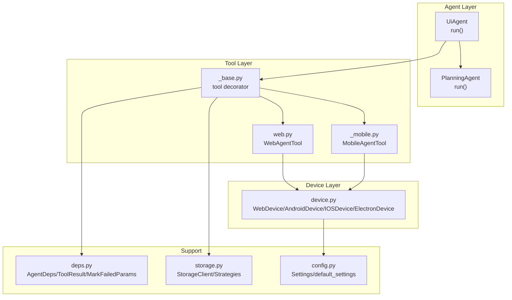
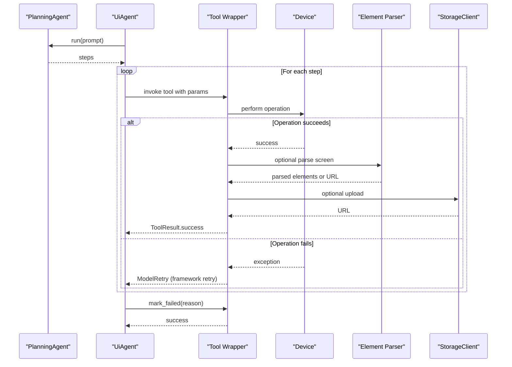
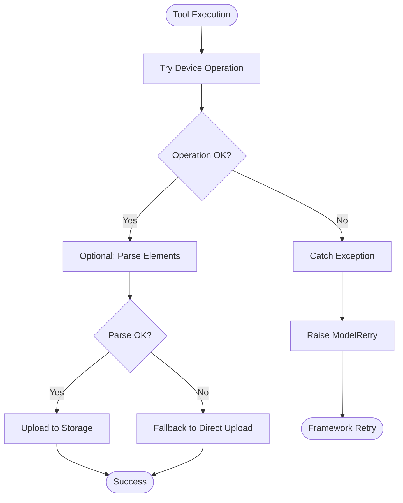
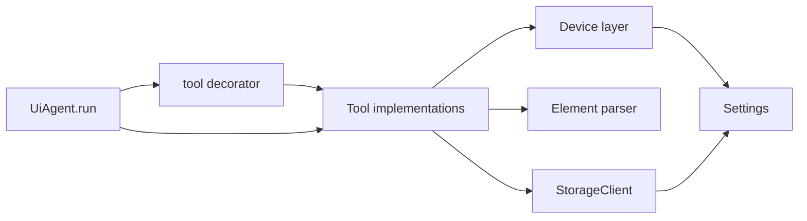

# Error Handling and Recovery

<cite>
**Referenced Files in This Document**
- [agent.py](file://src/page_eyes/agent.py)
- [deps.py](file://src/page_eyes/deps.py)
- [_base.py](file://src/page_eyes/tools/_base.py)
- [web.py](file://src/page_eyes/tools/web.py)
- [_mobile.py](file://src/page_eyes/tools/_mobile.py)
- [device.py](file://src/page_eyes/device.py)
- [config.py](file://src/page_eyes/config.py)
- [storage.py](file://src/page_eyes/util/storage.py)
- [platform.py](file://src/page_eyes/util/platform.py)
- [test_web_agent.py](file://tests/test_web_agent.py)
- [test_android_agent.py](file://tests/test_android_agent.py)
- [test_ios_agent.py](file://tests/test_ios_agent.py)
</cite>

## Table of Contents
1. [Introduction](#introduction)
2. [Project Structure](#project-structure)
3. [Core Components](#core-components)
4. [Architecture Overview](#architecture-overview)
5. [Detailed Component Analysis](#detailed-component-analysis)
6. [Dependency Analysis](#dependency-analysis)
7. [Performance Considerations](#performance-considerations)
8. [Troubleshooting Guide](#troubleshooting-guide)
9. [Conclusion](#conclusion)
10. [Appendices](#appendices)

## Introduction
This document provides advanced error handling and recovery strategies for PageEyes Agent. It covers classification of common failure modes (network, device connectivity, element recognition, AI planning), retry mechanisms, graceful degradation, platform-specific exception handling, error propagation and fallbacks, user notification patterns, logging best practices, and troubleshooting workflows for partial automation failures.

## Project Structure
The error handling and recovery logic spans several modules:
- Agent orchestration and planning with built-in retries and failure marking
- Tool wrappers that centralize error handling and retries
- Device connection and platform-specific connectivity helpers
- Element parsing and screen capture with robust fallbacks
- Cloud storage upload strategies with fallbacks
- Configuration-driven behavior and environment-aware defaults

**Diagram sources**
- [agent.py:80-314](file://src/page_eyes/agent.py#L80-L314)
- [_base.py:88-128](file://src/page_eyes/tools/_base.py#L88-L128)
- [web.py:24-179](file://src/page_eyes/tools/web.py#L24-L179)
- [_mobile.py:27-165](file://src/page_eyes/tools/_mobile.py#L27-L165)
- [device.py:54-390](file://src/page_eyes/device.py#L54-L390)
- [deps.py:75-280](file://src/page_eyes/deps.py#L75-L280)
- [storage.py:154-193](file://src/page_eyes/util/storage.py#L154-L193)
- [config.py:54-73](file://src/page_eyes/config.py#L54-L73)

**Section sources**
- [agent.py:80-314](file://src/page_eyes/agent.py#L80-L314)
- [deps.py:75-280](file://src/page_eyes/deps.py#L75-L280)
- [_base.py:88-128](file://src/page_eyes/tools/_base.py#L88-L128)
- [web.py:24-179](file://src/page_eyes/tools/web.py#L24-L179)
- [_mobile.py:27-165](file://src/page_eyes/tools/_mobile.py#L27-L165)
- [device.py:54-390](file://src/page_eyes/device.py#L54-L390)
- [storage.py:154-193](file://src/page_eyes/util/storage.py#L154-L193)
- [config.py:54-73](file://src/page_eyes/config.py#L54-L73)

## Core Components
- Agent orchestration with retries and failure marking:
  - The UI agent runs a planning phase and then executes steps, catching AI planning errors and marking failures via a dedicated tool.
  - Built-in retries are configured at the agent level to improve resilience against transient LLM behavior.
- Tool wrapper with centralized error handling:
  - The tool decorator wraps tool functions, capturing exceptions and raising a retry signal to the underlying framework.
  - Tools record step metadata and success status, enabling granular diagnostics and reporting.
- Device connectivity helpers:
  - Device creation includes explicit connection attempts and fallbacks (e.g., iOS WebDriverAgent startup and retries).
- Element parsing and screen capture:
  - Parsing failures trigger immediate errors; optional cloud storage fallbacks are available for screenshots.
- Storage strategies:
  - Multiple upload strategies (COS, MinIO, Base64) with fallbacks and compression for large images.

**Section sources**
- [agent.py:80-314](file://src/page_eyes/agent.py#L80-L314)
- [_base.py:88-128](file://src/page_eyes/tools/_base.py#L88-L128)
- [_base.py:152-203](file://src/page_eyes/tools/_base.py#L152-L203)
- [device.py:180-228](file://src/page_eyes/device.py#L180-L228)
- [storage.py:154-193](file://src/page_eyes/util/storage.py#L154-L193)

## Architecture Overview
The error handling architecture centers around:
- Centralized tool invocation with retry semantics
- Device-layer connectivity with explicit reconnection and startup routines
- Parsing and upload failures with fallback strategies
- Agent-level failure marking and step-wise reporting

**Diagram sources**
- [agent.py:217-287](file://src/page_eyes/agent.py#L217-L287)
- [_base.py:88-128](file://src/page_eyes/tools/_base.py#L88-L128)
- [_base.py:152-203](file://src/page_eyes/tools/_base.py#L152-L203)
- [device.py:54-390](file://src/page_eyes/device.py#L54-L390)
- [storage.py:154-193](file://src/page_eyes/util/storage.py#L154-L193)

## Detailed Component Analysis

### Error Classification Patterns
- Network failures
  - Element parser and storage uploads use HTTP clients with timeouts; failures are logged and retried via tool decorators.
  - Storage strategies encapsulate service-specific exceptions and provide fallbacks.
- Device connectivity issues
  - iOS device connection attempts include startup of WebDriverAgent and iterative retries with delays.
  - Android/Harmony devices rely on adb/hdc connectivity; explicit connection checks and exceptions surface meaningful errors.
- Element recognition errors
  - Parsing failures raise exceptions; optional cloud storage fallbacks are available for screenshots.
- AI planning failures
  - Unexpected model behavior during planning is caught and converted to a step-level failure with a reason.

**Section sources**
- [_base.py:152-203](file://src/page_eyes/tools/_base.py#L152-L203)
- [storage.py:89-139](file://src/page_eyes/util/storage.py#L89-L139)
- [device.py:180-228](file://src/page_eyes/device.py#L180-L228)
- [agent.py:264-271](file://src/page_eyes/agent.py#L264-L271)

### Retry Mechanisms and Graceful Degradation
- Built-in agent retries
  - The UI agent is constructed with a retry count to mitigate transient LLM behavior.
- Tool-level retries
  - The tool decorator catches exceptions and raises a retry signal to the framework, allowing automatic retry without surfacing raw exceptions to the caller.
- Graceful degradation
  - When element parsing yields empty results, the system can fall back to uploading screenshots directly to storage.
  - Storage strategies fall back to Base64 embedding when external services are unavailable.

**Diagram sources**
- [_base.py:88-128](file://src/page_eyes/tools/_base.py#L88-L128)
- [_base.py:152-203](file://src/page_eyes/tools/_base.py#L152-L203)
- [storage.py:154-193](file://src/page_eyes/util/storage.py#L154-L193)

**Section sources**
- [agent.py:166](file://src/page_eyes/agent.py#L166)
- [_base.py:88-128](file://src/page_eyes/tools/_base.py#L88-L128)
- [_base.py:152-203](file://src/page_eyes/tools/_base.py#L152-L203)
- [storage.py:154-193](file://src/page_eyes/util/storage.py#L154-L193)

### Platform-Specific Exception Handling
- Web (Chromium/Puppeteer)
  - Navigation waits and element interactions use explicit timeouts; unexpected navigation outcomes are handled by retries.
- Mobile (Android/Harmony)
  - Direct device operations (click/input/swipe) are executed via platform SDKs; failures are surfaced as tool exceptions and retried.
- iOS (WebDriverAgent)
  - Connection attempts include startup of WebDriverAgent and iterative retries; failures are logged and escalated if startup fails.
- Desktop (Electron via CDP)
  - Window lifecycle events are monitored; closing windows triggers automatic fallback to the previous page.

**Section sources**
- [web.py:46-91](file://src/page_eyes/tools/web.py#L46-L91)
- [_mobile.py:62-84](file://src/page_eyes/tools/_mobile.py#L62-L84)
- [device.py:180-228](file://src/page_eyes/device.py#L180-L228)
- [device.py:294-322](file://src/page_eyes/device.py#L294-L322)

### Error Propagation Strategies and Fallbacks
- Step-level failure marking
  - Tools expose a dedicated method to mark a step as failed with a reason; this halts further execution and records the failure.
- Agent-level propagation
  - Planning failures are captured and converted into step-level failures; subsequent steps are skipped to prevent cascading errors.
- Fallback mechanisms
  - If element parsing fails, the system falls back to uploading screenshots directly.
  - Storage strategy selection prioritizes external services; otherwise, Base64 embedding is used.

**Section sources**
- [deps.py:236-238](file://src/page_eyes/deps.py#L236-L238)
- [agent.py:264-271](file://src/page_eyes/agent.py#L264-L271)
- [_base.py:322-347](file://src/page_eyes/tools/_base.py#L322-L347)
- [_base.py:152-203](file://src/page_eyes/tools/_base.py#L152-L203)
- [storage.py:162-186](file://src/page_eyes/util/storage.py#L162-L186)

### Logging Best Practices
- Structured logs with contextual information
  - Tool wrappers log exceptions and stack traces; trace IDs are propagated to downstream services for correlation.
- Actionable diagnostics
  - Screenshots and parsed element lists are recorded per step; failures are annotated with reasons and step parameters.
- Audit trail maintenance
  - Steps are persisted with timestamps, actions, parameters, and outcomes; reports summarize success across steps.

**Section sources**
- [_base.py:112-118](file://src/page_eyes/tools/_base.py#L112-L118)
- [_base.py:152-203](file://src/page_eyes/tools/_base.py#L152-L203)
- [agent.py:292-313](file://src/page_eyes/agent.py#L292-L313)

### Troubleshooting Workflows
- Partial automation failures
  - On failure, the system marks the current step as failed, continues to generate a report, and stops further execution.
  - Review the step’s parameters, action, and image URL to diagnose the cause.
- Network/storage failures
  - Verify storage credentials and endpoints; confirm service availability; inspect fallback behavior.
- Device connectivity issues
  - Reconnect devices, ensure drivers/services are running, and check platform-specific startup logs.

**Section sources**
- [agent.py:286-287](file://src/page_eyes/agent.py#L286-L287)
- [storage.py:89-139](file://src/page_eyes/util/storage.py#L89-L139)
- [device.py:180-228](file://src/page_eyes/device.py#L180-L228)

## Dependency Analysis
The error handling pathways depend on:
- Tool wrapper decorators for centralized exception handling and retries
- Device creation and connection routines for platform-specific connectivity
- Element parsing and storage upload for robustness against partial failures
- Configuration for model settings, storage clients, and environment overrides

**Diagram sources**
- [_base.py:88-128](file://src/page_eyes/tools/_base.py#L88-L128)
- [_base.py:152-203](file://src/page_eyes/tools/_base.py#L152-L203)
- [device.py:54-390](file://src/page_eyes/device.py#L54-L390)
- [storage.py:154-193](file://src/page_eyes/util/storage.py#L154-L193)
- [config.py:54-73](file://src/page_eyes/config.py#L54-L73)
- [agent.py:217-287](file://src/page_eyes/agent.py#L217-L287)

**Section sources**
- [_base.py:88-128](file://src/page_eyes/tools/_base.py#L88-L128)
- [_base.py:152-203](file://src/page_eyes/tools/_base.py#L152-L203)
- [device.py:54-390](file://src/page_eyes/device.py#L54-L390)
- [storage.py:154-193](file://src/page_eyes/util/storage.py#L154-L193)
- [config.py:54-73](file://src/page_eyes/config.py#L54-L73)
- [agent.py:217-287](file://src/page_eyes/agent.py#L217-L287)

## Performance Considerations
- Retries and delays
  - Tool wrappers introduce small delays before and after operations to allow UI stability; tune these based on target platform responsiveness.
- Parsing overhead
  - Element parsing adds latency; consider disabling parsing when only screenshots are needed for performance-sensitive flows.
- Storage uploads
  - Large images are compressed; ensure storage endpoints are close to reduce latency.

[No sources needed since this section provides general guidance]

## Troubleshooting Guide
- Unexpected model behavior during planning
  - The agent catches and converts the error into a step-level failure; review the reason and rerun with refined prompts.
- Tool execution failures
  - Inspect the logged exception and stack trace; the tool decorator raises a retry signal to the framework.
- Element parsing failures
  - If parsing returns empty content, the system falls back to direct upload; verify parser service availability and keys.
- Storage upload failures
  - Confirm credentials and endpoint reachability; the system falls back to Base64 when external services fail.
- iOS device connection issues
  - Ensure WebDriverAgent is installed and reachable; the device layer attempts startup and retries; check logs for startup outcomes.

**Section sources**
- [agent.py:264-271](file://src/page_eyes/agent.py#L264-L271)
- [_base.py:112-118](file://src/page_eyes/tools/_base.py#L112-L118)
- [_base.py:152-203](file://src/page_eyes/tools/_base.py#L152-L203)
- [storage.py:89-139](file://src/page_eyes/util/storage.py#L89-L139)
- [device.py:180-228](file://src/page_eyes/device.py#L180-L228)

## Conclusion
PageEyes Agent employs a layered error handling strategy: centralized tool wrappers with retry semantics, robust device connectivity routines, resilient element parsing and storage fallbacks, and agent-level failure marking. These patterns enable graceful degradation, actionable diagnostics, and reliable partial automation recovery across diverse platforms and environments.

[No sources needed since this section summarizes without analyzing specific files]

## Appendices
- Example test scenarios that exercise error conditions:
  - Web agent tests covering element not found, sliding until presence, and concurrent tool execution constraints.
  - Android and iOS agent tests covering app opening, search, sliding, and assertion failures.

**Section sources**
- [test_web_agent.py:69-113](file://tests/test_web_agent.py#L69-L113)
- [test_android_agent.py:11-34](file://tests/test_android_agent.py#L11-L34)
- [test_ios_agent.py:126-132](file://tests/test_ios_agent.py#L126-L132)