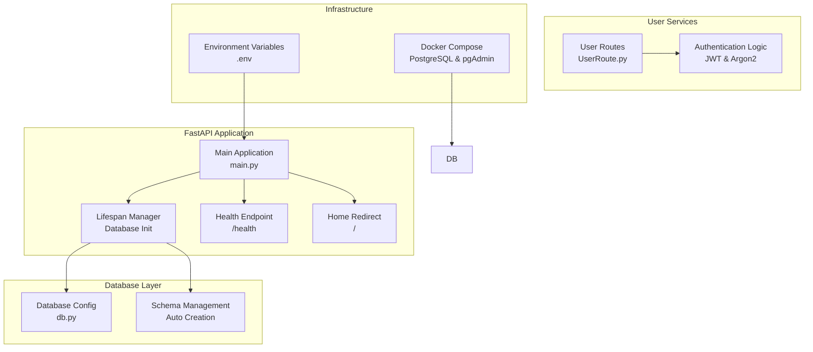
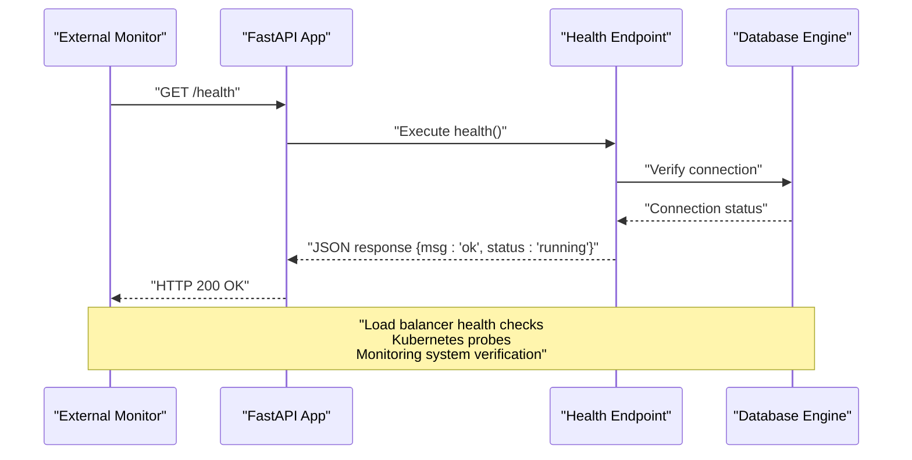
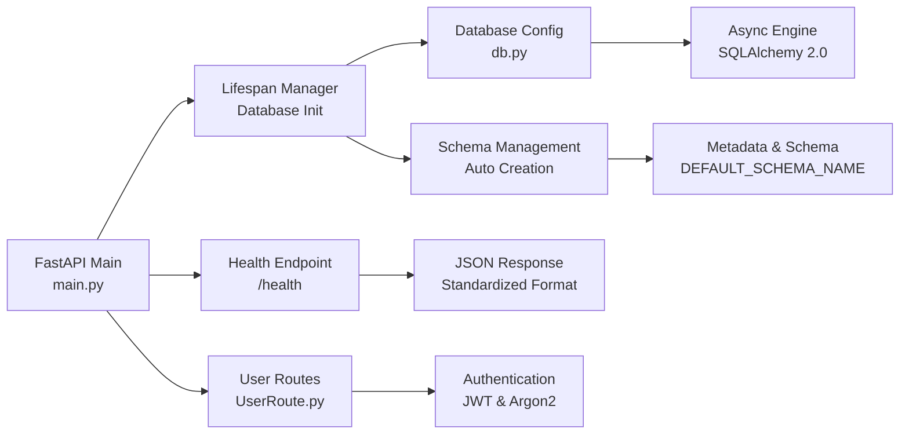

# Monitoring and Observability

<cite>
**Referenced Files in This Document**
- [main.py](file://main.py)
- [README.md](file://README.md)
- [docker-compose.yml](file://docker-compose.yml)
- [app/USER/UserRoute.py](file://app/USER/UserRoute.py)
- [app/config/db.py](file://app/config/db.py)
</cite>

## Update Summary
**Changes Made**
- Added comprehensive documentation for the new health monitoring endpoint system
- Updated health checks section to include the /health endpoint implementation
- Enhanced monitoring architecture overview with health endpoint integration
- Added practical examples of health endpoint usage and monitoring configurations
- Updated troubleshooting guide with health endpoint specific issues

## Table of Contents
1. [Introduction](#introduction)
2. [Project Structure](#project-structure)
3. [Core Components](#core-components)
4. [Architecture Overview](#architecture-overview)
5. [Detailed Component Analysis](#detailed-component-analysis)
6. [Dependency Analysis](#dependency-analysis)
7. [Performance Considerations](#performance-considerations)
8. [Troubleshooting Guide](#troubleshooting-guide)
9. [Conclusion](#conclusion)
10. [Appendices](#appendices)

## Introduction
This document provides a comprehensive guide to monitoring and observability for the Auth Service deployment. It focuses on metrics collection strategies, alerting configuration, dashboard creation, logging aggregation, health checks, dependency monitoring, and operational runbooks. The guidance is grounded in the repository's FastAPI-based authentication service and leverages the built-in health monitoring endpoint system to establish robust observability practices.

## Project Structure
The repository organizes monitoring-relevant logic primarily around:
- FastAPI application with lifespan management and health monitoring
- Database connection management with automatic schema creation
- User authentication routes with comprehensive error handling
- Docker Compose configuration for database and monitoring services
- Environment-based configuration with security considerations



**Diagram sources**
- [main.py:11-26](file://main.py#L11-L26)
- [main.py:33-41](file://main.py#L33-L41)
- [app/config/db.py:16](file://app/config/db.py#L16)
- [app/USER/UserRoute.py:8](file://app/USER/UserRoute.py#L8)

**Section sources**
- [main.py:11-26](file://main.py#L11-L26)
- [main.py:33-41](file://main.py#L33-L41)
- [app/config/db.py:16](file://app/config/db.py#L16)
- [app/USER/UserRoute.py:8](file://app/USER/UserRoute.py#L8)

## Core Components
- **FastAPI Application Framework**
  - Lifespan manager handles database initialization and cleanup
  - Automatic schema creation with error handling and logging
  - Health monitoring endpoint with JSON response format
  - Home redirect endpoint for easy access verification
- **Database Management**
  - Async PostgreSQL connection with SQLAlchemy 2.0
  - Automatic schema creation with DEFAULT_SCHEMA_NAME
  - Session management with proper exception handling
- **User Authentication Services**
  - JWT-based authentication with Argon2 password hashing
  - HTTP-only cookie storage for refresh tokens
  - Comprehensive error handling and validation
- **Monitoring Infrastructure**
  - Health endpoint returning standardized JSON responses
  - Database connection health verification
  - Application lifecycle monitoring

**Section sources**
- [main.py:11-26](file://main.py#L11-L26)
- [main.py:33-41](file://main.py#L33-L41)
- [app/config/db.py:16](file://app/config/db.py#L16)
- [app/USER/UserRoute.py:8](file://app/USER/UserRoute.py#L8)

## Architecture Overview
The observability architecture centers on the health monitoring endpoint system, database connection management, and comprehensive error handling. The FastAPI application lifecycle manages database initialization and cleanup, while the health endpoint provides standardized status verification for external monitoring systems.



**Diagram sources**
- [main.py:33-38](file://main.py#L33-L38)
- [app/config/db.py:16](file://app/config/db.py#L16)

## Detailed Component Analysis

### Health Monitoring Endpoint System
- **Endpoint Definition**
  - Path: `/health` with GET method
  - Status code: HTTP_200_OK
  - Response format: JSON with standardized fields
  - Tags: Health monitoring for external systems
- **Response Structure**
  - `msg`: Always returns "ok" for healthy status
  - `status`: Returns "running" indicating service availability
  - Consistent JSON format for easy parsing by monitoring systems
- **Integration Benefits**
  - Enables load balancer health checks
  - Supports Kubernetes readiness/liveness probes
  - Facilitates external monitoring system integration
  - Provides simple verification of service availability

**Section sources**
- [main.py:33-38](file://main.py#L33-L38)

### Metrics Collection Strategies
- **Application Health Metrics**
  - Track health endpoint response times and success rates
  - Monitor database connection health and availability
  - Record application startup/shutdown events
  - Measure schema creation success rates
- **Authentication Metrics**
  - Track user signup/signin success rates
  - Monitor JWT token generation and validation
  - Record authentication failure rates
  - Track refresh token operations
- **Database Metrics**
  - Monitor connection pool utilization
  - Track query execution times
  - Record schema creation success/failure
  - Monitor session management effectiveness
- **Error Rate Tracking**
  - Capture database connection failures
  - Monitor authentication errors
  - Track health endpoint failures
  - Record application lifecycle errors

**Section sources**
- [main.py:11-26](file://main.py#L11-L26)
- [app/config/db.py:16](file://app/config/db.py#L16)

### Alerting Configuration
- **Critical System Failures**
  - Alerts on health endpoint failures or timeouts
  - Database connection failures exceeding threshold
  - Application startup failures
  - Authentication service unavailability
- **Performance Degradation**
  - Health endpoint response time > T seconds
  - Database connection establishment delays
  - Authentication operation timeouts
  - Schema creation failures
- **Operational Anomalies**
  - Missing health endpoint responses
  - Database connection pool exhaustion
  - Authentication service errors
  - Application lifecycle management issues

**Section sources**
- [main.py:18-20](file://main.py#L18-L20)
- [app/config/db.py:24-26](file://app/config/db.py#L24-L26)

### Dashboard Creation
- **Application Health Dashboard**
  - Panels: Health endpoint success rate, response time, error rate
  - Metrics: Derived from health endpoint monitoring
  - Real-time status visualization
- **Database Health Dashboard**
  - Panels: Database connection status, schema creation success, pool utilization
  - Metrics: Connection health, query performance, session management
- **Authentication Service Dashboard**
  - Panels: User authentication success rate, token operations, error trends
  - Metrics: Signup/signin rates, JWT operations, refresh token usage
- **Infrastructure Monitoring Dashboard**
  - Panels: Container health, resource utilization, error rates
  - Metrics: Docker container status, PostgreSQL health, application logs

**Section sources**
- [main.py:33-38](file://main.py#L33-L38)
- [app/config/db.py:16](file://app/config/db.py#L16)

### Logging Aggregation and Centralized Management
- **Structured Logging**
  - Application lifecycle events with timestamped messages
  - Database connection status with exception logging
  - Error handling with proper exception propagation
  - Health endpoint responses with status tracking
- **Log Fields**
  - Application startup/shutdown events
  - Database connection success/failure
  - Health endpoint execution results
  - Authentication operation status
- **Centralized Collection**
  - Docker container logs for application monitoring
  - PostgreSQL logs for database health
  - External monitoring system integration
  - Log aggregation with correlation capabilities

**Section sources**
- [main.py:13-20](file://main.py#L13-L20)
- [main.py:33-38](file://main.py#L33-L38)

### Health Checks, Liveness/Readiness, and Dependency Monitoring
- **Health Endpoint Implementation**
  - Lightweight endpoint returning standardized JSON response
  - HTTP_200_OK status for healthy applications
  - Consistent response format for external monitoring systems
  - Minimal processing overhead for frequent checks
- **Liveness/Readiness Probes**
  - Liveness: Basic application health verification
  - Readiness: Database connection verification before accepting traffic
  - Kubernetes-style probe configuration support
  - Load balancer integration capabilities
- **Dependency Monitoring**
  - Database connection health verification
  - Schema creation success monitoring
  - External service dependency checks
  - Resource availability monitoring

**Section sources**
- [main.py:33-38](file://main.py#L33-L38)
- [main.py:18-20](file://main.py#L18-L20)

### Custom Metrics and Platform Integration
- **Custom Metrics Export**
  - Health endpoint response time metrics
  - Database connection success/failure metrics
  - Authentication operation success rates
  - Application lifecycle event counters
- **Platform Integration**
  - Prometheus metrics export for monitoring systems
  - Grafana dashboard integration
  - Kubernetes monitoring with custom metrics
  - External monitoring system API integration
- **Observability Platforms**
  - OpenTelemetry SDK integration
  - Cloud-native monitoring solutions
  - Distributed tracing capabilities
  - Log aggregation and correlation

**Section sources**
- [main.py:33-38](file://main.py#L33-L38)
- [app/config/db.py:16](file://app/config/db.py#L16)

### Operational Runbooks
- **Incident Response Procedures**
  - Health endpoint unresponsive incidents
  - Database connection failures
  - Application startup/shutdown issues
  - Authentication service outages
- **Maintenance Procedures**
  - Database schema updates and migrations
  - Application deployment and rollback procedures
  - Health endpoint testing and validation
  - Monitoring system configuration updates
- **Multi-Service Coordination**
  - Database service restart procedures
  - Application scaling and load balancing
  - Health endpoint validation across services
  - Monitoring system alerting configuration

**Section sources**
- [main.py:18-20](file://main.py#L18-L20)
- [app/config/db.py:24-26](file://app/config/db.py#L24-L26)

## Dependency Analysis
The following diagram highlights key dependencies among components relevant to observability.



**Diagram sources**
- [main.py:11-26](file://main.py#L11-L26)
- [main.py:33-38](file://main.py#L33-L38)
- [app/USER/UserRoute.py:8](file://app/USER/UserRoute.py#L8)
- [app/config/db.py:16](file://app/config/db.py#L16)

**Section sources**
- [main.py:11-26](file://main.py#L11-L26)
- [main.py:33-38](file://main.py#L33-L38)
- [app/USER/UserRoute.py:8](file://app/USER/UserRoute.py#L8)
- [app/config/db.py:16](file://app/config/db.py#L16)

## Performance Considerations
- **Health Endpoint Optimization**
  - Minimal processing overhead for frequent health checks
  - Lightweight JSON response construction
  - Efficient database connection verification
  - Cache-friendly response caching strategies
- **Database Connection Management**
  - Async connection pooling for optimal performance
  - Proper connection cleanup and disposal
  - Schema creation optimization during startup
  - Connection timeout and retry strategies
- **Application Lifecycle Optimization**
  - Efficient lifespan management for resources
  - Graceful shutdown procedures
  - Memory management during health checks
  - Resource cleanup on application exit
- **Monitoring Overhead**
  - Minimal impact on application performance
  - Efficient log aggregation and processing
  - Optimized metrics collection intervals
  - Scalable monitoring system integration

**Section sources**
- [main.py:33-38](file://main.py#L33-L38)
- [app/config/db.py:16](file://app/config/db.py#L16)

## Troubleshooting Guide
- **Health Endpoint Issues**
  - Verify endpoint accessibility at `/health`
  - Check JSON response format and HTTP status code
  - Validate health endpoint response structure
  - Test with curl or browser for manual verification
- **Database Connection Problems**
  - Verify DATABASE_URL environment variable
  - Check PostgreSQL service availability
  - Validate database credentials and permissions
  - Monitor connection pool utilization
- **Application Startup Failures**
  - Check database initialization logs
  - Verify schema creation success
  - Monitor application lifecycle events
  - Validate environment variable configuration
- **Authentication Service Issues**
  - Verify JWT secret key configuration
  - Check Argon2 password hashing setup
  - Monitor user authentication operations
  - Validate token generation and validation

**Section sources**
- [main.py:18-20](file://main.py#L18-L20)
- [app/config/db.py:24-26](file://app/config/db.py#L24-L26)
- [main.py:33-38](file://main.py#L33-L38)

## Conclusion
By leveraging the health monitoring endpoint system, database management, and comprehensive error handling, the Auth Service achieves strong observability and reliability. The standardized health endpoint enables seamless integration with external monitoring systems, load balancers, and Kubernetes environments. Combined with structured logging, database health monitoring, and comprehensive error handling, teams can maintain reliable and observable authentication services at scale.

## Appendices

### Appendix A: Health Endpoint Usage Examples
- **Basic Health Check**
  ```bash
  curl http://localhost:8000/health
  ```
  Expected response:
  ```json
  {
    "msg": "ok",
    "status": "running"
  }
  ```
- **Load Balancer Integration**
  - Configure health check path to `/health`
  - Set expected HTTP status code 200
  - Configure appropriate timeout and interval values
- **Kubernetes Probe Configuration**
  ```yaml
  livenessProbe:
    httpGet:
      path: /health
      port: 8000
    initialDelaySeconds: 30
    periodSeconds: 10
  readinessProbe:
    httpGet:
      path: /health
      port: 8000
    initialDelaySeconds: 5
    periodSeconds: 5
  ```

**Section sources**
- [main.py:33-38](file://main.py#L33-L38)

### Appendix B: Environment Variables and Configuration
- **Database Configuration**
  - DATABASE_URL: PostgreSQL async connection string
  - DEFAULT_SCHEMA_NAME: "auth" (schema name for database tables)
- **Security Configuration**
  - SECRET_KEY: Secret key for password hashing (Argon2)
  - SECRET: Secret key for JWT signing
  - ALGORITHM: JWT signing algorithm (default: HS256)
  - ACCESS_TOKEN_EXPIRE_MINUTES: Access token expiration (default: 15)
  - REFRESH_TOKEN_EXPIRE_DAYS: Refresh token expiration (default: 7)
- **Application Configuration**
  - Application lifecycle management with proper error handling
  - Database initialization with automatic schema creation
  - Health endpoint configuration for monitoring systems

**Section sources**
- [app/config/db.py:9-10](file://app/config/db.py#L9-L10)
- [README.md:222-234](file://README.md#L222-L234)

### Appendix C: Monitoring Integration Templates
- **Prometheus Metrics Export**
  - Health endpoint response time metrics
  - Database connection success/failure counters
  - Application lifecycle event metrics
- **Grafana Dashboard Configuration**
  - Health endpoint success rate visualization
  - Database connection health monitoring
  - Authentication service performance metrics
- **Kubernetes Monitoring Setup**
  - Health endpoint probe configuration
  - Application resource utilization monitoring
  - Database service health monitoring

**Section sources**
- [main.py:33-38](file://main.py#L33-L38)
- [app/config/db.py:16](file://app/config/db.py#L16)