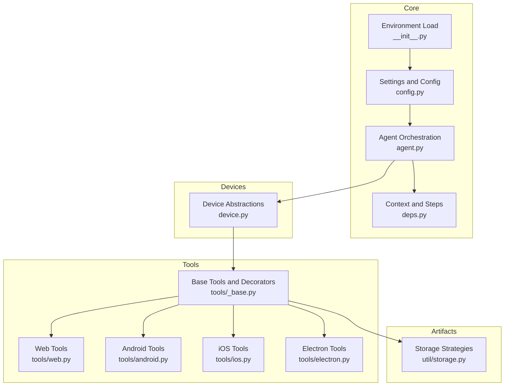
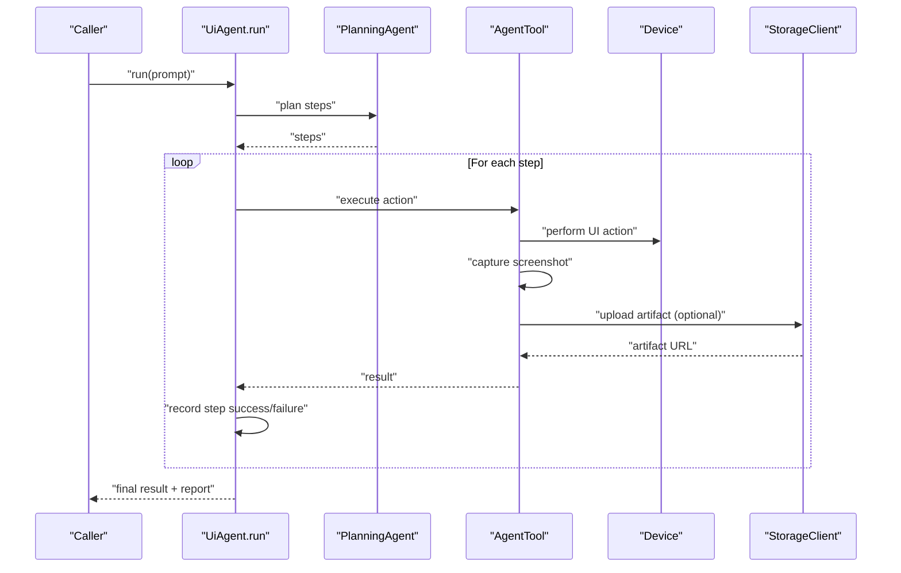
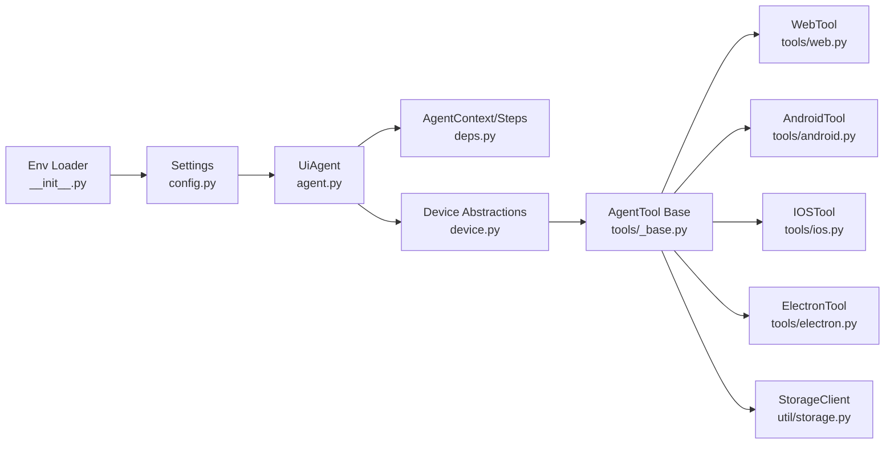

# Monitoring and Observability

<cite>
**Referenced Files in This Document**
- [README.md](file://README.md)
- [src/page_eyes/__init__.py](file://src/page_eyes/__init__.py)
- [src/page_eyes/config.py](file://src/page_eyes/config.py)
- [src/page_eyes/agent.py](file://src/page_eyes/agent.py)
- [src/page_eyes/deps.py](file://src/page_eyes/deps.py)
- [src/page_eyes/device.py](file://src/page_eyes/device.py)
- [src/page_eyes/tools/_base.py](file://src/page_eyes/tools/_base.py)
- [src/page_eyes/tools/web.py](file://src/page_eyes/tools/web.py)
- [src/page_eyes/tools/android.py](file://src/page_eyes/tools/android.py)
- [src/page_eyes/tools/ios.py](file://src/page_eyes/tools/ios.py)
- [src/page_eyes/tools/electron.py](file://src/page_eyes/tools/electron.py)
- [src/page_eyes/util/storage.py](file://src/page_eyes/util/storage.py)
</cite>

## Table of Contents
1. [Introduction](#introduction)
2. [Project Structure](#project-structure)
3. [Core Components](#core-components)
4. [Architecture Overview](#architecture-overview)
5. [Detailed Component Analysis](#detailed-component-analysis)
6. [Dependency Analysis](#dependency-analysis)
7. [Performance Considerations](#performance-considerations)
8. [Troubleshooting Guide](#troubleshooting-guide)
9. [Conclusion](#conclusion)
10. [Appendices](#appendices)

## Introduction
This document provides a comprehensive guide to monitoring and observability for PageEyes Agent deployments. It focuses on metrics collection strategies, alerting configuration, dashboard creation, logging aggregation, health checks, dependency monitoring, and operational runbooks. The guidance is grounded in the repository’s codebase and leverages the built-in logging and configuration mechanisms to establish robust observability practices.

## Project Structure
The repository organizes monitoring-relevant logic primarily around:
- Configuration and environment-driven settings
- Agent orchestration and step tracking
- Device connectivity and lifecycle
- Tool implementations for UI actions and screenshots
- Storage strategies for artifacts and screenshots
- Logging via loguru

**Diagram sources**
- [src/page_eyes/config.py:54-73](file://src/page_eyes/config.py#L54-L73)
- [src/page_eyes/__init__.py:6-16](file://src/page_eyes/__init__.py#L6-L16)
- [src/page_eyes/agent.py:96-169](file://src/page_eyes/agent.py#L96-L169)
- [src/page_eyes/deps.py:48-83](file://src/page_eyes/deps.py#L48-L83)
- [src/page_eyes/device.py:42-100](file://src/page_eyes/device.py#L42-L100)
- [src/page_eyes/tools/_base.py:130-151](file://src/page_eyes/tools/_base.py#L130-L151)
- [src/page_eyes/tools/web.py:24-53](file://src/page_eyes/tools/web.py#L24-L53)
- [src/page_eyes/tools/android.py:18-23](file://src/page_eyes/tools/android.py#L18-L23)
- [src/page_eyes/tools/ios.py:24-45](file://src/page_eyes/tools/ios.py#L24-L45)
- [src/page_eyes/tools/electron.py:21-46](file://src/page_eyes/tools/electron.py#L21-L46)
- [src/page_eyes/util/storage.py:154-193](file://src/page_eyes/util/storage.py#L154-L193)

**Section sources**
- [README.md:1-207](file://README.md#L1-L207)
- [src/page_eyes/config.py:54-73](file://src/page_eyes/config.py#L54-L73)
- [src/page_eyes/__init__.py:6-16](file://src/page_eyes/__init__.py#L6-L16)

## Core Components
- Settings and Environment
  - Centralized configuration via pydantic BaseSettings with environment variable support.
  - Includes model selection, model settings, browser/headless/simulation, OmniParser service configuration, storage client selection, and debug flag.
- Agent Orchestration
  - UiAgent orchestrates planning and execution, logs step transitions, and aggregates per-step outcomes.
  - Uses Pydantic AI Agent runtime and tracks usage and steps.
- Device Layer
  - Device abstractions encapsulate connectivity and lifecycle for Web, Android, Harmony, iOS, and Electron targets.
  - Provides device size and viewport information used for coordinate calculations.
- Tools and Screenshots
  - Base tool decorators and instrumentation for retries, delays, and structured logging.
  - Screenshots captured per step; optional OmniParser element parsing; optional storage upload.
- Storage
  - Pluggable storage strategies supporting Tencent Cloud COS, MinIO, and Base64 fallback.
  - Uploads are asynchronous and logged with error handling.

**Section sources**
- [src/page_eyes/config.py:54-73](file://src/page_eyes/config.py#L54-L73)
- [src/page_eyes/agent.py:96-169](file://src/page_eyes/agent.py#L96-L169)
- [src/page_eyes/device.py:42-100](file://src/page_eyes/device.py#L42-L100)
- [src/page_eyes/tools/_base.py:88-128](file://src/page_eyes/tools/_base.py#L88-L128)
- [src/page_eyes/util/storage.py:154-193](file://src/page_eyes/util/storage.py#L154-L193)

## Architecture Overview
The observability architecture centers on structured logging, step-scoped context, and artifact storage. The UiAgent drives planning and execution, while tools capture screenshots and optionally upload artifacts. Device connections and retries are instrumented for resilience and visibility.

**Diagram sources**
- [src/page_eyes/agent.py:225-314](file://src/page_eyes/agent.py#L225-L314)
- [src/page_eyes/tools/_base.py:167-203](file://src/page_eyes/tools/_base.py#L167-L203)
- [src/page_eyes/util/storage.py:188-193](file://src/page_eyes/util/storage.py#L188-L193)
- [src/page_eyes/device.py:42-100](file://src/page_eyes/device.py#L42-L100)

## Detailed Component Analysis

### Metrics Collection Strategies
- Automation Success Rate
  - Track per-task success derived from aggregated step outcomes. The UiAgent computes a global success flag based on all steps recorded in context.
  - Strategy: Count total tasks and successful tasks; compute success rate over time windows.
- Execution Times
  - Measure planning time, per-step execution time, and teardown durations. Use timestamps around planning and each tool invocation to derive timing metrics.
  - Strategy: Record start/end timestamps per step; export histograms for latency distributions.
- Error Rates
  - Capture exceptions raised during tool execution and retries. Use structured logs with error contexts and stack traces.
  - Strategy: Count errors per step/action type; track retry counts and failure reasons.
- Resource Utilization Patterns
  - Monitor CPU/memory/disk usage of the automation host and containerized deployments. Correlate spikes with screenshot uploads and device interactions.
  - Strategy: Use OS-level metrics collectors and correlate with log timestamps.

Implementation anchors:
- Per-step success tracking and reporting: [src/page_eyes/agent.py:292-314](file://src/page_eyes/agent.py#L292-L314)
- Tool execution and retries: [src/page_eyes/tools/_base.py:88-128](file://src/page_eyes/tools/_base.py#L88-L128)
- Screenshot capture and upload: [src/page_eyes/tools/_base.py:167-203](file://src/page_eyes/tools/_base.py#L167-L203), [src/page_eyes/util/storage.py:188-193](file://src/page_eyes/util/storage.py#L188-L193)

**Section sources**
- [src/page_eyes/agent.py:292-314](file://src/page_eyes/agent.py#L292-L314)
- [src/page_eyes/tools/_base.py:88-128](file://src/page_eyes/tools/_base.py#L88-L128)
- [src/page_eyes/util/storage.py:188-193](file://src/page_eyes/util/storage.py#L188-L193)

### Alerting Configuration
- Critical System Failures
  - Alerts on repeated tool failures, inability to connect devices, or timeouts exceeding thresholds.
  - Thresholds: consecutive failures > N, failure rate > X% over Y minutes.
- Performance Degradation
  - Alerts on increased step latency percentiles, frequent retries, or slow OmniParser responses.
  - Thresholds: p95/p99 latency > T seconds, retry rate > R%.
- Operational Anomalies
  - Alerts on missing artifacts, storage upload failures, or device connection drops.
  - Thresholds: storage error rate > E%, device connect failures > F%.

Alerting hooks:
- Use log ingestion to detect structured error events and trigger alerts.
- Integrate with external monitoring systems to consume logs and metrics.

[No sources needed since this section provides general guidance]

### Dashboard Creation
- Automation Health
  - Panels: success rate trend, error rate, average step duration, retry count.
  - Metrics: derived from step-level logs and reports.
- Device Status
  - Panels: device connection status, device size, recent activity.
  - Metrics: device creation logs and connection attempts.
- Cloud Storage Metrics
  - Panels: artifact upload success rate, upload latency, storage cost attribution.
  - Metrics: storage client logs and upload timestamps.

[No sources needed since this section provides general guidance]

### Logging Aggregation and Centralized Management
- Structured Logs
  - Use loguru with contextual information (trace IDs) propagated to external services.
  - Example propagation of trace ID to OmniParser requests: [src/page_eyes/tools/_base.py:160-165](file://src/page_eyes/tools/_base.py#L160-L165)
- Log Fields
  - Include step number, action, device type, success flag, and timestamps.
- Centralized Collection
  - Ship logs to a centralized collector (e.g., ELK, Loki, Cloud Logging) and index by trace ID for multi-device correlation.

**Section sources**
- [src/page_eyes/tools/_base.py:160-165](file://src/page_eyes/tools/_base.py#L160-L165)

### Health Checks, Liveness/Readiness, and Dependency Monitoring
- Health Endpoints
  - Expose a lightweight health endpoint returning status OK when internal dependencies are reachable.
- Liveness/Readiness
  - Liveness: basic process health.
  - Readiness: readiness when dependent services (OmniParser, device drivers, storage) are ready.
- Dependency Monitoring
  - Monitor OmniParser availability, device driver connectivity, and storage endpoints.
  - Use periodic probes and alert on downtime.

[No sources needed since this section provides general guidance]

### Custom Metrics and Platform Integration
- Custom Metrics
  - Export Prometheus-compatible metrics for success rate, latency, and error counts.
  - Use a metrics library to record counters and histograms keyed by action type and device.
- Platform Integration
  - Integrate with Grafana for dashboards and alerting.
  - Use OpenTelemetry SDKs to export traces and spans for end-to-end visibility.

[No sources needed since this section provides general guidance]

### Operational Runbooks
- Incident Response
  - Define runbook steps for common incidents: device connection failures, OmniParser outages, storage errors, and excessive retries.
- Maintenance
  - Schedule maintenance windows for device driver updates and storage provider migrations.
- Multi-Device Correlation
  - Use trace IDs to correlate logs across devices for complex automation scenarios.

[No sources needed since this section provides general guidance]

## Dependency Analysis
The following diagram highlights key dependencies among components relevant to observability.

**Diagram sources**
- [src/page_eyes/config.py:54-73](file://src/page_eyes/config.py#L54-L73)
- [src/page_eyes/__init__.py:6-16](file://src/page_eyes/__init__.py#L6-L16)
- [src/page_eyes/agent.py:96-169](file://src/page_eyes/agent.py#L96-L169)
- [src/page_eyes/deps.py:48-83](file://src/page_eyes/deps.py#L48-L83)
- [src/page_eyes/device.py:42-100](file://src/page_eyes/device.py#L42-L100)
- [src/page_eyes/tools/_base.py:130-151](file://src/page_eyes/tools/_base.py#L130-L151)
- [src/page_eyes/tools/web.py:24-53](file://src/page_eyes/tools/web.py#L24-L53)
- [src/page_eyes/tools/android.py:18-23](file://src/page_eyes/tools/android.py#L18-L23)
- [src/page_eyes/tools/ios.py:24-45](file://src/page_eyes/tools/ios.py#L24-L45)
- [src/page_eyes/tools/electron.py:21-46](file://src/page_eyes/tools/electron.py#L21-L46)
- [src/page_eyes/util/storage.py:154-193](file://src/page_eyes/util/storage.py#L154-L193)

**Section sources**
- [src/page_eyes/config.py:54-73](file://src/page_eyes/config.py#L54-L73)
- [src/page_eyes/agent.py:96-169](file://src/page_eyes/agent.py#L96-L169)
- [src/page_eyes/deps.py:48-83](file://src/page_eyes/deps.py#L48-L83)
- [src/page_eyes/device.py:42-100](file://src/page_eyes/device.py#L42-L100)
- [src/page_eyes/tools/_base.py:130-151](file://src/page_eyes/tools/_base.py#L130-L151)
- [src/page_eyes/util/storage.py:154-193](file://src/page_eyes/util/storage.py#L154-L193)

## Performance Considerations
- Asynchronous Operations
  - Use async I/O for device interactions and storage uploads to avoid blocking.
- Retry Strategy
  - Built-in retry mechanism for tool execution reduces transient failures; tune retry count and backoff based on observed error rates.
- Artifact Handling
  - Compress images and upload asynchronously to minimize impact on automation latency.
- Device Simulation
  - Adjust viewport and simulation settings to balance fidelity and performance.

[No sources needed since this section provides general guidance]

## Troubleshooting Guide
- Device Connectivity Issues
  - Verify device driver connectivity and retry logic. Inspect logs for connection failures and auto-start attempts.
  - References: [src/page_eyes/device.py:180-228](file://src/page_eyes/device.py#L180-L228)
- Tool Execution Failures
  - Review tool logs and stack traces; leverage retry behavior to mitigate transient errors.
  - References: [src/page_eyes/tools/_base.py:112-119](file://src/page_eyes/tools/_base.py#L112-L119)
- Storage Upload Failures
  - Confirm storage credentials and endpoint reachability; fallback to Base64 when needed.
  - References: [src/page_eyes/util/storage.py:162-193](file://src/page_eyes/util/storage.py#L162-L193)
- Report Generation
  - Ensure report directory is writable and templates are present.
  - References: [src/page_eyes/agent.py:172-191](file://src/page_eyes/agent.py#L172-L191)

**Section sources**
- [src/page_eyes/device.py:180-228](file://src/page_eyes/device.py#L180-L228)
- [src/page_eyes/tools/_base.py:112-119](file://src/page_eyes/tools/_base.py#L112-L119)
- [src/page_eyes/util/storage.py:162-193](file://src/page_eyes/util/storage.py#L162-L193)
- [src/page_eyes/agent.py:172-191](file://src/page_eyes/agent.py#L172-L191)

## Conclusion
By leveraging the existing logging, configuration, and tooling infrastructure, PageEyes Agent deployments can achieve strong observability. Structured logs, step-scoped context, and pluggable storage enable comprehensive monitoring of automation health, device status, and artifact flows. Combined with centralized log management, health checks, and alerting, teams can maintain reliable and observable automation at scale.

[No sources needed since this section summarizes without analyzing specific files]

## Appendices

### Appendix A: Environment Variables and Configuration Anchors
- Model and LLM/VLM selection, model settings, browser/headless/simulation, OmniParser base URL/key, storage client configuration, and debug flag.
- References: [src/page_eyes/config.py:54-73](file://src/page_eyes/config.py#L54-L73), [README.md:98-131](file://README.md#L98-L131)

**Section sources**
- [src/page_eyes/config.py:54-73](file://src/page_eyes/config.py#L54-L73)
- [README.md:98-131](file://README.md#L98-L131)