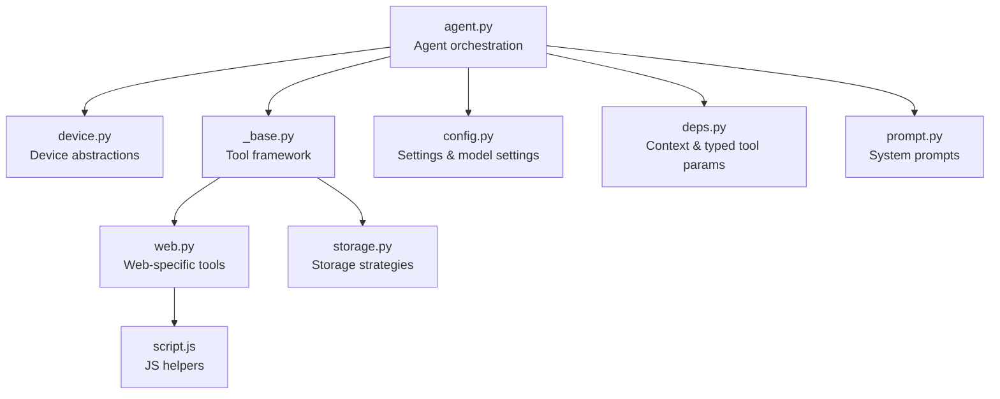
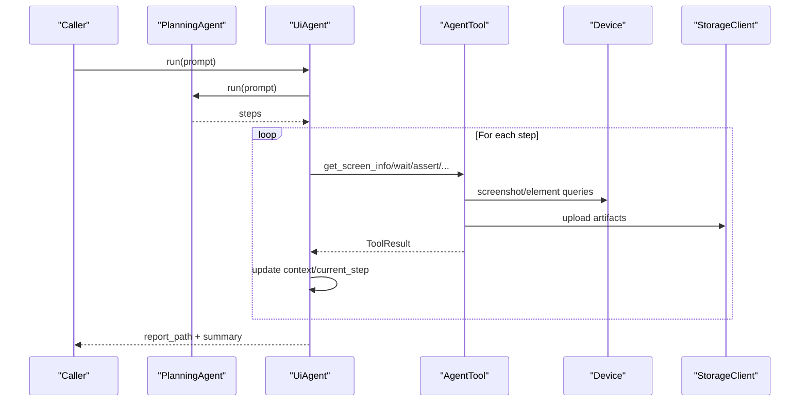
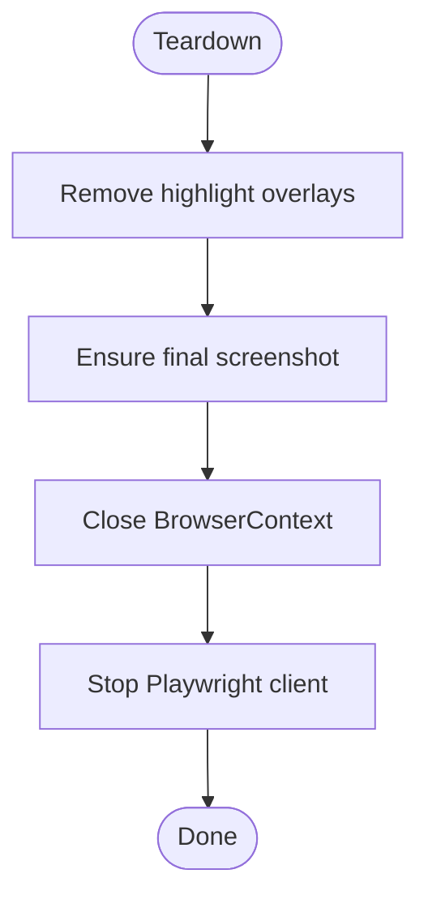
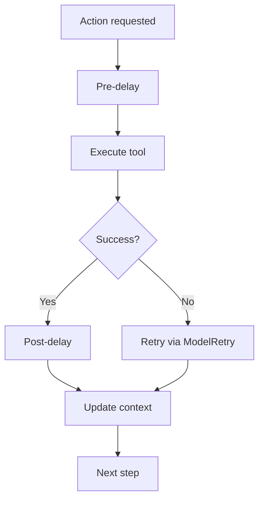
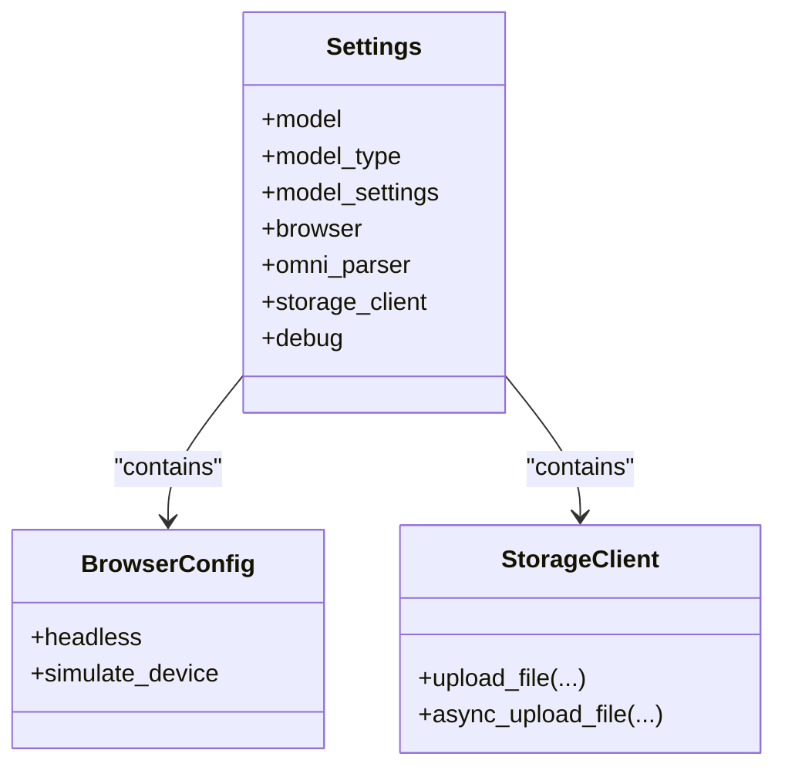
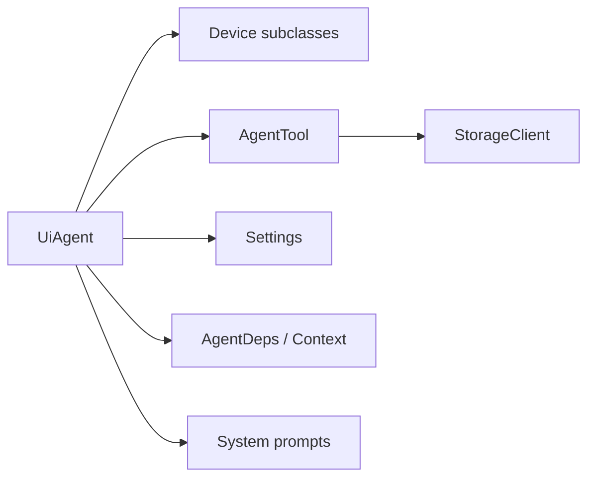

# Performance Optimization

<cite>
**Referenced Files in This Document**
- [__init__.py](file://src/page_eyes/__init__.py)
- [agent.py](file://src/page_eyes/agent.py)
- [config.py](file://src/page_eyes/config.py)
- [deps.py](file://src/page_eyes/deps.py)
- [device.py](file://src/page_eyes/device.py)
- [prompt.py](file://src/page_eyes/prompt.py)
- [_base.py](file://src/page_eyes/tools/_base.py)
- [web.py](file://src/page_eyes/tools/web.py)
- [storage.py](file://src/page_eyes/util/storage.py)
- [script.js](file://src/page_eyes/util/js_tool/script.js)
- [README.md](file://README.md)
- [troubleshooting.md](file://docs/faq/troubleshooting.md)
</cite>

## Table of Contents
1. [Introduction](#introduction)
2. [Project Structure](#project-structure)
3. [Core Components](#core-components)
4. [Architecture Overview](#architecture-overview)
5. [Detailed Component Analysis](#detailed-component-analysis)
6. [Dependency Analysis](#dependency-analysis)
7. [Performance Considerations](#performance-considerations)
8. [Troubleshooting Guide](#troubleshooting-guide)
9. [Conclusion](#conclusion)
10. [Appendices](#appendices)

## Introduction
This document focuses on performance optimization for PageEyes Agent with an emphasis on runtime efficiency and resource management. It covers memory management strategies, CPU and I/O optimization techniques, configuration tuning, benchmarking and profiling approaches, caching and connection patterns, and scaling considerations for high-throughput automation scenarios. The guidance is grounded in the repository’s codebase and documentation.

## Project Structure
The repository organizes performance-relevant logic across several modules:
- Agent orchestration and lifecycle management
- Device abstraction for multiple platforms
- Tooling for UI actions and screen parsing
- Configuration and environment-driven settings
- Storage strategies for screenshots and artifacts
- Utility scripts for UI highlighting and element detection

**Diagram sources**
- [agent.py:1-515](file://src/page_eyes/agent.py#L1-L515)
- [device.py:1-390](file://src/page_eyes/device.py#L1-L390)
- [_base.py:1-391](file://src/page_eyes/tools/_base.py#L1-L391)
- [web.py:1-179](file://src/page_eyes/tools/web.py#L1-L179)
- [config.py:1-73](file://src/page_eyes/config.py#L1-L73)
- [deps.py:1-280](file://src/page_eyes/deps.py#L1-L280)
- [prompt.py:1-166](file://src/page_eyes/prompt.py#L1-L166)
- [storage.py:1-193](file://src/page_eyes/util/storage.py#L1-L193)
- [script.js:1-54](file://src/page_eyes/util/js_tool/script.js#L1-L54)

**Section sources**
- [agent.py:1-515](file://src/page_eyes/agent.py#L1-L515)
- [device.py:1-390](file://src/page_eyes/device.py#L1-L390)
- [_base.py:1-391](file://src/page_eyes/tools/_base.py#L1-L391)
- [web.py:1-179](file://src/page_eyes/tools/web.py#L1-L179)
- [config.py:1-73](file://src/page_eyes/config.py#L1-L73)
- [deps.py:1-280](file://src/page_eyes/deps.py#L1-L280)
- [prompt.py:1-166](file://src/page_eyes/prompt.py#L1-L166)
- [storage.py:1-193](file://src/page_eyes/util/storage.py#L1-L193)
- [script.js:1-54](file://src/page_eyes/util/js_tool/script.js#L1-L54)

## Core Components
- Agent orchestration manages planning and execution loops, step-by-step tool invocation, and reporting generation. It integrates with device contexts and toolsets to execute UI automation reliably.
- Device abstractions encapsulate platform-specific drivers (Playwright, adb, hdc, WDA, CDP) and manage persistent contexts and page lifecycles.
- Tool framework defines a decorator pattern for tools, ensuring ordered execution, delays, and robust error handling with retries.
- Storage strategies provide pluggable backends for screenshots and artifacts, supporting cloud providers and base64 fallbacks.
- Configuration centralizes model settings, browser behavior, and external service endpoints, enabling environment-driven tuning.

**Section sources**
- [agent.py:74-314](file://src/page_eyes/agent.py#L74-L314)
- [device.py:42-390](file://src/page_eyes/device.py#L42-L390)
- [_base.py:88-128](file://src/page_eyes/tools/_base.py#L88-L128)
- [storage.py:154-193](file://src/page_eyes/util/storage.py#L154-L193)
- [config.py:54-73](file://src/page_eyes/config.py#L54-L73)

## Architecture Overview
The runtime architecture emphasizes asynchronous execution, explicit context management, and modular tooling. The agent builds an Agent instance with capabilities and tools, iterates through steps, and maintains a context for step outcomes and screen metadata.

**Diagram sources**
- [agent.py:217-314](file://src/page_eyes/agent.py#L217-L314)
- [_base.py:167-203](file://src/page_eyes/tools/_base.py#L167-L203)
- [storage.py:188-193](file://src/page_eyes/util/storage.py#L188-L193)
- [device.py:54-100](file://src/page_eyes/device.py#L54-L100)

## Detailed Component Analysis

### Memory Management Strategies
- Object lifecycle and cleanup
  - Persistent browser contexts are closed during teardown to release memory and file descriptors.
  - Highlight overlays are removed after actions to avoid DOM accumulation.
- Garbage collection optimization
  - Avoid retaining large image buffers beyond their use window; reuse buffers and minimize copies.
  - Prefer streaming uploads for large artifacts to reduce peak memory.
- Resource cleanup patterns
  - Explicitly close Playwright contexts and stop clients after use.
  - Reset transient state (e.g., screen info) between steps to prevent growth.

**Diagram sources**
- [web.py:34-44](file://src/page_eyes/tools/web.py#L34-L44)
- [script.js:21-26](file://src/page_eyes/util/js_tool/script.js#L21-L26)

**Section sources**
- [web.py:34-44](file://src/page_eyes/tools/web.py#L34-L44)
- [script.js:21-26](file://src/page_eyes/util/js_tool/script.js#L21-L26)
- [device.py:75-87](file://src/page_eyes/device.py#L75-L87)

### CPU and I/O Optimization Techniques
- Asynchronous execution
  - All device operations and tool invocations are async, preventing blocking and enabling concurrency where appropriate.
- Delays and stability
  - Controlled delays before and after tool execution mitigate rendering instability and ensure reliable element detection.
- Element parsing and caching
  - Reuse parsed screen elements per step; avoid redundant parsing when not needed.
- Network optimization
  - Use timeouts and keep-alive where supported; batch uploads when possible.
- Platform-specific optimizations
  - Mobile devices: prefer scroll-based swipes when scrollbars are absent; mouse-based swipes otherwise.
  - Web: persistent context reduces cold-start overhead; viewport sizing impacts rendering cost.

**Diagram sources**
- [_base.py:88-128](file://src/page_eyes/tools/_base.py#L88-L128)
- [web.py:94-121](file://src/page_eyes/tools/web.py#L94-L121)

**Section sources**
- [_base.py:88-128](file://src/page_eyes/tools/_base.py#L88-L128)
- [web.py:94-121](file://src/page_eyes/tools/web.py#L94-L121)
- [device.py:75-87](file://src/page_eyes/device.py#L75-L87)

### Configuration Tuning
- Model settings
  - Adjust max tokens and temperature to balance accuracy and latency.
- Browser performance
  - Headless mode reduces rendering overhead; viewport sizing affects layout computation cost.
- Cloud storage operations
  - Choose COS or MinIO based on deployment; enable compression for images to reduce transfer sizes.
- Environment-driven overrides
  - Settings merge order prioritizes explicit parameters, environment variables, .env file, and defaults.

**Diagram sources**
- [config.py:54-73](file://src/page_eyes/config.py#L54-L73)
- [config.py:40-45](file://src/page_eyes/config.py#L40-L45)
- [storage.py:154-193](file://src/page_eyes/util/storage.py#L154-L193)

**Section sources**
- [config.py:54-73](file://src/page_eyes/config.py#L54-L73)
- [__init__.py:9-16](file://src/page_eyes/__init__.py#L9-L16)
- [README.md:97-131](file://README.md#L97-L131)

### Benchmarking Methodologies and Profiling
- Metrics to collect
  - Per-step duration, total run time, number of retries, screenshot sizes, and storage upload times.
- Profiling techniques
  - Use async-aware profilers to capture event loop stalls and I/O bottlenecks.
  - Measure device driver startup costs (e.g., Playwright context creation).
- Bottleneck identification
  - Parse latency vs. action latency; identify steps with repeated retries.
  - Compare headless vs. headed runs; evaluate impact of element parsing.

[No sources needed since this section provides general guidance]

### Caching Mechanisms, Connection Pooling, and Network Optimization
- Caching
  - Reuse parsed screen elements within a step; avoid re-uploading identical artifacts by hashing.
- Connection pooling
  - Persistent browser contexts reduce repeated initialization overhead.
- Network optimization
  - Compress images before upload; choose nearest cloud endpoints; tune timeouts.

**Section sources**
- [storage.py:24-62](file://src/page_eyes/util/storage.py#L24-L62)
- [storage.py:188-193](file://src/page_eyes/util/storage.py#L188-L193)
- [device.py:75-87](file://src/page_eyes/device.py#L75-L87)

### Scaling Considerations and Load Distribution
- Concurrency
  - Keep single-step execution ordered; avoid parallel tool calls within a step.
- Isolation
  - Separate agents per device or browser profile to prevent cross-contamination.
- Resource allocation
  - Limit concurrent device sessions; provision adequate CPU/memory for Playwright and model inference.

**Section sources**
- [_base.py:67-69](file://src/page_eyes/tools/_base.py#L67-L69)
- [device.py:75-87](file://src/page_eyes/device.py#L75-L87)

## Dependency Analysis
The agent depends on device abstractions, tool capabilities, and configuration. Tools depend on device targets and storage clients. Prompts influence behavior but do not introduce runtime dependencies.

**Diagram sources**
- [agent.py:36-57](file://src/page_eyes/agent.py#L36-L57)
- [device.py:42-390](file://src/page_eyes/device.py#L42-L390)
- [_base.py:130-150](file://src/page_eyes/tools/_base.py#L130-L150)
- [storage.py:154-193](file://src/page_eyes/util/storage.py#L154-L193)
- [config.py:54-73](file://src/page_eyes/config.py#L54-L73)
- [deps.py:75-82](file://src/page_eyes/deps.py#L75-L82)
- [prompt.py:8-103](file://src/page_eyes/prompt.py#L8-L103)

**Section sources**
- [agent.py:36-57](file://src/page_eyes/agent.py#L36-L57)
- [device.py:42-390](file://src/page_eyes/device.py#L42-L390)
- [_base.py:130-150](file://src/page_eyes/tools/_base.py#L130-L150)
- [storage.py:154-193](file://src/page_eyes/util/storage.py#L154-L193)
- [config.py:54-73](file://src/page_eyes/config.py#L54-L73)
- [deps.py:75-82](file://src/page_eyes/deps.py#L75-L82)
- [prompt.py:8-103](file://src/page_eyes/prompt.py#L8-L103)

## Performance Considerations
- Prefer headless browsers for speed-sensitive runs; enable device simulation only when required.
- Tune model settings for throughput vs. accuracy trade-offs.
- Minimize screenshot sizes and reuse parsed elements; avoid unnecessary uploads.
- Use persistent contexts and avoid frequent restarts.
- Apply structured delays judiciously; rely on element presence checks to avoid busy-waiting.

[No sources needed since this section provides general guidance]

## Troubleshooting Guide
Common performance pitfalls and remedies:
- Browser startup failures: install required system dependencies and ensure executable permissions.
- Element parsing failures: verify OmniParser service availability and network connectivity.
- Storage upload failures: confirm credentials and endpoint reachability; fall back to base64 when needed.
- Excessive retries: review tool delays and element detection logic; ensure stable UI conditions.

**Section sources**
- [troubleshooting.md:96-141](file://docs/faq/troubleshooting.md#L96-L141)
- [troubleshooting.md:143-181](file://docs/faq/troubleshooting.md#L143-L181)
- [troubleshooting.md:185-196](file://docs/faq/troubleshooting.md#L185-L196)

## Conclusion
By combining asynchronous execution, careful resource lifecycle management, environment-driven configuration, and targeted caching and upload strategies, PageEyes Agent achieves efficient and scalable automation. The recommendations above provide practical steps to optimize runtime performance and reliability across diverse automation scenarios.

## Appendices
- Environment variable reference and examples are documented in the project’s README and FAQ.

**Section sources**
- [README.md:97-131](file://README.md#L97-L131)
- [troubleshooting.md:6-25](file://docs/faq/troubleshooting.md#L6-L25)