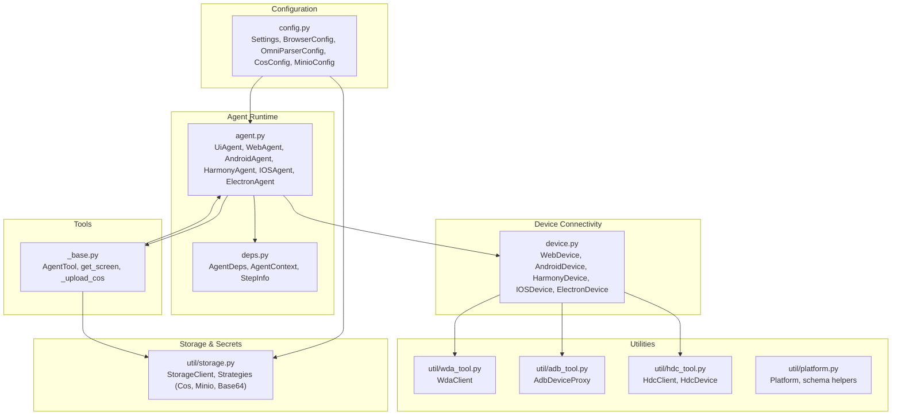
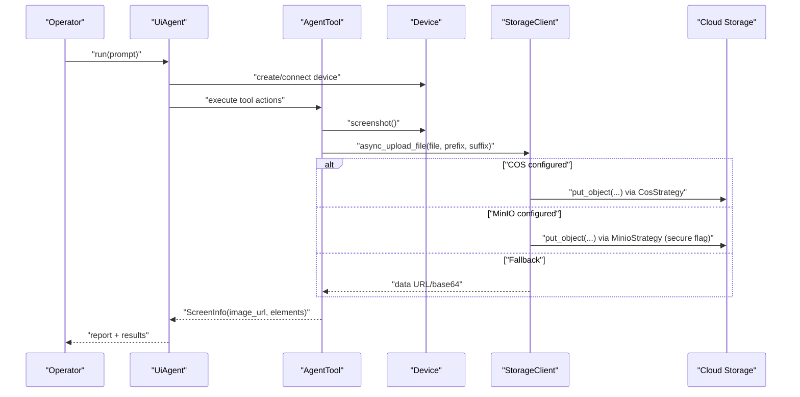
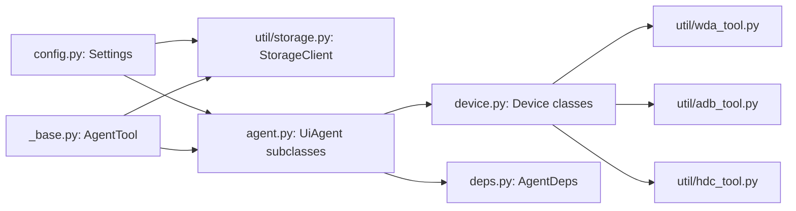
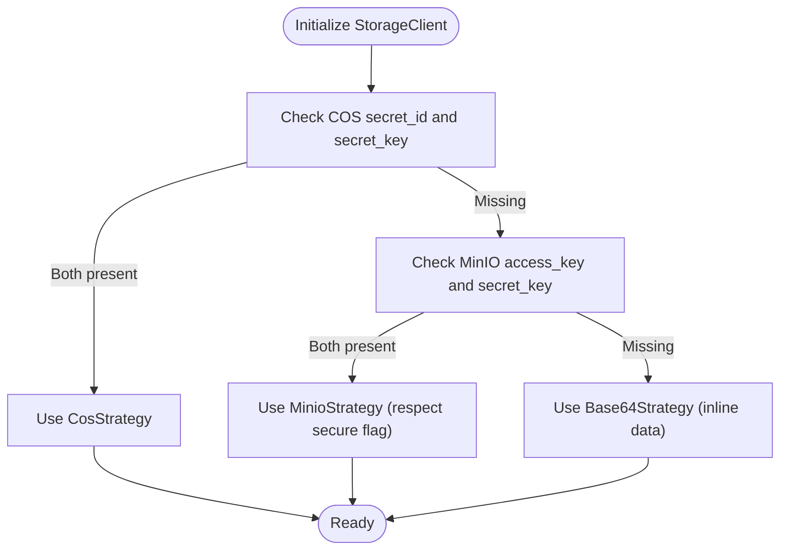

# Security and Compliance

<cite>
**Referenced Files in This Document**
- [config.py](file://src/page_eyes/config.py)
- [storage.py](file://src/page_eyes/util/storage.py)
- [device.py](file://src/page_eyes/device.py)
- [agent.py](file://src/page_eyes/agent.py)
- [deps.py](file://src/page_eyes/deps.py)
- [_base.py](file://src/page_eyes/tools/_base.py)
- [security.md](file://docs/security.md)
- [pyproject.toml](file://pyproject.toml)
- [platform.py](file://src/page_eyes/util/platform.py)
- [wda_tool.py](file://src/page_eyes/util/wda_tool.py)
- [adb_tool.py](file://src/page_eyes/util/adb_tool.py)
- [hdc_tool.py](file://src/page_eyes/util/hdc_tool.py)
</cite>

## Table of Contents
1. [Introduction](#introduction)
2. [Project Structure](#project-structure)
3. [Core Components](#core-components)
4. [Architecture Overview](#architecture-overview)
5. [Detailed Component Analysis](#detailed-component-analysis)
6. [Dependency Analysis](#dependency-analysis)
7. [Performance Considerations](#performance-considerations)
8. [Troubleshooting Guide](#troubleshooting-guide)
9. [Conclusion](#conclusion)
10. [Appendices](#appendices)

## Introduction
This document consolidates security and compliance considerations for PageEyes Agent deployments. It focuses on secure configuration management, credential handling, secrets lifecycle, access control patterns for device connections and browser automation, data protection for screenshots and logs, network security controls, and compliance guidance. It also provides vulnerability assessment and incident response recommendations tailored to automation systems.

## Project Structure
The repository organizes security-relevant logic across configuration, device connectivity, storage, tools, and documentation. Key areas include:
- Environment-driven configuration and secrets injection
- Cloud storage integration via Tencent COS or MinIO
- Device connection abstractions for web, Android, Harmony, iOS, and Electron
- Tooling for screenshot capture, parsing, and upload
- Security policy and best practices documentation

**Diagram sources**
- [config.py:54-72](file://src/page_eyes/config.py#L54-L72)
- [storage.py:154-193](file://src/page_eyes/util/storage.py#L154-L193)
- [device.py:42-390](file://src/page_eyes/device.py#L42-L390)
- [agent.py:73-515](file://src/page_eyes/agent.py#L73-L515)
- [deps.py:48-280](file://src/page_eyes/deps.py#L48-L280)
- [_base.py:130-391](file://src/page_eyes/tools/_base.py#L130-L391)
- [wda_tool.py:35-129](file://src/page_eyes/util/wda_tool.py#L35-L129)
- [adb_tool.py:12-37](file://src/page_eyes/util/adb_tool.py#L12-L37)
- [hdc_tool.py:31-108](file://src/page_eyes/util/hdc_tool.py#L31-L108)
- [platform.py:14-66](file://src/page_eyes/util/platform.py#L14-L66)

**Section sources**
- [config.py:54-72](file://src/page_eyes/config.py#L54-L72)
- [storage.py:154-193](file://src/page_eyes/util/storage.py#L154-L193)
- [device.py:42-390](file://src/page_eyes/device.py#L42-L390)
- [agent.py:73-515](file://src/page_eyes/agent.py#L73-L515)
- [deps.py:48-280](file://src/page_eyes/deps.py#L48-L280)
- [_base.py:130-391](file://src/page_eyes/tools/_base.py#L130-L391)
- [wda_tool.py:35-129](file://src/page_eyes/util/wda_tool.py#L35-L129)
- [adb_tool.py:12-37](file://src/page_eyes/util/adb_tool.py#L12-L37)
- [hdc_tool.py:31-108](file://src/page_eyes/util/hdc_tool.py#L31-L108)
- [platform.py:14-66](file://src/page_eyes/util/platform.py#L14-L66)

## Core Components
- Secure configuration management via environment variables and Pydantic settings
- Cloud storage strategies with explicit transport security toggles
- Device connection abstractions enforcing isolation and controlled access
- Tooling for screenshot capture, optional parsing, and secure upload
- Logging and reporting with sensitive data handling policies

**Section sources**
- [config.py:19-72](file://src/page_eyes/config.py#L19-L72)
- [storage.py:82-193](file://src/page_eyes/util/storage.py#L82-L193)
- [device.py:42-390](file://src/page_eyes/device.py#L42-L390)
- [_base.py:130-391](file://src/page_eyes/tools/_base.py#L130-L391)
- [security.md:15-90](file://docs/security.md#L15-L90)

## Architecture Overview
The runtime architecture integrates configuration-driven settings, device-specific connectors, and storage strategies. Sensitive data flows through environment-injected credentials and optional cloud storage with explicit transport security controls.

**Diagram sources**
- [agent.py:225-314](file://src/page_eyes/agent.py#L225-L314)
- [_base.py:167-202](file://src/page_eyes/tools/_base.py#L167-L202)
- [storage.py:188-193](file://src/page_eyes/util/storage.py#L188-L193)
- [storage.py:82-140](file://src/page_eyes/util/storage.py#L82-L140)

## Detailed Component Analysis

### Secure Configuration Management
- Environment-driven settings with strict prefix scoping for cloud providers and browsers
- Secrets loaded from a .env file and injected into typed configuration models
- Optional OmniParser key and base URL for element parsing
- Centralized default settings object for consistent defaults

Recommendations:
- Enforce .env file permissions (readable only by the service account)
- Use separate .env files per environment and restrict access
- Avoid committing secrets to version control; rely on CI/CD secret stores
- Validate presence of required keys at startup

**Section sources**
- [config.py:19-72](file://src/page_eyes/config.py#L19-L72)
- [security.md:17-21](file://docs/security.md#L17-L21)

### Credential Handling and Secrets Management
- Tencent COS and MinIO credentials are configured via environment variables with dedicated prefixes
- MinIO supports a secure flag to enforce TLS for uploads
- Base64 strategy avoids external storage when cloud configs are missing

Recommendations:
- Rotate credentials regularly and revoke unused keys
- Scope IAM roles to least privilege for cloud storage buckets
- Encrypt at-rest cloud objects where supported by provider policies
- Monitor and audit access logs for storage accounts

**Section sources**
- [config.py:19-37](file://src/page_eyes/config.py#L19-L37)
- [storage.py:105-111](file://src/page_eyes/util/storage.py#L105-L111)
- [storage.py:162-186](file://src/page_eyes/util/storage.py#L162-L186)

### Access Control Patterns for Device Connections
- Web automation runs in a persistent Chromium context with headless option
- Mobile device connections use platform-specific clients (ADB/HDC/WDA) with explicit device selection
- Electron automation connects via CDP to a locally exposed debugging port
- iOS WebDriverAgent connection supports auto-start logic guarded by environment variables

Recommendations:
- Run automation agents under least-privileged OS accounts
- Restrict ADB/HDC/WDA access to trusted hosts and networks
- Use local CDP binding (127.0.0.1) and firewall rules to prevent external exposure
- Validate device fingerprints and trust profiles for mobile targets

**Section sources**
- [device.py:59-87](file://src/page_eyes/device.py#L59-L87)
- [device.py:106-126](file://src/page_eyes/device.py#L106-L126)
- [device.py:133-155](file://src/page_eyes/device.py#L133-L155)
- [device.py:164-227](file://src/page_eyes/device.py#L164-L227)
- [device.py:243-292](file://src/page_eyes/device.py#L243-L292)
- [device.py:324-390](file://src/page_eyes/device.py#L324-L390)

### Browser Automation Permissions and Isolation
- Headless mode reduces visual footprint and resource usage
- Persistent context isolates sessions; viewport sizing is configurable
- Device emulation presets are supported for mobile contexts

Recommendations:
- Disable unnecessary browser flags and extensions
- Use sandboxed environments and restricted user data directories
- Apply Content Security Policy-like constraints via page-level restrictions
- Limit cross-origin navigation and popups

**Section sources**
- [device.py:59-87](file://src/page_eyes/device.py#L59-L87)
- [config.py:40-45](file://src/page_eyes/config.py#L40-L45)

### Cloud Storage Access and Upload Flow
- StorageClient selects strategy based on availability of COS or MinIO credentials
- COS uploads convert images to WebP when appropriate
- MinIO uploads honor the secure flag for HTTPS endpoints
- Base64 fallback returns inline data URLs for screenshots

Recommendations:
- Prefer TLS-enabled endpoints for all cloud storage uploads
- Configure bucket policies to deny public access and require signed URLs
- Enable server-side encryption for stored objects
- Implement retention and lifecycle policies to limit data exposure

**Section sources**
- [storage.py:161-186](file://src/page_eyes/util/storage.py#L161-L186)
- [storage.py:89-101](file://src/page_eyes/util/storage.py#L89-L101)
- [storage.py:123-139](file://src/page_eyes/util/storage.py#L123-L139)
- [_base.py:153-154](file://src/page_eyes/tools/_base.py#L153-L154)

### Data Protection for Screenshots, Logs, and Artifacts
- Screenshots are captured per step and optionally parsed for labeled images
- Upload path depends on configuration; Base64 fallback avoids external storage
- Reports are generated locally and include step metadata

Recommendations:
- Sanitize logs to remove PII and tokens
- Store artifacts with minimal retention windows
- Encrypt artifacts at rest using provider-managed or customer-managed keys
- Apply data loss prevention policies to reports and logs

**Section sources**
- [_base.py:167-202](file://src/page_eyes/tools/_base.py#L167-L202)
- [agent.py:171-190](file://src/page_eyes/agent.py#L171-L190)
- [security.md:17-26](file://docs/security.md#L17-L26)

### Network Security Considerations
- Proxy configuration is not explicitly exposed in the code; enterprise proxies should be configured at the host level
- Default browser behavior restricts cross-origin requests unless explicitly permitted
- Electron CDP listens on localhost by default; restrict network exposure

Recommendations:
- Configure corporate proxy settings via environment variables at deployment
- Harden firewall rules to allow outbound HTTPS only to required endpoints
- Use TLS termination at the edge and enforce modern cipher suites
- Segment automation workloads on isolated networks with egress controls

**Section sources**
- [security.md:28-33](file://docs/security.md#L28-L33)
- [device.py:243-292](file://src/page_eyes/device.py#L243-L292)

### Compliance Considerations
- Security policy references industry standards and emphasizes responsible disclosure
- Data handling guidelines include avoiding persistence of sensitive inputs
- Recommendations for deployment hygiene and access control align with compliance expectations

Recommendations:
- Map controls to applicable frameworks (e.g., ISO 27001, SOC 2)
- Maintain audit trails for configuration changes and tool invocations
- Define data residency boundaries and select cloud regions accordingly
- Establish data subject request processes for artifact deletion

**Section sources**
- [security.md:80-87](file://docs/security.md#L80-L87)
- [security.md:17-21](file://docs/security.md#L17-L21)

### Vulnerability Assessment and Penetration Testing Preparation
- Identify attack surfaces: device connectors, browser contexts, cloud storage endpoints, and Electron CDP
- Validate authentication and authorization for WebDriverAgent and cloud APIs
- Assess transport security for all external communications
- Review tool invocation logic for command injection risks

Recommendations:
- Perform regular dependency vulnerability scans and apply patches promptly
- Conduct authorized penetration tests with signed agreements and scoped targets
- Hardening checklists: disable devtools, restrict filesystem access, and enforce least privilege
- Incident response playbooks should include device and cloud credential revocation

**Section sources**
- [pyproject.toml:20-32](file://pyproject.toml#L20-L32)
- [security.md:55-70](file://docs/security.md#L55-L70)

### Security Incident Response Procedures
- Report vulnerabilities privately to maintain confidentiality
- Establish escalation paths and remediation timelines
- Coordinate with cloud providers for incident containment and evidence preservation

Recommendations:
- Create an incident response team with defined roles and communication channels
- Automate alerting for failed device connections, storage errors, and anomalous tool usage
- Preserve logs and artifacts for forensics while adhering to data minimization principles

**Section sources**
- [security.md:55-70](file://docs/security.md#L55-L70)

## Dependency Analysis
The following diagram highlights key dependencies among configuration, storage, device, and tooling components.

**Diagram sources**
- [config.py:54-72](file://src/page_eyes/config.py#L54-L72)
- [storage.py:154-193](file://src/page_eyes/util/storage.py#L154-L193)
- [agent.py:73-515](file://src/page_eyes/agent.py#L73-L515)
- [deps.py:75-82](file://src/page_eyes/deps.py#L75-L82)
- [_base.py:130-391](file://src/page_eyes/tools/_base.py#L130-L391)
- [wda_tool.py:35-129](file://src/page_eyes/util/wda_tool.py#L35-L129)
- [adb_tool.py:12-37](file://src/page_eyes/util/adb_tool.py#L12-L37)
- [hdc_tool.py:31-108](file://src/page_eyes/util/hdc_tool.py#L31-L108)

**Section sources**
- [config.py:54-72](file://src/page_eyes/config.py#L54-L72)
- [storage.py:154-193](file://src/page_eyes/util/storage.py#L154-L193)
- [agent.py:73-515](file://src/page_eyes/agent.py#L73-L515)
- [deps.py:75-82](file://src/page_eyes/deps.py#L75-L82)
- [_base.py:130-391](file://src/page_eyes/tools/_base.py#L130-L391)
- [wda_tool.py:35-129](file://src/page_eyes/util/wda_tool.py#L35-L129)
- [adb_tool.py:12-37](file://src/page_eyes/util/adb_tool.py#L12-L37)
- [hdc_tool.py:31-108](file://src/page_eyes/util/hdc_tool.py#L31-L108)

## Performance Considerations
- Image conversion to WebP reduces payload sizes for cloud uploads
- Asynchronous uploads minimize latency during automation steps
- Headless browser mode reduces CPU and memory overhead

[No sources needed since this section provides general guidance]

## Troubleshooting Guide
Common operational issues and mitigations:
- Device connection failures: verify device visibility, driver installations, and environment variables for auto-start paths
- Cloud upload errors: confirm credentials, endpoint reachability, and TLS settings
- Electron CDP accessibility: ensure the target app exposes the debugging port and binds to loopback
- Log sanitization: avoid printing sensitive data; sanitize logs before archiving

**Section sources**
- [device.py:110-122](file://src/page_eyes/device.py#L110-L122)
- [device.py:140-151](file://src/page_eyes/device.py#L140-L151)
- [device.py:180-227](file://src/page_eyes/device.py#L180-L227)
- [device.py:253-270](file://src/page_eyes/device.py#L253-L270)
- [storage.py:93-101](file://src/page_eyes/util/storage.py#L93-L101)
- [storage.py:127-139](file://src/page_eyes/util/storage.py#L127-L139)

## Conclusion
PageEyes Agent incorporates environment-driven configuration, explicit cloud storage strategies, and device abstraction layers that support secure automation. By enforcing least privilege, encrypting in transit and at rest, validating network controls, and maintaining robust incident response procedures, teams can deploy automation systems compliant with enterprise and regulatory requirements.

[No sources needed since this section summarizes without analyzing specific files]

## Appendices

### Appendix A: Environment Variables and Prefixes
- COS: cos_region, cos_secret_id, cos_secret_key, cos_endpoint, cos_bucket
- MinIO: minio_access_key, minio_secret_key, minio_endpoint, minio_bucket, minio_region, minio_secure
- Browser: browser_headless, browser_simulate_device
- OmniParser: omni_base_url, omni_key
- Agent: agent_model, agent_model_type, agent_debug

**Section sources**
- [config.py:19-52](file://src/page_eyes/config.py#L19-L52)

### Appendix B: Storage Strategy Selection Logic

**Diagram sources**
- [storage.py:161-186](file://src/page_eyes/util/storage.py#L161-L186)