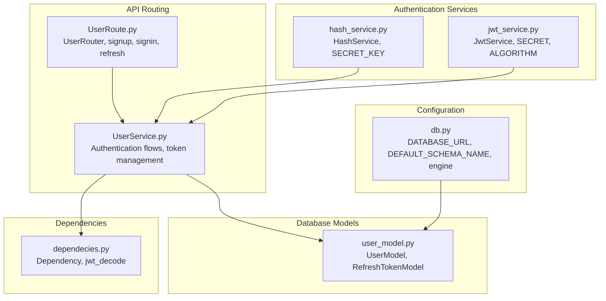
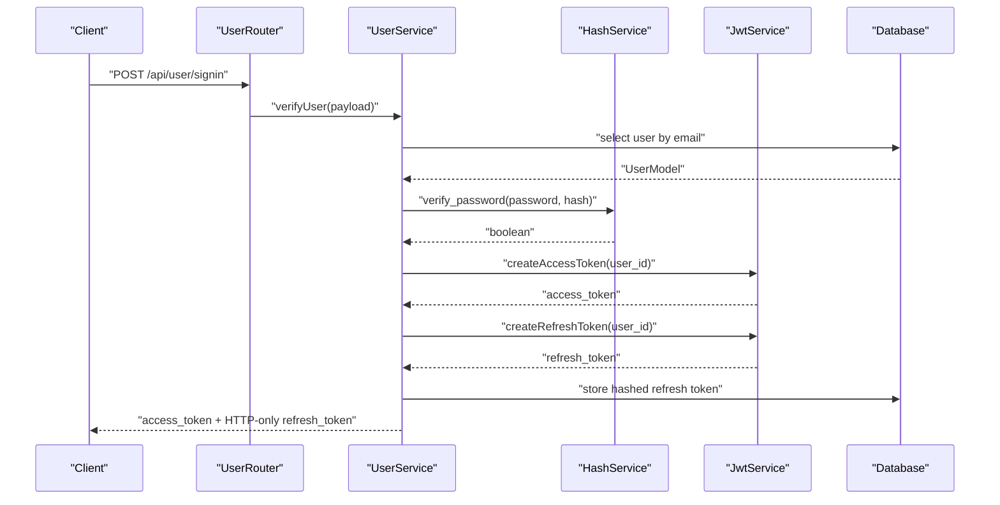
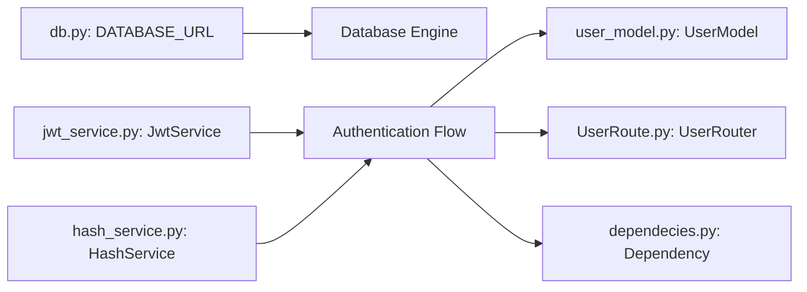
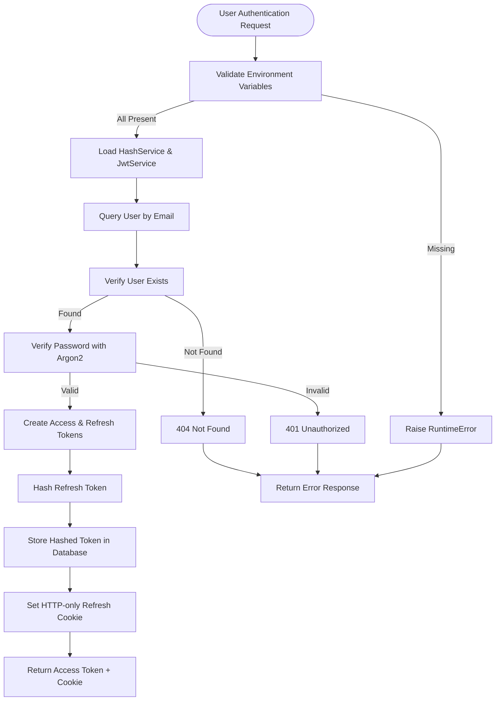

# Security and Compliance

<cite>
**Referenced Files in This Document**
- [main.py](file://main.py)
- [db.py](file://app/config/db.py)
- [jwt_service.py](file://app/services/jwt_service.py)
- [hash_service.py](file://app/services/hash_service.py)
- [user_model.py](file://app/models/user_model.py)
- [UserRoute.py](file://app/USER/UserRoute.py)
- [UserService.py](file://app/USER/UserService.py)
- [dependecies.py](file://app/dependency/dependecies.py)
- [pyproject.toml](file://pyproject.toml)
- [README.md](file://README.md)
</cite>

## Update Summary
**Changes Made**
- Enhanced security practices documentation for mandatory environment variable configuration
- Added separation of cryptographic keys documentation for password hashing and JWT signing
- Improved production deployment security guidelines
- Updated authentication flow security considerations
- Strengthened secrets management and credential handling recommendations

## Table of Contents
1. [Introduction](#introduction)
2. [Project Structure](#project-structure)
3. [Core Components](#core-components)
4. [Architecture Overview](#architecture-overview)
5. [Detailed Component Analysis](#detailed-component-analysis)
6. [Dependency Analysis](#dependency-analysis)
7. [Performance Considerations](#performance-considerations)
8. [Troubleshooting Guide](#troubleshooting-guide)
9. [Conclusion](#conclusion)
10. [Appendices](#appendices)

## Introduction
This document consolidates security and compliance considerations for the Auth Service authentication microservice. It focuses on secure configuration management, credential handling, secrets lifecycle, access control patterns for user authentication, data protection for user credentials and tokens, network security controls, and compliance guidance. It also provides vulnerability assessment and incident response recommendations tailored to authentication systems.

**Updated** Enhanced emphasis on mandatory environment variable configuration and separation of cryptographic keys for production deployments.

## Project Structure
The repository organizes security-relevant logic across configuration, authentication services, database models, and routing components. Key areas include:
- Environment-driven configuration and secrets injection
- JWT-based authentication with Argon2 password hashing
- Database schema management with secure credential storage
- User authentication flow with token lifecycle management
- Security policy and best practices documentation

**Diagram sources**
- [db.py:1-27](file://app/config/db.py#L1-L27)
- [jwt_service.py:1-38](file://app/services/jwt_service.py#L1-L38)
- [hash_service.py:1-20](file://app/services/hash_service.py#L1-L20)
- [user_model.py:1-34](file://app/models/user_model.py#L1-L34)
- [UserRoute.py:1-23](file://app/USER/UserRoute.py#L1-L23)
- [UserService.py:1-105](file://app/USER/UserService.py#L1-L105)
- [dependecies.py:1-31](file://app/dependency/dependecies.py#L1-L31)

**Section sources**
- [db.py:1-27](file://app/config/db.py#L1-L27)
- [jwt_service.py:1-38](file://app/services/jwt_service.py#L1-L38)
- [hash_service.py:1-20](file://app/services/hash_service.py#L1-L20)
- [user_model.py:1-34](file://app/models/user_model.py#L1-L34)
- [UserRoute.py:1-23](file://app/USER/UserRoute.py#L1-L23)
- [UserService.py:1-105](file://app/USER/UserService.py#L1-L105)
- [dependecies.py:1-31](file://app/dependency/dependecies.py#L1-L31)

## Core Components
- Secure configuration management via environment variables and Pydantic settings
- Separation of cryptographic keys for password hashing (Argon2) and JWT signing
- Database schema management with secure credential storage
- JWT-based authentication with refresh token lifecycle management
- HTTP-only cookie storage for refresh tokens with XSS protection
- Token validation and error handling mechanisms

**Updated** Enhanced security practices now require mandatory environment variable configuration for all critical secrets.

**Section sources**
- [db.py:1-27](file://app/config/db.py#L1-L27)
- [jwt_service.py:1-38](file://app/services/jwt_service.py#L1-L38)
- [hash_service.py:1-20](file://app/services/hash_service.py#L1-L20)
- [user_model.py:1-34](file://app/models/user_model.py#L1-L34)
- [UserService.py:1-105](file://app/USER/UserService.py#L1-L105)

## Architecture Overview
The authentication architecture integrates configuration-driven settings, secure authentication services, and database models. Sensitive data flows through environment-injected credentials with strict separation between password hashing and JWT signing keys.

**Diagram sources**
- [UserRoute.py:13-21](file://app/USER/UserRoute.py#L13-L21)
- [UserService.py:25-62](file://app/USER/UserService.py#L25-L62)
- [hash_service.py:10-14](file://app/services/hash_service.py#L10-L14)
- [jwt_service.py:16-31](file://app/services/jwt_service.py#L16-L31)

## Detailed Component Analysis

### Secure Configuration Management
- Environment-driven settings with mandatory SECRET and SECRET_KEY variables
- DATABASE_URL loaded from environment for database connection
- DEFAULT_SCHEMA_NAME for secure database schema isolation
- Strict validation of required environment variables at startup

**Updated** Enhanced security practices now require mandatory environment variable configuration with comprehensive validation.

Recommendations:
- Enforce .env file permissions (readable only by the service account)
- Use separate .env files per environment and restrict access
- Avoid committing secrets to version control; rely on CI/CD secret stores
- Validate presence of required keys at startup with explicit error messages
- Implement environment-specific configuration loading

**Section sources**
- [db.py:1-27](file://app/config/db.py#L1-L27)
- [jwt_service.py:9-15](file://app/services/jwt_service.py#L9-L15)
- [hash_service.py:6-8](file://app/services/hash_service.py#L6-L8)
- [README.md:214-246](file://README.md#L214-L246)

### Credential Handling and Secrets Management
- JWT secrets managed separately from password hashing secrets
- Argon2 password hashing with memory-hard algorithm for resistance to GPU attacks
- HTTP-only cookies for refresh tokens with XSS protection
- Token validation and error handling mechanisms
- Database schema-based user and token storage

**Updated** Implemented mandatory separation of cryptographic keys for password hashing and JWT signing.

Recommendations:
- Rotate JWT secrets and password hashing keys regularly
- Use separate IAM roles and database credentials for least privilege
- Encrypt at-rest database objects with proper PostgreSQL encryption
- Monitor and audit access logs for database accounts
- Implement token revocation and expiration mechanisms

**Section sources**
- [jwt_service.py:1-38](file://app/services/jwt_service.py#L1-L38)
- [hash_service.py:1-20](file://app/services/hash_service.py#L1-L20)
- [user_model.py:1-34](file://app/models/user_model.py#L1-L34)
- [UserService.py:54-62](file://app/USER/UserService.py#L54-L62)

### Access Control Patterns for Authentication
- JWT-based authentication with access and refresh token separation
- HTTP-only cookies for refresh tokens preventing XSS attacks
- Token validation with proper error handling and user verification
- Database schema-based user and token storage with proper indexing
- Token lifecycle management with expiration and revocation

Recommendations:
- Run authentication services under least-privileged OS accounts
- Restrict database access to trusted hosts and networks
- Use local binding and firewall rules to prevent external exposure
- Validate user credentials and token signatures before granting access
- Implement rate limiting and account lockout mechanisms

**Section sources**
- [UserRoute.py:1-23](file://app/USER/UserRoute.py#L1-L23)
- [UserService.py:25-105](file://app/USER/UserService.py#L25-L105)
- [dependecies.py:13-30](file://app/dependency/dependecies.py#L13-L30)

### Authentication Flow Security and Isolation
- Argon2 password hashing with memory-hard algorithm
- JWT tokens with configurable expiration times
- Separate access and refresh token lifecycles
- Token validation and error handling mechanisms
- Database schema isolation for user data

Recommendations:
- Disable unnecessary browser flags and extensions
- Use sandboxed environments and restricted user data directories
- Apply Content Security Policy-like constraints via route-level restrictions
- Limit cross-origin navigation and implement proper CORS policies

**Section sources**
- [hash_service.py:10-14](file://app/services/hash_service.py#L10-L14)
- [jwt_service.py:16-31](file://app/services/jwt_service.py#L16-L31)
- [UserService.py:44-62](file://app/USER/UserService.py#L44-L62)

### Data Protection for Credentials and Tokens
- Passwords hashed using Argon2 with salt generation
- JWT tokens with expiration and signature validation
- Refresh tokens stored as hashed values in database
- HTTP-only cookies for refresh tokens preventing XSS
- Database schema with proper indexing and constraints

Recommendations:
- Sanitize logs to remove PII and tokens
- Store tokens with minimal retention windows
- Encrypt tokens at rest using database encryption
- Apply data loss prevention policies to user data
- Implement token rotation and automatic expiration

**Section sources**
- [hash_service.py:10-18](file://app/services/hash_service.py#L10-L18)
- [UserService.py:46-53](file://app/USER/UserService.py#L46-L53)
- [user_model.py:23-34](file://app/models/user_model.py#L23-L34)

### Network Security Considerations
- Database connections secured with environment-based configuration
- JWT validation prevents unauthorized access attempts
- HTTP-only cookies protect refresh tokens from client-side access
- Database schema isolation prevents data leakage between tenants
- Token-based authentication eliminates session fixation attacks

Recommendations:
- Configure corporate proxy settings via environment variables at deployment
- Harden firewall rules to allow outbound HTTPS only to required endpoints
- Use TLS termination at the edge and enforce modern cipher suites
- Segment authentication workloads on isolated networks with egress controls

**Section sources**
- [db.py:9-16](file://app/config/db.py#L9-L16)
- [UserService.py:65-105](file://app/USER/UserService.py#L65-L105)

### Compliance Considerations
- Security policy emphasizes responsible disclosure and data protection
- Data handling guidelines include avoiding persistence of sensitive inputs
- JWT token management aligns with OAuth 2.0 and OpenID Connect standards
- Database schema design supports GDPR compliance with data minimization
- Token lifecycle management supports right to erasure requirements

Recommendations:
- Map controls to applicable frameworks (e.g., ISO 27001, SOC 2)
- Maintain audit trails for authentication events and token usage
- Define data residency boundaries and select appropriate database regions
- Establish data subject request processes for user data deletion

**Section sources**
- [README.md:263-270](file://README.md#L263-L270)
- [user_model.py:8-21](file://app/models/user_model.py#L8-L21)

### Vulnerability Assessment and Penetration Testing Preparation
- Identify attack surfaces: JWT validation, password hashing, database connections
- Validate authentication and authorization for all API endpoints
- Assess transport security for all external communications
- Review token validation logic for injection and bypass risks

Recommendations:
- Perform regular dependency vulnerability scans and apply patches promptly
- Conduct authorized penetration tests with signed agreements and scoped targets
- Hardening checklists: disable devtools, restrict filesystem access, and enforce least privilege
- Incident response playbooks should include JWT secret rotation and database credential revocation

**Section sources**
- [pyproject.toml:7-16](file://pyproject.toml#L7-L16)
- [README.md:247-253](file://README.md#L247-L253)

### Security Incident Response Procedures
- Report vulnerabilities privately to maintain confidentiality
- Establish escalation paths and remediation timelines
- Coordinate with database administrators for incident containment

Recommendations:
- Create an incident response team with defined roles and communication channels
- Automate alerting for failed authentication attempts and database errors
- Preserve logs and audit trails for forensics while adhering to data minimization principles
- Implement JWT secret rotation and token revocation procedures

**Section sources**
- [README.md:247-253](file://README.md#L247-L253)

## Dependency Analysis
The following diagram highlights key dependencies among configuration, authentication services, database models, and routing components.

**Diagram sources**
- [db.py:9-16](file://app/config/db.py#L9-L16)
- [jwt_service.py:8-15](file://app/services/jwt_service.py#L8-L15)
- [hash_service.py:6-8](file://app/services/hash_service.py#L6-L8)
- [UserService.py:1-105](file://app/USER/UserService.py#L1-L105)
- [user_model.py:1-34](file://app/models/user_model.py#L1-L34)
- [UserRoute.py:1-23](file://app/USER/UserRoute.py#L1-L23)
- [dependecies.py:9-31](file://app/dependency/dependecies.py#L9-L31)

**Section sources**
- [db.py:9-16](file://app/config/db.py#L9-L16)
- [jwt_service.py:8-15](file://app/services/jwt_service.py#L8-L15)
- [hash_service.py:6-8](file://app/services/hash_service.py#L6-L8)
- [UserService.py:1-105](file://app/USER/UserService.py#L1-L105)
- [user_model.py:1-34](file://app/models/user_model.py#L1-L34)
- [UserRoute.py:1-23](file://app/USER/UserRoute.py#L1-L23)
- [dependecies.py:9-31](file://app/dependency/dependecies.py#L9-L31)

## Performance Considerations
- Argon2 password hashing provides memory-hard security with configurable cost parameters
- JWT token creation and validation optimized for low-latency authentication
- Database schema with proper indexing for user lookup and token validation
- HTTP-only cookies reduce client-side token theft risk

## Troubleshooting Guide
Common operational issues and mitigations:
- Database connection failures: verify DATABASE_URL format and PostgreSQL service availability
- Missing environment variables: ensure SECRET, SECRET_KEY, and DATABASE_URL are properly configured
- JWT validation errors: check SECRET environment variable and token signing algorithm
- Authentication failures: verify password hashing and token storage in database
- Token expiration issues: configure appropriate ACCESS_TOKEN_EXPIRE_MINUTES and REFRESH_TOKEN_EXPIRE_DAYS

**Section sources**
- [db.py:12-16](file://app/config/db.py#L12-L16)
- [jwt_service.py:13-15](file://app/services/jwt_service.py#L13-L15)
- [hash_service.py:7](file://app/services/hash_service.py#L7)
- [UserService.py:28-36](file://app/USER/UserService.py#L28-L36)

## Conclusion
The Auth Service implements comprehensive security measures including mandatory environment variable configuration, separation of cryptographic keys, JWT-based authentication with refresh token lifecycle management, and Argon2 password hashing. By enforcing least privilege, implementing proper secrets management, validating network controls, and maintaining robust incident response procedures, teams can deploy authentication systems compliant with enterprise and regulatory requirements.

**Updated** Enhanced security practices now provide mandatory configuration validation and improved separation of cryptographic keys for production deployments.

## Appendices

### Appendix A: Environment Variables and Security Configuration
- DATABASE_URL: PostgreSQL async connection string (required)
- SECRET_KEY: Secret key for password hashing (required, minimum 32 characters)
- SECRET: Secret key for JWT signing (required, separate from password hashing key)
- ALGORITHM: JWT signing algorithm (default: HS256)
- ACCESS_TOKEN_EXPIRE_MINUTES: Access token expiration (default: 15)
- REFRESH_TOKEN_EXPIRE_DAYS: Refresh token expiration (default: 7)

**Updated** Enhanced security requirements now mandate separate SECRET and SECRET_KEY variables for cryptographic separation.

**Section sources**
- [README.md:222-246](file://README.md#L222-L246)
- [db.py:9](file://app/config/db.py#L9)
- [hash_service.py:7](file://app/services/hash_service.py#L7)
- [jwt_service.py:9](file://app/services/jwt_service.py#L9)

### Appendix B: Authentication Flow Security Implementation

**Diagram sources**
- [jwt_service.py:13-15](file://app/services/jwt_service.py#L13-L15)
- [hash_service.py:7](file://app/services/hash_service.py#L7)
- [UserService.py:25-62](file://app/USER/UserService.py#L25-L62)

### Appendix C: Security Best Practices for Production Deployment
- Use strong, randomly generated SECRET_KEY and SECRET (minimum 32 characters each)
- Implement separate database credentials for different environments
- Configure appropriate token expiration times based on security requirements
- Use environment-specific configuration files with restricted permissions
- Implement secrets rotation procedures and automated monitoring
- Deploy behind HTTPS termination with modern cipher suites
- Configure database encryption at rest and in transit
- Implement comprehensive audit logging for authentication events

**Updated** Enhanced production deployment guidelines now emphasize mandatory environment variable configuration and cryptographic key separation.

**Section sources**
- [README.md:247-253](file://README.md#L247-L253)
- [jwt_service.py:13-15](file://app/services/jwt_service.py#L13-L15)
- [hash_service.py:7](file://app/services/hash_service.py#L7)