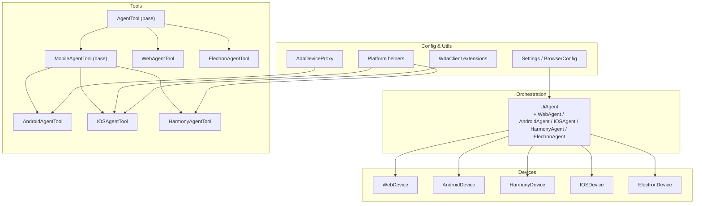
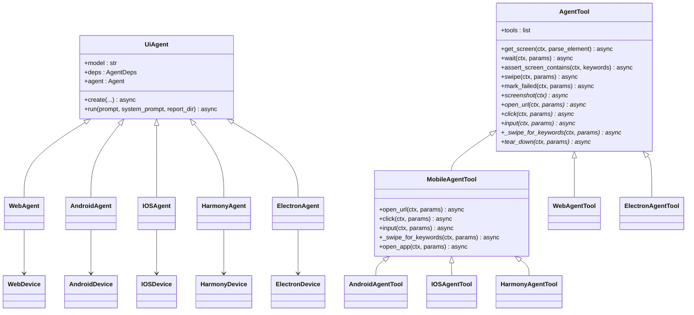
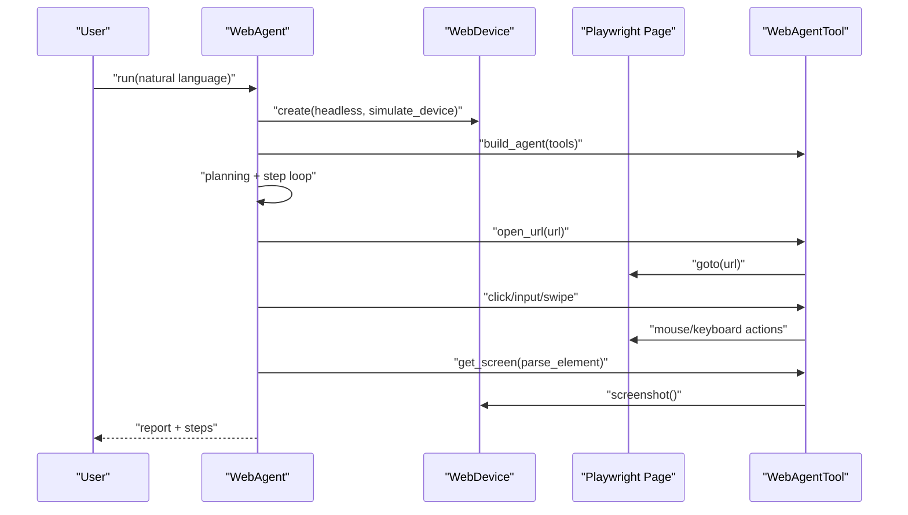
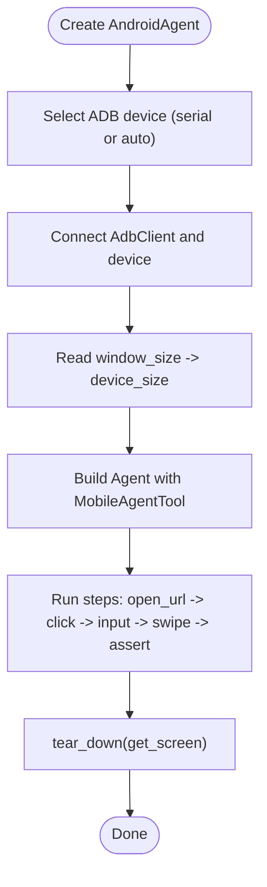
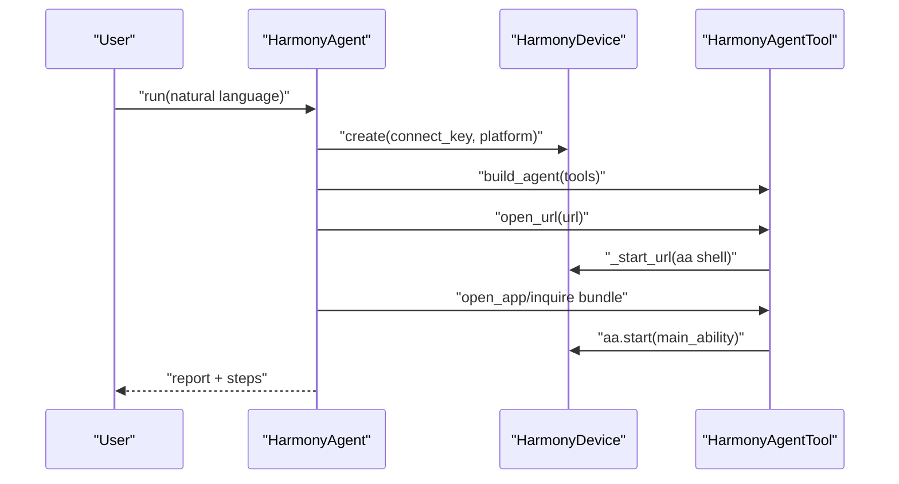
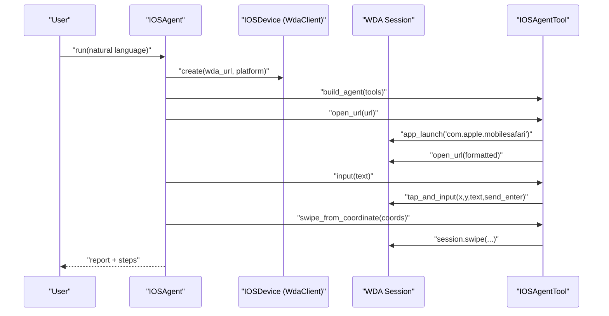
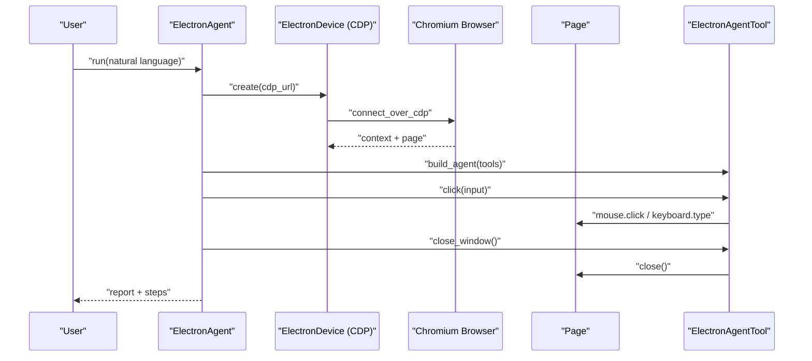
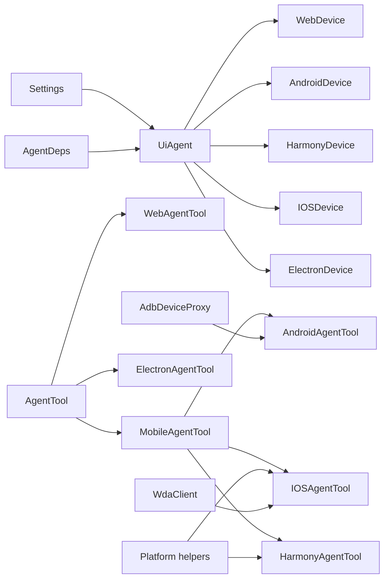

# Agent Types and Usage

<cite>
**Referenced Files in This Document**
- [agent.py](file://src/page_eyes/agent.py)
- [device.py](file://src/page_eyes/device.py)
- [deps.py](file://src/page_eyes/deps.py)
- [config.py](file://src/page_eyes/config.py)
- [platform.py](file://src/page_eyes/util/platform.py)
- [adb_tool.py](file://src/page_eyes/util/adb_tool.py)
- [wda_tool.py](file://src/page_eyes/util/wda_tool.py)
- [tools/_base.py](file://src/page_eyes/tools/_base.py)
- [tools/_mobile.py](file://src/page_eyes/tools/_mobile.py)
- [tools/web.py](file://src/page_eyes/tools/web.py)
- [tools/android.py](file://src/page_eyes/tools/android.py)
- [tools/ios.py](file://src/page_eyes/tools/ios.py)
- [tools/harmony.py](file://src/page_eyes/tools/harmony.py)
- [tools/electron.py](file://src/page_eyes/tools/electron.py)
- [test_web_agent.py](file://tests/test_web_agent.py)
- [test_android_agent.py](file://tests/test_android_agent.py)
- [test_ios_agent.py](file://tests/test_ios_agent.py)
- [test_harmony_agent.py](file://tests/test_harmony_agent.py)
- [test_electron_agent.py](file://tests/test_electron_agent.py)
</cite>

## Table of Contents
1. [Introduction](#introduction)
2. [Project Structure](#project-structure)
3. [Core Components](#core-components)
4. [Architecture Overview](#architecture-overview)
5. [Detailed Component Analysis](#detailed-component-analysis)
6. [Dependency Analysis](#dependency-analysis)
7. [Performance Considerations](#performance-considerations)
8. [Troubleshooting Guide](#troubleshooting-guide)
9. [Conclusion](#conclusion)
10. [Appendices](#appendices)

## Introduction
This document explains the PageEyes Agent framework and its five platform-specific agents: WebAgent for browser automation, AndroidAgent for Android devices via ADB, IOSAgent for iOS devices via WebDriverAgent (WDA), HarmonyAgent for HarmonyOS devices, and ElectronAgent for desktop applications. It covers the common UiAgent interface, platform-specific extensions, configuration requirements, usage patterns, device setup, capability differences, best practices, underlying tool implementations, device abstraction layers, unified APIs, and troubleshooting strategies.

## Project Structure
The PageEyes codebase organizes automation around a shared UiAgent orchestration layer with platform-specific Device and Tool implementations:
- Orchestration and agent creation: UiAgent and platform-specific subclasses
- Device abstractions: WebDevice, AndroidDevice, HarmonyDevice, IOSDevice, ElectronDevice
- Unified tooling: AgentTool base with platform-specific overrides
- Configuration: Settings, BrowserConfig, and environment-driven configuration
- Utilities: Platform URL schema helpers, ADB proxy, WDA client extensions

**Diagram sources**
- [agent.py:97-515](file://src/page_eyes/agent.py#L97-L515)
- [device.py:54-390](file://src/page_eyes/device.py#L54-L390)
- [tools/_base.py:130-391](file://src/page_eyes/tools/_base.py#L130-L391)
- [tools/_mobile.py:27-165](file://src/page_eyes/tools/_mobile.py#L27-L165)
- [tools/web.py:24-179](file://src/page_eyes/tools/web.py#L24-L179)
- [tools/android.py:18-23](file://src/page_eyes/tools/android.py#L18-L23)
- [tools/ios.py:24-293](file://src/page_eyes/tools/ios.py#L24-L293)
- [tools/harmony.py:20-68](file://src/page_eyes/tools/harmony.py#L20-L68)
- [tools/electron.py:21-134](file://src/page_eyes/tools/electron.py#L21-L134)
- [config.py:54-73](file://src/page_eyes/config.py#L54-L73)
- [platform.py:48-66](file://src/page_eyes/util/platform.py#L48-L66)
- [adb_tool.py:12-37](file://src/page_eyes/util/adb_tool.py#L12-L37)
- [wda_tool.py:35-129](file://src/page_eyes/util/wda_tool.py#L35-L129)

**Section sources**
- [agent.py:97-515](file://src/page_eyes/agent.py#L97-L515)
- [device.py:54-390](file://src/page_eyes/device.py#L54-L390)
- [tools/_base.py:130-391](file://src/page_eyes/tools/_base.py#L130-L391)
- [tools/_mobile.py:27-165](file://src/page_eyes/tools/_mobile.py#L27-L165)
- [tools/web.py:24-179](file://src/page_eyes/tools/web.py#L24-L179)
- [tools/android.py:18-23](file://src/page_eyes/tools/android.py#L18-L23)
- [tools/ios.py:24-293](file://src/page_eyes/tools/ios.py#L24-L293)
- [tools/harmony.py:20-68](file://src/page_eyes/tools/harmony.py#L20-L68)
- [tools/electron.py:21-134](file://src/page_eyes/tools/electron.py#L21-L134)
- [config.py:54-73](file://src/page_eyes/config.py#L54-L73)
- [platform.py:48-66](file://src/page_eyes/util/platform.py#L48-L66)
- [adb_tool.py:12-37](file://src/page_eyes/util/adb_tool.py#L12-L37)
- [wda_tool.py:35-129](file://src/page_eyes/util/wda_tool.py#L35-L129)

## Core Components
- UiAgent orchestrator: Creates platform-specific devices, builds the agent with skills, runs planning, executes steps, and generates reports.
- Device abstractions: Encapsulate low-level clients and expose a unified device_size and platform metadata.
- AgentTool base: Provides common tooling (screenshot, get_screen, wait/assert, swipe, mark_failed) and platform-specific overrides.
- Platform helpers: Convert URLs to platform-specific schemes for native app opening.
- Utilities: ADB proxy for text input on Android; WDA client extensions for app listing and input.

Key responsibilities:
- UiAgent: orchestration, planning, step execution, reporting, error handling.
- Device: connection, sizing, and platform metadata.
- Tools: cross-platform actions plus platform-specific implementations.

**Section sources**
- [agent.py:97-314](file://src/page_eyes/agent.py#L97-L314)
- [device.py:42-390](file://src/page_eyes/device.py#L42-L390)
- [tools/_base.py:130-391](file://src/page_eyes/tools/_base.py#L130-L391)
- [platform.py:14-66](file://src/page_eyes/util/platform.py#L14-L66)
- [adb_tool.py:12-37](file://src/page_eyes/util/adb_tool.py#L12-L37)
- [wda_tool.py:35-129](file://src/page_eyes/util/wda_tool.py#L35-L129)

## Architecture Overview
The system composes a generic UiAgent with platform-specific Device and Tool implementations. The AgentTool base exposes a unified API surface, while platform-specific tools override behavior (e.g., click/input/screenshot/open_url).

**Diagram sources**
- [agent.py:97-515](file://src/page_eyes/agent.py#L97-L515)
- [tools/_base.py:130-391](file://src/page_eyes/tools/_base.py#L130-L391)
- [tools/_mobile.py:27-165](file://src/page_eyes/tools/_mobile.py#L27-L165)
- [tools/web.py:24-179](file://src/page_eyes/tools/web.py#L24-L179)
- [tools/android.py:18-23](file://src/page_eyes/tools/android.py#L18-L23)
- [tools/ios.py:24-293](file://src/page_eyes/tools/ios.py#L24-L293)
- [tools/harmony.py:20-68](file://src/page_eyes/tools/harmony.py#L20-L68)
- [tools/electron.py:21-134](file://src/page_eyes/tools/electron.py#L21-L134)
- [device.py:54-390](file://src/page_eyes/device.py#L54-L390)

## Detailed Component Analysis

### WebAgent
- Purpose: Browser automation using Playwright on desktop or simulated mobile devices.
- Device: WebDevice creates a persistent Chromium context, supports headless mode and device emulation.
- Tools: WebAgentTool extends AgentTool with Playwright-specific actions (navigation, clicking, input, swiping, back navigation).
- Configuration: BrowserConfig controls headless and simulate_device; Settings sets model and VLM/LLM mode.
- Usage pattern: Create WebAgent with optional device, simulate_device, headless; run natural-language instructions; tools handle screenshots and element parsing.

**Diagram sources**
- [agent.py:316-363](file://src/page_eyes/agent.py#L316-L363)
- [device.py:59-100](file://src/page_eyes/device.py#L59-L100)
- [tools/web.py:46-92](file://src/page_eyes/tools/web.py#L46-L92)
- [tools/_base.py:167-203](file://src/page_eyes/tools/_base.py#L167-L203)

**Section sources**
- [agent.py:316-363](file://src/page_eyes/agent.py#L316-L363)
- [device.py:59-100](file://src/page_eyes/device.py#L59-L100)
- [tools/web.py:24-179](file://src/page_eyes/tools/web.py#L24-L179)
- [config.py:40-45](file://src/page_eyes/config.py#L40-L45)

Best practices:
- Use simulate_device for mobile H5 testing; adjust headless for CI.
- Prefer swipe_for_keywords with expect_keywords to stabilize flaky scrolls.
- Use get_screen_info_vl for pure-VLM flows.

Common issues:
- Headless vs visible UI differences; enable headless=False for debugging.
- Element timing; use wait/expect_screen_contains before actions.

### AndroidAgent
- Purpose: Android automation via ADB; supports real devices or emulators.
- Device: AndroidDevice connects via AdbClient, resolves device_size from window metrics.
- Tools: AndroidAgentTool inherits MobileAgentTool; adds platform URL schema handling via get_client_url_schema.
- Configuration: Settings for model and debug; device selection via serial or auto-selection.
- Usage pattern: Create AndroidAgent with optional serial/platform; run commands to open apps/URLs, swipe, input, and assert.

**Diagram sources**
- [agent.py:365-401](file://src/page_eyes/agent.py#L365-L401)
- [device.py:106-127](file://src/page_eyes/device.py#L106-L127)
- [tools/_mobile.py:49-84](file://src/page_eyes/tools/_mobile.py#L49-L84)
- [tools/android.py:20-23](file://src/page_eyes/tools/android.py#L20-L23)
- [platform.py:48-66](file://src/page_eyes/util/platform.py#L48-L66)

**Section sources**
- [agent.py:365-401](file://src/page_eyes/agent.py#L365-L401)
- [device.py:106-127](file://src/page_eyes/device.py#L106-L127)
- [tools/_mobile.py:27-165](file://src/page_eyes/tools/_mobile.py#L27-L165)
- [tools/android.py:18-23](file://src/page_eyes/tools/android.py#L18-L23)
- [platform.py:48-66](file://src/page_eyes/util/platform.py#L48-L66)

Best practices:
- Ensure ADB server is running and devices are connected; use serial for deterministic targeting.
- Use AdbDeviceProxy for reliable text input on Android.
- Prefer swipe_for_keywords with repeat_times and expect_keywords.

Common issues:
- ADB connect failures; verify network adb or USB connection.
- Input method issues; leverage AdbDeviceProxy input_text.

### HarmonyAgent
- Purpose: HarmonyOS device automation via HDC/HMS Toolkit.
- Device: HarmonyDevice connects via HdcClient, resolves device_size similarly to Android.
- Tools: HarmonyAgentTool inherits MobileAgentTool; adds Harmony-specific URL launching and app opening via bundle resolution.
- Configuration: Settings for model/debug; device selection via connect_key.
- Usage pattern: Create HarmonyAgent with optional connect_key/platform; run commands to open apps/URLs, swipe, input, and assert.

**Diagram sources**
- [agent.py:403-439](file://src/page_eyes/agent.py#L403-L439)
- [device.py:133-156](file://src/page_eyes/device.py#L133-L156)
- [tools/harmony.py:20-68](file://src/page_eyes/tools/harmony.py#L20-L68)

**Section sources**
- [agent.py:403-439](file://src/page_eyes/agent.py#L403-L439)
- [device.py:133-156](file://src/page_eyes/device.py#L133-L156)
- [tools/harmony.py:20-68](file://src/page_eyes/tools/harmony.py#L20-L68)

Best practices:
- Use connect_key for remote Harmony devices; ensure HDC service is enabled.
- Use app_name_map or LLM-assisted bundle resolution for app opening.

Common issues:
- HDC connect failures; verify device pairing and HDC daemon.
- App bundle resolution; fallback to LLM matching when app_name_map insufficient.

### IOSAgent
- Purpose: iOS device automation via WebDriverAgent (WDA).
- Device: IOSDevice connects to WDA, retrieves device_size; supports auto-start of WDA under macOS with Xcode.
- Tools: IOSAgentTool inherits MobileAgentTool; provides WDA-native click/input, swipe, coordinate-based swipes, back/home gestures, URL opening via Safari, and app launching with bundle ID resolution.
- Configuration: Requires wda_url; optional app_name_map for friendly app names to bundle IDs.
- Usage pattern: Create IOSAgent with wda_url/platform/app_name_map; run commands to open Safari/URLs, navigate, input, swipe, and assert.

**Diagram sources**
- [agent.py:441-478](file://src/page_eyes/agent.py#L441-L478)
- [device.py:164-228](file://src/page_eyes/device.py#L164-L228)
- [tools/ios.py:24-293](file://src/page_eyes/tools/ios.py#L24-L293)
- [wda_tool.py:35-129](file://src/page_eyes/util/wda_tool.py#L35-L129)

**Section sources**
- [agent.py:441-478](file://src/page_eyes/agent.py#L441-L478)
- [device.py:164-228](file://src/page_eyes/device.py#L164-L228)
- [tools/ios.py:24-293](file://src/page_eyes/tools/ios.py#L24-L293)
- [wda_tool.py:35-129](file://src/page_eyes/util/wda_tool.py#L35-L129)

Best practices:
- Ensure WDA is reachable at wda_url; on macOS, use auto-start with proper environment variables.
- Use app_name_map for ambiguous app names; otherwise rely on LLM to pick bundle ID from device list.
- Prefer swipe_from_coordinate for precise gestures.

Common issues:
- WDA unreachable; verify URL and local/remote accessibility.
- App launch failures; confirm bundle ID validity.

### ElectronAgent
- Purpose: Desktop application automation for Electron apps via CDP.
- Device: ElectronDevice connects via Chromium CDP to an already-running Electron app; manages page stack and window switching.
- Tools: ElectronAgentTool extends WebAgentTool with CDP-aware screenshot and click handling; adds close_window and specialized teardown.
- Configuration: Requires cdp_url pointing to the running Electron app’s debugger endpoint.
- Usage pattern: Start Electron with --remote-debugging-port; create ElectronAgent; run commands to click, input, close windows, and assert.

**Diagram sources**
- [agent.py:480-515](file://src/page_eyes/agent.py#L480-L515)
- [device.py:243-293](file://src/page_eyes/device.py#L243-L293)
- [tools/electron.py:21-134](file://src/page_eyes/tools/electron.py#L21-L134)

**Section sources**
- [agent.py:480-515](file://src/page_eyes/agent.py#L480-L515)
- [device.py:243-293](file://src/page_eyes/device.py#L243-L293)
- [tools/electron.py:21-134](file://src/page_eyes/tools/electron.py#L21-L134)

Best practices:
- Launch Electron with --remote-debugging-port; verify http://127.0.0.1:PORT/json endpoint.
- Use switch_to_latest_page semantics; handle new windows automatically.

Common issues:
- CDP connection fails; verify port and CORS/devtools settings.
- Window management; ensure page close events update target and device_size.

## Dependency Analysis
- UiAgent depends on Settings, AgentDeps, and platform-specific Device/Tool pairs.
- AgentTool depends on unified parsing and storage; platform-specific tools depend on device clients.
- Platform helpers convert URLs to platform-specific schemes; ADB/WDA utilities extend device capabilities.

**Diagram sources**
- [agent.py:97-515](file://src/page_eyes/agent.py#L97-L515)
- [tools/_base.py:130-391](file://src/page_eyes/tools/_base.py#L130-L391)
- [tools/_mobile.py:27-165](file://src/page_eyes/tools/_mobile.py#L27-L165)
- [tools/android.py:18-23](file://src/page_eyes/tools/android.py#L18-L23)
- [tools/ios.py:24-293](file://src/page_eyes/tools/ios.py#L24-L293)
- [tools/harmony.py:20-68](file://src/page_eyes/tools/harmony.py#L20-L68)
- [tools/electron.py:21-134](file://src/page_eyes/tools/electron.py#L21-L134)
- [platform.py:48-66](file://src/page_eyes/util/platform.py#L48-L66)
- [adb_tool.py:12-37](file://src/page_eyes/util/adb_tool.py#L12-L37)
- [wda_tool.py:35-129](file://src/page_eyes/util/wda_tool.py#L35-L129)

**Section sources**
- [agent.py:97-515](file://src/page_eyes/agent.py#L97-L515)
- [tools/_base.py:130-391](file://src/page_eyes/tools/_base.py#L130-L391)
- [tools/_mobile.py:27-165](file://src/page_eyes/tools/_mobile.py#L27-L165)
- [tools/android.py:18-23](file://src/page_eyes/tools/android.py#L18-L23)
- [tools/ios.py:24-293](file://src/page_eyes/tools/ios.py#L24-L293)
- [tools/harmony.py:20-68](file://src/page_eyes/tools/harmony.py#L20-L68)
- [tools/electron.py:21-134](file://src/page_eyes/tools/electron.py#L21-L134)
- [platform.py:48-66](file://src/page_eyes/util/platform.py#L48-L66)
- [adb_tool.py:12-37](file://src/page_eyes/util/adb_tool.py#L12-L37)
- [wda_tool.py:35-129](file://src/page_eyes/util/wda_tool.py#L35-L129)

## Performance Considerations
- Use wait/expect_screen_contains to avoid busy-wait loops; tune timeouts per platform.
- Prefer swipe_for_keywords with minimal repeat_times and expect_keywords to reduce unnecessary swipes.
- For Electron, use CDP’s CSS scaling to avoid DPR mismatch causing click offsets.
- For iOS, batch operations and avoid redundant app launches; cache bundle ID mappings via app_name_map.
- For Android, push lightweight input helper once and reuse.

## Troubleshooting Guide
- WebAgent
  - Symptom: Elements not found or timing issues.
  - Action: Add wait/expect_screen_contains; verify simulate_device viewport; disable headless for inspection.
  - Reference: [tools/web.py:46-92](file://src/page_eyes/tools/web.py#L46-L92), [tools/_base.py:237-264](file://src/page_eyes/tools/_base.py#L237-L264)

- AndroidAgent
  - Symptom: ADB connect failure.
  - Action: Verify adb devices, network adb, or USB debugging; specify serial explicitly.
  - Reference: [device.py:111-122](file://src/page_eyes/device.py#L111-L122)

  - Symptom: Text input not working.
  - Action: Use AdbDeviceProxy input_text; ensure IME is ready.
  - Reference: [adb_tool.py:35-37](file://src/page_eyes/util/adb_tool.py#L35-L37)

- HarmonyAgent
  - Symptom: HDC connect failure.
  - Action: Pair device, enable HDC, check connect_key; verify aa/bm commands availability.
  - Reference: [device.py:140-151](file://src/page_eyes/device.py#L140-L151)

- IOSAgent
  - Symptom: WDA unreachable.
  - Action: Confirm wda_url; on macOS, ensure Xcode and WDA project configured; use auto-start if environment variables present.
  - Reference: [device.py:180-227](file://src/page_eyes/device.py#L180-L227)

  - Symptom: App launch fails.
  - Action: Validate bundle ID; use app_name_map or LLM-assisted resolution.
  - Reference: [tools/ios.py:266-292](file://src/page_eyes/tools/ios.py#L266-L292)

- ElectronAgent
  - Symptom: CDP connection fails.
  - Action: Launch Electron with --remote-debugging-port; verify JSON endpoint.
  - Reference: [device.py:253-271](file://src/page_eyes/device.py#L253-L271)

  - Symptom: Clicks miss targets.
  - Action: Ensure CSS scale for screenshots; handle new windows after clicks.
  - Reference: [tools/electron.py:39-88](file://src/page_eyes/tools/electron.py#L39-L88)

## Conclusion
PageEyes provides a unified UiAgent interface with robust platform-specific extensions. By leveraging Device abstractions and AgentTool implementations, it exposes consistent APIs across Web, Android, HarmonyOS, iOS, and Electron environments. Proper configuration, device setup, and platform-specific best practices lead to reliable automation. The included tools and utilities streamline common tasks like screenshots, element parsing, waits, assertions, and gestures, while platform helpers ensure URLs open in the correct native contexts.

## Appendices

### Configuration Requirements
- Settings: model, model_type (llm/vlm), model_settings, browser (headless, simulate_device), omni_parser, storage_client, debug.
- Environment variables: agent_*, browser_*, cos_*, minio_*.
- Platform-specific:
  - Web: simulate_device device name or None; headless toggle.
  - Android: serial or auto-select; platform enum.
  - Harmony: connect_key or auto-select; platform enum.
  - iOS: wda_url; optional app_name_map; platform enum.
  - Electron: cdp_url.

**Section sources**
- [config.py:54-73](file://src/page_eyes/config.py#L54-L73)
- [device.py:64-87](file://src/page_eyes/device.py#L64-L87)
- [agent.py:345-362](file://src/page_eyes/agent.py#L345-L362)
- [agent.py:392-400](file://src/page_eyes/agent.py#L392-L400)
- [agent.py:430-438](file://src/page_eyes/agent.py#L430-L438)
- [agent.py:469-477](file://src/page_eyes/agent.py#L469-L477)
- [agent.py:505-514](file://src/page_eyes/agent.py#L505-L514)

### Capability Differences and Unified APIs
- Unified tools: get_screen, wait, assert_screen_contains/not_contains, swipe, mark_failed, tear_down.
- Platform-specific overrides:
  - Web: Playwright mouse/keyboard, file chooser, page transitions.
  - Mobile: device.click/input via device client; AdbDeviceProxy for Android text input.
  - iOS: WDA tap_and_input, swipe, coordinate-based gestures, Safari open_url, app launch with bundle ID.
  - Harmony: aa shell for URL/app; bundle resolution via device manager.
  - Electron: CDP screenshot with CSS scale, window close, page stack management.

**Section sources**
- [tools/_base.py:167-391](file://src/page_eyes/tools/_base.py#L167-L391)
- [tools/web.py:24-179](file://src/page_eyes/tools/web.py#L24-L179)
- [tools/_mobile.py:27-165](file://src/page_eyes/tools/_mobile.py#L27-L165)
- [tools/ios.py:24-293](file://src/page_eyes/tools/ios.py#L24-L293)
- [tools/harmony.py:20-68](file://src/page_eyes/tools/harmony.py#L20-L68)
- [tools/electron.py:21-134](file://src/page_eyes/tools/electron.py#L21-L134)

### Usage Patterns and Examples
- WebAgent: open URL, scroll until element appears, click relative positions, upload files, wait and assert.
  - References: [test_web_agent.py:11-209](file://tests/test_web_agent.py#L11-L209)
- AndroidAgent: open apps, open URLs, swipe, input text, handle popups.
  - References: [test_android_agent.py:11-70](file://tests/test_android_agent.py#L11-L70)
- IOSAgent: open Safari, search, navigate, input, swipe, back/home, open native apps.
  - References: [test_ios_agent.py:11-212](file://tests/test_ios_agent.py#L11-L212)
- HarmonyAgent: open apps, open URLs, swipe, input.
  - References: [test_harmony_agent.py:11-49](file://tests/test_harmony_agent.py#L11-L49)
- ElectronAgent: click, input, close window, assert generated content.
  - References: [test_electron_agent.py:8-20](file://tests/test_electron_agent.py#L8-L20)