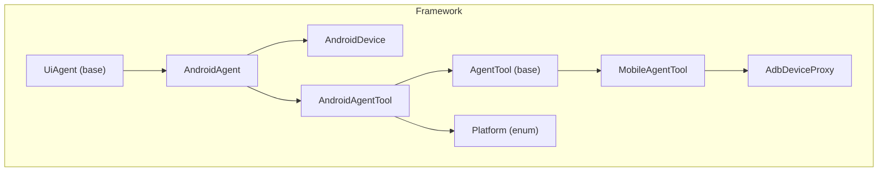
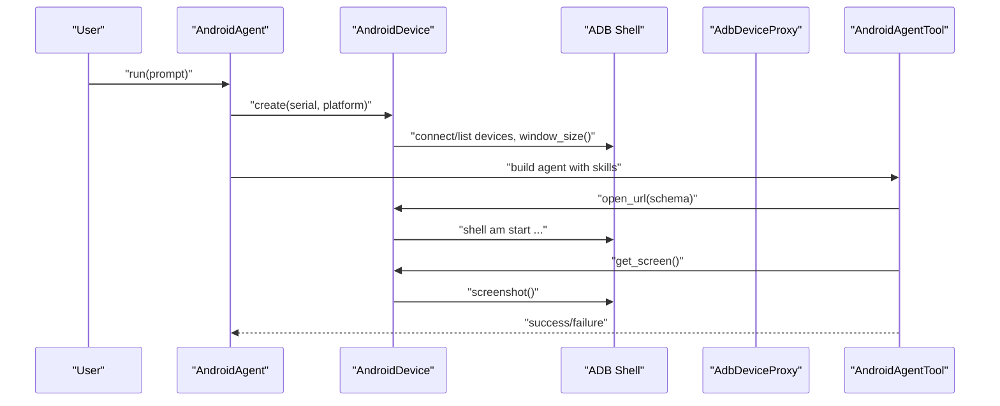
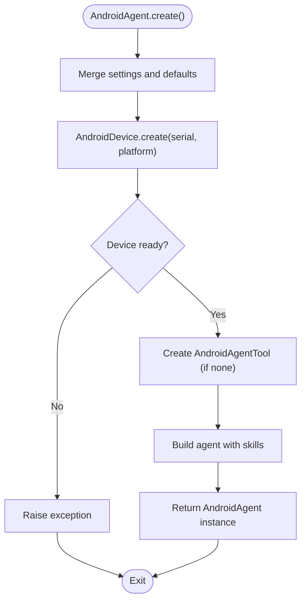
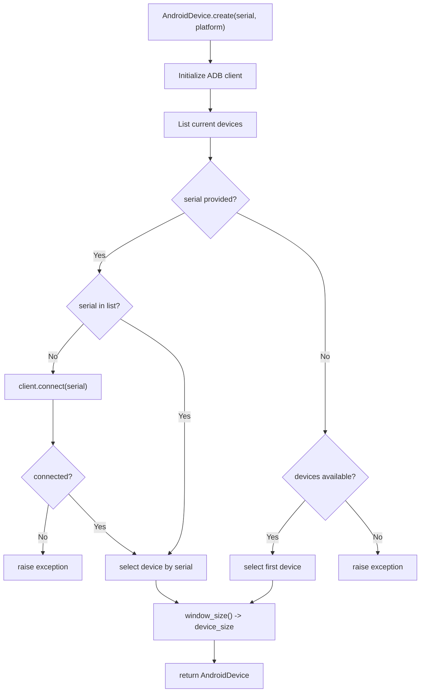
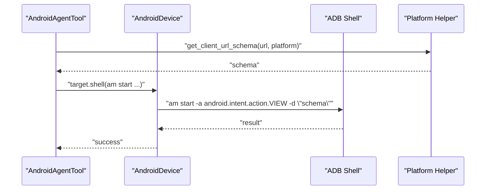
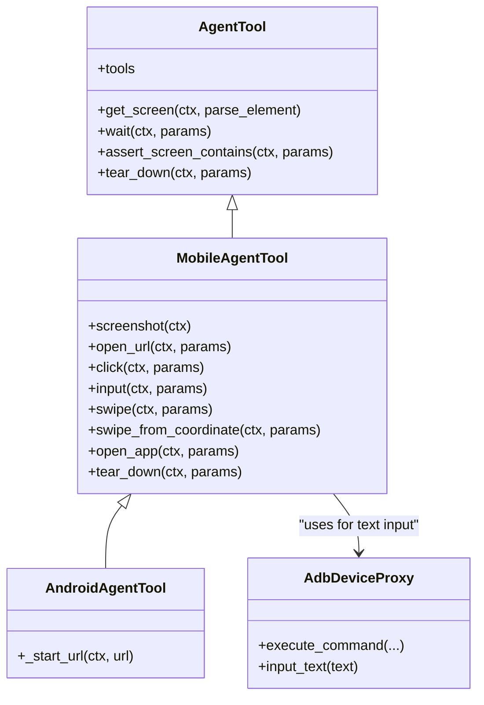
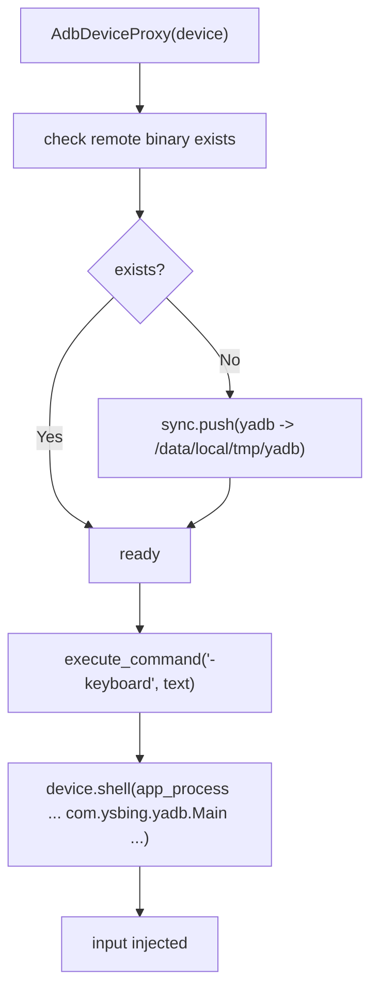
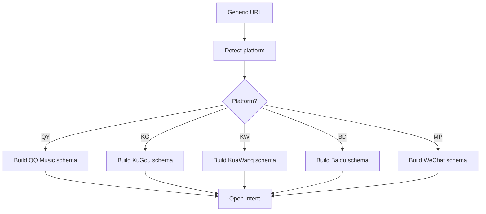
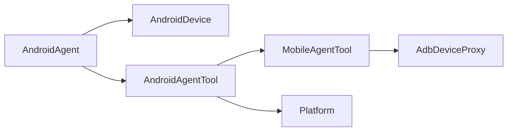

# Android Agent

<cite>
**Referenced Files in This Document**
- [agent.py](file://src/page_eyes/agent.py)
- [device.py](file://src/page_eyes/device.py)
- [android.py](file://src/page_eyes/tools/android.py)
- [_mobile.py](file://src/page_eyes/tools/_mobile.py)
- [adb_tool.py](file://src/page_eyes/util/adb_tool.py)
- [platform.py](file://src/page_eyes/util/platform.py)
- [deps.py](file://src/page_eyes/deps.py)
- [config.py](file://src/page_eyes/config.py)
- [installation.md](file://docs/getting-started/installation.md)
- [troubleshooting.md](file://docs/faq/troubleshooting.md)
- [test_android_agent.py](file://tests/test_android_agent.py)
</cite>

## Table of Contents
1. [Introduction](#introduction)
2. [Project Structure](#project-structure)
3. [Core Components](#core-components)
4. [Architecture Overview](#architecture-overview)
5. [Detailed Component Analysis](#detailed-component-analysis)
6. [Dependency Analysis](#dependency-analysis)
7. [Performance Considerations](#performance-considerations)
8. [Troubleshooting Guide](#troubleshooting-guide)
9. [Conclusion](#conclusion)
10. [Appendices](#appendices)

## Introduction
This document provides comprehensive documentation for the AndroidAgent class, focusing on Android mobile device automation powered by ADB integration. It explains the AndroidAgent implementation, device connection mechanisms, serial number specification, platform type configuration, and integration with ADB utilities. It also details the AndroidAgent.create() factory method parameters, Android-specific automation capabilities (touch gestures, swipe operations, text input, app launching, and system interactions), device setup procedures for USB debugging and ADB configuration, practical examples for app navigation and form automation, and troubleshooting guidance for common ADB and automation issues.

## Project Structure
The Android automation capability is implemented as part of a unified multi-device automation framework. The AndroidAgent leverages:
- A device abstraction layer for Android via AndroidDevice
- A shared tool layer for mobile operations (touch, swipe, input, app launch)
- ADB utilities for device interaction and text input injection
- Platform configuration for URL schema routing to native clients
- A skills-based toolset for extensibility

**Diagram sources**
- [agent.py:365-401](file://src/page_eyes/agent.py#L365-L401)
- [device.py:102-126](file://src/page_eyes/device.py#L102-L126)
- [android.py:18-22](file://src/page_eyes/tools/android.py#L18-L22)
- [_mobile.py:27-47](file://src/page_eyes/tools/_mobile.py#L27-L47)
- [adb_tool.py:12-36](file://src/page_eyes/util/adb_tool.py#L12-L36)
- [platform.py:14-65](file://src/page_eyes/util/platform.py#L14-L65)

**Section sources**
- [agent.py:365-401](file://src/page_eyes/agent.py#L365-L401)
- [device.py:102-126](file://src/page_eyes/device.py#L102-L126)
- [android.py:18-22](file://src/page_eyes/tools/android.py#L18-L22)
- [_mobile.py:27-47](file://src/page_eyes/tools/_mobile.py#L27-L47)
- [adb_tool.py:12-36](file://src/page_eyes/util/adb_tool.py#L12-L36)
- [platform.py:14-65](file://src/page_eyes/util/platform.py#L14-L65)

## Core Components
- AndroidAgent: The Android-specific agent that orchestrates tasks on Android devices. It exposes a factory method AndroidAgent.create() to configure model, device serial, platform type, custom tool instances, skills directories, and debug flags.
- AndroidDevice: Encapsulates ADB client and device connection, resolving device size and providing shell access for automation.
- AndroidAgentTool: Extends the mobile tool layer to support Android-specific URL opening via platform-aware schema generation.
- MobileAgentTool: Provides shared tooling for screenshots, clicks, input, swipes, app launches, and teardown.
- AdbDeviceProxy: Utility to push and invoke a helper binary on the device for keyboard input injection.
- Platform: Enumeration and helpers to generate platform-specific URL schemas for opening external URLs inside native clients.

Key responsibilities:
- AndroidAgent.create(): Builds settings, creates AndroidDevice, binds AndroidAgentTool, and constructs the agent with skills capability.
- AndroidDevice.create(): Connects to ADB, resolves device serial, and retrieves screen size.
- MobileAgentTool: Implements cross-platform tooling for UI actions and parsing.
- AdbDeviceProxy: Pushes a helper binary to the device and executes commands to inject text.
- Platform helpers: Convert generic URLs to platform-specific schemas.

**Section sources**
- [agent.py:365-401](file://src/page_eyes/agent.py#L365-L401)
- [device.py:102-126](file://src/page_eyes/device.py#L102-L126)
- [android.py:18-22](file://src/page_eyes/tools/android.py#L18-L22)
- [_mobile.py:27-47](file://src/page_eyes/tools/_mobile.py#L27-L47)
- [adb_tool.py:12-36](file://src/page_eyes/util/adb_tool.py#L12-L36)
- [platform.py:14-65](file://src/page_eyes/util/platform.py#L14-L65)

## Architecture Overview
The Android automation pipeline integrates natural language instructions with device-specific actions through a skills-based toolset. The AndroidAgent delegates device operations to AndroidDevice, which uses ADB to interact with the Android shell. Text input is handled via AdbDeviceProxy, which pushes a helper binary onto the device and invokes it to simulate keyboard input. URL opening is routed through platform-aware schema generation to open links inside native clients when applicable.

**Diagram sources**
- [agent.py:365-401](file://src/page_eyes/agent.py#L365-L401)
- [device.py:102-126](file://src/page_eyes/device.py#L102-L126)
- [android.py:20-22](file://src/page_eyes/tools/android.py#L20-L22)
- [_mobile.py:34-47](file://src/page_eyes/tools/_mobile.py#L34-L47)
- [adb_tool.py:18-36](file://src/page_eyes/util/adb_tool.py#L18-L36)

## Detailed Component Analysis

### AndroidAgent.create() Factory Method
The AndroidAgent.create() method is the primary entry point for constructing an Android automation agent. It accepts:
- model: Optional LLM model identifier
- serial: Optional Android device serial number (supports TCP/IP or USB)
- platform: Optional platform type for URL schema routing
- tool: Optional custom AndroidAgentTool instance
- skills_dirs: Optional list of skill directories to extend capabilities
- debug: Optional debug flag to enable verbose logging

Behavior:
- Merges settings and applies defaults
- Creates AndroidDevice with optional serial and platform
- Instantiates AndroidAgentTool if not provided
- Builds the agent with skills capability and returns an AndroidAgent instance

**Diagram sources**
- [agent.py:368-400](file://src/page_eyes/agent.py#L368-L400)
- [device.py:106-126](file://src/page_eyes/device.py#L106-L126)

**Section sources**
- [agent.py:368-400](file://src/page_eyes/agent.py#L368-L400)
- [device.py:106-126](file://src/page_eyes/device.py#L106-L126)

### AndroidDevice: ADB Connection and Device Resolution
AndroidDevice.create() manages ADB connections:
- Initializes ADB client and lists connected devices
- If serial is provided and not present, attempts ADB connect
- Selects the specified device or falls back to the first available device
- Retrieves window size to compute device dimensions

**Diagram sources**
- [device.py:106-126](file://src/page_eyes/device.py#L106-L126)

**Section sources**
- [device.py:106-126](file://src/page_eyes/device.py#L106-L126)

### AndroidAgentTool: URL Opening on Android
AndroidAgentTool extends MobileAgentTool and overrides URL opening to use Android’s intent system with platform-aware schema conversion.

Key behavior:
- Uses platform-aware schema generation to convert URLs into platform-specific intents
- Executes an ADB shell command to start the activity with the constructed URL

**Diagram sources**
- [android.py:20-22](file://src/page_eyes/tools/android.py#L20-L22)
- [platform.py:48-65](file://src/page_eyes/util/platform.py#L48-L65)

**Section sources**
- [android.py:20-22](file://src/page_eyes/tools/android.py#L20-L22)
- [platform.py:48-65](file://src/page_eyes/util/platform.py#L48-L65)

### MobileAgentTool: Cross-Platform UI Operations
MobileAgentTool provides shared tooling for Android, iOS, and Harmony devices:
- Screenshot capture and element parsing
- Click at computed coordinates
- Text input via AdbDeviceProxy for Android
- Swipe operations with direction and repeat logic
- App launch by resolving package name from device package list
- Teardown to finalize automation

**Diagram sources**
- [_mobile.py:27-164](file://src/page_eyes/tools/_mobile.py#L27-L164)
- [android.py:18-22](file://src/page_eyes/tools/android.py#L18-L22)
- [adb_tool.py:12-36](file://src/page_eyes/util/adb_tool.py#L12-L36)

**Section sources**
- [_mobile.py:27-164](file://src/page_eyes/tools/_mobile.py#L27-L164)
- [android.py:18-22](file://src/page_eyes/tools/android.py#L18-L22)
- [adb_tool.py:12-36](file://src/page_eyes/util/adb_tool.py#L12-L36)

### AdbDeviceProxy: Text Input Injection
AdbDeviceProxy encapsulates pushing a helper binary to the device and invoking it to simulate keyboard input:
- Ensures the helper binary exists on the device via ADB sync
- Invokes a Java-based entry point to perform keyboard input
- Supports sending Enter key events after input

**Diagram sources**
- [adb_tool.py:12-36](file://src/page_eyes/util/adb_tool.py#L12-L36)

**Section sources**
- [adb_tool.py:12-36](file://src/page_eyes/util/adb_tool.py#L12-L36)

### Platform Configuration and URL Schema Routing
Platform enumeration and helpers convert generic URLs into platform-specific schemas for opening inside native clients. This enables AndroidAgentTool to route URLs to appropriate apps or clients based on the configured platform.

**Diagram sources**
- [platform.py:14-65](file://src/page_eyes/util/platform.py#L14-L65)

**Section sources**
- [platform.py:14-65](file://src/page_eyes/util/platform.py#L14-L65)

### Android-Specific Automation Capabilities
- Touch gestures: Click at computed coordinates using device target
- Swipe operations: Directional swipe with repeat and keyword-expectation support
- Text input: Click target and inject text via AdbDeviceProxy; optionally send Enter
- App launching: Resolve package name from device package list and start app
- System interactions: Use ADB shell commands for URL opening and other system-level operations

Practical examples (see tests for end-to-end scenarios):
- Launching apps by name
- Navigating via URLs with platform-aware schema routing
- Form automation with input and Enter key handling
- Scroll-based navigation with swipe operations until expected keywords appear

**Section sources**
- [_mobile.py:62-164](file://src/page_eyes/tools/_mobile.py#L62-L164)
- [android.py:20-22](file://src/page_eyes/tools/android.py#L20-L22)
- [test_android_agent.py:11-70](file://tests/test_android_agent.py#L11-L70)

## Dependency Analysis
The Android automation stack exhibits clear separation of concerns:
- AndroidAgent depends on AndroidDevice and AndroidAgentTool
- AndroidAgentTool depends on MobileAgentTool and Platform helpers
- MobileAgentTool depends on AdbDeviceProxy for Android text input
- AndroidDevice depends on ADB client and device APIs

**Diagram sources**
- [agent.py:365-401](file://src/page_eyes/agent.py#L365-L401)
- [android.py:18-22](file://src/page_eyes/tools/android.py#L18-L22)
- [_mobile.py:27-47](file://src/page_eyes/tools/_mobile.py#L27-L47)
- [adb_tool.py:12-36](file://src/page_eyes/util/adb_tool.py#L12-L36)
- [platform.py:14-65](file://src/page_eyes/util/platform.py#L14-L65)

**Section sources**
- [agent.py:365-401](file://src/page_eyes/agent.py#L365-L401)
- [android.py:18-22](file://src/page_eyes/tools/android.py#L18-L22)
- [_mobile.py:27-47](file://src/page_eyes/tools/_mobile.py#L27-L47)
- [adb_tool.py:12-36](file://src/page_eyes/util/adb_tool.py#L12-L36)
- [platform.py:14-65](file://src/page_eyes/util/platform.py#L14-L65)

## Performance Considerations
- Delay tuning: Tools include configurable before/after delays to accommodate rendering and animation timing. Adjust delays in tool decorators to balance speed and reliability.
- Element parsing: Parsing relies on an external service; network latency and throughput impact responsiveness. Consider caching or optimizing parsing frequency.
- ADB operations: Shell commands and binary transfers can be slow on slower devices or over TCP/IP ADB. Prefer local USB debugging for interactive sessions.
- Swipe iterations: Repeated swipes with keyword checks increase runtime. Limit repeat counts or refine expectations to reduce unnecessary iterations.

[No sources needed since this section provides general guidance]

## Troubleshooting Guide
Common issues and resolutions:
- ADB device not found or not listed:
  - Verify ADB installation and PATH
  - Restart ADB server and reconnect devices
  - Use TCP/IP ADB by connecting via IP address and port
- ADB connect failure:
  - Ensure device is authorized and USB debugging is enabled
  - Confirm device appears in “adb devices”
- Permission errors:
  - Grant necessary permissions on device
  - For text input, ensure overlay/permission prompts are handled
- Automation reliability:
  - Add explicit waits and keyword assertions
  - Reduce swipe repeat counts or refine expectations
  - Enable debug mode to capture detailed logs

Setup references:
- Install and configure ADB per platform
- Configure environment variables for models and services
- Validate device connectivity and ADB status

**Section sources**
- [installation.md:442-450](file://docs/getting-started/installation.md#L442-L450)
- [troubleshooting.md:94-120](file://docs/faq/troubleshooting.md#L94-L120)

## Conclusion
The AndroidAgent provides a robust, skills-driven framework for Android automation leveraging ADB integration. Its factory method enables flexible configuration of device serials, platform types, and toolsets. The shared tool layer ensures consistent behavior across platforms, while AdbDeviceProxy and platform helpers deliver reliable text input and URL routing. With proper device setup and troubleshooting practices, AndroidAgent supports complex automation scenarios including app navigation, form filling, and dynamic page interactions.

[No sources needed since this section summarizes without analyzing specific files]

## Appendices

### Practical Examples Index
- App launching and switching between apps
- URL navigation with platform-aware schema routing
- Form automation with input and Enter key handling
- Scroll-based navigation with swipe operations and keyword expectations

**Section sources**
- [test_android_agent.py:11-70](file://tests/test_android_agent.py#L11-L70)

### Device Setup Procedures
- USB debugging and ADB configuration
- TCP/IP ADB connectivity
- Emulator connectivity (when applicable)

**Section sources**
- [installation.md:104-124](file://docs/getting-started/installation.md#L104-L124)
- [installation.md:442-450](file://docs/getting-started/installation.md#L442-L450)

### Android Version Compatibility and Manufacturer Differences
- Behavior may vary across Android versions and OEM skins (e.g., manufacturer overlays affecting input focus or gesture areas)
- Some devices require additional permissions or developer options enabled
- Use explicit waits and keyword assertions to mitigate variability

[No sources needed since this section provides general guidance]

### Rooted vs Non-Rooted Devices
- Non-rooted devices restrict certain system-level operations
- Text input injection relies on helper binary presence and permissions
- Root privileges may be required for advanced system interactions depending on device policies

[No sources needed since this section provides general guidance]