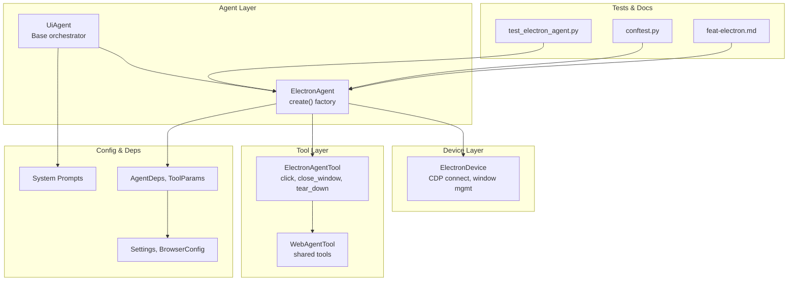
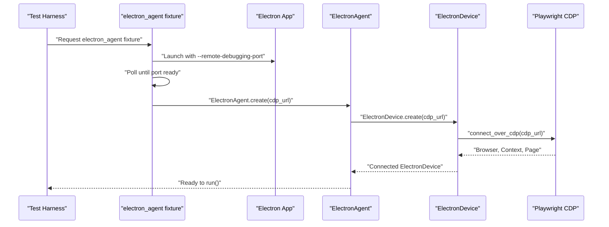
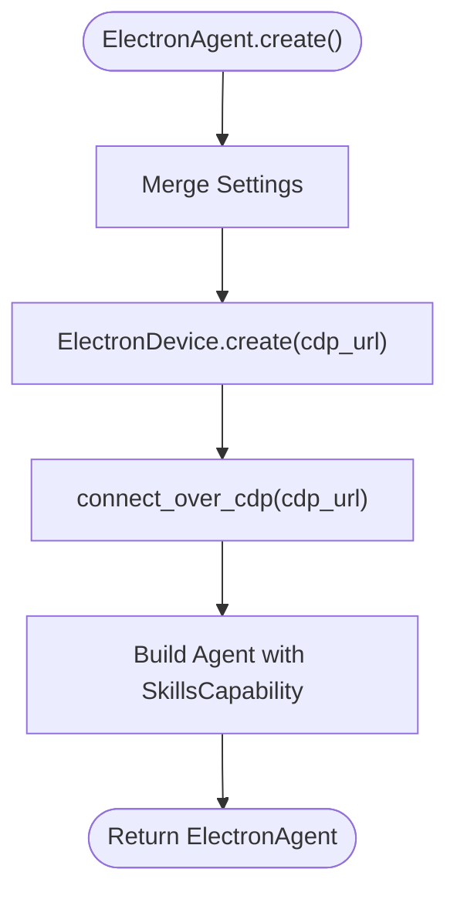
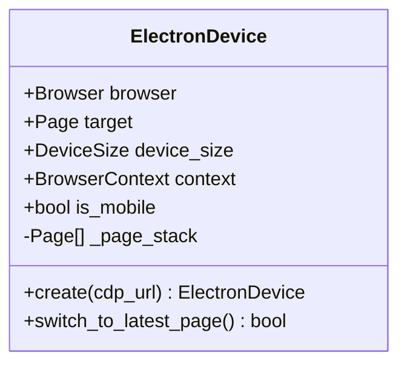
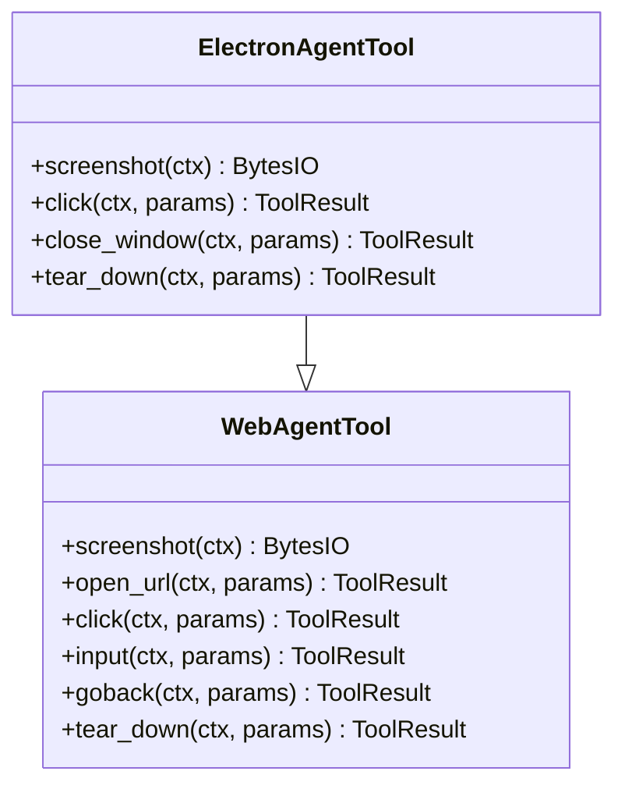
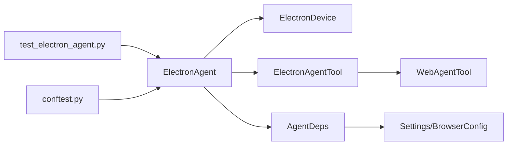

# Electron Agent

<cite>
**Referenced Files in This Document**
- [agent.py](file://src/page_eyes/agent.py)
- [electron.py](file://src/page_eyes/tools/electron.py)
- [web.py](file://src/page_eyes/tools/web.py)
- [device.py](file://src/page_eyes/device.py)
- [config.py](file://src/page_eyes/config.py)
- [deps.py](file://src/page_eyes/deps.py)
- [__init__.py](file://src/page_eyes/tools/__init__.py)
- [prompt.py](file://src/page_eyes/prompt.py)
- [feat-electron.md](file://docs/feat-electron.md)
- [test_electron_agent.py](file://tests/test_electron_agent.py)
- [conftest.py](file://tests/conftest.py)
- [README.md](file://README.md)
</cite>

## Table of Contents
1. [Introduction](#introduction)
2. [Project Structure](#project-structure)
3. [Core Components](#core-components)
4. [Architecture Overview](#architecture-overview)
5. [Detailed Component Analysis](#detailed-component-analysis)
6. [Dependency Analysis](#dependency-analysis)
7. [Performance Considerations](#performance-considerations)
8. [Troubleshooting Guide](#troubleshooting-guide)
9. [Conclusion](#conclusion)
10. [Appendices](#appendices)

## Introduction
This document provides comprehensive documentation for the ElectronAgent class, focusing on desktop application automation via Chrome DevTools Protocol (CDP) integration. It explains the ElectronAgent implementation, including the CDP URL configuration, remote debugging setup, and Electron-specific automation capabilities. It also documents the ElectronAgent.create() factory method parameters, desktop automation features such as window management, menu interactions, dialog handling, and native UI element automation. Setup procedures for enabling remote debugging in Electron applications, CDP connection configuration, and development environment requirements are included, along with practical examples and troubleshooting guidance.

## Project Structure
The Electron automation capability is implemented as part of the PageEyes Agent framework. The relevant modules are organized as follows:
- Agent layer: ElectronAgent and shared UiAgent orchestration
- Device layer: ElectronDevice for CDP connections and window management
- Tool layer: ElectronAgentTool inheriting from WebAgentTool for actions like click, input, swipe, and window close
- Configuration and dependencies: Settings, BrowserConfig, AgentDeps, and ToolParams
- Prompts: System prompts guiding planning and execution
- Tests and fixtures: Electron test harness and fixture to launch and connect to an Electron app

**Diagram sources**
- [agent.py:480-515](file://src/page_eyes/agent.py#L480-L515)
- [device.py:231-293](file://src/page_eyes/device.py#L231-L293)
- [electron.py:21-134](file://src/page_eyes/tools/electron.py#L21-L134)
- [web.py:24-179](file://src/page_eyes/tools/web.py#L24-L179)
- [config.py:40-73](file://src/page_eyes/config.py#L40-L73)
- [deps.py:75-101](file://src/page_eyes/deps.py#L75-L101)
- [prompt.py:30-103](file://src/page_eyes/prompt.py#L30-L103)
- [test_electron_agent.py:8-20](file://tests/test_electron_agent.py#L8-L20)
- [conftest.py:82-116](file://tests/conftest.py#L82-L116)
- [feat-electron.md:1-99](file://docs/feat-electron.md#L1-L99)

**Section sources**
- [agent.py:480-515](file://src/page_eyes/agent.py#L480-L515)
- [device.py:231-293](file://src/page_eyes/device.py#L231-L293)
- [electron.py:21-134](file://src/page_eyes/tools/electron.py#L21-L134)
- [web.py:24-179](file://src/page_eyes/tools/web.py#L24-L179)
- [config.py:40-73](file://src/page_eyes/config.py#L40-L73)
- [deps.py:75-101](file://src/page_eyes/deps.py#L75-L101)
- [prompt.py:30-103](file://src/page_eyes/prompt.py#L30-L103)
- [test_electron_agent.py:8-20](file://tests/test_electron_agent.py#L8-L20)
- [conftest.py:82-116](file://tests/conftest.py#L82-L116)
- [feat-electron.md:1-99](file://docs/feat-electron.md#L1-L99)

## Core Components
- ElectronAgent: The Electron-specific agent that builds on UiAgent. It exposes an asynchronous factory method to create an instance configured for CDP-based desktop automation.
- ElectronDevice: Provides CDP connection to an already-running Electron app, manages device size, and handles window switching and closure events.
- ElectronAgentTool: Inherits from WebAgentTool and adds Electron-specific cleanup behavior while reusing core actions like click, input, swipe, open_url, goback, wait, and assertions.
- AgentDeps and ToolParams: Shared dependency container and parameter models used across agents and tools.
- Settings and BrowserConfig: Centralized configuration for model selection, browser/headless simulation, and debug flags.

Key implementation references:
- ElectronAgent.create() factory method and parameters
- ElectronDevice.create() and window management
- ElectronAgentTool methods for screenshot, click, close_window, and tear_down
- Shared tool parameters and results

**Section sources**
- [agent.py:480-515](file://src/page_eyes/agent.py#L480-L515)
- [device.py:231-293](file://src/page_eyes/device.py#L231-L293)
- [electron.py:21-134](file://src/page_eyes/tools/electron.py#L21-L134)
- [web.py:24-179](file://src/page_eyes/tools/web.py#L24-L179)
- [deps.py:75-101](file://src/page_eyes/deps.py#L75-L101)
- [config.py:40-73](file://src/page_eyes/config.py#L40-L73)

## Architecture Overview
The ElectronAgent integrates with Playwright’s Chromium CDP interface to automate Electron desktop apps. The flow is:
- The Electron app is launched with remote debugging enabled (--remote-debugging-port).
- ElectronAgent.create() connects to the running app via CDP.
- ElectronDevice establishes a browser context and page, captures device size, and registers window-close handlers.
- ElectronAgentTool reuses WebAgentTool actions and adds Electron-specific teardown behavior.
- UiAgent orchestrates planning and execution, invoking tools and generating reports.

**Diagram sources**
- [conftest.py:82-116](file://tests/conftest.py#L82-L116)
- [agent.py:480-515](file://src/page_eyes/agent.py#L480-L515)
- [device.py:244-293](file://src/page_eyes/device.py#L244-L293)

**Section sources**
- [agent.py:480-515](file://src/page_eyes/agent.py#L480-L515)
- [device.py:231-293](file://src/page_eyes/device.py#L231-L293)
- [conftest.py:82-116](file://tests/conftest.py#L82-L116)

## Detailed Component Analysis

### ElectronAgent.create() Factory Method
- Purpose: Asynchronously create an ElectronAgent instance configured for CDP-based desktop automation.
- Parameters:
  - model: Optional LLM model identifier
  - cdp_url: CDP endpoint for the Electron app (default http://127.0.0.1:9222)
  - tool: Optional custom ElectronAgentTool instance
  - skills_dirs: Optional list of skill directories to load
  - debug: Optional debug flag to enable verbose logging
- Behavior:
  - Merges settings and creates ElectronDevice via CDP
  - Builds an Agent with SkillsCapability and ElectronAgentTool
  - Returns an ElectronAgent instance ready to run()

**Diagram sources**
- [agent.py:483-514](file://src/page_eyes/agent.py#L483-L514)
- [device.py:244-293](file://src/page_eyes/device.py#L244-L293)

**Section sources**
- [agent.py:483-514](file://src/page_eyes/agent.py#L483-L514)

### ElectronDevice: CDP Connection and Window Management
- Responsibilities:
  - Connect to an existing Electron process via CDP
  - Initialize browser context and page, compute device size
  - Maintain a page stack and automatically switch to the latest page
  - Register close event handlers to fallback to previous windows
- Key behaviors:
  - switch_to_latest_page(): updates target page and device size
  - Automatic fallback on page close events

**Diagram sources**
- [device.py:231-322](file://src/page_eyes/device.py#L231-L322)

**Section sources**
- [device.py:231-322](file://src/page_eyes/device.py#L231-L322)

### ElectronAgentTool: Desktop Automation Actions
- Inherits from WebAgentTool and reuses core actions:
  - Screenshot: Captures active window with CSS scaling to avoid DPI mismatch
  - Click: Supports file upload via file chooser and detects new windows
  - Close window: Closes current window and falls back to previous window
  - Tear down: Removes highlights and refreshes screen; does not close browser (external lifecycle)
- Differences from WebAgentTool:
  - tear_down avoids closing the browser context and client to preserve external Electron process

**Diagram sources**
- [web.py:24-179](file://src/page_eyes/tools/web.py#L24-L179)
- [electron.py:21-134](file://src/page_eyes/tools/electron.py#L21-L134)

**Section sources**
- [electron.py:21-134](file://src/page_eyes/tools/electron.py#L21-L134)
- [web.py:24-179](file://src/page_eyes/tools/web.py#L24-L179)

### Desktop Application Automation Capabilities
- Window management:
  - Switch to latest page automatically after clicks that open new windows
  - Close current window and fallback to previous window
- Menu interactions:
  - Click actions target elements identified by parsed screen info
- Dialog handling:
  - File upload via file chooser detection
  - Pop-up detection and switching to new pages
- Native UI element automation:
  - Click, input, swipe, open_url, goback, wait, and assertion helpers

Practical examples (see tests and docs):
- One-click generation workflow in an Electron app with pop-up input and window closing
- Launching an app with remote debugging and connecting via CDP

**Section sources**
- [electron.py:47-114](file://src/page_eyes/tools/electron.py#L47-L114)
- [test_electron_agent.py:8-20](file://tests/test_electron_agent.py#L8-L20)
- [feat-electron.md:68-86](file://docs/feat-electron.md#L68-L86)

### Setup Procedures and Environment Requirements
- Enable remote debugging in Electron:
  - Launch the app with --remote-debugging-port
  - Verify connectivity at http://127.0.0.1:9222/json
- Configure CDP connection:
  - Use ElectronAgent.create(cdp_url="http://127.0.0.1:9222")
- Development environment:
  - Playwright and Chromium required
  - Optional: OmniParser service for VLM mode
  - Environment variables for model and storage clients

**Section sources**
- [feat-electron.md:68-86](file://docs/feat-electron.md#L68-L86)
- [agent.py:483-514](file://src/page_eyes/agent.py#L483-L514)
- [config.py:40-73](file://src/page_eyes/config.py#L40-L73)
- [README.md:41-132](file://README.md#L41-L132)

### Practical Examples
- Form filling and submission in an Electron app
- Menu navigation and dialog interaction
- Window lifecycle management (open, switch, close)
- End-to-end test example validating generated content

Refer to the test suite for a concrete end-to-end scenario.

**Section sources**
- [test_electron_agent.py:8-20](file://tests/test_electron_agent.py#L8-L20)
- [conftest.py:82-116](file://tests/conftest.py#L82-L116)

## Dependency Analysis
- ElectronAgent depends on:
  - ElectronDevice for CDP connection and window management
  - ElectronAgentTool for desktop automation actions
  - AgentDeps for dependency injection and context
  - Settings and BrowserConfig for runtime configuration
- ElectronAgentTool depends on:
  - WebAgentTool for shared actions
  - JSTool for highlight utilities
- Tests depend on:
  - conftest fixture to launch and connect to an Electron app
  - ElectronAgent.run() to execute natural language instructions

**Diagram sources**
- [agent.py:480-515](file://src/page_eyes/agent.py#L480-L515)
- [device.py:231-293](file://src/page_eyes/device.py#L231-L293)
- [electron.py:21-134](file://src/page_eyes/tools/electron.py#L21-L134)
- [web.py:24-179](file://src/page_eyes/tools/web.py#L24-L179)
- [deps.py:75-101](file://src/page_eyes/deps.py#L75-L101)
- [config.py:40-73](file://src/page_eyes/config.py#L40-L73)
- [test_electron_agent.py:8-20](file://tests/test_electron_agent.py#L8-L20)
- [conftest.py:82-116](file://tests/conftest.py#L82-L116)

**Section sources**
- [agent.py:480-515](file://src/page_eyes/agent.py#L480-L515)
- [device.py:231-293](file://src/page_eyes/device.py#L231-L293)
- [electron.py:21-134](file://src/page_eyes/tools/electron.py#L21-L134)
- [web.py:24-179](file://src/page_eyes/tools/web.py#L24-L179)
- [deps.py:75-101](file://src/page_eyes/deps.py#L75-L101)
- [config.py:40-73](file://src/page_eyes/config.py#L40-L73)
- [test_electron_agent.py:8-20](file://tests/test_electron_agent.py#L8-L20)
- [conftest.py:82-116](file://tests/conftest.py#L82-L116)

## Performance Considerations
- Use CSS scaling for screenshots to avoid DPI-related click misalignment.
- Minimize repeated page switches; batch operations when possible.
- Prefer scroll-based swipes on pages with scrollbars; fall back to mouse drags when necessary.
- Keep debug logging enabled only during development to reduce overhead.

## Troubleshooting Guide
Common issues and resolutions:
- CDP connection fails:
  - Ensure the Electron app is launched with --remote-debugging-port
  - Verify http://127.0.0.1:9222/json is reachable
- Remote debugging not activating:
  - Confirm the app supports --remote-debugging-port
  - Check firewall or port conflicts
- Application startup requirements:
  - The app must be running before ElectronAgent.create()
  - Use the fixture pattern to manage app lifecycle in tests
- Automation reliability:
  - Add waits and keyword assertions to stabilize interactions
  - Handle pop-ups and new windows by relying on automatic page switching
  - Use tear_down to clean up highlights and keep the session stable

**Section sources**
- [feat-electron.md:68-86](file://docs/feat-electron.md#L68-L86)
- [conftest.py:82-116](file://tests/conftest.py#L82-L116)
- [electron.py:47-114](file://src/page_eyes/tools/electron.py#L47-L114)

## Conclusion
ElectronAgent leverages CDP to automate Electron desktop applications reliably. By connecting to a running app via ElectronDevice and reusing WebAgentTool actions through ElectronAgentTool, it enables robust desktop automation including window management, menu interactions, dialog handling, and native UI element control. Proper setup of remote debugging, careful configuration of CDP endpoints, and adherence to best practices ensure reliable automation across diverse Electron apps.

## Appendices

### ElectronAgent.create() Parameters Reference
- model: Optional LLM model identifier
- cdp_url: CDP endpoint for the Electron app (default http://127.0.0.1:9222)
- tool: Optional custom ElectronAgentTool instance
- skills_dirs: Optional list of skill directories to load
- debug: Optional debug flag

**Section sources**
- [agent.py:483-514](file://src/page_eyes/agent.py#L483-L514)

### Supported Platforms and Integrations
- Electron support is documented alongside other platforms in the project README.

**Section sources**
- [README.md:11-15](file://README.md#L11-L15)