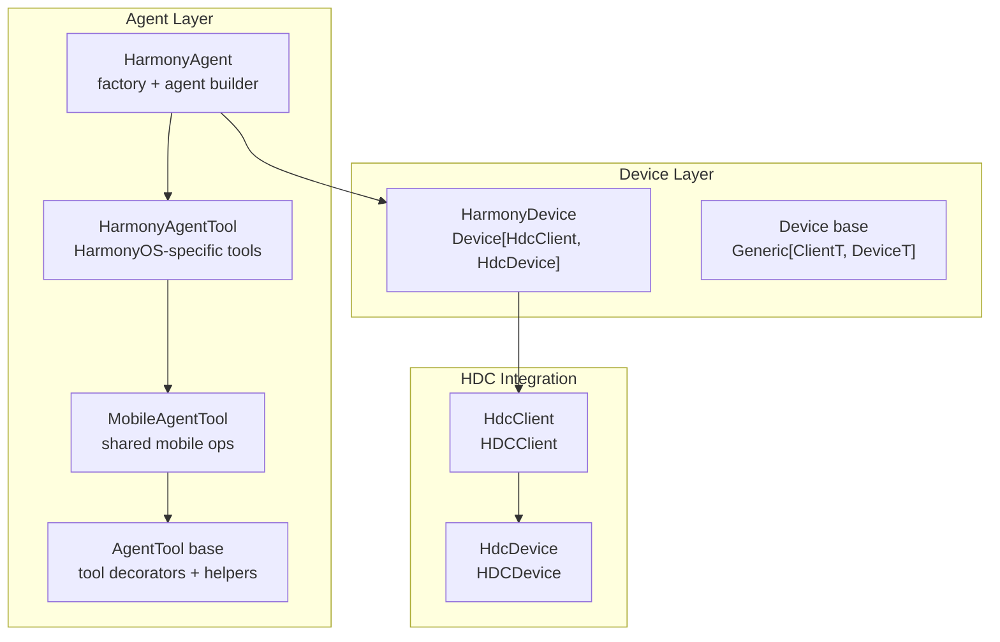
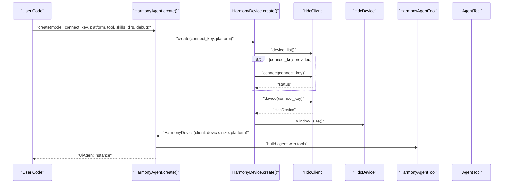
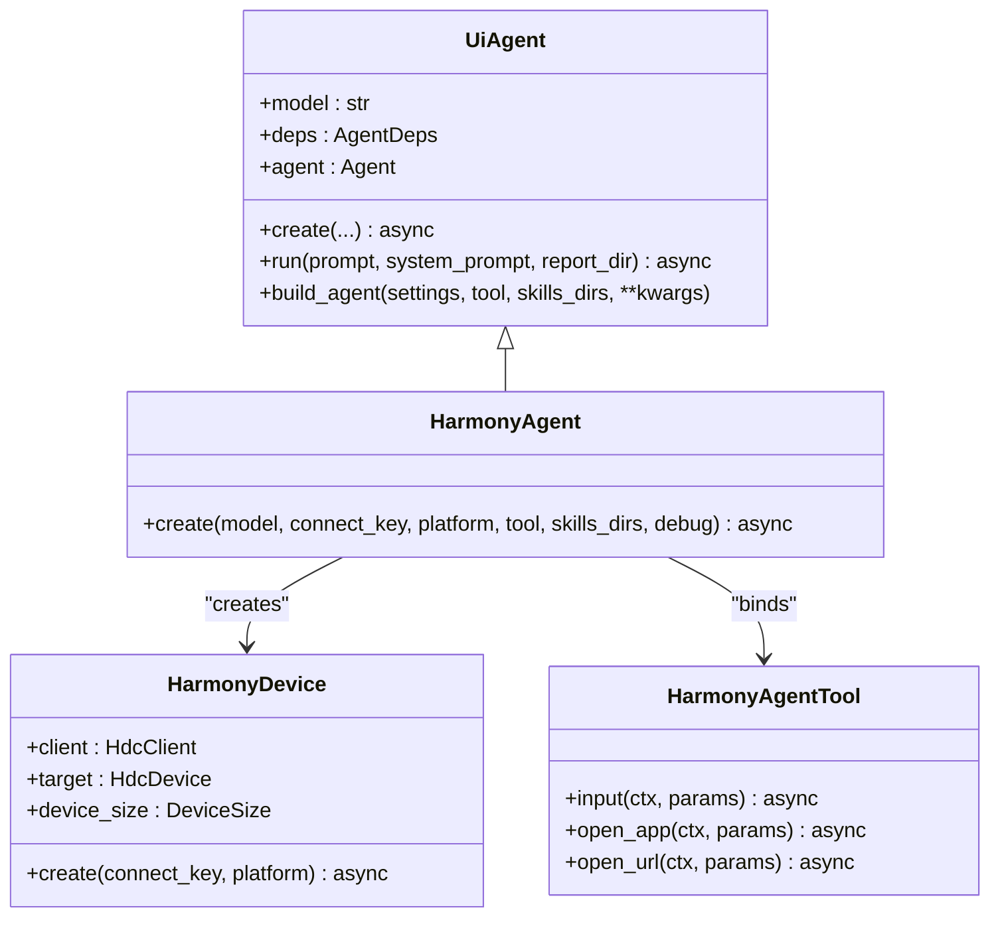
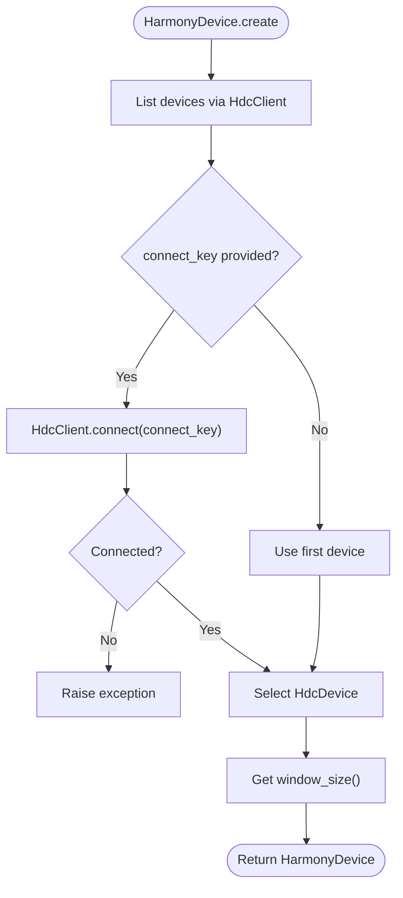
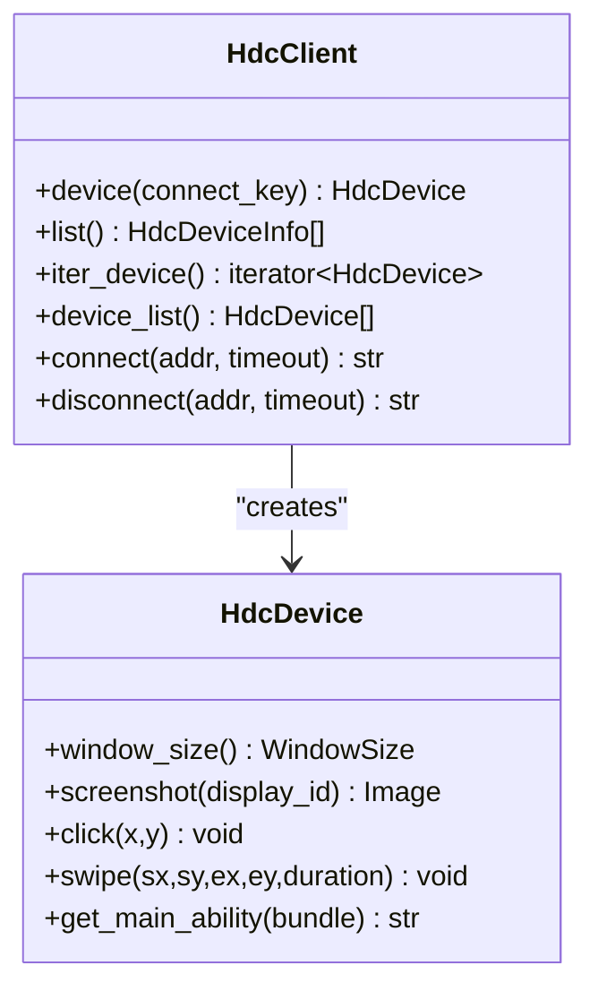
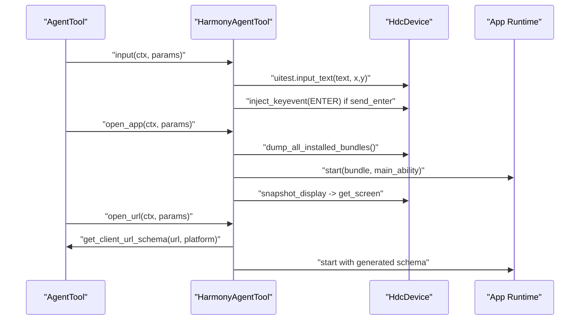
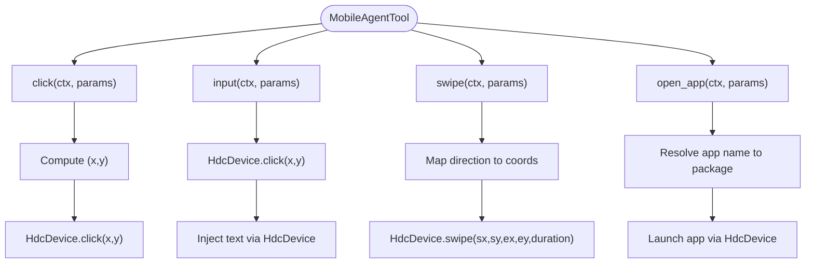
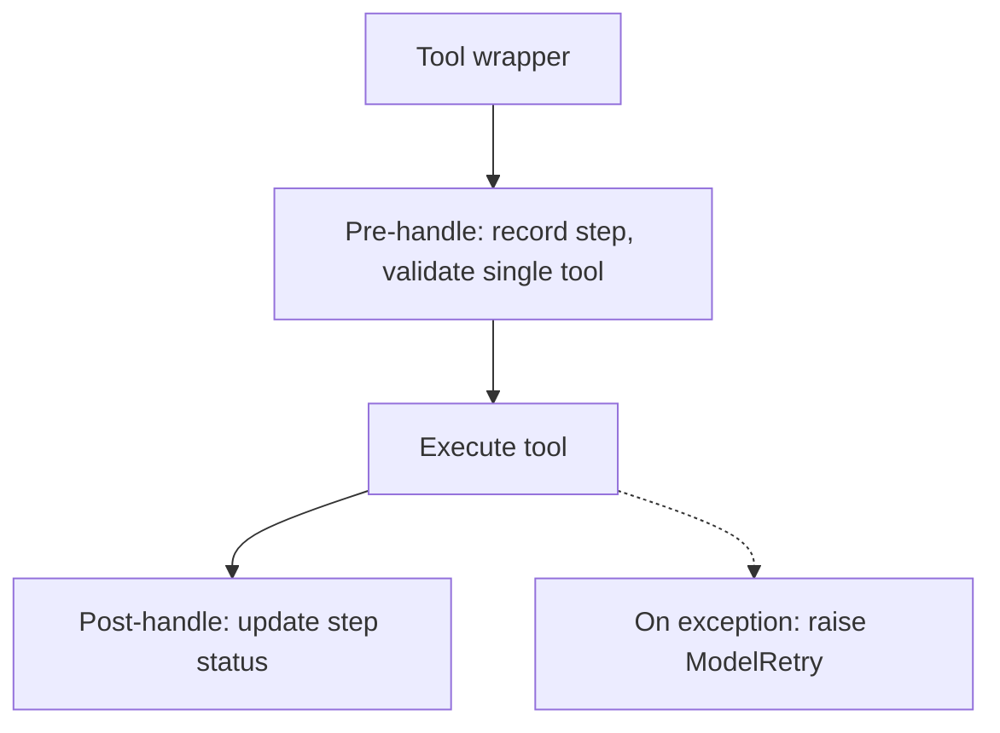
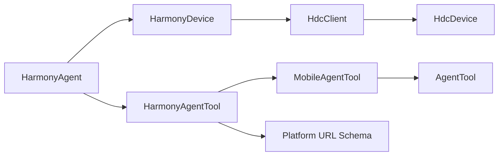

# HarmonyOS Agent

<cite>
**Referenced Files in This Document**
- [README.md](file://README.md)
- [agent.py](file://src/page_eyes/agent.py)
- [device.py](file://src/page_eyes/device.py)
- [harmony.py](file://src/page_eyes/tools/harmony.py)
- [_mobile.py](file://src/page_eyes/tools/_mobile.py)
- [_base.py](file://src/page_eyes/tools/_base.py)
- [hdc_tool.py](file://src/page_eyes/util/hdc_tool.py)
- [platform.py](file://src/page_eyes/util/platform.py)
- [deps.py](file://src/page_eyes/deps.py)
- [test_harmony_agent.py](file://tests/test_harmony_agent.py)
- [conftest.py](file://tests/conftest.py)
- [troubleshooting.md](file://docs/faq/troubleshooting.md)
</cite>

## Table of Contents
1. [Introduction](#introduction)
2. [Project Structure](#project-structure)
3. [Core Components](#core-components)
4. [Architecture Overview](#architecture-overview)
5. [Detailed Component Analysis](#detailed-component-analysis)
6. [Dependency Analysis](#dependency-analysis)
7. [Performance Considerations](#performance-considerations)
8. [Troubleshooting Guide](#troubleshooting-guide)
9. [Conclusion](#conclusion)
10. [Appendices](#appendices)

## Introduction
This document provides comprehensive documentation for the HarmonyAgent class, focusing on HarmonyOS device automation through HDC integration. It explains the HarmonyAgent implementation, device connection via connect_key, platform type configuration, and HDCUtils integration. It details the HarmonyAgent.create() factory method with parameters including model selection, connect_key configuration, platform type options, custom tool instances, skills directories, and debug flags. It also covers HarmonyOS-specific automation capabilities such as touch gestures, system interactions, app launching, and device-specific features. Practical examples demonstrate HarmonyOS app automation, system dialog handling, permission management, and cross-device compatibility. Finally, it addresses HarmonyOS version differences, device variant considerations, development environment requirements, and troubleshooting guidance for HDC connection issues, device discovery problems, authentication failures, and automation compatibility challenges.

## Project Structure
The HarmonyOS automation capability is implemented within a unified multi-platform agent framework. The HarmonyOS-specific implementation centers around:
- HarmonyAgent: The factory-based UI agent for HarmonyOS devices.
- HarmonyDevice: The device abstraction backed by HDC (Harmony Distributed Control) client.
- HarmonyAgentTool: The toolset that exposes UI actions (click, input, swipe, open_app, open_url) tailored for HarmonyOS via HDC.
- HDC utilities: HdcClient and HdcDevice wrappers around hdcutils to manage device connections, screenshots, clicks, swipes, and app launching.

**Diagram sources**
- [agent.py:403-438](file://src/page_eyes/agent.py#L403-L438)
- [device.py:129-155](file://src/page_eyes/device.py#L129-L155)
- [harmony.py:20-68](file://src/page_eyes/tools/harmony.py#L20-L68)
- [_mobile.py:27-165](file://src/page_eyes/tools/_mobile.py#L27-L165)
- [_base.py:130-391](file://src/page_eyes/tools/_base.py#L130-L391)
- [hdc_tool.py:77-108](file://src/page_eyes/util/hdc_tool.py#L77-L108)

**Section sources**
- [README.md:147-148](file://README.md#L147-L148)
- [agent.py:403-438](file://src/page_eyes/agent.py#L403-L438)
- [device.py:129-155](file://src/page_eyes/device.py#L129-L155)
- [harmony.py:20-68](file://src/page_eyes/tools/harmony.py#L20-L68)
- [_mobile.py:27-165](file://src/page_eyes/tools/_mobile.py#L27-L165)
- [_base.py:130-391](file://src/page_eyes/tools/_base.py#L130-L391)
- [hdc_tool.py:77-108](file://src/page_eyes/util/hdc_tool.py#L77-L108)

## Core Components
- HarmonyAgent.create(): Factory method to instantiate a HarmonyOS automation agent with configurable model, connect_key, platform type, custom tool, skills directories, and debug flags.
- HarmonyDevice.create(): Factory method to establish an HDC-backed device connection using connect_key or default device discovery.
- HarmonyAgentTool: HarmonyOS-specific tool implementations for input, open_app, and URL opening via Harmony’s app runtime.
- MobileAgentTool: Shared mobile UI operations (click, input, swipe, open_app) adapted for Harmony via HdcDevice.
- AgentTool base: Tool decorators, screenshot handling, screen parsing, assertions, waits, and teardown routines.
- HDC utilities: HdcClient and HdcDevice wrappers for window size detection, screenshot capture, click/swipe gestures, and app launching.

Key parameters for HarmonyAgent.create():
- model: LLM/VLM model identifier.
- connect_key: HDC connect key for the target HarmonyOS device.
- platform: Platform type (e.g., QY, KG, KW, BD, MP) influencing URL schema generation for open_url.
- tool: Optional custom HarmonyAgentTool instance.
- skills_dirs: Additional skill directories for extending capabilities.
- debug: Enable verbose logging and step tracking.

**Section sources**
- [agent.py:403-438](file://src/page_eyes/agent.py#L403-L438)
- [device.py:133-155](file://src/page_eyes/device.py#L133-L155)
- [harmony.py:20-68](file://src/page_eyes/tools/harmony.py#L20-L68)
- [_mobile.py:27-165](file://src/page_eyes/tools/_mobile.py#L27-L165)
- [_base.py:88-127](file://src/page_eyes/tools/_base.py#L88-L127)
- [hdc_tool.py:31-108](file://src/page_eyes/util/hdc_tool.py#L31-L108)
- [platform.py:48-66](file://src/page_eyes/util/platform.py#L48-L66)

## Architecture Overview
The HarmonyOS automation pipeline integrates the agent orchestration with device abstraction and HDC utilities:

**Diagram sources**
- [agent.py:403-438](file://src/page_eyes/agent.py#L403-L438)
- [device.py:133-155](file://src/page_eyes/device.py#L133-L155)
- [hdc_tool.py:77-108](file://src/page_eyes/util/hdc_tool.py#L77-L108)

## Detailed Component Analysis

### HarmonyAgent Implementation
HarmonyAgent extends UiAgent and provides a factory method to create a HarmonyOS automation agent. It merges settings, constructs a HarmonyDevice using HDC, binds a HarmonyAgentTool, and builds an agent with skills capability.

Key behaviors:
- Settings merging with defaults and overrides.
- Device creation via HarmonyDevice.create(connect_key, platform).
- Tool binding and skills capability construction.
- Agent instantiation with system prompt, model, and toolset.

**Diagram sources**
- [agent.py:97-169](file://src/page_eyes/agent.py#L97-L169)
- [agent.py:403-438](file://src/page_eyes/agent.py#L403-L438)
- [device.py:129-155](file://src/page_eyes/device.py#L129-L155)
- [harmony.py:20-68](file://src/page_eyes/tools/harmony.py#L20-L68)

**Section sources**
- [agent.py:403-438](file://src/page_eyes/agent.py#L403-L438)
- [agent.py:147-169](file://src/page_eyes/agent.py#L147-L169)

### Device Connection via HDC (HarmonyDevice)
HarmonyDevice encapsulates an HDC-backed device connection:
- Uses HdcClient to list and connect devices.
- Supports explicit connect_key or falls back to the first connected device.
- Retrieves device window size for coordinate scaling.
- Exposes the underlying HdcDevice for UI operations.

**Diagram sources**
- [device.py:133-155](file://src/page_eyes/device.py#L133-L155)
- [hdc_tool.py:77-108](file://src/page_eyes/util/hdc_tool.py#L77-L108)

**Section sources**
- [device.py:133-155](file://src/page_eyes/device.py#L133-L155)
- [hdc_tool.py:77-108](file://src/page_eyes/util/hdc_tool.py#L77-L108)

### HDC Utilities Integration (HdcClient/HdcDevice)
HdcClient and HdcDevice wrap hdcutils to provide:
- Device listing and filtering by state.
- Screenshot capture and download.
- Click and swipe gestures with velocity/step tuning.
- App main ability resolution for launching.

**Diagram sources**
- [hdc_tool.py:77-108](file://src/page_eyes/util/hdc_tool.py#L77-L108)
- [hdc_tool.py:31-76](file://src/page_eyes/util/hdc_tool.py#L31-L76)

**Section sources**
- [hdc_tool.py:31-108](file://src/page_eyes/util/hdc_tool.py#L31-L108)

### HarmonyOS-Specific Tools (HarmonyAgentTool)
HarmonyAgentTool extends MobileAgentTool and adds HarmonyOS-specific behaviors:
- input: Performs text input and optional Enter key injection via Harmony’s UI test interface.
- open_app: Resolves app bundle and main ability, launches the app, and refreshes screen.
- open_url: Generates platform-specific URL schema and starts via Harmony’s app runtime.

**Diagram sources**
- [harmony.py:20-68](file://src/page_eyes/tools/harmony.py#L20-L68)
- [_mobile.py:27-165](file://src/page_eyes/tools/_mobile.py#L27-L165)
- [platform.py:48-66](file://src/page_eyes/util/platform.py#L48-L66)

**Section sources**
- [harmony.py:20-68](file://src/page_eyes/tools/harmony.py#L20-L68)
- [_mobile.py:27-165](file://src/page_eyes/tools/_mobile.py#L27-L165)
- [platform.py:48-66](file://src/page_eyes/util/platform.py#L48-L66)

### Shared Mobile Operations (MobileAgentTool)
MobileAgentTool provides shared UI operations:
- click: Computes coordinates and performs click via HdcDevice.
- input: Clicks target position and injects text via AdbDeviceProxy (Harmony uses HdcDevice for input).
- swipe: Implements directional swipes with optional keyword expectation.
- open_app: Uses a sub-agent to resolve app name to package and starts the app.

**Diagram sources**
- [_mobile.py:27-165](file://src/page_eyes/tools/_mobile.py#L27-L165)

**Section sources**
- [_mobile.py:27-165](file://src/page_eyes/tools/_mobile.py#L27-L165)

### Tool Decorators and Base Capabilities (AgentTool)
AgentTool defines:
- Tool decorators for pre/post handling, delays, and retry on failure.
- Screenshot capture and OmniParser-based element parsing.
- Assertions, waits, and step tracking.
- Tear down routine to finalize automation.

**Diagram sources**
- [_base.py:88-127](file://src/page_eyes/tools/_base.py#L88-L127)
- [_base.py:167-203](file://src/page_eyes/tools/_base.py#L167-L203)

**Section sources**
- [_base.py:88-127](file://src/page_eyes/tools/_base.py#L88-L127)
- [_base.py:167-203](file://src/page_eyes/tools/_base.py#L167-L203)

### Practical Examples
Example scenarios validated by tests:
- Opening multiple apps in sequence (WeChat, Settings, Browser).
- Opening a URL, handling close buttons, clicking search, inputting text, waiting for keywords, and swiping until a target appears.
- Navigating music app sections and triggering playback.

These examples demonstrate:
- App launching via open_app.
- URL opening via open_url with platform-specific schema generation.
- Element-based interactions (click, input).
- Keyword-based waits and swipes.
- Screen parsing and reporting.

**Section sources**
- [test_harmony_agent.py:11-49](file://tests/test_harmony_agent.py#L11-L49)

## Dependency Analysis
The HarmonyOS automation stack exhibits clear separation of concerns:
- UiAgent orchestrates planning, tool invocation, and reporting.
- Device layer abstracts platform specifics behind a unified Device interface.
- Tool layer encapsulates UI operations with robust error handling and retries.
- HDC utilities provide low-level device control.

**Diagram sources**
- [agent.py:403-438](file://src/page_eyes/agent.py#L403-L438)
- [device.py:129-155](file://src/page_eyes/device.py#L129-L155)
- [harmony.py:20-68](file://src/page_eyes/tools/harmony.py#L20-L68)
- [_mobile.py:27-165](file://src/page_eyes/tools/_mobile.py#L27-L165)
- [_base.py:130-391](file://src/page_eyes/tools/_base.py#L130-L391)
- [hdc_tool.py:77-108](file://src/page_eyes/util/hdc_tool.py#L77-L108)
- [platform.py:48-66](file://src/page_eyes/util/platform.py#L48-L66)

**Section sources**
- [agent.py:403-438](file://src/page_eyes/agent.py#L403-L438)
- [device.py:129-155](file://src/page_eyes/device.py#L129-L155)
- [harmony.py:20-68](file://src/page_eyes/tools/harmony.py#L20-L68)
- [_mobile.py:27-165](file://src/page_eyes/tools/_mobile.py#L27-L165)
- [_base.py:130-391](file://src/page_eyes/tools/_base.py#L130-L391)
- [hdc_tool.py:77-108](file://src/page_eyes/util/hdc_tool.py#L77-L108)
- [platform.py:48-66](file://src/page_eyes/util/platform.py#L48-L66)

## Performance Considerations
- Gesture velocity and step length: Swipe velocity is tuned via a duration multiplier to balance speed and reliability.
- Delay strategies: Pre/post delays and wait intervals prevent race conditions during rendering and element appearance.
- Resolution detection: Accurate window size detection ensures precise coordinate mapping across devices.
- Parsing overhead: Screen parsing is optional and can be disabled to reduce latency when only raw screenshots are needed.

[No sources needed since this section provides general guidance]

## Troubleshooting Guide
Common HDC/HarmonyOS issues and resolutions:
- HDC connect failures: Verify connect_key correctness and device connectivity; ensure the device is in “Connected” state.
- Device discovery problems: Confirm HdcClient.list() returns devices and filters by state.
- Authentication failures: Re-run connect with correct credentials and ensure HDC daemon is running.
- Automation compatibility challenges: Validate app bundle names and main abilities; use get_main_ability to resolve EntryAbility fallbacks.

Environment and configuration tips:
- Enable debug logs to inspect tool invocations and step outcomes.
- Validate platform URL schema generation for open_url.
- Use skills directories to extend capabilities and tailor automation scripts.

**Section sources**
- [device.py:133-155](file://src/page_eyes/device.py#L133-L155)
- [hdc_tool.py:77-108](file://src/page_eyes/util/hdc_tool.py#L77-L108)
- [platform.py:48-66](file://src/page_eyes/util/platform.py#L48-L66)
- [troubleshooting.md:1-211](file://docs/faq/troubleshooting.md#L1-L211)

## Conclusion
HarmonyAgent delivers a robust, factory-based automation solution for HarmonyOS devices leveraging HDC integration. Its modular design separates orchestration, device abstraction, and tooling, enabling reliable UI interactions, app launching, and system dialog handling. With configurable platform types, skills extensibility, and comprehensive error handling, it supports diverse HarmonyOS environments and use cases. Proper HDC configuration, device registration, and environment setup are essential for successful automation.

[No sources needed since this section summarizes without analyzing specific files]

## Appendices

### Device Setup Procedures for HarmonyOS Development Environment
- Install and configure HDC utilities and ensure the device is discoverable.
- Register/connect the HarmonyOS device using the correct connect_key.
- Configure platform type for URL schema generation if using open_url.
- Provide skills directories to extend automation capabilities.

**Section sources**
- [device.py:133-155](file://src/page_eyes/device.py#L133-L155)
- [platform.py:48-66](file://src/page_eyes/util/platform.py#L48-L66)

### Example Workflows
- App automation: Use open_app to launch applications by name or bundle.
- System dialog handling: Use assert_screen_contains/not_contains to detect and react to dialogs.
- Permission management: Use waits and swipes to navigate permission prompts.
- Cross-device compatibility: Adjust platform type and coordinate scaling via device_size.

**Section sources**
- [test_harmony_agent.py:11-49](file://tests/test_harmony_agent.py#L11-L49)
- [_base.py:236-299](file://src/page_eyes/tools/_base.py#L236-L299)
- [_mobile.py:86-118](file://src/page_eyes/tools/_mobile.py#L86-L118)