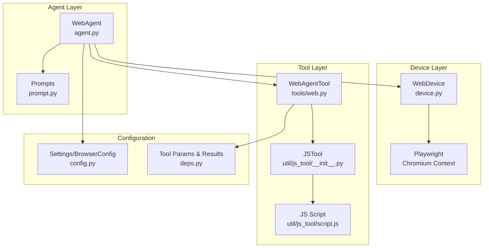
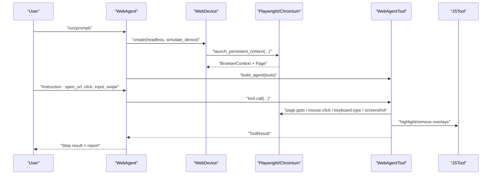
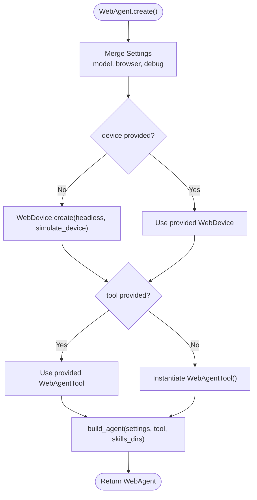
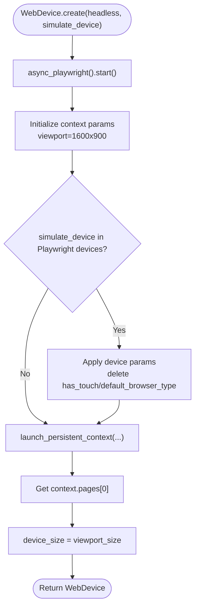
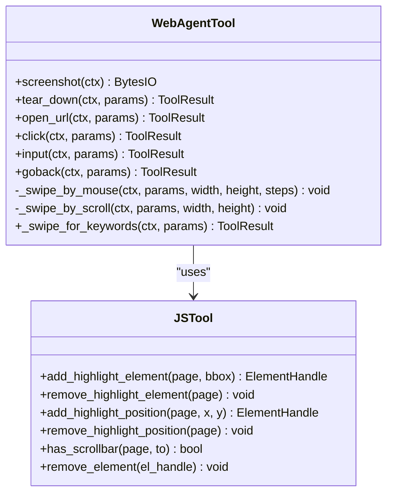
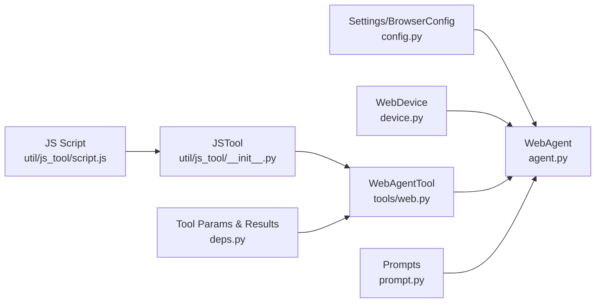

# Web Agent

<cite>
**Referenced Files in This Document**
- [agent.py](file://src/page_eyes/agent.py)
- [device.py](file://src/page_eyes/device.py)
- [config.py](file://src/page_eyes/config.py)
- [deps.py](file://src/page_eyes/deps.py)
- [web.py](file://src/page_eyes/tools/web.py)
- [js_tool/__init__.py](file://src/page_eyes/util/js_tool/__init__.py)
- [script.js](file://src/page_eyes/util/js_tool/script.js)
- [prompt.py](file://src/page_eyes/prompt.py)
- [test_web_agent.py](file://tests/test_web_agent.py)
- [conftest.py](file://tests/conftest.py)
</cite>

## Table of Contents
1. [Introduction](#introduction)
2. [Project Structure](#project-structure)
3. [Core Components](#core-components)
4. [Architecture Overview](#architecture-overview)
5. [Detailed Component Analysis](#detailed-component-analysis)
6. [Dependency Analysis](#dependency-analysis)
7. [Performance Considerations](#performance-considerations)
8. [Troubleshooting Guide](#troubleshooting-guide)
9. [Conclusion](#conclusion)
10. [Appendices](#appendices)

## Introduction
This document provides comprehensive documentation for the WebAgent class, focusing on web browser automation capabilities powered by Playwright. It explains the WebAgent implementation, including browser configuration options, headless mode setup, device simulation features, and Playwright integration. It details the WebAgent.create() factory method with all parameter options, including model selection, device customization, simulate_device configuration, headless mode, custom tool instances, skills directories, and debug flags. It also covers browser automation workflows, element interaction patterns, screenshot capture, cross-browser compatibility, and practical examples for navigation, form filling, button clicking, and dynamic content handling. Configuration requirements for different browsers, proxy settings, viewport simulation, and user agent customization are addressed, along with troubleshooting guidance for browser startup issues, driver compatibility problems, and performance optimization tips.

## Project Structure
The WebAgent resides in the page_eyes package and integrates with device abstraction, configuration management, tool definitions, and prompts. The primary files involved are:
- agent.py: Defines the WebAgent class and its factory method, orchestrating agent creation and execution.
- device.py: Provides the WebDevice abstraction for Playwright-backed browser contexts and pages.
- config.py: Defines Settings and BrowserConfig for runtime configuration and environment-driven settings.
- deps.py: Defines tool parameter types, tool result types, and AgentDeps for dependency injection.
- web.py: Implements WebAgentTool with browser automation actions (open_url, click, input, swipe, goback, screenshot).
- js_tool: Utility for injecting and removing highlight overlays and detecting scrollbars via JavaScript.
- prompt.py: System prompts guiding the agent’s planning and execution behavior.
- tests: Example tests demonstrating navigation, form filling, sliding, and dynamic content handling.

**Diagram sources**
- [agent.py:316-363](file://src/page_eyes/agent.py#L316-L363)
- [device.py:54-87](file://src/page_eyes/device.py#L54-L87)
- [web.py:24-179](file://src/page_eyes/tools/web.py#L24-L179)
- [js_tool/__init__.py:22-52](file://src/page_eyes/util/js_tool/__init__.py#L22-L52)
- [script.js:1-54](file://src/page_eyes/util/js_tool/script.js#L1-L54)
- [config.py:40-73](file://src/page_eyes/config.py#L40-L73)
- [deps.py:75-280](file://src/page_eyes/deps.py#L75-L280)
- [prompt.py:8-166](file://src/page_eyes/prompt.py#L8-L166)

**Section sources**
- [agent.py:316-363](file://src/page_eyes/agent.py#L316-L363)
- [device.py:54-87](file://src/page_eyes/device.py#L54-L87)
- [config.py:40-73](file://src/page_eyes/config.py#L40-L73)
- [deps.py:75-280](file://src/page_eyes/deps.py#L75-L280)
- [web.py:24-179](file://src/page_eyes/tools/web.py#L24-L179)
- [js_tool/__init__.py:22-52](file://src/page_eyes/util/js_tool/__init__.py#L22-L52)
- [script.js:1-54](file://src/page_eyes/util/js_tool/script.js#L1-L54)
- [prompt.py:8-166](file://src/page_eyes/prompt.py#L8-L166)

## Core Components
- WebAgent: Asynchronous factory method to create a WebAgent instance with configurable model, device, simulate_device, headless mode, tool, skills directories, and debug flags. It builds an Agent with SkillsCapability and injects AgentDeps containing Settings, WebDevice, and WebAgentTool.
- WebDevice: Abstraction over Playwright’s Chromium persistent context, supporting viewport configuration, device simulation, and headless mode. It exposes the current page and device size.
- WebAgentTool: Implements browser automation actions: open_url, click, input, swipe, goback, tear_down, and screenshot. It integrates with JSTool for highlighting and scrollbar detection.
- JSTool: Injects temporary highlight overlays and detects scrollbars via injected JavaScript to assist interaction and scrolling strategies.
- Settings/BrowserConfig: Environment-driven configuration for model, model settings, browser headless mode, device simulation, and debug flags.

Key responsibilities:
- WebAgent.create(): Merges settings, creates WebDevice, instantiates WebAgentTool, constructs Agent with skills, and returns a ready-to-run WebAgent.
- WebDevice.create(): Starts Playwright, launches Chromium persistent context, applies viewport and device simulation, and initializes device size.
- WebAgentTool: Executes actions against the current page, handles file upload dialogs, new-page expectations, and cleanup.

**Section sources**
- [agent.py:316-363](file://src/page_eyes/agent.py#L316-L363)
- [device.py:54-87](file://src/page_eyes/device.py#L54-L87)
- [web.py:24-179](file://src/page_eyes/tools/web.py#L24-L179)
- [js_tool/__init__.py:22-52](file://src/page_eyes/util/js_tool/__init__.py#L22-L52)
- [config.py:40-73](file://src/page_eyes/config.py#L40-L73)

## Architecture Overview
The WebAgent architecture follows a layered design:
- Agent Layer: WebAgent orchestrates planning and execution, manages steps, and renders reports.
- Device Layer: WebDevice encapsulates Playwright’s Chromium context and page, enabling headless mode and device simulation.
- Tool Layer: WebAgentTool defines atomic browser actions and integrates with JSTool for UI feedback and scroll detection.
- Configuration Layer: Settings and BrowserConfig provide environment-driven defaults and overrides.

**Diagram sources**
- [agent.py:316-363](file://src/page_eyes/agent.py#L316-L363)
- [device.py:54-87](file://src/page_eyes/device.py#L54-L87)
- [web.py:24-179](file://src/page_eyes/tools/web.py#L24-L179)
- [js_tool/__init__.py:22-52](file://src/page_eyes/util/js_tool/__init__.py#L22-L52)

## Detailed Component Analysis

### WebAgent.create() Factory Method
The WebAgent.create() method is the primary entry point for constructing a WebAgent instance. It accepts the following parameters:
- model: Optional LLM model identifier.
- device: Optional pre-created WebDevice instance.
- simulate_device: Optional device name to simulate (e.g., iPhone variants). When provided, Playwright devices are used to configure viewport and user agent characteristics.
- headless: Optional boolean to enable headless mode.
- tool: Optional custom WebAgentTool instance.
- skills_dirs: Optional list of skill directories to include in the Agent’s SkillsCapability.
- debug: Optional boolean to enable verbose logging.

Behavior:
- Merges Settings with overrides for model, browser headless/simulate_device, and debug flags.
- Creates WebDevice with headless and simulate_device parameters.
- Instantiates WebAgentTool if not provided.
- Builds an Agent with SkillsCapability and injects AgentDeps.

**Diagram sources**
- [agent.py:316-363](file://src/page_eyes/agent.py#L316-L363)

**Section sources**
- [agent.py:316-363](file://src/page_eyes/agent.py#L316-L363)

### WebDevice: Browser Configuration and Headless Mode
WebDevice.create() initializes a Playwright Chromium persistent context with:
- Channel: Chrome.
- Headless: Controlled by the headless flag.
- Viewport: Defaults to 1600x900; overridden when simulate_device is provided using Playwright’s built-in device descriptors.
- User data directory: Persistent user data stored under a temp directory.
- Ignore default args: Removes “--enable-automation” to align with typical automation expectations.

Device simulation:
- If simulate_device matches a known Playwright device, the context parameters are updated accordingly.
- Certain keys (e.g., has_touch, default_browser_type) are adjusted to ensure consistent behavior for swipe and persistent context usage.

**Diagram sources**
- [device.py:54-87](file://src/page_eyes/device.py#L54-L87)

**Section sources**
- [device.py:54-87](file://src/page_eyes/device.py#L54-L87)

### WebAgentTool: Browser Automation Actions
WebAgentTool implements the following actions:
- open_url: Navigates to a URL and waits until network idle.
- click: Computes coordinates from element or relative position, highlights the click target, handles file chooser dialogs, and manages new-page expectations.
- input: Activates an element and types text, optionally sending Enter.
- swipe: Performs swipe or scroll depending on device capability and scrollbar presence; supports repeated swipes until expected keywords appear.
- goback: Navigates back to the previous page.
- tear_down: Cleans up highlight overlays, captures a final screen, closes context/client if present, and returns success.
- screenshot: Captures a screenshot with a style override to hide highlight overlays.

**Diagram sources**
- [web.py:24-179](file://src/page_eyes/tools/web.py#L24-L179)
- [js_tool/__init__.py:22-52](file://src/page_eyes/util/js_tool/__init__.py#L22-L52)

**Section sources**
- [web.py:24-179](file://src/page_eyes/tools/web.py#L24-L179)
- [js_tool/__init__.py:22-52](file://src/page_eyes/util/js_tool/__init__.py#L22-L52)

### Screenshot Capture and Highlight Overlays
- Screenshot capture uses Playwright’s page.screenshot with a style override to hide highlight overlays during capture.
- JSTool injects temporary highlight overlays for elements and positions to visually confirm interactions during development and debugging.

**Section sources**
- [web.py:27-31](file://src/page_eyes/tools/web.py#L27-L31)
- [js_tool/__init__.py:22-52](file://src/page_eyes/util/js_tool/__init__.py#L22-L52)
- [script.js:1-54](file://src/page_eyes/util/js_tool/script.js#L1-L54)

### Cross-Browser Compatibility and Device Simulation
- WebDevice uses Chromium channel and Playwright’s device descriptors for viewport and user agent simulation.
- simulate_device parameter enables realistic device emulation, including touch and orientation characteristics.
- Headless mode is configurable and suitable for CI environments.

**Section sources**
- [device.py:54-87](file://src/page_eyes/device.py#L54-L87)
- [config.py:40-45](file://src/page_eyes/config.py#L40-L45)

### Practical Examples
The tests demonstrate common automation scenarios:
- Navigation and sliding: Opening URLs, sliding up until a target appears, and clicking elements.
- Form filling: Inputting text into search boxes and handling Enter key behavior.
- Dynamic content handling: Waiting for elements to appear and asserting screen content.
- File upload: Triggering file chooser dialogs and uploading files.

Examples are available in the test suite:
- [test_web_agent.py:11-22](file://tests/test_web_agent.py#L11-L22)
- [test_web_agent.py:25-34](file://tests/test_web_agent.py#L25-L34)
- [test_web_agent.py:37-46](file://tests/test_web_agent.py#L37-L46)
- [test_web_agent.py:79-98](file://tests/test_web_agent.py#L79-L98)
- [test_web_agent.py:115-123](file://tests/test_web_agent.py#L115-L123)
- [test_web_agent.py:126-137](file://tests/test_web_agent.py#L126-L137)
- [test_web_agent.py:140-147](file://tests/test_web_agent.py#L140-L147)
- [test_web_agent.py:160-173](file://tests/test_web_agent.py#L160-L173)
- [test_web_agent.py:176-187](file://tests/test_web_agent.py#L176-L187)
- [test_web_agent.py:190-198](file://tests/test_web_agent.py#L190-L198)

**Section sources**
- [test_web_agent.py:11-22](file://tests/test_web_agent.py#L11-L22)
- [test_web_agent.py:25-34](file://tests/test_web_agent.py#L25-L34)
- [test_web_agent.py:37-46](file://tests/test_web_agent.py#L37-L46)
- [test_web_agent.py:79-98](file://tests/test_web_agent.py#L79-L98)
- [test_web_agent.py:115-123](file://tests/test_web_agent.py#L115-L123)
- [test_web_agent.py:126-137](file://tests/test_web_agent.py#L126-L137)
- [test_web_agent.py:140-147](file://tests/test_web_agent.py#L140-L147)
- [test_web_agent.py:160-173](file://tests/test_web_agent.py#L160-L173)
- [test_web_agent.py:176-187](file://tests/test_web_agent.py#L176-L187)
- [test_web_agent.py:190-198](file://tests/test_web_agent.py#L190-L198)

## Dependency Analysis
The WebAgent depends on:
- Settings and BrowserConfig for runtime configuration.
- WebDevice for browser context and page management.
- WebAgentTool for actions and UI feedback.
- JSTool for JavaScript-based overlays and scroll detection.
- SkillsCapability for extensible tool sets.

**Diagram sources**
- [agent.py:316-363](file://src/page_eyes/agent.py#L316-L363)
- [config.py:40-73](file://src/page_eyes/config.py#L40-L73)
- [device.py:54-87](file://src/page_eyes/device.py#L54-L87)
- [web.py:24-179](file://src/page_eyes/tools/web.py#L24-L179)
- [js_tool/__init__.py:22-52](file://src/page_eyes/util/js_tool/__init__.py#L22-L52)
- [script.js:1-54](file://src/page_eyes/util/js_tool/script.js#L1-L54)
- [deps.py:75-280](file://src/page_eyes/deps.py#L75-L280)
- [prompt.py:8-166](file://src/page_eyes/prompt.py#L8-L166)

**Section sources**
- [agent.py:316-363](file://src/page_eyes/agent.py#L316-L363)
- [config.py:40-73](file://src/page_eyes/config.py#L40-L73)
- [device.py:54-87](file://src/page_eyes/device.py#L54-L87)
- [web.py:24-179](file://src/page_eyes/tools/web.py#L24-L179)
- [js_tool/__init__.py:22-52](file://src/page_eyes/util/js_tool/__init__.py#L22-L52)
- [script.js:1-54](file://src/page_eyes/util/js_tool/script.js#L1-L54)
- [deps.py:75-280](file://src/page_eyes/deps.py#L75-L280)
- [prompt.py:8-166](file://src/page_eyes/prompt.py#L8-L166)

## Performance Considerations
- Headless mode reduces resource consumption and improves CI stability.
- Device simulation can increase overhead; disable it when unnecessary.
- Repeated swipes with keyword checks introduce delays; tune repeat_times and expect_keywords to balance responsiveness and reliability.
- Avoid capturing screenshots frequently; use them strategically for reporting and debugging.
- Prefer stable selectors and precise element coordinates to minimize retries and re-tries.

[No sources needed since this section provides general guidance]

## Troubleshooting Guide
Common issues and resolutions:
- Browser startup failures:
  - Verify Playwright installation and Chromium availability.
  - Ensure headless mode compatibility with your environment.
- Driver compatibility:
  - Confirm simulate_device values match Playwright’s device list.
  - Validate persistent context user data directory permissions.
- Performance optimization:
  - Reduce viewport size or disable device simulation for faster runs.
  - Limit screenshot frequency and use targeted waits.
- Dynamic content and JavaScript-heavy apps:
  - Use wait_for and expect_keywords patterns to stabilize interactions.
  - Leverage swipe with keyword detection to navigate long lists.
- Proxy settings:
  - Configure proxies at the OS or environment level; Playwright does not expose a direct proxy API in this codebase.
- Cross-browser compatibility:
  - The current implementation targets Chromium via Playwright; other browsers are not explicitly configured here.

**Section sources**
- [device.py:54-87](file://src/page_eyes/device.py#L54-L87)
- [web.py:143-168](file://src/page_eyes/tools/web.py#L143-L168)

## Conclusion
The WebAgent provides a robust framework for web browser automation using Playwright, offering flexible configuration for headless mode, device simulation, and tool integration. Its factory method simplifies instantiation with model selection, skills directories, and debug flags. The WebAgentTool encapsulates essential browser actions, while JSTool enhances reliability through visual feedback and scroll detection. The architecture supports practical automation workflows, including navigation, form filling, dynamic content handling, and reporting, with clear extension points for additional capabilities.

[No sources needed since this section summarizes without analyzing specific files]

## Appendices

### Configuration Options Reference
- model: LLM model identifier.
- headless: Enable/disable headless mode.
- simulate_device: Device name to emulate (e.g., iPhone variants).
- skills_dirs: Additional skill directories for Agent capabilities.
- debug: Enable verbose logging.

**Section sources**
- [agent.py:316-363](file://src/page_eyes/agent.py#L316-L363)
- [config.py:40-73](file://src/page_eyes/config.py#L40-L73)

### Tool Parameters Overview
- OpenUrlToolParams: url
- ClickToolParams: element_id, element_content, position, offset, file_path
- InputToolParams: text, send_enter
- SwipeToolParams: to, repeat_times
- SwipeForKeywordsToolParams: to, repeat_times, expect_keywords
- WaitToolParams: timeout
- WaitForKeywordsToolParams: timeout, expect_keywords
- AssertContainsParams: expect_keywords
- AssertNotContainsParams: unexpect_keywords

**Section sources**
- [deps.py:91-234](file://src/page_eyes/deps.py#L91-L234)

### Example Test Cases
- Navigation and sliding: [test_web_agent.py:11-22](file://tests/test_web_agent.py#L11-L22), [test_web_agent.py:79-98](file://tests/test_web_agent.py#L79-L98)
- Form filling: [test_web_agent.py:140-147](file://tests/test_web_agent.py#L140-L147), [test_web_agent.py:160-173](file://tests/test_web_agent.py#L160-L173)
- Dynamic content: [test_web_agent.py:25-34](file://tests/test_web_agent.py#L25-L34), [test_web_agent.py:176-187](file://tests/test_web_agent.py#L176-L187)
- File upload: [test_web_agent.py:115-123](file://tests/test_web_agent.py#L115-L123)

**Section sources**
- [test_web_agent.py:11-22](file://tests/test_web_agent.py#L11-L22)
- [test_web_agent.py:25-34](file://tests/test_web_agent.py#L25-L34)
- [test_web_agent.py:79-98](file://tests/test_web_agent.py#L79-L98)
- [test_web_agent.py:115-123](file://tests/test_web_agent.py#L115-L123)
- [test_web_agent.py:140-147](file://tests/test_web_agent.py#L140-L147)
- [test_web_agent.py:160-173](file://tests/test_web_agent.py#L160-L173)
- [test_web_agent.py:176-187](file://tests/test_web_agent.py#L176-L187)