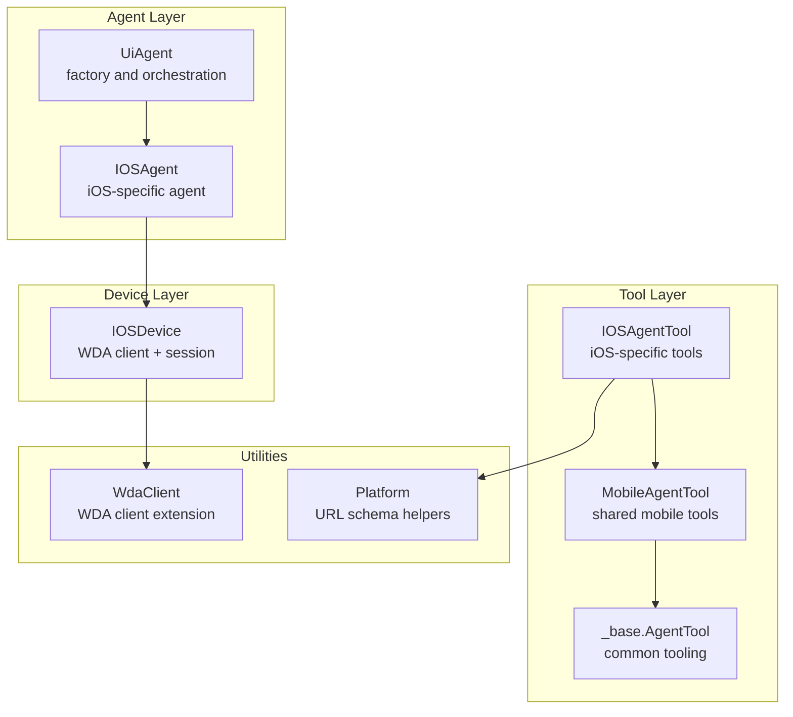
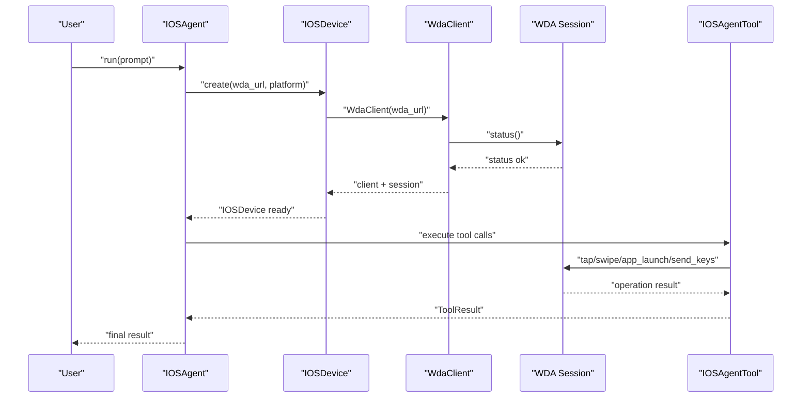
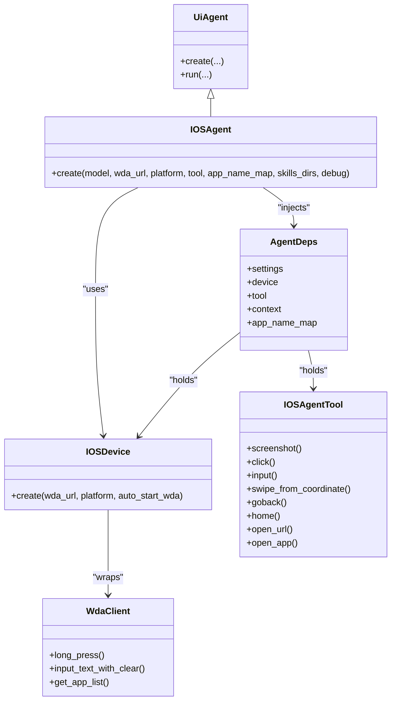

# iOS Agent

<cite>
**Referenced Files in This Document**
- [ios.py](file://src/page_eyes/tools/ios.py)
- [wda_tool.py](file://src/page_eyes/util/wda_tool.py)
- [agent.py](file://src/page_eyes/agent.py)
- [device.py](file://src/page_eyes/device.py)
- [deps.py](file://src/page_eyes/deps.py)
- [config.py](file://src/page_eyes/config.py)
- [_base.py](file://src/page_eyes/tools/_base.py)
- [_mobile.py](file://src/page_eyes/tools/_mobile.py)
- [platform.py](file://src/page_eyes/util/platform.py)
- [prompt.py](file://src/page_eyes/prompt.py)
- [installation.md](file://docs/getting-started/installation.md)
- [dev-env.md](file://docs/contributing/dev-env.md)
- [test_ios_agent.py](file://tests/test_ios_agent.py)
</cite>

## Table of Contents
1. [Introduction](#introduction)
2. [Project Structure](#project-structure)
3. [Core Components](#core-components)
4. [Architecture Overview](#architecture-overview)
5. [Detailed Component Analysis](#detailed-component-analysis)
6. [Dependency Analysis](#dependency-analysis)
7. [Performance Considerations](#performance-considerations)
8. [Troubleshooting Guide](#troubleshooting-guide)
9. [Conclusion](#conclusion)
10. [Appendices](#appendices)

## Introduction
This document provides comprehensive documentation for the IOSAgent class and the underlying iOS automation stack built on top of WebDriverAgent (WDA). It explains how the IOSAgent integrates with WDA to control iOS devices, how to configure device URLs and app name mappings, and how to leverage Facebook’s WDA-compatible APIs through the WdaClient extension. It also covers the IOSAgent.create() factory method parameters, iOS-specific automation capabilities (touch gestures, pinch-to-zoom, scroll, keyboard input, app lifecycle), device setup procedures, practical examples, and troubleshooting guidance for common issues such as WDA connection failures, SSL certificate problems, device trust failures, and automation stability.

## Project Structure
The iOS automation capability is implemented as part of a unified agent framework that supports multiple platforms (web, Android, Harmony, iOS, Electron). The iOS-specific components are organized under the tools and device modules, with shared abstractions in the base tooling and dependency injection layer.

**Diagram sources**
- [agent.py:441-477](file://src/page_eyes/agent.py#L441-L477)
- [device.py:159-228](file://src/page_eyes/device.py#L159-L228)
- [ios.py:24-293](file://src/page_eyes/tools/ios.py#L24-L293)
- [_mobile.py:27-165](file://src/page_eyes/tools/_mobile.py#L27-L165)
- [_base.py:130-391](file://src/page_eyes/tools/_base.py#L130-L391)
- [wda_tool.py:35-129](file://src/page_eyes/util/wda_tool.py#L35-L129)
- [platform.py:48-66](file://src/page_eyes/util/platform.py#L48-L66)

**Section sources**
- [agent.py:441-477](file://src/page_eyes/agent.py#L441-L477)
- [device.py:159-228](file://src/page_eyes/device.py#L159-L228)
- [ios.py:24-293](file://src/page_eyes/tools/ios.py#L24-L293)
- [_mobile.py:27-165](file://src/page_eyes/tools/_mobile.py#L27-L165)
- [_base.py:130-391](file://src/page_eyes/tools/_base.py#L130-L391)
- [wda_tool.py:35-129](file://src/page_eyes/util/wda_tool.py#L35-L129)
- [platform.py:48-66](file://src/page_eyes/util/platform.py#L48-L66)

## Core Components
- IOSAgent: The iOS-specific agent that orchestrates tasks using WDA-backed IOSDevice and IOSAgentTool.
- IOSDevice: Manages WDA client creation, session establishment, and optional automatic WDA startup on macOS with Xcode.
- IOSAgentTool: Implements iOS-specific actions such as click, input, swipe, go-back/home, open-url, and open-app.
- WdaClient: An extension of the WDA client that adds convenience methods (long press, input with clear, app list retrieval).
- AgentDeps: Dependency container holding settings, device, tool, and app name mapping.

Key responsibilities:
- Factory creation of IOSAgent with model, WDA URL, platform type, custom tool, app name mapping, skills directories, and debug flags.
- Device URL configuration and WDA connection setup with fallback to auto-starting WDA on macOS.
- App name mapping to resolve Bundle IDs for reliable app launching.
- Facebook WDA-compatible API usage via WdaClient and session methods.

**Section sources**
- [agent.py:441-477](file://src/page_eyes/agent.py#L441-L477)
- [device.py:159-228](file://src/page_eyes/device.py#L159-L228)
- [ios.py:24-293](file://src/page_eyes/tools/ios.py#L24-L293)
- [wda_tool.py:35-129](file://src/page_eyes/util/wda_tool.py#L35-L129)
- [deps.py:75-83](file://src/page_eyes/deps.py#L75-L83)

## Architecture Overview
The iOS automation pipeline connects the IOSAgent to an IOSDevice backed by a WDA client and session. The agent uses a skills capability to execute atomic operations, with tools handling device-specific actions.

**Diagram sources**
- [agent.py:441-477](file://src/page_eyes/agent.py#L441-L477)
- [device.py:159-228](file://src/page_eyes/device.py#L159-L228)
- [ios.py:24-293](file://src/page_eyes/tools/ios.py#L24-L293)

## Detailed Component Analysis

### IOSAgent.create() Factory Method
The IOSAgent.create() method constructs an iOS automation agent with the following parameters:
- model: Optional LLM model name.
- wda_url: Required WebDriverAgent server URL.
- platform: Optional platform type (used for URL schema generation).
- tool: Optional custom IOSAgentTool instance.
- app_name_map: Optional dictionary mapping friendly app names to Bundle IDs.
- skills_dirs: Optional list of skill directories to load.
- debug: Optional debug flag enabling verbose logging.

Behavior:
- Merges settings and creates IOSDevice with the provided WDA URL and platform.
- Initializes AgentDeps with device, tool, and app_name_map.
- Builds an agent with skills capability and returns IOSAgent instance.

**Section sources**
- [agent.py:441-477](file://src/page_eyes/agent.py#L441-L477)
- [config.py:54-73](file://src/page_eyes/config.py#L54-L73)
- [deps.py:75-83](file://src/page_eyes/deps.py#L75-L83)

### IOSDevice: WDA Connection Setup and Auto-Start
IOSDevice.create() establishes a WDA connection:
- Creates WdaClient with the provided wda_url.
- Retrieves window size and validates device status.
- On failure, attempts to auto-start WDA on macOS using xcodebuild if environment variables IOS_UDID and IOS_WDA_PROJECT_PATH are set.
- Retries until successful or max retries exhausted.

Key environment variables:
- IOS_UDID: iOS device UDID.
- IOS_WDA_PROJECT_PATH: Path to WebDriverAgent project.

Auto-start behavior:
- Executes xcodebuild with WebDriverAgentRunner scheme and destination UDID.
- Waits for process to start and logs status.

**Section sources**
- [device.py:159-228](file://src/page_eyes/device.py#L159-L228)
- [device.py:324-389](file://src/page_eyes/device.py#L324-L389)

### WdaClient: Facebook WDA-Compatible Extensions
WdaClient extends the WDA client with convenience methods:
- long_press(x, y, duration): Performs a long press gesture.
- input_text_with_clear(text, clear): Clears input (optional) and sends keys.
- get_app_list(): Retrieves installed apps using pymobiledevice3 if available; falls back to WDA method otherwise.

Integration:
- Used by IOSAgentTool for tap-and-input operations and app discovery.

**Section sources**
- [wda_tool.py:35-129](file://src/page_eyes/util/wda_tool.py#L35-L129)

### IOSAgentTool: iOS-Specific Automation Capabilities
IOSAgentTool implements platform-specific actions:
- Screenshot: Captures device screenshot and returns a PNG buffer.
- Click: Computes coordinates and performs a tap.
- Input: Uses WdaClient tap_and_input to focus and type text, optionally sending Enter.
- Swipe (by direction): Scrolls in predefined directions with repeat support and optional keyword expectation.
- Swipe (by coordinates): Slides between consecutive coordinate pairs with bounds checking.
- Go back: Attempts to find a navigation back button; otherwise uses a left-edge swipe.
- Home: Navigates to the iOS home screen.
- Open URL: Launches Safari and opens the formatted URL.
- Open App: Resolves app by friendly name via app_name_map or by intelligent matching against installed apps; launches via app bundle ID.

App name mapping:
- Prioritizes explicit mapping from app_name_map for reliable resolution (e.g., resolving ambiguous display names).

**Section sources**
- [ios.py:24-293](file://src/page_eyes/tools/ios.py#L24-L293)
- [wda_tool.py:97-124](file://src/page_eyes/util/wda_tool.py#L97-L124)

### Shared Mobile Tooling
MobileAgentTool provides cross-platform primitives:
- Screenshot, open_url, click, input, swipe, open_app, and teardown.
- URL schema generation via platform-specific helpers.

These are extended by IOSAgentTool for iOS-specific behavior.

**Section sources**
- [_mobile.py:27-165](file://src/page_eyes/tools/_mobile.py#L27-L165)
- [platform.py:48-66](file://src/page_eyes/util/platform.py#L48-L66)

### AgentDeps and Tool Parameters
AgentDeps holds:
- settings: Global settings.
- device: IOSDevice instance.
- tool: IOSAgentTool instance.
- context: Execution context with steps and screen info.
- app_name_map: Friendly app name to Bundle ID mapping.

Tool parameters define structured inputs for actions like click, input, swipe, open_url, and others.

**Section sources**
- [deps.py:75-83](file://src/page_eyes/deps.py#L75-L83)
- [deps.py:165-216](file://src/page_eyes/deps.py#L165-L216)
- [deps.py:218-234](file://src/page_eyes/deps.py#L218-L234)

### Practical Examples
Example scenarios validated by tests:
- Opening URLs, clicking close buttons, navigating lists, and searching.
- Returning to the home screen, opening native apps (Settings, Calendar, Photos), and navigating system screens.
- Swiping up/down multiple times, inputting text with Enter behavior, and handling dialogs.
- Long-press copy operations within native apps.

These demonstrate real-world iOS automation patterns and robustness against UI changes.

**Section sources**
- [test_ios_agent.py:11-212](file://tests/test_ios_agent.py#L11-L212)

## Dependency Analysis
The iOS automation stack exhibits clear separation of concerns:
- Agent layer orchestrates tasks and manages skills.
- Device layer encapsulates WDA connectivity and session management.
- Tool layer implements platform-specific actions.
- Utility layer provides WDA client extensions and platform helpers.

**Diagram sources**
- [agent.py:441-477](file://src/page_eyes/agent.py#L441-L477)
- [device.py:159-228](file://src/page_eyes/device.py#L159-L228)
- [ios.py:24-293](file://src/page_eyes/tools/ios.py#L24-L293)
- [wda_tool.py:35-129](file://src/page_eyes/util/wda_tool.py#L35-L129)
- [deps.py:75-83](file://src/page_eyes/deps.py#L75-L83)

**Section sources**
- [agent.py:441-477](file://src/page_eyes/agent.py#L441-L477)
- [device.py:159-228](file://src/page_eyes/device.py#L159-L228)
- [ios.py:24-293](file://src/page_eyes/tools/ios.py#L24-L293)
- [wda_tool.py:35-129](file://src/page_eyes/util/wda_tool.py#L35-L129)
- [deps.py:75-83](file://src/page_eyes/deps.py#L75-L83)

## Performance Considerations
- After-delay and before-delay in tool decorators introduce small pauses to stabilize UI rendering and reduce flakiness.
- Repeated swipes with keyword expectations add polling delays; tune repeat counts and timeouts for stability vs. speed.
- App list retrieval via pymobiledevice3 is preferred for richer metadata; fallback to WDA is slower but reliable.
- Network latency to WDA server affects responsiveness; ensure local or low-latency connections.

[No sources needed since this section provides general guidance]

## Troubleshooting Guide

Common issues and resolutions:
- WDA connection fails
  - Verify wda_url points to a reachable WDA server.
  - Ensure device trust and developer mode are configured.
  - Confirm Xcode and WebDriverAgent are installed and signed correctly.
  - Use the auto-start mechanism on macOS by setting IOS_UDID and IOS_WDA_PROJECT_PATH.

- SSL certificate or HTTPS issues
  - WDA typically runs on HTTP; ensure firewall/proxy allows traffic to the WDA port.
  - If using remote Mac, configure SSH tunneling or port forwarding.

- Device trust failures
  - Trust the developer certificate on the device.
  - Enable Developer Mode on iOS 16+.

- Automation instability
  - Add waits and assertions around dynamic content.
  - Use swipe with keyword expectations to detect page transitions.
  - Prefer explicit element-based operations over generic gestures.

Setup references:
- Installation and device trust setup for WebDriverAgent.
- Environment variable configuration for WDA URL and proxying.

**Section sources**
- [device.py:195-227](file://src/page_eyes/device.py#L195-L227)
- [device.py:324-389](file://src/page_eyes/device.py#L324-L389)
- [installation.md:132-204](file://docs/getting-started/installation.md#L132-L204)
- [dev-env.md:146-228](file://docs/contributing/dev-env.md#L146-L228)

## Conclusion
The IOSAgent provides a robust, extensible foundation for iOS automation via WebDriverAgent. Its factory-based construction, WDA integration, and rich toolset enable reliable automation of common iOS tasks. By leveraging app name mapping, platform-aware URL schemas, and resilient device setup procedures, teams can automate iOS workflows consistently across iPhone and iPad devices, while maintaining flexibility for future enhancements.

[No sources needed since this section summarizes without analyzing specific files]

## Appendices

### Device Setup Procedures
- Obtain and configure WebDriverAgent locally or remotely.
- Install dependencies and sign the project in Xcode.
- Trust the developer certificate on the iOS device and enable Developer Mode.
- Start WDA service and verify connectivity via curl.
- Configure environment variables for WDA URL and optional port forwarding.

**Section sources**
- [installation.md:132-204](file://docs/getting-started/installation.md#L132-L204)
- [dev-env.md:146-228](file://docs/contributing/dev-env.md#L146-L228)

### iOS Version Compatibility and Device Types
- iOS 16+ requires Developer Mode enabled for automation.
- iPhone and iPad share the same WDA interface; ensure consistent device orientation and scaling.
- App Store-restricted apps may require special provisioning or enterprise distribution.

[No sources needed since this section provides general guidance]

### App Name Mapping Best Practices
- Maintain a stable app_name_map to resolve ambiguous app names to precise Bundle IDs.
- Use the mapping to avoid launching the wrong variant of an app with similar display names.

**Section sources**
- [ios.py:253-264](file://src/page_eyes/tools/ios.py#L253-L264)
- [deps.py:81-82](file://src/page_eyes/deps.py#L81-L82)

### Example Workflows
- Open Safari, navigate to a URL, and interact with elements.
- Navigate system settings, check device info, and return to home.
- Perform swipe gestures and input operations with Enter behavior control.

**Section sources**
- [test_ios_agent.py:11-212](file://tests/test_ios_agent.py#L11-L212)