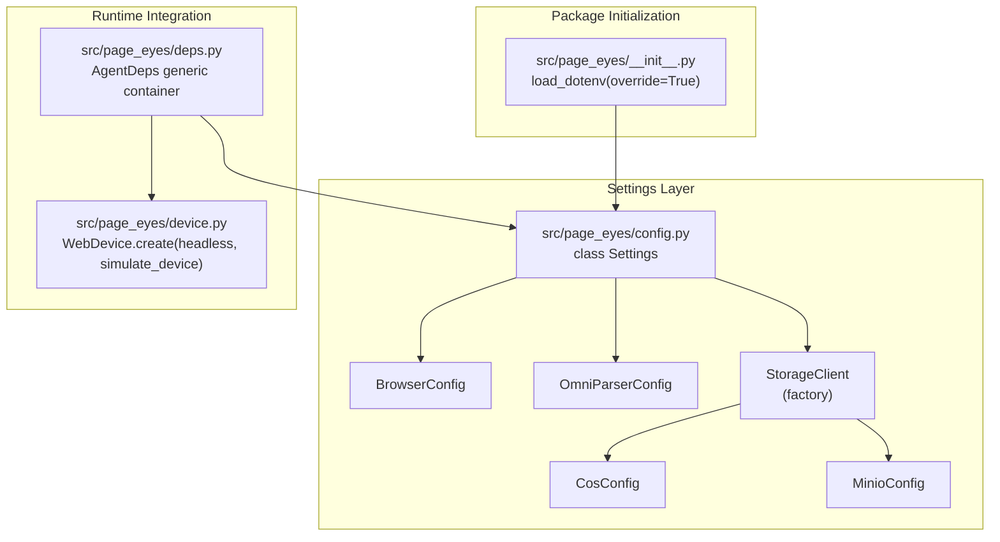
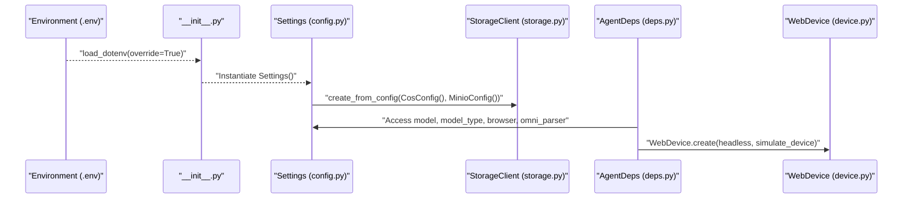
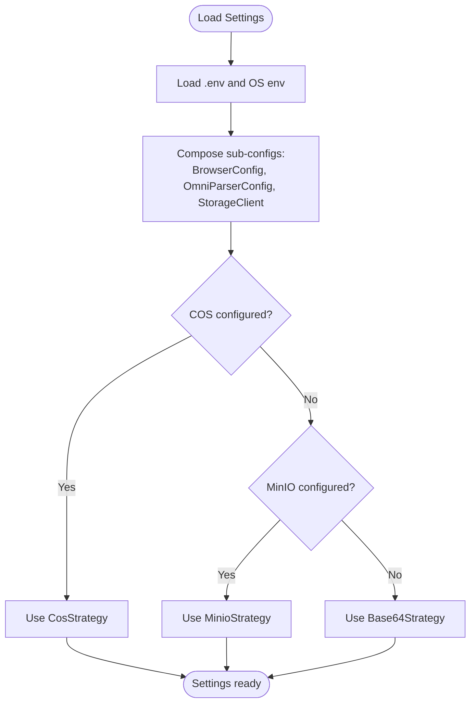
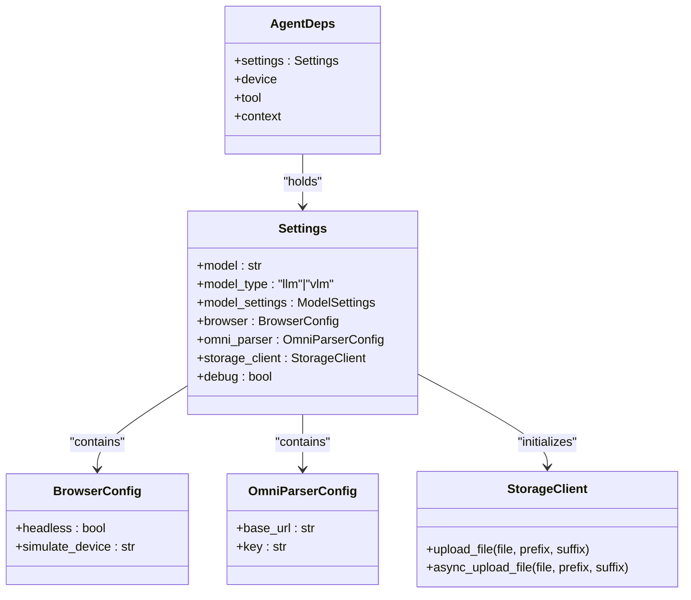
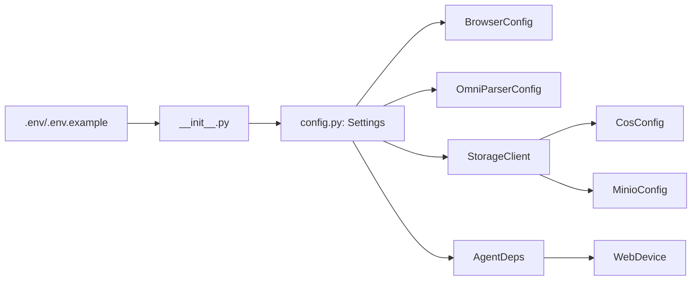

# Configuration Management

<cite>
**Referenced Files in This Document**
- [config.py](file://src/page_eyes/config.py)
- [deps.py](file://src/page_eyes/deps.py)
- [storage.py](file://src/page_eyes/util/storage.py)
- [device.py](file://src/page_eyes/device.py)
- [__init__.py](file://src/page_eyes/__init__.py)
- [installation.md](file://docs/getting-started/installation.md)
- [troubleshooting.md](file://docs/faq/troubleshooting.md)
- [README.md](file://README.md)
- [conftest.py](file://tests/conftest.py)
</cite>

## Table of Contents
1. [Introduction](#introduction)
2. [Project Structure](#project-structure)
3. [Core Components](#core-components)
4. [Architecture Overview](#architecture-overview)
5. [Detailed Component Analysis](#detailed-component-analysis)
6. [Dependency Analysis](#dependency-analysis)
7. [Performance Considerations](#performance-considerations)
8. [Troubleshooting Guide](#troubleshooting-guide)
9. [Conclusion](#conclusion)
10. [Appendices](#appendices)

## Introduction
This document explains the centralized configuration system and environment variable handling in PageEyes Agent. It covers all configuration options, including AI model selection, debugging, browser headless mode, model type selection, OmniParser service configuration, and cloud storage integration (COS vs MinIO). It also documents the configuration hierarchy, precedence rules, inheritance patterns, and how AgentDeps dependency injection consumes configuration during component initialization. Practical examples and troubleshooting guidance are included to help you configure PageEyes Agent reliably across platforms and deployment scenarios.

## Project Structure
The configuration system centers around a single settings class that aggregates sub-configurations for browser, OmniParser, and storage. Environment variables are loaded early in the package initialization and consumed via Pydantic settings with dotenv support. The AgentDeps dependency container carries the initialized Settings object and device/tool instances.

**Diagram sources**
- [__init__.py:1-15](file://src/page_eyes/__init__.py#L1-L15)
- [config.py:54-73](file://src/page_eyes/config.py#L54-L73)
- [deps.py:75-83](file://src/page_eyes/deps.py#L75-L83)
- [device.py:59-87](file://src/page_eyes/device.py#L59-L87)

**Section sources**
- [__init__.py:1-15](file://src/page_eyes/__init__.py#L1-L15)
- [config.py:54-73](file://src/page_eyes/config.py#L54-L73)
- [deps.py:75-83](file://src/page_eyes/deps.py#L75-L83)
- [device.py:59-87](file://src/page_eyes/device.py#L59-L87)

## Core Components
- Centralized Settings: Aggregates model, model type, model settings, browser, OmniParser, storage client, and debug flag.
- Sub-configurations:
  - BrowserConfig: headless and device simulation.
  - OmniParserConfig: base URL and optional key.
  - StorageClient: factory that selects COS or MinIO strategy based on availability, otherwise falls back to Base64.
  - Cloud storage configs: CosConfig and MinioConfig define credentials and endpoints.
- AgentDeps: Generic container carrying Settings, device, tool, and runtime context used by agents.

Key configuration options and defaults:
- AGENT_MODEL: default model identifier string.
- AGENT_MODEL_TYPE: either "llm" or "vlm".
- AGENT_DEBUG: enables verbose logging.
- BROWSER_HEADLESS: controls Playwright headless mode for WebAgent.
- OMNI_BASE_URL: OmniParser service endpoint (required for llm pipeline).
- COS_* and MINIO_*: cloud storage credentials and endpoints (mutually preferred; otherwise Base64 fallback).

**Section sources**
- [config.py:54-73](file://src/page_eyes/config.py#L54-L73)
- [config.py:19-37](file://src/page_eyes/config.py#L19-L37)
- [config.py:40-52](file://src/page_eyes/config.py#L40-L52)
- [storage.py:161-186](file://src/page_eyes/util/storage.py#L161-L186)
- [deps.py:75-83](file://src/page_eyes/deps.py#L75-L83)

## Architecture Overview
The configuration architecture follows a layered approach:
- Early environment loading ensures .env and OS environment variables are available before settings classes are instantiated.
- Settings composes nested sub-configs and initializes StorageClient from CosConfig/MinioConfig.
- AgentDeps receives the singleton Settings instance and uses it to initialize devices and tools.
- Runtime behavior is controlled by Settings fields, especially model type and browser/headless flags.

**Diagram sources**
- [__init__.py:15](file://src/page_eyes/__init__.py#L15)
- [config.py:54-73](file://src/page_eyes/config.py#L54-L73)
- [storage.py:161-186](file://src/page_eyes/util/storage.py#L161-L186)
- [deps.py:75-83](file://src/page_eyes/deps.py#L75-L83)
- [device.py:59-87](file://src/page_eyes/device.py#L59-L87)

## Detailed Component Analysis

### Centralized Settings and Precedence
- Precedence order (highest to lowest): code-provided overrides > environment variables > .env file > class defaults.
- Settings loads .env automatically and exposes typed fields for model, model type, model settings, browser, OmniParser, storage client, and debug.
- BrowserConfig supports headless and simulate_device; WebDevice reads these to launch persistent contexts accordingly.

**Diagram sources**
- [__init__.py:15](file://src/page_eyes/__init__.py#L15)
- [config.py:54-73](file://src/page_eyes/config.py#L54-L73)
- [storage.py:161-186](file://src/page_eyes/util/storage.py#L161-L186)

**Section sources**
- [__init__.py:8-15](file://src/page_eyes/__init__.py#L8-L15)
- [config.py:54-73](file://src/page_eyes/config.py#L54-L73)
- [device.py:59-87](file://src/page_eyes/device.py#L59-L87)

### Browser Headless Mode and Device Simulation
- BROWSER_HEADLESS controls whether Playwright launches in headless mode for WebAgent.
- simulate_device can emulate mobile devices; WebDevice adjusts viewport and removes incompatible args when simulating.

Practical usage:
- Set BROWSER_HEADLESS to False for visible browser debugging.
- Set simulate_device to a supported device name to mimic mobile layouts.

**Section sources**
- [config.py:40-44](file://src/page_eyes/config.py#L40-L44)
- [device.py:59-87](file://src/page_eyes/device.py#L59-L87)

### AI Model Selection and Model Type
- AGENT_MODEL defines the model identifier string used by the underlying AI framework.
- AGENT_MODEL_TYPE selects between "llm" and "vlm". This influences parameter types and coordinate computation logic at runtime.

Runtime effect:
- LocationToolParams resolves to a VLM or LLM variant depending on model_type at import time.

**Section sources**
- [config.py:58-59](file://src/page_eyes/config.py#L58-L59)
- [deps.py:162](file://src/page_eyes/deps.py#L162)

### OmniParser Service Configuration
- OMNI_BASE_URL specifies the OmniParser service endpoint. Required when using the llm pipeline.
- Optional OMNI_KEY may be required by the service; configure via environment variables.

Operational note:
- When AGENT_MODEL_TYPE is "vlm", OmniParser is not required.

**Section sources**
- [config.py:47-51](file://src/page_eyes/config.py#L47-L51)
- [installation.md:372-388](file://docs/getting-started/installation.md#L372-L388)

### Cloud Storage Integration (COS vs MinIO)
- COS_* and MINIO_* environment variables define credentials and endpoints for cloud storage.
- StorageClient.create_from_config selects:
  - COS if secret_id and secret_key are present.
  - MinIO if access_key and secret_key are present.
  - Base64 fallback otherwise.

Behavior:
- Uploads are deduplicated by MD5; images are converted to WebP when appropriate.

**Section sources**
- [config.py:19-37](file://src/page_eyes/config.py#L19-L37)
- [config.py:16-16](file://src/page_eyes/config.py#L16-L16)
- [storage.py:161-186](file://src/page_eyes/util/storage.py#L161-L186)

### Debugging Settings
- AGENT_DEBUG toggles verbose logging for easier troubleshooting.
- Additional logging controls are available via external libraries and environment variables.

**Section sources**
- [config.py:69](file://src/page_eyes/config.py#L69)
- [troubleshooting.md:187-196](file://docs/faq/troubleshooting.md#L187-L196)

### AgentDeps Dependency Injection and Initialization
- AgentDeps is a generic container holding Settings, device, tool, and runtime context.
- The Settings instance is constructed once and shared across agents.
- Device creation (e.g., WebDevice.create) reads Settings.browser.headless and simulate_device to configure the browser context.

**Diagram sources**
- [config.py:54-73](file://src/page_eyes/config.py#L54-L73)
- [deps.py:75-83](file://src/page_eyes/deps.py#L75-L83)

**Section sources**
- [deps.py:75-83](file://src/page_eyes/deps.py#L75-L83)
- [config.py:54-73](file://src/page_eyes/config.py#L54-L73)

## Dependency Analysis
- Package initialization loads .env globally, ensuring environment variables are available to settings classes.
- Settings depends on sub-configs and the storage factory to produce a StorageClient.
- AgentDeps depends on Settings for runtime configuration and uses it to construct devices.

**Diagram sources**
- [__init__.py:15](file://src/page_eyes/__init__.py#L15)
- [config.py:54-73](file://src/page_eyes/config.py#L54-L73)
- [storage.py:161-186](file://src/page_eyes/util/storage.py#L161-L186)
- [deps.py:75-83](file://src/page_eyes/deps.py#L75-L83)

**Section sources**
- [__init__.py:15](file://src/page_eyes/__init__.py#L15)
- [config.py:54-73](file://src/page_eyes/config.py#L54-L73)
- [storage.py:161-186](file://src/page_eyes/util/storage.py#L161-L186)
- [deps.py:75-83](file://src/page_eyes/deps.py#L75-L83)

## Performance Considerations
- Headless mode reduces overhead for WebAgent runs.
- Using COS or MinIO avoids large base64 payloads, reducing memory and network overhead.
- VLM model type can reduce reliance on external parsing services, potentially lowering latency.

[No sources needed since this section provides general guidance]

## Troubleshooting Guide
Common configuration issues and validations:
- Environment variables not taking effect:
  - Verify .env file exists in the project root and uses correct prefixes (AGENT_, OPENAI_, COS_, MINIO_).
  - Confirm load_dotenv is executed before importing settings.
- OmniParser connectivity:
  - Ensure OMNI_BASE_URL is reachable and OMNI_KEY is set if required.
- Storage upload failures:
  - Check COS or MINIO credentials and bucket permissions; test upload via the storage client.
- Debug logs:
  - Enable AGENT_DEBUG and adjust external logging levels for deeper insight.

Validation procedures:
- Print effective settings after import to confirm values.
- Run device creation with explicit parameters to override environment for testing.

**Section sources**
- [troubleshooting.md:6-25](file://docs/faq/troubleshooting.md#L6-L25)
- [troubleshooting.md:145-181](file://docs/faq/troubleshooting.md#L145-L181)
- [installation.md:424-494](file://docs/getting-started/installation.md#L424-L494)
- [__init__.py:8-15](file://src/page_eyes/__init__.py#L8-L15)

## Conclusion
PageEyes Agent’s configuration system provides a robust, layered approach to managing environment-driven settings. By leveraging dotenv, Pydantic settings, and a central Settings class, it supports flexible deployment scenarios across platforms. The AgentDeps container ensures consistent initialization of devices and tools using the unified configuration. Following the documented precedence rules and using the troubleshooting guidance will help you deploy and operate PageEyes Agent reliably.

[No sources needed since this section summarizes without analyzing specific files]

## Appendices

### Configuration Options Reference
- AGENT_MODEL: AI model identifier string.
- AGENT_MODEL_TYPE: "llm" or "vlm".
- AGENT_DEBUG: enable verbose logging.
- BROWSER_HEADLESS: control browser headless mode.
- OMNI_BASE_URL: OmniParser service endpoint (required for llm).
- OPENAI_BASE_URL, OPENAI_API_KEY: LLM provider endpoint and key.
- COS_* and MINIO_*: cloud storage credentials and endpoints.

**Section sources**
- [README.md:97-131](file://README.md#L97-L131)
- [installation.md:314-422](file://docs/getting-started/installation.md#L314-L422)

### Example .env Scenarios
- Light deployment with VLM:
  - Set AGENT_MODEL_TYPE=vlm and AGENT_MODEL to a VLM provider/model.
  - Configure OPENAI_BASE_URL and OPENAI_API_KEY.
- LLM + OmniParser:
  - Set AGENT_MODEL_TYPE=llm and OMNI_BASE_URL to your service endpoint.
  - Configure OPENAI_BASE_URL and OPENAI_API_KEY.
- Cloud storage:
  - Choose COS or MinIO by setting the respective environment variables; leave the other unset to avoid partial configuration.

**Section sources**
- [README.md:57-96](file://README.md#L57-L96)
- [installation.md:349-422](file://docs/getting-started/installation.md#L349-L422)

### Platform-Specific Notes
- iOS automation requires IOS_WDA_URL and WebDriverAgent setup.
- Electron automation requires the target app launched with remote debugging enabled.

**Section sources**
- [installation.md:206-254](file://docs/getting-started/installation.md#L206-L254)
- [conftest.py:33-35](file://tests/conftest.py#L33-L35)