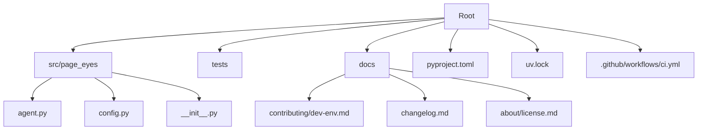
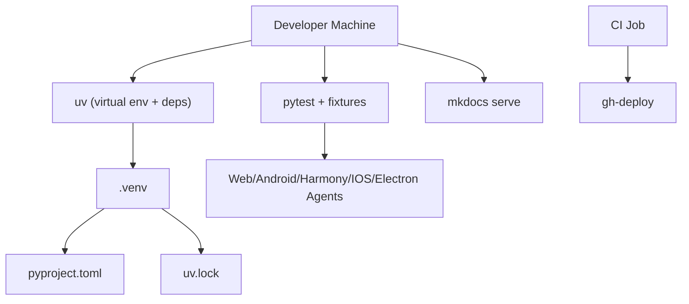
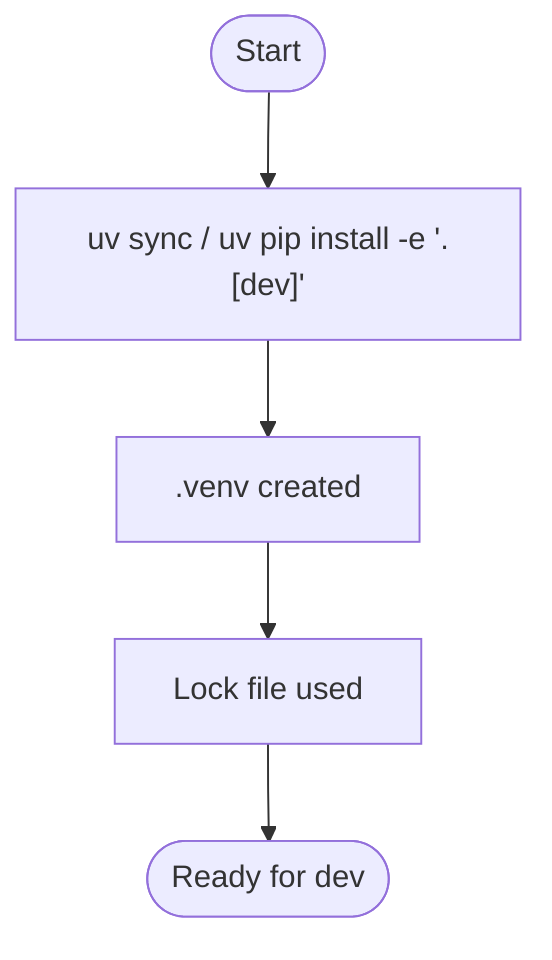
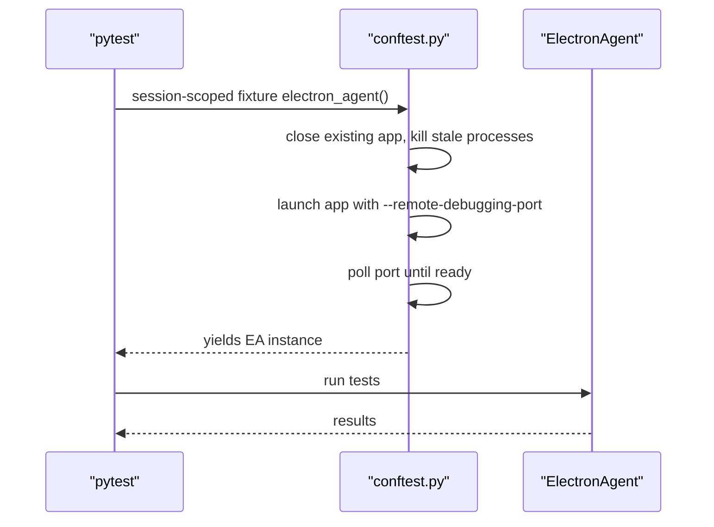
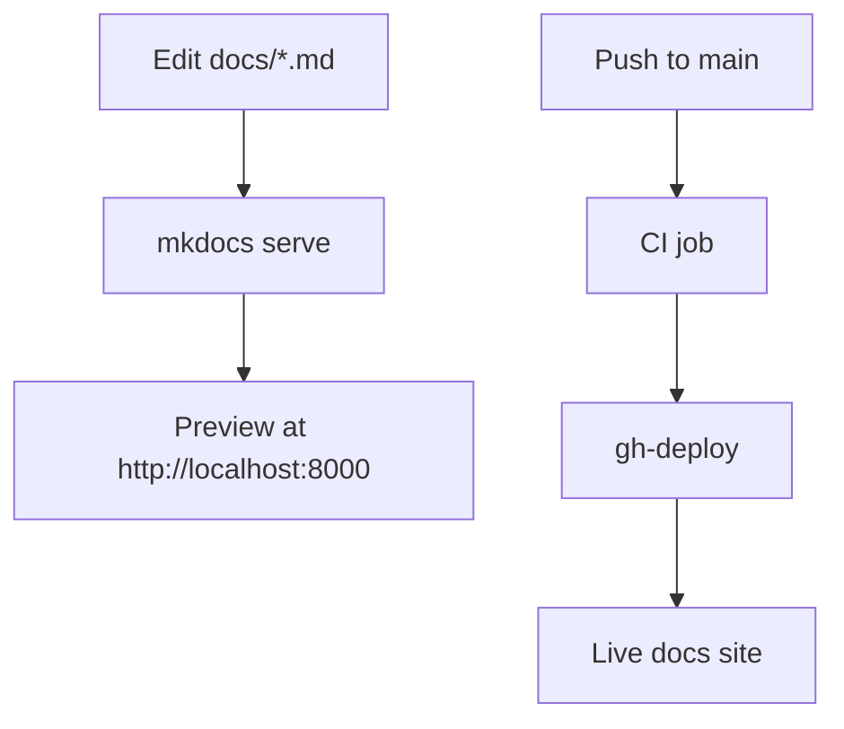
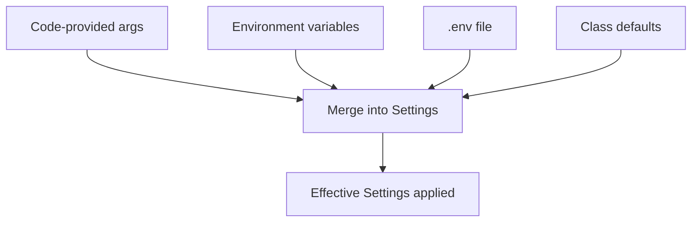
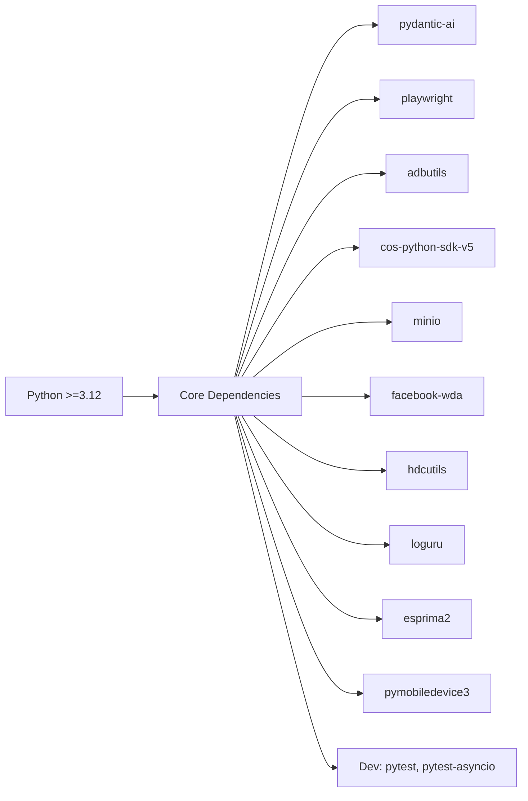
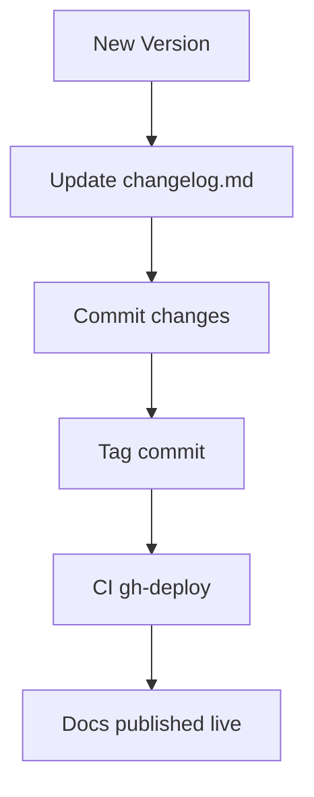

# Contributing Guide

<cite>
**Referenced Files in This Document**
- [README.md](file://README.md)
- [pyproject.toml](file://pyproject.toml)
- [uv.lock](file://uv.lock)
- [docs/contributing/dev-env.md](file://docs/contributing/dev-env.md)
- [mkdocs.yml](file://mkdocs.yml)
- [tests/conftest.py](file://tests/conftest.py)
- [tests/pytest.ini](file://tests/pytest.ini)
- [.github/workflows/ci.yml](file://.github/workflows/ci.yml)
- [docs/changelog.md](file://docs/changelog.md)
- [docs/about/license.md](file://docs/about/license.md)
- [src/page_eyes/__init__.py](file://src/page_eyes/__init__.py)
- [src/page_eyes/config.py](file://src/page_eyes/config.py)
- [src/page_eyes/agent.py](file://src/page_eyes/agent.py)
</cite>

## Table of Contents
1. [Introduction](#introduction)
2. [Project Structure](#project-structure)
3. [Core Components](#core-components)
4. [Architecture Overview](#architecture-overview)
5. [Detailed Component Analysis](#detailed-component-analysis)
6. [Dependency Analysis](#dependency-analysis)
7. [Performance Considerations](#performance-considerations)
8. [Troubleshooting Guide](#troubleshooting-guide)
9. [Contribution Workflow](#contribution-workflow)
10. [Coding Standards and Testing](#coding-standards-and-testing)
11. [Release Procedures and Versioning](#release-procedures-and-versioning)
12. [Onboarding and Mentorship](#onboarding-and-mentorship)
13. [Legal and Licensing](#legal-and-licensing)
14. [Conclusion](#conclusion)

## Introduction
This guide helps contributors set up a development environment, understand the project structure, and follow contribution workflows for PageEyes Agent. It covers environment setup, dependency management with uv, testing, documentation, release procedures, and legal considerations.

## Project Structure
The repository is organized into:
- Source code under src/page_eyes
- Tests under tests
- Documentation under docs
- Build and dependency configuration via pyproject.toml and uv.lock
- CI deployment via .github/workflows/ci.yml

**Diagram sources**
- [pyproject.toml:1-88](file://pyproject.toml#L1-L88)
- [uv.lock](file://uv.lock)
- [.github/workflows/ci.yml:1-29](file://.github/workflows/ci.yml#L1-L29)
- [docs/contributing/dev-env.md:1-356](file://docs/contributing/dev-env.md#L1-L356)
- [docs/changelog.md:1-82](file://docs/changelog.md#L1-L82)
- [docs/about/license.md:1-317](file://docs/about/license.md#L1-L317)
- [src/page_eyes/agent.py:1-200](file://src/page_eyes/agent.py#L1-L200)
- [src/page_eyes/config.py:1-73](file://src/page_eyes/config.py#L1-L73)
- [src/page_eyes/__init__.py:1-16](file://src/page_eyes/__init__.py#L1-L16)

**Section sources**
- [pyproject.toml:1-88](file://pyproject.toml#L1-L88)
- [uv.lock](file://uv.lock)
- [docs/contributing/dev-env.md:1-356](file://docs/contributing/dev-env.md#L1-L356)
- [mkdocs.yml:1-100](file://mkdocs.yml#L1-L100)

## Core Components
- Environment initialization loads .env early to unify precedence rules for settings.
- Settings encapsulate model selection, browser/headless behavior, OmniParser configuration, storage clients, and debug flags.
- Agent orchestrates planning and UI automation via Pydantic AI, integrates skills, and generates HTML reports.

Key responsibilities:
- Environment loading and precedence: [src/page_eyes/__init__.py:6-16](file://src/page_eyes/__init__.py#L6-L16)
- Settings model and defaults: [src/page_eyes/config.py:54-73](file://src/page_eyes/config.py#L54-L73)
- Agent composition and report generation: [src/page_eyes/agent.py:147-191](file://src/page_eyes/agent.py#L147-L191)

**Section sources**
- [src/page_eyes/__init__.py:1-16](file://src/page_eyes/__init__.py#L1-L16)
- [src/page_eyes/config.py:1-73](file://src/page_eyes/config.py#L1-L73)
- [src/page_eyes/agent.py:1-200](file://src/page_eyes/agent.py#L1-L200)

## Architecture Overview
High-level flow for local development and testing:
- Install uv, create a virtual environment, and install dev dependencies.
- Configure environment variables for model provider, OmniParser, and optional storage.
- Run tests via pytest with asyncio fixtures for multi-platform agents.
- Optionally build and preview docs locally.

**Diagram sources**
- [pyproject.toml:79-86](file://pyproject.toml#L79-L86)
- [tests/conftest.py:1-116](file://tests/conftest.py#L1-L116)
- [.github/workflows/ci.yml:10-29](file://.github/workflows/ci.yml#L10-L29)

**Section sources**
- [docs/contributing/dev-env.md:37-78](file://docs/contributing/dev-env.md#L37-L78)
- [tests/conftest.py:1-116](file://tests/conftest.py#L1-L116)
- [.github/workflows/ci.yml:1-29](file://.github/workflows/ci.yml#L1-L29)

## Detailed Component Analysis

### Development Environment Setup
- System requirements and prerequisites (Python 3.12+, Git, Node.js for docs).
- uv-based virtual environment and editable dev installs.
- Playwright browser installation.
- OmniParser configuration (official key or self-hosted).
- LLM provider configuration via environment variables.
- Optional storage (COS or MinIO).
- iOS automation setup (WebDriverAgent) and verification.
- Verification steps and recommended VSCode settings.
- Optional pre-commit hooks.

**Section sources**
- [docs/contributing/dev-env.md:5-356](file://docs/contributing/dev-env.md#L5-L356)
- [pyproject.toml:19-32](file://pyproject.toml#L19-L32)
- [pyproject.toml:82-86](file://pyproject.toml#L82-L86)

### Dependency Management with uv
- uv.lock pins exact versions for reproducible installs.
- pyproject.toml defines project metadata, Python requirement, dependencies, dev group, and uv indices.
- Use uv to create and manage the virtual environment and install extras.

**Diagram sources**
- [pyproject.toml:79-86](file://pyproject.toml#L79-L86)
- [uv.lock](file://uv.lock)

**Section sources**
- [pyproject.toml:19-32](file://pyproject.toml#L19-L32)
- [pyproject.toml:69-80](file://pyproject.toml#L69-L80)
- [uv.lock](file://uv.lock)

### Testing and Debugging
- pytest configuration and asyncio loop scope.
- Shared fixtures initialize agents for Web, Android, Harmony, iOS, Electron, and a PlanningAgent.
- Electron fixture launches and validates a remote-debugging-port connection before creating the agent.
- Logging is configured centrally for tests.

**Diagram sources**
- [tests/conftest.py:82-116](file://tests/conftest.py#L82-L116)

**Section sources**
- [tests/pytest.ini:1-4](file://tests/pytest.ini#L1-L4)
- [tests/conftest.py:1-116](file://tests/conftest.py#L1-L116)

### Documentation Workflow
- MkDocs configuration for site build and navigation.
- Local docs server via mkdocs serve.
- CI job deploys docs to GitHub Pages.

**Diagram sources**
- [mkdocs.yml:1-100](file://mkdocs.yml#L1-L100)
- [.github/workflows/ci.yml:10-29](file://.github/workflows/ci.yml#L10-L29)

**Section sources**
- [mkdocs.yml:1-100](file://mkdocs.yml#L1-L100)
- [.github/workflows/ci.yml:1-29](file://.github/workflows/ci.yml#L1-L29)

### Environment Precedence and Settings
- Environment loading order ensures code-provided overrides take priority over .env and defaults.
- Settings include model, model type, browser/headless, OmniParser base URL/key, storage client, and debug flag.

**Diagram sources**
- [src/page_eyes/__init__.py:6-16](file://src/page_eyes/__init__.py#L6-L16)
- [src/page_eyes/config.py:54-73](file://src/page_eyes/config.py#L54-L73)

**Section sources**
- [src/page_eyes/__init__.py:1-16](file://src/page_eyes/__init__.py#L1-L16)
- [src/page_yes/config.py:1-73](file://src/page_eyes/config.py#L1-L73)

## Dependency Analysis
- Python requirement: >=3.12
- Core dependencies include Pydantic AI, Playwright, adbutils, cos-python-sdk-v5, minio, facebook-wda, hdcutils, loguru, esprima2, pymobiledevice3.
- Dev dependencies include pytest and pytest-asyncio.
- uv indices configured for Tencent mirrors.

**Diagram sources**
- [pyproject.toml:19-32](file://pyproject.toml#L19-L32)
- [pyproject.toml:82-86](file://pyproject.toml#L82-L86)
- [pyproject.toml:69-80](file://pyproject.toml#L69-L80)

**Section sources**
- [pyproject.toml:19-32](file://pyproject.toml#L19-L32)
- [pyproject.toml:82-86](file://pyproject.toml#L82-L86)
- [pyproject.toml:69-80](file://pyproject.toml#L69-L80)

## Performance Considerations
- Prefer uv for fast, reproducible installs and virtual environments.
- Use Playwright’s persistent contexts and caching where applicable to reduce startup overhead.
- Keep screenshots and image uploads minimal; leverage OmniParser asynchronously to avoid blocking.
- Avoid unnecessary retries and long waits; rely on precise waiting logic.

[No sources needed since this section provides general guidance]

## Troubleshooting Guide
Common issues and resolutions:
- Playwright browser installation failures: reinstall Chromium with explicit path control.
- ADB device connection problems: check device list and permissions.
- OmniParser service connectivity: verify health endpoint and network reachability.
- iOS WebDriverAgent failures: confirm service status, device trust, and Xcode signing.
- Xcode signing errors: ensure correct team, device added to account, and unique bundle ID.

**Section sources**
- [docs/contributing/dev-env.md:285-347](file://docs/contributing/dev-env.md#L285-L347)

## Contribution Workflow
- Discuss ideas or report bugs via GitHub Issues.
- Fork the repository and branch from main.
- Write tests covering bug fixes or new features.
- Update the changelog per Keep a Changelog and semantic versioning.
- Improve documentation and submit a pull request for review.

**Section sources**
- [README.md:197-207](file://README.md#L197-L207)
- [docs/changelog.md:1-82](file://docs/changelog.md#L1-L82)

## Coding Standards and Testing
- Use Black and isort for formatting and import ordering.
- Enable Flake8 linting and MyPy type checking in editor.
- pytest configuration enables async fixtures and concise output.
- Add unit tests and integration tests for new features and platforms.

**Section sources**
- [docs/contributing/dev-env.md:230-270](file://docs/contributing/dev-env.md#L230-L270)
- [tests/pytest.ini:1-4](file://tests/pytest.ini#L1-L4)

## Release Procedures and Versioning
- Versioning follows semantic versioning.
- Update the changelog with new features, optimizations, and breaking changes.
- CI job builds and deploys documentation to the live site.

**Diagram sources**
- [docs/changelog.md:1-82](file://docs/changelog.md#L1-L82)
- [.github/workflows/ci.yml:10-29](file://.github/workflows/ci.yml#L10-L29)

**Section sources**
- [docs/changelog.md:1-82](file://docs/changelog.md#L1-L82)
- [.github/workflows/ci.yml:1-29](file://.github/workflows/ci.yml#L1-L29)

## Onboarding and Mentorship
- New contributors should start with the development environment guide and run basic tests.
- Explore existing tests and fixtures to learn platform-specific setup.
- Engage via GitHub Issues and Discussions to find mentorship opportunities and skill-building tasks.

**Section sources**
- [docs/contributing/dev-env.md:348-356](file://docs/contributing/dev-env.md#L348-L356)
- [README.md:197-207](file://README.md#L197-L207)

## Legal and Licensing
- Project license is MIT.
- Third-party licenses are documented, including Apache 2.0, BSD 2-Clause, and LGPL v3.
- Contributors confirm contributions are under the project’s license terms.

**Section sources**
- [docs/about/license.md:1-317](file://docs/about/license.md#L1-L317)
- [pyproject.toml:35-50](file://pyproject.toml#L35-L50)

## Conclusion
By following this guide, contributors can quickly set up a reliable development environment, contribute code with proper testing and documentation, and participate in releases and community activities while adhering to licensing and legal requirements.