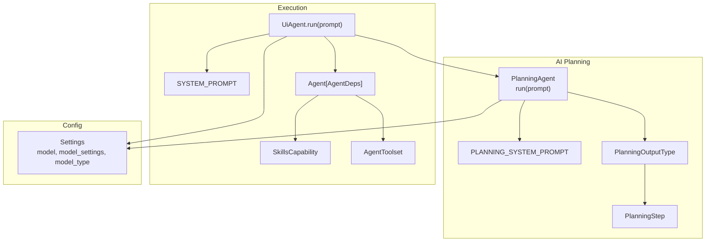
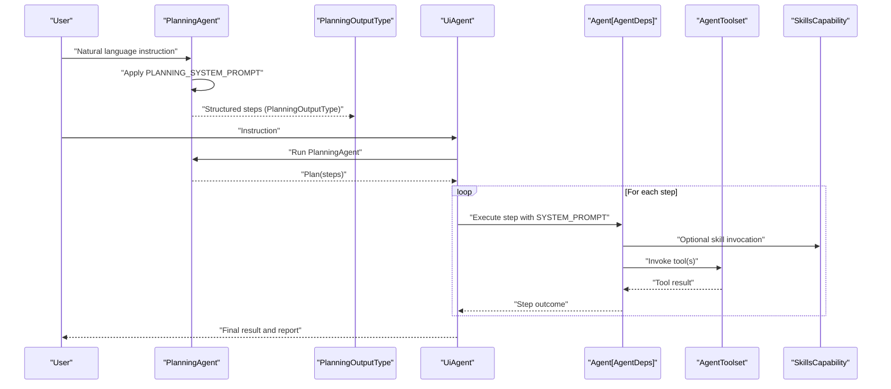
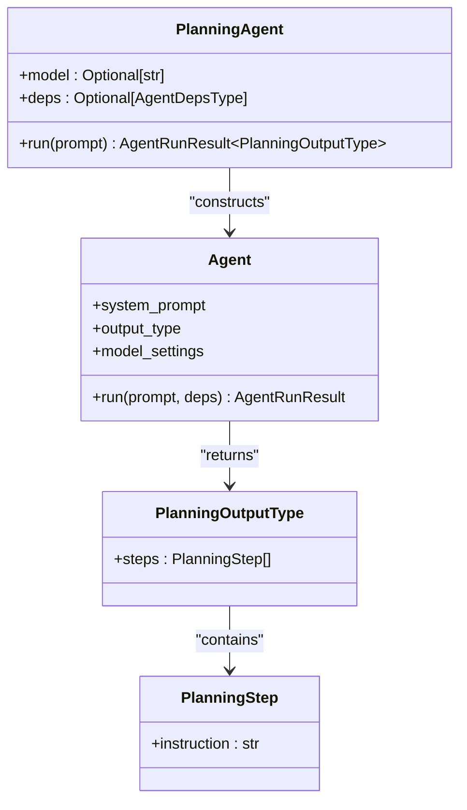
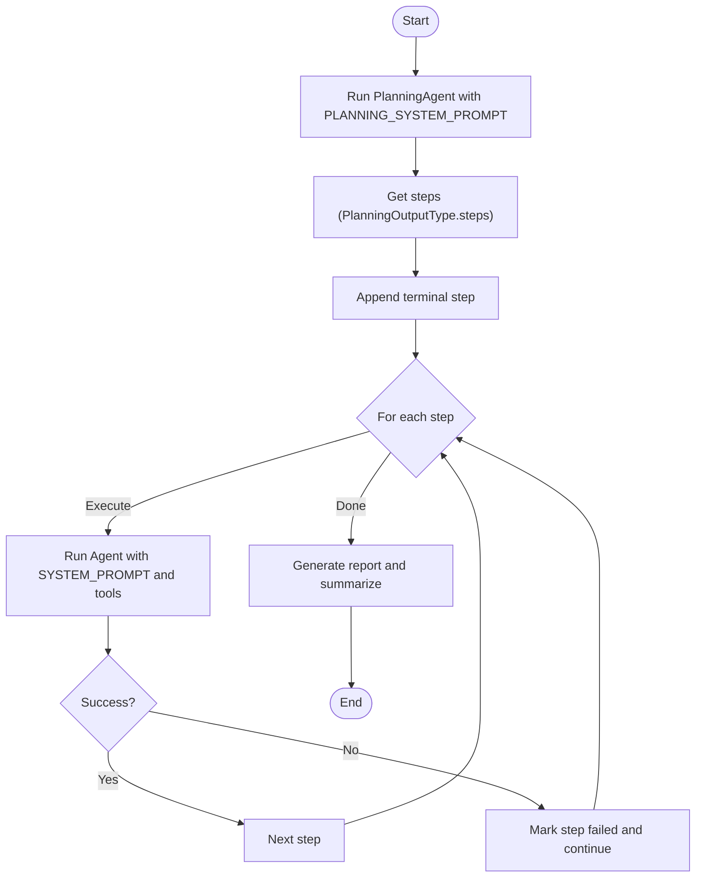
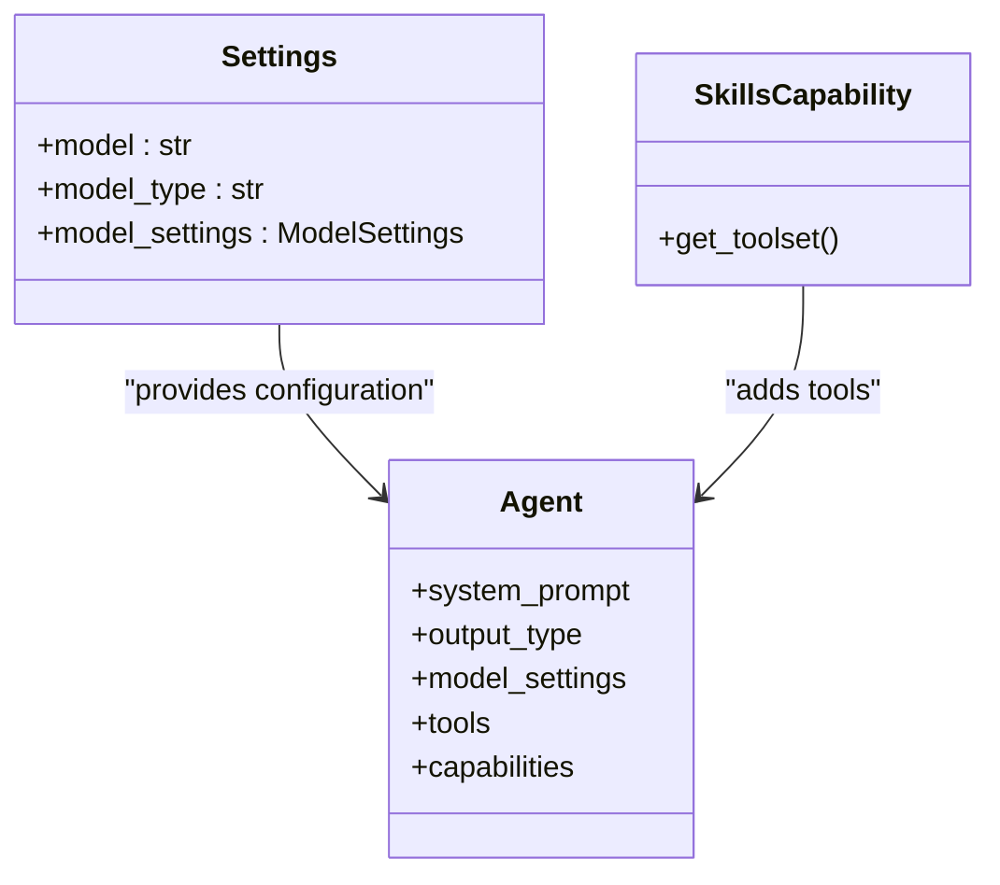
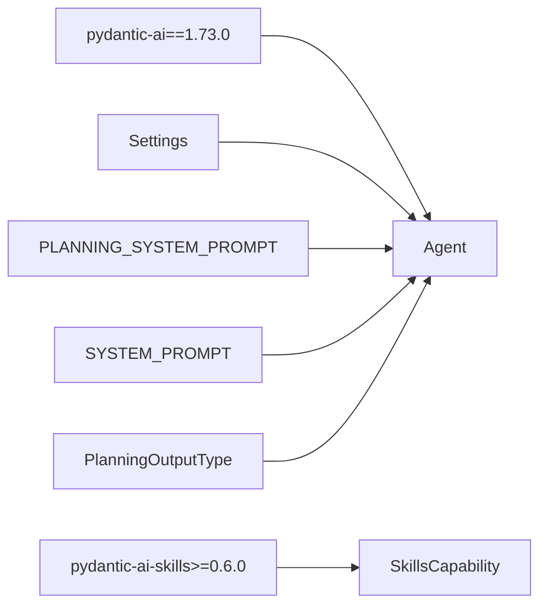

# AI Integration and Planning

<cite>
**Referenced Files in This Document**
- [agent.py](file://src/page_eyes/agent.py)
- [prompt.py](file://src/page_eyes/prompt.py)
- [config.py](file://src/page_eyes/config.py)
- [deps.py](file://src/page_eyes/deps.py)
- [test_planning_agent.py](file://tests/test_planning_agent.py)
- [conftest.py](file://tests/conftest.py)
- [pyproject.toml](file://pyproject.toml)
</cite>

## Table of Contents
1. [Introduction](#introduction)
2. [Project Structure](#project-structure)
3. [Core Components](#core-components)
4. [Architecture Overview](#architecture-overview)
5. [Detailed Component Analysis](#detailed-component-analysis)
6. [Dependency Analysis](#dependency-analysis)
7. [Performance Considerations](#performance-considerations)
8. [Troubleshooting Guide](#troubleshooting-guide)
9. [Conclusion](#conclusion)
10. [Appendices](#appendices)

## Introduction
This document explains the AI integration and planning pipeline in PageEyes Agent, focusing on the PlanningAgent and natural language processing capabilities. It covers how natural language instructions are transformed into executable task plans, the role of the PlanningAgent class, the PLANNING_SYSTEM_PROMPT and SYSTEM_PROMPT configurations, and how Pydantic AI is used to orchestrate planning and execution. It also documents the PlanningOutputType structure, the PlanningStep decomposition process, prompt engineering strategies, model configuration options, error handling, and performance optimization techniques. Examples of instruction types and their corresponding planning outputs are included to help beginners understand the system while providing sufficient technical depth for AI model customization and prompt optimization.

## Project Structure
The AI planning and execution pipeline spans several modules:
- PlanningAgent orchestrates the initial planning phase using a dedicated system prompt and output schema.
- Prompt templates define the roles, goals, constraints, and workflows for planning and execution.
- Configuration defines model selection, model settings, and runtime options.
- Deps encapsulates the planning output schema, step representation, and related data structures.
- Tests demonstrate real-world instruction-to-plan transformations and validate the planning behavior.

**Diagram sources**
- [agent.py:74-90](file://src/page_eyes/agent.py#L74-L90)
- [prompt.py:8-28](file://src/page_eyes/prompt.py#L8-L28)
- [prompt.py:30-103](file://src/page_eyes/prompt.py#L30-L103)
- [config.py:54-72](file://src/page_eyes/config.py#L54-L72)
- [deps.py:264-279](file://src/page_eyes/deps.py#L264-L279)

**Section sources**
- [agent.py:74-90](file://src/page_eyes/agent.py#L74-L90)
- [prompt.py:8-28](file://src/page_eyes/prompt.py#L8-L28)
- [prompt.py:30-103](file://src/page_eyes/prompt.py#L30-L103)
- [config.py:54-72](file://src/page_eyes/config.py#L54-L72)
- [deps.py:264-279](file://src/page_eyes/deps.py#L264-L279)

## Core Components
- PlanningAgent: A lightweight planner that uses a dedicated system prompt and output schema to convert natural language instructions into a sequence of atomic steps.
- PLANNING_SYSTEM_PROMPT: Defines the role of a “high-precision UI operation planner,” constraints for step decomposition, and examples of how to split complex instructions.
- SYSTEM_PROMPT: Guides the execution agent to interpret instructions, locate elements, and execute actions reliably, with explicit rules and constraints.
- PlanningOutputType: The structured output schema containing a list of PlanningStep entries.
- PlanningStep: A single atomic instruction derived from the original user instruction.
- Settings and model configuration: Controls model selection, model type (LLM vs VLM), and model settings such as max tokens and temperature.

**Section sources**
- [agent.py:74-90](file://src/page_eyes/agent.py#L74-L90)
- [prompt.py:8-28](file://src/page_eyes/prompt.py#L8-L28)
- [prompt.py:30-103](file://src/page_eyes/prompt.py#L30-L103)
- [deps.py:264-279](file://src/page_eyes/deps.py#L264-L279)
- [config.py:54-72](file://src/page_eyes/config.py#L54-L72)

## Architecture Overview
The system separates planning and execution into two distinct phases:
- Planning Phase: The PlanningAgent runs with PLANNING_SYSTEM_PROMPT and returns a structured plan (PlanningOutputType) composed of PlanningStep items.
- Execution Phase: The UiAgent orchestrates the execution of each step using an Agent configured with SYSTEM_PROMPT, tools, and skills. Steps are executed sequentially, with error handling and reporting.

**Diagram sources**
- [agent.py:74-90](file://src/page_eyes/agent.py#L74-L90)
- [agent.py:225-313](file://src/page_eyes/agent.py#L225-L313)
- [prompt.py:8-28](file://src/page_eyes/prompt.py#L8-L28)
- [prompt.py:30-103](file://src/page_eyes/prompt.py#L30-L103)

## Detailed Component Analysis

### PlanningAgent
The PlanningAgent encapsulates the planning logic:
- It constructs an Agent with the model, PLANNING_SYSTEM_PROMPT, PlanningOutputType as the output schema, and model settings.
- It runs the agent with the user’s prompt and returns an AgentRunResult containing the structured plan.

Key behaviors:
- Uses PLANNING_SYSTEM_PROMPT to enforce strict decomposition rules.
- Returns an AgentRunResult with usage statistics for cost and token tracking.
- Integrates seamlessly with the broader UiAgent execution pipeline.

**Diagram sources**
- [agent.py:74-90](file://src/page_eyes/agent.py#L74-L90)
- [deps.py:264-279](file://src/page_eyes/deps.py#L264-L279)

**Section sources**
- [agent.py:74-90](file://src/page_eyes/agent.py#L74-L90)

### Prompt Engineering: PLANNING_SYSTEM_PROMPT and SYSTEM_PROMPT
- PLANNING_SYSTEM_PROMPT:
  - Role: High-precision UI operation planner.
  - Goal: Decompose complex instructions into atomic steps that are directly linked to the user’s intent.
  - Constraints: Steps must be ordered, atomic, and preserve all original instruction information.
  - Examples: Demonstrates decomposition patterns for clicks, swipes, app opens, and file uploads.
- SYSTEM_PROMPT:
  - Role: High-precision UI operation executor.
  - Workflow: Get screen info when needed, locate elements, call tools with correct parameters, and handle exceptions.
  - Rules: Certain actions (open URL/app, wait, scroll) can be executed without screen info; others require element discovery first.
  - Element location: Exact text match preferred; otherwise fuzzy matching and spatial relations.
  - Exception handling: Retry on element not found, consider pop-up interference, mark failure immediately on tool errors.
  - Execution constraints: Intent fidelity, state dependency, sequential execution, uniqueness of elements.

A variant SYSTEM_PROMPT_VLM is available for vision-language models, adjusting element parameters to coordinates and adding a coordinate system.

**Section sources**
- [prompt.py:8-28](file://src/page_eyes/prompt.py#L8-L28)
- [prompt.py:30-103](file://src/page_eyes/prompt.py#L30-L103)
- [prompt.py:105-163](file://src/page_eyes/prompt.py#L105-L163)
- [prompt.py:165](file://src/page_eyes/prompt.py#L165)

### Natural Language to Task Plan Transformation
The transformation process:
- The PlanningAgent applies PLANNING_SYSTEM_PROMPT to decompose the user’s instruction into a sequence of PlanningStep entries.
- Each PlanningStep is an atomic instruction that can be executed independently.
- The UiAgent appends a terminal step (“结束任务”) to finalize execution.

Examples validated by tests:
- Opening a URL and clicking a button.
- Opening an app, closing a popup if present, scrolling until a keyword appears, clicking search, waiting, inputting text, and scrolling again.
- Repeatedly scrolling until a specific element appears.
- Opening a URL and inputting text into a field.

These examples illustrate how complex instructions are broken down into atomic steps suitable for execution.

**Section sources**
- [test_planning_agent.py:12-28](file://tests/test_planning_agent.py#L12-L28)
- [test_planning_agent.py:30-49](file://tests/test_planning_agent.py#L30-L49)
- [test_planning_agent.py:52-61](file://tests/test_planning_agent.py#L52-L61)
- [test_planning_agent.py:64-73](file://tests/test_planning_agent.py#L64-L73)
- [test_planning_agent.py:76-86](file://tests/test_planning_agent.py#L76-L86)
- [agent.py:234-239](file://src/page_eyes/agent.py#L234-L239)

### Execution Pipeline and Step Decomposition
The UiAgent integrates planning and execution:
- It creates a PlanningAgent and runs it with the user’s prompt to obtain steps.
- It iterates through each step, logs progress, executes the step via the Agent, and updates step outcomes.
- It handles failures by marking steps failed and stopping further execution if needed.
- It generates a report summarizing success, device size, and step details.

**Diagram sources**
- [agent.py:225-313](file://src/page_eyes/agent.py#L225-L313)
- [prompt.py:30-103](file://src/page_eyes/prompt.py#L30-L103)

**Section sources**
- [agent.py:225-313](file://src/page_eyes/agent.py#L225-L313)

### Pydantic AI Integration and Model Configuration
- Agent construction:
  - PlanningAgent uses Agent with PLANNING_SYSTEM_PROMPT and PlanningOutputType.
  - UiAgent builds an Agent with SYSTEM_PROMPT, tools, and skills capability.
- Model settings:
  - Settings controls model name, model type (LLM/VLM), and model_settings (e.g., max_tokens, temperature).
  - The system selects SYSTEM_PROMPT_VLM when model_type is set to vlm.
- Dependencies:
  - pydantic-ai and pydantic-ai-skills are used for agent orchestration and skills.

**Diagram sources**
- [config.py:54-72](file://src/page_eyes/config.py#L54-L72)
- [agent.py:147-169](file://src/page_eyes/agent.py#L147-L169)
- [pyproject.toml:29-30](file://pyproject.toml#L29-L30)

**Section sources**
- [config.py:54-72](file://src/page_eyes/config.py#L54-L72)
- [agent.py:147-169](file://src/page_eyes/agent.py#L147-L169)
- [pyproject.toml:29-30](file://pyproject.toml#L29-L30)

### PlanningOutputType and PlanningStep
- PlanningOutputType: Contains a list of PlanningStep entries representing the planned sequence of actions.
- PlanningStep: Encapsulates a single atomic instruction string that describes what to do.

This structure ensures predictable serialization and easy iteration during execution.

**Section sources**
- [deps.py:264-279](file://src/page_eyes/deps.py#L264-L279)

### Example Instruction Types and Outputs
The tests demonstrate typical instruction categories and their decomposition:
- Multi-step sequences (open URL, click button).
- Conditional operations (close popup if present).
- Iterative actions (scroll until keyword appears).
- Mixed actions (open app, wait, input text, scroll).

These examples show how complex instructions are split into atomic steps for reliable execution.

**Section sources**
- [test_planning_agent.py:12-28](file://tests/test_planning_agent.py#L12-L28)
- [test_planning_agent.py:30-49](file://tests/test_planning_agent.py#L30-L49)
- [test_planning_agent.py:52-61](file://tests/test_planning_agent.py#L52-L61)
- [test_planning_agent.py:64-73](file://tests/test_planning_agent.py#L64-L73)
- [test_planning_agent.py:76-86](file://tests/test_planning_agent.py#L76-L86)

## Dependency Analysis
The AI integration relies on:
- pydantic-ai for agent orchestration, structured outputs, and usage tracking.
- pydantic-ai-skills for skills-based tooling and capabilities.
- Settings for model configuration and runtime options.
- Prompt templates for role definition and constraint enforcement.

**Diagram sources**
- [pyproject.toml:29-30](file://pyproject.toml#L29-L30)
- [agent.py:147-169](file://src/page_eyes/agent.py#L147-L169)
- [prompt.py:8-28](file://src/page_eyes/prompt.py#L8-L28)
- [prompt.py:30-103](file://src/page_eyes/prompt.py#L30-L103)
- [deps.py:264-279](file://src/page_eyes/deps.py#L264-L279)

**Section sources**
- [pyproject.toml:29-30](file://pyproject.toml#L29-L30)
- [agent.py:147-169](file://src/page_eyes/agent.py#L147-L169)
- [prompt.py:8-28](file://src/page_eyes/prompt.py#L8-L28)
- [prompt.py:30-103](file://src/page_eyes/prompt.py#L30-L103)
- [deps.py:264-279](file://src/page_eyes/deps.py#L264-L279)

## Performance Considerations
- Token and cost control:
  - Adjust model_settings.max_tokens and temperature to balance accuracy and cost.
  - Monitor usage via AgentRunResult to track token consumption.
- Sequential execution:
  - Steps are executed one at a time to reduce concurrency overhead and simplify debugging.
- Retry strategy:
  - UiAgent sets retries for robustness against transient model errors.
- Model type selection:
  - Choose LLM vs VLM based on whether visual cues are needed; VLM prompts adjust element parameters to coordinates.

[No sources needed since this section provides general guidance]

## Troubleshooting Guide
Common issues and resolutions:
- Unexpected model behavior during execution:
  - The UiAgent catches UnexpectedModelBehavior and marks the step failed, logging the reason.
- Element not found:
  - The system retries after waiting and re-fetching screen info; consider pop-up interference and load relevant skills.
- Tool execution failure:
  - Immediate failure triggers mark_failed to halt the task and record the reason.
- Planning errors:
  - Validate PLANNING_SYSTEM_PROMPT examples and ensure instructions are clear and actionable.

**Section sources**
- [agent.py:264-271](file://src/page_eyes/agent.py#L264-L271)
- [prompt.py:85-88](file://src/page_eyes/prompt.py#L85-L88)

## Conclusion
PageEyes Agent’s AI integration cleanly separates planning and execution. The PlanningAgent transforms natural language into a structured, atomic plan using PLANNING_SYSTEM_PROMPT and PlanningOutputType. The UiAgent then executes each step with SYSTEM_PROMPT, tools, and skills, enforcing strict constraints and robust error handling. With configurable model settings and prompt engineering strategies, the system balances accuracy, reliability, and performance across platforms.

[No sources needed since this section summarizes without analyzing specific files]

## Appendices

### Appendix A: Prompt Engineering Strategies
- Planning:
  - Define clear roles and constraints.
  - Provide concrete examples of decomposition patterns.
  - Enforce ordering and atomicity.
- Execution:
  - Specify element discovery rules and spatial relations.
  - Define retry logic and exception handling.
  - Enforce sequential execution and intent fidelity.

**Section sources**
- [prompt.py:8-28](file://src/page_eyes/prompt.py#L8-L28)
- [prompt.py:30-103](file://src/page_eyes/prompt.py#L30-L103)
- [prompt.py:105-163](file://src/page_eyes/prompt.py#L105-L163)

### Appendix B: Testing Setup and Examples
- The test suite demonstrates how PlanningAgent processes various instruction types and produces structured steps.
- conftest.py initializes agents and fixtures for different platforms.

**Section sources**
- [test_planning_agent.py:12-86](file://tests/test_planning_agent.py#L12-L86)
- [conftest.py:38-40](file://tests/conftest.py#L38-L40)