# Agent Architecture

<cite>
**Referenced Files in This Document**
- [agent.py](file://src/page_eyes/agent.py)
- [deps.py](file://src/page_eyes/deps.py)
- [device.py](file://src/page_eyes/device.py)
- [_base.py](file://src/page_eyes/tools/_base.py)
- [web.py](file://src/page_eyes/tools/web.py)
- [android.py](file://src/page_eyes/tools/android.py)
- [_mobile.py](file://src/page_eyes/tools/_mobile.py)
- [electron.py](file://src/page_eyes/tools/electron.py)
- [config.py](file://src/page_eyes/config.py)
- [prompt.py](file://src/page_eyes/prompt.py)
- [platform.py](file://src/page_eyes/util/platform.py)
- [__init__.py](file://src/page_eyes/__init__.py)
</cite>

## Table of Contents
1. [Introduction](#introduction)
2. [Project Structure](#project-structure)
3. [Core Components](#core-components)
4. [Architecture Overview](#architecture-overview)
5. [Detailed Component Analysis](#detailed-component-analysis)
6. [Dependency Analysis](#dependency-analysis)
7. [Performance Considerations](#performance-considerations)
8. [Troubleshooting Guide](#troubleshooting-guide)
9. [Conclusion](#conclusion)
10. [Appendices](#appendices)

## Introduction
This document explains the PageEyes Agent architecture with a focus on the UiAgent base class design and its inheritance hierarchy. It covers how UiAgent orchestrates PlanningAgent and Tool execution, how the Factory Pattern creates agents across platforms, and how the Template Method pattern structures the execution flow. It also documents the AgentDeps dependency injection system that binds Device and Tool implementations with shared context, and outlines the agent lifecycle from creation through execution to reporting. Design patterns such as Strategy Pattern for device implementations and Factory/Template Method for orchestration are highlighted, along with extensibility guidance for framework customization.

## Project Structure
The PageEyes Agent is organized around a core orchestration layer (UiAgent and PlanningAgent), a dependency injection layer (AgentDeps), platform-specific devices and tools, and configuration/prompt utilities. The structure enables cross-platform automation with a unified interface.

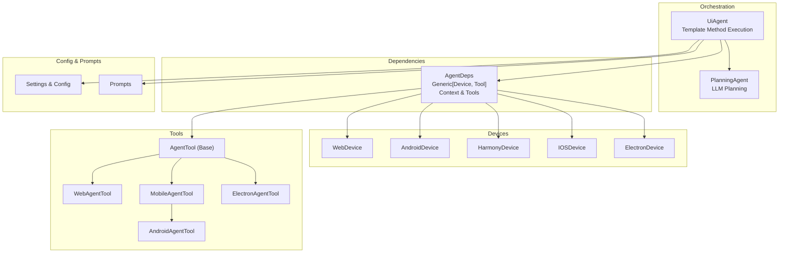

**Diagram sources**
- [agent.py:97-314](file://src/page_eyes/agent.py#L97-L314)
- [agent.py:316-515](file://src/page_eyes/agent.py#L316-L515)
- [deps.py:76-101](file://src/page_eyes/deps.py#L76-L101)
- [device.py:54-293](file://src/page_eyes/device.py#L54-L293)
- [_base.py:130-391](file://src/page_eyes/tools/_base.py#L130-L391)
- [web.py:24-179](file://src/page_eyes/tools/web.py#L24-L179)
- [android.py:18-23](file://src/page_eyes/tools/android.py#L18-L23)
- [_mobile.py:27-165](file://src/page_eyes/tools/_mobile.py#L27-L165)
- [electron.py:21-134](file://src/page_eyes/tools/electron.py#L21-L134)
- [config.py:54-73](file://src/page_eyes/config.py#L54-L73)
- [prompt.py:8-166](file://src/page_eyes/prompt.py#L8-L166)

**Section sources**
- [agent.py:97-314](file://src/page_eyes/agent.py#L97-L314)
- [agent.py:316-515](file://src/page_eyes/agent.py#L316-L515)
- [deps.py:76-101](file://src/page_eyes/deps.py#L76-L101)
- [device.py:54-293](file://src/page_eyes/device.py#L54-L293)
- [_base.py:130-391](file://src/page_eyes/tools/_base.py#L130-L391)
- [web.py:24-179](file://src/page_eyes/tools/web.py#L24-L179)
- [android.py:18-23](file://src/page_eyes/tools/android.py#L18-L23)
- [_mobile.py:27-165](file://src/page_eyes/tools/_mobile.py#L27-L165)
- [electron.py:21-134](file://src/page_eyes/tools/electron.py#L21-L134)
- [config.py:54-73](file://src/page_eyes/config.py#L54-L73)
- [prompt.py:8-166](file://src/page_eyes/prompt.py#L8-L166)

## Core Components
- UiAgent: Central orchestrator that runs PlanningAgent, executes steps, manages Tool calls, and generates reports. Implements a Template Method for execution flow and uses a Factory Pattern for platform-specific agent creation.
- PlanningAgent: Uses an LLM to decompose user prompts into atomic steps.
- AgentDeps: Generic dependency container holding Settings, Device, Tool, and AgentContext. Provides shared state and tool access during execution.
- AgentTool and platform-specific tools: Define the Tool abstraction and platform-specific implementations (Web, Android/Harmony, iOS, Electron).
- Devices: Platform abstractions for Web, Android, Harmony, iOS, and Electron, each with a factory create method.
- Configuration and prompts: Settings and system prompts for planning and execution.

**Section sources**
- [agent.py:97-314](file://src/page_eyes/agent.py#L97-L314)
- [agent.py:316-515](file://src/page_eyes/agent.py#L316-L515)
- [deps.py:76-101](file://src/page_eyes/deps.py#L76-L101)
- [_base.py:130-391](file://src/page_eyes/tools/_base.py#L130-L391)
- [device.py:54-293](file://src/page_eyes/device.py#L54-L293)
- [config.py:54-73](file://src/page_eyes/config.py#L54-L73)
- [prompt.py:8-166](file://src/page_eyes/prompt.py#L8-L166)

## Architecture Overview
The architecture follows a layered design:
- Orchestration Layer: UiAgent and PlanningAgent coordinate planning and execution.
- Dependency Injection Layer: AgentDeps injects Device, Tool, and shared context into the Agent runtime.
- Platform Abstraction Layer: Device classes encapsulate platform-specific clients and APIs.
- Tool Abstraction Layer: AgentTool defines the tool contract; platform-specific tools implement actions.
- Configuration and Prompt Layer: Settings and system prompts guide planning and execution.

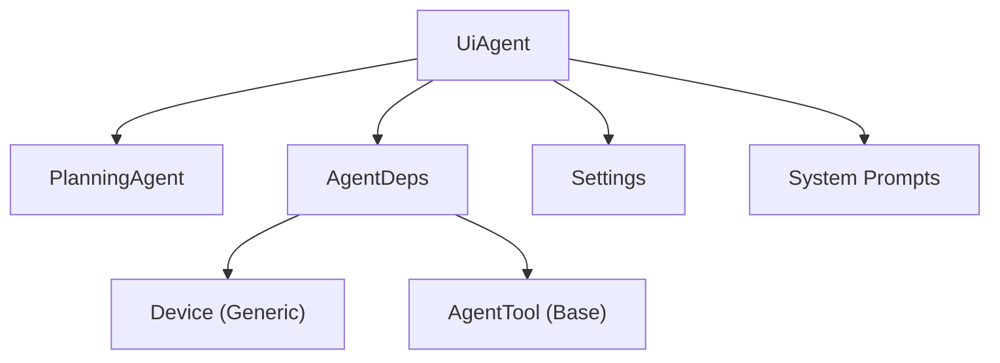

**Diagram sources**
- [agent.py:97-314](file://src/page_eyes/agent.py#L97-L314)
- [deps.py:76-101](file://src/page_eyes/deps.py#L76-L101)
- [device.py:43-51](file://src/page_eyes/device.py#L43-L51)
- [_base.py:130-391](file://src/page_eyes/tools/_base.py#L130-L391)
- [config.py:54-73](file://src/page_eyes/config.py#L54-L73)
- [prompt.py:8-166](file://src/page_eyes/prompt.py#L8-L166)

## Detailed Component Analysis

### UiAgent: Orchestrator and Template Method
UiAgent is the central orchestrator that:
- Merges settings from environment and overrides.
- Builds an Agent with tools and skills.
- Runs PlanningAgent to decompose the user prompt into steps.
- Iterates through steps, invoking Tool calls and updating context.
- Generates a structured HTML report and returns execution results.

Key design patterns:
- Factory Pattern: Each subclass (WebAgent, AndroidAgent, HarmonyAgent, IOSAgent, ElectronAgent) provides a static create method to construct platform-specific instances.
- Template Method: The run method defines the canonical execution flow, while subclasses customize device/tool creation and agent building.

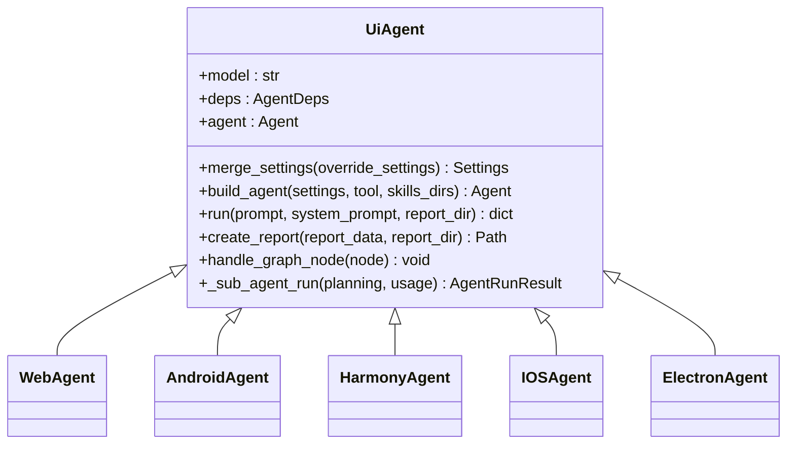

**Diagram sources**
- [agent.py:97-314](file://src/page_eyes/agent.py#L97-L314)
- [agent.py:316-515](file://src/page_eyes/agent.py#L316-L515)

**Section sources**
- [agent.py:97-314](file://src/page_eyes/agent.py#L97-L314)
- [agent.py:316-515](file://src/page_eyes/agent.py#L316-L515)

### PlanningAgent: LLM-Based Step Planning
PlanningAgent uses an LLM to decompose user prompts into a sequence of atomic steps. It constructs an Agent with a planning system prompt and returns a typed output containing steps.

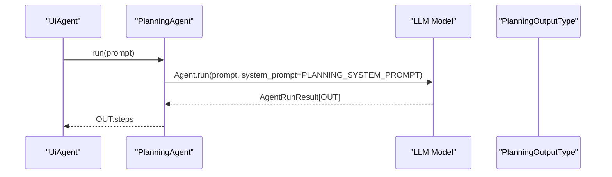

**Diagram sources**
- [agent.py:74-90](file://src/page_eyes/agent.py#L74-L90)
- [prompt.py:8-28](file://src/page_eyes/prompt.py#L8-L28)

**Section sources**
- [agent.py:74-90](file://src/page_eyes/agent.py#L74-L90)
- [prompt.py:8-28](file://src/page_eyes/prompt.py#L8-L28)

### AgentDeps: Dependency Injection and Shared Context
AgentDeps is a generic container that holds:
- settings: Global configuration.
- device: Platform-specific device abstraction.
- tool: Tool implementation bound to the device.
- context: AgentContext storing step-level state and screen info.
- app_name_map: Optional friendly-to-ID mapping for apps.

It enables Strategy-like selection of Device and Tool implementations and provides a unified interface for tools to access device state and context.

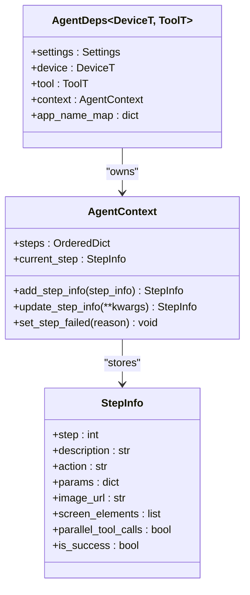

**Diagram sources**
- [deps.py:76-101](file://src/page_eyes/deps.py#L76-L101)
- [deps.py:49-73](file://src/page_eyes/deps.py#L49-L73)
- [deps.py:35-46](file://src/page_eyes/deps.py#L35-L46)

**Section sources**
- [deps.py:76-101](file://src/page_eyes/deps.py#L76-L101)
- [deps.py:49-73](file://src/page_eyes/deps.py#L49-L73)
- [deps.py:35-46](file://src/page_eyes/deps.py#L35-L46)

### Device Abstractions: Strategy Pattern for Platforms
Devices encapsulate platform-specific clients and APIs. Each device class provides a factory create method and exposes device_size and target handles. This enables Strategy-like selection of device implementations at runtime.

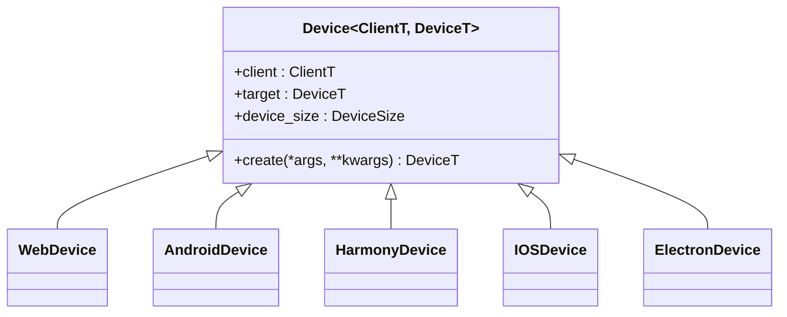

**Diagram sources**
- [device.py:43-51](file://src/page_eyes/device.py#L43-L51)
- [device.py:54-293](file://src/page_eyes/device.py#L54-L293)

**Section sources**
- [device.py:43-51](file://src/page_eyes/device.py#L43-L51)
- [device.py:54-293](file://src/page_eyes/device.py#L54-L293)

### Tool Abstraction: AgentTool and Platform-Specific Implementations
AgentTool defines the tool contract and common utilities (e.g., screen parsing, assertions, delays). Platform-specific tools implement actions:
- WebAgentTool: Web-specific actions using Playwright.
- MobileAgentTool: Shared mobile actions using adb/hdc/wda.
- AndroidAgentTool: Android-specific URL opening via adb shell.
- ElectronAgentTool: Electron-specific actions extending WebAgentTool.

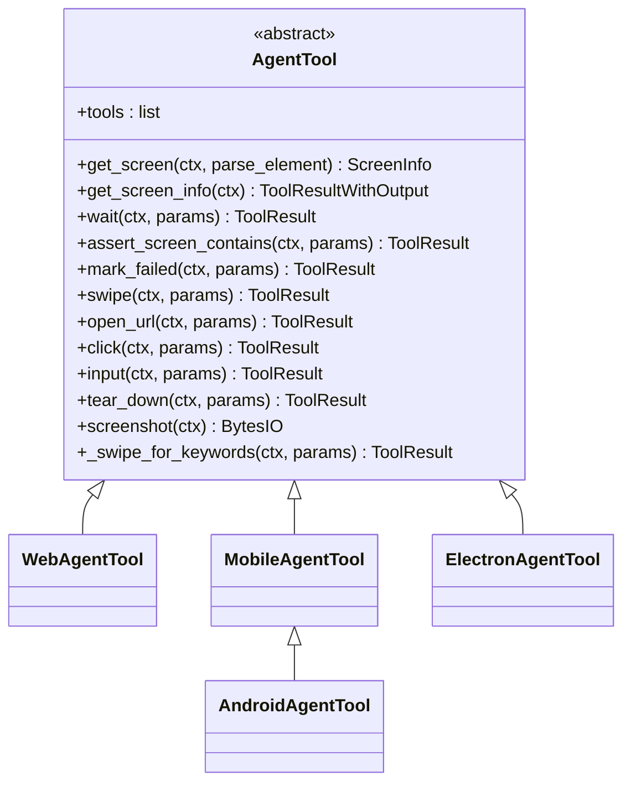

**Diagram sources**
- [_base.py:130-391](file://src/page_eyes/tools/_base.py#L130-L391)
- [web.py:24-179](file://src/page_eyes/tools/web.py#L24-L179)
- [_mobile.py:27-165](file://src/page_eyes/tools/_mobile.py#L27-L165)
- [android.py:18-23](file://src/page_eyes/tools/android.py#L18-L23)
- [electron.py:21-134](file://src/page_eyes/tools/electron.py#L21-L134)

**Section sources**
- [_base.py:130-391](file://src/page_eyes/tools/_base.py#L130-L391)
- [web.py:24-179](file://src/page_eyes/tools/web.py#L24-L179)
- [_mobile.py:27-165](file://src/page_eyes/tools/_mobile.py#L27-L165)
- [android.py:18-23](file://src/page_eyes/tools/android.py#L18-L23)
- [electron.py:21-134](file://src/page_eyes/tools/electron.py#L21-L134)

### Execution Flow: Template Method in UiAgent.run
UiAgent.run implements a canonical Template Method:
- Plan steps via PlanningAgent.
- Iterate steps, invoking Tool calls and updating context.
- Handle failures and generate a report.

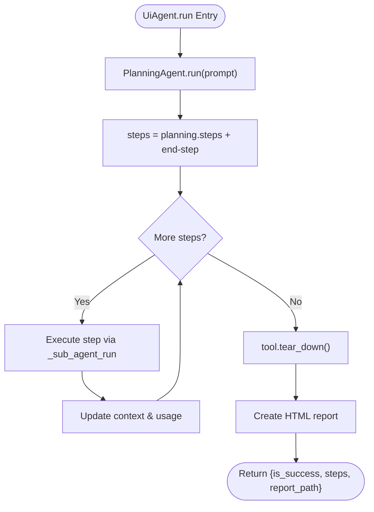

**Diagram sources**
- [agent.py:225-314](file://src/page_eyes/agent.py#L225-L314)

**Section sources**
- [agent.py:225-314](file://src/page_eyes/agent.py#L225-L314)

### Factory Pattern: Platform-Specific Agent Creation
Each UiAgent subclass provides a static create method that:
- Merges settings.
- Creates a platform-specific Device.
- Constructs a Tool for that platform.
- Builds an Agent with skills and tools.
- Returns a configured UiAgent instance.

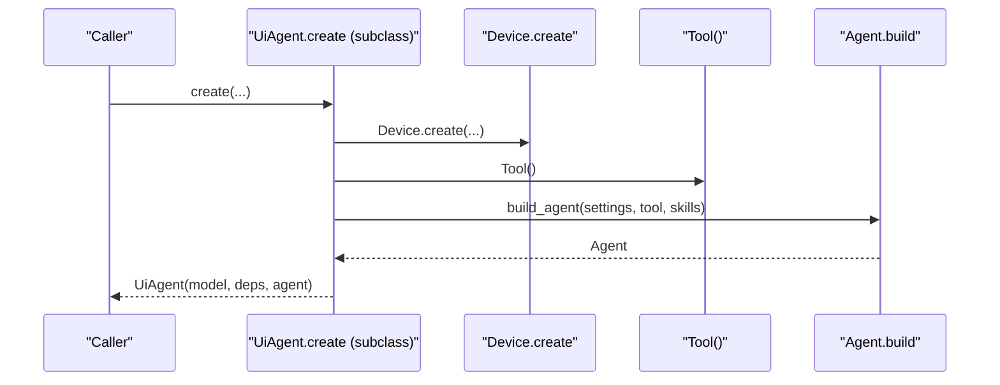

**Diagram sources**
- [agent.py:316-515](file://src/page_eyes/agent.py#L316-L515)

**Section sources**
- [agent.py:316-515](file://src/page_eyes/agent.py#L316-L515)

### Agent Lifecycle: From Creation to Reporting
- Creation: UiAgent.create(...) constructs Device, Tool, AgentDeps, and Agent.
- Execution: UiAgent.run(...) plans steps, executes Tool calls, updates context, and handles failures.
- Reporting: UiAgent.create_report(...) generates an HTML report and returns metadata.

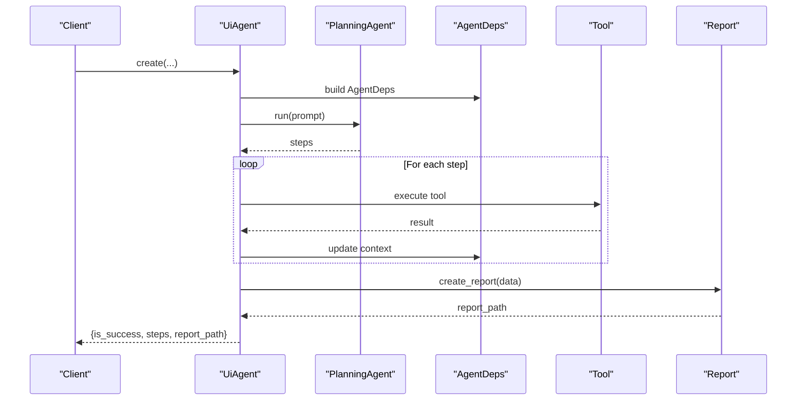

**Diagram sources**
- [agent.py:97-314](file://src/page_eyes/agent.py#L97-L314)
- [agent.py:316-515](file://src/page_eyes/agent.py#L316-L515)

**Section sources**
- [agent.py:97-314](file://src/page_eyes/agent.py#L97-L314)
- [agent.py:316-515](file://src/page_eyes/agent.py#L316-L515)

## Dependency Analysis
The following diagram shows key dependencies among components:

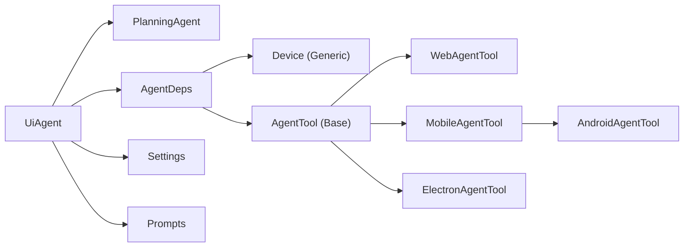

**Diagram sources**
- [agent.py:97-314](file://src/page_eyes/agent.py#L97-L314)
- [agent.py:316-515](file://src/page_eyes/agent.py#L316-L515)
- [deps.py:76-101](file://src/page_eyes/deps.py#L76-L101)
- [_base.py:130-391](file://src/page_eyes/tools/_base.py#L130-L391)
- [web.py:24-179](file://src/page_eyes/tools/web.py#L24-L179)
- [_mobile.py:27-165](file://src/page_eyes/tools/_mobile.py#L27-L165)
- [android.py:18-23](file://src/page_eyes/tools/android.py#L18-L23)
- [electron.py:21-134](file://src/page_eyes/tools/electron.py#L21-L134)
- [config.py:54-73](file://src/page_eyes/config.py#L54-L73)
- [prompt.py:8-166](file://src/page_eyes/prompt.py#L8-L166)

**Section sources**
- [agent.py:97-314](file://src/page_eyes/agent.py#L97-L314)
- [agent.py:316-515](file://src/page_eyes/agent.py#L316-L515)
- [deps.py:76-101](file://src/page_eyes/deps.py#L76-L101)
- [_base.py:130-391](file://src/page_eyes/tools/_base.py#L130-L391)
- [web.py:24-179](file://src/page_eyes/tools/web.py#L24-L179)
- [_mobile.py:27-165](file://src/page_eyes/tools/_mobile.py#L27-L165)
- [android.py:18-23](file://src/page_eyes/tools/android.py#L18-L23)
- [electron.py:21-134](file://src/page_eyes/tools/electron.py#L21-L134)
- [config.py:54-73](file://src/page_eyes/config.py#L54-L73)
- [prompt.py:8-166](file://src/page_eyes/prompt.py#L8-L166)

## Performance Considerations
- Tool execution concurrency: The AgentContext tracks parallel_tool_calls to prevent concurrent tool invocations, reducing race conditions and instability.
- Screenshot and parsing: Screenshots are captured and parsed asynchronously; consider caching parsed elements to reduce repeated parsing overhead.
- Delays: Pre/post delays in tools help stabilize UI rendering; tune these based on device responsiveness.
- Retry behavior: Tools and agents use retries for transient failures; configure model settings appropriately to balance robustness and latency.
- Device switching: Electron windows switching incurs overhead; minimize frequent switches.

[No sources needed since this section provides general guidance]

## Troubleshooting Guide
Common issues and remedies:
- Device connection failures:
  - iOS: Ensure WebDriverAgent is reachable and status checks pass; the device layer attempts to start WDA automatically under configured conditions.
  - Android/Harmony: Verify adb/hdc connectivity and device availability.
- Tool execution errors:
  - Tools wrap execution and raise ModelRetry on exceptions; review logs for stack traces and adjust tool parameters.
- Element not found:
  - Use wait and assert tools to stabilize state; consider enabling debug mode to highlight elements.
- Report generation:
  - Ensure report directory is writable; the report path is returned for inspection.

**Section sources**
- [device.py:164-228](file://src/page_eyes/device.py#L164-L228)
- [device.py:324-390](file://src/page_eyes/device.py#L324-L390)
- [_base.py:88-127](file://src/page_eyes/tools/_base.py#L88-L127)
- [agent.py:171-191](file://src/page_eyes/agent.py#L171-L191)

## Conclusion
PageEyes Agent’s architecture centers on UiAgent as a robust orchestrator that separates planning from execution, injects dependencies via AgentDeps, and adapts to multiple platforms through Device and Tool abstractions. The Factory Pattern streamlines agent creation across platforms, while the Template Method ensures a consistent execution flow. The Strategy Pattern for devices and tools, combined with dependency injection, yields a highly extensible framework suitable for customization and extension.

[No sources needed since this section summarizes without analyzing specific files]

## Appendices

### Configuration and Environment
- Settings are loaded from environment variables with precedence rules and merged into default settings.
- Environment variables include model selection, browser/headless options, OmniParser configuration, and storage settings.

**Section sources**
- [__init__.py:8-16](file://src/page_eyes/__init__.py#L8-L16)
- [config.py:54-73](file://src/page_eyes/config.py#L54-L73)

### Platform Utilities
- Platform enumeration and URL schema helpers enable client-side navigation across platforms.

**Section sources**
- [platform.py:14-66](file://src/page_eyes/util/platform.py#L14-L66)