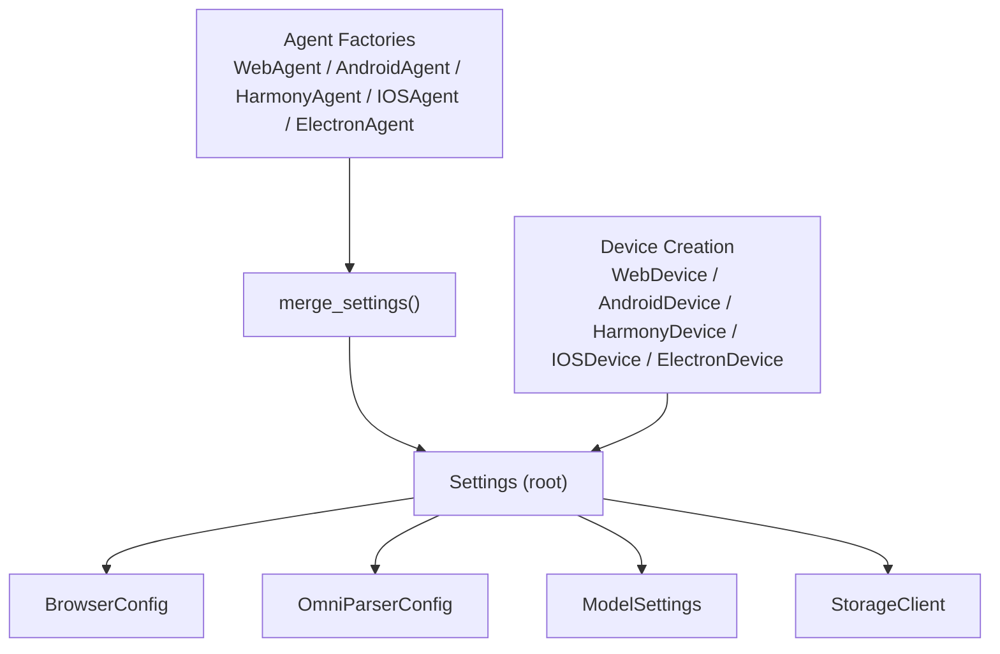
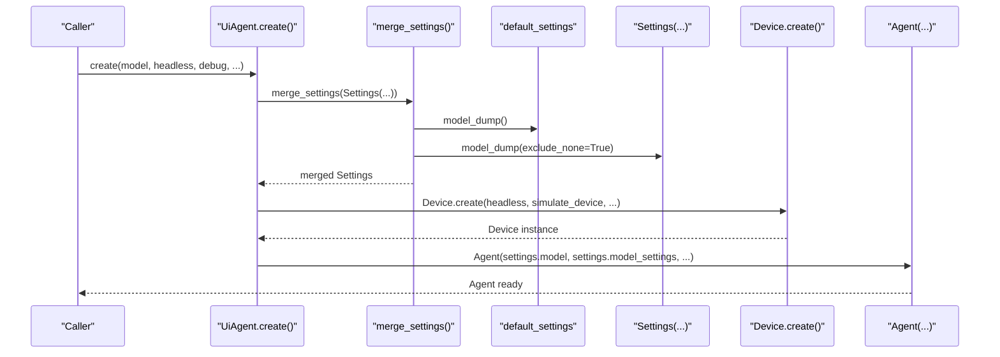
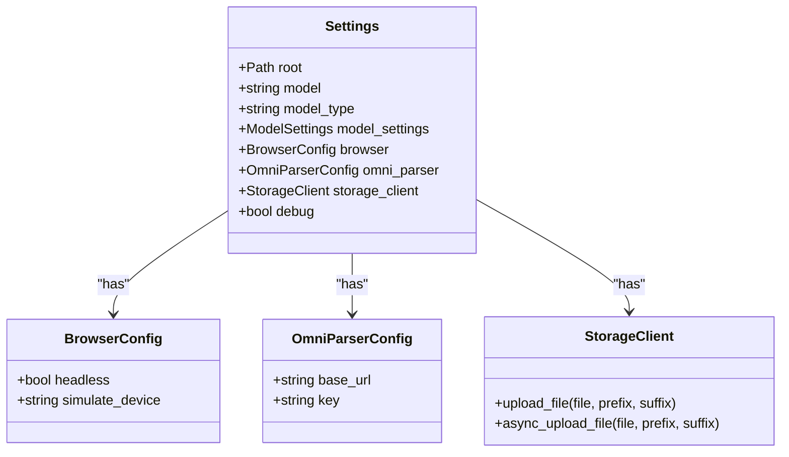
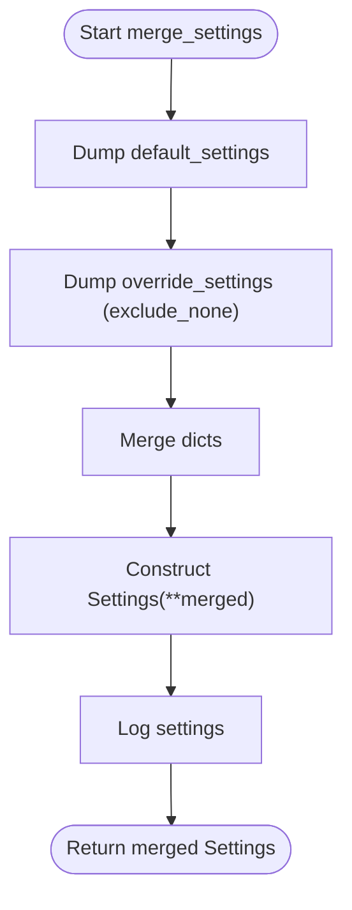
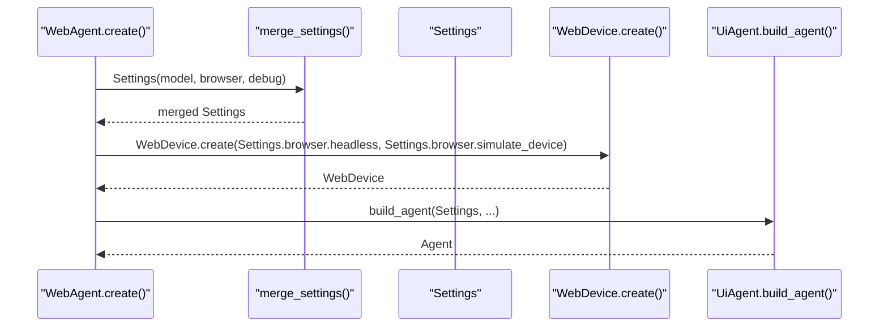
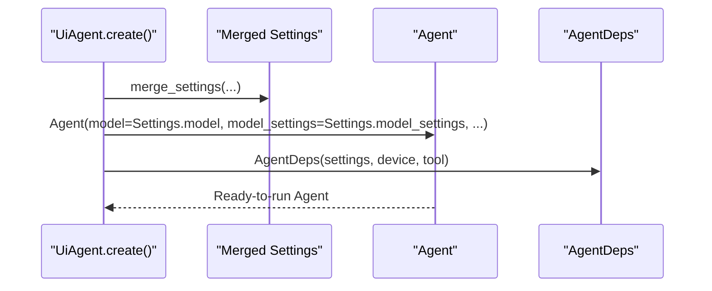
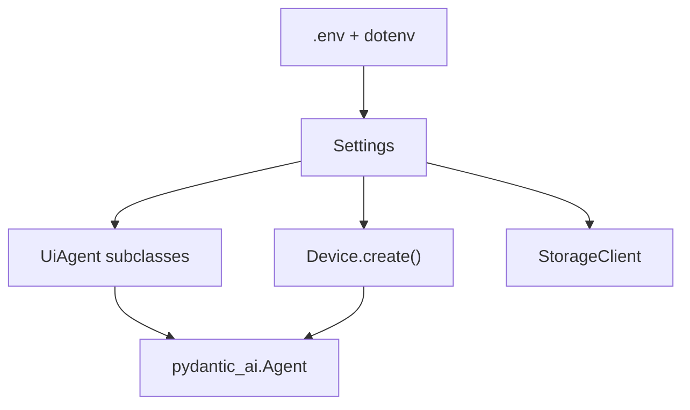

# Configuration Management

<cite>
**Referenced Files in This Document**
- [config.py](file://src/page_eyes/config.py)
- [__init__.py](file://src/page_eyes/__init__.py)
- [agent.py](file://src/page_eyes/agent.py)
- [deps.py](file://src/page_eyes/deps.py)
- [device.py](file://src/page_eyes/device.py)
- [storage.py](file://src/page_eyes/util/storage.py)
- [platform.py](file://src/page_eyes/util/platform.py)
- [conftest.py](file://tests/conftest.py)
- [README.md](file://README.md)
</cite>

## Table of Contents
1. [Introduction](#introduction)
2. [Project Structure](#project-structure)
3. [Core Components](#core-components)
4. [Architecture Overview](#architecture-overview)
5. [Detailed Component Analysis](#detailed-component-analysis)
6. [Dependency Analysis](#dependency-analysis)
7. [Performance Considerations](#performance-considerations)
8. [Troubleshooting Guide](#troubleshooting-guide)
9. [Conclusion](#conclusion)
10. [Appendices](#appendices)

## Introduction
This document explains the PageEyes Agent configuration management system with a focus on the Settings class, environment variable handling, and how configuration affects agent initialization and runtime behavior. It covers:
- The Settings hierarchy from defaults to overrides
- How BrowserConfig, model settings, and debug flags are merged and applied
- Platform-specific configuration nuances
- Practical configuration scenarios, best practices, pitfalls, and troubleshooting tips

## Project Structure
The configuration system centers around a single Settings class that aggregates platform-agnostic and platform-specific concerns. It integrates with agent factories and device creation to apply configuration at runtime.

**Diagram sources**
- [config.py:54-73](file://src/page_eyes/config.py#L54-L73)
- [agent.py:102-112](file://src/page_eyes/agent.py#L102-L112)
- [device.py:54-100](file://src/page_eyes/device.py#L54-L100)

**Section sources**
- [config.py:54-73](file://src/page_eyes/config.py#L54-L73)
- [agent.py:102-112](file://src/page_eyes/agent.py#L102-L112)
- [device.py:54-100](file://src/page_eyes/device.py#L54-L100)

## Core Components
- Settings: Root configuration container holding model settings, browser options, OmniParser service settings, storage backend selection, and debug flag. It loads environment variables via a dedicated prefix and supports nested sub-configurations.
- BrowserConfig: Controls headless mode and device simulation for web automation.
- OmniParserConfig: Defines the OmniParser service endpoint and optional key for VLM-based parsing.
- ModelSettings: Passed to the underlying LLM/VLM engine to tune token limits and sampling temperature.
- StorageClient: Selects a storage strategy (COS, MinIO, or Base64 fallback) based on configuration.
- merge_settings: Hierarchical merging of default Settings with runtime overrides to produce the effective configuration used by agents.

Practical highlights:
- Environment variables are loaded early and influence Settings defaults.
- Agent factories accept per-call overrides that supersede environment-based values.
- Device creation reads browser and platform settings to configure runtime behavior.

**Section sources**
- [config.py:19-73](file://src/page_eyes/config.py#L19-L73)
- [agent.py:102-112](file://src/page_eyes/agent.py#L102-L112)
- [deps.py:162-162](file://src/page_eyes/deps.py#L162-L162)

## Architecture Overview
The configuration pipeline applies a strict precedence order: code overrides > environment variables > .env file > class defaults. Agent factories construct Settings objects by merging defaults with explicit overrides, then pass them to device creation and agent instantiation.

**Diagram sources**
- [agent.py:316-362](file://src/page_eyes/agent.py#L316-L362)
- [agent.py:102-112](file://src/page_eyes/agent.py#L102-L112)
- [config.py:54-73](file://src/page_eyes/config.py#L54-L73)

## Detailed Component Analysis

### Settings Class and Sub-configurations
The Settings class defines the central configuration schema and loads environment variables with a dedicated prefix. It composes:
- BrowserConfig: headless and simulate_device
- OmniParserConfig: base_url and key
- ModelSettings: tuning parameters for the LLM/VLM
- StorageClient: selects storage backend based on COS or MinIO configuration
- debug: toggles verbose logging

Environment loading and precedence:
- Early load of environment variables ensures Settings reflects environment values.
- Prefixes isolate configuration namespaces (e.g., browser_, omni_, agent_, cos_, minio_).

**Diagram sources**
- [config.py:19-73](file://src/page_eyes/config.py#L19-L73)

**Section sources**
- [config.py:19-73](file://src/page_eyes/config.py#L19-L73)
- [__init__.py:8-15](file://src/page_eyes/__init__.py#L8-L15)

### merge_settings Method and Hierarchical Merging
The merge_settings method constructs a new Settings instance by combining:
- default_settings.model_dump()
- override_settings.model_dump(exclude_none=True)

This produces a merged configuration where explicit overrides take precedence over environment-derived defaults.

**Diagram sources**
- [agent.py:102-112](file://src/page_eyes/agent.py#L102-L112)

**Section sources**
- [agent.py:102-112](file://src/page_eyes/agent.py#L102-L112)

### Platform-Specific Configuration Handling
- WebAgent: Reads browser.headless and browser.simulate_device to configure persistent browser context and device emulation.
- Android/Harmony/iOS/Electron agents: Construct devices using platform-specific parameters; browser settings are still respected where applicable (e.g., WebAgent).
- Platform enum: Used across device creation to select client behavior and URL schema generation.

**Diagram sources**
- [agent.py:316-362](file://src/page_eyes/agent.py#L316-L362)
- [device.py:54-100](file://src/page_eyes/device.py#L54-L100)

**Section sources**
- [agent.py:316-362](file://src/page_eyes/agent.py#L316-L362)
- [device.py:54-100](file://src/page_eyes/device.py#L54-L100)
- [platform.py:14-22](file://src/page_eyes/util/platform.py#L14-L22)

### Relationship Between Configuration and Agent Initialization
- Settings.model and Settings.model_settings are passed to Agent constructors.
- default_settings.model_type influences runtime behavior (e.g., coordinate computation).
- debug flag controls logging verbosity during agent runs.

**Diagram sources**
- [agent.py:147-169](file://src/page_eyes/agent.py#L147-L169)
- [deps.py:75-82](file://src/page_eyes/deps.py#L75-L82)

**Section sources**
- [agent.py:147-169](file://src/page_eyes/agent.py#L147-L169)
- [deps.py:75-82](file://src/page_eyes/deps.py#L75-L82)

## Dependency Analysis
Configuration dependencies and coupling:
- Settings depends on environment variables loaded via dotenv and pydantic-settings.
- Agent factories depend on Settings for model selection and model_settings.
- Device creation depends on BrowserConfig for headless and emulate-device behavior.
- StorageClient depends on COS or MinIO configuration to choose a storage strategy.

**Diagram sources**
- [config.py:16-16](file://src/page_eyes/config.py#L16-L16)
- [config.py:54-73](file://src/page_eyes/config.py#L54-L73)
- [agent.py:316-362](file://src/page_eyes/agent.py#L316-L362)
- [device.py:54-100](file://src/page_eyes/device.py#L54-L100)
- [storage.py:161-186](file://src/page_eyes/util/storage.py#L161-L186)

**Section sources**
- [config.py:16-16](file://src/page_eyes/config.py#L16-L16)
- [config.py:54-73](file://src/page_eyes/config.py#L54-L73)
- [agent.py:316-362](file://src/page_eyes/agent.py#L316-L362)
- [device.py:54-100](file://src/page_eyes/device.py#L54-L100)
- [storage.py:161-186](file://src/page_eyes/util/storage.py#L161-L186)

## Performance Considerations
- Model settings: Adjust temperature and max_tokens to balance responsiveness and accuracy. Lower temperature can reduce hallucinations but may increase token usage.
- Browser emulation: Using simulate_device adds overhead; disable if unnecessary for desktop-only testing.
- Storage strategy: COS/MinIO uploads incur network latency; Base64 fallback avoids external dependencies but increases payload sizes.
- Debug logging: Enable only during development; excessive logs can slow down runs.

[No sources needed since this section provides general guidance]

## Troubleshooting Guide
Common configuration pitfalls and remedies:
- Environment variable precedence: Code overrides take precedence over environment variables. If a change does not take effect, verify whether an explicit argument was passed to the factory.
- .env loading: Ensure .env exists in the working directory and environment variables match prefixes (e.g., browser_*, omni_*, agent_*).
- Browser simulation: If emulate-device behavior is unexpected, confirm the device name exists in the Playwright device registry and that headless mode is configured as intended.
- OmniParser connectivity: Verify omni_parser.base_url is reachable and credentials are correct when using VLM mode.
- Storage backend: If uploads fail, check COS/MinIO credentials and endpoint; otherwise, the system falls back to Base64.
- Platform-specific issues: For iOS, ensure WDA URL is correct and accessible; for Electron, verify CDP URL and remote debugging port.

Practical verification steps:
- Print or log the merged Settings after merge_settings to confirm effective values.
- Temporarily enable debug to inspect agent logs and device behavior.
- Validate environment variables using the documented prefixes and default values.

**Section sources**
- [agent.py:102-112](file://src/page_eyes/agent.py#L102-L112)
- [config.py:16-16](file://src/page_eyes/config.py#L16-L16)
- [README.md:97-131](file://README.md#L97-L131)
- [storage.py:161-186](file://src/page_eyes/util/storage.py#L161-L186)

## Conclusion
PageEyes Agent’s configuration system provides a clean, hierarchical approach to managing model, browser, and platform-specific settings. By leveraging environment variables, explicit overrides, and a robust merge strategy, teams can tailor behavior across environments and platforms while maintaining predictable defaults. Following the best practices and troubleshooting guidance here will help you avoid common pitfalls and achieve reliable automation across Web, Android, HarmonyOS, iOS, and Electron targets.

[No sources needed since this section summarizes without analyzing specific files]

## Appendices

### Configuration Scenarios and Examples
- Environment variable overrides
  - Set AGENT_MODEL and AGENT_MODEL_TYPE in .env to switch models and modes.
  - Configure BROWSER_HEADLESS to run browsers without UI.
  - Provide OMNI_BASE_URL for VLM mode; otherwise, LLM mode is used by default.
  - Configure COS_* or MINIO_* to persist screenshots; otherwise, Base64 fallback is used.
- Platform-specific settings
  - WebAgent: Use simulate_device to emulate mobile contexts; adjust headless for CI.
  - iOS: Provide IOS_WDA_URL; ensure WebDriverAgent is reachable.
  - Electron: Provide CDP URL pointing to a running Electron instance with remote debugging enabled.
- Runtime configuration changes
  - Pass model, headless, simulate_device, or debug directly to agent factories to override environment defaults for a single run.

**Section sources**
- [README.md:57-131](file://README.md#L57-L131)
- [agent.py:316-362](file://src/page_eyes/agent.py#L316-L362)
- [conftest.py:31-35](file://tests/conftest.py#L31-L35)