# Core Concepts

<cite>
**Referenced Files in This Document**
- [agent.py](file://src/page_eyes/agent.py)
- [deps.py](file://src/page_eyes/deps.py)
- [device.py](file://src/page_eyes/device.py)
- [config.py](file://src/page_eyes/config.py)
- [prompt.py](file://src/page_eyes/prompt.py)
- [tools/__init__.py](file://src/page_eyes/tools/__init__.py)
- [_base.py](file://src/page_eyes/tools/_base.py)
- [web.py](file://src/page_eyes/tools/web.py)
- [android.py](file://src/page_eyes/tools/android.py)
- [electron.py](file://src/page_eyes/tools/electron.py)
- [platform.py](file://src/page_eyes/util/platform.py)
- [storage.py](file://src/page_eyes/util/storage.py)
- [script.js](file://src/page_eyes/util/js_tool/script.js)
- [test_web_agent.py](file://tests/test_web_agent.py)
- [test_planning_agent.py](file://tests/test_planning_agent.py)
- [conftest.py](file://tests/conftest.py)
</cite>

## Table of Contents
1. [Introduction](#introduction)
2. [Project Structure](#project-structure)
3. [Core Components](#core-components)
4. [Architecture Overview](#architecture-overview)
5. [Detailed Component Analysis](#detailed-component-analysis)
6. [Dependency Analysis](#dependency-analysis)
7. [Performance Considerations](#performance-considerations)
8. [Troubleshooting Guide](#troubleshooting-guide)
9. [Conclusion](#conclusion)
10. [Appendices](#appendices)

## Introduction
This document explains the core architecture and design principles of the PageEyes Agent framework. It focuses on:
- The UiAgent base class as the central orchestrator
- The PlanningAgent’s natural language processing pipeline for task decomposition
- The AgentDeps dependency injection system that binds settings, devices, tools, and runtime context
- Configuration management via environment variables and a layered settings hierarchy
- Prompt engineering strategies that guide task decomposition and execution
- The relationship among agents, devices, and tools
- Architectural patterns: Factory Pattern for agent creation, Strategy Pattern for device implementations, and Template Method for execution flow
- Skill-based extensibility and how custom actions integrate with the framework

## Project Structure
The framework is organized around a small set of cohesive modules:
- Agent orchestration and execution: agent.py
- Dependencies and runtime context: deps.py
- Device abstractions and platform-specific implementations: device.py
- Configuration and environment-driven settings: config.py
- Prompt templates for planning and execution: prompt.py
- Tools and platform-specific tool implementations: tools/*
- Utilities for platform helpers, storage strategies, and JS overlays: util/*

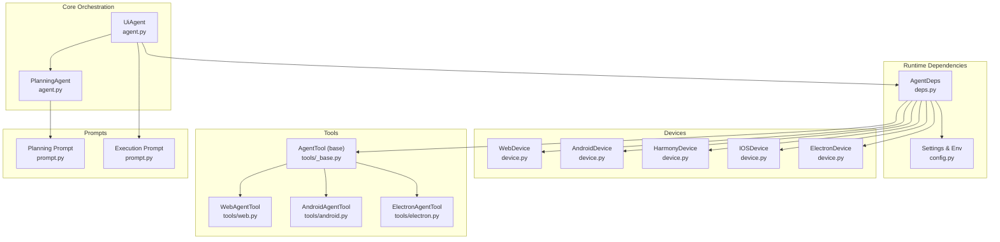

**Diagram sources**
- [agent.py:97-314](file://src/page_eyes/agent.py#L97-L314)
- [deps.py:76-101](file://src/page_eyes/deps.py#L76-L101)
- [device.py:54-292](file://src/page_eyes/device.py#L54-L292)
- [tools/_base.py:130-391](file://src/page_eyes/tools/_base.py#L130-L391)
- [tools/web.py:24-179](file://src/page_eyes/tools/web.py#L24-L179)
- [tools/android.py:18-23](file://src/page_eyes/tools/android.py#L18-L23)
- [tools/electron.py:21-134](file://src/page_eyes/tools/electron.py#L21-L134)
- [prompt.py:8-166](file://src/page_eyes/prompt.py#L8-L166)
- [config.py:54-73](file://src/page_eyes/config.py#L54-L73)

**Section sources**
- [agent.py:97-314](file://src/page_eyes/agent.py#L97-L314)
- [deps.py:76-101](file://src/page_eyes/deps.py#L76-L101)
- [device.py:54-292](file://src/page_eyes/device.py#L54-L292)
- [tools/__init__.py:6-22](file://src/page_eyes/tools/__init__.py#L6-L22)
- [prompt.py:8-166](file://src/page_eyes/prompt.py#L8-L166)
- [config.py:54-73](file://src/page_eyes/config.py#L54-L73)

## Core Components
- UiAgent: Central orchestrator that composes a planning phase and an iterative execution loop. It builds a Pydantic AI agent with tools and skills, manages step-by-step execution, and generates reports.
- PlanningAgent: Uses a dedicated system prompt to decompose user intent into atomic steps.
- AgentDeps: Dependency container holding Settings, Device, Tool, and AgentContext. Provides typed bindings for agent execution.
- Devices: Abstractions for Web, Android, Harmony, iOS, and Electron environments, each implementing platform-specific lifecycle and interactions.
- Tools: A shared AgentTool base with platform-specific implementations (WebAgentTool, AndroidAgentTool, ElectronAgentTool) exposing atomic actions (click, input, swipe, wait, assert, etc.) as Pydantic AI tools.
- Configuration: Settings loaded from environment variables with a clear hierarchy and defaults.

**Section sources**
- [agent.py:74-314](file://src/page_eyes/agent.py#L74-L314)
- [deps.py:76-280](file://src/page_eyes/deps.py#L76-L280)
- [device.py:54-292](file://src/page_eyes/device.py#L54-L292)
- [tools/_base.py:130-391](file://src/page_eyes/tools/_base.py#L130-L391)
- [config.py:54-73](file://src/page_eyes/config.py#L54-L73)

## Architecture Overview
The framework follows a layered pattern:
- Prompt layer: Planning and Execution prompts guide decomposition and action selection.
- Orchestrator layer: UiAgent coordinates planning and step execution.
- Dependency layer: AgentDeps injects typed settings, device, and tool instances.
- Device abstraction layer: Platform-specific devices encapsulate connectivity and UI interactions.
- Tool layer: Atomic actions exposed as Pydantic AI tools with unified parameter types and result semantics.
- Utility layer: Storage strategies, platform helpers, and JS overlays support screenshots, uploads, and UI highlighting.

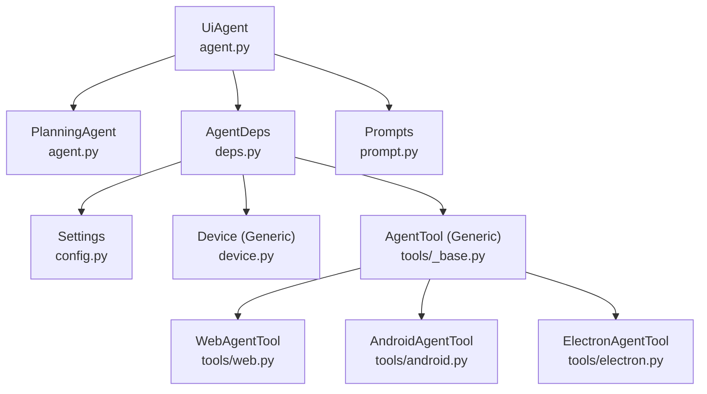

**Diagram sources**
- [agent.py:74-314](file://src/page_eyes/agent.py#L74-L314)
- [deps.py:76-101](file://src/page_eyes/deps.py#L76-L101)
- [config.py:54-73](file://src/page_eyes/config.py#L54-L73)
- [device.py:54-292](file://src/page_eyes/device.py#L54-L292)
- [tools/_base.py:130-391](file://src/page_eyes/tools/_base.py#L130-L391)
- [tools/web.py:24-179](file://src/page_eyes/tools/web.py#L24-L179)
- [tools/android.py:18-23](file://src/page_eyes/tools/android.py#L18-L23)
- [tools/electron.py:21-134](file://src/page_eyes/tools/electron.py#L21-L134)
- [prompt.py:8-166](file://src/page_eyes/prompt.py#L8-L166)

## Detailed Component Analysis

### UiAgent: Central Orchestrator
UiAgent is the primary orchestrator responsible for:
- Merging user-provided settings with defaults
- Building a Pydantic AI agent with tools and skills
- Running a planning phase to decompose user intent
- Iterating over planned steps, invoking tools, and updating context
- Generating a structured HTML report summarizing outcomes

Key behaviors:
- Settings merging ensures overrides take precedence over defaults
- The agent is built with a system prompt and tools; skills are loaded from configured directories
- Execution uses a template-like loop: plan → iterate steps → handle nodes → update context → report
- Parallel tool calls are constrained per step for deterministic behavior

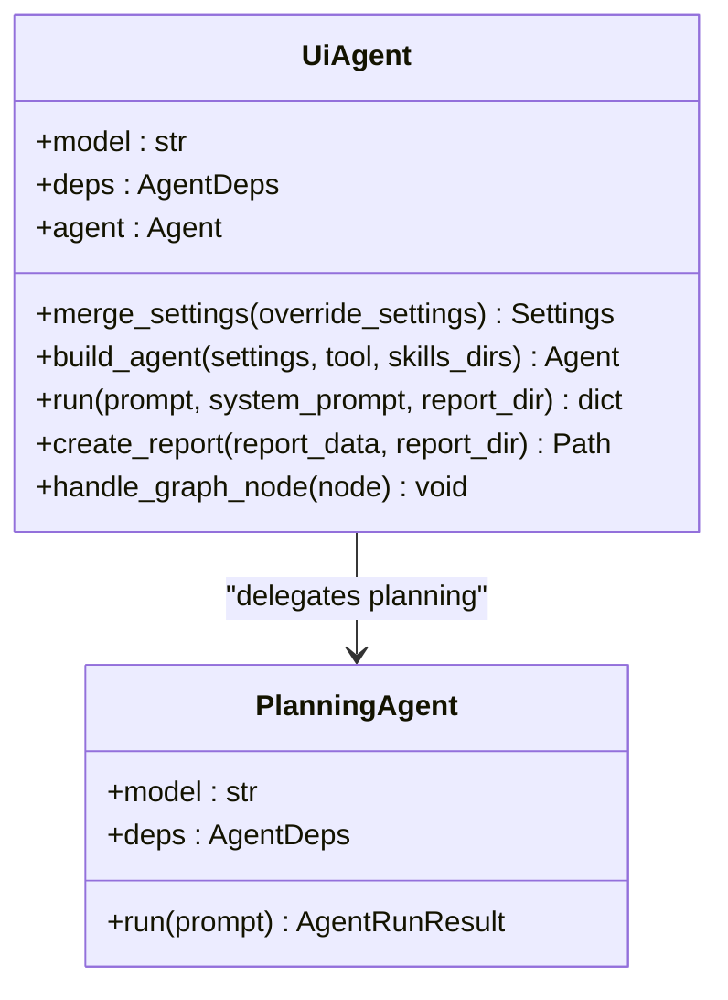

**Diagram sources**
- [agent.py:97-314](file://src/page_eyes/agent.py#L97-L314)
- [agent.py:74-90](file://src/page_eyes/agent.py#L74-L90)

**Section sources**
- [agent.py:97-314](file://src/page_eyes/agent.py#L97-L314)

### PlanningAgent: Natural Language Processing for Task Decomposition
PlanningAgent uses a specialized system prompt to transform user intent into a sequence of atomic steps. It constructs a Pydantic AI agent with a specific output type and delegates execution to the underlying model.

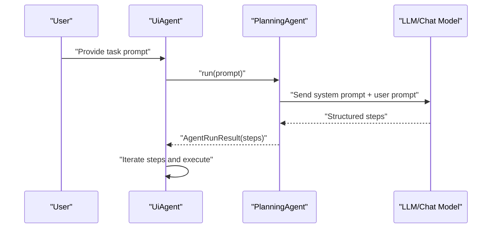

**Diagram sources**
- [agent.py:74-90](file://src/page_eyes/agent.py#L74-L90)
- [prompt.py:8-28](file://src/page_eyes/prompt.py#L8-L28)

**Section sources**
- [agent.py:74-90](file://src/page_eyes/agent.py#L74-L90)
- [prompt.py:8-28](file://src/page_eyes/prompt.py#L8-L28)

### AgentDeps: Dependency Injection System
AgentDeps is a generic container that binds:
- Settings: model, model settings, browser/headless flags, debug mode, and storage client
- Device: platform-specific device instance
- Tool: platform-specific toolset exposing actions as Pydantic AI tools
- AgentContext: step tracking, current step, screen info, and flags

It also defines parameter and result types for tools, enabling consistent behavior across platforms.

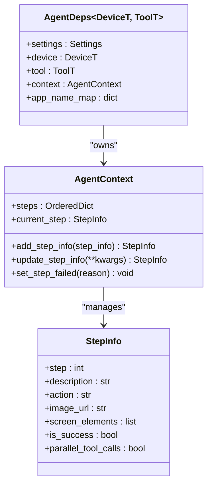

**Diagram sources**
- [deps.py:76-101](file://src/page_eyes/deps.py#L76-L101)
- [deps.py:48-73](file://src/page_eyes/deps.py#L48-L73)
- [deps.py:35-46](file://src/page_eyes/deps.py#L35-L46)

**Section sources**
- [deps.py:76-101](file://src/page_eyes/deps.py#L76-L101)
- [deps.py:48-73](file://src/page_eyes/deps.py#L48-L73)
- [deps.py:35-46](file://src/page_eyes/deps.py#L35-L46)

### Devices: Strategy Pattern for Platform Implementations
Devices encapsulate platform-specific lifecycles and interactions:
- WebDevice: Playwright-backed persistent context with optional mobile emulation
- AndroidDevice: ADB-based device window sizing and interactions
- HarmonyDevice: HDC-based device connections and window sizing
- IOSDevice: WebDriverAgent connection with auto-start support and session management
- ElectronDevice: Chromium CDP connection with page stack and window switching

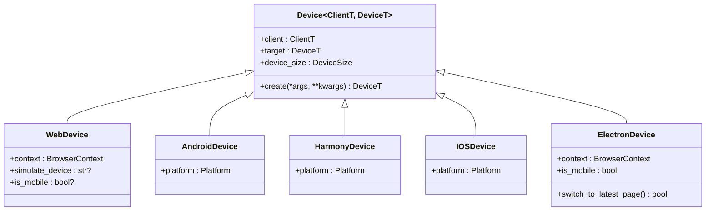

**Diagram sources**
- [device.py:42-51](file://src/page_eyes/device.py#L42-L51)
- [device.py:54-100](file://src/page_eyes/device.py#L54-L100)
- [device.py:103-127](file://src/page_eyes/device.py#L103-L127)
- [device.py:130-156](file://src/page_eyes/device.py#L130-L156)
- [device.py:159-228](file://src/page_eyes/device.py#L159-L228)
- [device.py:231-292](file://src/page_eyes/device.py#L231-L292)

**Section sources**
- [device.py:42-51](file://src/page_eyes/device.py#L42-L51)
- [device.py:54-100](file://src/page_eyes/device.py#L54-L100)
- [device.py:103-127](file://src/page_eyes/device.py#L103-L127)
- [device.py:130-156](file://src/page_eyes/device.py#L130-L156)
- [device.py:159-228](file://src/page_eyes/device.py#L159-L228)
- [device.py:231-292](file://src/page_eyes/device.py#L231-L292)

### Tools: Unified Action Layer with Skill Integration
AgentTool defines a common interface and a suite of tools:
- Screen capture and parsing (with OmniParser integration)
- Element assertions and waits
- Navigation and teardown
- Platform-specific implementations expose click, input, swipe, and other actions

Tools are decorated with metadata to control visibility per model type (LLM vs VLM) and are automatically registered as Pydantic AI tools.

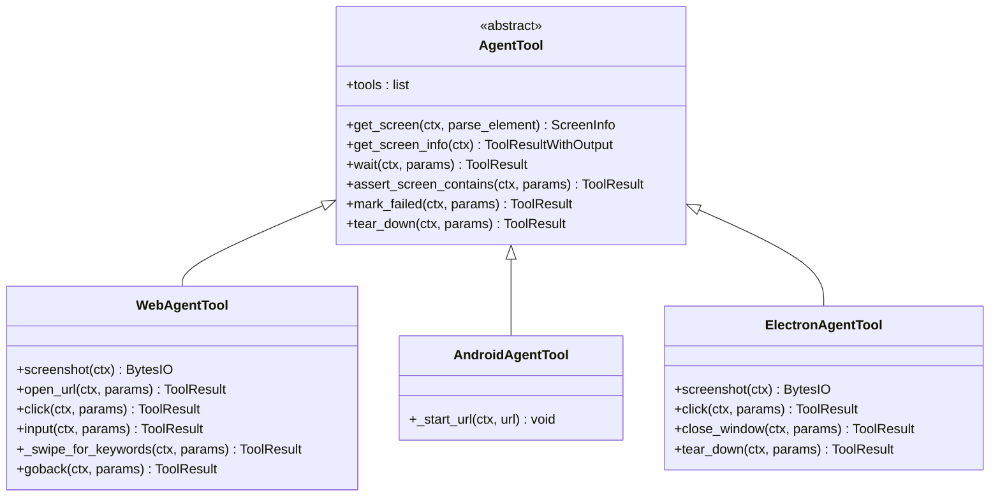

**Diagram sources**
- [tools/_base.py:130-391](file://src/page_eyes/tools/_base.py#L130-L391)
- [tools/web.py:24-179](file://src/page_eyes/tools/web.py#L24-L179)
- [tools/android.py:18-23](file://src/page_eyes/tools/android.py#L18-L23)
- [tools/electron.py:21-134](file://src/page_eyes/tools/electron.py#L21-L134)

**Section sources**
- [tools/_base.py:130-391](file://src/page_eyes/tools/_base.py#L130-L391)
- [tools/web.py:24-179](file://src/page_eyes/tools/web.py#L24-L179)
- [tools/android.py:18-23](file://src/page_eyes/tools/android.py#L18-L23)
- [tools/electron.py:21-134](file://src/page_eyes/tools/electron.py#L21-L134)

### Configuration Management: Environment Variables and Settings Hierarchy
Settings are loaded from environment variables with explicit prefixes and defaults. The hierarchy includes:
- Global agent settings (model, model type, model settings, debug)
- Browser-specific settings (headless, emulate device)
- Storage configuration (COS or MinIO or Base64 fallback)
- OmniParser integration settings

Environment loading occurs early, ensuring downstream components read consistent configuration.

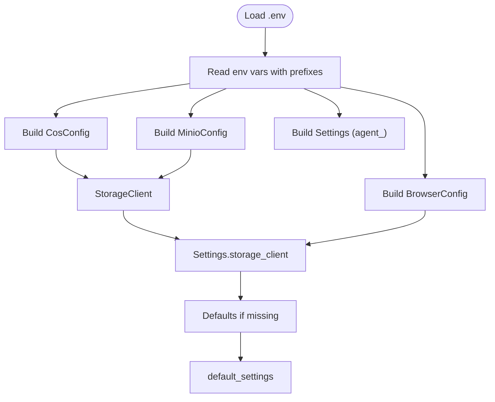

**Diagram sources**
- [config.py:19-73](file://src/page_eyes/config.py#L19-L73)

**Section sources**
- [config.py:19-73](file://src/page_eyes/config.py#L19-L73)

### Prompt Engineering Strategies for Task Decomposition
Two prompts guide the system:
- Planning prompt: Enforces atomic, ordered steps and preserves user intent
- Execution prompt: Guides element-centric actions, assertion-based checks, and robust error handling

The execution prompt distinguishes between LLM and VLM modes, adjusting element retrieval and coordinate systems accordingly.

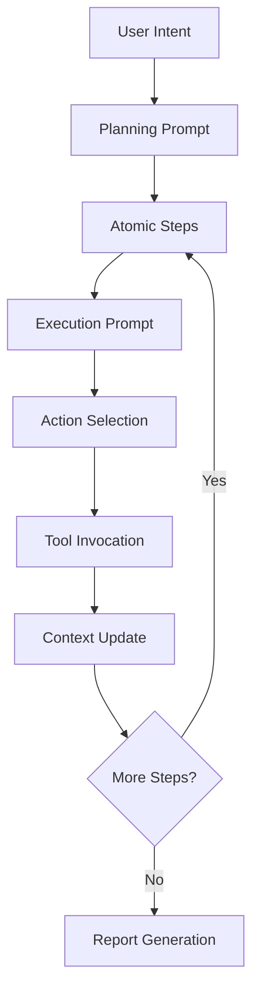

**Diagram sources**
- [prompt.py:8-28](file://src/page_eyes/prompt.py#L8-L28)
- [prompt.py:30-103](file://src/page_eyes/prompt.py#L30-L103)
- [prompt.py:105-163](file://src/page_eyes/prompt.py#L105-L163)

**Section sources**
- [prompt.py:8-28](file://src/page_eyes/prompt.py#L8-L28)
- [prompt.py:30-103](file://src/page_eyes/prompt.py#L30-L103)
- [prompt.py:105-163](file://src/page_eyes/prompt.py#L105-L163)

### Relationship Between Agents, Devices, and Tools
Agents depend on AgentDeps, which bind a Device and Tool. The UiAgent orchestrates planning and step execution, while Tools encapsulate platform-specific actions. The Device abstraction isolates platform differences behind a common interface.

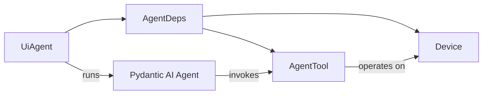

**Diagram sources**
- [agent.py:97-314](file://src/page_eyes/agent.py#L97-L314)
- [deps.py:76-101](file://src/page_eyes/deps.py#L76-L101)
- [tools/_base.py:130-391](file://src/page_eyes/tools/_base.py#L130-L391)
- [device.py:54-292](file://src/page_eyes/device.py#L54-L292)

**Section sources**
- [agent.py:97-314](file://src/page_eyes/agent.py#L97-L314)
- [deps.py:76-101](file://src/page_eyes/deps.py#L76-L101)
- [tools/_base.py:130-391](file://src/page_eyes/tools/_base.py#L130-L391)
- [device.py:54-292](file://src/page_eyes/device.py#L54-L292)

### Architectural Patterns
- Factory Pattern: UiAgent subclasses (WebAgent, AndroidAgent, HarmonyAgent, IOSAgent, ElectronAgent) provide async factory methods to construct agents with platform-specific devices and tools.
- Strategy Pattern: Device classes encapsulate platform-specific behavior; AgentTool subclasses implement platform-specific actions.
- Template Method: UiAgent.run defines a consistent execution flow: plan → iterate steps → handle nodes → update context → report.

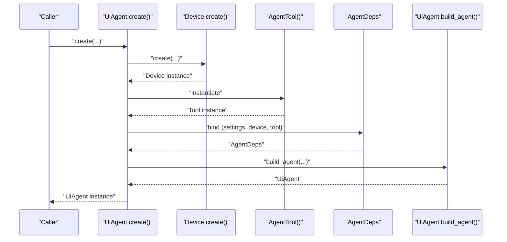

**Diagram sources**
- [agent.py:316-515](file://src/page_eyes/agent.py#L316-L515)
- [device.py:59-87](file://src/page_eyes/device.py#L59-L87)
- [device.py:107-126](file://src/page_eyes/device.py#L107-L126)
- [device.py:134-155](file://src/page_eyes/device.py#L134-L155)
- [device.py:165-227](file://src/page_eyes/device.py#L165-L227)
- [device.py:244-292](file://src/page_eyes/device.py#L244-L292)
- [tools/web.py:24-44](file://src/page_eyes/tools/web.py#L24-L44)
- [tools/android.py:18-23](file://src/page_eyes/tools/android.py#L18-L23)
- [tools/electron.py:21-46](file://src/page_eyes/tools/electron.py#L21-L46)

**Section sources**
- [agent.py:316-515](file://src/page_eyes/agent.py#L316-L515)
- [device.py:59-87](file://src/page_eyes/device.py#L59-L87)
- [device.py:107-126](file://src/page_eyes/device.py#L107-L126)
- [device.py:134-155](file://src/page_eyes/device.py#L134-L155)
- [device.py:165-227](file://src/page_eyes/device.py#L165-L227)
- [device.py:244-292](file://src/page_eyes/device.py#L244-L292)
- [tools/web.py:24-44](file://src/page_eyes/tools/web.py#L24-L44)
- [tools/android.py:18-23](file://src/page_eyes/tools/android.py#L18-L23)
- [tools/electron.py:21-46](file://src/page_eyes/tools/electron.py#L21-L46)

### Skill-Based Extensibility and Custom Actions
Skills integrate via Pydantic AI SkillsCapability, allowing custom actions to be discovered from configured directories. Tools can be conditionally enabled per model type (LLM/VLM) and decorated with metadata to control availability.

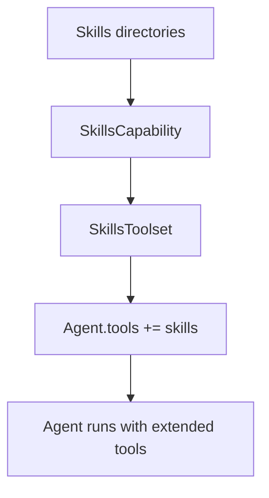

**Diagram sources**
- [agent.py:147-169](file://src/page_eyes/agent.py#L147-L169)
- [tools/_base.py:130-151](file://src/page_eyes/tools/_base.py#L130-L151)

**Section sources**
- [agent.py:147-169](file://src/page_eyes/agent.py#L147-L169)
- [tools/_base.py:130-151](file://src/page_eyes/tools/_base.py#L130-L151)

## Dependency Analysis
The following diagram highlights key dependencies among core modules:

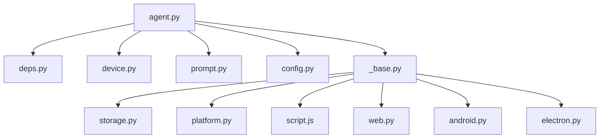

**Diagram sources**
- [agent.py:36-57](file://src/page_eyes/agent.py#L36-L57)
- [deps.py:14-16](file://src/page_eyes/deps.py#L14-L16)
- [tools/_base.py:22-29](file://src/page_eyes/tools/_base.py#L22-L29)
- [storage.py:154-193](file://src/page_eyes/util/storage.py#L154-L193)
- [platform.py:14-22](file://src/page_eyes/util/platform.py#L14-L22)
- [script.js:1-54](file://src/page_eyes/util/js_tool/script.js#L1-L54)

**Section sources**
- [agent.py:36-57](file://src/page_eyes/agent.py#L36-L57)
- [deps.py:14-16](file://src/page_eyes/deps.py#L14-L16)
- [tools/_base.py:22-29](file://src/page_eyes/tools/_base.py#L22-L29)
- [storage.py:154-193](file://src/page_eyes/util/storage.py#L154-L193)
- [platform.py:14-22](file://src/page_eyes/util/platform.py#L14-L22)
- [script.js:1-54](file://src/page_eyes/util/js_tool/script.js#L1-L54)

## Performance Considerations
- Concurrency control: Tools enforce single-tool-per-step execution to avoid race conditions and inconsistent UI state.
- Rendering stability: Delays before and after tool execution mitigate rapid UI updates.
- Screen parsing: Optional element parsing reduces payload sizes; otherwise, raw screenshots are uploaded.
- Device sizing: Accurate device_size enables precise coordinate calculations across platforms.

[No sources needed since this section provides general guidance]

## Troubleshooting Guide
Common issues and remedies:
- Element not found or timing-sensitive UI: Use wait and assert tools; consider enabling pop-up handling skills.
- Coordinate mismatch on high-DPR displays: Electron screenshots force 1x scale to align pixel and CSS coordinates.
- iOS device connection failures: Ensure WebDriverAgent is reachable or enable auto-start with proper environment variables.
- Tool concurrency violations: The framework enforces single tool invocation per step; avoid issuing multiple tool calls concurrently.

**Section sources**
- [tools/_base.py:63-86](file://src/page_eyes/tools/_base.py#L63-L86)
- [tools/electron.py:34-45](file://src/page_eyes/tools/electron.py#L34-L45)
- [device.py:180-227](file://src/page_eyes/device.py#L180-L227)

## Conclusion
PageEyes Agent is designed around a clean separation of concerns:
- UiAgent orchestrates planning and execution
- AgentDeps injects typed dependencies
- Devices isolate platform specifics
- Tools unify actions across platforms
- Configuration and prompts guide behavior deterministically

This architecture supports extensibility via skills and custom tools while maintaining robustness through enforced execution patterns and context-aware reporting.

[No sources needed since this section summarizes without analyzing specific files]

## Appendices

### Example Workflows from Tests
These tests illustrate typical usage patterns:
- Web PC and mobile flows with sliding, clicking, input, and assertions
- Planning agent decomposition of complex tasks
- Electron agent lifecycle and window management

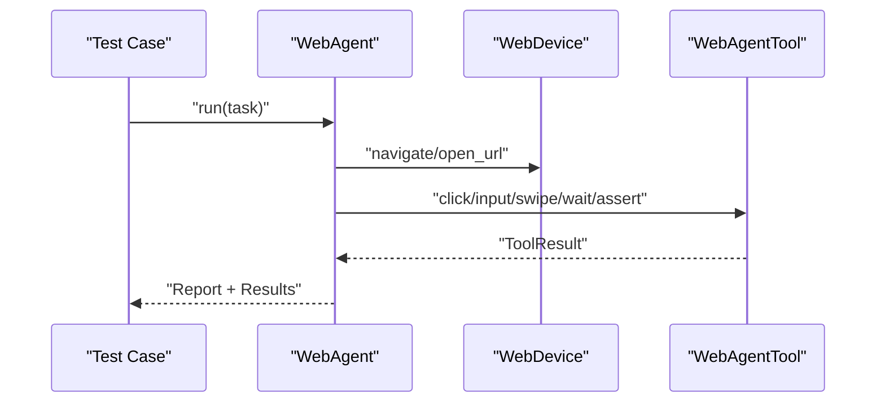

**Diagram sources**
- [test_web_agent.py:11-22](file://tests/test_web_agent.py#L11-L22)
- [test_planning_agent.py:20-27](file://tests/test_planning_agent.py#L20-L27)
- [conftest.py:44-50](file://tests/conftest.py#L44-L50)

**Section sources**
- [test_web_agent.py:11-22](file://tests/test_web_agent.py#L11-L22)
- [test_planning_agent.py:20-27](file://tests/test_planning_agent.py#L20-L27)
- [conftest.py:44-50](file://tests/conftest.py#L44-L50)