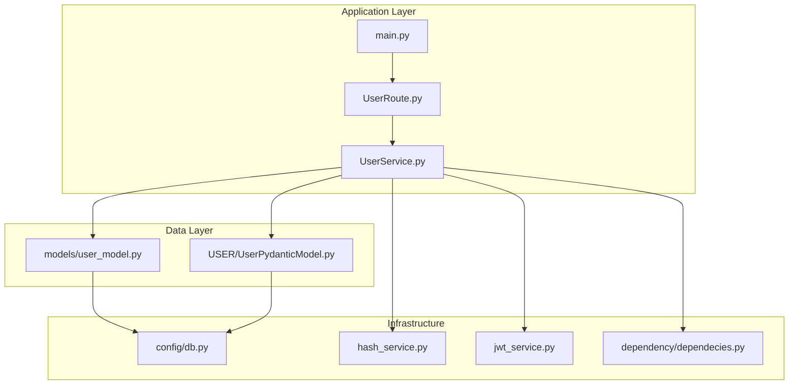
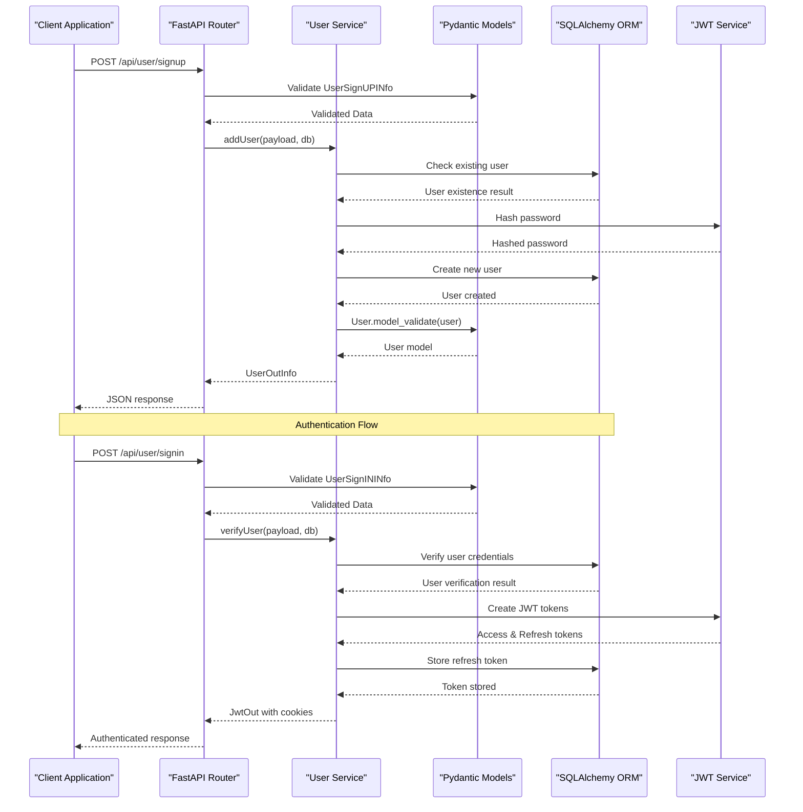
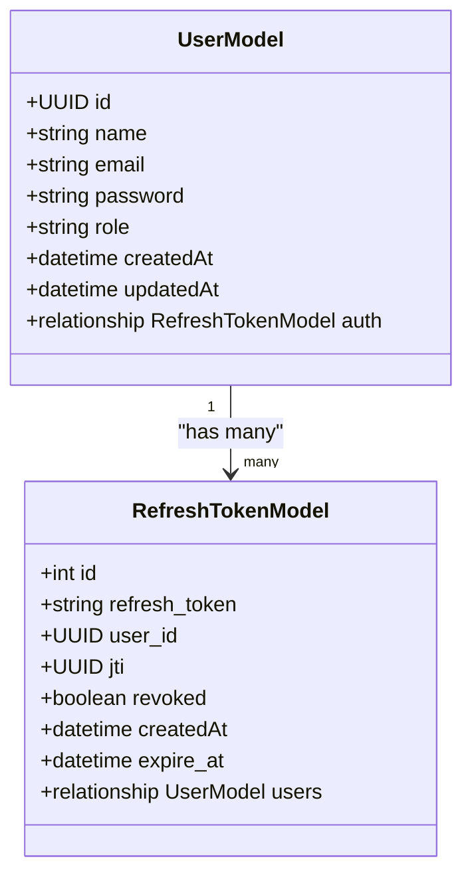
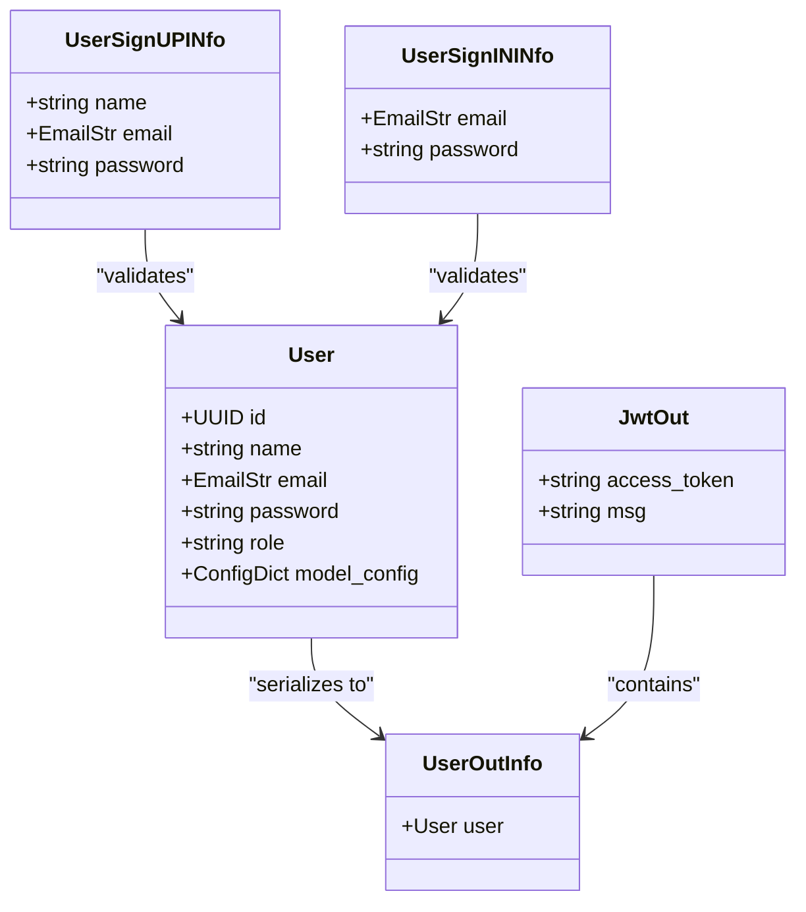
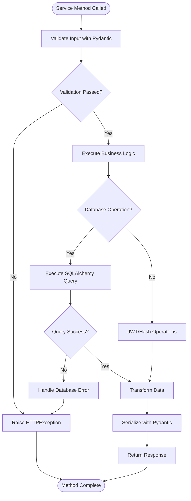
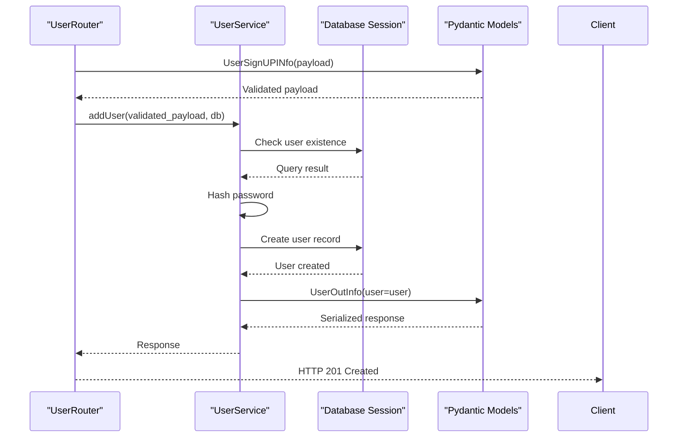
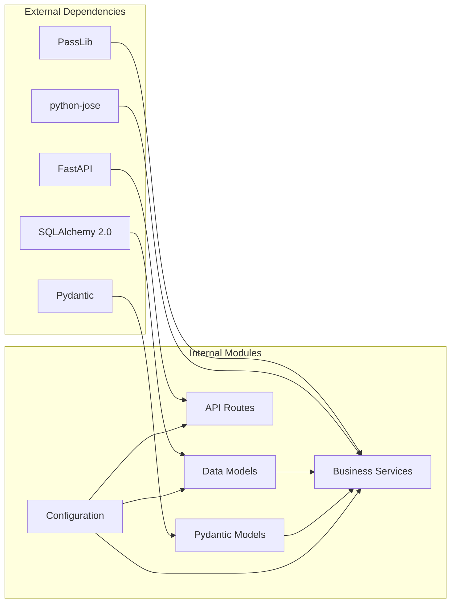

# Data Models and Pydantic Integration

<cite>
**Referenced Files in This Document**
- [user_model.py](file://app/models/user_model.py)
- [UserPydanticModel.py](file://app/USER/UserPydanticModel.py)
- [UserRoute.py](file://app/USER/UserRoute.py)
- [UserService.py](file://app/USER/UserService.py)
- [db.py](file://app/config/db.py)
- [hash_service.py](file://app/services/hash_service.py)
- [jwt_service.py](file://app/services/jwt_service.py)
- [dependecies.py](file://app/dependency/dependecies.py)
- [main.py](file://main.py)
- [pyproject.toml](file://pyproject.toml)
</cite>

## Table of Contents
1. [Introduction](#introduction)
2. [Project Structure](#project-structure)
3. [Core Components](#core-components)
4. [Architecture Overview](#architecture-overview)
5. [Detailed Component Analysis](#detailed-component-analysis)
6. [Dependency Analysis](#dependency-analysis)
7. [Performance Considerations](#performance-considerations)
8. [Troubleshooting Guide](#troubleshooting-guide)
9. [Conclusion](#conclusion)

## Introduction

This document provides comprehensive analysis of the data models and Pydantic integration within the authentication service. The project demonstrates a modern approach to handling user data through SQLAlchemy ORM models combined with Pydantic validation for API requests and responses. The system implements robust data validation, secure password hashing, and JWT token management with refresh token support.

The authentication service follows clean architectural patterns with clear separation between data models, validation schemas, business logic, and API endpoints. The integration of Pydantic with SQLAlchemy enables automatic data validation, serialization, and deserialization while maintaining type safety throughout the application.

## Project Structure

The project follows a modular architecture organized by functional domains:

**Diagram sources**
- [main.py:1-31](file://main.py#L1-L31)
- [UserRoute.py:1-23](file://app/USER/UserRoute.py#L1-L23)
- [UserService.py:1-105](file://app/USER/UserService.py#L1-L105)

**Section sources**
- [main.py:1-31](file://main.py#L1-L31)
- [pyproject.toml:1-17](file://pyproject.toml#L1-L17)

## Core Components

### SQLAlchemy Models

The data layer consists of two primary models that represent the user authentication system:

**User Model**: Handles user registration, authentication, and profile information
**Refresh Token Model**: Manages JWT refresh tokens with expiration and revocation tracking

Both models utilize SQLAlchemy's modern type annotations and relationship definitions for type-safe database operations.

### Pydantic Validation Models

The validation layer provides comprehensive data validation for API requests and responses:

**Request Models**: Validate incoming data for sign-up and sign-in operations
**Response Models**: Structure standardized API responses with consistent formatting
**Token Models**: Handle JWT token creation, validation, and refresh operations

### Service Layer Integration

The service layer orchestrates data validation, business logic execution, and persistence operations. It seamlessly integrates Pydantic models with SQLAlchemy ORM for efficient data manipulation.

**Section sources**
- [user_model.py:8-34](file://app/models/user_model.py#L8-L34)
- [UserPydanticModel.py:14-47](file://app/USER/UserPydanticModel.py#L14-L47)
- [UserService.py:13-105](file://app/USER/UserService.py#L13-L105)

## Architecture Overview

The authentication service implements a layered architecture with clear separation of concerns:

**Diagram sources**
- [UserRoute.py:10-22](file://app/USER/UserRoute.py#L10-L22)
- [UserService.py:13-62](file://app/USER/UserService.py#L13-L62)
- [UserPydanticModel.py:14-34](file://app/USER/UserPydanticModel.py#L14-L34)

## Detailed Component Analysis

### Data Model Implementation

The SQLAlchemy models demonstrate modern Python typing with SQLAlchemy 2.0 features:

**Diagram sources**
- [user_model.py:8-34](file://app/models/user_model.py#L8-L34)

**Key Features**:
- Type-safe field definitions using SQLAlchemy's `Mapped[T]` syntax
- Automatic UUID generation for primary keys
- Index optimization for frequently queried fields
- Relationship definitions with cascading operations
- Timestamp management with server defaults

**Section sources**
- [user_model.py:8-34](file://app/models/user_model.py#L8-L34)

### Pydantic Model Integration

The Pydantic models provide comprehensive validation and serialization capabilities:

**Diagram sources**
- [UserPydanticModel.py:14-47](file://app/USER/UserPydanticModel.py#L14-L47)

**Validation Features**:
- Email validation using Pydantic's EmailStr type
- Type coercion and validation for all fields
- Extra field prevention for request models
- Configurable model behavior for ORM integration

**Section sources**
- [UserPydanticModel.py:14-47](file://app/USER/UserPydanticModel.py#L14-L47)

### Service Layer Orchestration

The service layer coordinates between validation, business logic, and persistence:

**Diagram sources**
- [UserService.py:13-105](file://app/USER/UserService.py#L13-L105)

**Section sources**
- [UserService.py:13-105](file://app/USER/UserService.py#L13-L105)

### API Route Integration

The FastAPI router demonstrates proper dependency injection and error handling:

**Diagram sources**
- [UserRoute.py:10-15](file://app/USER/UserRoute.py#L10-L15)
- [UserService.py:13-23](file://app/USER/UserService.py#L13-L23)

**Section sources**
- [UserRoute.py:1-23](file://app/USER/UserRoute.py#L1-L23)

## Dependency Analysis

The project maintains loose coupling through dependency injection and clear interface boundaries:

**Diagram sources**
- [pyproject.toml:7-16](file://pyproject.toml#L7-L16)
- [UserService.py:1-105](file://app/USER/UserService.py#L1-L105)

**Key Dependencies**:
- **Pydantic**: Data validation and serialization
- **SQLAlchemy 2.0**: ORM and database operations
- **FastAPI**: Web framework and dependency injection
- **PassLib**: Password hashing with Argon2
- **python-jose**: JWT token encoding/decoding

**Section sources**
- [pyproject.toml:1-17](file://pyproject.toml#L1-L17)

## Performance Considerations

### Data Model Optimizations

The SQLAlchemy models implement several performance optimizations:

- **Index Creation**: Email field is indexed for faster lookups
- **UUID Generation**: Server-side UUID generation reduces client overhead
- **Relationship Management**: Efficient relationship loading with back-populates
- **Timestamp Updates**: Automatic timestamp updates reduce manual operations

### Pydantic Validation Efficiency

- **Type Coercion**: Automatic type conversion reduces manual validation
- **Model Caching**: Pydantic models cache validation logic for reuse
- **Configurable Behavior**: `from_attributes=True` enables seamless ORM integration

### Database Connection Management

The async session management ensures optimal resource utilization:
- **Connection Pooling**: SQLAlchemy async engine manages connection pooling
- **Automatic Cleanup**: Proper session lifecycle management prevents leaks
- **Error Handling**: Comprehensive exception handling for database operations

## Troubleshooting Guide

### Common Issues and Solutions

**Data Validation Errors**:
- Ensure all Pydantic models are properly configured with `extra='forbid'` for request models
- Validate email format using Pydantic's built-in EmailStr validation
- Check field types match expected SQLAlchemy column types

**Database Connection Problems**:
- Verify DATABASE_URL environment variable is properly set
- Check schema creation permissions for the auth schema
- Monitor async session lifecycle to prevent connection leaks

**JWT Token Issues**:
- Ensure SECRET environment variable is configured
- Validate token expiration settings align with security requirements
- Check token hashing consistency for refresh token storage

**Authentication Flow Problems**:
- Verify refresh token cookie settings match frontend expectations
- Check password hashing consistency between sign-up and sign-in
- Monitor database transaction isolation levels for concurrent operations

**Section sources**
- [UserService.py:25-62](file://app/USER/UserService.py#L25-L62)
- [hash_service.py:6-18](file://app/services/hash_service.py#L6-L18)
- [jwt_service.py:8-38](file://app/services/jwt_service.py#L8-L38)

## Conclusion

The authentication service demonstrates excellent integration of SQLAlchemy ORM models with Pydantic validation schemas. The architecture provides:

- **Type Safety**: Full type checking throughout the application stack
- **Data Integrity**: Comprehensive validation at multiple layers
- **Security**: Robust password hashing and JWT token management
- **Maintainability**: Clean separation of concerns with clear module boundaries
- **Performance**: Optimized database operations and efficient validation

The implementation serves as a strong foundation for building scalable authentication systems while maintaining code quality and developer productivity. The modular design allows for easy extension and modification as requirements evolve.