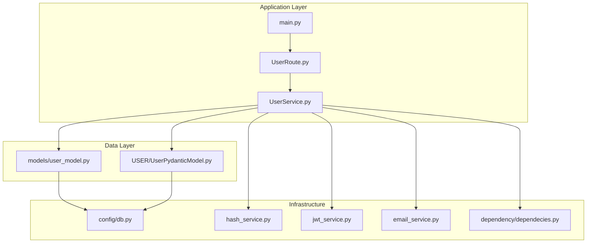
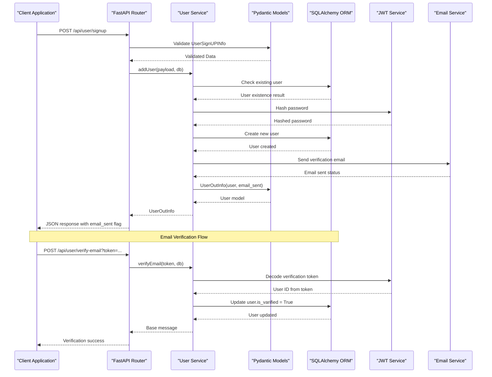
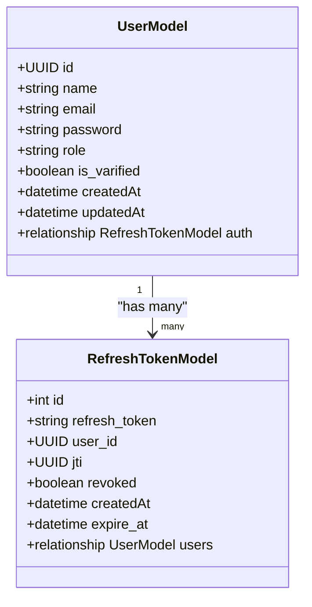
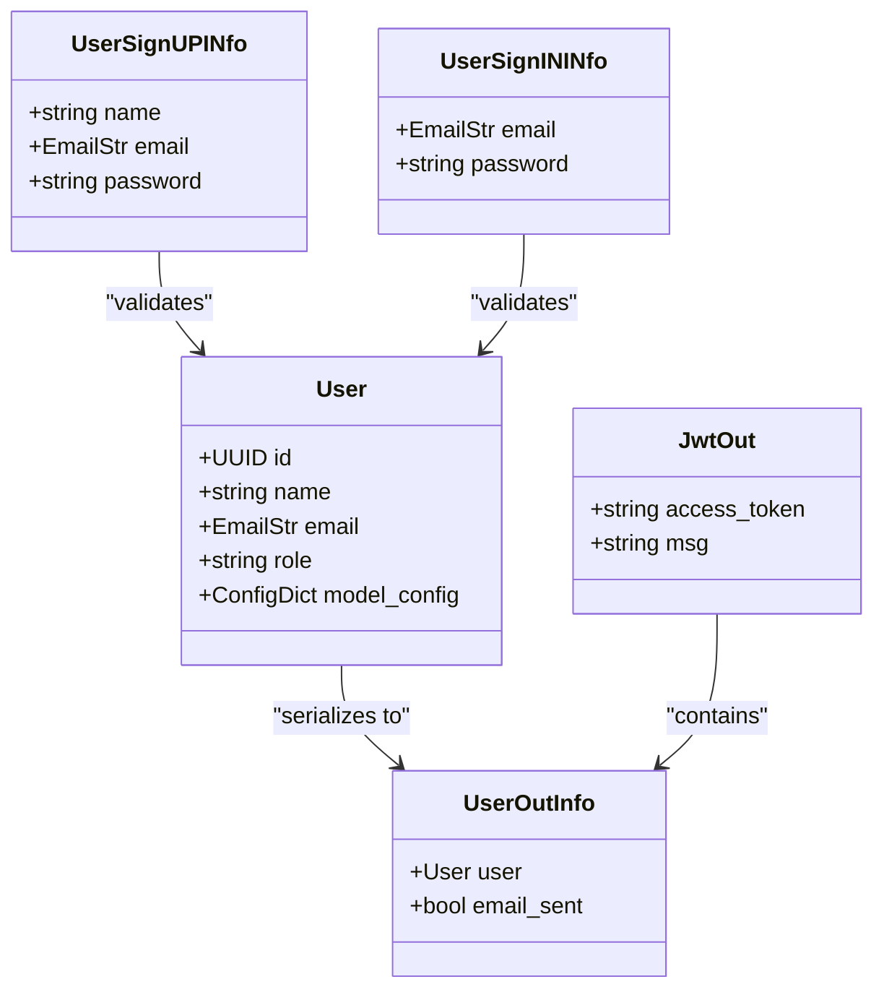
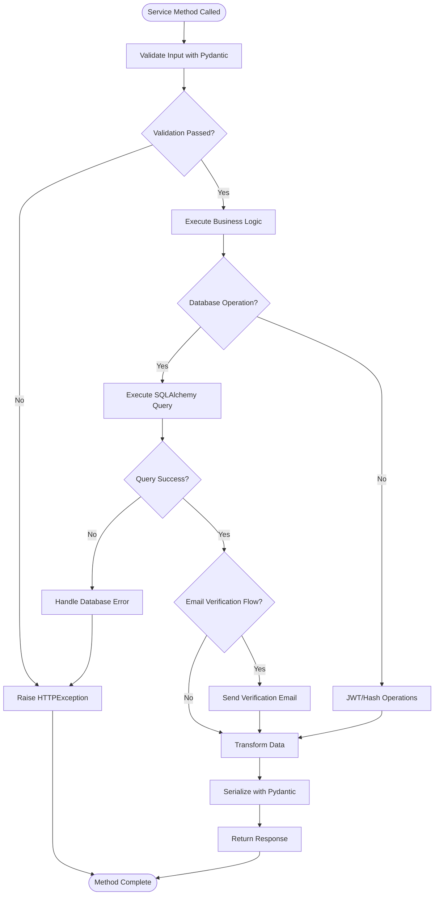
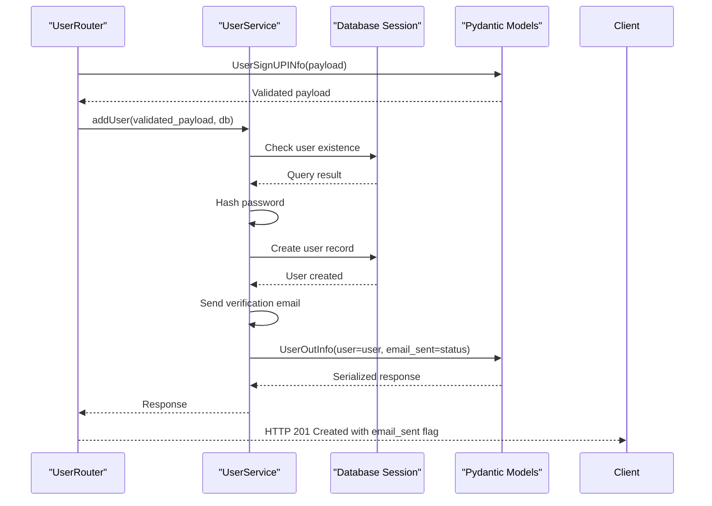
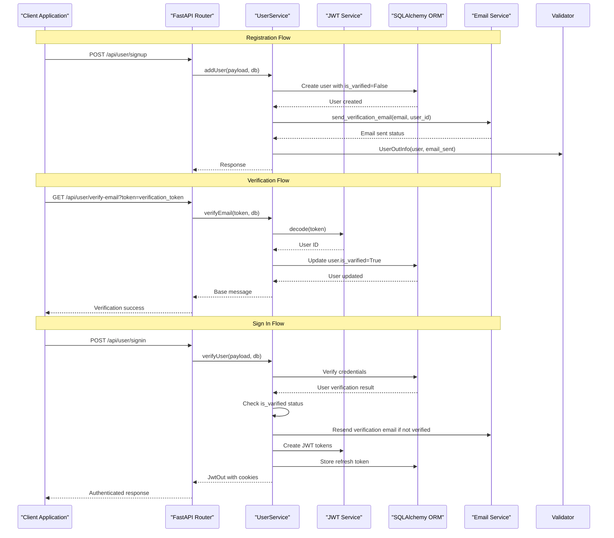

# Data Models and Pydantic Integration

<cite>
**Referenced Files in This Document**
- [user_model.py](file://app/models/user_model.py)
- [UserPydanticModel.py](file://app/USER/UserPydanticModel.py)
- [UserRoute.py](file://app/USER/UserRoute.py)
- [UserService.py](file://app/USER/UserService.py)
- [db.py](file://app/config/db.py)
- [hash_service.py](file://app/services/hash_service.py)
- [jwt_service.py](file://app/services/jwt_service.py)
- [email_service.py](file://app/services/email_service.py)
- [dependecies.py](file://app/dependency/dependecies.py)
- [main.py](file://main.py)
- [pyproject.toml](file://pyproject.toml)
</cite>

## Update Summary
**Changes Made**
- Updated UserModel with new `is_varified` field for email verification workflow
- Enhanced UserPydanticModel with `email_sent` field in UserOutInfo response
- Added comprehensive email verification service with token-based workflow
- Integrated email sending functionality with retry handling and error management
- Enhanced authentication flow with email verification requirements

## Table of Contents
1. [Introduction](#introduction)
2. [Project Structure](#project-structure)
3. [Core Components](#core-components)
4. [Architecture Overview](#architecture-overview)
5. [Detailed Component Analysis](#detailed-component-analysis)
6. [Email Verification Workflow](#email-verification-workflow)
7. [Dependency Analysis](#dependency-analysis)
8. [Performance Considerations](#performance-considerations)
9. [Troubleshooting Guide](#troubleshooting-guide)
10. [Conclusion](#conclusion)

## Introduction

This document provides comprehensive analysis of the data models and Pydantic integration within the authentication service. The project demonstrates a modern approach to handling user data through SQLAlchemy ORM models combined with Pydantic validation for API requests and responses. The system implements robust data validation, secure password hashing, JWT token management with refresh token support, and comprehensive email verification workflow.

The authentication service follows clean architectural patterns with clear separation between data models, validation schemas, business logic, and API endpoints. The integration of Pydantic with SQLAlchemy enables automatic data validation, serialization, and deserialization while maintaining type safety throughout the application. The recent enhancements include a complete email verification system that ensures user email addresses are validated before granting full access to the platform.

## Project Structure

The project follows a modular architecture organized by functional domains:



**Diagram sources**
- [main.py:1-40](file://main.py#L1-L40)
- [UserRoute.py:1-33](file://app/USER/UserRoute.py#L1-L33)
- [UserService.py:1-205](file://app/USER/UserService.py#L1-L205)

**Section sources**
- [main.py:1-40](file://main.py#L1-L40)
- [pyproject.toml:1-19](file://pyproject.toml#L1-L19)

## Core Components

### SQLAlchemy Models

The data layer consists of two primary models that represent the user authentication system:

**User Model**: Handles user registration, authentication, profile information, and email verification status
**Refresh Token Model**: Manages JWT refresh tokens with expiration and revocation tracking

Both models utilize SQLAlchemy's modern type annotations and relationship definitions for type-safe database operations. The User model now includes an `is_varified` field to track email verification status.

### Pydantic Validation Models

The validation layer provides comprehensive data validation for API requests and responses:

**Request Models**: Validate incoming data for sign-up and sign-in operations
**Response Models**: Structure standardized API responses with consistent formatting, including email delivery status
**Token Models**: Handle JWT token creation, validation, and refresh operations
**Verification Models**: Manage email verification token processing and validation

### Service Layer Integration

The service layer orchestrates data validation, business logic execution, persistence operations, and email verification workflow. It seamlessly integrates Pydantic models with SQLAlchemy ORM for efficient data manipulation and provides comprehensive email verification functionality.

**Section sources**
- [user_model.py:11-37](file://app/models/user_model.py#L11-L37)
- [UserPydanticModel.py:14-48](file://app/USER/UserPydanticModel.py#L14-L48)
- [UserService.py:13-205](file://app/USER/UserService.py#L13-L205)

## Architecture Overview

The authentication service implements a layered architecture with clear separation of concerns and comprehensive email verification workflow:



**Diagram sources**
- [UserRoute.py:10-29](file://app/USER/UserRoute.py#L10-L29)
- [UserService.py:13-31](file://app/USER/UserService.py#L13-L31)
- [UserService.py:145-170](file://app/USER/UserService.py#L145-L170)
- [UserPydanticModel.py:28-30](file://app/USER/UserPydanticModel.py#L28-L30)

## Detailed Component Analysis

### Data Model Implementation

The SQLAlchemy models demonstrate modern Python typing with SQLAlchemy 2.0 features and enhanced email verification capabilities:



**Diagram sources**
- [user_model.py:11-37](file://app/models/user_model.py#L11-L37)

**Key Features**:
- Type-safe field definitions using SQLAlchemy's `Mapped[T]` syntax
- Automatic UUID generation for primary keys
- Index optimization for frequently queried fields (email)
- **New**: `is_varified` boolean field with default False for email verification tracking
- Relationship definitions with cascading operations
- Timestamp management with server defaults

**Section sources**
- [user_model.py:11-37](file://app/models/user_model.py#L11-L37)

### Pydantic Model Integration

The Pydantic models provide comprehensive validation and serialization capabilities with enhanced email verification response handling:



**Diagram sources**
- [UserPydanticModel.py:14-48](file://app/USER/UserPydanticModel.py#L14-L48)

**Validation Features**:
- Email validation using Pydantic's EmailStr type
- Type coercion and validation for all fields
- Extra field prevention for request models
- **New**: `email_sent` field in UserOutInfo response model to indicate verification email delivery status
- Configurable model behavior for ORM integration

**Section sources**
- [UserPydanticModel.py:14-48](file://app/USER/UserPydanticModel.py#L14-L48)

### Service Layer Orchestration

The service layer coordinates between validation, business logic, persistence, and email verification workflow:



**Diagram sources**
- [UserService.py:13-31](file://app/USER/UserService.py#L13-L31)
- [UserService.py:172-205](file://app/USER/UserService.py#L172-L205)

**Section sources**
- [UserService.py:13-205](file://app/USER/UserService.py#L13-L205)

### API Route Integration

The FastAPI router demonstrates proper dependency injection, error handling, and comprehensive email verification endpoint integration:



**Diagram sources**
- [UserRoute.py:10-12](file://app/USER/UserRoute.py#L10-L12)
- [UserService.py:13-31](file://app/USER/UserService.py#L13-L31)

**Section sources**
- [UserRoute.py:1-33](file://app/USER/UserRoute.py#L1-L33)

## Email Verification Workflow

The authentication service now includes a comprehensive email verification system that ensures user email addresses are validated before granting full access:



**Diagram sources**
- [UserService.py:13-31](file://app/USER/UserService.py#L13-L31)
- [UserService.py:145-170](file://app/USER/UserService.py#L145-L170)
- [UserService.py:33-82](file://app/USER/UserService.py#L33-L82)
- [UserService.py:172-205](file://app/USER/UserService.py#L172-L205)

**Key Features**:
- **Verification Token Generation**: JWT tokens with 5-minute expiration for email verification
- **Email Delivery Tracking**: `email_sent` flag in UserOutInfo response indicates verification email delivery status
- **Resend Capability**: Automatic resend of verification emails during sign-in for unverified users
- **Cookie-Based Authentication**: Secure JWT access tokens with refresh token support
- **Comprehensive Error Handling**: Graceful handling of email delivery failures and verification errors

**Section sources**
- [UserService.py:13-31](file://app/USER/UserService.py#L13-L31)
- [UserService.py:33-82](file://app/USER/UserService.py#L33-L82)
- [UserService.py:145-170](file://app/USER/UserService.py#L145-L170)
- [UserService.py:172-205](file://app/USER/UserService.py#L172-L205)

## Dependency Analysis

The project maintains loose coupling through dependency injection and clear interface boundaries with enhanced email verification dependencies:

```mermaid
graph LR
subgraph "External Dependencies"
PYDANTIC[Pydantic]
SQLALCHEMY[SQLAlchemy 2.0]
FASTAPI[FastAPI]
PASSLIB[PassLib]
JOSE[python-jose]
AIOSMTPLIB[aiosmtplib]
END
subgraph "Internal Modules"
MODELS[Data Models]
VALIDATION[Pydantic Models]
SERVICES[Business Services]
ROUTES[API Routes]
CONFIG[Configuration]
EMAIL[Email Service]
end
PYDANTIC --> VALIDATION
SQLALCHEMY --> MODELS
FASTAPI --> ROUTES
PASSLIB --> SERVICES
JOSE --> SERVICES
AIOSMTPLIB --> EMAIL
MODELS --> SERVICES
VALIDATION --> SERVICES
CONFIG --> MODELS
CONFIG --> SERVICES
CONFIG --> ROUTES
EMAIL --> SERVICES
```

**Diagram sources**
- [pyproject.toml:7-18](file://pyproject.toml#L7-L18)
- [UserService.py:1-10](file://app/USER/UserService.py#L1-L10)

**Key Dependencies**:
- **Pydantic**: Data validation and serialization
- **SQLAlchemy 2.0**: ORM and database operations
- **FastAPI**: Web framework and dependency injection
- **PassLib**: Password hashing with Argon2
- **python-jose**: JWT token encoding/decoding
- **aiosmtplib**: Asynchronous SMTP email delivery

**Section sources**
- [pyproject.toml:1-19](file://pyproject.toml#L1-L19)

## Performance Considerations

### Data Model Optimizations

The SQLAlchemy models implement several performance optimizations with enhanced email verification support:

- **Index Creation**: Email field is indexed for faster lookups
- **UUID Generation**: Server-side UUID generation reduces client overhead
- **Relationship Management**: Efficient relationship loading with back-populates
- **Timestamp Updates**: Automatic timestamp updates reduce manual operations
- ****New**: `is_varified` field indexing for verification status queries

### Pydantic Validation Efficiency

- **Type Coercion**: Automatic type conversion reduces manual validation
- **Model Caching**: Pydantic models cache validation logic for reuse
- **Configurable Behavior**: `from_attributes=True` enables seamless ORM integration
- ****New**: Response model caching for email verification status

### Database Connection Management

The async session management ensures optimal resource utilization with enhanced email verification:
- **Connection Pooling**: SQLAlchemy async engine manages connection pooling
- **Automatic Cleanup**: Proper session lifecycle management prevents leaks
- **Error Handling**: Comprehensive exception handling for database operations
- ****New**: Email service integration with proper error propagation

### Email Verification Performance

- **Asynchronous Email Delivery**: Non-blocking email sending improves response times
- **Retry Mechanism**: Failed email deliveries are handled gracefully
- **Token Expiration**: 5-minute verification tokens balance security and usability
- **Conditional Resending**: Verification emails are only resent when necessary

## Troubleshooting Guide

### Common Issues and Solutions

**Data Validation Errors**:
- Ensure all Pydantic models are properly configured with `extra='forbid'` for request models
- Validate email format using Pydantic's built-in EmailStr validation
- Check field types match expected SQLAlchemy column types
- **New**: Verify `email_sent` field is properly handled in UserOutInfo responses

**Database Connection Problems**:
- Verify DATABASE_URL environment variable is properly set
- Check schema creation permissions for the auth schema
- Monitor async session lifecycle to prevent connection leaks
- **New**: Ensure `is_varified` field is properly migrated in database schema

**JWT Token Issues**:
- Ensure SECRET environment variable is configured
- Validate token expiration settings align with security requirements
- Check token hashing consistency for refresh token storage
- **New**: Verify verification token expiration (5 minutes) is appropriate for email verification workflow

**Email Verification Problems**:
- Verify SMTP configuration in email_service.py is correct
- Check email sending retries and error handling mechanisms
- Monitor verification token decoding and user ID extraction
- **New**: Validate email_sent flag in UserOutInfo responses reflects actual email delivery status

**Authentication Flow Problems**:
- Verify refresh token cookie settings match frontend expectations
- Check password hashing consistency between sign-up and sign-in
- Monitor database transaction isolation levels for concurrent operations
- **New**: Ensure email verification requirement prevents access for unverified users

**Section sources**
- [UserService.py:13-31](file://app/USER/UserService.py#L13-L31)
- [UserService.py:33-82](file://app/USER/UserService.py#L33-L82)
- [UserService.py:145-170](file://app/USER/UserService.py#L145-L170)
- [hash_service.py:6-21](file://app/services/hash_service.py#L6-L21)
- [jwt_service.py:8-43](file://app/services/jwt_service.py#L8-L43)
- [email_service.py:4-20](file://app/services/email_service.py#L4-L20)

## Conclusion

The authentication service demonstrates excellent integration of SQLAlchemy ORM models with Pydantic validation schemas and comprehensive email verification workflow. The recent enhancements significantly improve the system's security and user experience:

- **Type Safety**: Full type checking throughout the application stack
- **Data Integrity**: Comprehensive validation at multiple layers including email verification
- **Security**: Robust password hashing, JWT token management, and email verification workflow
- **Maintainability**: Clean separation of concerns with clear module boundaries
- **Performance**: Optimized database operations, efficient validation, and asynchronous email delivery
- ****New**: Complete email verification system with token-based workflow and graceful error handling

The implementation serves as a strong foundation for building scalable authentication systems while maintaining code quality and developer productivity. The modular design allows for easy extension and modification as requirements evolve, particularly around email verification and user management workflows.

**Updated** Enhanced with comprehensive email verification workflow, improved response handling with email delivery status, and robust error management throughout the authentication process.