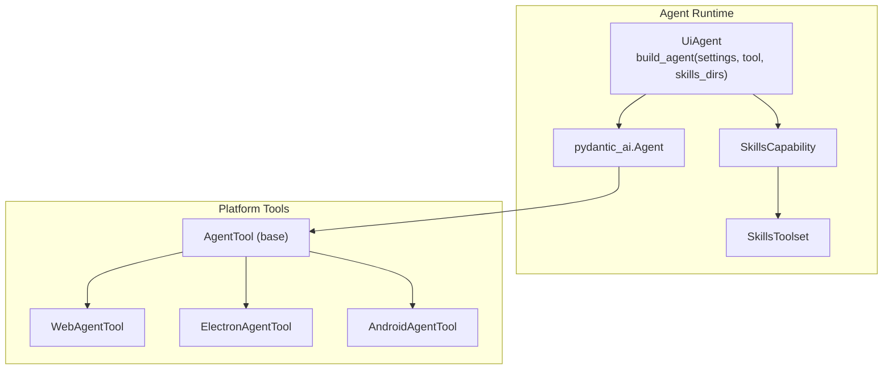
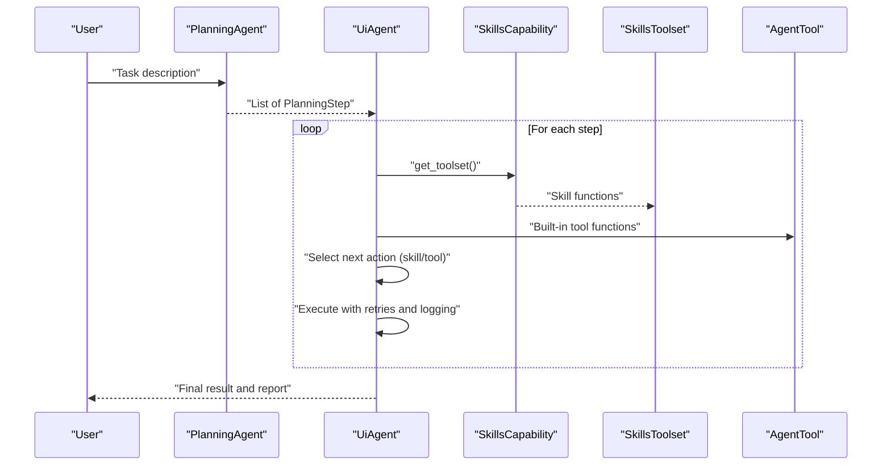
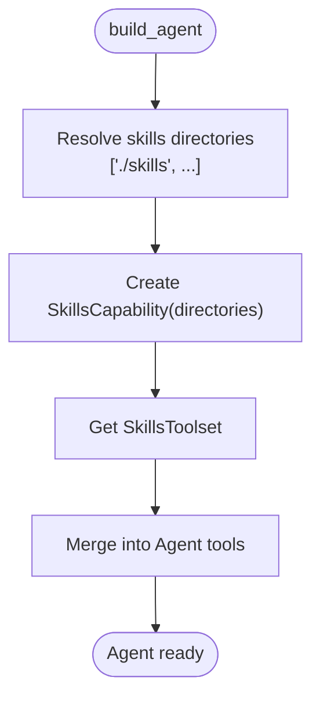
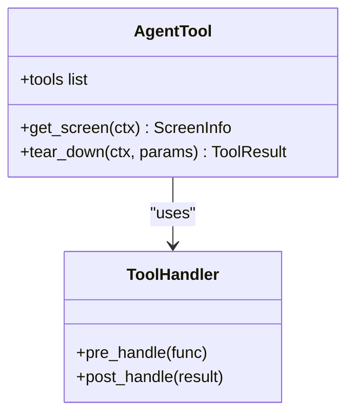
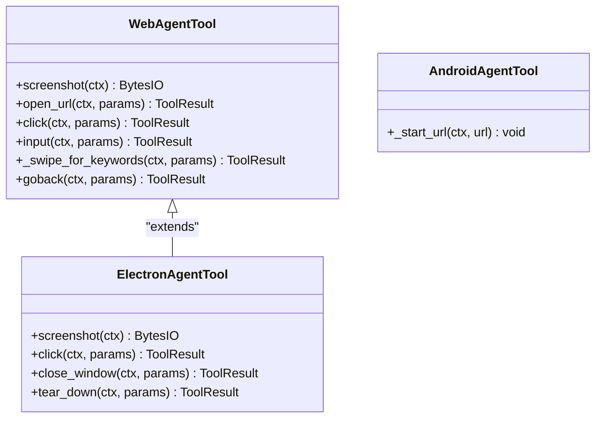
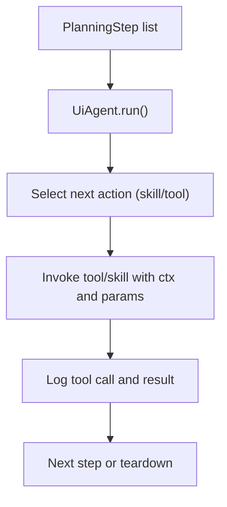
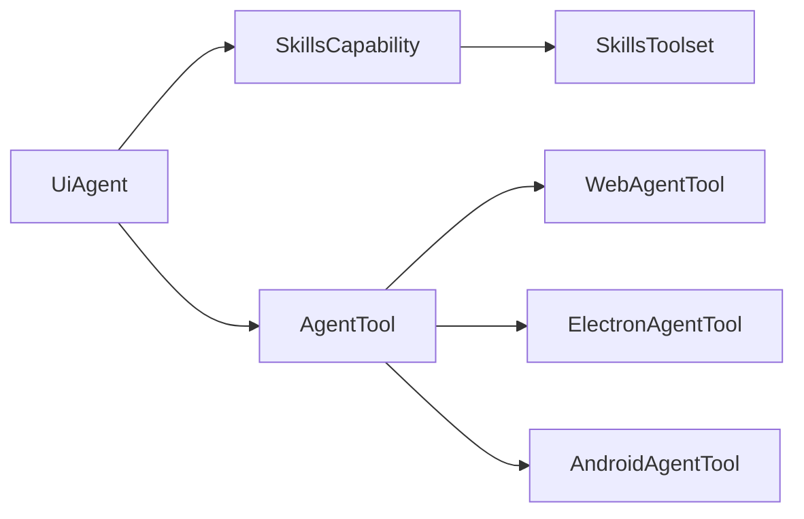

# Extensibility and Skills System

<cite>
**Referenced Files in This Document**
- [agent.py](file://src/page_eyes/agent.py)
- [deps.py](file://src/page_eyes/deps.py)
- [_base.py](file://src/page_eyes/tools/_base.py)
- [web.py](file://src/page_eyes/tools/web.py)
- [android.py](file://src/page_eyes/tools/android.py)
- [electron.py](file://src/page_eyes/tools/electron.py)
- [prompt.py](file://src/page_eyes/prompt.py)
- [SKILL.md](file://tests/skills/pydanticai-docs/SKILL.md)
</cite>

## Table of Contents
1. [Introduction](#introduction)
2. [Project Structure](#project-structure)
3. [Core Components](#core-components)
4. [Architecture Overview](#architecture-overview)
5. [Detailed Component Analysis](#detailed-component-analysis)
6. [Dependency Analysis](#dependency-analysis)
7. [Performance Considerations](#performance-considerations)
8. [Troubleshooting Guide](#troubleshooting-guide)
9. [Conclusion](#conclusion)
10. [Appendices](#appendices)

## Introduction
This document explains the PageEyes Agent extensibility system with a focus on the skill-based architecture and custom action development. It covers how skills integrate with the Pydantic AI SkillsToolset via SkillsCapability, how skills are discovered and registered, and how to develop robust skills that work seamlessly with the planning and execution phases of the agent. It also provides practical examples for common automation scenarios, packaging and distribution guidance, and troubleshooting techniques.

## Project Structure
The extensibility system centers around the agent builder and the SkillsCapability integration. Tools are defined per platform and exposed to the agent as callable functions. Skills are dynamically loaded from configured directories and merged into the agent’s toolset alongside built-in tools.

**Diagram sources**
- [agent.py:147-169](file://src/page_eyes/agent.py#L147-L169)
- [_base.py:130-150](file://src/page_eyes/tools/_base.py#L130-L150)
- [web.py:24-44](file://src/page_eyes/tools/web.py#L24-L44)
- [electron.py:21-46](file://src/page_eyes/tools/electron.py#L21-L46)
- [android.py:18-23](file://src/page_eyes/tools/android.py#L18-L23)

**Section sources**
- [agent.py:147-169](file://src/page_eyes/agent.py#L147-L169)
- [prompt.py:30-103](file://src/page_eyes/prompt.py#L30-L103)

## Core Components
- SkillsCapability and SkillsToolset: The agent composes a SkillsCapability with one or more directories. The capability exposes a SkillsToolset containing all discovered skills, which are merged into the agent’s toolset alongside platform tools.
- Tool registration: AgentTool scans its methods at runtime, filters by model type support, and registers them as Tool instances with normalized names.
- Execution orchestration: The UiAgent orchestrates planning and step-wise execution, logging tool calls and results, and supports retries and failure marking.

Key implementation references:
- Skills loading and agent composition: [agent.py:147-169](file://src/page_eyes/agent.py#L147-L169)
- Tool discovery and registration: [_base.py:130-150](file://src/page_eyes/tools/_base.py#L130-L150)
- Tool decorators and error handling: [_base.py:88-127](file://src/page_eyes/tools/_base.py#L88-L127)
- Planning and execution loop: [agent.py:217-314](file://src/page_eyes/agent.py#L217-L314)

**Section sources**
- [agent.py:147-169](file://src/page_eyes/agent.py#L147-L169)
- [_base.py:88-150](file://src/page_eyes/tools/_base.py#L88-L150)
- [agent.py:217-314](file://src/page_eyes/agent.py#L217-L314)

## Architecture Overview
The agent integrates skills into two phases:
- Planning phase: A dedicated PlanningAgent decomposes user intent into atomic steps.
- Execution phase: The UiAgent runs each step, invoking tools and skills discovered by SkillsCapability. Skills are prioritized when available and executed synchronously with strict ordering.

**Diagram sources**
- [agent.py:74-89](file://src/page_eyes/agent.py#L74-L89)
- [agent.py:147-169](file://src/page_eyes/agent.py#L147-L169)
- [prompt.py:30-103](file://src/page_eyes/prompt.py#L30-L103)

## Detailed Component Analysis

### SkillsCapability and SkillsToolset Integration
- Skills directories: The agent builds SkillsCapability with a base directory under the settings root plus any caller-provided directories. This allows both built-in and user-defined skills.
- Toolset merging: The agent retrieves the SkillsToolset and logs discovered skills. The toolset is then included in the Agent constructor along with platform tools.

**Diagram sources**
- [agent.py:147-169](file://src/page_eyes/agent.py#L147-L169)

**Section sources**
- [agent.py:147-169](file://src/page_eyes/agent.py#L147-L169)

### Tool Discovery and Registration
- Decorator-driven registration: Methods marked with the tool decorator are automatically collected and wrapped as Tool instances. Names are normalized by removing a VLM suffix variant to keep consistent names across LLM/VLM modes.
- Model-type filtering: Tools are filtered by llm/vlm flags depending on the current model type.
- Error handling: Exceptions are caught and retried via ModelRetry to improve robustness.

**Diagram sources**
- [_base.py:130-150](file://src/page_eyes/tools/_base.py#L130-L150)
- [_base.py:39-87](file://src/page_eyes/tools/_base.py#L39-L87)

**Section sources**
- [_base.py:88-150](file://src/page_eyes/tools/_base.py#L88-L150)

### Platform-Specific Tool Implementations
- WebAgentTool: Implements screenshot, navigation, clicking, input, swiping, and window management tailored for web environments.
- ElectronAgentTool: Extends WebAgentTool with Electron-specific behaviors such as window switching and closing.
- AndroidAgentTool: Provides Android shell integration for opening URLs.

**Diagram sources**
- [web.py:24-179](file://src/page_eyes/tools/web.py#L24-L179)
- [electron.py:21-134](file://src/page_eyes/tools/electron.py#L21-L134)
- [android.py:18-23](file://src/page_eyes/tools/android.py#L18-L23)

**Section sources**
- [web.py:24-179](file://src/page_eyes/tools/web.py#L24-L179)
- [electron.py:21-134](file://src/page_eyes/tools/electron.py#L21-L134)
- [android.py:18-23](file://src/page_eyes/tools/android.py#L18-L23)

### Skill Development Workflow
- Skill metadata: Skills are discovered from directories and exposed via SkillsToolset. While the repository does not define a separate metadata schema, the Pydantic AI framework expects callable functions with appropriate signatures to be recognized as tools.
- Parameter definitions: Use Pydantic models for inputs and outputs. The existing tools demonstrate patterns for structured parameters (e.g., ClickToolParams, SwipeForKeywordsToolParams).
- Return value specifications: Return ToolResult or ToolResultWithOutput to communicate success/failure and optional outputs.
- Example reference: The tests include a minimal skill reference for Pydantic AI.

Practical development steps:
1. Define a skill function in a skills directory. It should accept ctx and typed parameters, and return a ToolResult-like structure.
2. Ensure the function is decorated appropriately for visibility and retry behavior if needed.
3. Place the skill in a directory that is passed to the agent builder so SkillsCapability can discover it.
4. Test by running the agent with the skill directory included; the agent will log discovered skills and allow the planner to select them.

**Section sources**
- [agent.py:147-169](file://src/page_eyes/agent.py#L147-L169)
- [SKILL.md:10-24](file://tests/skills/pydanticai-docs/SKILL.md#L10-L24)

### Practical Examples

#### Popup handling
- Strategy: Use wait and assertion tools to detect presence/absence of keywords, then apply platform-specific actions (e.g., clicking dismiss buttons). Skills can encapsulate repeated patterns for common popups.
- Reference patterns: [prompt.py:85-88](file://src/page_eyes/prompt.py#L85-L88), [web.py:54-78](file://src/page_eyes/tools/web.py#L54-L78)

#### Element recognition and interaction
- Strategy: Use get_screen_info to retrieve structured element data, locate elements by ID or spatial relations, then call click/input with precise coordinates.
- Reference patterns: [prompt.py:50-76](file://src/page_eyes/prompt.py#L50-L76), [web.py:54-91](file://src/page_eyes/tools/web.py#L54-L91)

#### Platform-specific operations
- Web: Navigation, file upload, and window management.
- Electron: Window switching and closing.
- Android: Shell-based URL launching.

**Section sources**
- [web.py:46-91](file://src/page_eyes/tools/web.py#L46-L91)
- [electron.py:47-114](file://src/page_eyes/tools/electron.py#L47-L114)
- [android.py:20-23](file://src/page_eyes/tools/android.py#L20-L23)

### Packaging, Distribution, and Version Management
- Packaging: Distribute skills as Python packages or standalone modules placed under a skills directory. Keep a clear module structure with a single entry point per skill.
- Distribution: Publish to internal/private package registries or ship with your application. Ensure dependencies are pinned in your environment.
- Version management: Use semantic versioning for skills packages. Maintain backward-compatible parameter schemas and document breaking changes. Consider feature flags or model-type guards to avoid regressions across LLM/VLM modes.

[No sources needed since this section provides general guidance]

### Relationship Between Skills and the Core Agent System
- Planning: The PlanningAgent produces a sequence of PlanningStep instructions. Skills are selected during execution when available.
- Execution: The UiAgent iterates steps, invokes tools and skills, logs tool calls, and manages retries and failures. Skills integrate transparently with existing tools.

**Diagram sources**
- [agent.py:217-314](file://src/page_eyes/agent.py#L217-L314)
- [prompt.py:30-103](file://src/page_eyes/prompt.py#L30-L103)

**Section sources**
- [agent.py:217-314](file://src/page_eyes/agent.py#L217-L314)
- [prompt.py:30-103](file://src/page_eyes/prompt.py#L30-L103)

## Dependency Analysis
The agent depends on SkillsCapability to supply additional tools, while platform tools remain the primary interface. Tool registration is centralized in AgentTool, ensuring consistent behavior across platforms.

**Diagram sources**
- [agent.py:147-169](file://src/page_eyes/agent.py#L147-L169)
- [_base.py:130-150](file://src/page_eyes/tools/_base.py#L130-L150)

**Section sources**
- [agent.py:147-169](file://src/page_eyes/agent.py#L147-L169)
- [_base.py:130-150](file://src/page_eyes/tools/_base.py#L130-L150)

## Performance Considerations
- Minimize retries: Design skills to be deterministic and robust to reduce ModelRetry overhead.
- Efficient parsing: Use get_screen_info judiciously; cache or reuse parsed elements when possible.
- Parallelism: The agent enforces single-tool execution per step to prevent race conditions; design skills to be fast and stateless where possible.

[No sources needed since this section provides general guidance]

## Troubleshooting Guide
Common issues and remedies:
- Skill not discovered: Verify the skills directory path is included in the agent builder and that the skill module is importable.
- Tool conflicts: Ensure skill names do not collide with existing tool names; normalize naming consistently.
- Retry loops: Excessive ModelRetry indicates flaky operations; add delays or stabilize preconditions.
- Logging: Inspect tool call logs and step outcomes to isolate failures early.

**Section sources**
- [_base.py:88-127](file://src/page_eyes/tools/_base.py#L88-L127)
- [agent.py:217-314](file://src/page_eyes/agent.py#L217-L314)

## Conclusion
The PageEyes Agent skill system leverages Pydantic AI’s SkillsToolset and SkillsCapability to extend the agent with domain-specific actions. By following the established patterns for parameter modeling, return types, and tool registration, developers can build reliable, reusable skills that integrate cleanly into the planning and execution pipeline. Start small with focused skills, iterate with clear logging, and adopt packaging and versioning practices for long-term maintainability.

[No sources needed since this section summarizes without analyzing specific files]

## Appendices

### Appendix A: Skill Metadata and Parameter Patterns
- Use Pydantic models for inputs and outputs to ensure type safety and clear documentation.
- Follow the existing tool parameter patterns for clicks, swipes, waits, and assertions.

**Section sources**
- [_base.py:165-234](file://src/page_eyes/tools/_base.py#L165-L234)
- [deps.py:85-280](file://src/page_eyes/deps.py#L85-L280)