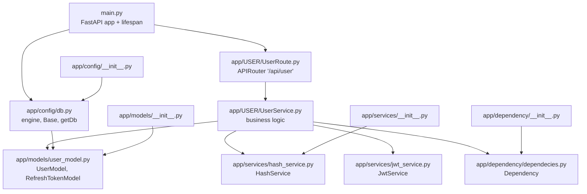
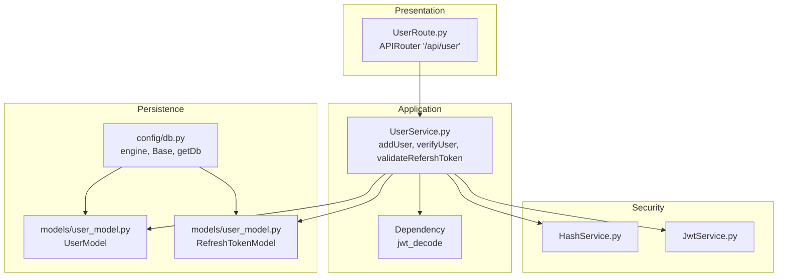
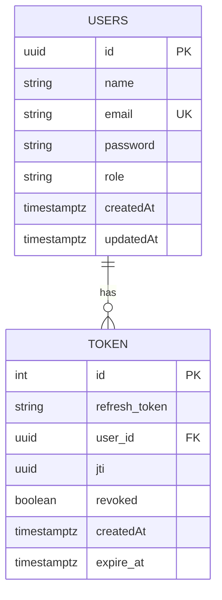
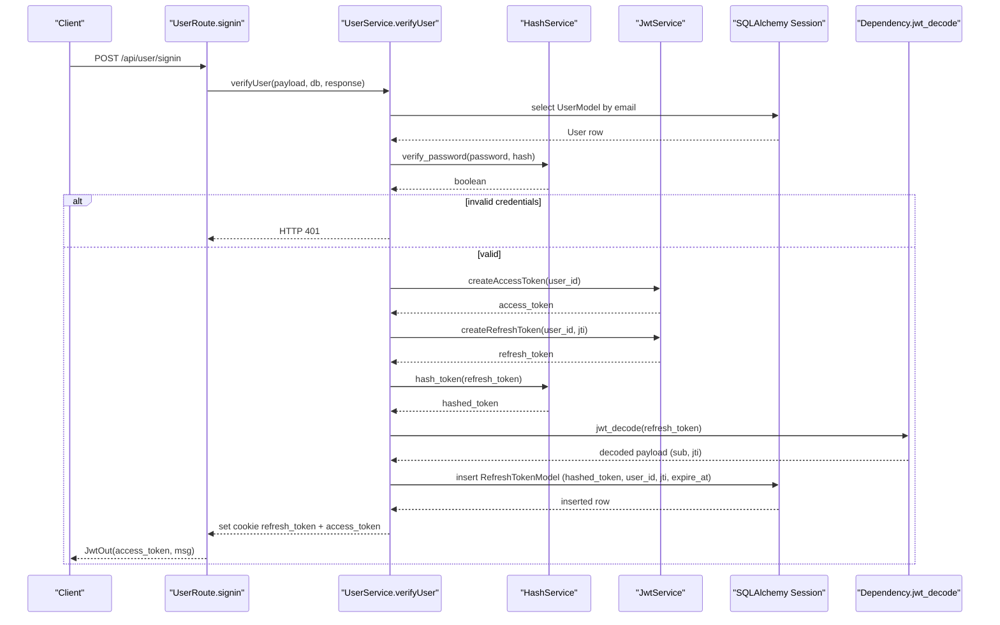
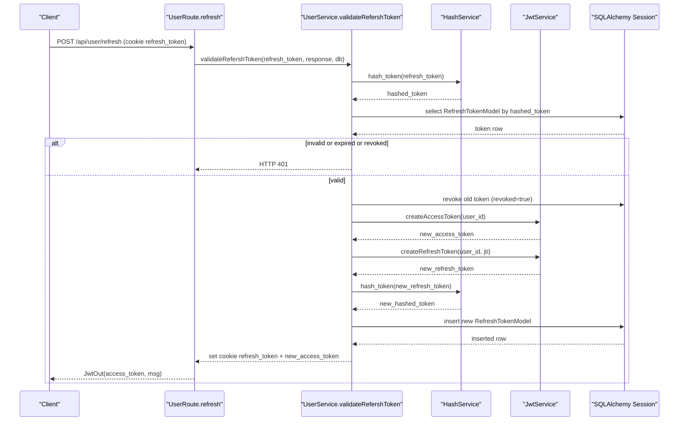
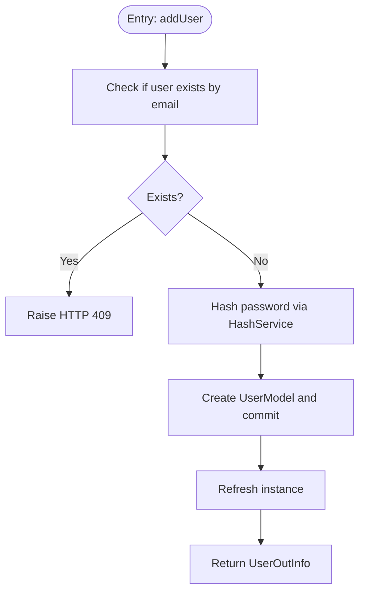
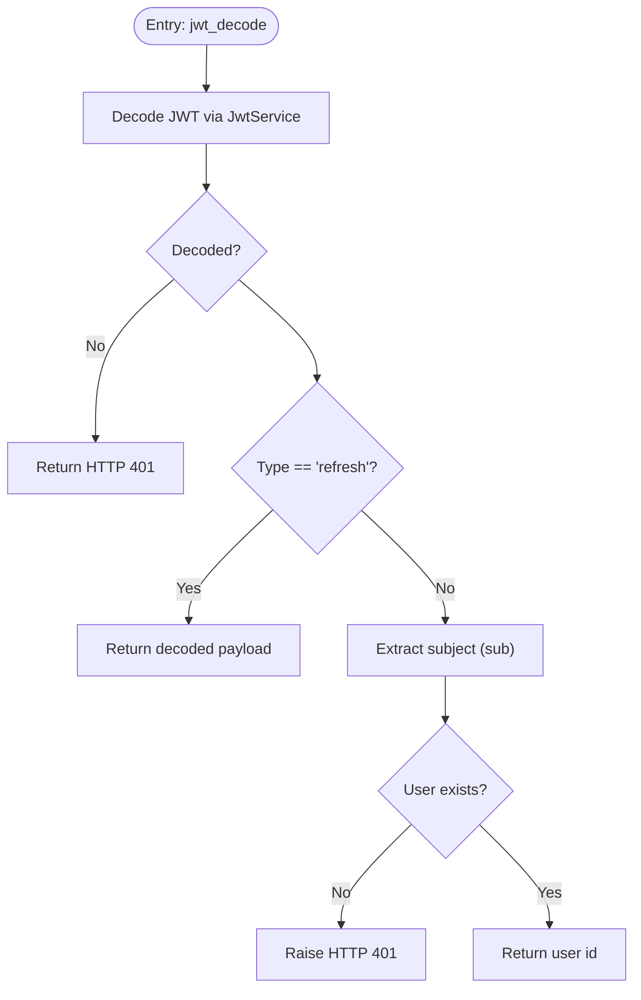
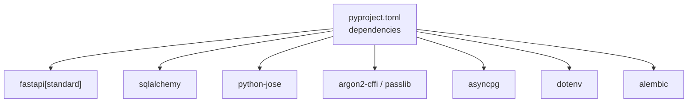

# Service Architecture

<cite>
**Referenced Files in This Document**
- [main.py](file://main.py)
- [docker-compose.yml](file://docker-compose.yml)
- [pyproject.toml](file://pyproject.toml)
- [app/config/db.py](file://app/config/db.py)
- [app/config/__init__.py](file://app/config/__init__.py)
- [app/models/user_model.py](file://app/models/user_model.py)
- [app/models/__init__.py](file://app/models/__init__.py)
- [app/services/hash_service.py](file://app/services/hash_service.py)
- [app/services/jwt_service.py](file://app/services/jwt_service.py)
- [app/services/__init__.py](file://app/services/__init__.py)
- [app/dependency/dependecies.py](file://app/dependency/dependecies.py)
- [app/dependency/__init__.py](file://app/dependency/__init__.py)
- [app/USER/UserPydanticModel.py](file://app/USER/UserPydanticModel.py)
- [app/USER/UserRoute.py](file://app/USER/UserRoute.py)
- [app/USER/UserService.py](file://app/USER/UserService.py)
</cite>

## Table of Contents
1. [Introduction](#introduction)
2. [Project Structure](#project-structure)
3. [Core Components](#core-components)
4. [Architecture Overview](#architecture-overview)
5. [Detailed Component Analysis](#detailed-component-analysis)
6. [Dependency Analysis](#dependency-analysis)
7. [Performance Considerations](#performance-considerations)
8. [Troubleshooting Guide](#troubleshooting-guide)
9. [Conclusion](#conclusion)

## Introduction
This document describes the service architecture of an authentication microservice built with FastAPI, SQLAlchemy, and PostgreSQL. It covers the modular structure, data models, services, routing, and operational setup. The system supports user registration, login, and refresh token flows with secure hashing and JWT-based authentication.

## Project Structure
The project follows a layered and feature-based organization:
- Application entry point initializes the FastAPI app and database lifecycle.
- Configuration defines the asynchronous database engine, base declarative class, and dependency provider for sessions.
- Models define the relational schema for users and refresh tokens within a dedicated schema.
- Services encapsulate hashing and JWT operations.
- Dependencies provide reusable logic for decoding tokens and validating user existence.
- Feature modules (USER) expose routes and orchestrate business logic via services.

**Diagram sources**
- [main.py:1-31](file://main.py#L1-L31)
- [app/config/db.py:1-27](file://app/config/db.py#L1-L27)
- [app/USER/UserRoute.py:1-23](file://app/USER/UserRoute.py#L1-L23)
- [app/USER/UserService.py:1-105](file://app/USER/UserService.py#L1-L105)
- [app/services/hash_service.py:1-20](file://app/services/hash_service.py#L1-L20)
- [app/services/jwt_service.py:1-38](file://app/services/jwt_service.py#L1-L38)
- [app/models/user_model.py:1-34](file://app/models/user_model.py#L1-L34)
- [app/dependency/dependecies.py:1-31](file://app/dependency/dependecies.py#L1-L31)
- [app/config/__init__.py:1-3](file://app/config/__init__.py#L1-L3)
- [app/models/__init__.py:1-3](file://app/models/__init__.py#L1-L3)
- [app/services/__init__.py:1-3](file://app/services/__init__.py#L1-L3)
- [app/dependency/__init__.py:1-2](file://app/dependency/__init__.py#L1-L2)

**Section sources**
- [main.py:1-31](file://main.py#L1-L31)
- [app/config/db.py:1-27](file://app/config/db.py#L1-L27)
- [app/USER/UserRoute.py:1-23](file://app/USER/UserRoute.py#L1-L23)
- [app/USER/UserService.py:1-105](file://app/USER/UserService.py#L1-L105)
- [app/models/user_model.py:1-34](file://app/models/user_model.py#L1-L34)
- [app/services/hash_service.py:1-20](file://app/services/hash_service.py#L1-L20)
- [app/services/jwt_service.py:1-38](file://app/services/jwt_service.py#L1-L38)
- [app/dependency/dependecies.py:1-31](file://app/dependency/dependecies.py#L1-L31)
- [app/config/__init__.py:1-3](file://app/config/__init__.py#L1-L3)
- [app/models/__init__.py:1-3](file://app/models/__init__.py#L1-L3)
- [app/services/__init__.py:1-3](file://app/services/__init__.py#L1-L3)
- [app/dependency/__init__.py:1-2](file://app/dependency/__init__.py#L1-L2)

## Core Components
- FastAPI Application: Initializes the app with a lifespan manager that creates the schema and tables, and handles shutdown cleanup.
- Database Layer: Asynchronous SQLAlchemy engine, declarative base bound to a dedicated schema, and a dependency-provided session factory.
- Models: User entity and refresh token entity with relationships and timestamps.
- Services:
  - HashService: Password hashing and verification using argon2, plus token hashing.
  - JwtService: Access and refresh token creation and decoding with configurable expiration and algorithm.
- Dependencies: Shared logic for JWT decoding and user validation.
- Routes and Business Logic: User registration, sign-in, and refresh token endpoints orchestrated by UserService.

**Section sources**
- [main.py:9-25](file://main.py#L9-L25)
- [app/config/db.py:10-27](file://app/config/db.py#L10-L27)
- [app/models/user_model.py:8-34](file://app/models/user_model.py#L8-L34)
- [app/services/hash_service.py:6-18](file://app/services/hash_service.py#L6-L18)
- [app/services/jwt_service.py:8-38](file://app/services/jwt_service.py#L8-L38)
- [app/dependency/dependecies.py:9-31](file://app/dependency/dependecies.py#L9-L31)
- [app/USER/UserRoute.py:8-23](file://app/USER/UserRoute.py#L8-L23)
- [app/USER/UserService.py:13-105](file://app/USER/UserService.py#L13-L105)

## Architecture Overview
The system uses a clean separation of concerns:
- Presentation: FastAPI routes under /api/user.
- Application: UserService orchestrates business rules and interacts with services and models.
- Persistence: SQLAlchemy ORM models mapped to a dedicated PostgreSQL schema.
- Security: HashService and JwtService handle sensitive operations.

**Diagram sources**
- [app/USER/UserRoute.py:8-23](file://app/USER/UserRoute.py#L8-L23)
- [app/USER/UserService.py:13-105](file://app/USER/UserService.py#L13-L105)
- [app/dependency/dependecies.py:13-31](file://app/dependency/dependecies.py#L13-L31)
- [app/services/hash_service.py:6-18](file://app/services/hash_service.py#L6-L18)
- [app/services/jwt_service.py:8-38](file://app/services/jwt_service.py#L8-L38)
- [app/models/user_model.py:8-34](file://app/models/user_model.py#L8-L34)
- [app/config/db.py:10-27](file://app/config/db.py#L10-L27)

## Detailed Component Analysis

### Data Models
The data layer defines two primary entities:
- UserModel: Stores user identity, credentials, roles, and audit timestamps.
- RefreshTokenModel: Stores hashed refresh tokens, links to users, revocation flag, and expiry.

**Diagram sources**
- [app/models/user_model.py:8-34](file://app/models/user_model.py#L8-L34)

**Section sources**
- [app/models/user_model.py:8-34](file://app/models/user_model.py#L8-L34)

### Authentication Flow: Sign-In
The sign-in process validates credentials, generates access and refresh tokens, stores a hashed refresh token, and sets a secure cookie.

**Diagram sources**
- [app/USER/UserRoute.py:13-15](file://app/USER/UserRoute.py#L13-L15)
- [app/USER/UserService.py:25-62](file://app/USER/UserService.py#L25-L62)
- [app/services/hash_service.py:16-18](file://app/services/hash_service.py#L16-L18)
- [app/services/jwt_service.py:16-31](file://app/services/jwt_service.py#L16-L31)
- [app/dependency/dependecies.py:13-31](file://app/dependency/dependecies.py#L13-L31)
- [app/models/user_model.py:23-34](file://app/models/user_model.py#L23-L34)

**Section sources**
- [app/USER/UserRoute.py:13-15](file://app/USER/UserRoute.py#L13-L15)
- [app/USER/UserService.py:25-62](file://app/USER/UserService.py#L25-L62)
- [app/services/hash_service.py:16-18](file://app/services/hash_service.py#L16-L18)
- [app/services/jwt_service.py:16-31](file://app/services/jwt_service.py#L16-L31)
- [app/dependency/dependecies.py:13-31](file://app/dependency/dependecies.py#L13-L31)
- [app/models/user_model.py:23-34](file://app/models/user_model.py#L23-L34)

### Refresh Token Flow
The refresh endpoint validates a stored hashed refresh token, marks it as revoked, issues new tokens, and updates storage.

**Diagram sources**
- [app/USER/UserRoute.py:17-21](file://app/USER/UserRoute.py#L17-L21)
- [app/USER/UserService.py:65-105](file://app/USER/UserService.py#L65-L105)
- [app/services/hash_service.py:16-18](file://app/services/hash_service.py#L16-L18)
- [app/services/jwt_service.py:24-31](file://app/services/jwt_service.py#L24-L31)
- [app/models/user_model.py:23-34](file://app/models/user_model.py#L23-L34)

**Section sources**
- [app/USER/UserRoute.py:17-21](file://app/USER/UserRoute.py#L17-L21)
- [app/USER/UserService.py:65-105](file://app/USER/UserService.py#L65-L105)
- [app/services/hash_service.py:16-18](file://app/services/hash_service.py#L16-L18)
- [app/services/jwt_service.py:24-31](file://app/services/jwt_service.py#L24-L31)
- [app/models/user_model.py:23-34](file://app/models/user_model.py#L23-L34)

### Registration Flow
Registration checks for existing users, hashes the password, persists the user, and returns a validated response.

**Diagram sources**
- [app/USER/UserService.py:13-23](file://app/USER/UserService.py#L13-L23)
- [app/services/hash_service.py:10-11](file://app/services/hash_service.py#L10-L11)
- [app/models/user_model.py:8-21](file://app/models/user_model.py#L8-L21)

**Section sources**
- [app/USER/UserService.py:13-23](file://app/USER/UserService.py#L13-L23)
- [app/services/hash_service.py:10-11](file://app/services/hash_service.py#L10-L11)
- [app/models/user_model.py:8-21](file://app/models/user_model.py#L8-L21)

### Dependency Validation Logic
The Dependency class decodes JWTs, enforces token type, and verifies user existence in the database.

**Diagram sources**
- [app/dependency/dependecies.py:13-31](file://app/dependency/dependecies.py#L13-L31)
- [app/services/jwt_service.py:34-38](file://app/services/jwt_service.py#L34-L38)
- [app/models/user_model.py:8-21](file://app/models/user_model.py#L8-L21)

**Section sources**
- [app/dependency/dependecies.py:13-31](file://app/dependency/dependecies.py#L13-L31)
- [app/services/jwt_service.py:34-38](file://app/services/jwt_service.py#L34-L38)
- [app/models/user_model.py:8-21](file://app/models/user_model.py#L8-L21)

## Dependency Analysis
External dependencies are declared in the project configuration and include FastAPI, SQLAlchemy, JWT utilities, password hashing, and PostgreSQL driver.

**Diagram sources**
- [pyproject.toml:7-16](file://pyproject.toml#L7-L16)

**Section sources**
- [pyproject.toml:7-16](file://pyproject.toml#L7-L16)

## Performance Considerations
- Asynchronous I/O: The use of an async engine and session minimizes blocking during database operations.
- Indexes: Email uniqueness and indexed fields reduce lookup times for user authentication.
- Token Expiry: Short-lived access tokens and refresh tokens with bounded lifetimes improve security and reduce long-term state maintenance.
- Cookie Security: HttpOnly cookies for refresh tokens mitigate XSS risks.
- Schema Isolation: Dedicated schema helps manage migrations and reduces contention.

[No sources needed since this section provides general guidance]

## Troubleshooting Guide
Common issues and resolutions:
- Database connection failures during startup: The lifespan manager raises a runtime error if schema/table creation fails. Verify DATABASE_URL and permissions.
- Missing environment variables: SECRET is mandatory for JWT operations; missing values cause runtime errors.
- Invalid or expired refresh tokens: The refresh flow rejects missing, revoked, or expired tokens.
- User not found or invalid credentials: Sign-in validates presence and credential correctness before issuing tokens.
- Token decoding errors: JWT decoding exceptions are caught and surfaced as validation errors.

**Section sources**
- [main.py:16-18](file://main.py#L16-L18)
- [app/services/jwt_service.py:13-14](file://app/services/jwt_service.py#L13-L14)
- [app/USER/UserService.py:28-36](file://app/USER/UserService.py#L28-L36)
- [app/USER/UserService.py:68-83](file://app/USER/UserService.py#L68-L83)
- [app/dependency/dependecies.py:16-29](file://app/dependency/dependecies.py#L16-L29)

## Conclusion
The authentication service is structured around clear layers: presentation, application, persistence, and security. It leverages asynchronous database operations, robust token handling, and modular services to deliver a secure and maintainable authentication flow. The architecture supports easy extension for additional features such as role-based access control, audit logging, or multi-factor authentication.