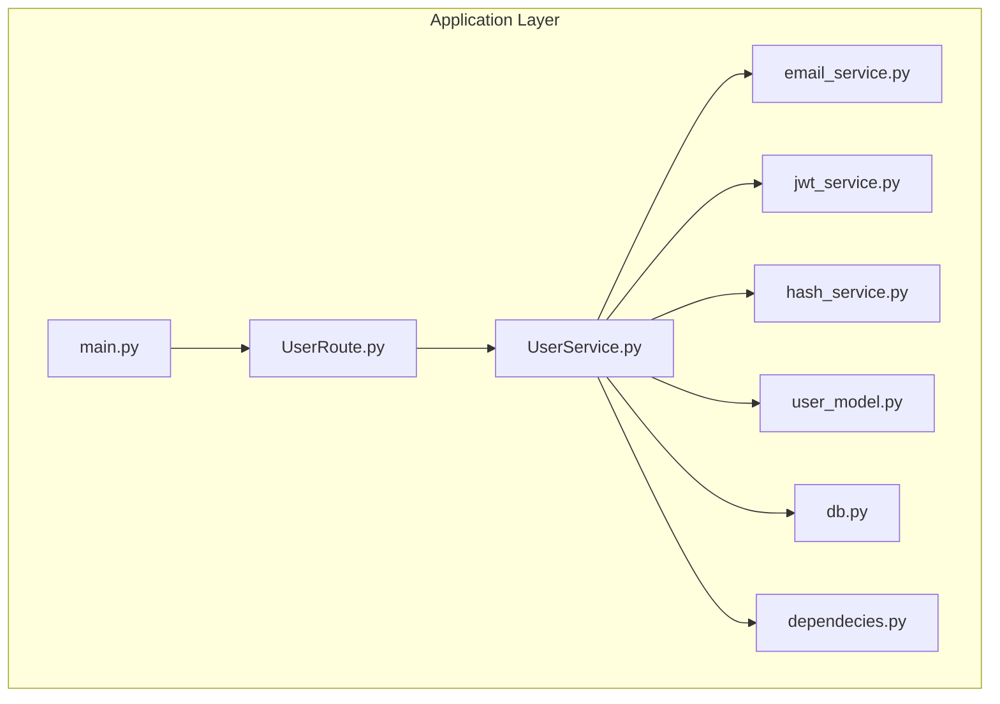
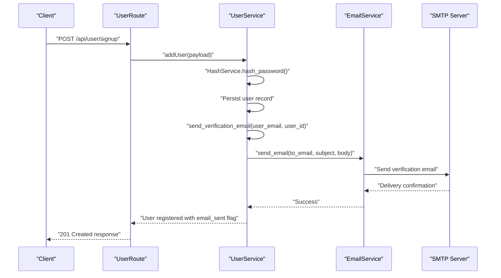
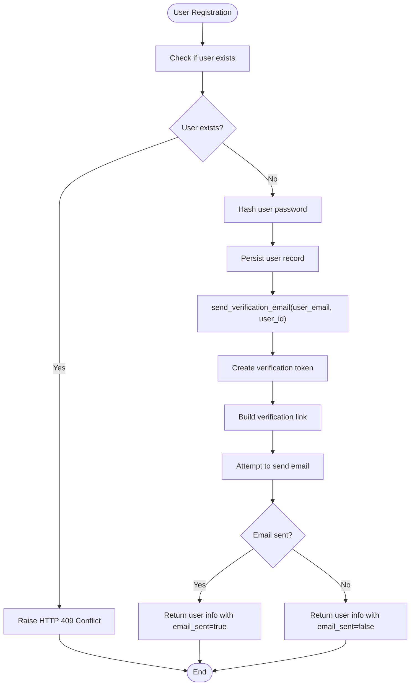
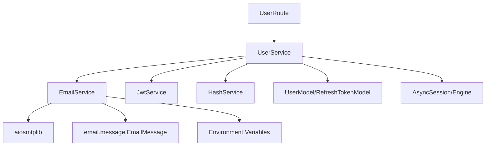

# Email Service

<cite>
**Referenced Files in This Document**
- [email_service.py](file://app/services/email_service.py)
- [UserService.py](file://app/USER/UserService.py)
- [UserRoute.py](file://app/USER/UserRoute.py)
- [jwt_service.py](file://app/services/jwt_service.py)
- [hash_service.py](file://app/services/hash_service.py)
- [user_model.py](file://app/models/user_model.py)
- [db.py](file://app/config/db.py)
- [dependecies.py](file://app/dependency/dependecies.py)
- [main.py](file://main.py)
- [README.md](file://README.md)
- [pyproject.toml](file://pyproject.toml)
- [docker-compose.yml](file://docker-compose.yml)
- [requirements.txt](file://requirements.txt)
</cite>

## Update Summary
**Changes Made**
- Updated SMTP configuration section to reflect environment variable-based setup
- Added new section on Environment Variables Configuration
- Updated troubleshooting guide to include SMTP environment variable configuration
- Enhanced security considerations for environment-based SMTP configuration
- Updated code examples to show environment variable loading approach

## Table of Contents
1. [Introduction](#introduction)
2. [Project Structure](#project-structure)
3. [Core Components](#core-components)
4. [Architecture Overview](#architecture-overview)
5. [Detailed Component Analysis](#detailed-component-analysis)
6. [Environment Variables Configuration](#environment-variables-configuration)
7. [Dependency Analysis](#dependency-analysis)
8. [Performance Considerations](#performance-considerations)
9. [Troubleshooting Guide](#troubleshooting-guide)
10. [Conclusion](#conclusion)

## Introduction
This document provides comprehensive documentation for the Email Service within the authentication microservice. The Email Service is responsible for sending email verification messages to users upon registration and during sign-in attempts when email verification is required. It integrates with the broader authentication flow, leveraging JWT tokens for verification links and ensuring secure asynchronous email delivery via SMTP.

The service is built using FastAPI, with asynchronous SMTP transport through aiosmtplib, and follows a modular architecture that separates concerns across services, models, and configuration layers. **Updated**: The service now uses environment variable-based SMTP configuration instead of hardcoded Gmail settings, providing greater flexibility for different email providers and deployment environments.

## Project Structure
The Email Service resides within the services layer and collaborates with routing, business logic, and configuration modules. The project structure supports clear separation of concerns and enables maintainable development and deployment.



**Diagram sources**
- [main.py:1-40](file://main.py#L1-L40)
- [UserRoute.py:1-33](file://app/USER/UserRoute.py#L1-L33)
- [UserService.py:1-205](file://app/USER/UserService.py#L1-L205)
- [email_service.py:1-29](file://app/services/email_service.py#L1-L29)
- [jwt_service.py:1-43](file://app/services/jwt_service.py#L1-L43)
- [hash_service.py:1-21](file://app/services/hash_service.py#L1-L21)
- [user_model.py:1-37](file://app/models/user_model.py#L1-L37)
- [db.py:1-27](file://app/config/db.py#L1-L27)
- [dependecies.py:1-31](file://app/dependency/dependecies.py#L1-L31)

**Section sources**
- [main.py:1-40](file://main.py#L1-L40)
- [UserRoute.py:1-33](file://app/USER/UserRoute.py#L1-L33)
- [UserService.py:1-205](file://app/USER/UserService.py#L1-L205)
- [email_service.py:1-29](file://app/services/email_service.py#L1-L29)
- [jwt_service.py:1-43](file://app/services/jwt_service.py#L1-L43)
- [hash_service.py:1-21](file://app/services/hash_service.py#L1-L21)
- [user_model.py:1-37](file://app/models/user_model.py#L1-L37)
- [db.py:1-27](file://app/config/db.py#L1-L27)
- [dependecies.py:1-31](file://app/dependency/dependecies.py#L1-L31)

## Core Components
This section outlines the primary components involved in the email verification workflow and their responsibilities.

- **EmailService**: Provides asynchronous email sending capabilities using aiosmtplib with configurable SMTP settings loaded from environment variables.
- **UserService**: Orchestrates user-related operations, including sending verification emails during signup and sign-in flows.
- **UserRoute**: Defines API endpoints for user operations, including email verification.
- **JWT Service**: Generates verification tokens embedded in email links.
- **Hash Service**: Handles token hashing for secure storage and comparison.
- **Models**: Defines user and refresh token data structures persisted in the database.
- **Database Configuration**: Manages async database connections and session lifecycle.
- **Dependencies**: Provides helper utilities for JWT decoding and user validation.

**Section sources**
- [email_service.py:13-29](file://app/services/email_service.py#L13-L29)
- [UserService.py:13-31](file://app/USER/UserService.py#L13-L31)
- [UserService.py:171-204](file://app/USER/UserService.py#L171-L204)
- [UserRoute.py:27-29](file://app/USER/UserRoute.py#L27-L29)
- [jwt_service.py:33-37](file://app/services/jwt_service.py#L33-L37)
- [hash_service.py:16-18](file://app/services/hash_service.py#L16-L18)
- [user_model.py:11-37](file://app/models/user_model.py#L11-L37)
- [db.py:20-27](file://app/config/db.py#L20-L27)
- [dependecies.py:9-31](file://app/dependency/dependecies.py#L9-L31)

## Architecture Overview
The Email Service participates in a layered architecture where FastAPI handles HTTP requests, routing maps endpoints to business logic, and services encapsulate domain-specific operations. The email flow leverages JWT tokens for secure verification links and asynchronous SMTP transport for reliable delivery.



**Diagram sources**
- [UserRoute.py:10-12](file://app/USER/UserRoute.py#L10-L12)
- [UserService.py:13-31](file://app/USER/UserService.py#L13-L31)
- [UserService.py:171-204](file://app/USER/UserService.py#L171-L204)
- [email_service.py:13-29](file://app/services/email_service.py#L13-L29)

**Section sources**
- [UserRoute.py:10-12](file://app/USER/UserRoute.py#L10-L12)
- [UserService.py:13-31](file://app/USER/UserService.py#L13-L31)
- [UserService.py:171-204](file://app/USER/UserService.py#L171-L204)
- [email_service.py:13-29](file://app/services/email_service.py#L13-L29)

## Detailed Component Analysis

### EmailService
The EmailService encapsulates email sending functionality with the following characteristics:
- Asynchronous operation using aiosmtplib for non-blocking SMTP communication.
- Static method signature supports flexible integration with other services.
- **Updated**: SMTP configuration now loads from environment variables (SMTP_USER, SMTP_PASSWORD, SMTP_PORT, SMTP_HOST) instead of hardcoded values.

Implementation highlights:
- Message construction using EmailMessage for structured email content.
- Asynchronous send operation with explicit TLS handshake and credential authentication using environment-provided credentials.

Security and reliability considerations:
- **Updated**: Credentials are now loaded from environment variables, eliminating hardcoded secrets in the codebase.
- Error handling is minimal; exceptions propagate to callers for centralized handling.
- Environment variable loading ensures configuration flexibility across different deployment environments.

**Section sources**
- [email_service.py:13-29](file://app/services/email_service.py#L13-L29)

### UserService Email Integration
UserService coordinates email verification within user lifecycle events:
- On successful signup, attempts to send a verification email and reports delivery status.
- During sign-in, if the user account is unverified, resends the verification email and blocks access until verification completes.
- Generates a JWT verification token with a short expiration window and constructs a verification link.

Key behaviors:
- Uses JWT service to create verification tokens.
- Constructs a base URL and embeds the token in the verification link.
- Attempts to send the email and handles failures gracefully, returning appropriate HTTP responses.



**Diagram sources**
- [UserService.py:13-31](file://app/USER/UserService.py#L13-L31)
- [UserService.py:171-204](file://app/USER/UserService.py#L171-L204)
- [jwt_service.py:33-37](file://app/services/jwt_service.py#L33-L37)

**Section sources**
- [UserService.py:13-31](file://app/USER/UserService.py#L13-L31)
- [UserService.py:171-204](file://app/USER/UserService.py#L171-L204)
- [jwt_service.py:33-37](file://app/services/jwt_service.py#L33-L37)

### UserRoute Email Endpoint
The UserRoute exposes an endpoint for email verification:
- Accepts a verification token as a query parameter.
- Calls the verification logic in UserService to validate and apply the token.
- Returns appropriate HTTP responses based on token validity and user state.

Operational flow:
- Extracts token from query parameters.
- Invokes verification logic and updates user verification status accordingly.

**Section sources**
- [UserRoute.py:27-29](file://app/USER/UserRoute.py#L27-L29)
- [UserService.py:145-170](file://app/USER/UserService.py#L145-L170)

### JWT Service for Verification Tokens
The JWT Service generates short-lived verification tokens used in email links:
- Creates tokens with a dedicated verification type and a brief expiration period.
- Encodes user identity and token type for secure verification workflows.
- Decoding logic validates token integrity and extracts claims.

Security considerations:
- Short expiration reduces risk exposure for verification links.
- Centralized secret management ensures consistent signing and verification.

**Section sources**
- [jwt_service.py:33-37](file://app/services/jwt_service.py#L33-L37)
- [jwt_service.py:39-43](file://app/services/jwt_service.py#L39-L43)

### Hash Service for Token Storage
The Hash Service provides token hashing for secure storage and comparison:
- Uses SHA-256 to hash refresh tokens before persistence.
- Supports consistent token validation against stored hashes.

Integration points:
- Used by UserService to hash tokens for database storage and retrieval.

**Section sources**
- [hash_service.py:16-18](file://app/services/hash_service.py#L16-L18)
- [UserService.py:66](file://app/USER/UserService.py#L66)

### Database Models and Session Management
The database layer defines user and refresh token models and manages async sessions:
- UserModel includes verification status and timestamps.
- RefreshTokenModel stores hashed refresh tokens with revocation and expiration tracking.
- AsyncSession management ensures proper transaction handling and resource cleanup.

**Section sources**
- [user_model.py:11-37](file://app/models/user_model.py#L11-L37)
- [db.py:20-27](file://app/config/db.py#L20-L27)

### Dependencies and Utility Functions
The Dependencies module provides helper functions for JWT decoding and user validation:
- Validates JWT tokens and ensures associated user records exist.
- Supports token-based authorization flows within the service layer.

**Section sources**
- [dependecies.py:9-31](file://app/dependency/dependecies.py#L9-L31)

## Environment Variables Configuration
**New Section**: The Email Service now uses environment variables for SMTP configuration, providing flexibility for different email providers and deployment environments.

### Required Environment Variables
The following environment variables must be configured for email functionality:

| Variable | Description | Default | Required |
|----------|-------------|---------|----------|
| `SMTP_HOST` | SMTP server hostname | `smtp.gmail.com` | No |
| `SMTP_PORT` | SMTP server port | `587` | No |
| `SMTP_USER` | Email address for sending verification emails | - | No |
| `SMTP_PASSWORD` | App password for SMTP authentication | - | No |

### Configuration Examples

#### Gmail Configuration
```env
SMTP_HOST="smtp.gmail.com"
SMTP_PORT=587
SMTP_USER="your-email@gmail.com"
SMTP_PASSWORD="your-app-password"
```

#### Outlook/Hotmail Configuration
```env
SMTP_HOST="smtp-mail.outlook.com"
SMTP_PORT=587
SMTP_USER="your-email@outlook.com"
SMTP_PASSWORD="your-app-password"
```

#### Custom SMTP Server
```env
SMTP_HOST="smtp.yourcompany.com"
SMTP_PORT=465
SMTP_USER="noreply@yourcompany.com"
SMTP_PASSWORD="your-smtp-password"
```

### Security Best Practices
- Store SMTP credentials in environment variables, not in code
- Use app-specific passwords instead of regular account passwords
- Restrict SMTP access to specific IP addresses when possible
- Regularly rotate SMTP credentials
- Use TLS encryption for all SMTP connections

**Section sources**
- [email_service.py:8-11](file://app/services/email_service.py#L8-L11)
- [README.md:318-347](file://README.md#L318-L347)

## Dependency Analysis
The Email Service relies on several core dependencies and interacts with multiple components across the application stack. Understanding these relationships is crucial for maintaining and extending the system.



**Diagram sources**
- [email_service.py:1-29](file://app/services/email_service.py#L1-L29)
- [UserService.py:1-205](file://app/USER/UserService.py#L1-L205)
- [UserRoute.py:1-33](file://app/USER/UserRoute.py#L1-L33)
- [jwt_service.py:1-43](file://app/services/jwt_service.py#L1-L43)
- [hash_service.py:1-21](file://app/services/hash_service.py#L1-L21)
- [user_model.py:1-37](file://app/models/user_model.py#L1-L37)
- [db.py:1-27](file://app/config/db.py#L1-L27)

**Section sources**
- [email_service.py:1-29](file://app/services/email_service.py#L1-L29)
- [UserService.py:1-205](file://app/USER/UserService.py#L1-L205)
- [UserRoute.py:1-33](file://app/USER/UserRoute.py#L1-L33)
- [jwt_service.py:1-43](file://app/services/jwt_service.py#L1-L43)
- [hash_service.py:1-21](file://app/services/hash_service.py#L1-L21)
- [user_model.py:1-37](file://app/models/user_model.py#L1-L37)
- [db.py:1-27](file://app/config/db.py#L1-L27)

## Performance Considerations
- Asynchronous SMTP: Using aiosmtplib ensures non-blocking email delivery, improving overall application responsiveness.
- Token Expiration: Short-lived verification tokens minimize the risk window for intercepted links while reducing server-side token management overhead.
- Database Efficiency: Efficient queries and session management prevent bottlenecks during high-volume registration and verification scenarios.
- Error Propagation: Centralized exception handling prevents cascading failures and allows graceful degradation when email delivery fails.
- **Updated**: Environment variable loading occurs at import time, minimizing runtime overhead for SMTP configuration access.

## Troubleshooting Guide
Common issues and resolutions:
- **SMTP Authentication Failures**: Verify SMTP credentials and network connectivity. Ensure environment variables are correctly configured and accessible to the application process.
- **Email Delivery Failures**: Check recipient email addresses and spam filters. Monitor SMTP server logs for delivery errors.
- **Token Validation Errors**: Confirm JWT secret and algorithm configuration match between generation and verification.
- **Database Connection Issues**: Validate DATABASE_URL and ensure the database is reachable. Review connection pooling settings.
- **CORS and Link Generation**: Ensure BASE_URL is correctly set for constructing verification links.
- **Environment Variable Issues**: Verify that SMTP environment variables are properly exported in the deployment environment.

Operational checks:
- Health endpoint: Use the health check to confirm application readiness.
- Environment variables: Validate all required environment variables are present and correctly formatted.
- **Updated**: Test SMTP connectivity using the application's email sending functionality.

**Section sources**
- [UserService.py:23-31](file://app/USER/UserService.py#L23-L31)
- [UserService.py:46-56](file://app/USER/UserService.py#L46-L56)
- [UserService.py:198-203](file://app/USER/UserService.py#L198-L203)
- [main.py:32-37](file://main.py#L32-L37)

## Conclusion
The Email Service is a critical component of the authentication microservice, enabling secure and reliable email verification workflows. Its integration with JWT-based verification tokens, asynchronous SMTP transport, and robust database models ensures a seamless user experience while maintaining strong security practices.

**Updated**: The service now uses environment variable-based SMTP configuration, replacing hardcoded Gmail settings with a flexible, provider-agnostic approach. This enhancement improves deployment flexibility, supports various email providers, and enhances security by eliminating hardcoded credentials in the codebase. Proper configuration of environment variables and adherence to operational guidelines are essential for reliable email delivery and system stability.