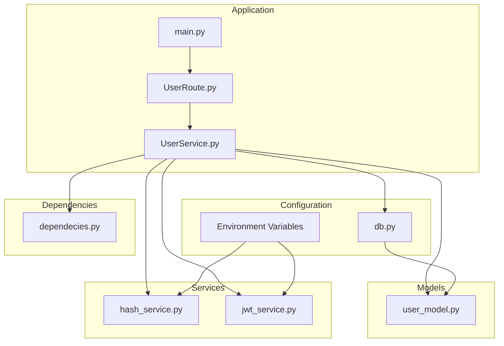
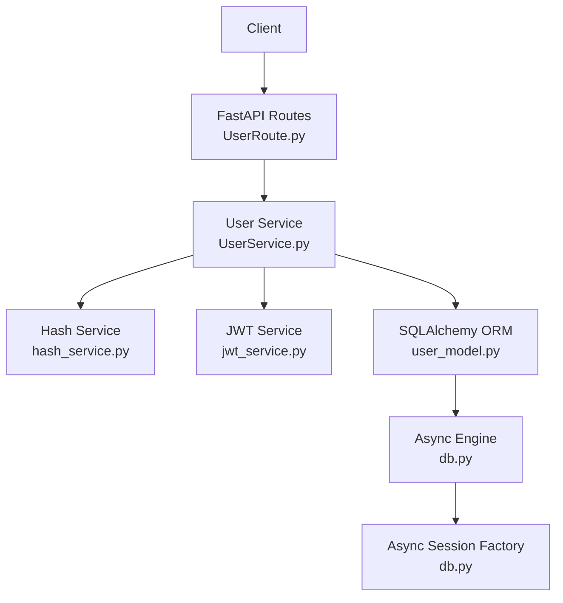
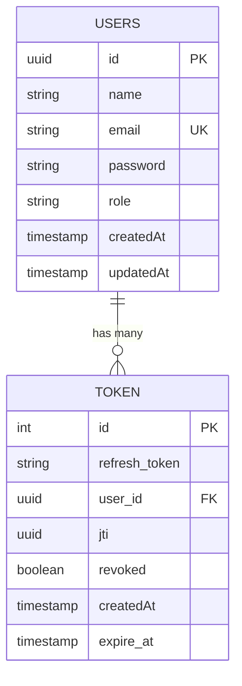
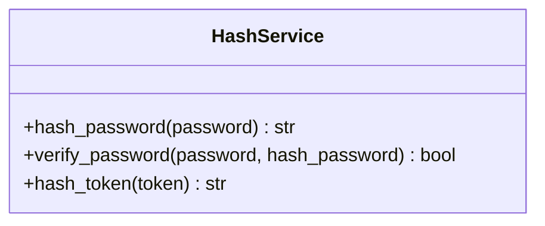
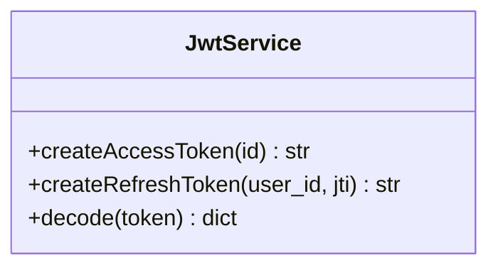
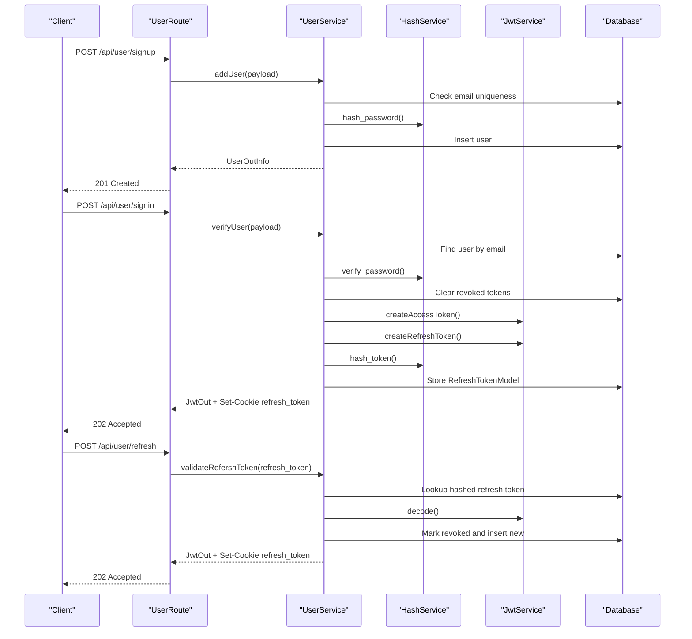
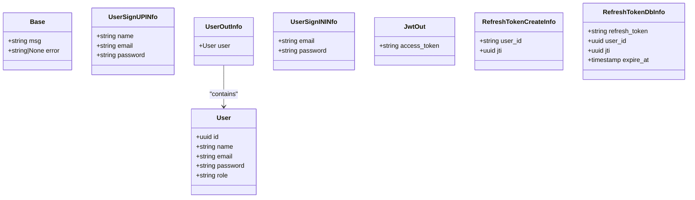
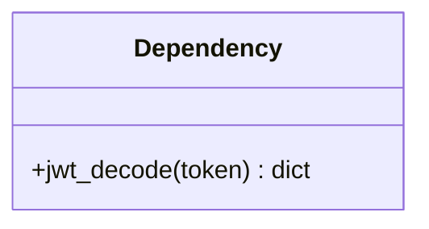
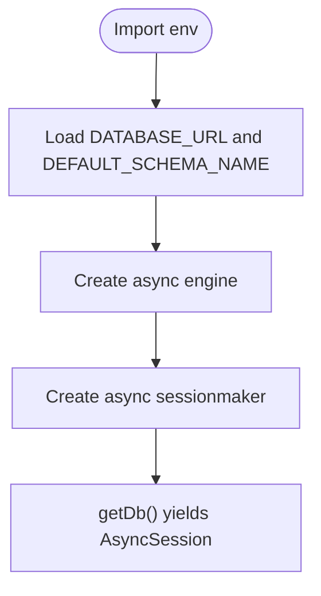
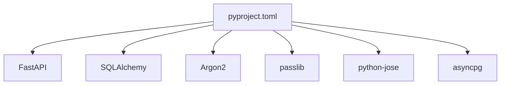

# User Authentication System

<cite>
**Referenced Files in This Document**
- [main.py](file://main.py)
- [app/models/user_model.py](file://app/models/user_model.py)
- [app/services/hash_service.py](file://app/services/hash_service.py)
- [app/services/jwt_service.py](file://app/services/jwt_service.py)
- [app/USER/UserService.py](file://app/USER/UserService.py)
- [app/USER/UserPydanticModel.py](file://app/USER/UserPydanticModel.py)
- [app/USER/UserRoute.py](file://app/USER/UserRoute.py)
- [app/config/db.py](file://app/config/db.py)
- [app/dependency/dependecies.py](file://app/dependency/dependecies.py)
- [pyproject.toml](file://pyproject.toml)
- [docker-compose.yml](file://docker-compose.yml)
</cite>

## Table of Contents
1. [Introduction](#introduction)
2. [Project Structure](#project-structure)
3. [Core Components](#core-components)
4. [Architecture Overview](#architecture-overview)
5. [Detailed Component Analysis](#detailed-component-analysis)
6. [Dependency Analysis](#dependency-analysis)
7. [Performance Considerations](#performance-considerations)
8. [Troubleshooting Guide](#troubleshooting-guide)
9. [Conclusion](#conclusion)

## Introduction
This document describes a user authentication system built with FastAPI, SQLAlchemy, and PostgreSQL. It provides secure user registration, login, and token refresh capabilities using Argon2 password hashing and JWT tokens with refresh tokens stored server-side. The system is containerized for easy deployment and includes database schema initialization and cookie-based refresh token handling.

## Project Structure
The project follows a modular structure organized by concerns:
- Application entry point initializes the FastAPI app, database schema, and routes.
- Models define the database schema for users and refresh tokens.
- Services encapsulate hashing and JWT operations.
- User module handles business logic for sign-up, sign-in, and refresh-token flows.
- Configuration manages database connections and environment variables.
- Dependencies provide reusable utilities for token decoding and validation.
- Packaging and Docker compose define runtime dependencies and local database setup.

**Diagram sources**
- [main.py:1-31](file://main.py#L1-L31)
- [app/USER/UserRoute.py:1-23](file://app/USER/UserRoute.py#L1-L23)
- [app/USER/UserService.py:1-105](file://app/USER/UserService.py#L1-L105)
- [app/models/user_model.py:1-34](file://app/models/user_model.py#L1-L34)
- [app/services/hash_service.py:1-20](file://app/services/hash_service.py#L1-L20)
- [app/services/jwt_service.py:1-38](file://app/services/jwt_service.py#L1-L38)
- [app/config/db.py:1-27](file://app/config/db.py#L1-L27)
- [app/dependency/dependecies.py:1-31](file://app/dependency/dependecies.py#L1-L31)

**Section sources**
- [main.py:1-31](file://main.py#L1-L31)
- [app/USER/UserRoute.py:1-23](file://app/USER/UserRoute.py#L1-L23)
- [app/USER/UserService.py:1-105](file://app/USER/UserService.py#L1-L105)
- [app/models/user_model.py:1-34](file://app/models/user_model.py#L1-L34)
- [app/services/hash_service.py:1-20](file://app/services/hash_service.py#L1-L20)
- [app/services/jwt_service.py:1-38](file://app/services/jwt_service.py#L1-L38)
- [app/config/db.py:1-27](file://app/config/db.py#L1-L27)
- [app/dependency/dependecies.py:1-31](file://app/dependency/dependecies.py#L1-L31)

## Core Components
- Application entry and lifecycle:
  - Initializes database schema and FastAPI app with lifespan hooks.
  - Registers user-related routes under the /api prefix.
- User model and refresh token model:
  - Defines user table and refresh token table with schema scoping and timestamps.
- Hashing service:
  - Provides Argon2-based password hashing and verification.
  - Provides SHA-256 hashing for refresh tokens.
- JWT service:
  - Encodes/decodes JWT tokens with configurable secret, algorithm, and expiry.
- User service:
  - Implements sign-up, sign-in, and refresh-token flows.
  - Manages refresh token storage and cookie setting.
- Pydantic models:
  - Define request/response schemas for user operations and JWT outputs.
- Dependency utilities:
  - Decode JWTs and validate user existence for protected flows.
- Configuration:
  - Asynchronous database engine and session factory.
  - Environment-driven defaults for secrets and expiry.

**Section sources**
- [main.py:9-25](file://main.py#L9-L25)
- [app/models/user_model.py:8-34](file://app/models/user_model.py#L8-L34)
- [app/services/hash_service.py:6-18](file://app/services/hash_service.py#L6-L18)
- [app/services/jwt_service.py:8-38](file://app/services/jwt_service.py#L8-L38)
- [app/USER/UserService.py:13-105](file://app/USER/UserService.py#L13-L105)
- [app/USER/UserPydanticModel.py:10-47](file://app/USER/UserPydanticModel.py#L10-L47)
- [app/dependency/dependecies.py:9-31](file://app/dependency/dependecies.py#L9-L31)
- [app/config/db.py:10-27](file://app/config/db.py#L10-L27)

## Architecture Overview
The system uses a layered architecture:
- Presentation layer: FastAPI routes handle HTTP requests and responses.
- Business logic layer: User service orchestrates operations and interacts with persistence and utilities.
- Persistence layer: SQLAlchemy ORM models map to PostgreSQL tables.
- Utility layer: Hashing and JWT services encapsulate cryptographic operations.
- Configuration layer: Environment variables and database connection management.

**Diagram sources**
- [app/USER/UserRoute.py:8-23](file://app/USER/UserRoute.py#L8-L23)
- [app/USER/UserService.py:13-105](file://app/USER/UserService.py#L13-L105)
- [app/services/hash_service.py:6-18](file://app/services/hash_service.py#L6-L18)
- [app/services/jwt_service.py:8-38](file://app/services/jwt_service.py#L8-L38)
- [app/models/user_model.py:8-34](file://app/models/user_model.py#L8-L34)
- [app/config/db.py:17-27](file://app/config/db.py#L17-L27)

## Detailed Component Analysis

### User Model and Refresh Token Model
- User table:
  - UUID primary key, unique email index, role field, timestamps.
  - Relationship to refresh token model via foreign key.
- Refresh token table:
  - Stores hashed refresh tokens, user association, JTI, revocation flag, and expiry.

**Diagram sources**
- [app/models/user_model.py:8-34](file://app/models/user_model.py#L8-L34)

**Section sources**
- [app/models/user_model.py:8-34](file://app/models/user_model.py#L8-L34)

### Hashing Service
- Password hashing and verification using Argon2.
- SHA-256 hashing for refresh tokens to enable server-side storage and lookup.

**Diagram sources**
- [app/services/hash_service.py:6-18](file://app/services/hash_service.py#L6-L18)

**Section sources**
- [app/services/hash_service.py:6-18](file://app/services/hash_service.py#L6-L18)

### JWT Service
- Creates access tokens with short expiry and refresh tokens with longer expiry.
- Decodes tokens and validates algorithm and secret from environment.

**Diagram sources**
- [app/services/jwt_service.py:8-38](file://app/services/jwt_service.py#L8-L38)

**Section sources**
- [app/services/jwt_service.py:8-38](file://app/services/jwt_service.py#L8-L38)

### User Service Operations
- Sign-up:
  - Checks for existing user by email, hashes password, persists user, returns serialized user.
- Sign-in:
  - Validates credentials, clears revoked tokens, issues access and refresh tokens, stores hashed refresh token, sets refresh cookie.
- Refresh token:
  - Verifies hashed refresh token exists and not revoked/expired, marks old token revoked, issues new tokens, updates DB, sets refresh cookie.

**Diagram sources**
- [app/USER/UserRoute.py:10-21](file://app/USER/UserRoute.py#L10-L21)
- [app/USER/UserService.py:13-105](file://app/USER/UserService.py#L13-L105)
- [app/services/hash_service.py:10-18](file://app/services/hash_service.py#L10-L18)
- [app/services/jwt_service.py:16-31](file://app/services/jwt_service.py#L16-L31)
- [app/models/user_model.py:23-34](file://app/models/user_model.py#L23-L34)

**Section sources**
- [app/USER/UserService.py:13-105](file://app/USER/UserService.py#L13-L105)
- [app/USER/UserRoute.py:10-21](file://app/USER/UserRoute.py#L10-L21)

### Pydantic Models
- Base response wrapper with message and optional error.
- User model with serialization rules.
- Input models for sign-up and sign-in.
- Output model for JWT response.
- Refresh token creation and DB info models.

**Diagram sources**
- [app/USER/UserPydanticModel.py:10-47](file://app/USER/UserPydanticModel.py#L10-L47)

**Section sources**
- [app/USER/UserPydanticModel.py:10-47](file://app/USER/UserPydanticModel.py#L10-L47)

### Dependency Utilities
- Provides JWT decoding and user validation for protected flows.

**Diagram sources**
- [app/dependency/dependecies.py:9-31](file://app/dependency/dependecies.py#L9-L31)

**Section sources**
- [app/dependency/dependecies.py:9-31](file://app/dependency/dependecies.py#L9-L31)

### Configuration and Database
- Asynchronous engine and session factory configured from environment.
- Schema-scoped tables and session dependency injection.

**Diagram sources**
- [app/config/db.py:10-27](file://app/config/db.py#L10-L27)

**Section sources**
- [app/config/db.py:10-27](file://app/config/db.py#L10-L27)

## Dependency Analysis
External dependencies include FastAPI, SQLAlchemy, Argon2, passlib, python-jose, and asyncpg. The application uses environment variables for secrets and configuration.

**Diagram sources**
- [pyproject.toml:7-16](file://pyproject.toml#L7-L16)

**Section sources**
- [pyproject.toml:7-16](file://pyproject.toml#L7-L16)

## Performance Considerations
- Asynchronous database operations reduce blocking during I/O.
- Indexes on email and refresh token fields improve lookup performance.
- Token expiry and revocation minimize long-lived credential exposure.
- Consider connection pooling tuning and query batching for high throughput.

## Troubleshooting Guide
- Database initialization failures:
  - Verify environment variables and schema permissions.
  - Check engine creation and metadata creation steps.
- Missing environment variables:
  - Ensure SECRET and ALGORITHM are set for JWT.
  - Ensure DATABASE_URL is configured for the database.
- Authentication errors:
  - Confirm password hashing scheme compatibility.
  - Validate JWT decoding and token type checks.
- Refresh token issues:
  - Ensure cookie is set with httponly and appropriate domain/path.
  - Verify hashed token lookup and revocation logic.

**Section sources**
- [main.py:16-18](file://main.py#L16-L18)
- [app/services/jwt_service.py:13-14](file://app/services/jwt_service.py#L13-L14)
- [app/USER/UserService.py:37-43](file://app/USER/UserService.py#L37-L43)
- [app/USER/UserService.py:68-84](file://app/USER/UserService.py#L68-L84)

## Conclusion
This authentication system provides a secure foundation for user registration, login, and token refresh using modern cryptographic practices and robust database modeling. The modular design supports maintainability and extensibility, while environment-driven configuration enables flexible deployments.